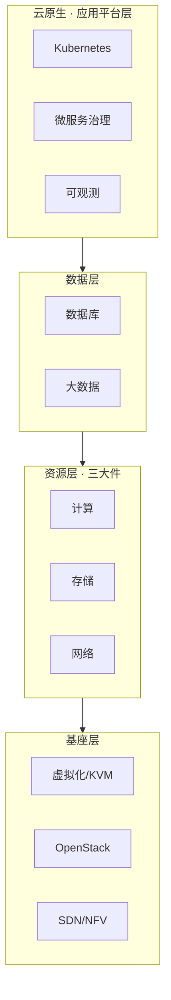

# 云计算：知识全景

> 云计算是本知识体系的第一支柱，覆盖从硬件抽象到应用平台的完整技术栈。四个子域按"从下往上"组织：**基座**回答云从哪里来，**计算·存储·网络**是云上三大件，**数据**承载业务的核心资产，**云原生**定义现代应用的构建方式。

## 四层全景

每一层都有独立的选型逻辑，但理解顺序建议**自底向上**：理解基座的抽象方式，才能看懂三大件产品的设计取舍；理解资源层的边界，才能做好数据层与云原生层的规划。

## 四个子域

| 子域 | 回答的问题 | 入口 |
| --- | --- | --- |
| 🏗️ 云计算基座 | 物理机如何变成资源池？云从哪里来？ | [基座导读](/cloud/foundation/) |
| ⚙️ 计算 · 存储 · 网络 | 算力怎么给、数据放哪、流量怎么走？ | [三大件导读](/cloud/infra/) |
| 🗄️ 数据库 · 大数据 | 为数据访问模式选最优解 | [数据层导读](/cloud/data/) |
| ☸️ 云原生 | 声明式基础设施与现代化应用 | [云原生导读](/cloud/native/) |

## 与人工智能支柱的关系

云计算与 AI 不是割裂的两块：**AI 是长在云上的应用形态，云是 AI 的算力与工程底座**。GPU 资源池、存储带宽、网络拓扑直接决定训练与推理的成本结构——参见 [人工智能支柱](/ai/)。
