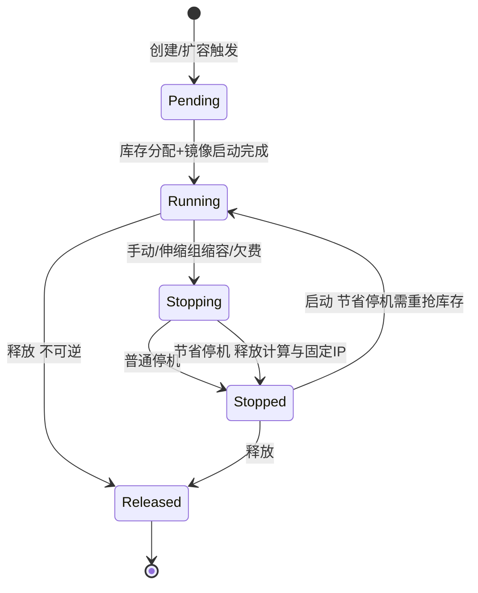
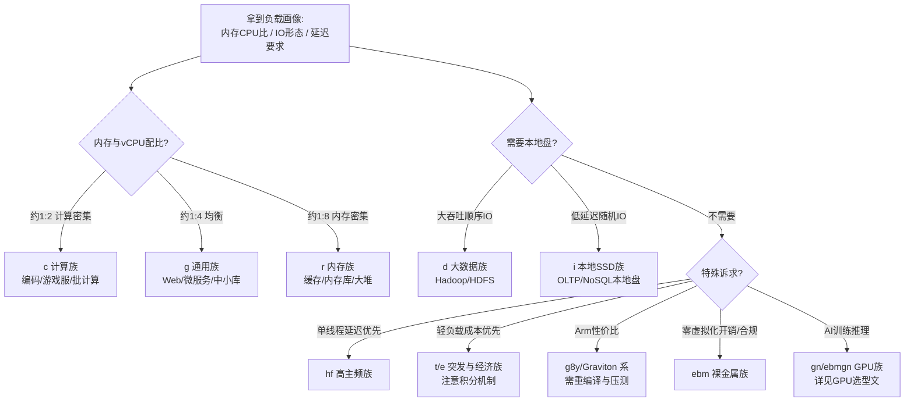
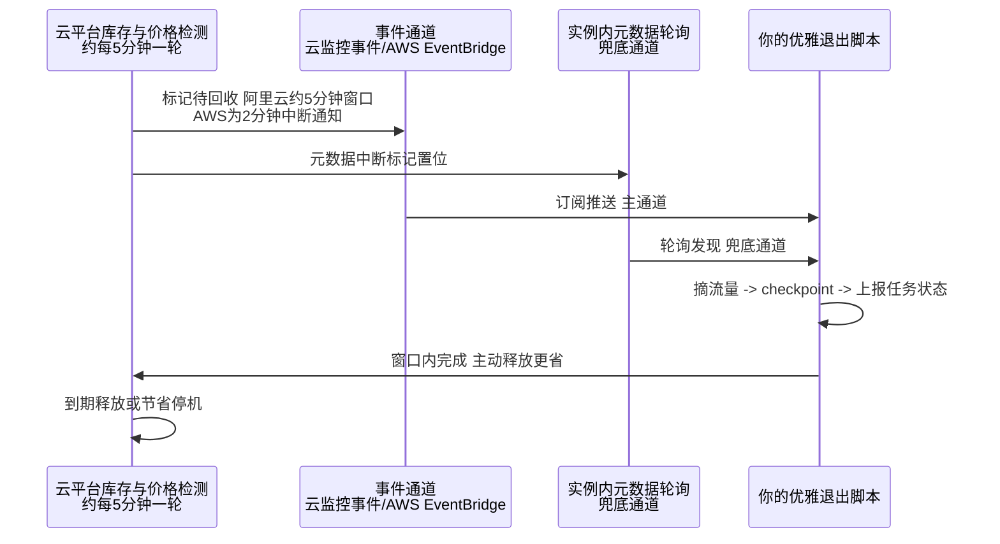
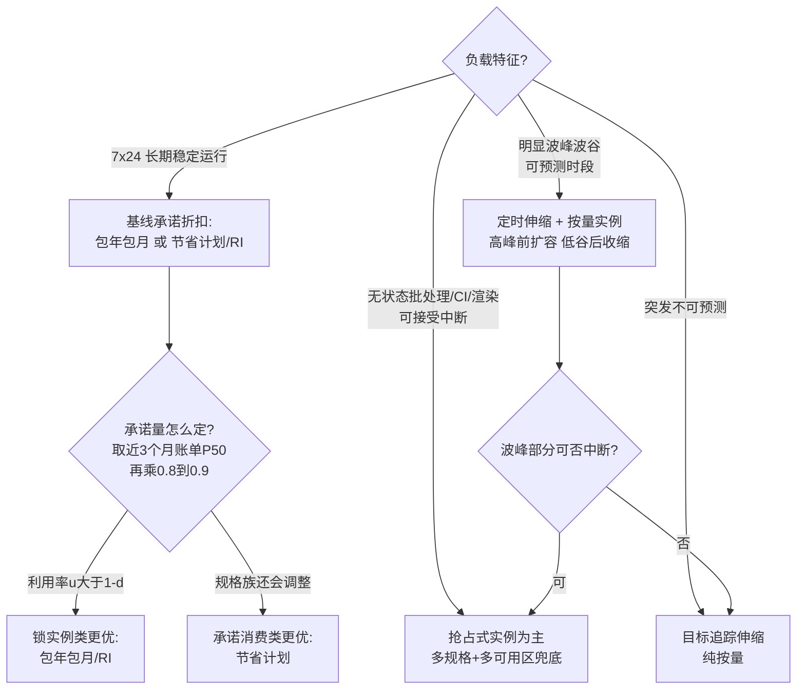
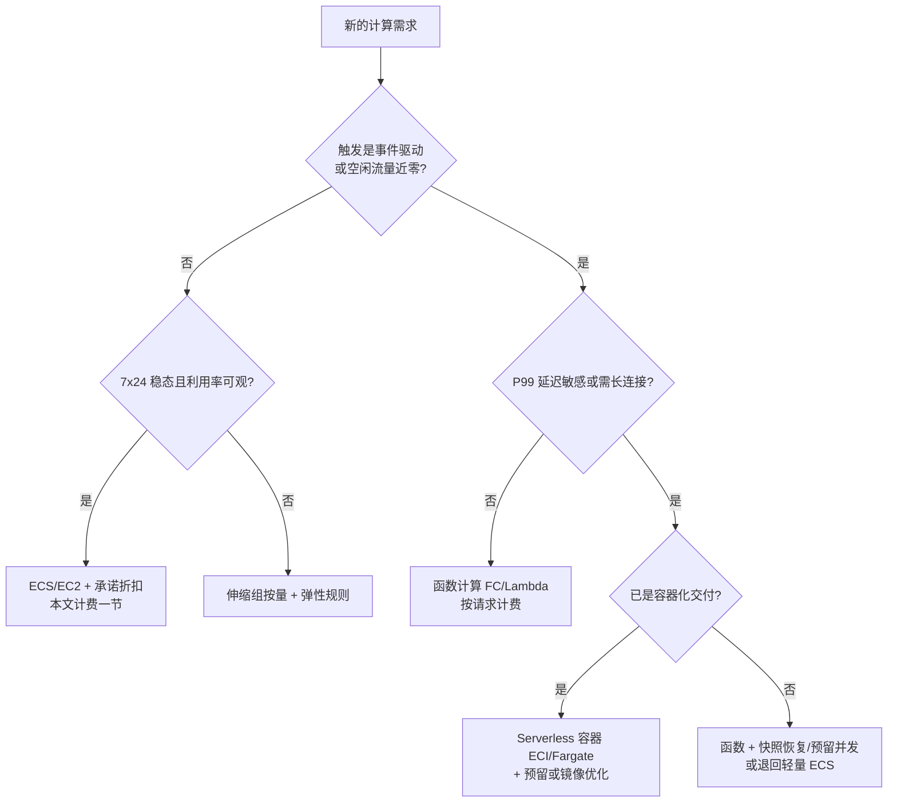
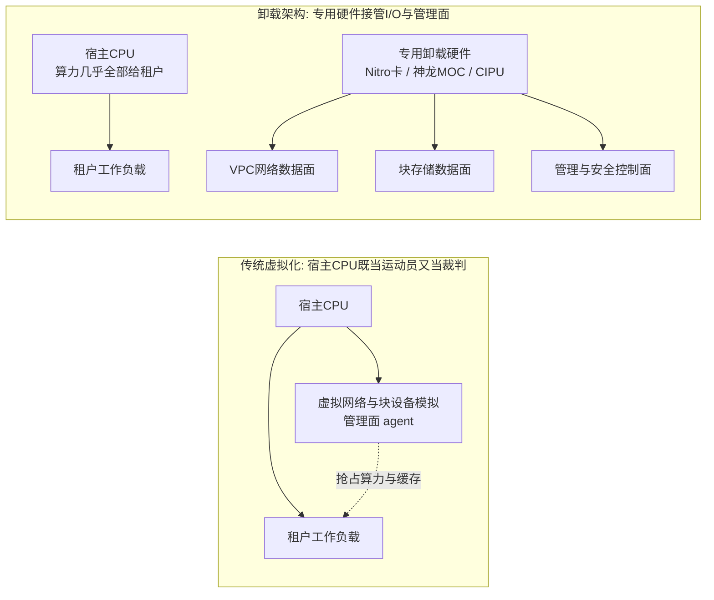

# 弹性计算

> 弹性计算是大多数人云上第一笔账单、也是最大的一笔账单。这篇面向要亲手管 ECS/EC2 账单和容量的人：读完你应该能**一眼读懂任何一朵云的实例型号名**、**按负载画像选对规格族与代际**、**给稳态和波动负载分别挑对计费模式并算清承诺折扣的盈亏平衡点**、**把弹性伸缩配到真正能"弹"起来**、**看懂卸载架构与裸金属/Serverless/GPU 各形态的边界**。我以阿里云 ECS 为主线（辅以 AWS 对照），讲一线怎么用、坑在哪；全文主线是：**实例族谱系 → 计费经济学 → 弹性机制 → 硬件卸载与形态谱系**，四步把"买算力"这件事从玄学变成算术。

## 是什么：把"服务器"变成"按秒计力的资源"

弹性计算（ECS，Elastic Compute Service）本质是**虚拟化的服务器按秒出租**：底层用虚拟化技术（见[虚拟化与云基座](/cloud/foundation/virtualization)）把物理服务器切成 vCPU + 内存的标准规格，配上块存储、镜像、网络，用户通过控制台/API 分钟级拿到一台"机器"，不需要时释放，账单按实际使用计算。

*图源：Wikimedia Commons（[来源页](https://commons.wikimedia.org/wiki/File:Racks_Amravati_Data_Center.jpg)）*

"弹性"二字是和传统 IDC 采购的分水岭：IDC 思维是**按峰值容量买断**，云思维是**按实际需要购买、用完归还**。我见过太多客户把云当 IDC 用——一次性包年买下一堆能支撑大促峰值的机器，平时利用率不到 20%。这正是这篇要解决的问题。

但"弹性"不只是"随开随停"这一个维度。从业这些年，我看到弹性计算的能力边界经历了三次扩展，理解这条线才能理解后面所有选型：

1. **资源弹性**：分钟级创建/释放实例，按秒计费——第一代能力，解决"买断 vs 租用"。
2. **性能弹性**：硬件卸载（Nitro/神龙 CIPU 类）把虚拟化开销从宿主 CPU 搬走，实例性能逼近物理机且可预期——解决"虚拟机损耗与邻居噪声"。
3. **形态弹性**：同一套控制面长出裸金属、Serverless 容器、函数、GPU/spot 池等形态——解决"不同负载粒度用不同计价单位"（按实例、按 Pod、按请求、按卡时）。

### 实例生命周期：计费状态比运行状态更重要

管账单的人要把实例看成一台**状态机**而不是一台"开/关"的机器：创建（Pending）→ 运行中（Running）→ 停止（Stopped）→ 释放（Released），中间还挂着启动中/停止中/过期回收等过渡态。真正影响钱的是"停止态怎么停"：

| 状态 | 计算费用 | 其他费用 | 一线注意点 |
| --- | --- | --- | --- |
| 运行中 | 计 | 云盘/公网/镜像按各自规则计 | 包年包月到期不续费会进入过期回收流程，数据有保留期 |
| 停止（普通停机，VPC 按量实例默认"停机不计费"类行为） | 不计或按停机策略 | 云盘与 EIP 仍计 | 固定公网 IP 在普通停机下保留；这是"临时关停留环境"的常用姿势 |
| 停止（抢占式节省停机） | 不计 | 云盘/EIP/快照保留 | 计算资源与固定公网 IP 被回收，重启要重抢库存，可能失败 |
| 释放 | 不计 | 随实例释放的云盘/公网 IP 一并没了 | 释放不可逆；删环境前先确认数据盘是否勾选了"随实例释放" |

这张状态机解释了一线最常见的两个账单疑问：**"停机了为什么还在扣钱"**（云盘、EIP、快照是独立计费项，停机只停计算）与**"停机后为什么起不来"**（节省停机把容量还给了池子）。把计费项拆开看，下一节的账单分解才有落点。

## 为什么重要：算力选型决定云的三件事

1. **成本**：计算通常占 IaaS 账单的一半以上。规格选错一代、计费模式用错，30%+ 的钱可能白花。
2. **性能**：同一应用跑在不同规格族上，网络 PPS、磁盘 IOPS、甚至 CPU 基频差异可以造成成倍的吞吐差距。
3. **稳定性**：弹性伸缩、多可用区打散、抢占式实例兜底，都建立在"规格和计费会选"的前提上。

## 实例规格族的读法与谱系：一组字母讲清一台机器的性格

### 命名格式

阿里云实例规格命名格式为 `ecs.<规格族>.<规格大小>`（来源：[实例规格分类与命名](https://help.aliyun.com/zh/ecs/user-guide/instance-specification-naming-and-classification)）。规格大小由 `small`、`large`、`<n>xlarge` 表示 vCPU 核数：`large` = 2 vCPU，`xlarge` = 4 vCPU，`2xlarge` = 8 vCPU，以此类推。

拿一个真实型号逐字拆：**`ecs.g8ae.4xlarge`**

| 片段 | 含义 |
| --- | --- |
| `g` | 通用型（general），vCPU:内存 = **1:4** |
| `8` | 第 8 代，数字越大性价比越高 |
| `ae` | AMD 增强型 CPU |
| `4xlarge` | 4 × 4 = **16 vCPU**，按 1:4 配比推得内存 **64 GiB** |

AWS 的读法异曲同工：**`c7gn.2xlarge`** = 计算优化（c）第 7 代（7）Graviton + 网络优化（gn）8 vCPU（来源：[EC2 instance type naming conventions](https://docs.aws.amazon.com/ec2/latest/instancetypes/instance-type-names.html)）。两家首字母语义基本对齐：c=计算、g/m=通用、r=内存、i=存储优化、d=大数据、t=突发、p/g（AWS 的 P、G 系列）=GPU。

### 规格族首字母：本质是内存配比，配比背后是负载画像

| 首字母 | 类型 | vCPU:内存 | 配比逻辑 | 典型负载 |
| --- | --- | --- | --- | --- |
| c | 计算型 | 1:2 | CPU 是瓶颈、工作集小：多花一分钱内存都是浪费 | 视频编码、游戏服务器、批量计算、高并发 Web 前端 |
| g | 通用型 | 1:4 | 多数无状态服务的经验平衡点 | Java/Go 微服务、搜索推广、中小型数据库 |
| r | 内存型 | 1:8 | 数据要留在内存里换延迟：缓存、堆内状态 | Redis/Kafka/ES、内存数据库、Java 大堆 |
| u | 通用算力型 | 1:1/1:2/1:4/1:8 | 共享底座压成本，配比可选 | 价格敏感的中小企业应用、开发测试 |
| d | 大数据型 | 1:4 | 算力和内存中等，但配大量本地 HDD 吞吐 | Hadoop/HBase/HDFS |
| i | 本地 SSD 型 | 1:4 或 1:8 | 要本地 NVMe 的微秒级延迟，接受数据随实例生命周期 | OLTP、NoSQL、ES 本地盘版 |
| hf | 高主频型 | 1:2/1:4/1:8 | 单线程延迟敏感：主频比核数值钱 | 大型多人在线游戏、HPC、量化交易 |
| t / e | 突发型 / 经济型 | 多种 | 平时低载、偶发跑满：用积分制卖"平均算力" | 个人站、测试、轻负载 |

后缀也有规律：`i` = Intel、`a` = AMD、`y` = 自研倚天 710 ARM、`se` = 存储增强、`ne` = 网络增强、`t` = 安全增强（TPM）。异构与裸金属在主体上扩展：`gn` = NVIDIA GPU 计算型，`ebm` = 弹性裸金属，`scc` = 超级计算集群——例如 **`ecs.ebmgn7i.32xlarge`** 读作"裸金属 + GPU 计算型 + 第 7 代 Ampere 架构 A10（24GB 显存）+ 128 vCPU"。

一个容易忽略的指标细节：**x86 实例的 1 个 vCPU 对应一个超线程，ARM 实例的 1 个 vCPU 对应一个物理核**。同标"16 vCPU"，Intel 与倚天 ARM 的实际算力不能直接画等号，跨平台迁移必须重压测。

把"怎么选族"压成一张谱系决策图，我的使用顺序是：先看内存比定族 → 再看本地存储/特殊需求分支 → 最后在同族内按带宽定大小：

### 选型口诀（我的实践版）

**先看内存比定族，再看带宽定规格，最后按代际买新不买旧。**

- 定族：应用的内存/CPU 画像比"应用名称"可靠。Java 应用内存比虚高，很多客户跑在 g 型（1:4）上其实该评估 r 型；计算密集转码放 c 型能省 30% 内存钱。
- 定规格：同族内小规格的网络带宽基线、PPS、连接数上限会明显缩水——大规格之间差 2 倍带宽是常态，小规格常被限到个位数 Gbit/s 甚至更低。吞吐型应用别用"两台小的"凑"一台大的"，网络和磁盘队列模型都不一样（具体指标以[实例规格族文档](https://help.aliyun.com/zh/ecs/user-guide/overview-of-instance-families)为准）。
- 买新不买旧：新代际（如 8 代、9 代，采用 CIPU/专用硬件卸载 I/O）单位算力价格更低、网络存储上限更高。变配注意跨代检查 NVMe 驱动等兼容性。

### 读规格表：四列指标决定"够不够用"

规格族文档里每个型号后面跟着一长串指标，一线真正要逐行核对的是四列，读懂它们能避开八成的"买错规格"：

| 指标列 | 读法 | 踩坑点 |
| --- | --- | --- |
| 网络带宽 基础/突发 | 基础值是可持续值，突发值只允许短时间冲高 | 压测 3 分钟跑满突发带宽就当基线用，上线后长期流量把突发额度耗完即掉速 |
| 网络收发包 PPS | 小包能力上限，与带宽是两条独立限制 | 网关/代理类负载包小量大，带宽没满但 PPS 先到顶，现象是"CPU 不高但丢包/延迟抖" |
| 连接数 | 并发连接跟踪表上限 | 长连接网关、推送服务先看这列，而不是先看带宽 |
| 云盘 IOPS/带宽 基础/突发 | 块存储队列能力，与实例规格绑定 | 数据库类负载按 IOPS 反推规格：盘买得再贵，实例规格的 IOPS 上限才是天花板 |

用法上我的习惯是**先按业务画像估出四个数字（持续带宽、PPS、并发连接、IOPS），再拿规格表逐列比对，取四个约束里最紧的那个定规格**——多数"规格选小了"的事故，都是只比对了 vCPU 和内存两列。

### 代际演进：硬件平台换代就是一次性价比重定价

"买新不买旧"不是情怀，是算术。代际差异来自三层：CPU 平台（频率/核数/缓存）、内存与 IO 子系统（通道数/协议）、卸载硬件（神龙/CIPU/Nitro 的第几代）。用公开规格对比两代通用型（来源：[通用型实例规格族](https://help.aliyun.com/zh/ecs/user-guide/general-purpose-instance-families)、[ECS 第 9 代 Intel 企业级实例](https://www.aliyun.com/daily-act/ecs/ecs-intel-9th)）：

| 维度 | g8i（第 8 代） | g9i（第 9 代） | 工程含义 |
| --- | --- | --- | --- |
| CPU 平台 | Intel Xeon Emerald Rapids / Sapphire Rapids | Intel Xeon 6 Granite Rapids P 核 | 新微架构 IPC + 能效提升 |
| 主频 / 全核睿频 | 不低于 2.7 GHz / 3.2 GHz | 3.2 GHz / 3.6 GHz（单核最大 3.9 GHz） | 单线程延迟与编译类任务直接受益 |
| 内存子系统 | 8 通道 DDR5 | 12 通道 DDR5 | 内存带宽敏感型（分析、缓存）吞吐上限抬升 |
| 底座 | CIPU 架构 | CIPU 架构 + 更强 I/O 引擎 | 网络/存储上限更高、抖动更小 |
| 附加能力 | — | AMX 矩阵加速、TDX 机密计算 | CPU 侧 AI 推理与机密计算可用 |

AWS 侧同一条曲线走得更陡：Graviton3（64 核）→ Graviton4（96 核 Neoverse V2，内存带宽 +75%，R8g 较 R7g 性能至高 +30%）→ Graviton5（192 核、3nm，M9g 较 M8g 计算性能至高 +25%、Web 负载至高 +35%，2025 年底预览、2026 年 M9g/C9g/R9g 陆续正式可用）（来源：[Graviton4 R8g 发布博客](https://aws.amazon.com/blogs/aws/aws-graviton4-based-amazon-ec2-r8g-instances-best-price-performance-in-amazon-ec2/)、[Graviton5 M9g 正式可用](https://aws.amazon.com/blogs/aws/now-available-amazon-ec2-m9g-and-m9gd-instances-powered-by-new-aws-graviton5-processors/)）。

**代际决策的经验规则**：同族跨一代，单位 vCPU 价格通常持平或更低、但单核性能与 IO 上限抬升一档，所以"新业务直接上最新代、存量业务按代际滚动变配"是多数团队的最优策略；唯一的坑是**跨代兼容性**（NVMe 驱动、内核版本、性能计数器工具），变配前在预发环境跑一遍基准。

*图源：Wikimedia Commons（[来源页](https://commons.wikimedia.org/wiki/File:Server_Rack_(54126210834).jpg)）*

## 计费经济学：承诺换折扣的数学

ECS 的计费模式核心是"确定性换折扣"：你把"未来会用多少"的确定性让渡给云厂商，换回单价折扣。阿里云与 AWS 的概念一一对应（来源：[计费方式常见问题](https://help.aliyun.com/knowledge_detail/123158.html)、[按量付费](https://help.aliyun.com/zh/ecs/pay-as-you-go-1)、[节省计划概述](https://help.aliyun.com/zh/ecs/user-guide/overview-of-savings-plans)）：

| 模式（通用名 / 阿里云 / AWS 对应） | 机制 | 折扣量级 | 灵活性 | 承诺对象 |
| --- | --- | --- | --- | --- |
| 包年包月（Subscription / AWS 无直接对应，用 RI+预付近似） | 预付费买时长，仅优惠该实例 | 较大（年期越深） | 最低：锁实例、锁规格族 | 具体实例的时长 |
| 按量付费（Pay-As-You-Go / On-Demand） | 按秒计量、随开随停 | 无（基准价） | 最高 | 无 |
| 节省计划（Savings Plan，AWS 同名） | 承诺每小时消费金额换折扣 | 大（AWS 公开口径：EC2 Instance SP 至高省 72%、Compute SP 至高约 66%；全预付更深） | 高：跨地域/跨规格族/跨 ECS+ECI 抵扣，不限实例数 | 每小时消费金额 |
| 预留实例券（Reserved Instance / RI） | 买"规格券"抵扣按量账单 | 大 | 中：单券可匹配多台（最多 100 台）同规格实例，地域/可用区级可选 | 规格族 + 地域的用量 |
| 抢占式实例（Preemptible / Spot） | 用闲置库存，随市场价波动，可被回收 | 最低至按量价 1 折（省最高约 90%） | 特殊：会中断 | 无（接受中断风险） |

灵活性排序是官方结论：**节省计划 > 预留实例券 > 包年包月**。我的经验组合：稳态基线用包年包月或节省计划承诺掉（承诺消费类方案），弹性波动部分按量 + 伸缩组自动开关，可中断任务全部抢占式。单一模式很难最优，**混用比单模式省 30%+ 是多数稳态业务都适用的量级**；但承诺类方案的前提是负载真的稳——先攒 3 个月账单数据再做承诺决策，否则省下的折扣会被闲置承诺吃回去。

### 账单分解：计算项不是账单的全部

谈"计算账单优化"之前先拆账单，否则优化了计算项却被别的项吃掉。一台典型 ECS/EC2 的月度账单由四类计费项叠加（量级关系以多数 Web 业务的经验分布为例）：

| 计费项 | 计量方式 | 典型占比（无状态 Web 服务） | 独立优化手段 |
| --- | --- | --- | --- |
| 计算（vCPU+内存） | 实例规格 × 时长 × 计费模式折扣 | 约 50%~70% | 本节全部：族/代际/计费模式/伸缩 |
| 块存储 | 云盘类型 × 容量 × 时长（IOPS/吞吐另计档） | 约 10%~25% | 删孤儿盘、降档冷数据盘、快照生命周期 |
| 公网流量 | 按流量或按固定带宽 | 约 5%~30%（出站流量大的业务可反超计算） | CDN 前置、共享带宽包、私网化 |
| 镜像/快照 | 自定义镜像与快照容量 | 通常 <5% | 清理过期镜像与历史快照 |

两个由此而来的实践结论：**其一**，承诺折扣只作用于计算项，别指望节省计划帮你省流量钱——流量型业务（视频、下载站）的第一优化对象是出站流量而不是实例；**其二**，"停机省钱"停的只是第一项，这也是上一节状态机表格要单独列其他费用的原因。做账单评审时我固定按这四行拉一遍月度账单，先看占比再定优化顺序。

### 承诺折扣的盈亏平衡：两个公式

**公式一：锁实例类（包年包月/RI）看利用率。** 设按量单价为 P、承诺折扣率为 d（如省 40% 则 d=0.4）、实例实际运行时间占比为 u。承诺方案成本 = P×(1-d)（全时段买断），按量成本 = P×u。盈亏平衡点 **u\* = 1-d**：折扣 40% 时，利用率高于 60% 才划算；折扣 60% 时，利用率高于 40% 就划算。这解释了为什么"白天跑 8 小时的批处理机"包年必亏——u≈0.33，低于多数年期折扣的平衡点。

**公式二：承诺消费类（节省计划）看 P50 水位。** 节省计划承诺的是"每小时消费 C 元"，超出 C 的部分按量计价、不足 C 的部分照付。所以承诺额应取**历史每小时消费的 P50 再乘一个安全系数（我常用 0.8~0.9）**，而不是 P95：超出的波动部分用按量接住只多花边际钱，而按 P95 承诺意味着半数时间在为空闲承诺付费。承诺期（1 年/3 年）越长折扣越深，也越赌业务形态不变——架构还在大改的团队别签 3 年。

### 抢占式实例的中断与回收机制

这是被问最多、也最容易被误用的一块。以阿里云为例（来源：[什么是抢占式实例](https://help.aliyun.com/zh/ecs/user-guide/what-is-a-spot-instance)）：

- **价格**：随供需在按量原价的 10%~100% 之间浮动；性能与常规实例无异。
- **出价模式**：自动出价（始终跟随市场价，不会因价格被回收，但仍可能因库存被回收）或设置单台上限价（出价低于市场价即回收）。
- **保护期**：选择"设定使用实例 1 小时"，创建后 1 小时内保证不被回收；选"无确定使用时长"则**没有保护期**，可能随时中断（但价格更低）。
- **中断流程**：超出稳定时长后，系统周期性检测（约每 5 分钟一次）出价与市场价、库存；触发回收时实例先进入待回收状态，**约 5 分钟后释放**——这 5 分钟就是留给你的优雅退出窗口。
- **中断模式**：直接释放（实例连同系统盘/数据盘一起没了）或节省停机（计算资源、固定公网 IP 被回收，云盘/EIP/快照保留可恢复；但恢复时可能因库存/价格重启失败）。**中断模式创建后不可改**。
- **限制**：不能转按量/包年包月、不能变配、不支持备案。

AWS 侧机制类似但窗口更短：回收前给 **2 分钟中断通知**，另有"容量再平衡建议"信号在中断风险升高时提前预警；中断动作可配置为终止/停止/休眠（来源：[Spot Instances](https://docs.aws.amazon.com/AWSEC2/latest/UserGuide/using-spot-instances.html)、[Spot 最佳实践](https://docs.aws.amazon.com/AWSEC2/latest/UserGuide/spot-best-practices.html)）。

把中断响应画成时序，三层兜底各自的位置就清楚了：

一线落地三件套，缺一个我都会睡不着：**①云监控订阅中断事件**（AWS 用 EventBridge 捕获 `spot-instance-interruption`）；**②实例内轮询元数据**的中断标记兜底；**③关机脚本**在窗口内完成 checkpoint、摘流量、上报任务状态。配额的分配策略上，AWS 建议 `capacity-optimized`（按可用容量而非最低价选池），并可用 Spot Placement Score 提前验证哪个区/哪组规格拿得到货；阿里云侧对应的做法是伸缩组里**多规格 + 多可用区组合 + 抢占式补偿**，把"单一池子没货"变成小概率事件。

### 混合计费决策树与一个完整算例

**算例**（量级化模型，单价以"按量价 = 1.0"归一，折扣取公开口径的典型区间，月度按 720 小时计）：某电商类业务由四块负载组成——

| 负载 | 规模与时间特征 | 纯按量月成本（归一单位） | 混合策略 | 策略后月成本 |
| --- | --- | --- | --- | --- |
| Web 基线 | 40 台 7x24 | 40×720 = 28800 | 包年包月/节省计划，折扣约 0.5 | 14400 |
| 日间波峰 | +60 台 × 8h × 30 天 | 14400 | 定时伸缩：30% 按量保底 + 70% 换 spot 约 0.3 | 约 7300 |
| 夜间批处理 | 250 台当量 × 6h × 30 天，可 checkpoint | 45000 | 抢占式为主，典型价 0.1~0.3 取 0.2 | 9000 |
| AI 训练 | 8 卡 × 2 周/月，断点续训 | GPU 按量全额 | 抢占式 + 弹性供应组 + checkpoint | 约按量 3 折 |
| 合计（CPU 部分） | — | 88200 | — | 约 30700，**省约 65%** |

这个算例里真正值钱的两行是"夜间批处理"和"波峰可中断部分"：**波动越大、可中断性越强，混合策略相对纯按量的收益越大**；反过来，若四块负载全是 7x24 稳态，混合策略收益就退化为承诺折扣本身（约 30%~50%）。做账单优化时先按这张表把负载分箱，再逐箱套策略，比"全量转包年"或"全量转 spot"都稳。

### 计费模式切换：哪些路是单行道

混合计费不是一次性决策，负载形态变了就要迁移计费模式，而各条转换路的通行规则不对称，操作前必须核对：

| 转换方向 | 是否可行 | 一线注意点 |
| --- | --- | --- |
| 按量 → 包年包月 | 可行 | 常用于"观察期结束转稳态"：先按量跑 1~3 个月攒水位数据，再转承诺 |
| 包年包月 → 按量 | 可行（退款按剩余时长规则折算） | 退款有手续费与上限规则，转前算清残值；大促后缩编常用 |
| 按量/包年包月 → 抢占式 | 不可直接转 | 只能释放重建：意味着 IP、盘的生命周期要重新设计，别在产环境裸操作 |
| 抢占式 → 按量/包年包月 | **不可行**（官方限制） | 这是最常被问错的一条：spot 实例从创建到释放都是 spot，想"转正"只能新建实例迁移负载 |
| 实例级 → 节省计划覆盖 | 不需要转 | 节省计划是账单层抵扣，按量实例自动被抵扣，这也是它灵活性最高的原因 |

由此得出一个架构习惯：**把"可能转 spot 的负载"从设计日就按可中断架构做**（无状态、checkpoint、自动重入队），而不是等账单压力来了再改造——因为转换路是单行道，改造成本发生在重建实例的那一刻。

## 弹性伸缩：真正的瓶颈是"启动时间"

### 伸缩组 + 四类伸缩规则

弹性伸缩（ESS / AWS Auto Scaling）= 伸缩组（定义实例数量边界、健康检查、期望实例数）+ 伸缩配置/启动模板（定义扩容出来的机器长什么样）+ 伸缩规则（定义怎么扩缩）。阿里云支持四类规则（来源：[伸缩规则概述](https://help.aliyun.com/zh/auto-scaling/user-guide/overview-2)）：

| 规则类型 | 行为 | 触发 | 适用 |
| --- | --- | --- | --- |
| 简单规则 | 增加/减少/调至 N 台；单向，一次只能扩或只能缩 | 手动或报警任务（需等冷却时间） | 兜底、演练 |
| 步进规则 | 按报警指标分段执行不同数量的扩缩 | 云监控报警 | 阶梯式负载（如队列深度 50/500/5000 分档） |
| 目标追踪规则 | 选一个指标+目标值，自动算需要几台，把指标维持在目标附近；自动创建配套报警 | 自动 | **多数场景的默认选择**（CPU 50%、QPS/连接数等） |
| 预测规则 | 分析 ≥24 小时历史监控，用机器学习预测未来 48 小时所需实例数，自动调整伸缩组最大/最小边界；不直接扩缩 | 自动（配合定时任务） | 周期性明显的业务；先"只预测不伸缩"验证再放开 |

触发任务分**定时**（可预测的波动时点，如每晚批处理）与**动态**（报警/目标追踪）。注意两类任务相互独立、无优先级，伸缩组同一时刻只执行一个伸缩活动，先触发先生效——官方最佳实践提醒过定时扩容可能与报警任务互相覆盖（来源：[定时与报警任务协同配置](https://help.aliyun.com/zh/auto-scaling/use-cases/use-scheduled-and-event-triggered-tasks)）。指标驱动与预测式的分工，我的经验是：**指标驱动解决"现在不够"，预测式解决"等下不够"**——预测式提前把伸缩组边界抬上去，指标驱动在边界内做细粒度增减，两者叠加才能既快又省。

*图源：Wikimedia Commons（[来源页](https://commons.wikimedia.org/wiki/File:EFTA00002629_-_Server_rack_with_multiple_networking_devices_and_cables_connected_showing_a_typical_data_center_setup.jpg)）*

### 弹性速度：从分钟级到秒级的差距在镜像

伸缩活动触发后，新实例要经历"申请库存 → 装镜像启动 → 初始化脚本 → 健康检查 → 挂入负载均衡"。我遇到的多数"扩容慢"案例，瓶颈都不在云侧交付（通常 1 分钟内），而在**镜像太大、初始化脚本太重、应用启动太慢**：

- **用自定义镜像/启动模板**：把环境预装进镜像，开机脚本只做配置注入（拉配置中心、挂载数据），不做 apt/yum 安装。
- **镜像瘦身**：只留运行时依赖；大镜像在节点冷启动时代价是线性的。
- **负载均衡侧配慢启动/连接渐增**：新实例 JVM 预热期别让流量瞬间打满，否则健康检查刚过就被打挂，触发伸缩组把"不健康"实例误杀重建，形成抖动。
- **与 K8s 的差别**：容器场景弹性下沉到 Pod 层（见 [Kubernetes](/cloud/native/kubernetes)），节点池伸缩要预留 Pod 调度时间；ECI 类"按 Pod 计费的 Serverless 容器"可以直接跳过节点层。

参考架构上，云厂商官方给的就是"多层服务器组各挂一个伸缩组 + 负载均衡分发 + 数据库层不弹"的结构（下图为 AWS 官方示例，阿里云侧同构）：

*图源：AWS 官方文档 Amazon EC2 Auto Scaling benefits（[链接](https://docs.aws.amazon.com/autoscaling/ec2/userguide/auto-scaling-benefits.html)）*

### warm pool：把冷启动成本前置成常驻成本

对启动慢的应用（JVM 大堆、要拉大模型文件、要预热缓存），即使镜像再瘦也有数十秒到分钟级的"不可服务时间"。warm pool（预热池，AWS Auto Scaling 原生支持，来源：[Warm pools](https://docs.aws.amazon.com/autoscaling/ec2/userguide/ec2-auto-scaling-warm-pools.html)）的思路是**提前把实例创建好并停在"已初始化但未接流量"的状态**（Stopped 或 Initialized），扩容时从池里"点亮"而不是从零创建，把分钟级压到秒级。阿里云侧没有完全同名的产品能力，等价做法是伸缩组最小实例数 + 自定义生命周期挂钩在挂入负载均衡前完成预热，或用已停止实例的批量启动。

warm pool 的本质是**用常驻成本换尾延迟**：池子开多大，取决于你能接受多少"为等待付费"。我的经验值是池容量 = 单次扩容步长 × 1~2，再大就是浪费；同时要给池内实例配生命周期上限（定期轮换），避免镜像过期导致"点亮的是旧版本"。

### 库存与供给：弹性的另一半是"拿得到货"

伸缩规则解决"该扩几台"，库存解决"扩得出几台"。公有云的容量是按地域/可用区/规格族分池的共享资源，大促、区域性事件、新代际刚上线时都可能出现单池缺货——"扩不出机器"几乎从不是规则配错，而是供给策略太窄。供给侧的四层武器，按成本从低到高：

| 武器 | 机制 | 成本 | 适用 |
| --- | --- | --- | --- |
| 多规格 + 多可用区组合 | 伸缩配置绑定一组等价规格、伸缩组跨可用区分布，单池缺货自动换池 | 零额外成本 | 所有伸缩组的默认配置，无例外 |
| 抢占式补偿/容量优化分配 | spot 池被回收或缺货时自动补新池实例 | spot 价差 | 可中断负载 |
| 弹性供应组 | 一次性描述"跨计费模式 + 跨规格 + 跨可用区"的目标容量，由平台组合供给 | 按实际实例计费 | 大批量、短周期的算力需求（渲染、批处理） |
| 容量预留 / 可用区级承诺 | 为指定可用区的确定性容量付费或做可用区级承诺（AWS 的 Zonal RI 自带容量保障；阿里云有独立的容量预留能力） | 预留费或承诺约束 | 大促等"必须拿到"的确定性容量 |

经验规则：**确定性要求越高，越要往表格下方走，并且越要提前**——容量预留通常要在大促前数周申请；而日常弹性只靠第一层就够。反过来，把容量预留当日常配置是浪费：它为"峰值那一天"付费，其余时间在睡觉。

### 与负载均衡、K8s 节点池联动

标准参考架构：伸缩组挂 ALB/NLB 后端服务器组 + 多可用区均衡分布 + 健康检查自动替换坏实例 + 定时/目标追踪规则。K8s 里对应的是 ACK 节点池（托管节点池自带伸缩），把 ESS 能力封装进了 Cluster Autoscaler / Karpenter 类机制——选型时别在节点池外再手工挂伸缩组，两套系统互相打架。

节点层伸缩器的两代思路值得单独说，因为它决定了"扩容慢"的锅在谁身上：

| 维度 | Cluster Autoscaler 类 | Karpenter 类 | 工程含义 |
| --- | --- | --- | --- |
| 决策依据 | 模拟调度：有 Pod 因资源不足 Pending 才扩 | 直接读 Pod 的资源请求与标签，按需求"下单" | Karpenter 少一轮模拟，扩容路径更短 |
| 规格选择 | 在预定义的节点池规格列表里选 | 按约束自动组合规格/可用区，天然多规格 | 抢库存能力更强，spot 场景差异明显 |
| 缩容 | 低利用率节点 + Pod 可迁移才缩 | 节点过期/利用率 + 中断感知整合 | Karpenter 对 spot 中断的替换是内建的 |
| 启动加速 | 依赖节点镜像与初始化 | 同样依赖，但可配更激进的预置 | 真正的秒级要靠容器层（镜像懒加载/ECI 类） |

（来源：[Karpenter 官方站点](https://karpenter.sh/)）一句话：**CA 是"节点池的守门员"，Karpenter 是"按订单采购的调度员"**；托管 K8s（ACK 类）两者都提供时，新集群我默认看 Karpenter 类，老集群不折腾。

## Serverless 的边界：什么时候函数比 ECS 香

函数计算类（FC / AWS Lambda）按调用次数 + 执行时长（GB·秒）计费，没有"空闲机器"这个概念。我的判断标准：

- **适合**：事件驱动（OSS 上传触发处理、消息消费）、突发且平时流量近零、胶水任务与定时脚本——空闲时间占比越高，Serverless 越省，极端情况比常驻 ECS 省一个数量级。
- **不适合**：长连接（WebSocket 网关）、单请求秒级以上且内存几 GB 起步的重负载、对冷启动敏感的低延迟 API（P99 会被首次调度的几百毫秒~数秒拉穿）、依赖本地磁盘状态的有任务。
- **中间形态**：Serverless 容器（ECI / AWS Fargate 类），按 Pod 规格计费、免节点运维，冷启动介于 ECS 与函数之间——多数团队把"K8s 节点池弹性"升级成"节点池 + Serverless Pod 混合"，突发溢出走 ECI，是最省心的组合。
- 冷启动优化：预留实例数（消除首次调度）、精简依赖与镜像、运行时选轻的、初始化逻辑移出 handler。

### Serverless 形态谱系：三种计价单位

| 形态 | 典型产品 | 计价单位 | 冷启动量级 | 运维面 | 适合的粒度 |
| --- | --- | --- | --- | --- | --- |
| 函数 | FC / AWS Lambda | 请求数 + GB·秒 | 百毫秒~秒级（优化后亚秒） | 只写代码 | 单事件处理、胶水逻辑 |
| Serverless 容器 | ECI / AWS Fargate | vCPU·秒 + 内存 GiB·秒 | 秒级~十秒级（镜像大小决定） | 写 Pod 定义 | 不想管节点的容器化服务 |
| Serverless 应用引擎 | SAE / App Runner 类 | 实例规格 × 时长（可缩到 0） | 秒级~分钟级（应用启动决定） | 交应用包 | 整套微服务应用的托管 |

三者的分界不在技术而在**计价单位与责任边界**：函数把"并发"抽象掉了（你只声明内存），容器把"节点"抽象掉了（你声明 Pod 规格），应用引擎把"编排"也抽象掉了（你交镜像或代码包）。抽象越深，单价越贵、自由度越低——所以判断顺序应该是：先看负载是否"空闲占比高"，再看团队是否愿意为省下的运维人力付溢价。

函数类的账单公式值得手算一遍建立直觉：**月账单 = 调用次数 × 单次价 + Σ(每次执行时长 × 配置内存 GB) × GB·秒单价**。以 AWS Lambda 公开价为例（量级口径，区域间有差异）：每百万次调用约 0.2 美元、每 GB·秒约 1.67×10⁻⁵ 美元。代入一个典型事件型负载：每天 10 万次调用、平均执行 300ms、配置 512MB，则月调用费约 0.6 美元、月执行费约 3×10⁶×0.3s×0.5GB×1.67×10⁻⁵ ≈ 7.5 美元——**合计约 8 美元/月**，而一台 7x24 的最小规格按量虚拟机公开价量级在每月十几到几十美元且大部分时间在空转。这就是"空闲占比越高 Serverless 越省"的算术本质；反过来把执行时长拉到秒级、内存拉到 GB 级的高频负载代入同一公式，Serverless 就会迅速贵过常驻实例——分界点大致在"单请求成本 × QPS 是否超过等效常驻实例小时价"。

### 冷启动到底慢在哪：拆开四段

AWS 官方把一次冷调用拆成四段：下载代码 → 创建执行环境 → 执行初始化代码 → 执行 handler（来源：[Lambda 运行时环境](https://docs.aws.amazon.com/lambda/latest/dg/lambda-runtime-environment.html)）。前两段是平台侧冷启动，后两段是你自己的代码成本：

*图源：AWS 官方文档 Lambda 性能优化（[链接](https://docs.aws.amazon.com/lambda/latest/dg/lambda-runtime-environment.html)）*

对应的优化手段按段归位，就不容易做无用功：

| 冷启动段 | 优化手段 | 量级效果 |
| --- | --- | --- |
| 下载代码 | 包瘦身、层裁剪、容器镜像换 zip 包 | 包每减一半，该段近似减半 |
| 创建执行环境 | 预留并发 / 预热（provisioned concurrency） | 直接消除，代价是常驻费用 |
| 执行初始化代码 | 初始化移出 handler、连接池复用、快照恢复（SnapStart 类：把初始化后的内存快照直接恢复） | 秒级 Java 冷启动压到亚秒级的关键 |
| 执行 handler | 业务代码本身 | 与冷启动无关，属常态优化 |

预留并发的成本模型要单独提醒：它按"预留的并发数 × 时长"额外计费，**只在"流量有底线"时划算**；流量底线为零的纯事件型负载，用预留并发等于给空气付费。AWS 官方文档里预留并发与账户并发池的关系图值得收藏：

*图源：AWS 官方文档 Lambda 并发配置（[链接](https://docs.aws.amazon.com/lambda/latest/dg/lambda-concurrency.html)）*

最后给一条 Serverless 选型的决策线，把上面的判断压缩成可执行顺序：

## 卸载架构：Nitro 与神龙 CIPU 对"用户"意味着什么

虚拟化与卸载的原理层在[虚拟化与云基座](/cloud/foundation/virtualization)讲过，这里只讲它对买算力的人意味着什么。传统虚拟化的代价是宿主 CPU 要分出相当一部分算力跑虚拟交换机、块设备模拟和管理面（早期经验值是个位数到两位数百分比的 overhead，且随网络包量上升）；卸载架构把这套 I/O 与管理面搬到专用硬件上——AWS 叫 Nitro（Nitro 卡 + Nitro 安全芯片 + Nitro Hypervisor 三件套），阿里云叫神龙架构、第四代起演进为 CIPU（来源：[AWS Nitro System 组件白皮书](https://docs.aws.amazon.com/whitepapers/latest/security-design-of-aws-nitro-system/the-components-of-the-nitro-system.html)、[阿里云 CIPU 详解](https://www.alibabacloud.com/blog/a-detailed-explanation-about-alibaba-cloud-cipu_599183)）。

对用户有三条直接结论，都是选型时能用的：

1. **损耗归零与性能可预期**：卸载之后实例的 CPU 不再被宿主的 I/O 模拟偷走，"标称 vCPU ≈ 拿到手 vCPU"，同规格实例之间的性能方差显著收窄。这也是新一代实例敢把网络/存储上限标到几百 Gbit/s、千万级 IOPS 的前提——这些能力在专用硬件上实现，不和你抢 CPU。
2. **安全边界变硬**：Nitro 的安全设计里有一条对用户很有分量的承诺——控制面对宿主机的管理通道被硬件阻断，云厂商运维人员也无法登录承载你实例的物理机（来源：同白皮书）。做等保/合规审计时，"宿主不可达"是可以写进方案的一句话；阿里云侧对应的是神龙/CIPU 把管理面与租户面物理隔离的同类设计。
3. **裸金属成为"一种实例规格"**：既然虚拟化开销已经不在宿主 CPU 上，那"干脆不虚拟化"就不再牺牲弹性——裸金属实例用同一套卸载硬件提供云盘、VPC、监控，交付却是整台物理机（见下一节）。

下图是 AWS 白皮书里的控制面路径：控制指令从 EC2 控制面经 Nitro Controller API 到达 Nitro Hypervisor，管理面与数据面分离：

*图源：AWS 官方白皮书 The Security Design of the AWS Nitro System（[链接](https://docs.aws.amazon.com/whitepapers/latest/security-design-of-aws-nitro-system/the-components-of-the-nitro-system.html)）*

## 裸金属实例：什么时候必须用

弹性裸金属（ebm 系列 / AWS 的 metal 实例，如 `m7i.metal`）= 物理机整机 + 云的控制面与云盘/网络（来源：[弹性裸金属服务器规格](https://help.aliyun.com/zh/ecs/user-guide/elastic-bare-metal-server-overview)）。它的存在不是为了"性能党"，而是有四类绕不开的场景：

| 场景 | 为什么虚拟机不行 | 裸金属给了什么 |
| --- | --- | --- |
| 嵌套虚拟化 | 自己要在云上跑 Hypervisor/容器虚拟机（如自研虚拟化平台、Kata 类安全容器底座） | 完整硬件虚拟化扩展，无二层虚拟化损耗 |
| 许可与合规绑定 | 某些商业软件许可按物理核/物理机计数，或合规要求独占物理资源 | 独占整机，核数与物理拓扑清晰可审计 |
| 极致与确定性性能 | HPC/高频交易对缓存、NUMA、尾延迟的要求超出共享宿主容忍度 | 无邻居、全缓存全内存带宽归你 |
| 超大规模自建 K8s | 节点数上千时，节点层再套一层虚拟化是纯成本 | 节点即物理机，配合卸载硬件仍有云盘与 VPC |

选型提醒三条：裸金属**交付与扩容速度慢于虚拟机**（物理机库存粒度粗），不适合放进分钟级伸缩组当弹性层；**故障域变大**（一台物理机挂掉 = 你的一大块容量没了），多可用区与上层副本数要重算；计费上裸金属通常只有包年包月/按量、spot 池很浅，别指望拿它做可中断负载。一句话定位：**裸金属是"把 IDC 搬上云"的通道，不是"更猛的虚拟机"**。

### 独占物理资源的第三条路：专有宿主机

"要独占物理机"和"要整台物理机的性能"是两种需求，前者还有比裸金属更轻的选项：**专有宿主机（DDH / AWS Dedicated Hosts）**——买断一台物理机的宿主权，在上面自己摆放任意规格的虚拟机，物理核/插槽拓扑可见。它与裸金属的分界：

| 维度 | 弹性裸金属 | 专有宿主机上的虚拟机 |
| --- | --- | --- |
| 交付形态 | 单台物理机即一个实例 | 一台物理机切多个实例，布局自定 |
| 许可合规 | 按物理机计费的软件直接落地 | 按插槽/物理核计费的软件许可（如部分数据库/商业中间件）可复用宿主许可 |
| 隔离证明 | 天然独占 | 独占宿主，可出具单租户物理机证明 |
| 弹性 | 整机粒度 | 宿主内虚拟机粒度可调整 |

我的经验：**合规审计与 BYOL（自带许可）是专有宿主机的主战场**，纯性能诉求选裸金属，两者都不是就不要为"独占"付溢价——卸载架构时代的共享宿主，性能可预期性已经足够好。

## Arm 化浪潮：Graviton 与倚天的账怎么算

Arm 进入云数据中心主线已经十年，但真正的拐点是云厂商自研 Arm CPU 把"性价比"变成了可量化的武器。截至 2026-09 的公开时间线：

| 平台 | 公开规格与口径 | 状态（截至 2026-09） |
| --- | --- | --- |
| AWS Graviton3 | 64 核 | 7g 系列在售，老代际 |
| AWS Graviton4 | 96 核 Neoverse V2，内存带宽较上代 +75%；R8g 较 R7g 性能至高 +30% | 8g 系列主力在售 |
| AWS Graviton5 | 192 核、3nm；M9g 较 M8g 计算性能至高 +25%、Web 负载至高 +35% | 2025 年底预览，2026 年 M9g/C9g/R9g 陆续正式可用 |
| 阿里倚天 710 | 主频 2.75 GHz，g8y 族 1:4 配比，依托第四代神龙架构 | 8 代 Arm 主力在售 |

（来源：[Graviton4 R8g 发布博客](https://aws.amazon.com/blogs/aws/aws-graviton4-based-amazon-ec2-r8g-instances-best-price-performance-in-amazon-ec2/)、[Graviton5 M9g 正式可用](https://aws.amazon.com/blogs/aws/now-available-amazon-ec2-m9g-and-m9gd-instances-powered-by-new-aws-graviton5-processors/)、[通用型实例规格族 g8y](https://help.aliyun.com/zh/ecs/user-guide/general-purpose-instance-families)）

*图源：Amazon 官方新闻 AWS Graviton5 chip now generally available（[链接](https://www.aboutamazon.com/news/aws/aws-graviton-5-cpu-amazon-ec2)）*

**迁移成本的真实清单**（我经历过的迁移项目里，工作量按这个顺序分布）：

1. **重编译与依赖检查**：解释型语言（Java/Python/Node）大多无痛，但 JNI/native 库、含 x86 汇编的依赖（部分加解密、压缩库的老版本）要换 Arm 构建；容器镜像必须出 `linux/arm64` 变体，CI 加交叉构建或 Arm runner。
2. **运行时参数重调**：JVM 的 GC 与内存参数在 Arm 上默认值不同，大堆服务要重测；NUMA 拓扑差异（Graviton 每核独享 L2、无超线程）会让"按 x86 经验设置的线程池大小"偏保守或偏激进。
3. **性能回归基准**：因为"1 vCPU = 1 物理核"，同 vCPU 数的 Arm 实例并发能力模型与 x86 不同，压测结论不能继承。
4. **生态边角**：少数商业闭源组件无 Arm 版——这一条往往才是迁移的真正 blocker，立项前先做依赖清单扫描。

把迁移做成一张过门清单，逐项打勾再切流量，是我用过最稳的流程：

| 过门项 | 通过标准 | 不通过时的动作 |
| --- | --- | --- |
| 依赖清单扫描 | 全部 native 依赖有 arm64 构建，闭源组件确认支持矩阵 | 替换组件或保留 x86 子集群 |
| 双架构 CI | 镜像同时产出 amd64/arm64 且测试全绿 | 先补交叉构建与 Arm runner |
| 基准对拍 | 同 vCPU 数下核心接口 P99 与吞吐不低于 x86 基线 | 调线程池/GC 参数后复测 |
| 灰度切流 | Arm 池承接 10%→50% 流量，错误率与延迟无偏移 | 回切并分析差异来源 |
| 成本复核 | 实际账单降幅与立项测算偏差在可接受范围 | 修正规格配比后重算 |

**我的判断**：对无状态服务与容器化良好的团队，Arm 是"每年白捡一档性价比"的常规动作，迁移成本一次性、收益持续性；对重 native 依赖、重商业软件许可的栈，等生态再成熟或只在新增业务上用 Arm。2026 年的现状是：新增工作负载默认评估 Arm 已经是多数大厂的成本基线动作，但 x86 新代际（Intel Xeon 6 / AMD EPYC 新平台）在同代际内仍然保有单核频率优势，**高频场景（游戏服、交易）依旧是 hf 类 x86 的地盘**。

## GPU 与异构算力上云：只讲云形态

GPU 实例的定位已经从"图形渲染"彻底转向"AI 训练/推理主力"。弹性计算视角的关键点：GPU 实例（gn/ebm/scc 系列）规格更贵、库存更紧、代际更替更快（Ampere→Hopper→Blackwell），**不适合用 CPU 实例那套"先包年买断再优化"的思路**——训练任务优先抢占式 + 弹性供应组 + checkpoint 断点续训。云形态上有四种"切法"值得知道：

| 云形态 | 机制 | 适用 |
| --- | --- | --- |
| 整卡直通实例 | 一张/多张物理卡独占给实例 | 训练、大模型推理主力 |
| vGPU 切分 | 一张物理卡按显存/算力切片给多个实例 | 小模型推理、开发调试、教学 |
| GPU 共享调度 | 容器层按显存与算力配额共享整卡（K8s 设备插件类） | 推理服务混部提利用率 |
| GPU 竞价/弹性供应 | spot 价拿 GPU + 中断续训 | 可 checkpoint 的训练与离线推理 |

GPU 云的库存经济学比 CPU 残酷一个量级，三条一线规则：

- **GPU spot 的价差更深、中断更猛**：热门卡型的 spot 价可以低到按量价的一到两折，但回收潮来了整池一起没；训练任务没有 checkpoint 就别碰 GPU spot，有了 checkpoint 也要把"恢复队列"做成自动的（中断事件 → 重新入队 → 换池拉起）。
- **代际锁定要趁早**：训练集群对卡型一致性强敏感（集合通信性能依赖同构），一旦立项就按"目标卡型 + 备选卡型"双池规划，别在训练中途被迫换卡型重调并行策略。
- **vGPU 切分只给"不需要整卡"的负载**：切分后显存是硬隔离、算力多是软配额，混跑重负载会互相拖尾；推理服务想提利用率，优先做"多模型共卡 + 显存配额"，而不是把一张卡切给互不相干的业务。

选型（显存、算力、卡间互联与推理成本测算）细节量大管饱，直接看 [GPU 选型与推理成本测算](/ai/infra/inference/gpu-sizing)；集群级的训练组网与容错见 [AI 训练集群](/ai/infra/training)。

*图源：Wikimedia Commons（[来源页](https://commons.wikimedia.org/wiki/File:Nvidia_DGX-B200-HGX.jpg)）*

## 常见坑

| 坑 | 现象 | 根因与对策 |
| --- | --- | --- |
| 拿云当 IDC | 包年买峰值、平时利用率 <20% | 基线承诺 + 弹性伸缩 + 抢占式混合；先看 3 个月真实水位再承诺 |
| 小规格带宽陷阱 | 同族小规格压测吞吐远低于两台合并预期 | 小规格网络带宽/PPS/磁盘 IOPS 基线被限；吞吐型按带宽反推规格 |
| 抢占式做有状态 | 数据库/长任务被回收，数据丢失 | 抢占式只给无状态可中断负载；必须用则节省停机+数据盘不随实例释放+中断三件套 |
| 没接中断通知 | 5 分钟窗口内任务没做 checkpoint | 云监控事件订阅 + 元数据轮询 + 关机脚本三层兜底 |
| 伸缩抖动 | 实例反复扩了又缩、被误杀 | 报警阈值太近目标值、冷却时间太短、新实例未配慢启动；用目标追踪替代手写报警 |
| 扩不出机器 | 大促当天伸缩活动报"库存不足" | 伸缩配置只绑单规格单可用区；多规格 + 跨可用区 + 弹性供应组兜底 |
| 突发实例积分耗尽 | t 系列实例 CPU 被钳制在基线以下 | 积分余额仅支撑短时突发；长期跑满换标准实例更便宜（来源：[突发性能实例概述](https://help.aliyun.com/zh/ecs/user-guide/burst-performance-instance-overview)） |
| 节省停机误解 | 停机"省了钱"但公网 IP 变了/起不来 | 节省停机释放计算资源与固定 IP，重启需重抢库存；对外服务别依赖其固定地址 |
| 跨代变配翻车 | 变配到新代际后起不来或性能反而差 | NVMe 驱动/内核版本不兼容、或老镜像未优化新平台；预发先跑基准再灰度 |
| 跨平台对标翻车 | 按 x86 的 16 vCPU 经验买 Arm 16 vCPU，压测对不上 | x86 的 vCPU 是超线程、Arm 是物理核；跨平台必须重压测重调线程池 |
| warm pool 变成本黑洞 | 预热池常驻几十台"等待中"实例 | 池容量大于扩容步长太多、无生命周期轮换；池 = 步长 ×1~2 并定期重建 |
| 承诺按 P99 签 | 节省计划承诺额高于实际消费，闲置承诺吃掉折扣 | 承诺额取 P50×0.8~0.9；波动部分用按量接住 |
| Serverless 预留滥用 | 为纯事件型负载开预留并发/预留实例，账单反升 | 预留只为"流量底线"付费；底线为零就用纯按请求计费 + 快照优化冷启动 |
| 裸金属当弹性层 | 大促扩容裸金属等不到货 | 裸金属库存粒度粗、交付慢；弹性层用虚拟机/容器，裸金属做稳态底座 |

## 实践观点

- **弹性计算的能力分三层**：会读型号（选对族）、会配账单（选对计费）、会做弹性（伸缩 + Serverless 溢出）。三层都过关，同样的业务能比"无脑包年"省 30% 以上且更稳。
- **所有承诺折扣都是对赌**：你赌负载稳定，赌赢省钱、赌输闲置。承诺量取历史 P50 再打折，永远别按 P99 承诺。
- **中断是特性不是故障**：用抢占式和大规模弹性的前提是应用架构接受"机器随时会没了"。先做无状态化和 checkpoint，再谈降本。
- **代际与架构是两条独立的升级曲线**：代际升级（8→9 代）几乎无成本就该做，架构升级（x86→Arm）是一次性工程投入换持续收益；把两者混在一个变更里做，是多数迁移项目延期的原因。
- **形态选择的终点是计价单位**：按实例、按 Pod、按请求、按卡时——负载的时间粒度越碎，越该用更碎的计价单位；反过来，7x24 稳态负载用 Serverless 计价是为灵活性付冤枉钱。

## 速查：把全文压成一页

| 决策点 | 默认答案 | 例外条件 |
| --- | --- | --- |
| 选族 | 按内存/CPU 比：1:2→c、1:4→g、1:8→r | 本地盘→d/i；单线程延迟→hf；成本极敏感→t/e |
| 选代际 | 最新可购代际 | 强依赖老驱动/内核时先验证 |
| 选 CPU 架构 | 新增负载默认评估 Arm | 重 native/商业闭源依赖、高频单线程场景留 x86 |
| 稳态基线计费 | 节省计划/包年包月，承诺额=P50×0.8~0.9 | 架构大改期先按量观察 3 个月 |
| 波动负载 | 定时/目标追踪伸缩 + 按量 | 波峰可中断则换 spot |
| 可中断负载 | spot + 多规格多可用区 + 中断三件套 | 有状态负载先做无状态化 |
| 扩容慢 | 瘦镜像 + 启动模板 + 慢启动 | 启动本身慢→warm pool/预留 |
| 拿不到货 | 多规格多可用区为默认 | 确定性容量→弹性供应组/容量预留，提前数周 |
| 事件型轻负载 | 函数计算 | P99 敏感/长连接→Serverless 容器或预留 |
| 独占物理机 | 先问是不是合规/许可诉求 | 是→专有宿主机；性能诉求→裸金属 |

## 参考资料

<Refs>

文字来源（均访问 2026-09-05，除标注外）：

- [实例规格分类与命名 - 阿里云 ECS](https://help.aliyun.com/zh/ecs/user-guide/instance-specification-naming-and-classification)
- [ECS 实例规格族的特点和指标数据 - 阿里云](https://help.aliyun.com/zh/ecs/user-guide/overview-of-instance-families)
- [通用型实例规格族 g9i/g8i/g8y - 阿里云](https://help.aliyun.com/zh/ecs/user-guide/general-purpose-instance-families) — 代际 CPU 平台、主频、倚天 710 规格的公开出处
- [什么是抢占式实例 - 阿里云 ECS](https://help.aliyun.com/zh/ecs/user-guide/what-is-a-spot-instance)
- [抢占式实例如何计费 - 阿里云 ECS](https://help.aliyun.com/zh/ecs/spot-instance)
- [感知抢占式实例中断事件与响应 - 阿里云](https://help.aliyun.com/zh/ecs/user-guide/query-the-interruption-events-of-preemptible-instances)
- [按量付费 - 阿里云 ECS](https://help.aliyun.com/zh/ecs/pay-as-you-go-1)
- [计费方式常见问题（包年包月/预留券/节省计划对比）- 阿里云](https://help.aliyun.com/knowledge_detail/123158.html)
- [节省计划概述 - 阿里云 ECS](https://help.aliyun.com/zh/ecs/user-guide/overview-of-savings-plans)
- [突发性能实例概述 - 阿里云 ECS](https://help.aliyun.com/zh/ecs/user-guide/burst-performance-instance-overview)
- [弹性裸金属服务器规格 - 阿里云 ECS](https://help.aliyun.com/zh/ecs/user-guide/elastic-bare-metal-server-overview)
- [什么是弹性容器实例 ECI - 阿里云](https://help.aliyun.com/zh/eci/product-overview/what-is-eci)
- [ECS 第 9 代 Intel 企业级实例商业化 - 阿里云](https://www.aliyun.com/daily-act/ecs/ecs-intel-9th)
- [伸缩规则概述 - 阿里云弹性伸缩 ESS](https://help.aliyun.com/zh/auto-scaling/user-guide/overview-2)
- [目标追踪伸缩规则 - 阿里云 ESS](https://help.aliyun.com/zh/auto-scaling/user-guide/target-tracking-scaling-rules)
- [定时任务与报警任务协同配置最佳实践 - 阿里云 ESS](https://help.aliyun.com/zh/auto-scaling/use-cases/use-scheduled-and-event-triggered-tasks)
- [在伸缩组使用抢占式实例降低成本 - 阿里云 ESS](https://help.aliyun.com/zh/auto-scaling/use-cases/cost-reduction-by-using-preemptible-instances)
- [A Detailed Explanation about Alibaba Cloud CIPU - Alibaba Cloud Blog](https://www.alibabacloud.com/blog/a-detailed-explanation-about-alibaba-cloud-cipu_599183)
- [Amazon EC2 instance type naming conventions - AWS](https://docs.aws.amazon.com/ec2/latest/instancetypes/instance-type-names.html)
- [Using Spot Instances - AWS EC2](https://docs.aws.amazon.com/AWSEC2/latest/UserGuide/using-spot-instances.html)
- [Spot Instance best practices - AWS EC2](https://docs.aws.amazon.com/AWSEC2/latest/UserGuide/spot-best-practices.html)
- [Managing Spot instance interruption - AWS 成本优化白皮书](https://docs.aws.amazon.com/zh_cn/whitepapers/latest/cost-optimization-leveraging-ec2-spot-instances/managing-instance-termination.html)
- [What are Savings Plans - AWS](https://docs.aws.amazon.com/savingsplans/latest/userguide/what-is-savings-plans.html) — Compute/EC2 Instance SP 折扣口径
- [The components of the Nitro System - AWS 白皮书](https://docs.aws.amazon.com/whitepapers/latest/security-design-of-aws-nitro-system/the-components-of-the-nitro-system.html)
- [Warm pools - Amazon EC2 Auto Scaling](https://docs.aws.amazon.com/autoscaling/ec2/userguide/ec2-auto-scaling-warm-pools.html)
- [Amazon EC2 Auto Scaling benefits - AWS](https://docs.aws.amazon.com/autoscaling/ec2/userguide/auto-scaling-benefits.html)
- [Lambda 运行时环境与冷启动分段 - AWS](https://docs.aws.amazon.com/lambda/latest/dg/lambda-runtime-environment.html)
- [Lambda 并发与预留并发 - AWS](https://docs.aws.amazon.com/lambda/latest/dg/lambda-concurrency.html)
- [Under the hood: how AWS Lambda SnapStart optimizes startup latency - AWS Compute Blog](https://aws.amazon.com/blogs/compute/under-the-hood-how-aws-lambda-snapstart-optimizes-function-startup-latency/)
- [AWS Graviton4-based R8g instances - AWS News Blog](https://aws.amazon.com/blogs/aws/aws-graviton4-based-amazon-ec2-r8g-instances-best-price-performance-in-amazon-ec2/)
- [Now available: EC2 M9g/M9gd with Graviton5 - AWS News Blog](https://aws.amazon.com/blogs/aws/now-available-amazon-ec2-m9g-and-m9gd-instances-powered-by-new-aws-graviton5-processors/)
- [AWS Graviton5 chip now generally available - About Amazon](https://www.aboutamazon.com/news/aws/aws-graviton-5-cpu-amazon-ec2)
- [Karpenter 官方站点](https://karpenter.sh/) — 节点自动伸缩的"按订单采购"模型
- [AWS Fargate 开发指南](https://docs.aws.amazon.com/AmazonECS/latest/developerguide/AWS_Fargate.html)

> 涉及具体价格与规格指标，均以各产品官方定价页/文档实时数据为准，本文只给量级与公开口径；算例为归一化模型，用于方法演示而非报价。

图片来源（均访问 2026-09-05）：

- [datacenter-racks.jpg — Racks Amravati Data Center.jpg, Wikimedia Commons](https://commons.wikimedia.org/wiki/File:Racks_Amravati_Data_Center.jpg)
- [server-rack-closeup.jpg — Server Rack (54126210834).jpg, Wikimedia Commons](https://commons.wikimedia.org/wiki/File:Server_Rack_(54126210834).jpg)
- [rack-networking.jpg — EFTA00002629 Server rack with networking devices, Wikimedia Commons](https://commons.wikimedia.org/wiki/File:EFTA00002629_-_Server_rack_with_multiple_networking_devices_and_cables_connected_showing_a_typical_data_center_setup.jpg)
- [gpu-server-dgx.jpg — Nvidia DGX-B200-HGX.jpg, Wikimedia Commons](https://commons.wikimedia.org/wiki/File:Nvidia_DGX-B200-HGX.jpg)
- [nitro-control-architecture.png — AWS 白皮书 The Security Design of the AWS Nitro System 控制架构图](https://docs.aws.amazon.com/whitepapers/latest/security-design-of-aws-nitro-system/the-components-of-the-nitro-system.html)
- [graviton5-chip.jpg — About Amazon 官方新闻 Graviton5 GA 配图](https://www.aboutamazon.com/news/aws/aws-graviton-5-cpu-amazon-ec2)
- [autoscaling-3tier-architecture.png — AWS 官方文档 Auto Scaling benefits 三层架构示意图](https://docs.aws.amazon.com/autoscaling/ec2/userguide/auto-scaling-benefits.html)
- [lambda-invocation-lifecycle.png — AWS 官方文档 Lambda 冷启动分段图](https://docs.aws.amazon.com/lambda/latest/dg/lambda-runtime-environment.html)
- [lambda-provisioned-concurrency.png — AWS 官方文档 Lambda 预留并发示意图](https://docs.aws.amazon.com/lambda/latest/dg/lambda-concurrency.html)

站内相关：[计算·存储·网络导读](/cloud/infra/) · [云存储](/cloud/infra/storage) · [云网络](/cloud/infra/network) · [虚拟化与云基座](/cloud/foundation/virtualization) · [Kubernetes 核心机制](/cloud/native/kubernetes) · [GPU 选型与推理成本测算](/ai/infra/inference/gpu-sizing) · [AI 训练集群](/ai/infra/training)

</Refs>
