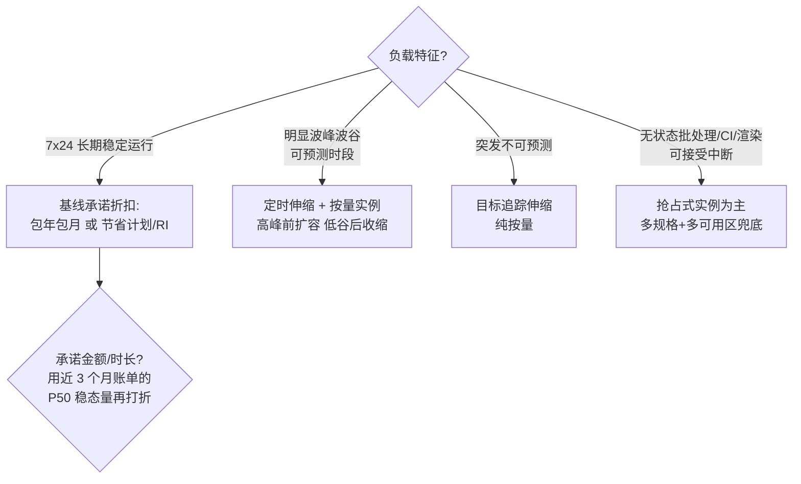

# 弹性计算

> 弹性计算是大多数人云上第一笔账单、也是最大的一笔账单。这篇面向要亲手管 ECS/EC2 账单和容量的人：读完你应该能**一眼读懂任何一朵云的实例型号名**、**给稳态和波动负载分别挑对计费模式**、**把弹性伸缩配到真正能"弹"起来**。我会以阿里云 ECS 为主线（辅以 AWS 对照），讲一线怎么用、坑在哪。

## 是什么：把"服务器"变成"按秒计力的资源"

弹性计算（ECS，Elastic Compute Service）本质是**虚拟化的服务器按秒出租**：底层用虚拟化技术（见[虚拟化与云基座](/cloud/foundation/virtualization)）把物理服务器切成 vCPU + 内存的标准规格，配上块存储、镜像、网络，用户通过控制台/API 分钟级拿到一台"机器"，不需要时释放，账单按实际使用计算。

*图源：Wikimedia Commons（[来源页](https://commons.wikimedia.org/wiki/File:Racks_Amravati_Data_Center.jpg)）*

"弹性"二字是和传统 IDC 采购的分水岭：IDC 思维是**按峰值容量买断**，云思维是**按实际需要购买、用完归还**。我见过太多客户把云当 IDC 用——一次性包年买下一堆能支撑大促峰值的机器，平时利用率不到 20%。这正是这篇要解决的问题。

## 为什么重要：算力选型决定云的三件事

1. **成本**：计算通常占 IaaS 账单的一半以上。规格选错一代、计费模式用错，30%+ 的钱可能白花。
2. **性能**：同一应用跑在不同规格族上，网络 PPS、磁盘 IOPS、甚至 CPU 基频差异可以造成成倍的吞吐差距。
3. **稳定性**：弹性伸缩、多可用区打散、抢占式实例兜底，都建立在"规格和计费会选"的前提上。

## 实例规格族的读法：一组字母讲清一台机器的性格

### 命名格式

阿里云实例规格命名格式为 `ecs.<规格族>.<规格大小>`（来源：[实例规格分类与命名](https://help.aliyun.com/zh/ecs/user-guide/instance-specification-naming-and-classification)）。规格大小由 `small`、`large`、`<n>xlarge` 表示 vCPU 核数：`large` = 2 vCPU，`xlarge` = 4 vCPU，`2xlarge` = 8 vCPU，以此类推。

拿一个真实型号逐字拆：**`ecs.g8ae.4xlarge`**

| 片段 | 含义 |
| --- | --- |
| `g` | 通用型（general），vCPU:内存 = **1:4** |
| `8` | 第 8 代，数字越大性价比越高 |
| `ae` | AMD 增强型 CPU |
| `4xlarge` | 4 × 4 = **16 vCPU**，按 1:4 配比推得内存 **64 GiB** |

AWS 的读法异曲同工：**`c7gn.2xlarge`** = 计算优化（c）第 7 代（7）Graviton + 网络优化（gn）8 vCPU（来源：[EC2 instance type naming conventions](https://docs.aws.amazon.com/ec2/latest/instancetypes/instance-type-names.html)）。两家首字母语义基本对齐：c=计算、g/m=通用、r=内存、i=存储优化、d=大数据、t=突发、p/g（AWS 的 P、G 系列）=GPU。

### 规格族首字母：本质是内存配比

| 首字母 | 类型 | vCPU:内存 | 典型场景 |
| --- | --- | --- | --- |
| c | 计算型 | 1:2 | 数据库、Web 服务器、批量计算、视频编码 |
| g | 通用型 | 1:4 | 通用互联网应用、Java 服务、搜索推广 |
| r | 内存型 | 1:8 | Redis/Kafka/ES、内存数据库、Java 大堆 |
| u | 通用算力型 | 1:1/1:2/1:4/1:8 | 价格敏感的中小企业级应用 |
| d | 大数据型 | 1:4 | Hadoop/HBase/HDFS（配大量本地盘） |
| i | 本地 SSD 型 | 1:4 或 1:8 | OLTP、NoSQL、Elasticsearch 本地盘版 |
| hf | 高主频型 | 1:2/1:4/1:8 | 大型多人在线游戏、HPC |
| t / e | 突发型 / 经济型 | 多种 | 个人站、测试、轻负载 |

后缀也有规律：`i` = Intel、`a` = AMD、`y` = 自研倚天 710 ARM、`se` = 存储增强、`ne` = 网络增强、`t` = 安全增强（TPM）。异构与裸金属在主体上扩展：`gn` = NVIDIA GPU 计算型，`ebm` = 弹性裸金属，`scc` = 超级计算集群——例如 **`ecs.ebmgn7i.32xlarge`** 读作"裸金属 + GPU 计算型 + 第 7 代 Ampere 架构 A10（24GB 显存）+ 128 vCPU"。

一个容易忽略的指标细节：**x86 实例的 1 个 vCPU 对应一个超线程，ARM 实例的 1 个 vCPU 对应一个物理核**。同标"16 vCPU"，Intel 与倚天 ARM 的实际算力不能直接画等号，跨平台迁移必须重压测。

*图源：Wikimedia Commons（[来源页](https://commons.wikimedia.org/wiki/File:Server_Rack_(54126210834).jpg)）*

### 选型口诀（我的实践版）

**先看内存比定族，再看带宽定规格，最后按代际买新不买旧。**

- 定族：应用的内存/CPU 画像比"应用名称"可靠。Java 应用内存比虚高，很多客户跑在 g 型（1:4）上其实该评估 r 型；计算密集转码放 c 型能省 30% 内存钱。
- 定规格：同族内小规格的网络带宽基线、PPS、连接数上限会明显缩水——大规格之间差 2 倍带宽是常态，小规格常被限到个位数 Gbit/s 甚至更低。吞吐型应用别用"两台小的"凑"一台大的"，网络和磁盘队列模型都不一样（具体指标以[实例规格族文档](https://help.aliyun.com/zh/ecs/user-guide/overview-of-instance-families)为准）。
- 买新不买旧：新代际（如 8 代、9 代，采用 CIPU/专用硬件卸载 I/O）单位算力价格更低、网络存储上限更高。变配注意跨代检查 NVMe 驱动等兼容性。

## 计费与成本模型：五种模式一张表

ECS 的计费模式核心是"确定性换折扣"。阿里云与 AWS 的概念一一对应（来源：[计费方式常见问题](https://help.aliyun.com/knowledge_detail/123158.html)、[按量付费](https://help.aliyun.com/zh/ecs/pay-as-you-go-1)）：

| 模式（通用名 / 阿里云 / AWS 对应） | 机制 | 折扣量级 | 灵活性 |
| --- | --- | --- | --- |
| 包年包月（Subscription / AWS 无直接对应，用 RI+预付近似） | 预付费买时长，仅优惠该实例 | 较大 | 最低：锁实例、锁规格族 |
| 按量付费（Pay-As-You-Go / On-Demand） | 按秒计量、随开随停 | 无（基准价） | 最高 |
| 节省计划（Savings Plan，AWS 同名） | 承诺每小时消费金额换折扣 | 大（全预付更深） | 高：跨地域/跨规格族/跨 ECS+ECI 抵扣，不限实例数 |
| 预留实例券（Reserved Instance / RI） | 买"规格券"抵扣按量账单 | 大 | 中：单券可匹配多台（最多 100 台）同规格实例，地域/可用区级可选 |
| 抢占式实例（Preemptible / Spot） | 用闲置库存，随市场价波动，可被回收 | 最低至按量价 1 折（省最高约 90%） | 特殊：会中断 |

灵活性排序是官方结论：**节省计划 > 预留实例券 > 包年包月**。我的经验组合：稳态基线用包年包月或节省计划承诺掉（承诺消费类方案），弹性波动部分按量 + 伸缩组自动开关，可中断任务全部抢占式。单一模式很难最优，**混用比单模式省 30%+ 是多数稳态业务都适用的量级**；但承诺类方案的前提是负载真的稳——先攒 3 个月账单数据再做承诺决策，否则省下的折扣会被闲置承诺吃回去。

### 抢占式实例的中断与回收机制

这是被问最多、也最容易被误用的一块。以阿里云为例（来源：[什么是抢占式实例](https://help.aliyun.com/zh/ecs/user-guide/what-is-a-spot-instance)）：

- **价格**：随供需在按量原价的 10%~100% 之间浮动；性能与常规实例无异。
- **出价模式**：自动出价（始终跟随市场价，不会因价格被回收，但仍可能因库存被回收）或设置单台上限价（出价低于市场价即回收）。
- **保护期**：选择"设定使用实例 1 小时"，创建后 1 小时内保证不被回收；选"无确定使用时长"则**没有保护期**，可能随时中断（但价格更低）。
- **中断流程**：超出稳定时长后，系统周期性检测（约每 5 分钟一次）出价与市场价、库存；触发回收时实例先进入待回收状态，**约 5 分钟后释放**——这 5 分钟就是留给你的优雅退出窗口。
- **中断模式**：直接释放（实例连同系统盘/数据盘一起没了）或节省停机（计算资源、固定公网 IP 被回收，云盘/EIP/快照保留可恢复；但恢复时可能因库存/价格重启失败）。**中断模式创建后不可改**。
- **限制**：不能转按量/包年包月、不能变配、不支持备案。

AWS 侧机制类似但窗口更短：回收前给 **2 分钟中断通知**，另有"容量再平衡建议"信号在中断风险升高时提前预警；中断动作可配置为终止/停止/休眠（来源：[Spot Instances](https://docs.aws.amazon.com/AWSEC2/latest/UserGuide/using-spot-instances.html)、[Spot 最佳实践](https://docs.aws.amazon.com/AWSEC2/latest/UserGuide/spot-best-practices.html)）。

一线落地三件套，缺一个我都会睡不着：**①云监控订阅中断事件**（AWS 用 EventBridge 捕获 `spot-instance-interruption`）；**②实例内轮询元数据**的中断标记兜底；**③关机脚本**在窗口内完成 checkpoint、摘流量、上报任务状态。配额的分配策略上，AWS 建议 `capacity-optimized`（按可用容量而非最低价选池），并可用 Spot Placement Score 提前验证哪个区/哪组规格拿得到货。

## 弹性伸缩：真正的瓶颈是"启动时间"

### 伸缩组 + 四类伸缩规则

弹性伸缩（ESS / AWS Auto Scaling）= 伸缩组（定义实例数量边界、健康检查、期望实例数）+ 伸缩配置/启动模板（定义扩容出来的机器长什么样）+ 伸缩规则（定义怎么扩缩）。阿里云支持四类规则（来源：[伸缩规则概述](https://help.aliyun.com/zh/auto-scaling/user-guide/overview-2)）：

| 规则类型 | 行为 | 触发 | 适用 |
| --- | --- | --- | --- |
| 简单规则 | 增加/减少/调至 N 台；单向，一次只能扩或只能缩 | 手动或报警任务（需等冷却时间） | 兜底、演练 |
| 步进规则 | 按报警指标分段执行不同数量的扩缩 | 云监控报警 | 阶梯式负载（如队列深度 50/500/5000 分档） |
| 目标追踪规则 | 选一个指标+目标值，自动算需要几台，把指标维持在目标附近；自动创建配套报警 | 自动 | **多数场景的默认选择**（CPU 50%、QPS/连接数等） |
| 预测规则 | 分析 ≥24 小时历史监控，用机器学习预测未来 48 小时所需实例数，自动调整伸缩组最大/最小边界；不直接扩缩 | 自动（配合定时任务） | 周期性明显的业务；先"只预测不伸缩"验证再放开 |

触发任务分**定时**（可预测的波动时点，如每晚批处理）与**动态**（报警/目标追踪）。注意两类任务相互独立、无优先级，伸缩组同一时刻只执行一个伸缩活动，先触发先生效——官方最佳实践提醒过定时扩容可能与报警任务互相覆盖（来源：[定时与报警任务协同配置](https://help.aliyun.com/zh/auto-scaling/use-cases/use-scheduled-and-event-triggered-tasks)）。

*图源：Wikimedia Commons（[来源页](https://commons.wikimedia.org/wiki/File:EFTA00002629_-_Server_rack_with_multiple_networking_devices_and_cables_connected_showing_a_typical_data_center_setup.jpg)）*

### 弹性速度：从分钟级到秒级的差距在镜像

伸缩活动触发后，新实例要经历"申请库存 → 装镜像启动 → 初始化脚本 → 健康检查 → 挂入负载均衡"。我遇到的多数"扩容慢"案例，瓶颈都不在云侧交付（通常 1 分钟内），而在**镜像太大、初始化脚本太重、应用启动太慢**：

- **用自定义镜像/启动模板**：把环境预装进镜像，开机脚本只做配置注入（拉配置中心、挂载数据），不做 apt/yum 安装。
- **镜像瘦身**：只留运行时依赖；大镜像在节点冷启动时代价是线性的。
- **负载均衡侧配慢启动/连接渐增**：新实例 JVM 预热期别让流量瞬间打满，否则健康检查刚过就被打挂，触发伸缩组把"不健康"实例误杀重建，形成抖动。
- **与 K8s 的差别**：容器场景弹性下沉到 Pod 层（见 [Kubernetes](/cloud/native/kubernetes)），节点池伸缩要预留 Pod 调度时间；ECI 类"按 Pod 计费的 Serverless 容器"可以直接跳过节点层。

### 与负载均衡、K8s 节点池联动

标准参考架构：伸缩组挂 ALB/NLB 后端服务器组 + 多可用区均衡分布 + 健康检查自动替换坏实例 + 定时/目标追踪规则。K8s 里对应的是 ACK 节点池（托管节点池自带伸缩），把 ESS 能力封装进了 Cluster Autoscaler / Karpenter 类机制——选型时别在节点池外再手工挂伸缩组，两套系统互相打架。

## Serverless 的边界：什么时候函数比 ECS 香

函数计算类（FC / AWS Lambda）按调用次数 + 执行时长（GB·秒）计费，没有"空闲机器"这个概念。我的判断标准：

- **适合**：事件驱动（OSS 上传触发处理、消息消费）、突发且平时流量近零、胶水任务与定时脚本——空闲时间占比越高，Serverless 越省，极端情况比常驻 ECS 省一个数量级。
- **不适合**：长连接（WebSocket 网关）、单请求秒级以上且内存几 GB 起步的重负载、对冷启动敏感的低延迟 API（P99 会被首次调度的几百毫秒~数秒拉穿）、依赖本地磁盘状态的有任务。
- **中间形态**：Serverless 容器（ECI / AWS Fargate 类），按 Pod 规格计费、免节点运维，冷启动介于 ECS 与函数之间——多数团队把"K8s 节点池弹性"升级成"节点池 + Serverless Pod 混合"，突发溢出走 ECI，是最省心的组合。
- 冷启动优化：预留实例数（消除首次调度）、精简依赖与镜像、运行时选轻的、初始化逻辑移出 handler。

## GPU 与异构计算

GPU 实例的定位已经从"图形渲染"彻底转向"AI 训练/推理主力"。弹性计算视角的关键点：GPU 实例（gn/ebm/scc 系列）规格更贵、库存更紧、代际更替更快（Ampere→Hopper→Blackwell），**不适合用 CPU 实例那套"先包年买断再优化"的思路**——训练任务优先抢占式 + 弹性供应组 + checkpoint 断点续训。选型（显存、算力、卡间互联与推理成本测算）细节量大管饱，直接看 [GPU 选型与推理成本测算](/ai/infra/inference/gpu-sizing)。

*图源：Wikimedia Commons（[来源页](https://commons.wikimedia.org/wiki/File:Nvidia_DGX-B200-HGX.jpg)）*

## 常见坑

| 坑 | 现象 | 根因与对策 |
| --- | --- | --- |
| 拿云当 IDC | 包年买峰值、平时利用率 <20% | 基线承诺 + 弹性伸缩 + 抢占式混合；先看 3 个月真实水位再承诺 |
| 小规格带宽陷阱 | 同族小规格压测吞吐远低于两台合并预期 | 小规格网络带宽/PPS/磁盘 IOPS 基线被限；吞吐型按带宽反推规格 |
| 抢占式做有状态 | 数据库/长任务被回收，数据丢失 | 抢占式只给无状态可中断负载；必须用则节省停机+数据盘不随实例释放+中断三件套 |
| 没接中断通知 | 5 分钟窗口内任务没做 checkpoint | 云监控事件订阅 + 元数据轮询 + 关机脚本三层兜底 |
| 伸缩抖动 | 实例反复扩了又缩、被误杀 | 报警阈值太近目标值、冷却时间太短、新实例未配慢启动；用目标追踪替代手写报警 |
| 扩不出机器 | 大促当天伸缩活动报"库存不足" | 伸缩配置只绑单规格单可用区；多规格 + 跨可用区 + 弹性供应组兜底 |
| 突发实例积分耗尽 | t 系列实例 CPU 被钳制在基线以下 | 积分余额仅支撑短时突发；长期跑满换标准实例更便宜 |
| 节省停机误解 | 停机"省了钱"但公网 IP 变了/起不来 | 节省停机释放计算资源与固定 IP，重启需重抢库存；对外服务别依赖其固定地址 |

## 实践观点

- **弹性计算的能力分三层**：会读型号（选对族）、会配账单（选对计费）、会做弹性（伸缩 + Serverless 溢出）。三层都过关，同样的业务能比"无脑包年"省 30% 以上且更稳。
- **所有承诺折扣都是对赌**：你赌负载稳定，赌赢省钱、赌输闲置。承诺量取历史 P50 再打折，永远别按 P99 承诺。
- **中断是特性不是故障**：用抢占式和大规模弹性的前提是应用架构接受"机器随时会没了"。先做无状态化和 checkpoint，再谈降本。

## 参考资料

<Refs>

文字来源（均访问 2026-09-02）：

- [实例规格分类与命名 - 阿里云 ECS](https://help.aliyun.com/zh/ecs/user-guide/instance-specification-naming-and-classification)
- [ECS 实例规格族的特点和指标数据 - 阿里云](https://help.aliyun.com/zh/ecs/user-guide/overview-of-instance-families)
- [ECS 实例规格选型指导 - 阿里云](https://help.aliyun.com/document_detail/25423.html)
- [什么是抢占式实例 - 阿里云 ECS](https://help.aliyun.com/zh/ecs/user-guide/what-is-a-spot-instance)
- [抢占式实例如何计费 - 阿里云 ECS](https://help.aliyun.com/zh/ecs/spot-instance)
- [感知抢占式实例中断事件与响应 - 阿里云](https://help.aliyun.com/zh/ecs/user-guide/query-the-interruption-events-of-preemptible-instances)
- [按量付费 - 阿里云 ECS](https://help.aliyun.com/zh/ecs/pay-as-you-go-1)
- [计费方式常见问题（包年包月/预留券/节省计划对比）- 阿里云](https://help.aliyun.com/knowledge_detail/123158.html)
- [伸缩规则概述 - 阿里云弹性伸缩 ESS](https://help.aliyun.com/zh/auto-scaling/user-guide/overview-2)
- [目标追踪伸缩规则 - 阿里云 ESS](https://help.aliyun.com/zh/auto-scaling/user-guide/target-tracking-scaling-rules)
- [定时任务与报警任务协同配置最佳实践 - 阿里云 ESS](https://help.aliyun.com/zh/auto-scaling/use-cases/use-scheduled-and-event-triggered-tasks)
- [在伸缩组使用抢占式实例降低成本 - 阿里云 ESS](https://help.aliyun.com/zh/auto-scaling/use-cases/cost-reduction-by-using-preemptible-instances)
- [Amazon EC2 instance type naming conventions - AWS](https://docs.aws.amazon.com/ec2/latest/instancetypes/instance-type-names.html)
- [Using Spot Instances - AWS EC2](https://docs.aws.amazon.com/AWSEC2/latest/UserGuide/using-spot-instances.html)
- [Spot Instance best practices - AWS EC2](https://docs.aws.amazon.com/AWSEC2/latest/UserGuide/spot-best-practices.html)
- [Managing Spot instance interruption - AWS 成本优化白皮书](https://docs.aws.amazon.com/zh_cn/whitepapers/latest/cost-optimization-leveraging-ec2-spot-instances/managing-instance-termination.html)

> 涉及具体价格与规格指标，均以各产品官方定价页/文档实时数据为准，本文只给量级。

图片来源（Wikimedia Commons，均访问 2026-09-02）：

- [Racks Amravati Data Center.jpg](https://commons.wikimedia.org/wiki/File:Racks_Amravati_Data_Center.jpg)
- [Server Rack (54126210834).jpg](https://commons.wikimedia.org/wiki/File:Server_Rack_(54126210834).jpg)
- [EFTA00002629 - Server rack with networking devices.jpg](https://commons.wikimedia.org/wiki/File:EFTA00002629_-_Server_rack_with_multiple_networking_devices_and_cables_connected_showing_a_typical_data_center_setup.jpg)
- [Nvidia DGX-B200-HGX.jpg](https://commons.wikimedia.org/wiki/File:Nvidia_DGX-B200-HGX.jpg)

站内相关：[计算·存储·网络导读](/cloud/infra/) · [云存储](/cloud/infra/storage) · [云网络](/cloud/infra/network) · [虚拟化与云基座](/cloud/foundation/virtualization) · [Kubernetes 核心机制](/cloud/native/kubernetes) · [GPU 选型与推理成本测算](/ai/infra/inference/gpu-sizing)

</Refs>