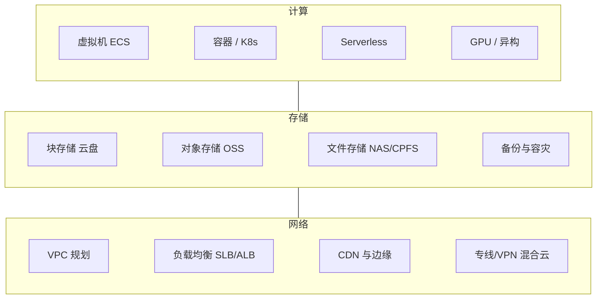

# 计算 · 存储 · 网络

> 云上的"三大件"。几乎所有业务系统的上云方案，最终都要回到这三个问题：算力怎么给、数据放哪里、流量怎么走。这一域沉淀的是选型逻辑与架构取舍，而不是产品手册。

## 这个域回答什么问题

- 什么负载用 ECS，什么负载用容器，什么负载用 Serverless？
- 块存储、对象存储、文件存储各自的边界在哪里？
- 一张企业级云网络（VPC 规划、混合云互联、全球分发）如何设计？

## 知识框架

## 文章列表

| 文章 | 状态 | 说明 |
| --- | --- | --- |
| [弹性计算](/cloud/infra/compute) | 已发布 | 实例规格族、弹性伸缩、Serverless 边界 |
| [云存储](/cloud/infra/storage) | 已发布 | 三类存储选型、成本优化、备份容灾 |
| [云网络](/cloud/infra/network) | 已发布 | VPC 规划、负载均衡、混合云互联 |

## 精选资源

> 筛选标准：官方与一手来源优先，近两年内容优先，经典明确标注。更新于 2026-09-01。

### 计算与 Serverless

- [如何选购 ECS 实例规格](https://www.alibabacloud.com/help/zh/ecs/user-guide/best-practices-for-instance-type-selection) — 按业务场景、性能与成本选规格的方法论（2025 · 官方文档）
- [AWS Graviton 性能余量与成本优化](https://aws.amazon.com/blogs/compute/how-potential-performance-upside-with-aws-graviton-helps-reduce-your-costs-further/) — ARM 算力成本优化的一线视角（2025 · 工程博客）
- [Best practices for AWS Lambda](https://docs.aws.amazon.com/lambda/latest/dg/best-practices.html) — 函数设计、扩展与性能的官方权威清单（2025 · 官方文档）
- [Firecracker: Lightweight Virtualization for Serverless Applications](https://www.usenix.org/conference/nsdi20/presentation/agache) — 讲透 microVM，Lambda 的底座（2020 · 论文）
- [Serverless 架构的演进](https://help.aliyun.com/zh/functioncompute/course-1-evolution-of-the-serverless-architecture) — 官方教程，系统梳理架构演进脉络（2025 · 官方文档）

### 存储

- [Building and operating a pretty big storage system called S3](https://www.allthingsdistributed.com/2023/07/building-and-operating-a-pretty-big-storage-system.html) — 亚马逊 CTO 亲述 S3 架构与超大规模运维（2023 · 工程博客）
- [More Than Capacity: Performance-oriented Evolution of Pangu](https://www.usenix.org/conference/fast23/presentation/li-qiang-deployed) — FAST 顶会论文，盘古的性能化演进（2023 · 论文）
- [OSS 性能最佳实践](https://help.aliyun.com/zh/oss/user-guide/oss-performance-best-practices/) — 对象存储性能调优官方汇总（2025 · 官方文档）

### 网络与分发

- [阿里云云网络十年核心技术与关键架构演进史](https://developer.aliyun.com/article/1495216) — 从 VPC 到网关与负载均衡的自研演进（2024 · 工程博客）
- [Eliminating hardware with Load Balancing and Cloudflare One](https://blog.cloudflare.com/eliminating-hardware-with-load-balancing-and-cloudflare-one/) — 以软件负载均衡替代硬件设备的实践（2024 · 工程博客）
- [Charting the life of an Amazon CloudFront request](https://aws.amazon.com/blogs/networking-and-content-delivery/charting-the-life-of-an-amazon-cloudfront-request/) — 全链路拆解请求路径与多层缓存（2025 · 工程博客）
- [Hybrid cloud architectures using AWS Direct Connect gateway](https://aws.amazon.com/blogs/networking-and-content-delivery/hybrid-cloud-architectures-using-aws-direct-connect-gateway/) — 混合云互联架构与网关设计详解（2023 · 工程博客）

## 一句话入门

三大件的选型只看三件事：**负载特征（状态/无状态、突发/平稳）、数据特征（一致性/容量/访问模式）、成本模型（预留/按量/弹性）**。
