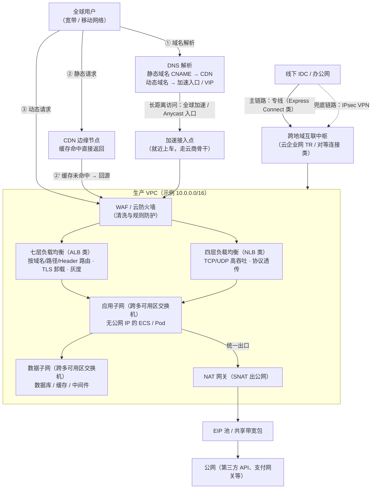
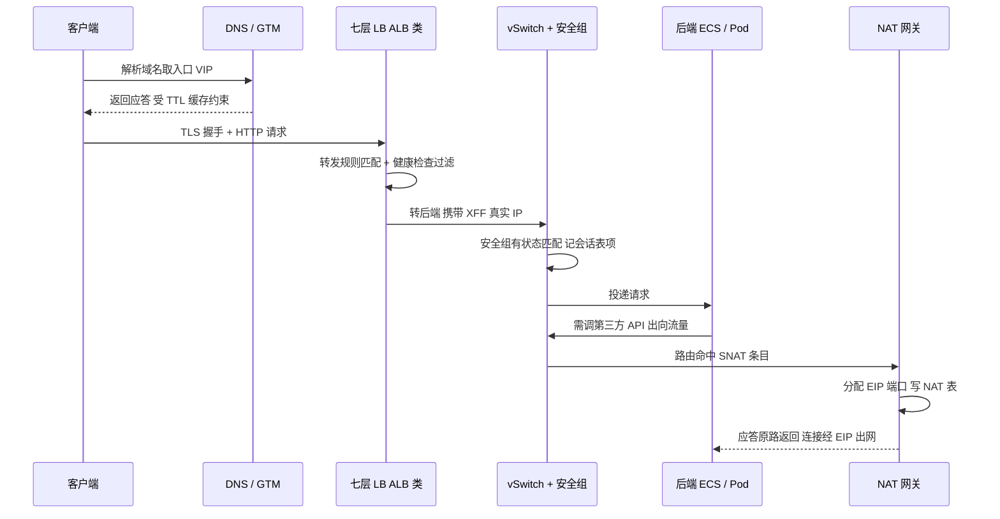
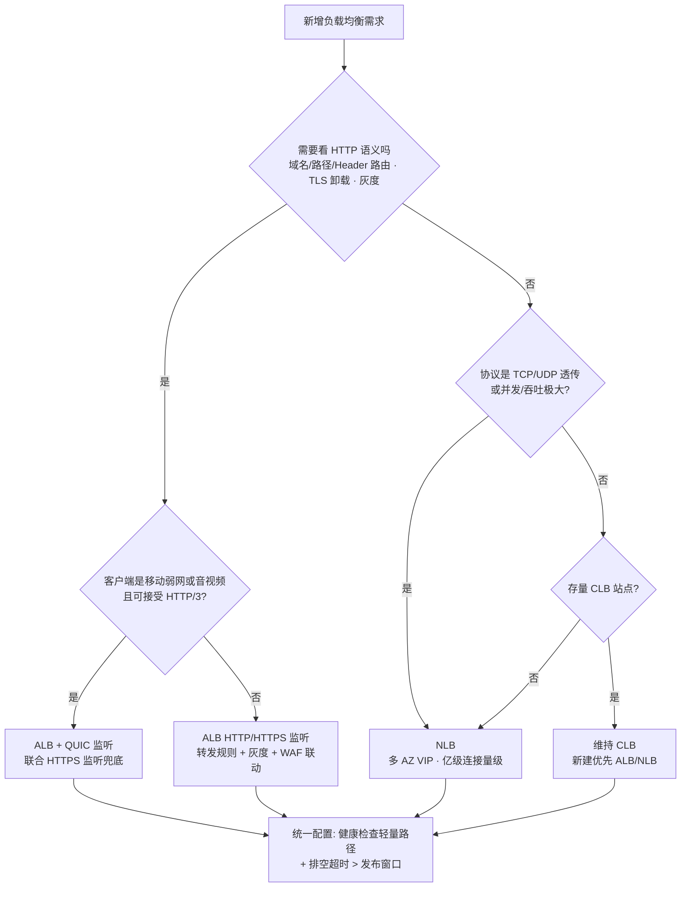
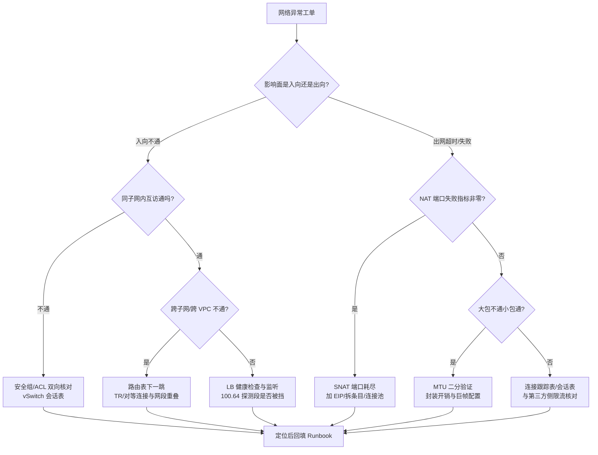

# 云网络

> 这篇写给两类人：正在做上云（或第二朵云）规划、要拍板网段和组网方案的架构师/运维负责人；以及被"为什么突然 502""为什么连不上"折磨、想建立排查心智模型的一线工程师。读完你应该能带走五样东西：**一套 VPC 网段规划的 checklist**、**一张"云上典型组网"的完整地图（从用户请求进入你的第一个子网到出公网）**、**VPC overlay 与网关数据面的机制级拆解（封装怎么加、网关怎么从集中式走到 DPU 卸载）**、**负载均衡三代形态的选型决策表**，以及**一线最常踩的那几个坑的识别方法与对策**。全文主线一句话：VPC 是地基，负载均衡和公网入口是门面，NAT 与出网是后勤，CDN 和全球加速是毛细血管，混合云互联是走廊——而把它们全部托住的，是云厂商那套从软件 vSwitch 一路演进到可编程芯片的数据面。我尽量讲"实际上怎么用、错了什么症状"，不做协议综述。

## 是什么：云上的"网络"到底是什么

[VPC（虚拟私有云）](https://en.wikipedia.org/wiki/Virtual_private_cloud)的通用定义是：在共享的公有云基础设施上，切出一块**可按需配置、与别人隔离**的私有网络——隔离靠的是给用户分配私有网段和虚拟交换/转发构造，逻辑上相当于"你在云上租了一个自己的数据中心机房网络"。

但这个定义只说了一半。从一线视角看，云网络更重要的特征是：

- **它是"云网络"而不是"云上网络"**。你买到的不是一堆虚拟设备，而是一组**服务化的网络原语**：专有网络（VPC）、交换机/子网（vSwitch 类）、路由表、安全组、网络 ACL、弹性公网 IP（EIP）、负载均衡（SLB/ELB 类）、NAT 网关、专线/VPN 网关、跨地域互联（云企业网/对等连接类）、CDN、全球加速……每个原语按声明式 API 开通、按用量计费、由云厂商的多租户底座承载。这些原语怎么在物理层实现（VXLAN 封装、Overlay、网关集群、DPU 卸载），正是 [SDN 与 NFV](/cloud/foundation/sdn-nfv) 那篇和本文"数据面演进"一节讲的事——对使用者来说它是黑盒，你只需要信任"隔离"和"SLA"这两个承诺。
- **责任边界变了**。传统机房里网络故障是"设备坏了"；云上绝大多数"网络问题"是**配置问题**——安全组漏了一条放行、路由表指错了下一跳、SNAT 端口耗尽。云厂商的骨干网挂了是小概率事件，你把自己那一层配置写错是大概率事件。
- **带宽和 IP 是钱**。公网流量、跨境链路、负载均衡实例费……网络设计的另一半是账单设计，这一点后面"网络性能与计费"里会展开。

一句话概括这篇的范围：**VPC 是地基，负载均衡和公网入口是门面，NAT 与出网是后勤，CDN 和全球加速是毛细血管，混合云互联是走廊**。

## 为什么重要：这是上云第一步，也是最难返工的一步

我做过不少云上架构评审，网络是少数"**规划错了后面要用很大力气补救**"的层，原因有三：

1. **网段（CIDR）一旦定错，改不动**。VPC 主网段创建后不可缩容或更换，只能靠附加网段（Secondary CIDR）续命，而附加网段会给路由和防火墙策略增加长期复杂度。两个网段重叠的 VPC 要互通，就得请出 VPC NAT 做地址转换——官方甚至专门有[《VPC间互通使用VPC NAT解决地址冲突》](https://help.aliyun.com/zh/cloud-network-well-architected-design/use-vpc-nat-to-resolve-address-conflicts-between-vpcs)这样的方案文档，说明这个坑踩的人有多普遍（AWS 侧同理，重叠网段互通要靠私有 NAT 网关兜底）。
2. **网络结构决定了安全模型**。环境隔离（生产/预发/测试）、最小暴露面（谁允许有公网 IP）、南北向与东西向流量的控制点，全都长在 VPC 与子网的骨架上。骨架歪了，安全组写得再细也是在漏风的墙上贴胶带。
3. **它直接写进你的可用性和账单**。跨可用区容灾从"每个可用区至少一个交换机"开始（阿里云[网络规划](https://help.aliyun.com/zh/vpc/vpc-network-planning)文档明确建议单 VPC 至少两个交换机、分布在不同可用区）；而公网带宽、负载均衡实例费、跨地域流量费，都在网络层决定。做高可用与容灾设计时，网络拓扑是前置输入，不是事后附件。

背景补一句：K8s 的 Pod 网段、Service 网段也要在 VPC 的 IP 预算里占坑（详见 [Kubernetes](/cloud/native/kubernetes) 那篇的网络模型一节），所以"先画 VPC、再谈一切"是有工程依据的——[弹性计算](/cloud/infra/compute)的实例规格可以随业务滚动升级，网络骨架不行。

## 架构与原理：一张典型的云上组网地图

先把全景画出来。下面这张拓扑是我做方案时的默认起点（可按规模裁剪），箭头上的编号对应一条用户请求的实际路径：



*图：典型云上组网拓扑（本篇自绘，Mermaid）。决策含义：静态流量在 CDN 终结、动态流量进 WAF+LB；子网按 DMZ→应用→数据三层收口，应用层不持公网 IP；出公网统一走 NAT 便于审计与端口规划；混合云用"专线主 + VPN 备"双通道。*

下面把地图上每个环节的原理拆开讲。

### VPC Overlay：物理网络怎么变成逻辑网络

VPC 的本质是一个 **overlay（覆盖网络）**：物理网络（underlay）只提供"任意两点间可达的 IP 转发"，租户的逻辑网络（子网、MAC、网关）全部靠封装隧道在物理包外面"套一层"实现。拆到组件级，一个 VPC 数据面由三样东西构成：

1. **主机侧虚拟交换机（vSwitch，阿里云称 AVS 类）**：跑在每台物理机（或其 SmartNIC/DPU 卡）上，是租户网络的真正边界。它做四件事——租户隔离（VPC ID 进转发规则）、安全组/ACL 匹配、虚拟路由（子网间转发）、以及把租户报文封装进隧道（VXLAN 类）发给物理网络。
2. **隧道封装（VXLAN 类，[RFC 7348 / Wikipedia: VXLAN](https://en.wikipedia.org/wiki/VXLAN)）**：原始二层帧被塞进 UDP 报文，外层源/目的 IP 是两台物理机的隧道端点地址（VTEP），外层 UDP 目的端口 4789，VXLAN 头里的 24 位 VNI 标识租户网络。物理交换机从此只看见外层 IP——这就是"物理网络不需要知道租户网段"的原因，也是单地域 VPC 能突破 4096 个 VLAN 限制的原因（VNI 空间约 1600 万）。
3. **网关体系**：子网网关（东西向跨子网）、公网网关/NAT（南北向出）、跨地域网关（骨干互联）。网关是有状态的（连接表、NAT 表），是数据面里最贵、演进最激进的部分，下一节单独讲。

一个报文的完整旅程，按场景拆成四行记忆最牢：

| 场景 | 路径 | 封装变化 | 控制点 |
| --- | --- | --- | --- |
| 同子网东西向 | VM → 宿主机 vSwitch → 物理 fabric → 对端宿主机 vSwitch → VM | 加/解 VXLAN 外层头 | 两端 vSwitch 的安全组 |
| 跨子网东西向 | 同上，但 vSwitch 查虚拟路由表决定转发 | 同上 | 路由表 + 安全组 |
| 出公网（SNAT） | VM → vSwitch → 集中式 NAT 网关集群 → 公网 | VXLAN 到网关，网关做 SNAT 换源 IP:端口 | SNAT 条目、端口池 |
| 入公网（DNAT） | 公网 → EIP/负载均衡 → 网关做 DNAT → VXLAN 送到 VM | 网关换目的 IP:端口后封装 | EIP 映射、LB 监听、安全组 |

封装是有代价的：**VXLAN 外层头共占 50 字节**（外层 Ethernet 14 + IP 20 + UDP 8 + VXLAN 8）。若物理网络 MTU 仍按 1500 规划，内层 1500 的包出去就超框——要么分片要么丢。公有云的解法是物理网络开巨帧（jumbo frame，9000 量级）把封装开销吃掉，租户侧无感；但**自建 overlay（OpenStack/K8s 自建隧道）时没人帮你兜底**，常规做法是把隧道内 guest 的 MTU 降到 1450。这条经验在云上排查"大包不通、小包正常"（典型如 ping 通但 scp 卡死、IPsec/GRE 隧道内 MTU 异常）时是第一个要验证的假设。

把封装/解封装过程逐步拆开，一次跨宿主机的东西向通信在数据面上是这样六步：

```text
① VM 发出原始帧：内层 MAC-A → MAC-B，内层 IP 为租户网段地址
② 宿主机 vSwitch 查虚拟路由 + 安全组（入/出方向规则匹配）
③ 命中转发：查"租户 MAC → 远端 VTEP"映射，得到对端宿主机隧道地址
④ 加封装：外层 MAC（到 TOR）+ 外层 IP（本 VTEP → 对端 VTEP）
          + UDP 4789 + VXLAN 头（VNI = 租户网络标识）
⑤ 物理 fabric 只按外层 IP 做普通三层转发（ECMP 多路径分担）
⑥ 对端 vSwitch 解封装 → 校验 VNI 与 ACL → 投递给目标 VM 的 vNIC
```

注意第⑤步的含义：**物理网络完全不需要为租户做任何配置**，扩容租户不碰 underlay；而 ECMP 按外层五元组哈希，意味着"单条大流打满一条物理链路、其余链路空闲"是 overlay 网络的固有风险——云商在 fabric 层用更细粒度的喷洒（按包/按 flowlet 级）缓解，自建网络则要靠流数量去摊。这也是 AWS SRD 那套"按包喷洒 + 容忍乱序"思路在传输层的再现。

下图是阿里云下一代 VPC 数据面的公开论文插图，正好把上面三个组件的位置画全了：Guest VM 的 vNIC 接到宿主 SmartNIC 上的 vSwitch，vSwitch 做封装后把 VXLAN 包送上物理 fabric（SW 集群）：


*图源：USENIX NSDI'26 论文《Bifrost: Alibaba's Next-Generation VPC Network with High-Performance Multipath Reliable Transport》图 1（[USENIX NSDI'26](https://www.usenix.org/conference/nsdi26/presentation/fan)）*

把前面所有组件串起来，一条动态请求从公网进后端、再从后端出公网调第三方 API 的完整时序如下——排查"哪一跳出了问题"时，我就是按这张图逐段截断验证的：



*图：一次请求的入向与出向全时序（本篇自绘，Mermaid）。决策含义：每个箭头都是一个可独立验证的检查点——解析、LB、安全组会话、SNAT 端口——定位故障等于定位断在第几个箭头。*

### 安全组 vs 网络 ACL：两道不同的门

这是被问得最多、也最容易配反的一对。原理上的差别只有一句话：**安全组是有状态的实例级白名单，网络 ACL 是无状态的子网级规则表**。"有状态"的机制含义是：安全组在放行一条入方向连接时，会在 vSwitch/网关的会话表里记下一条五元组表项，该连接的回包命中表项即直接放行，无需再写出方向规则；表项有老化时间（阿里云口径有状态会话保持约 910 秒，见[安全组规则](https://help.aliyun.com/zh/ecs/user-guide/security-group-rules)）。ACL 没有这张表，入、出方向各自独立匹配。展开成表：

| 维度 | 安全组（Security Group） | 网络 ACL（Network ACL） |
| --- | --- | --- |
| 作用层级 | 弹性网卡 / 实例级 | 交换机（子网）级 |
| 状态性 | **有状态**：放行入方向后，回包自动放行（阿里云[使用安全组](https://help.aliyun.com/zh/ecs/user-guide/start-using-security-groups)） | **无状态**：入、出方向要分别配规则，放行了请求必须记得放行响应（阿里云[网络ACL概述](https://help.aliyun.com/zh/vpc/network-acl-overview)） |
| 规则语义与顺序 | 白名单：默认拒绝，只写"允许"；多条规则按优先级匹配 | AWS 侧可写 allow/deny、按规则号 1~32766 顺序评估，命中即止（[VPC 网络 ACL](https://docs.aws.amazon.com/vpc/latest/userguide/vpc-network-acls.html)）；阿里云侧同样是子网粒度的无状态控制 |
| 生效位置 | 实例网卡处，最贴近负载 | 子网入口，比安全组更前置，可在边缘先丢掉非法流量、省后端处理 |
| 典型用法 | 主防线：按角色（web/app/db）建组、组间互授权限 | 粗粒度边界：整层子网的黑名单/合规收口（如数据子网禁止任何公网入） |
| 一张网卡/子网的归属 | 实例可挂多个安全组（策略取并集） | 一个子网同一时刻只能绑一个 ACL |

一线经验：**默认用安全组把精细策略做完，网络 ACL 只做"整层"的粗边界**。两个都用但没人维护时，出问题的概率主要来自 ACL 的无状态——最常见症状是"入方向明明放了，连接却不通"，因为回包方向被默认策略拦了。第二个高频坑是**规则顺序**：安全组按优先级从小到大命中即止，后加的一条低优先级"拒绝"永远不会生效（它前面已经有允许命中了）；改策略时先按优先级排序读一遍，比逐条看内容快得多。

### 网关与 vSwitch 的分布式化演进：从集中式集群到 DPU 卸载

这一段是理解"云网络为什么能做到这个性能和这个价格"的钥匙，也是各家云厂商公开论文里信息量最大的部分。以阿里云洛神平台的公开论文为骨架（AWS 的对应物是 Nitro/ENA 体系），数据面形态大致走过四代：

**第一代：集中式网关集群。** 所有网关功能做成一排排独立集群，挂在数据中心交换层下面：负载均衡网关（SLB）、公网网关（XGW/IGW 类）、VPC 互通网关（VGW）、跨地域网关（TGW）、专线网关（CSW）……每张图里这一排盒子就是当年真实的机房形态：


*图源：USENIX NSDI'24 论文《LuoShen: A Hyper-Converged Programmable Gateway for Multi-Tenant Multi-Service Edge Clouds》图 1（[USENIX NSDI'24](https://www.usenix.org/conference/nsdi24/presentation/pan)）*

它的问题很直白：每个网关集群独立扩容、独立占机柜和端口，东西向流量要"Hair-pin"到网关集群再回来，延迟和成本都花在"绕路"上。

**第二代：vSwitch 下沉到主机，网关功能分布式化。** 把能分布式的功能（隔离、安全组、虚拟路由、封装）全部塞进每台宿主机上的 vSwitch，东西向流量在宿主机本地就转发完毕，不再绕集中式网关；只有必须有全局状态的功能（NAT 表、公网出口、跨域互联）留在集中式网关。这一代奠定了"overlay 在主机终结"的现代 VPC 形态——上面 Bifrost 那张图里的 vSwitch 就是这一代的产物。

**第三代：vSwitch 与网关卸载到 SmartNIC/DPU。** 主机 CPU 跑 vSwitch 是拿宝贵的算力换网络功能，规模一大单核就是瓶颈。解法是把 vSwitch 整个搬进带独立 SoC 的智能网卡（阿里云的神龙 MOC 卡/CIPU，AWS 的 Nitro 卡）：主机 CPU 零开销，转发性能从百万 PPS 量级跳到千万 PPS 量级，并顺带在卡上做出 eRDMA、VPC 流量加密、流量镜像等能力。SmartNIC 上的 vSwitch 内部是"快慢路径"结构——首包走慢路径查规则表（ACL/Route/QoS），算出的动作连同状态缓存进会话表，后续包走快路径直接执行，这也是它能在有限卡上 CPU 上扛住线速的原因：


*图源：ACM SIGCOMM'25 论文《Nezha: SmartNIC-based Virtual Switch Load Sharing》图 1（[论文 PDF](https://ng-95.github.io/files/Nezha_SIGCOMM25.pdf)）*

这代架构的新问题是**卡上资源不均匀**：某台机器的 vNIC 突发把本地 SmartNIC 打满，而隔壁机器的卡闲着。SIGCOMM'25 的 Nezha 给出的答案是"把空闲 SmartNIC 组成资源池，过载 vNIC 透明卸载到远端卡"，公开数据是在阿里云部署一年、把三类云中间件的 CPS/并发流/vNIC 上限提升 3~4.4 倍、5~50 倍与 40 倍以上。

**第四代：超融合可编程网关。** 集中式网关那一排盒子并没有消失，而是被"折叠"进一台设备：NSDI'24 的 LuoShen 把 TGW+VGW+CSW 收敛进一颗 Tofino 可编程交换芯片做线速转发，SLB 的负载均衡逻辑放 x86 CPU、硬件加速部分放 FPGA（SLB+），整机 2U、吞吐 1.2 Tbps 量级，公开口径前期成本降 75%、部署空间降 87%、功耗降 60%——主要面向边缘云/小型化站点：


*图源：USENIX NSDI'24 论文《LuoShen》图 2（[USENIX NSDI'24](https://www.usenix.org/conference/nsdi24/presentation/pan)）*

**AWS 侧的对应演进**：Nitro 卡承担 VPC 封装与安全组（同第三代），传输层则自研了 SRD（Scalable Reliable Datagram）——一个跑在以太网 fabric 上、把单条流**按包喷洒到多条路径**并容忍乱序的可靠传输协议；EFA（HPC 网卡）和 ENA Express（普通 EC2 流量透明启用）都建立在它上面。公开数据：ENA Express 把单流带宽从 5 Gbps 提到 25 Gbps，P99 延迟降约 50%、P99.9 降约 85%，2026 年 5 月起支持跨可用区流量。下图是 SRD 在协议栈里的位置——它藏在 EFA 设备里，对上仍暴露标准接口：


*图源：AWS 论文《A Cloud-Optimized Transport Protocol for Elastic and Scalable HPC》（IEEE HotNets 2020）图 1（[论文 PDF](https://saeed.github.io/CS8803_DNS_Spring2024/assets/srd.pdf)）*

对使用者的工程含义其实只有三条：**其一**，"同地域内网延迟亚毫秒、跨可用区略高"是这套分布式数据面的正常表现，做跨 AZ 容灾时要把这零点几毫秒算进同步链路的预算；**其二**，实例的"内网带宽/PPS/连接数"上限本质是 vSwitch/DPU 给你的配额，压测打不满先查实例规格的网络基线而不是应用；**其三**，传输层优化（SRD/eRDMA 类）正在从 HPC 专属走向普通业务透明可用，选实例族时值得看一眼是否支持。

### 负载均衡：三代形态与四层机制

#### 四层：LVS 底座与 DR/NAT/FullNAT

阿里云 CLB 的四层底座是 LVS+Keepalived、七层是 Tengine（[CLB 产品架构](https://help.aliyun.com/zh/slb/classic-load-balancer/product-overview/architecture)），AWS 的 NLB/CLB 也是内核转发路线。LVS（ipvs 内核模块）只做连接级转发：**吞吐高、协议透传、但看不见 HTTP 语义**。它的四种转发模式是理解一切四层 LB 的基础，也是面试和故障排查都绕不开的一张表（FullNAT 为淘宝在 NAT 基础上的扩展，已合入阿里开源的 [alibaba/LVS](https://github.com/alibaba/LVS)，机制详见 [IPVS FULLNAT and SYNPROXY](https://kb.linuxvirtualserver.org/wiki/IPVS_FULLNAT_and_SYNPROXY)）：

| 模式 | 数据面动作 | 回包路径 | 网络约束 | 工程含义 |
| --- | --- | --- | --- | --- |
| NAT | 只改目的 IP（DNAT） | 必须经 LB | 后端默认网关指向 LB | LB 是双向瓶颈，规模小才用 |
| DR | 只改目的 MAC，IP 不动 | 后端直回客户端 | 同二层；后端 lo 配 VIP 并抑制 ARP | 性能最高，但跨网段/端口映射都做不到 |
| TUN | IPIP 封装原包给后端 | 后端解封装后直回 | 后端须支持隧道解封装 | 可跨机房，运维成本高 |
| FullNAT | 源、目的 IP 都改（SNAT+DNAT），源换成 LB 内网 LIP | 必回 LB | 无同网段要求 | **云厂商主流**：后端随意分布、LB 可 ECMP 横向扩展；代价是后端看不到真实客户端 IP |

FullNAT 的两个配套机制要记住：**TOA**（把真实客户端 IP:端口塞进 TCP Option 带给后端，后端内核模块 hook `getpeername` 还原）和 **SYNPROXY**（LB 先代理完成三次握手再与后端建连，替后端挡 SYN Flood）。云上产品的对应物：四层看客户端真实 IP 用 **PPv2（Proxy Protocol v2）** 或 TOA 类机制，七层靠 **X-Forwarded-For** 头——后端拿不到真实 IP 的工单，十有八九是这两个没配。会话保持（session persistence）在四层靠源 IP 哈希或学习式粘滞表，注意它和"有状态连接排空"是两件事：前者决定新连接去哪，后者决定老连接怎么善终。

调度算法层面，LVS 系 LB 的选项大致是轮询（rr）、加权轮询（wrr）、最少连接（lc）、加权最少连接（wlc）、源地址哈希（sh）这几族；云产品在此基础上加了"一致性哈希"类选项（按源 IP/四元组/自定义 key），用于缓存友好与会话粘滞场景。我的默认选择：**无状态横向扩展服务用 wrr/wlc（让权重跟着实例规格走），带本地状态的服务才考虑一致性哈希**——后者会把负载不均的风险重新请回来，扩缩容时还可能触发大面积会话迁移。

#### 横向扩展：LB 自己怎么变大

理解 LB 的横向扩展机制，能解释两类现象："为什么云 LB 没有'加机器'按钮却宣称弹性"和"为什么自建 LVS 扩容时会掉一批连接"。

- **自建 LVS 路线**：多台 Director 用 OSPF/ECMP 把同一个 VIP 以 32 位主机路由宣告出去，上游交换机按 ECMP 把流哈希到不同 Director——这正是 FullNAT 取代 DR/NAT 成为主流的原因：回包必经本机，Director 之间不需要共享路由前提，加减节点只影响 ECMP 哈希重分布。代价是**会话状态不共享**：节点退出时它持有的连接会断（除非做会话同步或接受重连），所以自建集群扩缩容要挑低峰期。
- **云产品路线**：CLB/NLB/ALB 的"实例"背后是云商的同构集群（LVS/Tengine 池 + 会话同步机制），规格档位本质是配额与计费单位，底层池弹性伸缩对用户透明；这也是"单实例百万 QPS/亿级连接"这类标称值的含义——它描述的是池的能力上限，不是你独占一台设备。
- **对使用者的推论**：压测时不要按"实例规格值"线性预期（突发与基线、共享池争用都会让曲线变形）；做容量规划时按业务峰值的 1.5~2 倍选档位并开启监控告警，比研究底层池更划算。

#### 四层高性能：NLB 类

NLB 把四层做成"超高性能形态"：官方标称单实例亿级并发连接、百 Gbps 带宽量级，原生跨多可用区（VIP 多 AZ 冗余），协议透传适合游戏、IoT、金融专线协议这类非 HTTP 流量。与 CLB 四层的关系可以理解为"新建四层一律 NLB，CLB 四层只留给存量"。

#### 七层：ALB 类与转发规则

七层做请求级转发：按域名/URL 路径/Header/Cookie/Query 组合成转发规则，规则内再做动作（转发到服务器组、重定向、重写、固定响应、灰度按比例加权）。TLS 在 ALB 终结（卸载）后，后端走明文或重新加密由你选；gRPC、WebSocket 都归七层管。官方口径 ALB 单实例可支撑百万级 QPS 量级（[SLB 产品家族](https://help.aliyun.com/zh/slb/product-overview/slb-overview)）。

趋势上值得写进方案的一点：**QUIC/HTTP3 已经进入云 LB 产品**。阿里云 ALB 支持 QUIC 监听（兼容 gQUIC Q46/Q43/Q39 与标准 HTTP/3 h3），可单独使用或与 HTTPS 监听联合——联合时 ALB 自动探测客户端是否支持 HTTP/3，支持走 QUIC、不支持回落到 HTTPS 监听（[QUIC 加速音视频业务](https://help.aliyun.com/zh/slb/application-load-balancer/use-quic-to-accelerate-the-delivery-of-video-and-audio-content)）。移动弱网、音视频推拉流边缘接入这类对队头阻塞敏感的场景，收益是实打实的；对照 AWS 侧 ALB 至今未支持 HTTP/3（仅 CloudFront 支持），选型跨国业务时要把这个差异记在案。

#### 健康检查与排空：LB 的"误摘除制造机"

健康检查参数必须吃透。以阿里云 CLB 默认值为例（[健康检查概述](https://help.aliyun.com/zh/slb/classic-load-balancer/user-guide/health-check-overview/)）：响应超时 5s、间隔 2s、健康/不健康阈值各 3 次，**判定不健康的失败时间窗口 = 5×3 + 2×(3−1) = 19 秒**；HTTP 检查默认只认 2xx/3xx。ALB 侧超时默认 5s、阈值默认 3（[ALB 健康检查](https://help.aliyun.com/zh/slb/application-load-balancer/alb-health-check)）。三个容易忽略的细节：

- 健康检查探测流量来自保留网段（阿里云 CLB 用 100.64.0.0/10 发起探测），后端主机上的 iptables/安全软件把它屏蔽了，就会**全量误摘除**；
- 监听关联的**所有**后端都不健康时，CLB 不转发请求、直接回 502（[CLB 监听 FAQ](https://help.aliyun.com/zh/slb/classic-load-balancer/support/faq-about-clb)）——所以健康检查故障 = 业务故障，别把它配成"永远健康"；
- 摘除要配"优雅"（连接排空/优雅中断）：AWS ALB 的 target 反注册默认等待 300 秒让在途请求跑完，范围 0~3600 秒（[Target Groups 文档](https://docs.aws.amazon.com/elasticloadbalancing/latest/application/load-balancer-target-groups.html)）；阿里云侧 CLB/ALB 也支持优雅中断（超时范围 10~900 秒，ACK 通过 Annotation 配置）。发布系统摘节点时看到"最后几个请求报错"，基本都是没排空。

keep-alive 对齐这个坑值得给一段可直接抄的配置。原则只有一条：**后端的空闲超时必须小于 LB 的空闲超时**，让后端先关、LB 不复用死连接。以 Nginx 后端 + CLB 七层（默认 15s）为例：

```nginx
# 后端 Nginx：让 keepalive 空闲超时略小于 LB 的 15s
keepalive_timeout  12s;      # LB 侧若调大到 60s，这里相应调到 55s 量级
keepalive_requests 1000;     # 限制单连接请求数，配合 LB 侧重试策略

# 若后端是向上游复用的反向代理角色，同样约束上游池：
upstream backend {
    server 10.0.1.10:8080;
    keepalive 32;            # 空闲连接池大小
}
# proxy_http_version 1.1; + proxy_set_header Connection ""; 才能真复用
```

反过来，若业务是长连接（WebSocket/SSE），思路要颠倒：**把 LB 的空闲超时调到大于业务最长静默期**，否则 LB 会先掐掉"看起来空闲"的长连接——这类工单的症状是"每隔固定分钟数断一次线"。

#### 选型决策

把三代形态压成一张决策入口：



*图：负载均衡选型决策树（本篇自绘，Mermaid）。决策含义：七层语义优先 ALB；四层大吞吐优先 NLB；CLB 只作为存量形态保留；QUIC 是移动/音视频场景的加分项而非必选项。*

配套的需求-形态对照表（含工程边界）：

| 需求特征 | 选择 | 适用边界与注意 |
| --- | --- | --- |
| HTTP/HTTPS 路由、按 Header/Cookie 灰度、TLS 卸载、QUIC/gRPC | 七层 ALB 类 | 百万级 QPS 量级；长连接与 WebSocket 注意空闲超时与后端 keep-alive 对齐 |
| TCP/UDP 超高并发、协议透传（游戏、IoT、金融专线协议） | 四层 NLB/CLB-TCP 类 | 亿级并发连接 + 百 Gbps 量级；四层看真实 IP 需 PPv2/TOA，七层靠 XFF 头 |
| 存量简单站点、按域名/URL 分发 | CLB 七层可用 | 官方已建议新建优先 ALB/NLB（[CLB 监听类型](https://help.aliyun.com/zh/slb/classic-load-balancer/user-guide/listener-overview/)）；迁移有官方一键工具 |
| AWS 对照 | ALB（七层）/ NLB（四层）/ CLB（legacy） | 同构逻辑；注意 target group 维度的健康检查与排空参数；HTTP/3 仅 CloudFront 有 |
| 多可用区高可用 | 任意新实例 | 选支持多 AZ VIP 的形态；实例本身不跨 AZ 部署就别谈容灾 |

### 公网出入口：EIP、NAT 网关、共享带宽与 Anycast

私网里的实例没有公网 IP 却要访问外部 API（第三方支付、模型服务、更新源……），标准解法是 NAT 网关：以 SNAT 方式把大量内网连接**复用少数几个 EIP**出公网——本质是"IP:端口的多路复用"。这张图讲的是地址与端口替换的基本原理：


*图源：Wikimedia Commons（[File:NAT Concept-en.svg](https://commons.wikimedia.org/wiki/File:NAT_Concept-en.svg)，Michel Bakni，CC BY-SA 4.0）*

原理直接决定容量：**一个 NAT IP 对"同一个目的 IP+端口+协议"最多提供约 5.5 万个端口**。阿里云口径：单条 SNAT 的并发连接数 ≈ **N × 55,000**（N 为绑定的 EIP 数），SNAT 默认分配端口范围 1025~65535（[使用公网 NAT 网关](https://help.aliyun.com/zh/nat-gateway/user-guide/use-internet-nat-gateway-for-public-network-access)）；AWS 完全同构——每个 IP 对单一目的 55,000 条并发，NAT 网关最多绑 8 个 IP、合计 44 万（[NAT gateway basics](https://docs.aws.amazon.com/vpc/latest/userguide/nat-gateway-basics.html)、[AWS 博客：给 NAT 网关加多个 IP 扩展出口](https://aws.amazon.com/blogs/networking-and-content-delivery/attach-multiple-ips-to-a-nat-gateway-to-scale-your-egress-traffic-pattern/)）。注意两个放大因素：**短连接风暴**（每次新建都吃一个端口，TIME-WAIT 期内不回收）和**目的单一**（全公司调同一个第三方 API 时，5.5 万是对那一个目的的上限，不是总量）。

监控上两家都把"端口分配失败"做成了现成指标：阿里云 NAT 网关的"端口分配失败丢失数"、AWS CloudWatch 的 `ErrorPortAllocation`（[NAT 网关监控](https://help.aliyun.com/zh/nat-gateway/user-guide/view-monitoring-data)、[AWS 指标文档](https://docs.aws.amazon.com/vpc/latest/userguide/metrics-dimensions-nat-gateway.html)）。**这两个指标不为零，就是 SNAT 端口要耗尽了**——这是排查出网随机超时/连接失败时的第一站。

端口耗尽的对策按"见效速度"排序，我一般四步走完：

```text
① 客户端连接池化 + 缩短空闲超时（减少端口占用时长，分钟级见效）
   例：HTTP client maxIdleConnsPerHost 调优、TIME-WAIT 复用参数评估
② 拆 SNAT 条目（按业务/按目的域分组，隔离爆炸半径，小时级）
③ 加绑 EIP 扩容端口池（N × 55,000 线性扩，小时级，注意账单）
④ 对超高并发单一目的：评估直连/专线/PrivateLink 类私网通道（天级，根治）
```

与端口表相邻的还有两张容易被忽略的表：**连接跟踪表**（vSwitch/网关上每条流一条表项，有老化时间；表满时新连接被丢，症状与端口耗尽几乎一样，区分靠监控指标名）和 **NAT 会话表**（网关侧，决定回包能否命中）。排查出网问题时把"端口 / 连接跟踪 / 会话"三张表一起看，能避免"加了 EIP 还是超时"的二次踩坑——因为卡的可能是第二张表。

顺带把三个相邻原语说清楚：

- **EIP** 是**可独立购买与持有、可动态绑定/解绑**的公网 IPv4 资源，绑定走的是公网网关上的 NAT 映射（阿里云[什么是弹性公网IP](https://help.aliyun.com/zh/eip/product-overview/what-is-eip)）。这个"IP 与实例解耦"的设计就是故障转移（实例挂了把 IP 摘走重绑）、以及"IP 白名单不跟着伸缩变"的基础。
- **共享带宽包**：把一组 EIP 放进同一个带宽池按池计费，削峰填谷——单个 EIP 的峰值带宽错开时，池子总带宽可以明显小于各 EIP 峰值之和，是出口账单优化最常用的杠杆（[什么是共享带宽](https://help.aliyun.com/zh/internet-shared-bandwidth/product-overview/what-is-internet-shared-bandwidth)）。
- **Anycast EIP**：同一个 IP 在多个接入点同时宣告，用户就近进入云商网络后再走内部路径到源站，适合"全球多地域用户访问同一服务入口"且不想维护多地 DNS 记录的场景（[什么是 Anycast EIP](https://help.aliyun.com/zh/anycast-eip/product-overview/what-is-anycast-eip)）。

### 跨地域与混合云：CEN/TR、专线、VPN 与 SD-WAN

#### 云企业网与转发路由器：把骨干网做成产品

跨地域互通不要拿公网当链路——那是花钱买抖动。云商的解法是把自有骨干网产品化：阿里云的云企业网（CEN）在**每个地域放一个转发路由器（TR）**作为该地域的核心转发网元，VPC、边界路由器（VBR）、VPN 网关都以"网络实例连接"的方式挂到 TR 上，地域之间的 TR 再通过云商骨干全网状互联（[什么是云企业网](https://help.aliyun.com/zh/cen/product-overview/what-is-cen/)）。机制上有三个一线必须知道的点：

1. **跨地域连接默认带宽只有 1 Kbps**（仅供连通性测试），业务带宽必须购买跨地域带宽包并分配给连接（[使用转发路由器实现跨地域互通](https://help.aliyun.com/zh/cen/user-guide/manage-inter-region-connections)）——"建了连接却跑不动"的工单绝大多数是这一步没做；
2. **路由策略是 TR 的核心价值**：同地域内哪些 VPC 互通、哪些隔离、流量是否引流到安全设备，都靠 TR 上的路由表与策略表达，替代了早年"VPC 两两对等连接"的网状噩梦；
3. **混合云汇聚层有独立网元**：专线侧用专线网关 ECR 做多条物理专线的汇聚与冗余（[专线网关 ECR](https://help.aliyun.com/zh/express-connect/user-guide/ecr/)），与云上核心层 TR 分工——ECR 管"线下怎么进来"，TR 管"云上怎么分发"。

AWS 的对照物是 Transit Gateway + 跨地域 Peering，Azure 是 Virtual WAN，逻辑同构：一个地域一个枢纽、枢纽间走厂商骨干、带宽单独计费。

#### 专线、VPN、SD-WAN：三种混合云接入形态

| 维度 | 物理专线（Express Connect/Direct Connect 类） | IPsec VPN 网关 | SD-WAN 接入（SAG/CCN 类） |
| --- | --- | --- | --- |
| 延迟与抖动 | 稳定（独占链路），可预期 | 走公网，抖动不可控 | 走公网但沿云商 POP 就近上车，介于两者之间 |
| 上线周期 | 长（楼内布线+运营商流程，周~月量级） | 快（分钟~小时级） | 快（设备/镜像开箱即注册） |
| 成本量级 | 固定租金 + 端口费，带宽单价高 | 实例费 + 流量，带宽单价低 | 设备/订阅费 + 流量 |
| 加密 | 链路透隔离，可选应用加密 | 自带隧道加密（IKE 协商 + ESP） | 自带隧道加密 |
| 典型定位 | 长期稳定东西向流量（同步、API、运维） | 临时扩容、灾备兜底、分支接入 | 大量分支/门店/移动办公的批量接入 |

IPsec 的两种模式选错是配置期高频问题：**隧道模式**封装整个原始 IP 包（站点到站点组网的默认），**传输模式**只保护载荷、保留原始 IP 头（端到端、云内少见）。下图是 ESP 在两种模式下的封装位置差异：


*图源：Wikimedia Commons（[File:Ipsec-esp-tunnel-and-transport.svg](https://commons.wikimedia.org/wiki/File:Ipsec-esp-tunnel-and-transport.svg)，公有领域）*

云厂商官方口径也是"专线在网络质量、安全性、带宽上优于 VPN"（[什么是高速通道](https://help.aliyun.com/zh/express-connect/product-overview/what-is-express-connect/)），取舍只在钱和时间；[网络服务选型指南](https://help.aliyun.com/zh/decision-guides/how-to-select-an-alibaba-cloud-network-service)与[IDC 通过专线访问云服务](https://help.aliyun.com/zh/cloud-network-well-architected-design/idc-accesses-cloud-services-through-leased-lines)是两份很好的对照材料。SD-WAN 与 NFV 化的分支接入属于同一技术脉络的延伸，机制层面（控制面集中、转发面下沉、隧道按需建立）在 [SDN 与 NFV](/cloud/foundation/sdn-nfv) 一篇已有展开，此处不重复。

双通道冗余要真正"切得动"，靠的是 BGP 侧的几个具体配置点，评审时我逐条核对：

1. **AS 规划**：线下侧用私有 ASN（64512~65534 段），与云侧 ASN 不同且全集团唯一——多云场景下 ASN 冲突会让路由直接学不到；
2. **主备表达**：主链路用更优的 AS-Path prepend 少/MED 低/社区属性优来表达优先级，备链路反向配置；不要用"备链路不宣告路由"的假备——假备在真故障时经常发现收敛参数没演练过；
3. **快速检测**：BFD 与 BGP 联动（毫秒级检测），否则依赖 BGP hold time（默认秒级~分钟级）切换，业务早就超时了；
4. **VPN 热备的路由优先级**：VPN 隧道路由的管理距离/权重必须低于任何专线路由，且 NAT/加密域配置要保证切换后回程路径对称；
5. **演练**：每季度拔一次主链路（或模拟 BGP 撤路由），记录收敛时间与业务影响——没演练过的冗余等于没有冗余。

#### 组网模式与带宽账

三种典型混合云组网模式，我的默认推荐是模式二：

| 模式 | 结构 | 优点 | 风险与成本 | 适用 |
| --- | --- | --- | --- | --- |
| 一：单专线 | 1 条专线 + VBR/ECR 直挂 TR | 最简单、最便宜 | **单点**：运营商光缆一挖全断，故障只能等 | 仅测试/非关键业务 |
| 二：双专线主备 | 2 条专线（不同运营商/不同接入点）+ BGP 权重主备 + VPN 热备 | 任一链路故障秒级收敛 | 双倍专线租金 | 生产混合云默认形态 |
| 三：双专线 ECMP 双活 | 2 条专线等权 BGP、流量哈希分担 | 带宽利用率高 | 哈希不均时单链仍可能打满；故障切换瞬间剩余链路要扛得住全量 | 带宽敏感且做了容量演练的团队 |

带宽账的算法（量级经验，具体以实测与官方计费页为准）：**专线带宽按"峰值业务流量 × 1.3 裕量"买，VPN 兜底带宽按"关键业务最小集"买**——兜底链路的目标是让核心交易活着，不是让全量业务舒服。设计原则重申一遍：**双通道冗余 + 主备路由明确**——专线 BGP 权重设优，VPN 做热备并让路由收敛策略经过演练；只有一条专线裸奔的混合云，故障时你只能等运营商。

### 全球加速与 DNS 流量调度：入口层的三件事

#### 全球加速：为什么"就近接入 + 骨干传输"比公网快

**全球加速类产品的本质，是用云商骨干替代公网长距离路径，买的是"稳定延迟"**。链路三段式：用户在离自己最近的接入点"上车"（加速 IP/Anycast EIP/CNAME 均可），中间跑云商内网 BGP 骨干，在离源站最近处"下车"（[什么是全球加速 GA](https://help.aliyun.com/zh/ga/)）。它比公网快的原因有三个，按贡献排序：**路径更短更稳**（骨干链路拥塞概率远低于公网国际出口）、**协议优化**（接入点到源站之间可用优化过的传输与连接复用，首包少跑几个 RTT）、**入口调度**（Anycast/DNS 把用户送到真正空闲的接入点）。跨境场景多一道选择题：一类是"精品带宽"型线路，开箱即用、简化资质流程；一类是运营商跨境专线型，效果更好但要走合规认证（[GA 跨境传输网络类型](https://help.aliyun.com/zh/ga/developer-reference/api-ga-2019-11-20-updateacceleratorcrossbordermode)）。涉及中国内地跨境互联的业务，**合规前置**，别等架构做完才发现线路不能上。

#### DNS、GTM 与 HTTPDNS：解析层的三层工具

请求进 CDN/LB 之前，DNS 已经做了三次关键决策：给静态域名选 CDN 调度、给动态域名选入口 VIP/加速地址、给故障切换改指向。原理是分层授权与缓存：递归解析器从根 → 顶级域 → 权威服务器逐级问下来，**每一级都按记录的 TTL 缓存结果**（[Wikipedia: Domain Name System](https://en.wikipedia.org/wiki/Domain_Name_System)；TTL 本义是报文/记录生存期上限，[Wikipedia: Time to live](https://en.wikipedia.org/wiki/Time_to_live)）。

在基础云解析之上，两个产品化的调度器值得进方案：

- **GTM（全局流量管理）**：基于 DNS 的流量调度服务——把域名解析到多个地址池（跨地域/跨云/跨运营商），对每个池做健康检查，故障时自动把地址从应答里剔除（DNS failover），业务域名以 CNAME 接入 GTM 即可（[什么是全局流量管理 3.0](https://help.aliyun.com/zh/dns/gtm3-product-introduction)）。它和 WAF/GA/SLB 有官方联动方案，做"同城多活 + 异地容灾"的 80 分方案成本最低。
- **HTTPDNS**：面向 App/客户端的解析服务——客户端不走 UDP DNS，而是直接以 HTTP(S) 请求权威解析服务，**绕开运营商 Local DNS 的劫持与缓存污染**，同时因为服务端能看到客户端真实出口 IP，调度比"按 Local DNS 出口猜位置"精准得多（[HTTPDNS 产品文档](https://help.aliyun.com/zh/document_detail/2584339.html)）。App 被劫持到广告页、解析结果跨省漂移这类工单，上 HTTPDNS 是根治手段。

一线要记住的 TTL 两难仍然成立：**TTL 长 = 解析快、账单上查询量少，但切换生效慢；TTL 短 = 切换快，但权威 DNS 压力大、部分不守规矩的本地解析器/客户端还会超额缓存**。所以生产切换的标准动作是：提前 24 小时把计划变更记录的 TTL 降到分钟级（如 300s→60s），切完再调回去。多地域/多云流量调度用 GTM 能做 80 分方案，剩下 20 分卡在客户端缓存上——所以重要链路还要叠加 Anycast/全局流量入口做兜底，而不是指望 DNS 切干净。

入口层四个原语（DNS/GTM、Anycast EIP、GA、全站加速）经常被混着问，压成一张选择表：

| 入口原语 | 调度依据 | 传输路径 | 故障切换速度 | 典型场景 |
| --- | --- | --- | --- | --- |
| 云解析 + 智能线路 | 客户端 Local DNS 出口 | 全程公网 | 受 TTL 约束（分钟~小时） | 普通多线接入、成本敏感 |
| GTM（DNS 调度 + 健康检查） | 地址池健康状态 + 线路 | 全程公网 | TTL 约束，但自动剔除故障池 | 多地域/多云容灾、同城多活 |
| Anycast EIP | BGP 路由最近性 | 就近上车 + 云商网络 | 路由收敛级（秒级） | 全球单一 IP 入口、不想维护多地解析 |
| GA（全球加速） | 接入点调度 | 就近上车 + 骨干 + 优化传输 | 接入点级 | 跨境/长距离动态业务、延迟敏感 |
| 全站加速（CDN 动静态一体） | DNS + 节点健康 | 边缘节点 + 节点间骨干回源 | 节点级 | 动静态混合站点、API 加速 |

我的组合习惯：**静态走 CDN/全站加速，动态国内多活走 GTM，动态跨境走 GA 或 Anycast EIP**；三者不互斥，DNS 记录层面用 CNAME 串起来即可，但要在文档里写清"每一层谁负责切换、切换 SLA 是多少"，否则故障时没人说得清该等 TTL 还是该等路由收敛。

### CDN 与边缘：从缓存到边缘运行时

CDN 的教科书定义是"地理上分布的代理服务器网络，靠把内容推到离用户更近的位置降低延迟"（[Wikipedia: Content delivery network](https://en.wikipedia.org/wiki/Content_delivery_network)）。核心机制就一句话：**命中率换回源带宽**。


*图源：Wikimedia Commons（[File:NCDN - CDN.svg](https://commons.wikimedia.org/wiki/File:NCDN_-_CDN.svg)，CC0）*

左图是每个用户都长途跋涉回源站；右图是内容分布到边缘，用户就近取。"就近"靠两件事实现：**DNS 调度**（CNAME 到 CDN 域名，按 Local DNS 出口判用户位置）和 **Anycast**——同一个 IP 在全球多点宣告，BGP 自动把包送到"路由意义上最近"的节点（[Wikipedia: Anycast](https://en.wikipedia.org/wiki/Anycast)）：


*图源：Wikimedia Commons（[File:Anycast.svg](https://commons.wikimedia.org/wiki/File:Anycast.svg)，公有领域）*

趋势上有两点值得写进方案：**全站加速**（动态请求不走缓存，但沿 CDN 节点间骨干回源，等于把"最后一公里之外的路"也优化了）和**边缘运行时**（在 CDN 节点上直接跑 JS/WASM 逻辑，鉴权、改写、A/B 分流下沉到边缘——"缓存"正在变成"边缘计算"）。大文件分发（游戏安装包、直播回放）则常见 **CDN + P2P 混合**：边缘带宽贵，能省则省。

命中率不是玄学，它由**缓存键（cache key）设计**决定：默认按完整 URL（含 query）做键时，带随机参数的请求永远 miss。一线要做的三件事：按业务裁剪 query（只保留影响内容的参数进键）、给可变内容打版本号而不是用 query 做缓存破坏、给回源加"合并回源"（同一对象并发 miss 只回一次）。命中率监控要按**字节命中率**和**请求命中率**两个口径分开看——大文件场景请求命中率 90% 但字节命中率 30% 的情况很常见，账单按字节走，优化方向完全不同。

### 网络性能与计费：三个指标和一张账单

#### PPS、连接数、带宽：瓶颈永远是你没监控的那个

网络性能排查的心智模型是三个互相独立的配额：**带宽（bps）**、**包率（PPS）**、**连接数/新建连接数（conns/CPS）**。三者任何一个触顶都会表现为"网络慢"，但根因和对策完全不同：

| 指标 | 先触顶的典型场景 | 症状 | 观测与对策 |
| --- | --- | --- | --- |
| 带宽 | 大文件传输、备份、视频回源 | 吞吐到规格上限后平稳封顶 | 实例/LB/带宽包规格页监控；升规格或改流量结构（压缩、CDN） |
| PPS | 小包高 QPS（DNS/缓存/游戏tick、SYN 攻击） | CPU 软中断高、延迟抖动，带宽却远未满 | 看实例 PPS 监控与宿主机软中断；合并包、上四层 LB、开 synproxy |
| 连接数 | 短连接风暴、长连接堆积（WebSocket/推送） | 新建连接超时/被拒，存量连接正常 | NAT 端口失败数、LB 并发连接监控；连接池、keep-alive、加 SNAT IP |

实例规格里的"内网带宽基线/突发""PPS 上限""连接跟踪上限"就是 vSwitch/DPU 给你的配额（见上文数据面演进一节）；压测打不满规格值时，先确认是不是被其中某个"隐形"指标卡住，再怀疑应用。

#### 计费模式：把账单当架构输入

| 计费项 | 模式 | 什么时候划算 | 坑 |
| --- | --- | --- | --- |
| 公网带宽（EIP/共享带宽） | 按固定带宽（峰值计费） | 流量曲线平稳、峰值可预测 | 按峰值买，闲时全浪费 |
| 公网带宽 | 按流量 | 曲线尖峰、总量小 | 被攻击/爬虫时账单失控，务必配封顶告警 |
| 共享带宽包 | 池化按带宽 | 多 EIP 峰值错开 | 池内某个 EIP 长期打满会挤占别人 |
| 跨地域带宽（CEN） | 带宽包按地域对计费 | 跨域同步/多活 | 默认 1Kbps 忘买带宽包；跨境单价显著高于同国 |
| 跨可用区流量 | 云商策略不同 | — | 阿里云同地域内网（含跨 AZ）不收流量费；AWS 跨 AZ 按 GB 收费（公开价格页，近年有免费额度调整）——多 AZ 架构在 AWS 上要把这笔钱算进同步链路成本 |
| NAT/LB 实例 | 实例费 + 用量/CU 费 | — | 只看带宽账单会漏掉实例与 CU 部分 |

我的习惯是做方案时**先画流量地图（哪些流量走哪条路、量级多少），再谈组件选型**——多数网络优化（CDN 命中率、回源压缩、NAT 收敛出口、就近接入）本质都是在优化流量结构，而不是在砍单价。

### 新趋势（2025–2026）：四个值得写进规划的变量

- **IPv6 与 IPv6+/SRv6 从合规项变成性能项**。主流云厂商的 VPC、SLB、CDN 均已双栈；国内移动网络下 IPv6 直连的 QoS 普遍好于 NAT 后 IPv4。更值得注意的方向是 IPv6/SRv6 被用作新一代网络底座：阿里云在第四届中国 IPv6 创新发展大会（2025-10）公开介绍了面向智算网络的"可预期广域网/可预期数据中心"实践，并披露其 IDC IPv6 流量占比从 12% 提升到 40% 的过程（[大会报道](https://www.cac.gov.cn/2025-10/29/c_1763461511792796.htm)）。IPv6 报头定长、无校验和、扩展头灵活，是这些新能力的载体：

  

  *图源：Wikimedia Commons（[File:Ipv6 header.svg](https://commons.wikimedia.org/wiki/File:Ipv6_header.svg)，公有领域）*

  我的建议不变：新建业务按双栈规划 DNS 记录（AAAA 与 A 同时维护、TTL 策略一致），存量改造不急但别把 IPv6 当成"以后的事"。
- **QUIC/HTTP3 在云产品落地**。如上节所述，ALB 类七层 LB 已支持 QUIC 监听与 HTTP/3，CDN 侧 HTTP/3 支持也已是标配能力；移动端与音视频场景优先验证。
- **eRDMA：RDMA 走进通用 VPC**。传统 RDMA 要求无损专用网络，云上一直用不起；eRDMA（弹性 RDMA）的思路是**复用 VPC 网络承载 RDMA**——在弹性网卡上开启 RDMA 能力（ERI），配自研拥塞控制容忍有损网络，接口兼容 IB verbs，让缓存（Redis）、大数据（Spark）、HPC 与 AI 分布式训练在不改组网的前提下拿到微秒级延迟（[弹性 RDMA（eRDMA）](https://help.aliyun.com/zh/ecs/user-guide/elastic-rdma-erdma/)、[CIPU eRDMA 技术解析](https://developer.aliyun.com/article/1308339)）。学术侧这条线同样活跃：eRDMA 协议设计发表于 CCF Transactions on HPC（[Springer](https://link.springer.com/article/10.1007/s42514-024-00182-2)），SIGCOMM'25 的 Stellar 解决"虚拟化下 RDMA 与 VPC 能力兼得"（按需内存 pinning 等，[ACM DL](https://dl.acm.org/doi/10.1145/3718958.3750539)），NSDI'26 的 Bifrost 则把多路径可靠传输做进 VPC 数据面，公开数据 Redis 尾延迟最多降 307 倍、Nginx 降 66 倍。对架构师的意义：**AI 训练/推理集群的存算分离与参数同步，正在从"专建 RDMA 网"转向"VPC 内启用 eRDMA 类能力"**，与 [AI 集群网络](/ai/infra/cluster) 一篇的结论互为印证。
- **800G 进入智算中心、骨干持续升速**。公开报道中阿里云 2025 年在智算中心导入 800G 光模块、2026 年导入 1.6T（[新浪财经报道](https://finance.sina.com.cn/stock/relnews/us/2025-04-17/doc-inetnfms5875000.shtml)）；运营商侧中国移动 400G 骨干网入选 2024 年央企十大超级工程。对使用者的直接含义是：跨地域/跨 AZ 带宽的"单价-容量"曲线仍在快速下移，做多活与数据同步规划时可以比三年前更激进地假设带宽。

把 eRDMA 与传统 RDMA、TCP 放在一起对比，选型边界会更清楚（量级表述，具体以实例规格页为准）：

| 维度 | TCP over VPC | 传统 RDMA（自建无损网） | eRDMA 类（RDMA over VPC） |
| --- | --- | --- | --- |
| 延迟量级 | 数十微秒~毫秒 | 微秒级 | 微秒级（接近传统 RDMA） |
| 网络要求 | 无额外要求 | 独立无损网络（PFC/ECN 精调） | 复用现有 VPC，容忍有损 |
| 内核开销 | 协议栈拷贝/中断 | 内核旁路 | 内核旁路 |
| 组网改造 | 无 | 大（专网+调参） | 小（弹性网卡开启 ERI） |
| 典型场景 | 通用业务 | HPC/AI 训练专网 | 缓存、Spark、AI 训练与存算分离的"通用化"承载 |
| 主要代价 | 延迟与 CPU 开销 | 成本与运维复杂度、故障域大 | 实例族支持范围、拥塞控制依赖云商实现 |

我的判断（边界：以我接触的缓存与训练类负载为准）：**先测 eRDMA 类能力，不满足再谈专建 RDMA 网**——前者几乎是"开个开关 + 适配 verbs"的成本，后者是一个独立网络工程。

## 实践与选型

### VPC 网段规划 checklist

我习惯按这张单子评审（多数条目来自[阿里云 VPC 网络规划](https://help.aliyun.com/zh/vpc/vpc-network-planning)、[IP 子网规划](https://help.aliyun.com/zh/document_detail/2948830.html)等公开文档 + 踩坑归纳）：

1. **网段池先分家**：多云/混合云场景，把 10/8、172.16/12、192.168/16 按"云 A 用哪段、云 B 用哪段、线下用哪段"切开，永不重叠——这是后面一切互通的前提。
2. **避开保留与常见冲突段**：不要用 100.64.0.0/10 等云商保留段（健康检查探测也来自这里）；主动避开 172.17.0.0/16（Docker 默认网段）和 K8s 常用的 pod/service 段（[专有网络 FAQ](https://help.aliyun.com/zh/vpc/frequently-asked-questions)）。
3. **VPC 大小**：生产 VPC 建议 /16；容器化 + Pod 直挂 VPC IP 的集群要按"节点数 × Pod 副本 × 裕量"放大预算，必要时上附加网段。
4. **子网切法**：每层业务（DMZ/应用/数据）× 每个要用到的可用区一个交换机，子网掩码按层给 /24~/22；**给未来预留 10~20% 地址空间**，且子网大小要大于当前需求而不是刚好等于。
5. **环境隔离靠 VPC 而不是子网**：生产/预发/测试三 VPC 起步；同 VPC 内子网只是广播域粒度，不构成交付与故障域边界。
6. **路由表独立规划**：出公网流量、走专线流量、跨地域流量分开建表，别共用系统路由表"一表走天下"。

### 出公网与入公网：默认形态

我的默认策略：**入向**只开 LB（对外）+ 堡垒（运维）两类公网入口，其余实例一律无公网 IP；**出向**统一 NAT 网关 SNAT，按业务分 SNAT 条目（而不是全公司挤一条），既控端口消耗又做审计隔离；需要固定出口 IP 对接受方白名单的系统，单给它一组专属 EIP。对等的 AWS 最佳实践也是 public/private subnet 分层 + NAT 网关出网（[VPC 用户指南](https://docs.aws.amazon.com/vpc/latest/userguide/vpc-network-acls.html) 体系）。

## 常见坑

下面这张决策流是排查入口：先按症状分流，再对照后面的坑表找根因。它的价值在于把"凭经验乱试"变成"按分支收敛"——新人拿着它也能在十分钟内走到正确的检查点：



*图：云网络故障排查决策流（本篇自绘，Mermaid）。决策含义：入向/出向先分流，入向按"同子网→跨子网→经 LB"三级收敛，出向按"端口指标→MTU→会话表"三级收敛；每个叶子对应后文坑表中的一行。*

| 坑 | 典型症状 | 根因与对策 |
| --- | --- | --- |
| 网段重叠 | 跨 VPC/云间互通时路由时通时不通、部分地址永远不可达 | 规划期没按"网段池分家"；补救走 VPC NAT 地址转换（成本高，能用附加网段重规划更好） |
| SNAT 端口耗尽 | 高峰期出公网连接随机超时/失败，重启应用短暂缓解 | 对单一目的 IP:端口的并发超了 N×55,000；看"端口分配失败丢失数"/`ErrorPortAllocation` 指标；对策：加 EIP、拆 SNAT 条目、客户端做连接池与更短空闲超时 |
| MTU 不一致 | 小包通、大包（scp/大响应体/IPsec 内层）卡死或丢 | overlay 封装吃 50 字节而路径 MTU 未放大；公有云一般巨帧兜底，自建 overlay 把 guest MTU 降到 1450；排查用不同 size 的 ping 二分 |
| LB 健康检查误摘除 | 后端明明活着却间歇 503/502，摘除又恢复的"抖动" | 探测被主机防火墙挡（100.64 段）；健康检查打了重接口（鉴权/查库）把自己拖垮；状态码白名单配窄了；对策：健康检查用轻量静态路径 + 与业务流量隔离 |
| 后端 keep-alive 与 LB 空闲超时不一致 | 低频流量时段偶发 502，压测复现不了 | 经典坑：CLB 七层空闲超时默认 15s（范围 1~60s，[HTTP 监听文档](https://help.aliyun.com/zh/slb/classic-load-balancer/user-guide/add-an-http-listener-1)），后端 Nginx/Tomcat keep-alive 若 ≥ 这个值，LB 先关连接、后端拿旧连接复用就 RST/502；对策：**后端空闲超时设为略小于 LB 的 15s 量级**，或显式调大 LB 超时 |
| 安全组规则顺序/优先级误配 | 新加的拒绝规则"不生效"，或放行了却仍不通 | 规则按优先级命中即止；有状态回包依赖会话表（约 910s 老化）；改策略先按优先级排序通读，ACL 侧记得无状态要双向配 |
| FullNAT/四层 LB 丢真实 IP | 后端日志全是内网地址，风控/审计失效 | FullNAT 源地址被换成 LIP；对策：TOA/PPv2 取真实 IP，七层用 XFF；改代码前先确认 LB 形态 |
| 专线单点 | 运营商施工一挖，混合云全断，恢复以小时计 | 只有单条专线；对策：双专线（不同运营商/接入点）+ BGP 主备 + VPN 热备，收敛策略定期演练 |
| DNS TTL 缓存 | 切换/下线后仍有"幽灵流量"打到旧地址；灰度发布被污染 | 各级解析器按旧 TTL 缓存（还有超额缓存）；对策：变更前 24h 降 TTL、旧入口保持可用直至最大 TTL 过期、重要切换叠加 Anycast/GTM/流量入口层控制 |
| 跨地域/跨 AZ 账单 surprise | 月账单里流量费远超实例费 | 跨地域带宽包按量跑满、AWS 跨 AZ 按 GB 计费未入预算；对策：流量地图先行，同步链路做增量/压缩，带宽包设告警 |
| 跨境/长距离公网带宽 | 海外用户访问国内源站晚高峰必现高延迟，丢包突发 | 公网国际出口是拥塞高发段（量级感受，具体看实测）；对策：全球加速骨干替代、静态先上 CDN、动态 API 走就近下车点；跨境线路注意合规认证前置 |
| ACL 无状态忘配回包 | 在子网边界加了"允许入"的规则，连接依然不通 | 网络 ACL 无状态，回包方向必须单独放行；优先把策略收进有状态的安全组 |

## 实践观点

- **网络规划是上云的"地基工程"，宁可一周画清楚，不要一年打补丁**。CIDR 的不可逆性决定了它是整个方案里最该被认真评审的一页。环境隔离到 VPC 层、容灾到可用区层、隔离到安全组层——三层各自干各自的事，不要互相替补。
- **把"计费模型"当架构约束看**。公网出向贵、回源流量与边缘流量价差明显、跨地域流量按量收费——多数网络优化（CDN 命中率、回源压缩、NAT 收敛出口、就近接入）本质都是在优化流量结构。做方案时我会先画流量地图再谈组件选型。
- **排查路径标准化，别让每个工程师自创**。我的默认顺序：**连通性（ping/telnet/抓包）→ 路由（路由表下一跳、跨地域 TR）→ 安全组/ACL（双向逐条核对）→ 网关与监听（NAT 端口、LB 健康检查与超时）→ 应用（真实客户端 IP 有没有丢、keep-alive 对不对）**。九成的"云网络故障"在前四步就能定位——因为它们本来就不是设备故障，是配置问题。出网类故障加一条捷径：先看 SNAT 端口失败指标与 MTU 二分，能省一半时间。
- **IPv6 与双栈**：新建业务按双栈规划 DNS 记录（AAAA 与 A 同时维护、TTL 策略一致），存量改造不急但别把 IPv6 当成"以后的事"；IPv6+/SRv6 已是云商新底座的载体，方案评审时值得问一句"这条链路的双栈与 SRv6 支持到什么程度"。
- **别迷信"网络即代码"能替代规划**。Terraform/ROS 管得住变更审计，管不住网段一开始就画错。先把这张地图（本文第一张 Mermaid）画对，再谈自动化。
- **读一点云商公开论文，性价比极高**。洛神/LuoShen、Bifrost、Nezha、Stellar 与 AWS SRD 这些公开材料，把"为什么云网络是这个形态、配额为什么这么设"讲得比任何产品文档都透；遇到"规格上限能不能谈、某能力何时会有"这类问题，它们是最好的谈判与预判依据。

## 附录：术语速查

| 术语 | 一句话解释 |
| --- | --- |
| VPC / vSwitch | 租户私有网络 / 可用区粒度的子网（广播域与路由域） |
| Overlay / Underlay | 封装出来的逻辑网络 / 承载它的物理 IP 网络 |
| VTEP / VNI | VXLAN 隧道端点（宿主机地址）/ 24 位租户网络标识 |
| vSwitch（数据面）/ AVS | 宿主或 SmartNIC 上的虚拟交换机，隔离+封装+安全匹配的执行点 |
| DPU / SmartNIC / CIPU / MOC | 把 vSwitch 与网关功能从主机 CPU 卸走的智能网卡及其云商命名 |
| LVS / ipvs / FullNAT / TOA | Linux 四层转发内核模块 / 其规则工具 / 双改 IP 的转发模式 / 真实 IP 透传机制 |
| PPv2 / XFF | 四层/七层 LB 向后端传递客户端真实地址的两种协议 |
| SNAT / DNAT | 出向换源地址端口 / 入向换目的地址端口 |
| TR / VBR / ECR | 云企业网地域转发路由器 / 专线边界路由器 / 专线汇聚网关 |
| GTM / HTTPDNS / Anycast | DNS 健康检查调度 / 应用层解析防劫持 / 同 IP 多点宣告就近接入 |
| SRD / eRDMA / ERI | AWS 多路径可靠传输 / 阿里云 VPC 内 RDMA / 其弹性 RDMA 网卡形态 |
| PPS / CPS / 连接跟踪 | 每秒包数 / 每秒新建连接数 / 网关上按流记录状态的表 |

## 参考资料

<Refs>

**原始论文**（访问日期 2026-09-05）

- [LuoShen: A Hyper-Converged Programmable Gateway for Multi-Tenant Multi-Service Edge Clouds（USENIX NSDI'24）](https://www.usenix.org/conference/nsdi24/presentation/pan) — 阿里云洛神超融合可编程网关：网关功能收敛、Tofino+FPGA+x86 分工、1.2 Tbps 与成本/空间/功耗数据（访问日期 2026-09-05）
- [Bifrost: Alibaba's Next-Generation VPC Network with High-Performance Multipath Reliable Transport（USENIX NSDI'26）](https://www.usenix.org/conference/nsdi26/presentation/fan) — 下一代 VPC 数据面与多路径可靠传输，Redis 尾延迟降 307 倍等公开数据；本文 VPC 架构图来源（访问日期 2026-09-05）
- [Nezha: SmartNIC-based Virtual Switch Load Sharing（ACM SIGCOMM'25）](https://ng-95.github.io/files/Nezha_SIGCOMM25.pdf) — SmartNIC 上 vSwitch 快慢路径与过载卸载资源池；本文 vSwitch 架构图来源（访问日期 2026-09-05）
- [A Cloud-Optimized Transport Protocol for Elastic and Scalable HPC（IEEE HotNets 2020，AWS SRD）](https://saeed.github.io/CS8803_DNS_Spring2024/assets/srd.pdf) — AWS SRD 多路径可靠传输的原始设计；本文协议栈图来源（访问日期 2026-09-05）
- [Alibaba Stellar: A New Generation RDMA Network for Cloud AI（ACM SIGCOMM'25）](https://dl.acm.org/doi/10.1145/3718958.3750539) — 虚拟化条件下 RDMA 与 VPC 能力兼得（PVDMA 等）（访问日期 2026-09-05）
- [An efficient cloud-based elastic RDMA protocol for HPC applications（CCF Transactions on High Performance Computing）](https://link.springer.com/article/10.1007/s42514-024-00182-2) — eRDMA 协议设计的学术论文（访问日期 2026-09-05）

**云厂商官方文档与博客（阿里云）**（访问日期 2026-09-05）

- [专有网络 VPC 网络规划](https://help.aliyun.com/zh/vpc/vpc-network-planning) / [专有网络与交换机](https://help.aliyun.com/zh/vpc/vpc-and-vswitch) / [IP 子网规划](https://help.aliyun.com/zh/document_detail/2948830.html) / [专有网络 FAQ](https://help.aliyun.com/zh/vpc/frequently-asked-questions)
- [网络 ACL 概述](https://help.aliyun.com/zh/vpc/network-acl-overview) / [使用安全组](https://help.aliyun.com/zh/ecs/user-guide/start-using-security-groups) / [安全组规则](https://help.aliyun.com/zh/ecs/user-guide/security-group-rules)
- [负载均衡 SLB 产品家族](https://help.aliyun.com/zh/slb/product-overview/slb-overview) / [CLB 架构](https://help.aliyun.com/zh/slb/classic-load-balancer/product-overview/architecture) / [CLB 监听类型](https://help.aliyun.com/zh/slb/classic-load-balancer/user-guide/listener-overview/) / [CLB HTTP 监听](https://help.aliyun.com/zh/slb/classic-load-balancer/user-guide/add-an-http-listener-1)
- [CLB 健康检查概述](https://help.aliyun.com/zh/slb/classic-load-balancer/user-guide/health-check-overview/) / [ALB 健康检查](https://help.aliyun.com/zh/slb/application-load-balancer/alb-health-check) / [CLB 监听 FAQ](https://help.aliyun.com/zh/slb/classic-load-balancer/support/faq-about-clb) / [QUIC 加速音视频业务](https://help.aliyun.com/zh/slb/application-load-balancer/use-quic-to-accelerate-the-delivery-of-video-and-audio-content)
- [公网 NAT 网关](https://help.aliyun.com/zh/nat-gateway/user-guide/use-internet-nat-gateway-for-public-network-access) / [NAT 网关监控与运维](https://help.aliyun.com/zh/nat-gateway/user-guide/view-monitoring-data) / [VPC NAT 解决地址冲突](https://help.aliyun.com/zh/cloud-network-well-architected-design/use-vpc-nat-to-resolve-address-conflicts-between-vpcs)
- [什么是弹性公网 IP](https://help.aliyun.com/zh/eip/product-overview/what-is-eip) / [什么是共享带宽](https://help.aliyun.com/zh/internet-shared-bandwidth/product-overview/what-is-internet-shared-bandwidth) / [什么是 Anycast EIP](https://help.aliyun.com/zh/anycast-eip/product-overview/what-is-anycast-eip)
- [什么是高速通道](https://help.aliyun.com/zh/express-connect/product-overview/what-is-express-connect/) / [专线网关 ECR](https://help.aliyun.com/zh/express-connect/user-guide/ecr/) / [IDC 通过专线访问云服务](https://help.aliyun.com/zh/cloud-network-well-architected-design/idc-accesses-cloud-services-through-leased-lines) / [网络服务选型指南](https://help.aliyun.com/zh/decision-guides/how-to-select-an-alibaba-cloud-network-service)
- [什么是云企业网](https://help.aliyun.com/zh/cen/product-overview/what-is-cen/) / [使用转发路由器实现跨地域互通](https://help.aliyun.com/zh/cen/user-guide/manage-inter-region-connections)
- [全球加速 GA](https://help.aliyun.com/zh/ga/) / [GA 跨境传输网络类型](https://help.aliyun.com/zh/ga/developer-reference/api-ga-2019-11-20-updateacceleratorcrossbordermode)
- [什么是全局流量管理 3.0](https://help.aliyun.com/zh/dns/gtm3-product-introduction) / [HTTPDNS 产品文档](https://help.aliyun.com/zh/document_detail/2584339.html)
- [弹性 RDMA（eRDMA）](https://help.aliyun.com/zh/ecs/user-guide/elastic-rdma-erdma/) / [CIPU eRDMA 技术解析与实践](https://developer.aliyun.com/article/1308339) / [NSDI'24 论文《LuoShen》官方解读](https://developer.aliyun.com/article/1649435)

**云厂商官方文档与博客（AWS）**（访问日期 2026-09-05）

- [VPC 网络 ACL](https://docs.aws.amazon.com/vpc/latest/userguide/vpc-network-acls.html) / [VPC 安全组](https://docs.aws.amazon.com/vpc/latest/userguide/vpc-security-groups.html)
- [NAT gateway basics（55,000 并发上限）](https://docs.aws.amazon.com/vpc/latest/userguide/nat-gateway-basics.html) / [NAT 网关 CloudWatch 指标（ErrorPortAllocation）](https://docs.aws.amazon.com/vpc/latest/userguide/metrics-dimensions-nat-gateway.html) / [博客：NAT 网关多 IP 扩展](https://aws.amazon.com/blogs/networking-and-content-delivery/attach-multiple-ips-to-a-nat-gateway-to-scale-your-egress-traffic-pattern/)
- [ALB Target Groups（deregistration delay）](https://docs.aws.amazon.com/elasticloadbalancing/latest/application/load-balancer-target-groups.html)
- [EC2 用户指南：ENA Express](https://docs.aws.amazon.com/AWSEC2/latest/UserGuide/ena-express.html) / [博客：New – ENA Express](https://aws.amazon.com/blogs/aws/new-ena-express-improved-network-latency-and-per-flow-performance-on-ec2/)

**通用参考（Wikipedia 与社区）**（访问日期 2026-09-05）

- [Virtual private cloud](https://en.wikipedia.org/wiki/Virtual_private_cloud) / [Network address translation](https://en.wikipedia.org/wiki/Network_address_translation) / [Content delivery network](https://en.wikipedia.org/wiki/Content_delivery_network) / [Anycast](https://en.wikipedia.org/wiki/Anycast) / [Domain Name System](https://en.wikipedia.org/wiki/Domain_Name_System) / [Time to live](https://en.wikipedia.org/wiki/Time_to_live) / [VXLAN](https://en.wikipedia.org/wiki/VXLAN)
- [IPVS FULLNAT and SYNPROXY（LVS Wiki）](https://kb.linuxvirtualserver.org/wiki/IPVS_FULLNAT_and_SYNPROXY) / [alibaba/LVS（GitHub）](https://github.com/alibaba/LVS)

**行业与媒体**（访问日期 2026-09-05）

- [第四届中国 IPv6 创新发展大会报道（中央网信办）](https://www.cac.gov.cn/2025-10/29/c_1763461511792796.htm) — 阿里云"可预期广域网/可预期数据中心"与 IDC IPv6 流量 12%→40% 的公开披露（访问日期 2026-09-05）
- [阿里云王鹏：今年在智算中心导入 800G，明年导入 1.6T 光模块（新浪财经）](https://finance.sina.com.cn/stock/relnews/us/2025-04-17/doc-inetnfms5875000.shtml) — 智算中心光模块代际节奏的公开报道（访问日期 2026-09-05）

**图片来源**（访问日期 2026-09-05）

- [vpc-overlay-bifrost.png](/images/cloud/network/vpc-overlay-bifrost.png) ← USENIX NSDI'26《Bifrost》图 1（[USENIX 论文页](https://www.usenix.org/conference/nsdi26/presentation/fan)）
- [luoshen-gateway-clusters.png](/images/cloud/network/luoshen-gateway-clusters.png) ← USENIX NSDI'24《LuoShen》图 1（[USENIX 论文页](https://www.usenix.org/conference/nsdi24/presentation/pan)）
- [luoshen-hyperconverged-gateway.png](/images/cloud/network/luoshen-hyperconverged-gateway.png) ← USENIX NSDI'24《LuoShen》图 2（同上）
- [smartnic-vswitch-nezha.png](/images/cloud/network/smartnic-vswitch-nezha.png) ← ACM SIGCOMM'25《Nezha》图 1（[论文 PDF](https://ng-95.github.io/files/Nezha_SIGCOMM25.pdf)）
- [srd-efa-stack.png](/images/cloud/network/srd-efa-stack.png) ← AWS《A Cloud-Optimized Transport Protocol for Elastic and Scalable HPC》图 1（[论文 PDF](https://saeed.github.io/CS8803_DNS_Spring2024/assets/srd.pdf)）
- [ipsec-tunnel-transport.svg](/images/cloud/network/ipsec-tunnel-transport.svg) ← Wikimedia Commons：[File:Ipsec-esp-tunnel-and-transport.svg](https://commons.wikimedia.org/wiki/File:Ipsec-esp-tunnel-and-transport.svg)（公有领域）
- [ipv6-header.svg](/images/cloud/network/ipv6-header.svg) ← Wikimedia Commons：[File:Ipv6 header.svg](https://commons.wikimedia.org/wiki/File:Ipv6_header.svg)（公有领域）
- [cdn-topology.png](/images/cloud/network/cdn-topology.png) ← Wikimedia Commons：[File:NCDN - CDN.svg](https://commons.wikimedia.org/wiki/File:NCDN_-_CDN.svg)（CC0）
- [nat-concept.svg](/images/cloud/network/nat-concept.svg) ← Wikimedia Commons：[File:NAT Concept-en.svg](https://commons.wikimedia.org/wiki/File:NAT_Concept-en.svg)（Michel Bakni，CC BY-SA 4.0）
- [anycast-routing.svg](/images/cloud/network/anycast-routing.svg) ← Wikimedia Commons：[File:Anycast.svg](https://commons.wikimedia.org/wiki/File:Anycast.svg)（公有领域）

> 说明：本文引用的论文图均截取自上述公开论文 PDF 的原图，作为个人学习笔记保留；文中所有带宽/价格均为量级化表述，**以各云厂商官方计费页为准**。

**站内相关**：[SDN 与 NFV](/cloud/foundation/sdn-nfv) · [弹性计算](/cloud/infra/compute) · [Kubernetes](/cloud/native/kubernetes) · [AI 集群网络](/ai/infra/cluster) · [计算·存储·网络导读](/cloud/infra/)

</Refs>
