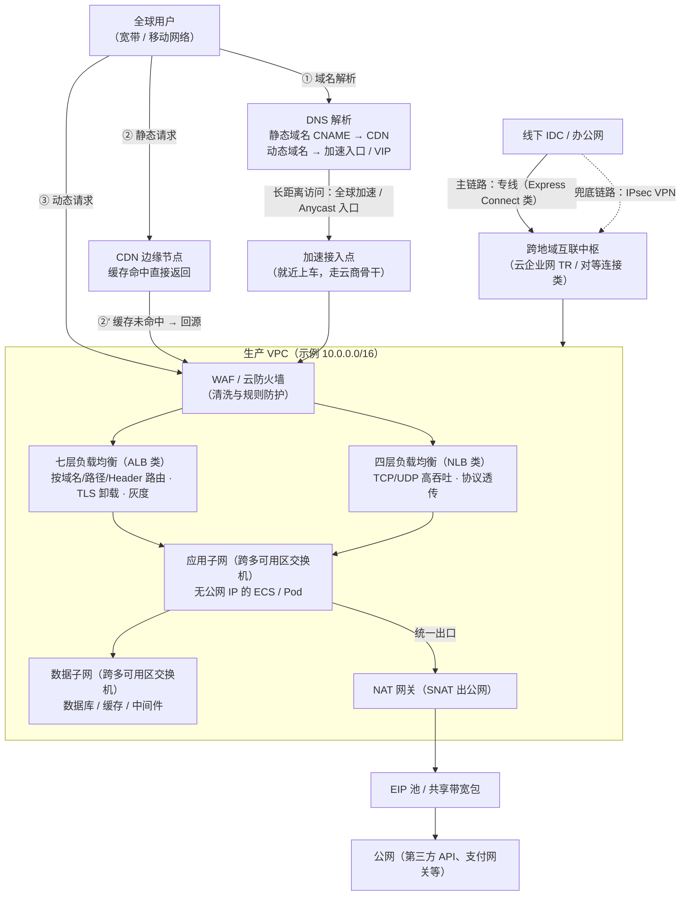

# 云网络

> 这篇写给两类人：正在做上云（或第二朵云）规划、要拍板网段和组网方案的架构师/运维负责人；以及被"为什么突然 502""为什么连不上"折磨、想建立排查心智模型的一线工程师。读完你应该能带走三样东西：**一套 VPC 网段规划的 checklist**、**一张"云上典型组网"的完整地图（从用户请求进入你的第一个子网到出公网）**，以及**一线最常踩的那几个坑的识别方法与对策**。我尽量讲"实际上怎么用、错了什么症状"，不做协议综述。

## 是什么：云上的"网络"到底是什么

[VPC（虚拟私有云）](https://en.wikipedia.org/wiki/Virtual_private_cloud)的通用定义是：在共享的公有云基础设施上，切出一块**可按需配置、与别人隔离**的私有网络——隔离靠的是给用户分配私有网段和虚拟交换/转发构造，逻辑上相当于"你在云上租了一个自己的数据中心机房网络"。

但这个定义只说了一半。从一线视角看，云网络更重要的特征是：

- **它是"云网络"而不是"云上网络"**。你买到的不是一堆虚拟设备，而是一组**服务化的网络原语**：专有网络（VPC）、交换机/子网（vSwitch 类）、路由表、安全组、网络 ACL、弹性公网 IP（EIP）、负载均衡（SLB/ELB 类）、NAT 网关、专线/VPN 网关、跨地域互联（云企业网/对等连接类）、CDN、全球加速……每个原语按声明式 API 开通、按用量计费、由云厂商的多租户底座承载。这些原语怎么在物理层实现（VXLAN 封装、Overlay、网关集群），正是 [SDN 与 NFV](/cloud/foundation/sdn-nfv) 那篇讲的事——对使用者来说它是黑盒，你只需要信任"隔离"和"SLA"这两个承诺。
- **责任边界变了**。传统机房里网络故障是"设备坏了"；云上绝大多数"网络问题"是**配置问题**——安全组漏了一条放行、路由表指错了下一跳、SNAT 端口耗尽。云厂商的骨干网挂了是小概率事件，你把自己那一层配置写错是大概率事件。
- **带宽和 IP 是钱**。公网流量、跨境链路、负载均衡实例费……网络设计的另一半是账单设计，这一点后面"实践观点"里会展开。

一句话概括这篇的范围：**VPC 是地基，负载均衡和公网入口是门面，NAT 与出网是后勤，CDN 和全球加速是毛细血管，混合云互联是走廊**。

## 为什么重要：这是上云第一步，也是最难返工的一步

我做过不少云上架构评审，网络是少数"**规划错了后面要用很大力气补救**"的层，原因有三：

1. **网段（CIDR）一旦定错，改不动**。VPC 主网段创建后不可缩容或更换，只能靠附加网段（Secondary CIDR）续命，而附加网段会给路由和防火墙策略增加长期复杂度。两个网段重叠的 VPC 要互通，就得请出 VPC NAT 做地址转换——官方甚至专门有[《VPC间互通使用VPC NAT解决地址冲突》](https://help.aliyun.com/zh/cloud-network-well-architected-design/use-vpc-nat-to-resolve-address-conflicts-between-vpcs)这样的方案文档，说明这个坑踩的人有多普遍（AWS 侧同理，重叠网段互通要靠私有 NAT 网关兜底）。
2. **网络结构决定了安全模型**。环境隔离（生产/预发/测试）、最小暴露面（谁允许有公网 IP）、南北向与东西向流量的控制点，全都长在 VPC 与子网的骨架上。骨架歪了，安全组写得再细也是在漏风的墙上贴胶带。
3. **它直接写进你的可用性和账单**。跨可用区容灾从"每个可用区至少一个交换机"开始（阿里云[网络规划](https://help.aliyun.com/zh/vpc/vpc-network-planning)文档明确建议单 VPC 至少两个交换机、分布在不同可用区）；而公网带宽、负载均衡实例费、跨地域流量费，都在网络层决定。做[高可用与容灾](/methodology/ha-dr)设计时，网络拓扑是前置输入，不是事后附件。

背景补一句：K8s 的 Pod 网段、Service 网段也要在 VPC 的 IP 预算里占坑（详见 [Kubernetes](/cloud/native/kubernetes) 那篇的网络模型一节），所以"先画 VPC、再谈一切"是有工程依据的——[弹性计算](/cloud/infra/compute)的实例规格可以随业务滚动升级，网络骨架不行。

## 架构与原理：一张典型的云上组网地图

先把全景画出来。下面这张拓扑是我做方案时的默认起点（可按规模裁剪），箭头上的编号对应一条用户请求的实际路径：

*图：典型云上组网拓扑（本篇自绘，Mermaid）。决策含义：静态流量在 CDN 终结、动态流量进 WAF+LB；子网按 DMZ→应用→数据三层收口，应用层不持公网 IP；出公网统一走 NAT 便于审计与端口规划；混合云用"专线主 + VPN 备"双通道。*

下面把地图上每个环节的原理拆开讲。

### VPC、交换机与路由

- **VPC = 私域网段 + 私有路由表 + 一个网关体系**。阿里云建议用 RFC1918 私有地址（10/8、172.16/12、192.168/16），掩码 /16~/28（[专有网络与交换机](https://help.aliyun.com/zh/vpc/vpc-and-vswitch)）；AWS 的 VPC 模型完全同构（IPv4 CIDR + 路由表 + IGW/EgressOnly-IGW）。
- **交换机（vSwitch/Subnet）是可用区级对象**：一个子网只属于一个可用区，所以"跨可用区容灾"的物理前提就是同一层业务至少切两个子网、分到不同 AZ。同 VPC 内子网网段**不允许重叠**——这是硬约束。
- **路由与对等连接**：同地域 VPC 互通优先用厂商内部机制（对等连接/云企业网同地域场景），多数云商同地域互通不额外收流量费（量级：几乎为零；跨地域流量按带宽包或按 GB 计费，具体以官方价格页为准）；跨地域别拿公网当链路——那是花钱买抖动，要用云商骨干（云企业网/Transit Gateway 类）。阿里云近年演进出的分层是：云上核心层用转发路由器 TR，混合云专线汇聚层用专线网关 ECR（[专线网关 ECR](https://help.aliyun.com/zh/express-connect/user-guide/ecr/)）。

### 安全组 vs 网络 ACL：两道不同的门

这是被问得最多、也最容易配反的一对。原理上的差别只有一句话：**安全组是有状态的实例级白名单，网络 ACL 是无状态的子网级规则表**。展开成表：

| 维度 | 安全组（Security Group） | 网络 ACL（Network ACL） |
| --- | --- | --- |
| 作用层级 | 弹性网卡 / 实例级 | 交换机（子网）级 |
| 状态性 | **有状态**：放行入方向后，回包自动放行（阿里云[使用安全组](https://help.aliyun.com/zh/ecs/user-guide/start-using-security-groups)；有状态会话保持约 910 秒，见[安全组规则](https://help.aliyun.com/zh/ecs/user-guide/security-group-rules)） | **无状态**：入、出方向要分别配规则，放行了请求必须记得放行响应（阿里云[网络ACL概述](https://help.aliyun.com/zh/vpc/network-acl-overview)） |
| 规则语义 | 白名单：默认拒绝，只写"允许"（AWS 同理） | AWS 侧可写 allow/deny、按规则号 1~32 顺序评估，命中即止（[VPC 网络 ACL](https://docs.aws.amazon.com/vpc/latest/userguide/vpc-network-acls.html)）；阿里云侧同样是子网粒度的无状态控制 |
| 生效位置 | 实例网卡处，最贴近负载 | 子网入口，比安全组更前置，可在边缘先丢掉非法流量、省后端处理 |
| 典型用法 | 主防线：按角色（web/app/db）建组、组间互授权限 | 粗粒度边界：整层子网的黑名单/合规收口（如数据子网禁止任何公网入） |
| 一张网卡/子网的归属 | 实例可挂多个安全组（策略取并集） | 一个子网同一时刻只能绑一个 ACL |

一线经验：**默认用安全组把精细策略做完，网络 ACL 只做"整层"的粗边界**。两个都用但没人维护时，出问题的概率主要来自 ACL 的无状态——最常见症状是"入方向明明放了，连接却不通"，因为回包方向被默认策略拦了。

### 负载均衡：四七层分工与健康检查

原理层面，四层（LVS 类内核转发，阿里云 CLB 的底座就是 LVS+Keepalived，七层是 Tengine，见[CLB 产品架构](https://help.aliyun.com/zh/slb/classic-load-balancer/product-overview/architecture)）做的是连接级转发：**吞吐高、协议透传、但看不见 HTTP 语义**。七层做的是请求级转发：按域名/URL 路径/Header/Cookie 路由、TLS 卸载、灰度分流——代价是性能密度更低、多了连接管理的坑（下面讲）。

健康检查是 LB 的"误摘除制造机"，参数必须吃透。以阿里云 CLB 默认值为例（[健康检查概述](https://help.aliyun.com/zh/slb/classic-load-balancer/user-guide/health-check-overview/)）：响应超时 5s、间隔 2s、健康/不健康阈值各 3 次，**判定不健康的失败时间窗口 = 5×3 + 2×(3−1) = 19 秒**；HTTP 检查默认只认 2xx/3xx。ALB 侧超时默认 5s、阈值默认 3（[ALB 健康检查](https://help.aliyun.com/zh/slb/application-load-balancer/alb-health-check)）。三个容易忽略的细节：

- 健康检查探测流量来自保留网段（阿里云 CLB 用 100.64.0.0/10 发起探测），后端主机上的 iptables/安全软件把它屏蔽了，就会**全量误摘除**；
- 监听关联的**所有**后端都不健康时，CLB 不转发请求、直接回 502（[CLB 监听 FAQ](https://help.aliyun.com/zh/slb/classic-load-balancer/support/faq-about-clb)）——所以健康检查故障 = 业务故障，别把它配成"永远健康"；
- 摘除要配"优雅"（连接排空/优雅中断）：AWS ALB 的 target 反注册默认等待 300 秒让在途请求跑完，范围 0~3600 秒（[Target Groups 文档](https://docs.aws.amazon.com/elasticloadbalancing/latest/application/load-balancer-target-groups.html)）；阿里云侧 CLB/ALB 也支持优雅中断（超时范围 10~900 秒，ACK 通过 Annotation 配置）。发布系统摘节点时看到"最后几个请求报错"，基本都是没排空。

### NAT 网关与 SNAT 端口：出公网的经济学

私网里的实例没有公网 IP 却要访问外部 API（第三方支付、模型服务、更新源……），标准解法是 NAT 网关：以 SNAT 方式把大量内网连接**复用少数几个 EIP**出公网——本质是"IP:端口的多路复用"。这张图讲的是地址与端口替换的基本原理：

*图源：Wikimedia Commons（[File:NAT Concept-en.svg](https://commons.wikimedia.org/wiki/File:NAT_Concept-en.svg)，Michel Bakni，CC BY-SA 4.0）*

原理直接决定容量：**一个 NAT IP 对"同一个目的 IP+端口+协议"最多提供约 5.5 万个端口**。阿里云口径：单条 SNAT 的并发连接数 ≈ **N × 55,000**（N 为绑定的 EIP 数），SNAT 默认分配端口范围 1025~65535（[使用公网 NAT 网关](https://help.aliyun.com/zh/nat-gateway/user-guide/use-internet-nat-gateway-for-public-network-access)）；AWS 完全同构——每个 IP 对单一目的 55,000 条并发，NAT 网关最多绑 8 个 IP、合计 44 万（[NAT gateway basics](https://docs.aws.amazon.com/vpc/latest/userguide/nat-gateway-basics.html)、[AWS 博客：给 NAT 网关加多个 IP 扩展出口](https://aws.amazon.com/blogs/networking-and-content-delivery/attach-multiple-ips-to-a-nat-gateway-to-scale-your-egress-traffic-pattern/)）。

监控上两家都把"端口分配失败"做成了现成指标：阿里云 NAT 网关的"端口分配失败丢失数"、AWS CloudWatch 的 `ErrorPortAllocation`（[NAT 网关监控](https://help.aliyun.com/zh/nat-gateway/user-guide/view-monitoring-data)、[AWS 指标文档](https://docs.aws.amazon.com/vpc/latest/userguide/metrics-dimensions-nat-gateway.html)）。**这两个指标不为零，就是 SNAT 端口要耗尽了**——这是排查出网随机超时/连接失败时的第一站。

顺带把 EIP 说清楚：EIP 是**可独立购买与持有、可动态绑定/解绑**的公网 IPv4 资源，绑定走的是公网网关上的 NAT 映射（阿里云[什么是弹性公网IP](https://help.aliyun.com/zh/eip/product-overview/what-is-eip)）。这个"IP 与实例解耦"的设计就是故障转移（实例挂了把 IP 摘走重绑）、以及"IP 白名单不跟着伸缩变"的基础。

### CDN 与边缘：从缓存到边缘运行时

CDN 的教科书定义是"地理上分布的代理服务器网络，靠把内容推到离用户更近的位置降低延迟"（[Wikipedia: Content delivery network](https://en.wikipedia.org/wiki/Content_delivery_network)）。核心机制就一句话：**命中率换回源带宽**。

*图源：Wikimedia Commons（[File:NCDN - CDN.svg](https://commons.wikimedia.org/wiki/File:NCDN_-_CDN.svg)，CC0）*

左图是每个用户都长途跋涉回源站；右图是内容分布到边缘，用户就近取。"就近"靠两件事实现：**DNS 调度**（CNAME 到 CDN 域名，按 Local DNS 出口判用户位置）和 **Anycast**——同一个 IP 在全球多点宣告，BGP 自动把包送到"路由意义上最近"的节点（[Wikipedia: Anycast](https://en.wikipedia.org/wiki/Anycast)）。

*图源：Wikimedia Commons（[File:Anycast.svg](https://commons.wikimedia.org/wiki/File:Anycast.svg)，公有领域）*

趋势上有两点值得写进方案：**全站加速**（动态请求不走缓存，但沿 CDN 节点间骨干回源，等于把"最后一公里之外的路"也优化了）和**边缘运行时**（在 CDN 节点上直接跑 JS/WASM 逻辑，鉴权、改写、A/B 分流下沉到边缘——"缓存"正在变成"边缘计算"）。大文件分发（游戏安装包、直播回放）则常见 **CDN + P2P 混合**：边缘带宽贵，能省则省。

### 全球加速与混合云互联：本质都是"用钱买路由"

**全球加速类产品的本质，是用云商骨干替代公网长距离路径，买的是"稳定延迟"**。链路三段式：用户在离自己最近的接入点"上车"（加速 IP/Anycast EIP/CNAME 均可），中间跑云商内网 BGP 骨干，在离源站最近处"下车"（[什么是全球加速 GA](https://help.aliyun.com/zh/ga/)）。跨境场景多一道选择题：一类是"精品带宽"型线路，开箱即用、简化资质流程；一类是运营商跨境专线型，效果更好但要走合规认证（[GA 跨境传输网络类型](https://help.aliyun.com/zh/ga/developer-reference/api-ga-2019-11-20-updateacceleratorcrossbordermode)）。涉及中国内地跨境互联的业务，**合规前置**，别等架构做完才发现线路不能上。

**混合云互联**两条路，我的默认组合是"专线主、VPN 备"：

| 维度 | 物理专线（Express Connect/Direct Connect 类） | IPsec VPN 网关 |
| --- | --- | --- |
| 延迟与抖动 | 稳定（独占链路），可预期 | 走公网，抖动不可控 |
| 上线周期 | 长（楼内布线+运营商流程，周~月量级） | 快（分钟~小时级） |
| 成本量级 | 固定租金 + 端口费，带宽单价高 | 实例费 + 流量，带宽单价低 |
| 加密 | 链路透隔离，可选应用加密 | 自带隧道加密 |
| 典型定位 | 长期稳定东西向流量（同步、API、运维） | 临时扩容、灾备兜底、分支接入 |

云厂商官方口径也是"专线在网络质量、安全性、带宽上优于 VPN"（[什么是高速通道](https://help.aliyun.com/zh/express-connect/product-overview/what-is-express-connect/)），取舍只在钱和时间；[网络服务选型指南](https://help.aliyun.com/zh/decision-guides/how-to-select-an-alibaba-cloud-network-service)与[IDC 通过专线访问云服务](https://help.aliyun.com/zh/cloud-network-well-architected-design/idc-accesses-cloud-services-through-leased-lines)是两份很好的对照材料。设计原则重申一遍提纲里的话：**双通道冗余 + 主备路由明确**——专线 BGP 权重设优，VPN 做热备并让路由收敛策略经过演练；只有一条专线裸奔的混合云，故障时你只能等运营商。

### DNS：整条链路的隐形地基

请求进 CDN/LB 之前，DNS 已经做了三次关键决策：给静态域名选 CDN 调度、给动态域名选入口 VIP/加速地址、给故障切换改指向。原理是分层授权与缓存：递归解析器从根 → 顶级域 → 权威服务器逐级问下来，**每一级都按记录的 TTL 缓存结果**（[Wikipedia: Domain Name System](https://en.wikipedia.org/wiki/Domain_Name_System)；TTL 本义是报文/记录生存期上限，[Wikipedia: Time to live](https://en.wikipedia.org/wiki/Time_to_live)）。

一线要记住的 TTL 两难：**TTL 长 = 解析快、账单上查询量少，但切换生效慢；TTL 短 = 切换快，但权威 DNS 压力大、部分不守规矩的本地解析器/客户端还会超额缓存**。所以生产切换的标准动作是：提前 24 小时把计划变更记录的 TTL 降到分钟级（如 300s→60s），切完再调回去。多地域/多云流量调度用"DNS + 健康检查自动改记录"（GSLB/DNS 故障切换类功能）能做 80 分方案，剩下 20 分卡在客户端缓存上——所以重要链路还要叠加 Anycast/全局流量入口做兜底，而不是指望 DNS 切干净。

## 实践与选型

### VPC 网段规划 checklist

我习惯按这张单子评审（多数条目来自[阿里云 VPC 网络规划](https://help.aliyun.com/zh/vpc/vpc-network-planning)、[IP 子网规划](https://help.aliyun.com/zh/document_detail/2948830.html)等公开文档 + 踩坑归纳）：

1. **网段池先分家**：多云/混合云场景，把 10/8、172.16/12、192.168/16 按"云 A 用哪段、云 B 用哪段、线下用哪段"切开，永不重叠——这是后面一切互通的前提。
2. **避开保留与常见冲突段**：不要用 100.64.0.0/10 等云商保留段（健康检查探测也来自这里）；主动避开 172.17.0.0/16（Docker 默认网段）和 K8s 常用的 pod/service 段（[专有网络 FAQ](https://help.aliyun.com/zh/vpc/frequently-asked-questions)）。
3. **VPC 大小**：生产 VPC 建议 /16；容器化 + Pod 直挂 VPC IP 的集群要按"节点数 × Pod 副本 × 裕量"放大预算，必要时上附加网段。
4. **子网切法**：每层业务（DMZ/应用/数据）× 每个要用到的可用区一个交换机，子网掩码按层给 /24~/22；**给未来预留 10~20% 地址空间**，且子网大小要大于当前需求而不是刚好等于。
5. **环境隔离靠 VPC 而不是子网**：生产/预发/测试三 VPC 起步；同 VPC 内子网只是广播域粒度，不构成交付与故障域边界。
6. **路由表独立规划**：出公网流量、走专线流量、跨地域流量分开建表，别共用系统路由表"一表走天下"。

### 负载均衡选型表

| 需求特征 | 选择 | 适用边界与注意 |
| --- | --- | --- |
| HTTP/HTTPS 路由、按 Header/Cookie 灰度、TLS 卸载、QUIC/gRPC | 七层 ALB 类 | 官方口径单实例可支撑百万级 QPS 量级（[SLB 产品家族](https://help.aliyun.com/zh/slb/product-overview/slb-overview)）；长连接与 WebSocket 注意空闲超时与后端 keep-alive 对齐 |
| TCP/UDP 超高并发、协议透传（游戏、IoT、金融专线协议） | 四层 NLB/CLB-TCP 类 | NLB 官方标称亿级并发连接 + 百 Gbps 带宽量级；源地址保持：四层看客户端真实 IP 需 PPv2 或后端开全 NAT 透传，七层靠 XFF 头 |
| 存量简单站点、按域名/URL 分发 | CLB 七层可用 | 官方已建议新建优先 ALB/NLB（[CLB 监听类型](https://help.aliyun.com/zh/slb/classic-load-balancer/user-guide/listener-overview/)）；迁移有官方一键工具 |
| AWS 对照 | ALB（七层）/ NLB（四层）/ CLB（legacy） | 同构逻辑；注意 target group 维度的健康检查与排空参数 |
| 多可用区高可用 | 任意新实例 | 选支持多 AZ VIP 的形态；实例本身不跨 AZ 部署就别谈容灾 |

### 出公网与入公网：默认形态

我的默认策略：**入向**只开 LB（对外）+ 堡垒（运维）两类公网入口，其余实例一律无公网 IP；**出向**统一 NAT 网关 SNAT，按业务分 SNAT 条目（而不是全公司挤一条），既控端口消耗又做审计隔离；需要固定出口 IP 对接受方白名单的系统，单给它一组专属 EIP。对等的 AWS 最佳实践也是 public/private subnet 分层 + NAT 网关出网（[VPC 用户指南](https://docs.aws.amazon.com/vpc/latest/userguide/vpc-network-acls.html) 体系）。

## 常见坑

| 坑 | 典型症状 | 根因与对策 |
| --- | --- | --- |
| 网段重叠 | 跨 VPC/云间互通时路由时通时不通、部分地址永远不可达 | 规划期没按"网段池分家"；补救走 VPC NAT 地址转换（成本高，能用附加网段重规划更好） |
| SNAT 端口耗尽 | 高峰期出公网连接随机超时/失败，重启应用短暂缓解 | 对单一目的 IP:端口的并发超了 N×55,000；看"端口分配失败丢失数"/`ErrorPortAllocation` 指标；对策：加 EIP、拆 SNAT 条目、客户端做连接池与更短空闲超时 |
| LB 健康检查误摘除 | 后端明明活着却间歇 503/502，摘除又恢复的"抖动" | 探测被主机防火墙挡（100.64 段）；健康检查打了重接口（鉴权/查库）把自己拖垮；状态码白名单配窄了；对策：健康检查用轻量静态路径 + 与业务流量隔离 |
| 后端 keep-alive 与 LB 空闲超时不一致 | 低频流量时段偶发 502，压测复现不了 | 经典坑：CLB 七层空闲超时默认 15s（范围 1~60s，[HTTP 监听文档](https://help.aliyun.com/zh/slb/classic-load-balancer/user-guide/add-an-http-listener-1)），后端 Nginx/Tomcat keep-alive 若 ≥ 这个值，LB 先关连接、后端拿旧连接复用就 RST/502；对策：**后端空闲超时设为略小于 LB 的 15s 量级**，或显式调大 LB 超时 |
| DNS TTL 缓存 | 切换/下线后仍有"幽灵流量"打到旧地址；灰度发布被污染 | 各级解析器按旧 TTL 缓存（还有超额缓存）；对策：变更前 24h 降 TTL、旧入口保持可用直至最大 TTL 过期、重要切换叠加 Anycast/流量入口层控制 |
| 跨境/长距离公网带宽 | 海外用户访问国内源站晚高峰必现高延迟，丢包突发 | 公网国际出口是拥塞高发段（量级感受，具体看实测）；对策：全球加速骨干替代、静态先上 CDN、动态 API 走就近下车点；跨境线路注意合规认证前置 |
| ACL 无状态忘配回包 | 在子网边界加了"允许入"的规则，连接依然不通 | 网络 ACL 无状态，回包方向必须单独放行；优先把策略收进有状态的安全组 |

## 实践观点

- **网络规划是上云的"地基工程"，宁可一周画清楚，不要一年打补丁**。CIDR 的不可逆性决定了它是整个方案里最该被认真评审的一页。环境隔离到 VPC 层、容灾到可用区层、隔离到安全组层——三层各自干各自的事，不要互相替补。
- **把"计费模型"当架构约束看**。公网出向贵、回源流量与边缘流量价差明显、跨地域流量按量收费——多数网络优化（CDN 命中率、回源压缩、NAT 收敛出口、就近接入）本质都是在优化流量结构。做方案时我会先画流量地图再谈组件选型。
- **排查路径标准化，别让每个工程师自创**。我的默认顺序：**连通性（ping/telnet/抓包）→ 路由（路由表下一跳、跨地域 TR）→ 安全组/ACL（双向逐条核对）→ 网关与监听（NAT 端口、LB 健康检查与超时）→ 应用（真实客户端 IP 有没有丢、keep-alive 对不对）**。九成的"云网络故障"在前四步就能定位——因为它们本来就不是设备故障，是配置问题。
- **IPv6 与双栈**：主流云厂商的 VPC、SLB、CDN 都已支持双栈（阿里云控制台可一键开 VPC IPv6），国内移动网络下 IPv6 直连的 QoS 普遍好于 NAT 后 IPv4。我的建议是新建业务按双栈规划 DNS 记录（AAAA 与 A 同时维护、TTL 策略一致），存量改造不急但别把 IPv6 当成"以后的事"。
- **别迷信"网络即代码"能替代规划**。Terraform/ROS 管得住变更审计，管不住网段一开始就画错。先把这张地图（本文第一张 Mermaid）画对，再谈自动化。

## 参考资料

<Refs>

**云厂商官方文档（阿里云）**（访问日期 2026-09-02）

- [专有网络 VPC 网络规划](https://help.aliyun.com/zh/vpc/vpc-network-planning) / [专有网络与交换机](https://help.aliyun.com/zh/vpc/vpc-and-vswitch) / [IP 子网规划](https://help.aliyun.com/zh/document_detail/2948830.html) / [专有网络 FAQ](https://help.aliyun.com/zh/vpc/frequently-asked-questions)
- [网络 ACL 概述](https://help.aliyun.com/zh/vpc/network-acl-overview) / [使用安全组](https://help.aliyun.com/zh/ecs/user-guide/start-using-security-groups) / [安全组规则](https://help.aliyun.com/zh/ecs/user-guide/security-group-rules)
- [负载均衡 SLB 产品家族](https://help.aliyun.com/zh/slb/product-overview/slb-overview) / [CLB 架构](https://help.aliyun.com/zh/slb/classic-load-balancer/product-overview/architecture) / [CLB 监听类型](https://help.aliyun.com/zh/slb/classic-load-balancer/user-guide/listener-overview/) / [CLB HTTP 监听](https://help.aliyun.com/zh/slb/classic-load-balancer/user-guide/add-an-http-listener-1)
- [CLB 健康检查概述](https://help.aliyun.com/zh/slb/classic-load-balancer/user-guide/health-check-overview/) / [ALB 健康检查](https://help.aliyun.com/zh/slb/application-load-balancer/alb-health-check) / [CLB 监听 FAQ](https://help.aliyun.com/zh/slb/classic-load-balancer/support/faq-about-clb)
- [公网 NAT 网关](https://help.aliyun.com/zh/nat-gateway/user-guide/use-internet-nat-gateway-for-public-network-access) / [NAT 网关监控与运维](https://help.aliyun.com/zh/nat-gateway/user-guide/view-monitoring-data) / [VPC NAT 解决地址冲突](https://help.aliyun.com/zh/cloud-network-well-architected-design/use-vpc-nat-to-resolve-address-conflicts-between-vpcs)
- [什么是弹性公网 IP](https://help.aliyun.com/zh/eip/product-overview/what-is-eip)
- [什么是高速通道](https://help.aliyun.com/zh/express-connect/product-overview/what-is-express-connect/) / [专线网关 ECR](https://help.aliyun.com/zh/express-connect/user-guide/ecr/) / [IDC 通过专线访问云服务](https://help.aliyun.com/zh/cloud-network-well-architected-design/idc-accesses-cloud-services-through-leased-lines) / [网络服务选型指南](https://help.aliyun.com/zh/decision-guides/how-to-select-an-alibaba-cloud-network-service)
- [全球加速 GA](https://help.aliyun.com/zh/ga/) / [GA 跨境传输网络类型](https://help.aliyun.com/zh/ga/developer-reference/api-ga-2019-11-20-updateacceleratorcrossbordermode)

**云厂商官方文档（AWS）**（访问日期 2026-09-02）

- [VPC 网络 ACL](https://docs.aws.amazon.com/vpc/latest/userguide/vpc-network-acls.html) / [VPC 安全组](https://docs.aws.amazon.com/vpc/latest/userguide/vpc-security-groups.html)
- [NAT gateway basics（55,000 并发上限）](https://docs.aws.amazon.com/vpc/latest/userguide/nat-gateway-basics.html) / [NAT 网关 CloudWatch 指标（ErrorPortAllocation）](https://docs.aws.amazon.com/vpc/latest/userguide/metrics-dimensions-nat-gateway.html) / [博客：NAT 网关多 IP 扩展](https://aws.amazon.com/blogs/networking-and-content-delivery/attach-multiple-ips-to-a-nat-gateway-to-scale-your-egress-traffic-pattern/)
- [ALB Target Groups（deregistration delay）](https://docs.aws.amazon.com/elasticloadbalancing/latest/application/load-balancer-target-groups.html)

**通用参考（Wikipedia）**（访问日期 2026-09-02）

- [Virtual private cloud](https://en.wikipedia.org/wiki/Virtual_private_cloud) / [Network address translation](https://en.wikipedia.org/wiki/Network_address_translation) / [Content delivery network](https://en.wikipedia.org/wiki/Content_delivery_network) / [Anycast](https://en.wikipedia.org/wiki/Anycast) / [Domain Name System](https://en.wikipedia.org/wiki/Domain_Name_System) / [Time to live](https://en.wikipedia.org/wiki/Time_to_live)

**图片来源**（访问日期 2026-09-02）

- [cdn-topology.png](/images/cloud/network/cdn-topology.png) ← Wikimedia Commons：[File:NCDN - CDN.svg](https://commons.wikimedia.org/wiki/File:NCDN_-_CDN.svg)（CC0）
- [nat-concept.svg](/images/cloud/network/nat-concept.svg) ← Wikimedia Commons：[File:NAT Concept-en.svg](https://commons.wikimedia.org/wiki/File:NAT_Concept-en.svg)（Michel Bakni，CC BY-SA 4.0）
- [anycast-routing.svg](/images/cloud/network/anycast-routing.svg) ← Wikimedia Commons：[File:Anycast.svg](https://commons.wikimedia.org/wiki/File:Anycast.svg)（公有领域）

> 说明：Cloudflare Learning Center 的 DNS/CDN/负载均衡/DDoS 科普页本次抓取被反爬拦截，未能引用；相关概念改以上述 Wikipedia 与官方文档为准。文中所有带宽/价格均为量级化表述，**以各云厂商官方计费页为准**。

**站内相关**：[SDN 与 NFV](/cloud/foundation/sdn-nfv) · [弹性计算](/cloud/infra/compute) · [高可用与容灾设计](/methodology/ha-dr) · [Kubernetes](/cloud/native/kubernetes) · [计算·存储·网络导读](/cloud/infra/)

</Refs>