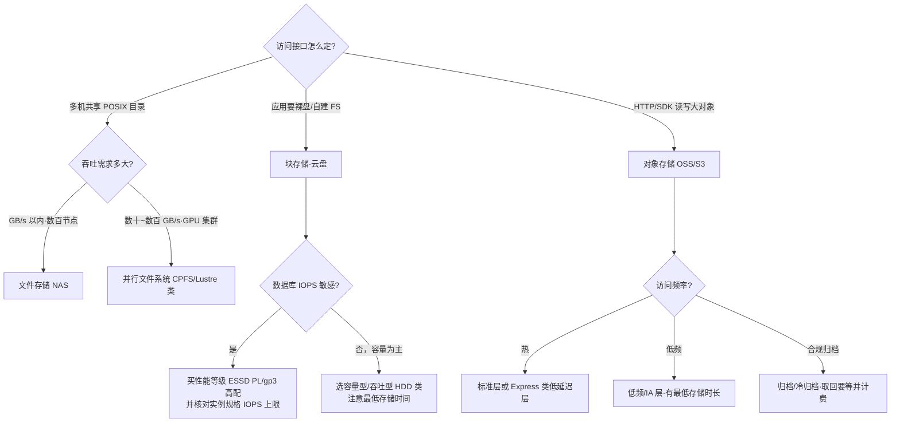
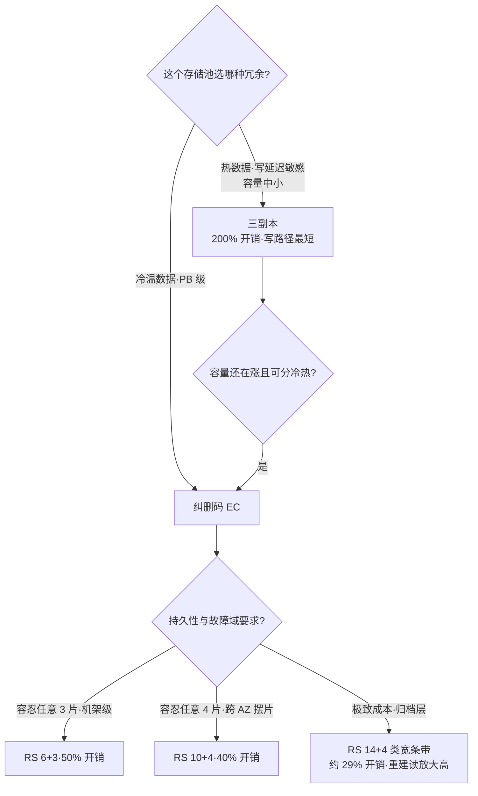
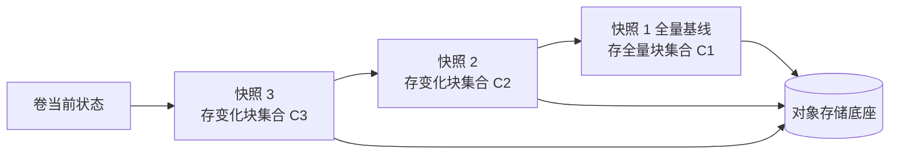
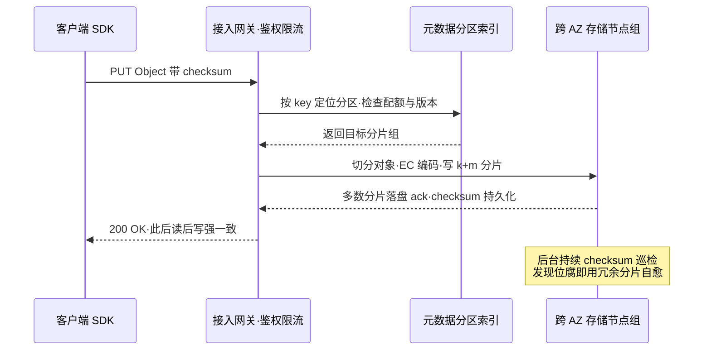
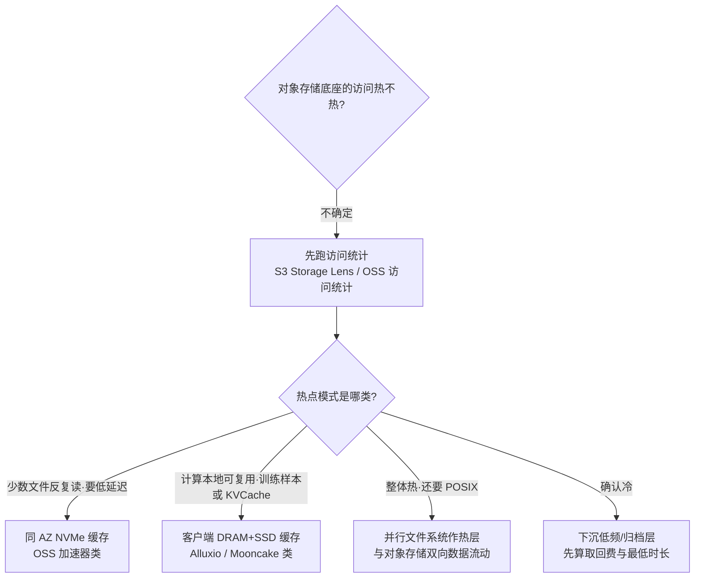

# 云存储

> 存储是我做方案时最后悔"想得太晚"的一层：计算可以换、网络可以改，数据一旦落下去，搬家成本就是量级差。这篇面向要做选型、降本或排查 IO 问题的工程师与架构师，按一条主线展开：**块/对象/文件三种形态在机制层面的分界（一致性、元数据、扩展上限、协议）→ 每种形态内部是怎么实现持久性与性能的（三副本与纠删码的冗余账、快照增量链、元数据分区、并行文件系统的 MDS/OST）→ 存算分离与 AI 时代对存储的新要求 → 一线最容易踩的坑**。读完你应当能独立回答"这个负载该用什么存储、买多大性能、缓存加在哪、怎么备份"这四个问题。文中的规格数字均为各厂商公开文档口径，截至 2026-09。

## 是什么：块、对象、文件三种形态

所有云存储产品，本质上都是三种访问形态在不同规模下的工程化：

| 类型 | 代表 | 接口 | 典型场景 | 不适合 |
| --- | --- | --- | --- | --- |
| 块存储 | 云盘（EBS/ESSD） | 挂载为设备（裸块，自己格式化） | 数据库、文件系统、单机应用 | 共享读写 |
| 对象存储 | OSS / S3 | RESTful API（HTTP PUT/GET） | 图片/视频/备份/静态资源 | 频繁随机小写、目录 rename |
| 文件存储 | NAS / CPFS（NFS/SMB/并行客户端） | POSIX 挂载 | 共享文件、AI 训练数据集 | 超大吞吐（选 CPFS/并行文件系统） |

三者的分界线我一般这样记：**块是"一块还没格式化的硬盘"，文件是"一个多个机器共用的目录"，对象是"一个用 HTTP 访问的无限大 K/V 仓库"**。形态决定了语义：块语义才有真正的随机覆写和文件系统锁；文件语义天然多客户端共享；对象语义只有"整体写入、整体读取"，改一个字节也要重传整个对象，"目录"只是 key 上的前缀假象。

三种形态的历史出身解释了它们的性格差异：块存储出自 SAN（存储区域网络），卖的是"远端本地盘"的幻觉，语义冻结在 SCSI/NVMe 设备层；文件存储出自 NAS 与企业文件服务器，卖的是目录共享，语义停在 POSIX 层；对象存储出自互联网时代海量非结构化数据的现实，干脆放弃"盘"和"目录"的伪装，用最朴素的 K/V 语义换极致扩展与低成本。**保留的语义越多，每 GB 越贵、扩展越难；放弃的语义越多，应用层要补的课越多**——一切选型权衡都是在这条谱系上选位置。

但选型时只记这三句话不够，机制层面的差异才是事故来源。把六种维度摆在一起看：

| 对比项 | 块存储 | 文件存储 | 对象存储 |
| --- | --- | --- | --- |
| 访问协议 | 设备语义：virtio-blk / NVMe；存储后端网络多为 RDMA / NVMe-oF 类 | NFSv3/v4、SMB；并行客户端（Lustre/CPFS 类） | HTTP REST：PUT/GET/DELETE/LIST + 分片上传（S3 API 事实标准） |
| 写语义 | 字节级随机覆写，fsync/O_DIRECT 可控 | 字节级随机读写 + 追加，POSIX 锁 | 只有整对象覆写；改一字节 = 重传全对象；无锁 |
| 一致性模型 | 单挂载点内由设备保证写顺序；跨卷无任何事务 | 以 close-to-open 一致性为基线，锁语义因产品而异 | 读后写强一致（含 list，S3 自 2020-12 起，OSS 同） |
| 元数据管理 | 卷→数据块映射表，规模小、集中管理 | 命名空间树：NAS 集中元数据服务；并行文件系统 MDS 集群（DNE 可分多 MDT） | 分布式分片：key 哈希进分区（CRUSH / partition map），没有中心目录树 |
| 扩展上限 | 单卷 64 TiB 量级（EBS/ESSD 公开规格） | 单文件系统 PB~十 PB 量级；单目录条目数有上限 | 单桶近乎无限；单对象 5 TB（S3）/ 48.8 TB（OSS 分片上传） |
| 共享模型 | 多重挂载需应用自备集群协调 | 原生多客户端共享 | 天然多客户端读，但无共享写语义 |
| 延迟量级 | 亚毫秒~数毫秒 | 毫秒级（NAS）~亚毫秒 4k（并行文件系统全闪） | 数十毫秒（标准层）~个位数毫秒（Express 类低延迟层） |

对应的"不可越界"场景也要记死：**块存储不要当多机共享读写盘用**（多重挂载没有集群锁语义，见后文）；**文件存储不要期待对象级的廉价无限容量**（元数据服务和锁协调都是真金白银）；**对象存储不要当文件系统或数据库 WAL 盘用**（没有随机覆写、没有 fsync 语义，s3fs 类挂载的坑见坑表）。

下面这张决策流是我给客户讲选型时白板上画得最多的一张：



图里两条最容易忽略的红线：**块存储的性能要买两次**——云盘一档、ECS/EC2 实例规格一档，取最小值生效；**低频和归档不是"更便宜的标准层"**，它有最低存储时长和取回费，账要按数据全生命周期算。

## 为什么重要

- **存储是三要素里迁移成本最高的**。计算实例换规格是分钟级的事，换存储形态（比如把挂在盘上的数据库迁到对象存储为基座的数据湖）往往是一次架构重构。选型错误的第一笔学费其实是"重做"。
- **持久性数字决定你敢不敢只留一份**。云盘的设计持久性通常在 9 个 9 量级，对象存储标到 11~12 个 9——这直接决定备份策略要不要跨介质、跨地域（下文细讲）。
- **成本大头藏在 IO 和流量里**。我做过不少账单体检：存储本体单价便宜，但"买了容量没买够 IOPS 被迫整机升配""对象存储被当盘挂导致请求费失控""快照只增不减"这三类浪费非常普遍。
- **存算分离让存储变成独立账单**。数据库、大数据把计算和存储拆开弹性之后，存储的 IOPS/吞吐/流量各自计价，"架构选错"会直接以月度账单的形式持续收费。
- **AI 时代存储回到了聚光灯下**。模型参数和训练数据集的体量让"带宽"取代"算力"成为部分集群的第一瓶颈，KV Cache 与向量数据又把存储层级推进到推理链路里，后面单独讲。
- **存储层是性能事故的背锅位与真凶位**。我复盘过的"变慢"投诉里，根因在存储侧（突发额度、快照懒加载、元数据风暴、跨 AZ 流量、热前缀限流）的比例，远高于排查开始时大家愿意相信的比例；把存储机制读懂，等于给团队的 MTTR 买保险。

## 架构与原理

### 块存储：从机箱里的本地盘到分离式云盘

先看传统形态。一台服务器里，SATA HDD、FC HBA、NVMe SSD 全部挂在 CPU 的 PCIe 总线上——存储与计算同生共死：盘坏了整机受影响，容量不够要连机器一起换，盘闲着也不能借给别人。


*图源：Werner Vogels 官方博客 Continuous reinvention: A brief history of block storage at AWS（[allthingsdistributed.com](https://www.allthingsdistributed.com/2024/08/continuous-reinvention-a-brief-history-of-block-storage-at-aws.html)）*

云盘做的第一件事就是把这个绑定拆开。AWS 2012 年的 EBS 架构是这样的：实例侧的块 IO 队列经 hypervisor、网络，送到独立的 EBS 存储服务器上的队列，再落盘。存储与计算从此可以独立扩缩、独立故障域，但代价是 IO 路径上每一跳都是一个队列——之后十几年块存储的性能工程，本质上就是"消队列"的历史（控制面移出 IO 路径、内核旁路、硬件卸载）。


*图源：Werner Vogels 官方博客 Continuous reinvention: A brief history of block storage at AWS（[allthingsdistributed.com](https://www.allthingsdistributed.com/2024/08/continuous-reinvention-a-brief-history-of-block-storage-at-aws.html)）*

协议层也跟着进化：guest 里看到的设备从 virtio-blk 演进到 NVMe（队列模型更贴合闪存并行度），宿主机到存储池的后端网络普遍换成 RDMA（RoCE 类）。NVMe-oF（NVMe over Fabrics）把这个思路标准化：NVMe 的语义不再局限于 PCIe 总线，可以跑在 Fibre Channel、InfiniBand、RoCE、iWARP 等 fabric 上——今天多数云盘"亚毫秒延迟"的公开规格，前提就是这条全 NVMe + RDMA 的路径。

三条路径的延迟量级对照（4k 随机读，经验量级）：

| 路径 | 延迟量级 | 说明 |
| --- | --- | --- |
| 本地 NVMe SSD 直读 | 百 µs 内 | 基线，但容量与计算绑定 |
| NVMe-oF/RDMA 云盘 | 亚毫秒~毫秒 | 分离式默认，性能靠全链路优化 |
| TCP 栈块存储（老一代/经济型） | 毫秒~数毫秒 | 协议栈开销占大头 |

这就是"同一家云、同一档 IOPS、延迟却差一倍"的常见解释：差的不是盘，是路径。


*图源：Wikimedia Commons（[文件页](https://commons.wikimedia.org/wiki/File:NVMe_over_Fabrics.svg)）*

#### 冗余：从 RAID 到纠删码，一笔空间与重建的账

云盘的底层是把物理机上的大量 SSD/HDD 通过分布式存储池化，再切块映射给你的虚拟机。理解传统磁盘阵列的冗余思路，就理解了云盘 durability 的 70%：


*图源：Wikimedia Commons（[文件页](https://commons.wikimedia.org/wiki/File:Raid_array.jpg)）*

传统 RAID 用"条带化 + 校验盘"对抗单盘故障：RAID 5 把数据和分布式校验块交错摆在一组盘上，任意坏一块盘可以用其余盘和校验块反算重建：


*图源：Wikimedia Commons（[文件页](https://commons.wikimedia.org/wiki/File:RAID_5.svg)）*

云时代更进一步，主流做法是**纠删码（Erasure Coding，EC）**：把数据切成 k 个数据片 + m 个校验片，任意丢 m 片都能恢复。下图是 RS 码的完整流程：原始文件切 k 片、编码出 n = k + m 片分散存放，读取时下载任意 k 片即可重构。


*图源：Wikimedia Commons（[文件页](https://commons.wikimedia.org/wiki/File:RS%E7%A0%81%E7%9A%84%E7%BC%96%E7%A0%81%E5%92%8C%E9%87%8D%E6%9E%84%E8%BF%87%E7%A8%8B.jpg)）*

把冗余策略当成一笔账来算，三副本和 EC 的取舍就清楚了（空间开销 = m/k 或副本数-1）：

| 策略 | 空间开销 | 可容忍丢失 | 重建读放大 | 典型用途 |
| --- | --- | --- | --- | --- |
| 三副本 | 200% | 任意 1 份（并发坏 2 份靠机架分散兜底） | 读 1 份全量 | 热卷、小容量池、写延迟敏感 |
| RS 6+3 | 50% | 任意 3 片 | 读 6 片 | 温冷池 |
| RS 10+4 | 40% | 任意 4 片 | 读 10 片 | 对象存储常见配置量级 |
| RS 14+4 类宽条带 | 约 29% | 任意 4 片 | 读 14 片 | 归档/深冷层，换成本接受重建慢 |

相比三副本（300% 空间开销的口径下，RS 10+4 只要 140%），且重建时只需读 k 片而非整个副本——这是对象存储能把持久性做到 11 个 9 还保持低成本的核心。Ceph 是这条路线最出名的开源实现，[Ceph 文档](https://docs.ceph.com/en/reef/architecture/)明确它"用一套统一系统同时提供对象、块、文件存储"，块设备（RBD）和文件系统（CephFS）最终都落成 RADOS 对象。

但 EC 不是免费午餐：**写路径要做全条带写或读-改-写，小写放大明显**；条带越宽，单片修复要读的片越多。所以一线系统的常见分工是"热路径三副本、冷数据转 EC"，并按故障域（盘/机架/可用区）决定片的摆放。阿里云 EBS 团队在 FAST'24 的论文里把这类"弹性、可用性、性能"的十年取舍写得很透，值得做块存储的人精读。



#### 快照：ROW 与 COW 两条路线，云上收敛为增量链

本地 SAN/文件系统时代的快照有两条实现路线：**COW（Copy-on-Write）**——首次覆写某旧块前，先把旧数据拷贝到快照空间，再原地覆写，写路径多一次读+写；**ROW（Redirect-on-Write）**——新写落到新块，元数据指针改指新块，快照保留旧指针，写路径干净但产生碎片。云盘快照几乎都做成第三种形态：**块粒度的增量快照 + 对象存储底座**：第一次全量，之后每次只把变化块上传到对象存储，快照之间形成引用链。公开文档里最实用的三条推论（EBS 快照机制与阿里云快照一致）：

1. **删旧快照不等于省空间到底**：一个数据块只要被链上任何一个快照引用，就删不掉；删中间环节会触发向下一个快照的"数据合并"，删最新一环最安全（AWS 归档指南甚至明确"不要归档链上第一个快照，后面的都引用它"）。
2. **快照创建时长取决于"距上次快照改了多少块"**，长期不打的卷一旦打快照可能慢得像全量。
3. **从快照开出的新卷默认是"懒加载"**：数据后台从对象存储拉取，首读延迟高，大规模拉起（如灾备切换、弹性扩容）要考虑预热/快速恢复能力。

增量链的引用关系可以画成这张图：每个快照只存"相对上一环的变化块集合"，未变化的块向上引用前环，所有块最终落在对象存储底座上：



所以删除 S2 并不直接释放 C2：C2 中仍被 S3 引用的块要保留，其余才回收合并——"删了快照空间没降"的机制级根因就在这里；同理，链头 S1 被后面所有环引用，是最不能动的一环。

#### 多重挂载与共享盘：云盘不给集群锁

默认一块云盘只能挂给一个实例。需要多机共写时，EBS Multi-Attach 允许 io1/io2 卷同时挂到同可用区最多 16 台 Nitro 实例，阿里云也有共享块存储类产品。但要知道边界：**云盘只负责把同一块设备暴露给多个客户端，不提供分布式锁和缓存一致性**——并发写协调是应用自己的事（Oracle RAC 类集群数据库、集群文件系统才配用）。给普通应用开多重挂载，等于手工制造数据损坏。

#### IO 路径延迟分解：排查时逐跳对账

块存储延迟超标时不要只盯着"盘"的监控，要沿路径逐跳对账。一块典型公有云 NVMe 云盘的 4k 随机读，从发起到完成要穿过这些层（量级为经验值，随厂商与实例代际浮动）：

| 跳 | 发生什么 | 量级 |
| --- | --- | --- |
| 应用 → guest 内核 | syscall/io_uring、块层合并与拆分 | 几十 µs |
| guest 驱动（virtio-blk/NVMe） | 队列提交、中断或中断合并 | 几十 µs |
| 宿主机转发 | hypervisor 或硬件卸载卡（卸载后近零） | 几十 µs ~ 近零 |
| 存储网络 | RDMA 单程或 TCP 栈 | 几十~上百 µs |
| 存储前端 → 副本/EC | 等副本 ack 或 EC 条带写齐 | 百 µs 级 |
| 介质 | NVMe SSD 读 | 几十~上百 µs |

两个推论：**"亚毫秒"公开规格是每一跳都被优化后的结果**，任何一跳退化（中断合并配置不当、队列深度不够、实例网络带宽打满、突发额度耗尽）都会直接体现在尾延迟上；**排查时三组数对照**——guest 内 `iostat` 的 await 与 util、实例规格的网络/存储带宽上限、云盘监控的卷级延迟分位，三者对不上（比如盘监控快、guest 慢）时问题几乎总在 guest 或宿主机转发层。压测用 fio 4k 随机读、iodepth 与 numjobs 对齐盘的多队列数，单线程压出来的数字没有选型意义。

### 对象存储：扁平命名空间、元数据分区与"11 个 9"

Bucket / Object / Prefix 是对象存储的全部概念模型——**没有真正的目录**，`a/b/c.jpg` 只是一个 key 里带了两个斜杠。列举"目录"靠 delimiter 参数做前缀匹配，rename 大"目录"实际是 copy+delete 遍历每个对象。这是我见过的、从块存储背景转过来的同事最容易低估的一条语义差。

**元数据怎么扩**是对象存储和文件存储的根本分歧。文件存储维护一棵命名空间树（目录→inode），元数据操作集中在一组元数据服务器上；对象存储把 key 空间切成大量分区（partition），每个分区独立服务、负载高了自动分裂迁移，Ceph 则用 CRUSH 算法直接由对象名算出归置组（PG）再映射到 OSD，连中心映射表都省了：


*图源：Wikimedia Commons（[文件页](https://commons.wikimedia.org/wiki/File:Ceph-Object-Placement-Group.png)）*

这张 Ceph 的 PG 分布示意图解释了大规模对象存储的调度思想：对象先哈希进几千上万个归置组（PG），再把 PG 映射到 OSD（磁盘服务），扩容/故障时只搬 PG 不动对象元数据表——所以对象存储可以"无限大"，而任何"中心索引"方案都不行。代价是分区有请求率上限：S3 公开的性能指南是**每个前缀每秒 3,500 次 PUT/COPY/POST/DELETE 或 5,500 次 GET/HEAD**，超出就要靠 key 设计把请求打散（反写时间戳、加哈希盐）。"顺序时间戳开头 key 造成热分区"是对象存储性能事故的第一大类。

数据落进去之后发生了什么：以 S3 为例，对象被切分、纠删编码后**跨至少 3 个可用区冗余存放**，元数据与内容分离存储，后台持续做 checksum 巡检（scrubbing），发现位腐（bit rot）立刻用冗余片自动修复。AWS 官方表述是"**设计**达到 11 个 9（99.999999999%）持久性"——注意措辞是 designed for，它是工程设计的故障率外推目标，不是赔付 SLA（S3 对外承诺的是可用性 SLA，两者不是一回事）。阿里云 OSS 同城冗余（3AZ）版本宣称 12 个 9 持久性、标准层 99.995% 可用性；各存储类型、本地冗余/同城冗余组合的可靠性从 11 个 9 到 12 个 9 不等，**别把"12 个 9"记成所有层通用**，选型时逐项对照官方表格。

把一次 PUT 的旅程画出来，持久性就是这条链上每一步的副产品：



开源世界给了同一套思想一个可读的实现样本：Ceph 把对象（RADOSGW）、块（RBD）、文件（CephFS）三种接口全部落在 RADOS 这一层对象存储上——理解了 RADOS，就理解了"为什么云厂商的块/文件/对象底层往往是同一个池子"。


*图源：Ceph 官方文档 Architecture 章（[docs.ceph.com](https://docs.ceph.com/en/reef/architecture/)）*

**为什么 S3 API 成了事实标准**？我的归纳是三条：接口面小且十年稳定（PUT/GET/DELETE/LIST + 分片上传 + range 读，一只手数得完）；生态先绑死（Hadoop S3A、Spark、TensorFlow/PyTorch 的 IO 层、主流备份与 CDN 产品都原生说 S3）；兼容实现多（Ceph RADOSGW、MinIO、各家云对象存储都提供 S3 兼容端点）。结果是"面向 S3 API 写代码"等于"面向所有对象存储写代码"，这条护城河比任何单点性能都深。OSS 的 API 与 S3 高度兼容但仍有细节差异（如部分头、事件通知语义），跨云代码要留兼容层测试。

这张兼容矩阵是"事实标准"四个字的注脚：

| 系统 | S3 API 兼容度 | 说明 |
| --- | --- | --- |
| Ceph RADOSGW | 高 | 开源自建首选，bucket/object/multipart 等常用接口齐备 |
| MinIO | 高 | 开源对象存储，以 S3 兼容为卖点 |
| 阿里云 OSS / 腾讯云 COS 等 | 高（有细节差异） | 主流接口兼容；个别头、事件、错误码需适配层 |
| GCS / Azure Blob | 互操作模式 | 提供 S3 兼容的 interop/仿真入口 |
| 大数据与 AI 生态 | 原生 | Hadoop S3A、Spark、TF/PyTorch IO、Ray 数据集默认说 S3 |

对架构师的推论：跨云与混合云设计把 S3 API 当"最大公约数"，厂商特有能力（事件通知、传输加速、向量检索等）隔离在适配层后面，换云时才不用重写数据面。

#### 分层：用"访问频率假设"换价格，取回费是暗账

S3 与 OSS 的分层结构高度一致，把"最低存储时长"和"取回时间"记住，成本模型就立起来了：

| 层级（S3 / OSS 对应） | 最低存储时长 | 取回特性 | 设计定位 |
| --- | --- | --- | --- |
| Standard / 标准 | 无 | 实时，毫秒级 | 热数据、静态站点 |
| Standard-IA / 低频 | 30 天 | 实时读 + 取回费，小于 64 KiB 按 64 KiB 计费 | 月访问 1~2 次 |
| Glacier Instant / 归档 | 60~90 天 | 约 1 分钟解冻；OSS 归档支持直读 | 长尾备份 |
| Glacier Flexible / 冷归档 | 180 天 | 分钟~小时（OSS：加急 1h / 标准 2~5h / 批量 5~12h） | 合规、灾备副本 |
| Deep Archive / 深度冷归档 | 180 天 | 12~48 小时（OSS：加急约 12h / 标准约 48h） | 7 年合规留存，单价约为标准层十几分之一 |
| Express One Zone（S3 单 AZ 低延迟层） | 无 | 个位数毫秒、高请求率 | 高频小对象、AI 样本热层；注意单 AZ 故障域 |

两个容易被漏掉的暗账：一是**取回费 + 不足时长补差价**，低频/归档的"便宜"只在数据真的冷且存够时长时成立；二是**解冻配额**，OSS 冷归档与深度冷归档的解冻有每日总配额（公开文档口径 10~15 TB/天量级），真到灾备那天，TB 级解冻是要排队的——这条我在坑表里还会再讲一次。

#### 分片上传、range 读与 list 语义

三组机制决定了对象存储能不能被用好于大文件与批量操作：

- **分片上传（multipart upload）**：大对象切 part 并发传、complete 组装（S3 最小 part 5 MiB、最多 10,000 个 part，OSS 同量级）。并发度是吃满带宽的关键；断点续传在弱网与离线迁移场景价值巨大。别忘了清理未完成分片——未 complete 的 part 会静默计费，生命周期规则里的 AbortIncompleteMultipartUpload 就是治这个的。
- **range 读**：按字节范围读（Range 头），是视频拖拽、日志尾读、列式格式读 footer 的基础；配合 EC 分片，后端只需读取并重构覆盖目标范围的分片——这是"从 5 TB 对象里读 1 字节"成立的原因。
- **list 语义**：list 是前缀匹配 + delimiter 模拟目录，结果分页返回（S3 每页 1000 条）；强一致生效后"写完立刻能 list 到"成立，但 **list 的吞吐与延迟远差于 get**，盘点/报表类扫描应改用 inventory（清单报告）或元数据索引类产品，而不是在线 list 硬扫。

完整性校验侧：S3 支持上传时写入 CRC32C 等附加 checksum 并端到端校验，OSS 默认带 CRC64 校验。做跨云迁移与长期归档的业务，要把"以哪个 checksum 为准"写进设计——后台 scrubbing 能发现位腐的前提，就是写入时留下了可信校验值。

**key 布局是对象存储唯一的"schema"**，值得给一个正反例：

```text
好：8f3a/2026-09-05/order-98765432.json
    ↑ 4 位十六进制盐：把写请求均匀散到 16 组分区
    ↑ 日期只做二级前缀，便于生命周期按前缀批量治理

坏：2026-09-05/order-98765432.json
    ↑ 时间开头 = 全部写压在同一分区（热前缀限流）
    ↑ 且 list "某一天" 会扫出超长结果集
```

原则就三条：写路径用哈希盐打散、治理路径用业务前缀对齐生命周期、读取路径靠清单/索引而不是 list 全扫。三条冲突时（比如业务坚持按时间目录浏览），用"哈希盐前缀 + 清单报告模拟时间视图"折中。

### 文件存储：POSIX 共享语义与并行文件系统

文件存储卖的不是容量，是**共享语义**：多个客户端看到同一棵目录树、同一套锁。托管 NAS（NFS/SMB 协议）解决"几百个节点以内、GB/s 以内"的共享；再往上就要并行文件系统。Lustre 的架构图把并行文件系统的骨架画得很清楚：元数据（MGT/MDS 上的 MDT，DNE 模式下可拆多个 MDT）与数据（OSS 上的 OST）分离，客户端经高性能数据网（Omni-Path/InfiniBand/100GbE 类）**直连 OST 读写数据条带，数据路径不经过元数据服务器**——这是聚合吞吐能线性堆的关键。


*图源：Lustre 官方 wiki Introduction to Lustre（[wiki.lustre.org](https://wiki.lustre.org/Introduction_to_Lustre)）*

托管产品的性能模型通常是"基线随容量线性涨 + 上限档位"：阿里云 CPFS 通用版公开口径为 100 MB/s/TiB 基线、IOPS 最高 280 万、吞吐最高 100 GB/s 量级；智算版（面向 AI 集群）到 400 MB/s/TiB 基线、IOPS 最高 3000 万、吞吐最高 2 TB/s、单路 4k 读延迟 0.25 ms 量级。买并行文件系统时先问自己：我要的是聚合吞吐还是单流吞吐？是数据 IO 还是元数据 IO？这两组答案决定规格档位，而不是"总容量"。

**POSIX 语义的代价**要心里有数，它正是对象存储便宜的原因：

| POSIX 语义 | 工程代价 |
| --- | --- |
| 字节级随机覆写 | 维护页缓存一致性与写回顺序，协议有状态 |
| 目录 rename | 命名空间树事务；跨 MDT 的 rename 在并行文件系统上尤其贵 |
| flock/POSIX 锁 | 分布式锁协调，延迟随客户端数上涨 |
| close-to-open 一致性 | open/close 时要 flush 与失效缓存，客户端缓存命中率打折 |

#### 协议选型：NFSv3、NFSv4 与 SMB

| 协议 | 特点 | 典型场景 | 坑 |
| --- | --- | --- | --- |
| NFSv3 | 无状态、操作集合简单 | Linux 共享目录、最大兼容性 | 锁靠旁路 NLM，语义弱 |
| NFSv4 | 有状态、复合操作、锁内建于协议、单端口对防火墙友好 | 跨网段/企业级 Linux 共享 | 状态恢复与租约带来额外复杂度 |
| SMB | Windows 生态、与域/AD 集成、oplock 缓存丰富 | 办公共享、Windows 应用 | Linux 客户端（Samba 类）性能与语义打折 |

托管 NAS 的吞吐模型通常是"基线随容量线性涨 + 档位上限"（阿里云通用型 NAS 即此类；CPFS 通用版公开基线 100 MB/s/TiB）。所以"容量小但吞吐要求高"的需求在 NAS 上最别扭：要么为性能买用不掉的容量，要么直接换并行文件系统或块存储——这是 NAS 账单体检超支的常见根因。

把三类共享存储摆进同一张选型表（星级为经验评分，仅适用边界内）：

| 需求 | 通用 NAS | 并行文件系统（CPFS/Lustre 类） | 对象存储 + 缓存 |
| --- | --- | --- | --- |
| 数百节点共享配置/家目录 | ★★★★★ | 杀鸡用牛刀 | 写语义不合适 |
| GB/s 内 POSIX 随机读写 | ★★★★ | ★★★★★ | ★ |
| 数十 GB/s 以上聚合吞吐 | ★ | ★★★★★ | ★★（仅顺序读场景） |
| 百万级小文件元数据操作 | ★★ | ★★★★（元数据节点可扩展） | ★★ |
| PB 级低成本冷数据 | ★ | ★★（单价贵） | ★★★★★ |

客户端挂载侧还有几条免费性能：NFS 挂载用 `nconnect` 多 TCP 连接（单连接吞吐上限很容易被低估）、读写-only 数据集挂载加 `ro` 并配合客户端缓存、避免 `atime` 更新把读放大成写；Lustre/CPFS 类客户端用条带化命令（`lfs setstripe` 类）按文件大小设条带数——大文件多条带吃聚合带宽，小文件单条带省元数据。这些参数都在官方客户端文档里，默认值往往不是最优值。

AI 训练场景把文件存储压到极限的有三类 IO：**数据集加载**（大样本文件要聚合吞吐，海量小样本要元数据 ops，`ls`/`stat` 风暴直接打 MDS）；**checkpoint 写风暴**（TB 级全量写集中在同步点）；**shuffle/随机读**（跨条带的随机读考验 OST 均衡）。这三类 IO 的优化方向完全不同，混在一个文件系统里互相打架是常态，后文 AI 小节展开。

### 存算分离：数据库与大数据如何改写存储需求

存算分离不是一句口号，它实实在在地改写了存储层的需求曲线。

还有一个常被忽略的前提：**存储网络要足够快、足够便宜**。从 10GbE 到 25/100GbE 再到 RDMA（RoCE 类）fabric，网络带宽与延迟的量级提升，才让"网络挂盘"从妥协变成默认；反过来说，实例存储带宽上限低于盘规格时，分离就变成了惩罚（前文实例规格坑的另一种表述）。所以评估存储选型永远一起读三个数：盘规格、实例存储带宽上限、可用区拓扑。网络侧的展开见[云网络](/cloud/infra/network)。

**数据库侧**：以 Aurora 类云原生数据库为代表，计算节点不再把数据页写回本地盘，而是把 redo 日志下推到共享存储层、由存储节点完成页的重构与多副本确认（公开材料的口径是写 quorum 4/6、读 3/6）。对存储的要求随之改变：**高扇出的小写 + 极低延迟 + 多写者一致性**，这正是高性能块存储/共享存储的主战场；也解释了为什么数据库厂商自研存储（PolarStore 类）时最在意的是尾延迟而不是峰值吞吐。选型含义很直接：云原生数据库的存储账已经含在数据库账单里，自建数据库 on 云盘时才需要本文的 IOPS 模型。

**大数据侧**：数据湖路线把对象存储定为统一底座（Parquet/ORC + 分区 + catalog），计算引擎（Spark/Flink/Trino 类）无状态弹性挂载。存算分离让两边独立扩缩、独立计费，但同时交出两笔新账：**网络流量费**（计算存储跨 AZ 时尤为刺眼）和**元数据/请求费**（海量小对象的 list 与 HEAD）。对策是列式 + 压缩 + 合理分区粒度，以及下面要讲的缓存层。这块的完整展开见[大数据体系](/cloud/data/bigdata)。

**缓存层：本地盘/内存缓存对象存储**是存算分离时代最通用的补救模式，三种典型形态：

| 模式 | 代表 | 命中场景 | 代价 |
| --- | --- | --- | --- |
| 同 AZ NVMe 缓存 | OSS 加速器（热点对象缓存到与计算同可用区的 NVMe SSD，毫秒级） | 少数热点对象被反复读 | 缓存容量单独计费 |
| 客户端分布式缓存 | Alluxio / JindoCache 类 | 训练/分析的计算本地复用 | 占用计算侧内存与盘 |
| 并行文件系统作热层 | CPFS/Lustre + 对象存储数据流动 | 要 POSIX + 高吞吐，冷数据自动沉对象 | 两层存储的生命周期管理 |



### 数据流动与治理：复制、迁移、备份、留存

- **跨域复制**：对象存储侧用跨区域复制（CRR）做桶级异步复制，S3 CRR 设计目标是绝大多数对象 15 分钟内完成复制，RTC 提供带 SLA 的版本；复制要求源/目标都开版本控制，**删除标记（delete marker）默认不复制**，要显式开启——漏配这条，"删除"会在目标桶复活历史版本或留下不一致。块存储侧是云盘异步复制/快照跨地域拷贝。

  跨域复制的 RPO 账要单独算：异步复制的 RPO 取决于对象体量与复制带宽（分钟量级是常态），业务若要求 RPO 小于 1 分钟，就只能上同步复制或多活存储——而同步复制被物理距离锁死：同步写延迟约等于两倍距离除以光速，两地相距 100 km 时每笔写先天多约 1 ms。所以"跨地域 + 同步 + 低延迟"三者不可兼得，灾备设计第一步是承认这条物理红线，再决定哪些数据配得上同城同步、哪些接受异地异步。
- **离线迁移**：PB 级首次上云走公网不现实（带宽 × 时间 × 流量费三重不划算），用离线迁移设备（Snowball / 闪电立方类）物理搬运；迁移后的增量同步靠复制工具追平。三种形态的取舍：

| 迁移形态 | 适用体量 | 时间特征 | 注意 |
| --- | --- | --- | --- |
| 公网直传 + 并发分片 | TB 级以内 | 天级，受出口带宽限制 | 流量费与限速策略先算清 |
| 在线迁移服务（厂商托管） | TB~数十 TB | 天~周，增量追平 | 校验清单与限流窗口要配 |
| 离线迁移设备 | 数十 TB~PB | 物流时间主导 | 设备加密、到场校验、回寄擦除 |

- **备份体系**：传统 3-2-1（3 份副本、2 种介质、1 份异地）在云上落地为组合拳，勒索事件后行业普遍升级为 3-2-1-**1-0**：多一份**不可变**（WORM/合规模式）副本，恢复演练零差错。云盘快照本身存在对象存储底座上，可复制快照到其他地域；版本控制 + Object Lock Compliance 模式下保留期内**连 root 账号都不能删除或缩短**——这正是勒索软件时代"不可变备份副本"的技术底座。
- **合规留存**：金融/医疗类的"保留 N 年不可删改"用 WORM 桶/合规保留策略实现，注意保留期一旦设定不可缩短，配错就是真删不掉。保留时长遵循行业监管要求（常见为数年量级），技术侧用合规模式兜底；它和生命周期是两条线——生命周期管"该删的删掉"，合规保留管"该留的谁都别动"，配反了就是事故。
- **生命周期治理**：生命周期规则自动转层/过期/清理非当前版本，是对象存储账单的止血带；规则本身免费，但转换会触发"不足规定时长"补差价。把规则对象化，治理才清晰：

| 规则类型 | 动作 | 典型用途 |
| --- | --- | --- |
| Transition | 按修改/更新天数转更低层 | 标准→低频→归档流水线 |
| Expiration | 到期删除当前版本 | 日志、临时中间产物清理 |
| NoncurrentVersionExpiration | 非当前版本保留 N 天后删除 | 与版本控制成对配置，防账单膨胀 |
| AbortIncompleteMultipartUpload | 清理未 complete 的分片 | 堵住静默计费漏洞 |

### AI 时代的存储新需求（2025–26）

- **训练数据集管理**：数据集本身进对象存储做权威源（版本化、不可变快照），训练时经并行文件系统或缓存层供给；元数据（样本索引、标注版本）进 catalog/数据库。"数据集版本 = 对象存储前缀 + 清单文件"是我见到的最省心做法。数据集的 IO 模式要分开治理：

| IO 模式 | 特征 | 存储侧对策 |
| --- | --- | --- |
| 顺序读大样本（视频/点云/图像块） | 单流 MB/s~GB/s，聚合要求高 | 条带化并行读、缓存层预热 |
| 海量小样本元数据（stat/open/ls） | ops 密集，打元数据服务 | 打包成 TFRecord/WebDataset 类大文件、元数据缓存 |
| shuffle 随机读 | 跨条带随机，OST 均衡考验 | 打散分片布局、SSD 热层 |
| checkpoint 同步写 | 分钟窗内 TB 级突发 | 异步/增量 checkpoint、写打散 |
- **模型权重分发：OSS + 缓存加速**。权重文件单份几十到数百 GB，成百上千节点同时拉取会把源站打挂；用对象存储做权威源 + 本地 NVMe/缓存层（OSS 加速器类、Alluxio 类）承接热点读，是公开文档推荐的标准姿势。
- **Checkpoint 写入风暴：存储带宽是训练集群的隐形瓶颈**。大模型 checkpoint 单次全量写入是 TB 量级，成百上千卡同时同步写会把训练时间线切成"算一阵、等一阵"。实践方向：异步 checkpoint、增量 checkpoint、把写入打散到并行文件系统多个元数据/OST 节点，并用 CPFS↔OSS 数据流动把老 checkpoint 自动下沉到冷层——否则训练跑三个月，热层存储费比卡时还贵。风暴的量级可以算术估：checkpoint ≈ 权重（参数量 × 精度字节）+ 优化器状态（Adam fp32 约 8~12 字节/参数）+ 梯度缓冲；70B 参数混合精度训练的单次全量 checkpoint 即 1~2 TB 量级，千卡集群每数百 step 存一次，等于存储侧每几十分钟吃一次 TB 级突发写——这就是异步 checkpoint（先落内存/本地 NVMe、后台刷共享存储）成为标配的原因。
- **KV Cache 分层存储：推理侧的新存储层级**。长上下文推理的 KV Cache 体量让 HBM 独享模式破产。Mooncake（Kimi 的服务架构，FAST'25 最佳论文）把 KVCache 当成一等公民：prefill 与 decode 集群分离，全集群闲置的 DRAM 与 SSD 经 RDMA 池化成 KVCache 池，按前缀哈希块做匹配与跨实例迁移——下图就是它的块匹配与转运机制：请求的 token 块逐块哈希（B=Hash(A+b) 式的前缀链），与池中缓存块逐块比对，命中的前缀直接复用、只算增量。这条思路 2025 年起被 SGLang 等主流推理框架以分层 KV 缓存后端的形式集成，vLLM 生态亦有对应实践。存储视角的解读：**推理集群的 DRAM/SSD 正式成为存储层级的一部分**，对象存储则在更冷的层承接跨实例共享的冷前缀。KV Cache 与推理架构的完整讨论见[大模型推理](/ai/infra/inference/llm-inference)。


*图源：Mooncake 论文 KVCache 块匹配与转运图（[arXiv:2407.00079](https://arxiv.org/abs/2407.00079)）*

  KV Cache 的分层账可以这样记：

| 层 | 介质 | 延迟量级 | 承载内容 |
| --- | --- | --- | --- |
| L1 | GPU HBM | µs 级 | 活跃请求的 KV |
| L2 | 主机 DRAM | 百 ns~µs | 热前缀块（哈希命中复用） |
| L3 | 本地 NVMe SSD | 几十~几百 µs | 温前缀、换出块 |
| L4 | 对象存储/远端池 | ms 级 | 冷前缀、跨实例共享索引 |

每下一层容量涨一个量级、延迟涨一个量级，调度器按命中率决定"重算还是读回"——这和传统存储分层（热 SSD/冷 HDD）是同一套经济学，只是驱动指标从"访问频率"变成了"前缀命中率"。

- **向量数据的存储形态**：2025 年的对象存储开始原生吃向量。Amazon S3 Vectors 于 2025 年 7 月预览、12 月 GA（14 个区域、规模为预览期 40 倍），引入 vector bucket 与向量索引 API，把"存向量 + 近似检索"做成对象存储的一等能力，官方定位是显著降低向量存储与查询成本。我的判断：它不会取代专用向量数据库（延迟与混合查询能力仍有差距），但会吃掉"大规模、低频查询、成本敏感"的那一段——RAG 的离线索引、长尾知识库向量、Agent 的工具/记忆 embedding 池。向量检索在 RAG 中的角色见[RAG 架构](/ai/application/rag-architecture)。
- **多模态数据湖**：图像、音视频、点云天然以对象存储为家（不可变、版本化、单价低），训练与推理共用同一权威源；元数据与 embedding 进 catalog 和向量索引。多模态应用的数据组织约定与存储侧的分层约定，其实是同一套数据的两个视图，见[多模态](/ai/application/multimodal)。
- 一句话判断：**GPU 利用率上不去，先看存储带宽曲线，再看算力**。我遇到的"训练慢"投诉里，根因是 IO 的占了相当比例，而大多数人第一反应是查网络和卡。

## 实践与选型

### 三个性能指标：IOPS、吞吐、延迟的选型决策表

| 负载特征 | 第一指标 | 典型量级 | 选型方向 |
| --- | --- | --- | --- |
| OLTP 数据库随机小 IO | IOPS + 尾延迟 | 4k 随机，数万~百万 IOPS，亚毫秒~毫秒 | ESSD PL2/PL3、io2/Block Express 类；核对实例上限 |
| 日志/备份/数仓扫描 | 顺序吞吐 | 数百 MB/s~GB/s | 吞吐型 HDD 盘、对象存储标准层 |
| AI 训练数据集 | 聚合吞吐 + 元数据 ops | 数十~数百 GB/s，百万级 stat/open | 并行文件系统 + 小文件合并 |
| 静态内容/API 对象 | 首字节延迟 + 请求率 | 毫秒级，高 QPS | 对象标准层 + CDN，或 Express 类低延迟层 |
| Checkpoint 同步写 | 突发写吞吐 | TB 级 / 分钟窗 | 并行文件系统 + 异步/增量 checkpoint |
| 海量归档 | 单位成本 + 取回时间 | PB 级，年访问 <1 次 | 冷归档/深冷 + 解冻配额预案 |

经验边界：这张表适用于"单一主导 IO 模式"的负载；混合模式（如既跑 OLTP 又跑报表）优先拆负载而不是拆盘。

### 块存储性能层级：容量、IOPS、吞吐是三笔账

AWS gp 系列的演进最能说明"性能与容量解耦"的趋势：

| 卷类型 | 性能模型（公开值） | 适用 |
| --- | --- | --- |
| gp2（老一代） | 3 IOPS/GiB，最低 100、封顶 16,000；小于 1 TiB 的卷靠**突发额度**冲 3,000 IOPS | 存量卷；新建一律不建议 |
| gp3 | 基线 3,000 IOPS / 125 MiB/s，**与容量无关**；可独立加购，当前公开上限 80,000 IOPS / 2,000 MiB/s（早期为 16,000 / 1,000），单价比 gp2 约低 20% | 通用默认盘 |
| io2 / Block Express | 单卷最高 256K IOPS 量级，亚毫秒延迟 | 核心数据库 |
| st1 / sc1 | HDD，吞吐型（st1 约 500 MiB/s 级别突发） | 日志、大数据冷层 |

阿里云 ESSD 用性能等级（PL）表达同一件事，公式是公开的：

| 性能等级 | 容量范围（GiB） | IOPS 公式 | 单盘上限 IOPS / 吞吐 MB/s |
| --- | --- | --- | --- |
| PL0 | 1 ~ 65,536 | min{1800 + 12×容量, 10,000} | 10,000 / 180 |
| PL1 | 20 ~ 65,536 | min{1800 + 50×容量, 50,000} | 50,000 / 350 |
| PL2 | 461 ~ 65,536 | min{1800 + 50×容量, 100,000} | 100,000 / 750 |
| PL3 | 1,261 ~ 65,536 | min{1800 + 50×容量, 1,000,000} | 1,000,000 / 4,000 |

另有 ESSD AutoPL 类"性能自动突发"档位，适合基线低但偶有尖峰的负载（突发部分按量计费），规格以官方块存储性能文档为准。两条一线经验：**多数事故源于"买了容量但没买够 IOPS"**——比如给数据库分了 100 GiB 的 PL1 盘，公式只给你 6,800 IOPS，离 50,000 上限远得很；**盘买对了还要看实例**——官方文档明说实例规格有最大存储 IOPS/带宽上限，云盘理论值 10 万 IOPS 挂到上限 6 万的实例就只有 6 万。选实例和选盘要一起算。

一个可以直接套的量级估法（OLTP 数据库）：所需 IOPS ≈ 峰值 TPS × 单事务平均 IO 次数（redo 写 + 数据页读写，OLTP 常见 3~6 次）×（1 + 后台 IO 比例，checkpoint/compaction 约 20~30%），再按缓存命中折减读 IO。例：峰值 5,000 TPS、单事务 4 次 IO → 约 20,000 IOPS，加 30% 后台 ≈ 26,000；用 PL1 反推容量：min{1800 + 50×容量, 50000} ≥ 26,000 得容量 ≥ 约 484 GiB——**为了 IOPS 不得不买容量**就是这个公式的日常。此为量级估算，落地以压测与云监控实测为准。

Day-2 运维有四件事值得做成默认动作：**在线扩容**（云盘扩容不停机，但文件系统侧还要跟着 expand，漏了就是"盘大了空间没大"）；**在线变配性能等级**（ESSD PL 类支持在线变更，窗口分钟级但有瞬时 IO 抖动，避开业务高峰）；**自动快照策略 + 保留期**（用策略治理快照链，不靠人肉）；**监控告警接卷级延迟分位与突发额度**，而不只是容量水位。这四件在公开文档与控制台都有对应能力，缺的通常不是功能而是默认值。

### 单位 GB 成本账：各形态差几个量级

以 AWS us-east-1 公开挂牌价为锚（截至 2026-09，实际以定价页为准），各形态的单价量级：

| 形态/层 | 约单价（GB·月） | 相对对象标准层 |
| --- | --- | --- |
| 块 gp3 | $0.08 | 约 3.5 倍 |
| 块 io2 | $0.125 + 预置 IOPS/吞吐另计 | 约 5.5 倍起 |
| 对象 Standard（S3） | $0.023 | 1 倍 |
| 对象 Standard-IA | $0.0125 | 约 0.5 倍 |
| Glacier Instant Retrieval | $0.004 | 约 0.17 倍 |
| Deep Archive | $0.00099 | 约 0.04 倍 |

阿里云 OSS 各层与 S3 对应层同量级（标准层约 0.12 元/GB·月 量级，具体见官方计费文档）；块存储同理，ESSD 各 PL 的单价差主要体现在"每 GiB 附带的性能"上。**但单价只是账单的一部分**：请求费（海量小对象时可与存储费相当）、跨 AZ/出网流量费、取回费与不足时长补差，这三项才是对象存储账单体检的重灾区；块存储的隐藏项则是"为 IOPS 多买的容量"和实例规格升配。对象存储侧的完整计费项结构：

| 计费项 | 触发行为 | 典型坑 |
| --- | --- | --- |
| 存储容量费 | GB·月，按层计价 | 非当前版本、未完成分片被遗忘 |
| 请求费 | PUT/GET/LIST 等按次 | 海量小文件 + list 硬扫 |
| 流量费 | 跨 AZ、公网出方向 | 计算与存储跨 AZ 部署 |
| 取回费 | 读低频/归档层数据 | 把归档当标准层用 |
| 不足时长补差 | 提前删除或转层 | 生命周期规则频繁改动 |
| 功能费 | 加速器、索引、复制 RTC、清单等 | 开了不度量命中率/使用率 |

### 账单体检清单

做账单体检时我按这份清单顺序过（每一项都对应公开计费项）：

1. **块存储**：容量利用率 vs IOPS 利用率——是不是为 IOPS 买的容量？恢复窗口之外的快照闲置空间有多少？
2. **实例规格**：存储带宽/IOPS 上限是否长期低于盘的规格（盘买超），或长期打满（该升实例而非升盘）？
3. **对象存储三项结构**：存储费 / 请求费 / 流量费的比例；请求费接近存储费就看小文件数量与 list 频率。
4. **分层**：低频及以下层的数据占比 vs 实际访问频率；近 90 天取回费 + 不足时长补差价总额。
5. **版本与分片**：非当前版本数量增长曲线；未 complete 分片的残留体积。
6. **流量**：跨 AZ 与公网出流量占比；能否用同 AZ 部署、VPC 内网端点或 CDN 回源结构收回来。
7. **缓存层**：命中率与命中流量的单价比——命中率长期低于三成的缓存，通常删掉比留着省。

经验边界：清单适用于按量 + 包月混合账单；大包年/存储容量单位类预付合同要先折算成等效单价再对照。

### 对象存储分层实践：三板斧与两个高频组合

成本优化三板斧，按见效顺序：

1. **生命周期规则**：按最后修改时间自动转层/过期删除。规则本身免费，但注意转换会触发"不足规定时长"补差价（下面坑表里有）。
2. **冷数据下沉**：先跑访问分析（如 S3 Storage Lens / OSS 访问统计）确认真冷再下沉，我见过把"季度才访问但每次全量读"的数据扔进深度归档，解冻费比存的还贵。
3. **格式与压缩**：列式存储（Parquet/ORC）+ 压缩能把对象数量和体积同时降一个量级；另外别忘了请求费本身——海量小文件是"低频层 + 请求费"双重打击。

再补两个高频实践：**静态网站托管 + CDN** 仍然是最便宜的内容发布方式（OSS/S3 开静态页，CDN 回源，流量成本降一半以上且带宽弹性白送）；**图片处理 + 事件通知（对象 → 函数计算）**让对象存储直接充当轻数据处理管道——上传缩略图、视频截帧、ETL 触发都不需要自建常驻服务。

### 备份与容灾：3-2-1 的云上映射

- **3 份副本**：生产盘/桶一份；快照或版本控制的历史版本一份；跨地域/跨账号的复制副本一份。勒索事件后行业普遍升级为 3-2-1-**1-0**：多一份**不可变**（WORM/合规模式）副本，恢复演练零差错。
- **快照 + 跨区域复制**：云盘快照本身存在对象存储底座上，可复制快照到其他地域；OSS/S3 用 CRR 做桶级异步复制（S3 CRR 设计目标是绝大多数对象 15 分钟内完成复制，RTC 提供 SLA 版本）。
- **版本控制 + WORM**：误删恢复靠版本；对抗有权限的攻击者靠 Object Lock Compliance——保留期内任何账号（包括主账号）无法删除。

最常见的误区我每年都要讲一遍：**只备份不演练，RTO 从未验证过**。备份成功的定义是"在目标 RTO 内恢复出可用系统"，而不是"快照任务绿色"。至少每季度做一次真实恢复：从跨地域快照开实例、从归档层解冻数据计时——你会对"懒加载首读慢""解冻要等几小时""跨账号权限没配好"这类问题有全新体感。

演练清单最小集（每季度一轮，实测值写回预案）：

1. 从跨地域快照/复制副本恢复一套完整环境，记录 RTO；
2. 从归档层解冻一批真实业务数据，记录解冻耗时与取回费；
3. 做一次"误删除"恢复：版本控制回滚 + WORM 保留期验证各跑一遍；
4. 验证跨账号/跨地域权限与加密密钥可用性——恢复失败最常见的根因不是数据，是权限和密钥；
5. 把实测数字更新进灾备预案与告警阈值，形成闭环。

## 常见坑

| 坑 | 现象 | 根因与对策 |
| --- | --- | --- |
| 对象存储当盘挂载（ossfs/s3fs 类） | 随机写报错、rename 风暴、请求费暴涨、大文件 OOM | 对象语义不支持真正的随机覆写；只用于顺序读写日志/冷数据，可写热数据交给 NAS/云盘 |
| gp2 突发额度耗尽 | 夜间备份一跑，白天数据库延迟尖刺 | 3 IOPS/GiB 基线 + 3,000 突发额度池，小卷基线极低；迁 gp3（约省 20% 且基线恒定） |
| 快照链依赖 | 删了老快照空间没降；归档第一环导致整链不可恢复 | 增量快照互相引用；从最新往回删、保留链头、用 DLM/自动快照策略治理 |
| 快照链膨胀 | 高频快照 + 高变更率卷，账单里快照费超过盘费 | 快照保留策略缺失；按 RPO 定快照频率、按恢复窗口定保留期，定期审计链长 |
| 从快照开新卷首读慢 | 灾备切换后业务大面积超时 | 懒加载后台拉数据；预热、快速恢复（FSR 类）或并行预读 |
| 实例规格成为 IOPS 天花板 | 盘买满配仍达不到目标 QPS | 盘与实例性能取最小值；按云厂商公开的实例存储带宽反推实例档位 |
| 归档层当"更便宜的标准层" | 解冻费 + 不足时长补差价比省的多 | 低频/归档有最低存储时长（30~180 天）与取回费；先测访问频率再下沉 |
| 归档解冻配额排队 | 灾备时提交解冻，TB 级数据排队长达数小时 | OSS 冷归档/深冷解冻有每日总配额（10~15 TB/天量级）；高频灾备数据放归档直读或低频层 |
| 版本控制开完不管 | 桶里非当前版本悄悄膨胀，账单翻倍 | 版本控制 + NoncurrentVersionExpiration 生命周期必须成对配置 |
| 单前缀热点 | 业务高峰对象存储 5xx/限流 | 每前缀请求率有上限（3,500 PUT / 5,500 GET 每秒）；key 加哈希盐、反写时间戳 |
| NAS/并行 FS 元数据风暴 | 百万小文件 ls/stat 卡死，训练 dataloader 在 epoch 起点 hang | 元数据操作集中于 MDS；合并小文件、客户端元数据缓存、避免全量 ls |
| 缓存层命中率幻觉 | 加了加速器/缓存延迟没变 | 热点没度量、缓存容量或 TTL 不对；先度量命中率与热点分布再扩容 |
| 只备份不演练 | 真出事时 RTO 失控：跨区没配复制、归档没解过冻 | 季度级恢复演练，把"从归档解冻耗时"实测进预案 |
| 关键桶单 AZ / 本地冗余 | 可用区级灾难直接丢失唯一副本 | S3 One Zone-IA 坏在"一个 AZ 没了就没了"；核心数据用多 AZ + 跨区域复制 |
| 海量小文件进对象存储 | ListObjects 慢、请求费高、列举截断 | 合并打包（tar/parquet 分块）、设计 key 前缀避免单前缀热点 |
| 多重挂载当共享盘 | 双写后文件内容交错损坏 | 云盘多重挂载无集群锁语义；需共享用 NAS/并行 FS 或集群文件系统 |

这些坑的共同主线只有一句：**把一种形态的语义或计费模型当成另一种形态在用**——对象当盘、归档当标准层、快照当备份全部、缓存当银弹、NAS 当对象库，全是同一错误的变体。选型前先回答三个问题：数据需要什么语义（覆写/共享/不可变）、访问频率如何分布（热/温/冷的比例与读写模式）、故障与账单在极端场景下怎么变（解冻排队、快照链、热前缀限流）——三个答案对齐了，坑表里的大多数行就自动消失了。

## 站内相关

- [计算·存储·网络导读](/cloud/infra/) · [云服务器](/cloud/infra/compute) · [云网络](/cloud/infra/network)
- [Kubernetes 核心机制](/cloud/native/kubernetes)（存储篇提到：CSI 与有状态负载对存储后端的要求）
- [数据库与数据仓库](/cloud/data/database)（块存储 IOPS 模型的最大消费方；云原生数据库的存算分离）
- [OLAP 与数据仓库](/cloud/data/olap) · [大数据体系](/cloud/data/bigdata)（对象存储 + 列式格式的数据湖路线）
- [AI 集群与训练](/ai/infra/training) · [大模型推理](/ai/infra/inference/llm-inference)（checkpoint 风暴与 KV Cache 分层的上下文）
- [RAG 架构](/ai/application/rag-architecture)（向量存储形态的消费方）

## 参考资料

<Refs>

访问日期均为 2026-09-05。

**原始论文与学术材料**

- [Mooncake: A KVCache-centric Disaggregated Architecture for LLM Serving — arXiv:2407.00079](https://arxiv.org/abs/2407.00079)（KVCache 池化与 prefill/decode 分离；FAST'25 最佳论文）
- [Mooncake — USENIX FAST'25 论文页](https://www.usenix.org/conference/fast25/presentation/qin)（会议版本）
- [What's the Story in EBS Glory: Evolutions and Lessons in Building Cloud Block Store — USENIX FAST'24](https://www.usenix.org/conference/fast24/presentation/zhang-weidong)（阿里云块存储十年演进的公开复盘）
- [Mooncake 开源仓库 — GitHub](https://github.com/kvcache-ai/Mooncake)（KVCache 分层后端的工程实现与生态集成）

**官方博客与文档**

- [S3 Storage Classes — AWS 官方](https://aws.amazon.com/s3/storage-classes/)（各存储类别持久性/可用性/最短时长）
- [Amazon S3 Express One Zone — AWS 官方](https://aws.amazon.com/s3/storage-classes/express-one-zone/)（单 AZ 个位数毫秒低延迟层）
- [Data protection in Amazon S3 / Resilience in Amazon S3 — AWS Docs](https://docs.aws.amazon.com/AmazonS3/latest/userguide/DataDurability.html)（11 个 9 的设计口径与多可用区冗余）
- [Understanding and managing Amazon S3 storage classes — AWS Docs](https://docs.aws.amazon.com/AmazonS3/latest/userguide/storage-class-intro.html)
- [Amazon S3 performance guidelines — AWS Docs](https://docs.aws.amazon.com/AmazonS3/latest/userguide/optimizing-performance.html)（每前缀 3,500 PUT / 5,500 GET 每秒）
- [Amazon S3 update: Strong read-after-write consistency — AWS News Blog](https://aws.amazon.com/blogs/aws/amazon-s3-update-strong-read-after-write-consistency/)（强一致口径）
- [Amazon S3 pricing — AWS 官方](https://aws.amazon.com/s3/pricing/)（各层单价与请求/取回费）
- [Amazon EBS volume types / General Purpose SSD volumes — AWS Docs](https://docs.aws.amazon.com/ebs/latest/userguide/general-purpose.html)（gp2/gp3 IOPS 模型与 80,000 IOPS 上限）
- [Migrate your Amazon EBS volumes from gp2 to gp3 and save up to 20% — AWS Storage Blog](https://aws.amazon.com/blogs/storage/migrate-your-amazon-ebs-volumes-from-gp2-to-gp3-and-save-up-to-20-on-costs/)
- [Amazon EBS Multi-Attach — AWS Docs](https://docs.aws.amazon.com/ebs/latest/userguide/ebs-volumes-multi.html)（io1/io2 同 AZ 最多 16 台 Nitro 实例）
- [How Amazon EBS snapshots work — AWS Docs](https://docs.aws.amazon.com/ebs/latest/userguide/how_snapshots_work.html)（增量快照与链式引用）
- [Guidelines and best practices for archiving Amazon EBS snapshots — AWS Docs](https://docs.aws.amazon.com/ebs/latest/userguide/archiving-guidelines.html)（勿归档链首快照）
- [Continuous reinvention: A brief history of block storage at AWS — Werner Vogels 官方博客](https://www.allthingsdistributed.com/2024/08/continuous-reinvention-a-brief-history-of-block-storage-at-aws.html)（2012 分离式架构与后续演进的 firsthand 叙述）
- [Amazon Aurora DB clusters overview — AWS Docs](https://docs.aws.amazon.com/AmazonRDS/latest/AuroraUserGuide/CHAP_AuroraOverview.html)（日志下推、存算分离的数据库存储模型）
- [Locking objects with Object Lock — AWS Docs](https://docs.aws.amazon.com/AmazonS3/latest/userguide/object-lock.html)（Compliance/Governance 模式）
- [Replicating delete markers between buckets — AWS Docs](https://docs.aws.amazon.com/AmazonS3/latest/userguide/delete-marker-replication.html)（删除标记默认不复制）
- [Amazon S3 Vectors now generally available — AWS News Blog](https://aws.amazon.com/blogs/aws/amazon-s3-vectors-now-generally-available-with-increased-scale-and-performance/)（2025-12 GA，vector bucket 与向量索引）
- [OSS 有哪几种存储类型 — 阿里云文档](https://help.aliyun.com/zh/oss/user-guide/overview-53/)（五层存储类型、最低时长、64 KiB 计量）
- [OSS 使用限制 — 阿里云文档](https://help.aliyun.com/zh/oss/user-guide/limits)（单对象 48.8 TB、冷归档解冻每日配额）
- [解冻文件 — 阿里云文档](https://help.aliyun.com/zh/oss/user-guide/restore-objects-for-access)（各归档层解冻优先级与耗时）
- [OSS 的存储冗余类型 — 阿里云文档](https://help.aliyun.com/zh/oss/user-guide/overview-of-storage-redundancy-types/)（本地冗余/同城冗余与持久性、可用性指标）
- [OSS 加速器概述 — 阿里云文档](https://help.aliyun.com/zh/oss/user-guide/accelerator-overview)（同 AZ NVMe SSD 缓存热点对象）
- [OSS 计费概述 — 阿里云文档](https://help.aliyun.com/zh/oss/product-overview/billing-overview)（存储/请求/流量计费项）
- [ESSD 云盘的规格、计费、应用场景和存储 I/O 性能 — 阿里云文档](https://help.aliyun.com/zh/ecs/user-guide/essds)（PL0~PL3 IOPS 公式与容量门槛）
- [块存储性能 — 阿里云文档](https://help.aliyun.com/zh/ecs/user-guide/block-storage-performance)（实例规格对盘性能的约束）
- [如何选用 NAS、OSS 和 EBS — 阿里云文档](https://help.aliyun.com/zh/nas/product-overview/comparison-of-nas-oss-and-ebs)
- [文件存储 CPFS — 阿里云](https://www.aliyun.com/product/nas_cpfs)（通用版/智算版性能口径：2 TB/s、3000 万 IOPS）
- [Introduction to Lustre — Lustre 官方 wiki](https://wiki.lustre.org/Introduction_to_Lustre)（MDS/MDT、OSS/OST 与客户端直连架构）
- [Alluxio Architecture — Alluxio 官方文档](https://docs.alluxio.io/os/user/standard/en/overview/architecture.html)（客户端分布式缓存层模型）
- [Ceph Architecture — Ceph Docs](https://docs.ceph.com/en/reef/architecture/)（对象/块/文件统一后端、PG/OSD/CRUSH）
- [Ceph Erasure code — Ceph Docs](https://docs.ceph.com/en/reef/rados/operations/erasure-code/)（k+m 分片与副本池对比）
- [Erasure code — Wikipedia](https://en.wikipedia.org/wiki/Erasure_code)（RS 编码原理）
- [RAID — Wikipedia](https://en.wikipedia.org/wiki/RAID)（各级 RAID 的条带与校验模型）
- [Snapshot (computer storage) — Wikipedia](https://en.wikipedia.org/wiki/Snapshot_(computer_storage))（COW/ROW 两条快照实现路线）
- [NVM Express — Wikipedia](https://en.wikipedia.org/wiki/NVM_Express)（NVMe 队列模型与 NVMe-oF fabric 传输）
- [Multipart upload overview — AWS Docs](https://docs.aws.amazon.com/AmazonS3/latest/userguide/mpuoverview.html)（part 尺寸与数量上限、未完成分片清理）
- [Checking object integrity in Amazon S3 — AWS Docs](https://docs.aws.amazon.com/AmazonS3/latest/userguide/checking-object-integrity.html)（CRC32C 等附加 checksum 端到端校验）
- [Network File System — Wikipedia](https://en.wikipedia.org/wiki/Network_File_System)（NFSv3/v4 协议差异）
- [文件存储 NAS — 阿里云](https://www.aliyun.com/product/nas)（托管 NAS 定位与吞吐模型）

**图片来源**（访问日期 2026-09-05）：

- `das-server-architecture.png` ← Werner Vogels 官方博客（[Continuous reinvention: A brief history of block storage at AWS](https://www.allthingsdistributed.com/2024/08/continuous-reinvention-a-brief-history-of-block-storage-at-aws.html)）
- `ebs-disaggregated-architecture.png` ← 同上博客（2012 年 EC2/EBS 队列示意图）
- `nvme-over-fabrics.svg` ← [File:NVMe over Fabrics.svg](https://commons.wikimedia.org/wiki/File:NVMe_over_Fabrics.svg)
- `raid-array.jpg` ← [File:Raid array.jpg](https://commons.wikimedia.org/wiki/File:Raid_array.jpg)
- `raid5-parity.svg` ← [File:RAID 5.svg](https://commons.wikimedia.org/wiki/File:RAID_5.svg)
- `rs-code-reconstruct.jpg` ← [File:RS码的编码和重构过程.jpg](https://commons.wikimedia.org/wiki/File:RS%E7%A0%81%E7%9A%84%E7%BC%96%E7%A0%81%E5%92%8C%E9%87%8D%E6%9E%84%E8%BF%87%E7%A8%8B.jpg)
- `ceph-object-pg-osd.png` ← [File:Ceph-Object-Placement-Group.png](https://commons.wikimedia.org/wiki/File:Ceph-Object-Placement-Group.png)
- `ceph-stack.png` ← [Ceph 官方文档 Architecture 章](https://docs.ceph.com/en/reef/architecture/)
- `lustre-architecture.png` ← [Lustre 官方 wiki Introduction to Lustre](https://wiki.lustre.org/Introduction_to_Lustre)
- `mooncake-kvcache-tiering.png` ← [arXiv:2407.00079](https://arxiv.org/abs/2407.00079) HTML 版论文图

**站内相关**：[云网络](/cloud/infra/network) · [Kubernetes 核心机制](/cloud/native/kubernetes) · [数据库与数据仓库](/cloud/data/database) · [大数据体系](/cloud/data/bigdata) · [大模型推理](/ai/infra/inference/llm-inference) · [RAG 架构](/ai/application/rag-architecture)

</Refs>
