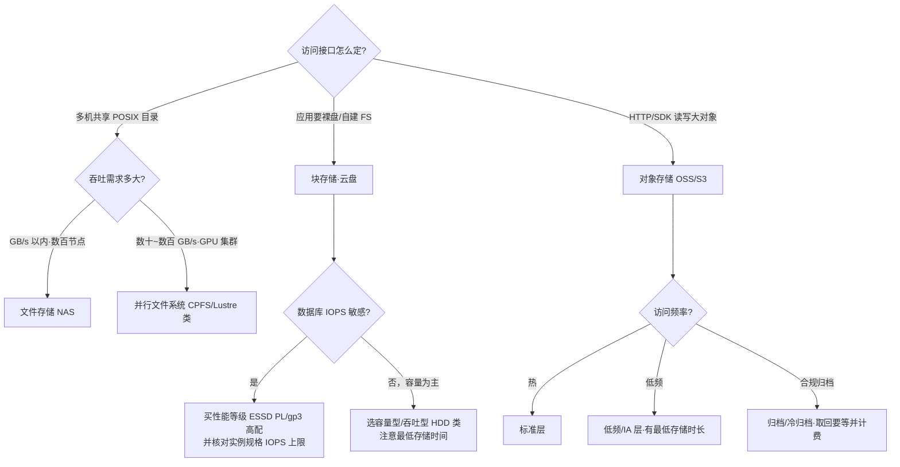

# 云存储

> 存储是我做方案时最后悔"想得太晚"的一层：计算可以换、网络可以改，数据一旦落下去，搬家成本就是量级差。这篇面向要做选型、降本或排查 IO 问题的工程师与架构师，讲清三件事：**块/对象/文件三种形态的边界在哪里**、**持久性和 IOPS 这些数字背后是怎么实现的**、以及**一线最容易踩的坑**（对象存储当盘挂、突发额度耗尽、快照链依赖……）。读完你应当能独立回答"这个负载该用什么存储、买多大性能、怎么备份"这三个问题。

## 是什么：块、对象、文件三种形态

所有云存储产品，本质上都是三种访问形态在不同规模下的工程化：

| 类型 | 代表 | 接口 | 典型场景 | 不适合 |
| --- | --- | --- | --- | --- |
| 块存储 | 云盘（EBS/ESSD） | 挂载为设备（裸块，自己格式化） | 数据库、文件系统、单机应用 | 共享读写 |
| 对象存储 | OSS / S3 | RESTful API（HTTP PUT/GET） | 图片/视频/备份/静态资源 | 频繁随机小写、目录 rename |
| 文件存储 | NAS / CPFS（NFS/SMB/并行客户端） | POSIX 挂载 | 共享文件、AI 训练数据集 | 超大吞吐（选 CPFS/并行文件系统） |

三者的分界线我一般这样记：**块是"一块还没格式化的硬盘"，文件是"一个多个机器共用的目录"，对象是"一个用 HTTP 访问的无限大 K/V 仓库"**。形态决定了语义：块语义才有真正的随机覆写和文件系统锁；文件语义天然多客户端共享；对象语义只有"整体写入、整体读取"，改一个字节也要重传整个对象，"目录"只是 key 上的前缀假象。

下面这张决策流是我给客户讲选型时白板上画得最多的一张：

图里两条最容易忽略的红线：**块存储的性能要买两次**——云盘一档、ECS/EC2 实例规格一档，取最小值生效；**低频和归档不是"更便宜的标准层"**，它有最低存储时长和取回费，账要按数据全生命周期算。

## 为什么重要

- **存储是三要素里迁移成本最高的**。计算实例换规格是分钟级的事，换存储形态（比如把挂在盘上的数据库迁到对象存储为基座的数据湖）往往是一次架构重构。选型错误的第一笔学费其实是"重做"。
- **持久性数字决定你敢不敢只留一份**。云盘的设计持久性通常在 9 个 9 量级，对象存储标到 11~12 个 9——这直接决定备份策略要不要跨介质、跨地域（下文细讲）。
- **成本大头藏在 IO 和流量里**。我做过不少账单体检：存储本体单价便宜，但"买了容量没买够 IOPS 被迫整机升配""对象存储被当盘挂导致请求费失控""快照只增不减"这三类浪费非常普遍。
- **AI 时代存储回到了聚光灯下**。模型参数和训练数据集的体量让"带宽"取代"算力"成为部分集群的第一瓶颈，后面单独讲。

## 架构与原理

### 块存储：从磁盘阵列到云盘

云盘的底层是把物理机上的大量 SSD/HDD 通过分布式存储池化，再切块映射给你的虚拟机。理解传统磁盘阵列的冗余思路，就理解了云盘 durability 的 70%：

*图源：Wikimedia Commons（[文件页](https://commons.wikimedia.org/wiki/File:Raid_array.jpg)）*

传统 RAID 用"条带化 + 校验盘"对抗单盘故障：RAID 5 把数据和分布式校验块交错摆在一组盘上，任意坏一块盘可以用其余盘和校验块反算重建：

*图源：Wikimedia Commons（[文件页](https://commons.wikimedia.org/wiki/File:RAID_5.svg)）*

云时代更进一步，主流做法是**纠删码（Erasure Coding）**：把对象切成 k 个数据片 + m 个校验片，任意丢 m 片都能恢复。相比三副本（300% 空间开销），RS 10+4 只要 140%，且重建时只需读 10 片而非整个副本——这是对象存储能把持久性做到 11 个 9 还保持低成本的核心。Ceph 是这条路线最出名的开源实现，[Ceph 文档](https://docs.ceph.com/en/reef/architecture/)明确它"用一套统一系统同时提供对象、块、文件存储"，块设备（RBD）和文件系统（CephFS）最终都落成 RADOS 对象。

### 对象存储：扁平命名空间与"11 个 9"的实现

Bucket / Object / Prefix 是对象存储的全部概念模型——**没有真正的目录**，`a/b/c.jpg` 只是一个 key 里带了两个斜杠。列举"目录"靠 delimiter 参数做前缀匹配，rename 大"目录"实际是 copy+delete 遍历每个对象。这是我见过的、从块存储背景转过来的同事最容易低估的一条语义差。

数据落进去之后发生了什么：以 S3 为例，对象被切分、纠删编码后**跨至少 3 个可用区冗余存放**，元数据与内容分离存储，后台持续做 checksum 巡检（scrubbing），发现位腐（bit rot）立刻用冗余片自动修复。AWS 官方表述是"**设计**达到 11 个 9（99.999999999%）持久性"——注意措辞是 designed for，它是工程设计的故障率外推目标，不是赔付 SLA（S3 对外承诺的是可用性 SLA，两者不是一回事）。阿里云 OSS 同城冗余（3AZ）版本宣称 12 个 9 持久性、标准层 99.995% 可用性；各存储类型、本地冗余/同城冗余组合的可靠性从 11 个 9 到 12 个 9 不等，**别把"12 个 9"记成所有层通用**，选型时逐项对照官方表格。

*图源：Wikimedia Commons（[文件页](https://commons.wikimedia.org/wiki/File:Ceph-Object-Placement-Group.png)）*

这张 Ceph 的 PG 分布示意图解释了大规模对象存储的调度思想：对象先哈希进几千上万个归置组（PG），再把 PG 映射到 OSD（磁盘服务），扩容/故障时只搬 PG 不动对象元数据表——所以对象存储可以"无限大"，而任何"中心索引"方案都不行。

### 快照与复制：增量链是最大的隐藏依赖

云盘快照几乎都做成**块粒度的增量快照**：第一次是全量，之后每次只存变化块，快照之间形成引用链。公开文档里最实用的三条推论（EBS 快照机制与阿里云快照一致）：

1. **删旧快照不等于省空间到底**：一个数据块只要被链上任何一个快照引用，就删不掉；删中间环节会触发向下一个快照的"数据合并"，删最新一环最安全（AWS 归档指南甚至明确"不要归档链上第一个快照，后面的都引用它"）。
2. **快照创建时长取决于"距上次快照改了多少块"**，长期不打的卷一旦打快照可能慢得像全量。
3. **从快照开出的新卷默认是"懒加载"**：数据后台从对象存储拉取，首读延迟高，大规模拉起（如灾备切换、弹性扩容）要考虑预热/快速恢复能力。

对象存储侧的对应能力是**版本控制 + 跨区域复制（CRR）+ 合规保留（WORM）**：复制要求源/目标都开版本控制；删除标记（delete marker）默认**不**复制，要显式开启；Object Lock 的 Compliance 模式下保留期内**连 root 账号都不能删除或缩短**——这正是勒索软件时代"不可变备份副本"的技术底座。

## 实践与选型

### 块存储性能层级：容量、IOPS、吞吐是三笔账

AWS gp 系列的演进最能说明"性能与容量解耦"的趋势：

| 卷类型 | 性能模型（公开值） | 适用 |
| --- | --- | --- |
| gp2（老一代） | 3 IOPS/GiB，最低 100、封顶 16,000；小于 1 TiB 的卷靠**突发额度**冲 3,000 IOPS | 存量卷；新建一律不建议 |
| gp3 | 基线 3,000 IOPS / 125 MiB/s，**与容量无关**；可独立加购至 16,000 IOPS / 1,000 MiB/s（2025 年起上限提至 80,000 IOPS / 2,000 MiB/s），单价比 gp2 约低 20% | 通用默认盘 |
| io2 / Block Express | 单卷最高 256K IOPS 量级，亚毫秒延迟 | 核心数据库 |
| st1 / sc1 | HDD，吞吐型（st1 约 500 MiB/s 级别突发） | 日志、大数据冷层 |

阿里云 ESSD 用性能等级（PL）表达同一件事，公式是公开的：

| 性能等级 | 容量范围（GiB） | IOPS 公式 | 单盘上限 IOPS / 吞吐 MB/s |
| --- | --- | --- | --- |
| PL0 | 1 ~ 65,536 | min{1800 + 12×容量, 10,000} | 10,000 / 180 |
| PL1 | 20 ~ 65,536 | min{1800 + 50×容量, 50,000} | 50,000 / 350 |
| PL2 | 461 ~ 65,536 | min{1800 + 50×容量, 100,000} | 100,000 / 750 |
| PL3 | 1,261 ~ 65,536 | min{1800 + 50×容量, 1,000,000} | 1,000,000 / 4,000 |

两条一线经验：**多数事故源于"买了容量但没买够 IOPS"**——比如给数据库分了 100 GiB 的 PL1 盘，公式只给你 6,800 IOPS，离 50,000 上限远得很；**盘买对了还要看实例**——官方文档明说实例规格有最大存储 IOPS/带宽上限，云盘理论值 10 万 IOPS 挂到上限 6 万的实例就只有 6 万。选实例和选盘要一起算。

### 对象存储分层：用"访问频率假设"换价格

S3 与 OSS 的分层结构高度一致，把"最低存储时长"和"取回时间"记住，成本模型就立起来了：

| 层级（S3 / OSS 对应） | 最低存储时长 | 取回特性 | 设计定位 |
| --- | --- | --- | --- |
| Standard / 标准 | 无 | 实时，毫秒级 | 热数据、静态站点 |
| Standard-IA / 低频 | 30 天 | 实时读 + 取回费，小于 64 KiB 按 64 KiB 计费 | 月访问 1~2 次 |
| Glacier Instant / 归档 | 60~90 天 | 约 1 分钟解冻；OSS 归档支持直读 | 长尾备份 |
| Glacier Flexible / 冷归档 | 180 天 | 分钟~小时（OSS：加急 1h / 标准 2~5h / 批量 5~12h） | 合规、灾备副本 |
| Deep Archive / 深度冷归档 | 180 天 | 12~48 小时（OSS：加急约 12h / 标准约 48h） | 7 年合规留存，单价约为标准层十几分之一 |

成本优化三板斧，按见效顺序：

1. **生命周期规则**：按最后修改时间自动转层/过期删除。规则本身免费，但注意转换会触发"不足规定时长"补差价（下面坑表里有）。
2. **冷数据下沉**：先跑访问分析（如 S3 Storage Lens / OSS 访问统计）确认真冷再下沉，我见过把"季度才访问但每次全量读"的数据扔进深度归档，解冻费比存的还贵。
3. **格式与压缩**：列式存储（Parquet/ORC）+ 压缩能把对象数量和体积同时降一个量级；另外别忘了请求费本身——海量小文件是"低频层 + 请求费"双重打击。

再补两个高频实践：**静态网站托管 + CDN** 仍然是最便宜的内容发布方式（OSS/S3 开静态页，CDN 回源，流量成本降一半以上且带宽弹性白送）；**图片处理 + 事件通知（对象 → 函数计算）**让对象存储直接充当轻数据处理管道——上传缩略图、视频截帧、ETL 触发都不需要自建常驻服务。

### 备份与容灾：3-2-1 的云上映射

传统 3-2-1（3 份副本、2 种介质、1 份异地）在云上落地为一套组合拳：

- **3 份副本**：生产盘/桶一份；快照或版本控制的历史版本一份；跨地域/跨账号的复制副本一份。勒索事件后行业普遍升级为 3-2-1-**1-0**：多一份**不可变**（WORM/合规模式）副本，恢复演练零差错。
- **快照 + 跨区域复制**：云盘快照本身存在对象存储底座上，可复制快照到其他地域；OSS/S3 用 CRR 做桶级异步复制（S3 CRR 设计目标是绝大多数对象 15 分钟内完成复制，RTC 提供 SLA 版本）。
- **版本控制 + WORM**：误删恢复靠版本；对抗有权限的攻击者靠 Object Lock Compliance——保留期内任何账号（包括主账号）无法删除。

最常见的误区我每年都要讲一遍：**只备份不演练，RTO 从未验证过**。备份成功的定义是"在目标 RTO 内恢复出可用系统"，而不是"快照任务绿色"。至少每季度做一次真实恢复：从跨地域快照开实例、从归档层解冻数据计时——你会对"懒加载首读慢""解冻要等几小时""跨账号权限没配好"这类问题有全新体感。

### AI 时代的存储

- **训练数据集：高吞吐并行文件系统成为标配**。通用 NAS 的数十~数百 GB/s 封顶、单客户端带宽受限，喂不饱 GPU 集群。CPFS/Lustre 类并行文件系统用多客户端多链路直读直写把吞吐拉到聚合数十 GB/s 至 TB/s 量级（阿里云公开口径：CPFS 智算版单文件系统最高 2 TB/s 吞吐、3000 万 IOPS 量级），支持数千计算节点共享同一命名空间。
- **模型权重分发：OSS + 缓存加速**。权重文件单份几十到数百 GB，成百上千节点同时拉取会把源站打挂；用对象存储做权威源 + 本地 NVMe/缓存层（OSS 加速器类、Alluxio 类）承接热点读，是公开文档推荐的标准姿势。
- **Checkpoint 写入风暴：存储带宽是训练集群的隐形瓶颈**。大模型 checkpoint 单次全量写入是 TB 量级，成百上千卡同时同步写会把训练时间线切成"算一阵、等一阵"。实践方向：异步 checkpoint、增量 checkpoint、把写入打散到并行文件系统多个元数据/OST 节点，并用 CPFS↔OSS 数据流动把老 checkpoint 自动下沉到冷层——否则训练跑三个月，热层存储费比卡时还贵。
- 一句话判断：**GPU 利用率上不去，先看存储带宽曲线，再看算力**。我遇到的"训练慢"投诉里，根因是 IO 的占了相当比例，而大多数人第一反应是查网络和卡。

## 常见坑

| 坑 | 现象 | 根因与对策 |
| --- | --- | --- |
| 对象存储当盘挂载（ossfs/s3fs 类） | 随机写报错、rename 风暴、请求费暴涨、大文件 OOM | 对象语义不支持真正的随机覆写；只用于顺序读写日志/冷数据，可写热数据交给 NAS/云盘 |
| gp2 突发额度耗尽 | 夜间备份一跑，白天数据库延迟尖刺 | 3 IOPS/GiB 基线 + 3,000 突发额度池，小卷基线极低；迁 gp3（约省 20% 且基线恒定） |
| 快照链依赖 | 删了老快照空间没降；归档第一环导致整链不可恢复 | 增量快照互相引用；从最新往回删、保留链头、用 DLM/自动快照策略治理 |
| 从快照开新卷首读慢 | 灾备切换后业务大面积超时 | 懒加载后台拉数据；预热、快速恢复（FSR 类）或并行预读 |
| 实例规格成为 IOPS 天花板 | 盘买满配仍达不到目标 QPS | 盘与实例性能取最小值；按云厂商公开的实例存储带宽反推实例档位 |
| 归档层当"更便宜的标准层" | 解冻费 + 不足时长补差价比省的多 | 低频/归档有最低存储时长（30~180 天）与取回费；先测访问频率再下沉 |
| 版本控制开完不管 | 桶里非当前版本悄悄膨胀，账单翻倍 | 版本控制 + NoncurrentVersionExpiration 生命周期必须成对配置 |
| 只备份不演练 | 真出事时 RTO 失控：跨区没配复制、归档没解过冻 | 季度级恢复演练，把"从归档解冻耗时"实测进预案 |
| 关键桶单 AZ / 本地冗余 | 可用区级灾难直接丢失唯一副本 | S3 One Zone-IA 坏在"一个 AZ 没了就没了"；核心数据用多 AZ + 跨区域复制 |
| 海量小文件进对象存储 | ListObjects 慢、请求费高、列举截断 | 合并打包（tar/parquet 分块）、设计 key 前缀避免单前缀热点 |

## 站内相关

- [计算·存储·网络导读](/cloud/infra/) · [云服务器](/cloud/infra/compute) · [云网络](/cloud/infra/network)
- [Kubernetes 核心机制](/cloud/native/kubernetes)（存储篇提到：CSI 与有状态负载对存储后端的要求）
- [数据库与数据仓库](/cloud/data/database)（块存储 IOPS 模型的最大消费方）
- [大数据体系](/cloud/data/bigdata)（对象存储 + 列式格式的数据湖路线）

## 参考资料

访问日期均为 2026-09-02。

- [S3 Storage Classes — AWS 官方](https://aws.amazon.com/s3/storage-classes/)（各存储类别持久性/可用性/最短时长）
- [Data protection in Amazon S3 / Resilience in Amazon S3 — AWS Docs](https://docs.aws.amazon.com/AmazonS3/latest/userguide/DataDurability.html)（11 个 9 的设计口径与多可用区冗余）
- [Understanding and managing Amazon S3 storage classes — AWS Docs](https://docs.aws.amazon.com/AmazonS3/latest/userguide/storage-class-intro.html)
- [Amazon EBS volume types / General Purpose SSD volumes — AWS Docs](https://docs.aws.amazon.com/ebs/latest/userguide/general-purpose.html)（gp2/gp3 IOPS 模型与突发额度）
- [Migrate your Amazon EBS volumes from gp2 to gp3 and save up to 20% — AWS Storage Blog](https://aws.amazon.com/blogs/storage/migrate-your-amazon-ebs-volumes-from-gp2-to-gp3-and-save-up-to-20-on-costs/)
- [How Amazon EBS snapshots work — AWS Docs](https://docs.aws.amazon.com/ebs/latest/userguide/how_snapshots_work.html)（增量快照与链式引用）
- [Guidelines and best practices for archiving Amazon EBS snapshots — AWS Docs](https://docs.aws.amazon.com/ebs/latest/userguide/archiving-guidelines.html)（勿归档链首快照）
- [Locking objects with Object Lock — AWS Docs](https://docs.aws.amazon.com/AmazonS3/latest/userguide/object-lock.html)（Compliance/Governance 模式）
- [Replicating delete markers between buckets — AWS Docs](https://docs.aws.amazon.com/AmazonS3/latest/userguide/delete-marker-replication.html)（删除标记默认不复制）
- [OSS 有哪几种存储类型 — 阿里云文档](https://help.aliyun.com/zh/oss/user-guide/overview-53/)（五层存储类型、最低时长、64 KiB 计量）
- [解冻文件 — 阿里云文档](https://help.aliyun.com/zh/oss/user-guide/restore-objects-for-access)（各归档层解冻优先级与耗时）
- [OSS 的存储冗余类型 — 阿里云文档](https://help.aliyun.com/zh/oss/user-guide/overview-of-storage-redundancy-types/)（本地冗余/同城冗余与持久性、可用性指标）
- [ESSD 云盘的规格、计费、应用场景和存储 I/O 性能 — 阿里云文档](https://help.aliyun.com/zh/ecs/user-guide/essds)（PL0~PL3 IOPS 公式与容量门槛）
- [块存储性能 — 阿里云文档](https://help.aliyun.com/zh/ecs/user-guide/block-storage-performance)（实例规格对盘性能的约束）
- [如何选用 NAS、OSS 和 EBS — 阿里云文档](https://help.aliyun.com/zh/nas/product-overview/comparison-of-nas-oss-and-ebs)
- [文件存储 CPFS — 阿里云](https://www.aliyun.com/product/nas_cpfs)（并行文件系统定位与智算版性能口径）
- [Ceph Architecture — Ceph Docs](https://docs.ceph.com/en/reef/architecture/)（对象/块/文件统一后端、PG/OSD/CRUSH）
- [Ceph Erasure code — Ceph Docs](https://docs.ceph.com/en/reef/rados/operations/erasure-code/)（k+m 分片与副本池对比）
- [Erasure code — Wikipedia](https://en.wikipedia.org/wiki/Erasure_code)（RS 编码原理）
- [RAID — Wikipedia](https://en.wikipedia.org/wiki/RAID)（各级 RAID 的条带与校验模型）

**图片来源**（Wikimedia Commons，均为社区上传的示意/实拍图，访问日期 2026-09-02）：

- `raid-array.jpg` ← [File:Raid array.jpg](https://commons.wikimedia.org/wiki/File:Raid_array.jpg)
- `raid5-parity.svg` ← [File:RAID 5.svg](https://commons.wikimedia.org/wiki/File:RAID_5.svg)
- `ceph-object-pg-osd.png` ← [File:Ceph-Object-Placement-Group.png](https://commons.wikimedia.org/wiki/File:Ceph-Object-Placement-Group.png)
