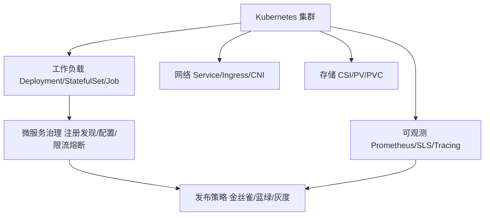

# 云原生

> 云原生不是"把应用塞进容器"，而是一整套以 Kubernetes 为底座、以声明式 API 为接口、以可观测性为生命线的工程体系。这一域记录从单机应用到大规模生产集群的落地经验。

## 这个域回答什么问题

- Kubernetes 的核心机制（声明式、控制器模式、调度）为什么是这样设计的？
- 企业级落地 K8s 要解决哪些"课本之外"的问题（多租户、网络、存储、发布）？
- 微服务化到什么粒度合适？治理体系怎么搭？
- 可观测（指标/日志/链路）如何从"有"到"好用"？

## 知识框架

## 文章列表

| 文章 | 状态 | 说明 |
| --- | --- | --- |
| [Kubernetes 核心机制与企业级落地](/cloud/native/kubernetes) | ✅ 已发布 | 种子文：声明式/控制器/调度 + 企业落地清单 |
| [微服务治理](/cloud/native/microservice) | 🚧 提纲 | 拆分粒度、注册配置、限流熔断、Mesh |
| [可观测体系](/cloud/native/observability) | 🚧 提纲 | 指标/日志/链路三支柱与告警治理 |

## 精选资源

> 筛选标准：官方与一手来源优先，近两年内容优先，经典明确标注。更新于 2026-09-01。

### Kubernetes

- [Kubernetes v1.33: Octarine](https://kubernetes.io/blog/2025/04/23/kubernetes-v1-33-release/) — 官方博客详解增强与 API 变更，跟踪核心机制演进的第一手材料（2025 · 官方文档）
- [阿里巴巴万级规模 K8s 控制平面深度性能优化方案](https://developer.aliyun.com/article/719079) — 万节点集群 apiserver 与 etcd 调优实战，大规模集群经典复盘（2019 · 工程博客）
- [大规模 ACK Pro 集群使用建议](https://help.aliyun.com/zh/ack/ack-managed-and-ack-dedicated/user-guide/suggestions-on-how-to-work-with-large-ack-pro-clusters) — 大规模集群配额上限与参数调优指南，生产避坑清单（持续更新 · 官方文档）

### 服务网格

- [Istio Ambient Mode Reaches GA in v1.24](https://istio.io/latest/blog/2024/ambient-reaches-ga/) — 无 Sidecar 网格 GA 公告，ztunnel/waypoint 架构与降本依据（2024 · 官方文档）
- [Cilium Service Mesh — Everything You Need to Know](https://isovalent.com/blog/post/cilium-service-mesh/) — eBPF 内核态网格原理全解，Sidecarless 路线选型参考（2024 · 工程博客）

### 可观测性

- [Announcing Prometheus 3.0](https://prometheus.io/blog/2024/11/14/prometheus-3-0/) — 七年来首个大版本：新 UI、Remote Write 2.0 与 OTel 集成（2024 · 官方文档）
- [可观测性入门 — OpenTelemetry 官方中文文档](https://opentelemetry.io/zh/docs/concepts/observability-primer/) — 三大支柱与核心概念的权威中文讲解（2025 · 官方文档）
- [使用 eBPF 在云中实现网络可观测性](https://flashcat.cloud/blog/ebpf-network-observability-cloud/) — eBPF 落地云网络观测的中文深度解析（2025 · 工程博客）

### eBPF 与平台工程

- [The eBPF Foundation's 2025 Year in Review](https://ebpf.foundation/the-ebpf-foundations-2025-year-in-review/) — eBPF 生态项目进展与标准化动态全景（2025 · 工程博客）
- [eBPF 技术实践白皮书第二版](https://developer.aliyun.com/article/1634428) — 网络性能、持续剖析与容器安全的中文实践方案（2024 · 行业报告）
- [CNCF Platforms White Paper](https://tag-app-delivery.cncf.io/whitepapers/platforms/) — 内部平台建设方法论与能力清单（2023 · 行业报告）
- [GitOps in 2025: From Old-School Updates to the Modern Way](https://www.cncf.io/blog/2025/06/09/gitops-in-2025-from-old-school-updates-to-the-modern-way/) — GitOps 演进全景，Argo CD 与 Flux 对比（2025 · 官方文档）

## 一句话入门

K8s 的价值在于**把运维知识代码化**：你声明期望状态，控制器负责收敛现实。理解了这一点，才谈得上"用"好它。
