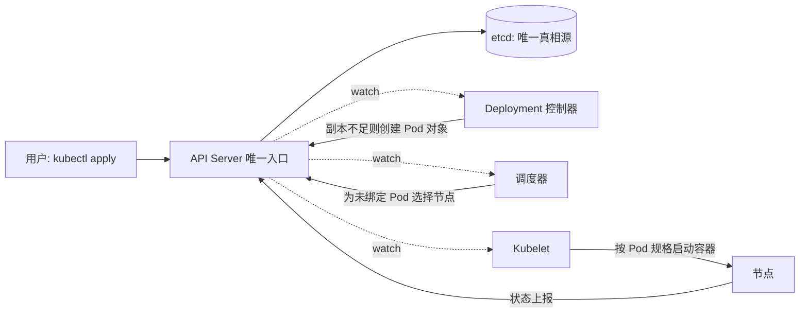
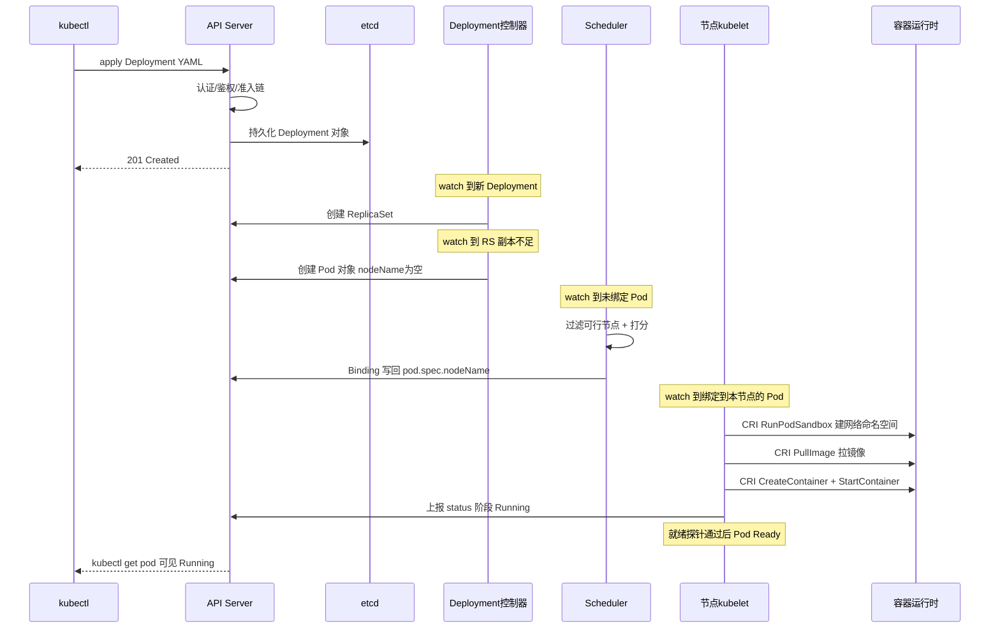
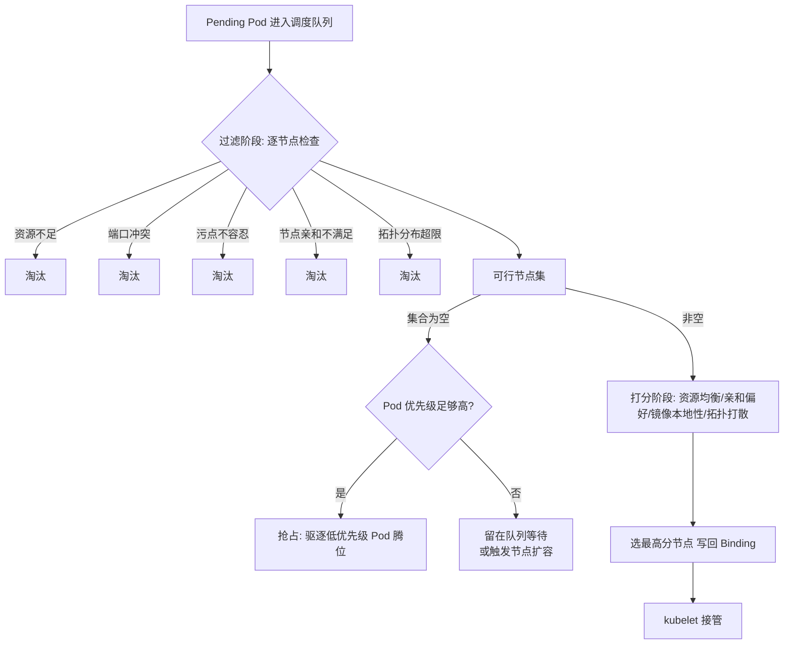
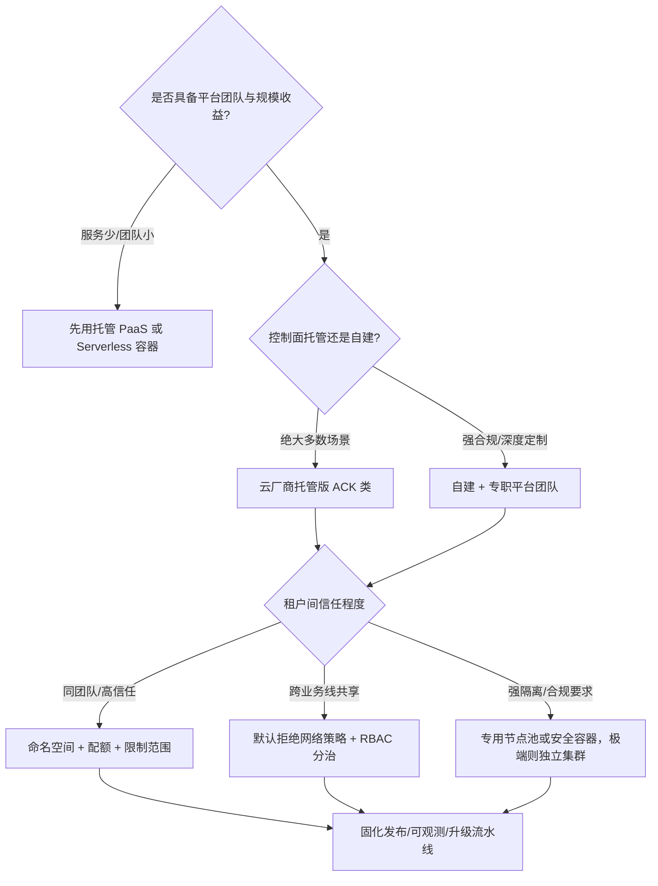

# Kubernetes 核心机制与企业级落地

> 面向已经在用 K8s、但想从"会用 kubectl"进阶到"理解机制、能做架构决策"的工程师与方案架构师。这篇按一条主线把 K8s 讲透：**声明式 API 与 level-triggered 调谐循环为什么是它的灵魂 → 控制面四大组件怎么分工 → 一个 Pod 从 apply 到 Running 的完整旅程 → 调度器、kubelet、网络、存储的机制级拆解 → 弹性、多集群、AI 负载这些 2025–26 年的真实战场**。读完你会清楚每个 API 对象背后的控制循环在做什么、企业落地时课本之外的五件事（多租户、升级、弹性、安全、可观测）怎么决策，以及生产集群里最常见的坑长什么样、根因是什么。文中所有特性状态均按 2026-09 的 kubernetes.io 官方文档与博客核实，不凭记忆。

## 是什么：一个声明式控制系统

所有对 K8s 的理解，都可以浓缩成一句话：

> **你声明期望状态（Desired State），控制器持续地把现实状态（Actual State）收敛到期望状态。**

这不是实现细节，而是整个系统的设计哲学。它带来三个推论：

1. **不要命令式操作**。`kubectl delete pod` 之后 Pod 会被重建——因为 Deployment 声明的副本数没变。改状态要改声明，不要直接动对象。
2. **所有组件都在做 watch + reconcile**。理解了这一点，就能理解 etcd 为什么是唯一的真相源、为什么 API Server 是唯一入口、为什么组件之间从不直接互相调用。
3. **故障处理是"自动收敛"而不是"人工恢复"**。节点挂了，上面的 Pod 会被重新调度——前提是控制器知道它挂了（这正是节点心跳与驱逐机制存在的原因）。




*图源：Kubernetes 官方文档 Components 页（[kubernetes.io/docs/concepts/overview/components](https://kubernetes.io/docs/concepts/overview/components/)，访问日期 2026-09-04）*

上图是官方组件架构图，值得记住的只有两条主线：**控制面**（kube-apiserver、etcd、kube-scheduler、kube-controller-manager、cloud-controller-manager）负责"决策"，**节点**（kubelet、kube-proxy、容器运行时）负责"执行"，两者之间唯一的通路是 API Server。组件之间没有一条直连调用——这正是声明式架构的物理呈现。

## 为什么重要：期望状态是运维模型的根本转变

"声明式"三个字听起来像语法偏好，实际上是运维模型的换代。命令式运维把**操作步骤**编码在人的头脑与 runbook 里：扩容先登录哪台机器、改哪个配置、重启哪个服务，全靠工程师记忆与纪律。声明式运维把**状态契约**编码进系统：期望状态是机器可读的、可 diff 的、可回滚的，收敛动作由控制器无限重试。


*图源：Kubernetes 官方文档 Overview 页（[kubernetes.io/docs/concepts/overview](https://kubernetes.io/docs/concepts/overview/)，访问日期 2026-09-05）*

上面这张官方演进图（传统部署 → 虚拟化部署 → 容器部署）解释了 K8s 出现的位置：容器解决了"环境一致性"，但没有解决"一群容器怎么被编排、自愈、扩缩"——这正是编排系统的职责，也是 K8s 在 2015–2018 年间淘汰 Swarm 与 Mesos 胜出后成为事实标准的原因。

| 维度 | 命令式运维 | 声明式收敛 |
| --- | --- | --- |
| 故障恢复 | 人按 runbook 执行，恢复时间取决于响应速度 | 控制器自动补齐差异，多数故障无人介入 |
| 变更审计 | 靠操作记录，易缺失 | 期望状态即变更单，天然可进 Git |
| 重试安全 | 脚本重跑可能产生副作用 | 收敛操作幂等，重试无风险 |
| 知识沉淀 | 在老员工头脑里 | 在 YAML、Operator 与平台代码里 |

第四行是我认为最重要的一行：**期望状态可入库，才谈得上 GitOps；运维知识代码化，团队扩张才不被个人经验卡住**。这也是 K8s 真正的护城河——不是容器本身，而是这套以 API 为中心的收敛体系。

边界同样要说清：K8s 收敛的是**平台层状态**（进程在不在、副本够不够、流量通不通），应用数据的一致性、外部依赖的可用性不在它的收敛范围内。**K8s 解决"平台问题"，不解决"应用问题"**——应用不改架构直接塞进容器，只是换了个地方部署，弹性与韧性红利一分拿不到。

## 核心机制拆解

### level-triggered 调谐循环：K8s 的灵魂

控制理论里有个区分值得借来理解 K8s：**edge-triggered（边沿触发）系统响应"事件"，level-triggered（电平触发）系统响应"状态差"**。传统运维自动化多是边沿触发的——收到告警就执行对应动作，动作丢了、事件漏了，系统就停在错误状态。K8s 的控制器全部是电平触发的：

```
for {
    actual := 观察现实状态          // 通过 informer 缓存，不打爆 API Server
    desired := 读取期望状态
    diff := 计算差异
    执行动作消除差异                 // 动作必须幂等
    等待下一次事件或周期性 resync
}
```

这个设计选择带来三个工程后果，每一个都在生产中被反复验证：

1. **丢事件不要紧**。控制器不只依赖 watch 事件，还有周期性 resync（把缓存里所有对象重新过一遍调谐逻辑）。就算某次 watch 断连、事件丢失，下一轮 resync 照样把状态收敛回来。边沿触发系统做不到这一点。
2. **重试天然安全**。收敛动作被要求幂等——"确保有 3 个副本"执行一百次和执行一次结果相同。这让控制器可以放心地在任何错误后无限重试，不需要复杂的事务补偿。
3. **多写者不打架**。Deployment 控制器、HPA、人工 kubectl 都可能改同一个对象的副本数，系统不仲裁"谁有资格写"，只保证最终状态向最新的声明收敛。冲突用 resourceVersion 乐观锁解决，语义冲突（比如 HPA 和人同时改副本数）则靠约定避免——这是后文"常见坑"里 GitOps 纪律的来源。

Deployment、StatefulSet、DaemonSet、Job……全是这个模式的变体，差别只在"期望状态的定义"和"收敛动作"。这也是 CRD + Operator 能成立的根本原因：**你可以定义自己的资源类型，然后写一个控制器让它按你的业务逻辑收敛**。云原生生态的半壁江山——数据库、消息队列、AI 训练平台——都建在这个扩展点上。控制器实现普遍基于 informer 机制：客户端与 API Server 维持 watch 长连接，本地维护对象缓存，事件到达时只把对象的 key 放进工作队列，由 worker 取出后重新读取缓存做调谐。理解 informer，就理解了为什么 K8s 组件的扩展性是"加缓存"而不是"加数据库连接"。

### 控制面四大组件分工

| 组件 | 职责 | 关键机制 | 生产要点 |
| --- | --- | --- | --- |
| kube-apiserver | 唯一读写入口：认证、鉴权、准入、持久化 | watch 长连接、乐观并发（resourceVersion）、聚合层 | 水平扩展无状态；所有调优先看 API 延迟与限流（APF） |
| etcd | 唯一真相源，Raft 一致性的 KV 存储 | MVCC、watch、租约 | 磁盘写延迟是命门（见下）；大盘点（大 List）是常见事故源 |
| kube-scheduler | 为未绑定节点的 Pod 选择最优节点 | 过滤-打分两阶段、调度框架扩展点 | 本质也是控制器：watch 未调度 Pod，写回绑定结果 |
| kube-controller-manager | 数十个内置控制器的合集 | 共享 informer、leader 选举 | 单进程多循环；一个控制器卡住可能拖累整体 |

补充两点机制细节：

**API Server 的准入链**。一个写请求要依次经过认证（你是谁）→ 鉴权（RBAC 判定你能不能做）→ 变更准入（Mutating Admission，如注入 sidecar、补默认值）→ 对象校验 → 验证准入（Validating Admission，如 PSA 安全策略、Gatekeeper 类策略引擎）→ 写 etcd。企业里所有的"平台管控"——强制打标签、禁止特权容器、镜像白名单——都挂在准入这一层，这是 K8s 最重要的策略扩展点。

**etcd 的硬件敏感性**。etcd 用 Raft 协议保证多数派落盘后才确认写入，所以磁盘写延迟直接决定 API 延迟。官方硬件建议里给过量级：普通负载约 50 顺序 IOPS 即可，重载集群建议 500 顺序 IOPS 以上（本地 SSD 或高性能云盘）。写延迟一高，心跳超时触发 Raft 选举，整个集群 API 抖动——自建集群最常见的全集群性事故根因就是"etcd 放在了慢盘上"。托管集群（ACK/EKS/GKE 类）把这个责任转移给了云厂商，这也是托管版最值钱的部件之一。v1.37 引入的 etcd RangeStream 进一步降低了大 List 请求在 API Server 侧的内存开销，方向就是治理"大盘点"。

**节点侧的心跳**。kubelet 通过两条通道向控制面报活：NodeStatus 更新（内容多、频率低）与 NodeLease（轻量租约对象，秒级续约）。node-controller 据此判断节点失联，超过阈值（默认 40 秒判 NotReady，再等驱逐宽限期）后把节点上的 Pod 标记驱逐、触发重调度。理解这条链路，才能理解"节点宕机后 Pod 为什么要等几分钟才在别处拉起"——那是探测与宽限期的时间，不是 bug。

### 一个 Pod 从 kubectl apply 到 Running 的完整旅程

这是理解 K8s 的最好切片：所有组件都在这条链路上各司其职，且**没有任何组件直接调用另一个组件**，全部通过 API Server 的对象状态传递意图。



逐步拆开看每一步在做什么：

1. **kubectl apply**：客户端做本地校验后发 PUT/POST 到 API Server；`apply` 的三方合并（客户端声明、上次声明、当前实况）在这一步完成。
2. **API Server 准入与持久化**：走完认证/鉴权/准入链后写 etcd，立刻返回——**此时没有任何容器存在**，集群里只多了一个声明。
3. **Deployment 控制器收敛第一层**：watch 到新 Deployment，发现没有对应 ReplicaSet，创建之；ReplicaSet 控制器（也在 controller-manager 里）发现副本数不足，创建 Pod 对象。注意这一步产出的 Pod 是"空壳"——`spec.nodeName` 为空，处于 Pending。
4. **调度器收敛第二层**：watch 到未绑定的 Pod，跑过滤-打分选出节点，把绑定结果写回 API Server。调度器不通知任何人，它只是改了对象的一个字段。
5. **kubelet 收敛第三层**：目标节点的 kubelet watch 到"绑定给我的 Pod"，通过 CRI 接口驱动容器运行时：先建 Pod 沙箱（网络命名空间 + CNI 配网），再拉镜像，再创建并启动业务容器。
6. **状态回流**：kubelet 把容器状态写回 Pod 的 `status`，阶段变为 Running；就绪探针通过后条件 Ready 变真，EndpointSlice 控制器把它加入 Service 后端，流量才真正进来。

这条旅程里最值得体会的是：**三层控制器各管一段，靠对象字段接力，谁也不认识谁**。任何一段卡住（准入拒绝、无节点可调度、镜像拉不下来、探针不过），Pod 就停在对应状态——排障时按这条链路从前往后查，比盲目 describe 高效得多。

### 调度器深拆：过滤-打分两阶段

kube-scheduler 每轮调度分两个阶段：**过滤（Predicates/Filter）**淘汰不可行节点，**打分（Priorities/Score）**给可行节点排序取最高分。默认插件集之外，调度框架（Scheduling Framework）在队列、过滤、打分、绑定等环节暴露扩展点，二次调度器都基于它实现。



大集群下有个关键性能设计：**percentageOfNodesToScore**。调度器不必给全部节点打分——找到足够比例的可行节点就提前收手。官方文档给出的默认线性公式：100 节点集群评 50%，5000 节点集群只评 10%，下限 5%。这是"延迟换全局最优"的典型取舍，也解释了为什么超大集群里调度结果偶尔"不够漂亮"。官方 2017 年的复盘给过量级：1.6 时代一轮调度器优化带来 5–10 倍吞吐提升，社区对可扩展性的正式验证目标一直是 5000 节点 / 15 万 Pod / 30 万容器、单节点不超过 110 个 Pod。

调度约束工具箱按使用频率排：

| 机制 | 语义 | 典型用法 | 坑 |
| --- | --- | --- | --- |
| requests/limits | 调度按 requests，运行时上限按 limits | 一切负载的地基 | 拍脑袋虚高 → 节点卖不满；不设 → 驱逐时最先死 |
| nodeAffinity | 节点标签的硬/软偏好 | required 卡 GPU 机型，preferred 倾向本地盘 | required 写死机型，扩容换机型即 Pending |
| podAffinity/AntiAffinity | 按"已运行 Pod 的标签"聚散 | 反亲和把副本打散到不同节点/机架 | 拓扑域写错粒度（hostname vs zone）打散失效 |
| taints/tolerations | 节点排斥 Pod，除非容忍 | GPU 池、专用池的"门禁" | 只打污点忘配容忍 → 负载全部 Pending |
| topologySpreadConstraints | 按拓扑域控制最大偏斜 | 跨可用区均匀分布（maxSkew=1） | 与反亲和语义重叠时二者冲突，选一个为主 |
| priorityClass + 抢占 | 高优先级 Pod 可驱逐低优先级 Pod 腾资源 | 在线服务高于批处理 | 不设 PDB 的被抢占方会整组消失 |

我的经验：**多数集群只需要 requests + 污点容忍 + 拓扑分布三件套**；亲和性规则堆得越复杂，调度延迟与"无解 Pending"的概率越高。抢占要配合 PriorityClass 全局规划——生产集群至少分三档（系统组件 / 在线业务 / 离线批处理），否则抢占机制形同虚设。

### kubelet 与容器运行时：CRI 的演进

kubelet 是节点上唯一的 K8s 组件"大脑"：管理 Pod 生命周期、执行探针、挂载卷、上报状态，并把所有容器操作委托给运行时。二者之间的接口是 **CRI（Container Runtime Interface）**——gRPC 协议，运行时侧实现 RuntimeService（沙箱与容器管理）和 ImageService（镜像管理）。

这段历史值得记住，因为它是 K8s"接口化"方法论的样板：

- 早期 kubelet 直接对接 Docker API，为兼容 Docker 维护了一层 **dockershim** 翻译代码；
- 2020 年官方宣布废弃 dockershim（v1.20 标记 deprecated），**v1.24（2022）正式移除**——著名的"Docker 被踢出 K8s"事件。实质是砍掉一层翻译：Docker 产出的镜像是 OCI 标准镜像，在任何 CRI 运行时里照跑不误；
- 今天的主流实现是 **containerd**（Docker 内部真正干活的那层，独立出来直接对接 CRI）与 **CRI-O**（Red Hat 主导、只做 CRI 的轻量运行时）。

kubelet 与运行时之下还有两层标准：**OCI 运行时规范**（runc 类，真正创建进程）与 **cgroup**（内核资源控制）。cgroup v2 用统一层级替换了 v1 的多控制器挂载，kubelet 对 v2 的支持已稳定，主流发行版（Ubuntu 22.04+、RHEL 9+）默认开启。v2 带来的实际收益是内存 QoS 与 PSI（压力失速信息）——kubelet 的驱逐决策可以更早、更准地感知内存压力，而不是等到 OOM 连环爆。

### Pod 生命周期与三种探针：语义差异是高频坑

先看 Pod 的本质——**一组共享网络与存储命名空间的容器的调度单元**。下图是官方的多容器 Pod 示意：sidecar 文件拉取器与 Web 服务器共享同一个 emptyDir 卷与同一个 IP，容器间用 localhost 互访：


*图源：Kubernetes 官方文档 Pod Lifecycle 页（[kubernetes.io/docs/concepts/workloads/pods/pod-lifecycle](https://kubernetes.io/docs/concepts/workloads/pods/pod-lifecycle/)，访问日期 2026-09-05）*

Pod 阶段（phase）只有五个：Pending → Running → Succeeded/Failed，外加 Unknown。真正决定流量与重启行为的是**容器探针**，三者的语义差异我见过太多人搞混：

| 探针 | 失败后果 | 回答的问题 | 配置要点 |
| --- | --- | --- | --- |
| liveness（存活） | kubelet **杀掉容器并按重启策略重启** | "进程是否已死锁/僵死，重启能否救活？" | 只测进程自身健康，**绝不测下游依赖**；阈值宁松勿紧 |
| readiness（就绪） | 从 Service 后端**摘除流量**，不重启 | "现在能不能接请求？" | 依赖未就绪（连接池、缓存预热）时返回失败是正确用法 |
| startup（启动） | 超过预算仍未成功才重启 | "慢启动应用是否还在初始化？" | 生效期间 liveness/readiness 暂停，专治 JVM/模型加载类慢启动 |

高频事故模式是：**liveness 探针测了数据库连通性**。数据库抖 30 秒，全集群 Pod 的 liveness 同时失败，kubelet 把所有容器杀光重启——应用层的小故障被放大成全服务雪崩。正确姿势：liveness 只测进程自己（如 `/healthz` 返回进程存活），下游依赖健康交给 readiness 摘流量，慢启动交给 startup 兜底。三个探针的 `periodSeconds × failureThreshold` 就是各自的容忍预算，写配置前先算这笔账。

探针之外，Pod 终止流程也有讲究：删除 Pod 后进入 Terminating，kubelet 发 SIGTERM，应用要在 `terminationGracePeriodSeconds`（默认 30 秒）内完成优雅下线；同时 EndpointSlice 把它从后端摘除。**摘流量与杀进程是并行的**，所以严谨的做法是应用收到 SIGTERM 后先停接新请求、排空存量、再退出——直接秒退会在滚动发布时产生少量 502。

### 存储：PV、PVC、StorageClass 与 CSI

存储抽象分三层：**PV**（一块真实存储）、**PVC**（用户对存储的申请）、**StorageClass**（动态供给的模板）。对接具体存储后端靠 **CSI（Container Storage Interface）** 驱动——这相当于存储界的 CNI：云盘、文件存储、分布式存储各带自己的驱动接入，K8s 核心代码不含任何厂商存储逻辑（1.30 起 in-tree 云存储插件也基本迁移完毕）。CSI 在 v1.13 GA，如今是所有存储接入的唯一正道。

动态供给的完整链路：PVC 指定 StorageClass → external-provisioner（CSI sidecar）watch 到未绑定 PVC → 调 CSI 驱动 CreateVolume → 生成 PV 并绑定 → Pod 调度后 kubelet 调 CSI NodeStageVolume/NodePublishVolume 完成挂载。有一个关键参数是 `volumeBindingMode: WaitForFirstConsumer`：等 Pod 调度完再创建卷，卷的可用区跟着节点走——云上块存储跨可用区不可挂，这个模式是刚需，多数云厂商的默认 StorageClass 已如此设置。

| 存储类型 | 典型形态 | 适合 | 不适合 |
| --- | --- | --- | --- |
| 块存储（云盘） | 单节点读写 | 数据库、需要独占卷的有状态服务 | 多 Pod 共享、频繁漂移的负载（重调度要先卸载再挂载，慢） |
| 共享文件存储 | 多 Pod 共读共写 | AI 训练数据集、内容处理管线 | 高 IOPS 低延迟的数据库主库 |
| 本地盘/临时存储 | 节点生命周期绑定 | 缓存、可重建的中间数据 | 任何不可再生的数据 |
| 对象存储（经 CSI 或 SDK） | 海量、低成本 | 数据集、备份、模型权重 | POSIX 语义强的场景（随机写、文件锁） |

**StatefulSet 的语义**是把"有状态"拆成三个保证：稳定的网络标识（Pod 名固定为 `web-0`、`web-1`，配 headless Service 提供稳定 DNS）、有序的部署与伸缩（按序号逐个起、逆序逐个缩）、每个 Pod 独占且跟随身份的存储（volumeClaimTemplates 生成的 PVC 在 Pod 重建后仍绑回同一序号）。数据库主从、消息队列 broker、任何"副本不等价"的系统都靠这三条语义落地。要注意的边界：StatefulSet 保证的是**平台层身份稳定**，应用层的数据复制、选主、脑裂处理仍是你自己的事——它不替你做 quorum。

我的边界判断：**有状态服务上 K8s 的前提，是存储后端能被 CSI 驱动管理且支持快速重挂载**；数据的持久性永远靠存储后端与备份策略保证，不靠 K8s。把"Pod 重建"误当成"数据丢失"，或者反过来以为 K8s 会替你保数据，是同一类认知错误。

## 网络模型：三张平面与一个约定

K8s 网络模型的要求只有一条：**任意两个 Pod 可以不经 NAT 直接通信**（Pod 网络平坦性）。具体实现交给 CNI 插件。集群里实际有三张互相独立的地址平面：节点网段、Pod 网段、Service 网段。


*图源：Kubernetes 官方文档 Cluster Networking 页（[kubernetes.io/docs/concepts/cluster-administration/networking](https://kubernetes.io/docs/concepts/cluster-administration/networking/)，访问日期 2026-09-04）*


*图源：Wikimedia Commons，Pod-networking（[commons.wikimedia.org/wiki/File:Pod-networking.png](https://commons.wikimedia.org/wiki/File:Pod-networking.png)，访问日期 2026-09-05）*

平坦性意味着 Pod IP 在整个集群内是"一等公民地址"：没有端口映射、没有嵌套 NAT，容器应用不需要感知自己跑在 K8s 里。这个约定的代价转嫁给了 CNI 插件——它要么用隧道封装（Overlay）把 Pod 报文驮过底层网络，要么用路由/桥接让底层网络直接认识 Pod IP。

**CNI 机制本身很薄**：一个规范 + 一组可执行文件。kubelet 创建 Pod 沙箱时按配置顺序调用 CNI 插件二进制（ADD 命令），插件负责给网络命名空间配 IP、路由、防火墙规则；Pod 删除时调 DEL。插件可以链式组合（Multus 就是靠"meta-plugin"身份给 Pod 挂第二、第三块网卡，AI 集群的 RDMA 网络就这么接进来）。

要理解的网络组件有两层：

- **Pod 互通层（CNI）**：决定 Pod IP 怎么分配、跨节点流量怎么封装或路由；
- **Service 层（kube-proxy 或等价实现）**：把 Service 的虚拟 IP 转换成后端 Pod 集合，做负载均衡。

### kube-proxy：iptables → nftables → eBPF 的演进

Service 的 ClusterIP 是个"不存在"的虚拟 IP——没有任何网卡持有它，全靠每个节点上的转发规则把目的地址改写为后端 Pod IP。实现机制的演进是过去几年 K8s 网络最大的变化线：

| 方案 | 机制 | 现状（2026-09） | 优势与代价 |
| --- | --- | --- | --- |
| iptables 模式 | 内核 netfilter 规则链逐条匹配 | 仍是 Linux 默认，但规则数随 Service 线性增长 | 零依赖；数千 Service 后规则更新延迟明显 |
| nftables 模式 | iptables 的后继内核 API，集合与映射代替线性链 | **v1.33 转稳定**，需内核 5.13+；大规模集群的官方推荐迁移方向 | 更新与匹配效率显著更好；行为与 iptables 有细微差异（如 NodePort 默认只绑主地址） |
| IPVS 模式 | 内核 LVS 哈希表 | **v1.35 起弃用**，计划 v1.40 默认关闭、v1.43 移除 | 曾是大规模救星，现被 nftables/eBPF 取代——存量集群要规划迁移 |
| eBPF（Cilium 类） | 内核态字节码直接处理报文，可完全替代 kube-proxy | 成熟生产方案，新项目首选之一 | 绕过 iptables 全链路，性能与可观测俱佳；对内核版本有要求，团队需要新技能栈 |
| kernelspace（Windows） | Windows HNS 重写报文 | Windows 节点默认 | 平台差异大，跨平台集群注意行为不一致 |


*图源：Kubernetes 官方文档 Virtual IPs and Service Proxies 页（[kubernetes.io/docs/reference/networking/virtual-ips](https://kubernetes.io/docs/reference/networking/virtual-ips/)，访问日期 2026-09-05）*


*图源：同上，Virtual IPs and Service Proxies 页 IPVS 小节（[kubernetes.io/docs/reference/networking/virtual-ips](https://kubernetes.io/docs/reference/networking/virtual-ips/)，访问日期 2026-09-05）*

我的判断：**2026 年新集群的选择实际上收敛为两条路——nftables 模式的 kube-proxy（保守稳妥），或 Cilium 类 eBPF 方案（性能与可观测性上限高，且顺手解决 NetworkPolicy 的完整实现）**。IPVS 不再是选项，存量 IPVS 集群应在 v1.40 前完成迁移。eBPF 路线的额外红利是把 Service 负载均衡从"报文进内核后重写"提前到"socket 层直接选址"（socket-level LB），省掉整段 netfilter 开销。

CNI 数据面选型的完整对比：

| 方案 | 机制 | 优势 | 代价与边界 |
| --- | --- | --- | --- |
| Overlay CNI（Flannel VXLAN 类） | 隧道封装 | 对底层网络零要求，部署最省心 | 封装开销与 MTU 损耗，Pod 网段对传统网络不可见 |
| BGP 路由（Calico） | Pod 网段路由宣告 | 无封装损耗，性能接近原生 | 需要网络设备支持，运维门槛高 |
| eBPF 原生（Cilium） | 内核态程序 + 可选 BGP/Overlay | 性能、可观测、NetworkPolicy、服务网格一体化 | 内核版本要求高（建议 5.10+），技能栈新 |
| VPC 原生（Terway 类） | Pod 直接拿 VPC IP | 与安全组、负载均衡天然打通 | 受 VPC IP 规划约束，换云即换方案 |

**企业落地时真正要做的选择只有一个——Pod IP 是否进入公司网络体系**。用 Overlay，Pod 网络自成一体，与传统网络隔离清晰，适合多数场景；用 VPC 原生，Pod 直接获得 VPC IP，东西向安全策略可以复用既有体系，但深度绑定云平台。两者没有绝对优劣，取决于你的网络团队愿意把边界画在哪里。VPC/子网/路由的基础机制见站内[云上网络](/cloud/infra/network)一文。

### Service 类型谱系与云上 LoadBalancer 的衔接

Service 提供集群内的稳定虚拟入口，类型是一条由内向外的谱系：

| 类型 | 可达范围 | 机制 | 典型用途 |
| --- | --- | --- | --- |
| ClusterIP（默认） | 仅集群内 | 虚拟 IP + kube-proxy 转发 | 内部服务互访 |
| headless（clusterIP: None） | 仅集群内 | DNS 直接返回 Pod IP 列表，不做负载均衡 | StatefulSet 稳定标识、客户端自行选址 |
| NodePort | 集群外经节点端口 | 每节点开高位端口（默认 30000-32767）转发 | 开发调试、自建入口的前置 |
| LoadBalancer | 公网/VPC 内网 | **cloud-controller-manager 调云厂商 API 创建负载均衡实例**，后端接 NodePort 或直连 Pod | 生产南北向入口 |
| ExternalName | — | DNS CNAME 到外部域名 | 集群内统一引用外部服务 |

LoadBalancer 类型是 K8s 与云衔接最紧密的一处：创建 Service 后，cloud-controller-manager（从 K8s 核心剥离、由云厂商实现的组件）调用云的负载均衡 API（SLB/ELB/CLB 类）创建实例、配置监听与后端服务器组、把外部 IP 写回 Service 的 `status.loadBalancer.ingress`。删除 Service 即回收实例。两个高频决策点：

- **externalTrafficPolicy**：`Cluster`（默认）允许流量经任意节点二次转发，源 IP 被 SNAT 丢失；`Local` 只投给本节点有后端 Pod 的入口，保留源 IP 但要求负载均衡健康检查与 Pod 分布配合，否则部分节点黑洞。需要真实客户端 IP 的场景（风控、审计、按地域路由）选 Local，并确认云负载均衡支持后端权重/健康检查联动。
- **内网还是公网**：云厂商普遍以注解区分（内网 LB / 公网 LB），生产集群的东西向入口应尽量走内网实例，公网暴露面只留给网关层。

外部七层入口的传统路径是 Ingress：


*图源：Kubernetes 官方文档 Ingress 页（[kubernetes.io/docs/concepts/services-networking/ingress](https://kubernetes.io/docs/concepts/services-networking/ingress/)，访问日期 2026-09-04）*

Ingress 的问题在于表达能力弱（大量能力靠注解扩展，各家实现不兼容）且只管南北向 HTTP。2023 年 Gateway API v1.0 发布，此后逐步成为官方推荐的替代方案；到 2026 年它的标准通道能力已经补齐（详见下文"2026 年的特性版图"），新项目入口层我会默认选 Gateway API，Ingress 只作为存量兼容（官方也提供了 ingress2gateway 迁移工具，2026-03 发布 1.0）。另一个信号：Endpoints API 在 v1.33 起进入弃用流程，后继者 EndpointSlice（把大 Service 的后端列表切成小片，规避大对象更新风暴）早已是 kube-proxy 与 DNS 的实际数据源——自研控制器还在 watch Endpoints 的要抓紧改。

### DNS 与 NetworkPolicy

**集群 DNS（CoreDNS）**给每个 Service 发布 `<svc>.<ns>.svc.cluster.local` 记录，headless Service 则发布 Pod 级记录。Pod 内 `/etc/resolv.conf` 由 kubelet 生成，默认 `options ndots:5`——域名中点数少于 5 个就依次拼接 search 域尝试。这是**"DNS 5 秒延迟"这个高频坑的根源**：应用访问外部域名 `api.example.com`（2 个点 < 5），会先试 `api.example.com.<ns>.svc.cluster.local`、`api.example.com.svc.cluster.local` 等一串必然 NXDOMAIN 的查询；叠加 glibc 对 A/AAAA 并行查询的缺陷与 conntrack 竞争（社区著名 issue #56903），表现为偶发的整 5 秒卡顿。对策按成本排序：外部域名写全 FQDN（结尾加点）、Pod 级下调 ndots（`dnsConfig.options`）、部署 **NodeLocal DNSCache**（节点本地缓存 + TCP 转发上游，同时消灭 conntrack 竞争）。对外部域名调用密集的服务，这三条至少做前两条。

**NetworkPolicy** 是 Pod 级的东西向防火墙：按 Pod 标签选择器 + 命名空间选择器 + IP 段声明允许的入/出流量。关键认知：**默认全通，且 NetworkPolicy 需要 CNI 插件实现才生效**（Flannel 裸装不执行策略，Calico/Cilium 完整支持）。落地顺序我建议反过来走：先对生产命名空间做默认拒绝（一条 deny-all 策略），再按服务依赖逐个放行白名单。一开始就追求策略全覆盖会烂尾，先覆盖核心链路、随服务变更滚动维护才现实。

## 工作负载谱系：五种控制器的语义与误用

| 控制器 | 核心语义 | 用它的判断 | 常见误用 |
| --- | --- | --- | --- |
| Deployment | 无状态副本集 + 滚动更新 + 版本回滚 | 副本完全等价、可任意杀 | 给有状态服务硬套，靠 PVC 共享打补丁 |
| StatefulSet | 稳定标识 + 有序伸缩 + 身份绑定存储 | 副本不等价（主从、分片、broker） | 无状态服务也用它"图个名字稳定"，白白承担顺序伸缩的慢 |
| DaemonSet | 每节点恰好一个 | 节点级代理：日志、监控、CNI、存储插件 | 当批处理用（节点扩缩即任务增减，不可控） |
| Job | 跑完即止，保证完成次数 | 一次性任务、批处理 | 用 `restartPolicy: Always` 的 Deployment 跑批——失败无限重试无人知 |
| CronJob | 定时触发的 Job | 周期任务 | 不配 `concurrencyPolicy` 与 `startingDeadlineSeconds`，任务堆积或错过静默 |

滚动更新是 Deployment 的日常，两个参数决定发布节奏：**maxSurge**（最多超出期望副本数几个）与 **maxUnavailable**（最多不可用几个），默认都是 25%。误配是高频事故：`maxUnavailable` 设太大，一次杀掉半数副本，剩余 Pod 被打挂；`maxSurge` 设 0 且 `maxUnavailable` 也小，发布慢到超时。**滚动更新的安全性完全建立在 readiness 探针之上**——没有正确的就绪探针，K8s 会把流量打给还没起好的新 Pod，参数调得再漂亮也没用。配套的 PodDisruptionBudget（PDB）声明"自愿中断（节点维护、升级排水）时最少可用副本数"，是抢占式节点池与集群升级的安全带；注意 PDB 只管自愿中断，节点真宕机（非自愿中断）不受它保护。

## 弹性体系：从 Pod 到节点的四层

| 层 | 机制 | 解决什么 | 边界 |
| --- | --- | --- | --- |
| Pod 水平 | HPA | 按指标增减副本 | 应用须无状态或可水平拆分 |
| Pod 垂直 | VPA / 原地垂直伸缩（v1.35 稳定） | 调整单 Pod 资源规格 | VPA 传统模式要重建 Pod；原地伸缩仍需节点有余量 |
| 节点 | Cluster Autoscaler / Karpenter 类 | 按待调度 Pod 增减节点 | 扩容分钟级延迟，突发流量需预留余量 |
| 事件驱动 | KEDA | 按队列长度/外部事件伸缩，可缩到零 | 指标源接入是工程量所在 |

**HPA 的机制**：控制器周期性（默认 15 秒）从指标 API 取数，按 `期望副本 = ceil(当前副本 × 当前指标 / 目标指标)` 计算，再经可配置的伸缩行为（扩快缩慢的稳定窗口，默认缩容 5 分钟平滑）落地。指标来源分三层：`metrics.k8s.io`（metrics-server 提供的 CPU/内存，该 API 在 v1.37 结束近九年 Beta 转稳定）、`custom.metrics.k8s.io`（Prometheus Adapter 类对接业务指标）、`external.metrics.k8s.io`（队列长度等外部信号）。**只用 CPU 做 HPA 是起点不是终点**——对 IO 密集型服务，并发数、队列深度、QPS 往往是更诚实的信号。v1.37 起 HPA 缩容到零进入 Beta，长尾服务的成本模型会因此改变。

**VPA** 与 HPA 在 CPU/内存维度互斥（同指标会打架），实践里 VPA 更多以"推荐模式"运行——只产出 requests 建议值，供人工或平台修正拍脑袋的配置，这正好治前文说的"requests 真实率"问题。v1.35 稳定的**原地垂直伸缩**补上了 VPA 最痛的短板：改规格不再重建 Pod，内存敏感型服务扩内存不用付连接重建的代价。

**节点层的两代方案**要算清"节点供给速度"这笔账：

- **Cluster Autoscaler（CA）**：watch 调度失败的 Pod，找到能装下它的节点组，调云 API 扩节点组容量。模型是"节点组中心"的——你要预先定义好一组组规格固定的节点组，CA 在组内加减。从 Pending 到 Pod 跑起来：CA 决策秒级，但云主机创建 + 初始化 + kubelet 注册通常 2–5 分钟。
- **Karpenter**（2024 年捐入 kubernetes-sigs，源于 AWS）：跳过节点组，直接按 Pending Pod 的真实需求（规格、架构、可用区、污点容忍）调云 API 创建"恰好合适"的实例，支持即时混用按需与竞价容量。供给延迟同样受云主机创建时间约束，但**去掉了节点组建模的僵化与碎片**——不为"未来可能的负载"预留十几种节点组，而是每批 Pod 现场配节点。GPU、ARM、竞价混跑的场景收益最明显。

我的经验值：中小规模（<100 节点）CA 足够；节点规格多样性高、大量使用竞价实例、或 GPU 池弹性诉求强的集群，Karpenter 类方案能同时降成本与降运维心智。两者都要配合 PDB 与优雅下线，把"节点随时可能被缩掉"变成可预期的扰动。

**KEDA** 补的是"没有请求也要缩到零、事件来了再拉起"的场景：30+ 种事件源（消息队列、Kafka lag、云监控指标、cron），以 ScaledObject 包装 HPA。队列驱动的批处理、低频 webhook 服务用它把闲时成本打到零；GPU 推理服务按队列深度伸缩也比按 CPU 合理得多。

## 多集群与舰队（2025–26 形态）

单集群撑不住的场景越来越多：多地域就近接入、监管要求数据不出境、爆炸半径控制、并购后多套集群并存。多集群方案分三种形态：

| 形态 | 代表 | 机制 | 适合 |
| --- | --- | --- | --- |
| 联邦分发 | Karmada（CNCF 孵化）、Clusternet | 独立控制面接管分发：PropagationPolicy 声明"什么负载去哪些集群、各几个副本"，成员集群保持原生 | 多地域多活、按策略分发、跨集群副本调度 |
| 舰队纳管 | ACK One 类云厂商舰队、GKE Fleet | 云控制面统一注册、观测、灰度多个托管集群 | 全栈在同一云上的企业，省自建成本 |
| 集群生命周期 | Cluster API | 用 K8s API 声明"集群"本身，像管 Pod 一样管集群的创建/升级/销毁 | 平台工程团队自建 IaaS 层之上的集群工厂 |


*图源：Karmada 官方文档 Architecture 页（[karmada.io/docs/core-concepts/architecture](https://karmada.io/docs/core-concepts/architecture)，访问日期 2026-09-05）*

**GitOps 已是交付事实标准**：期望状态入 Git，集群内代理持续拉取并收敛，"Git 是真相源，集群是缓存"。两大实现：**Argo CD**（应用为中心的 UI 与同步引擎，生态最大）与 **Flux**（CNCF 毕业项目，与 Helm/Kustomize 深度集成，控制器化程度更高）。价值不止是"自动化发布"——它把前文 level-triggered 的哲学延伸到了交付层：任何人 kubectl 手改线上，漂移会被检测并自动纠正；审计、回滚、灾备重建全部退化为 Git 操作。


*图源：Argo CD 官方文档 Architecture 页（[argo-cd.readthedocs.io/en/stable/operator-manual/architecture](https://argo-cd.readthedocs.io/en/stable/operator-manual/architecture/)，访问日期 2026-09-05）*

我的判断：**先 GitOps，再多集群**。没有 GitOps 纪律的多集群是把混乱乘以 N；有了它，多集群只是"多个同步目标"。选型上，单一云内优先看云厂商舰队产品，跨云/混合云再看 Karmada；Cluster API 适合有专职平台团队、把集群当牲畜（cattle）养的组织。

## AI 负载上 K8s（2025–26 热点）

K8s 拿下微服务之后，下一个主战场是 AI：训练、推理、数据管线都在往 K8s 收敛，驱动力是 GPU 太贵、必须池化复用，而池化调度正是 K8s 的主场。与 CPU 负载相比，AI 负载对 K8s 提出四个新命题：GPU 怎么调度、批任务怎么排队、推理流量怎么路由、节点间怎么跑 RDMA。集群组网与训练框架细节见站内 [AI 集群基础设施](/ai/infra/cluster)与[分布式训练](/ai/infra/training)，这里只讲 K8s 侧机制。

### GPU 调度：device plugin → 共享 → DRA

**基础机制是 device plugin**：厂商代理以 DaemonSet 跑在每个 GPU 节点上，向 kubelet 注册扩展资源（`nvidia.com/gpu`），kubelet 把数量记入 Node 的 allocatable；Pod 申请该资源，调度器按整数分配，kubelet 通过环境变量/设备挂载把具体卡交给容器。NVIDIA GPU Operator 把驱动、containerd 运行时配置、device plugin、DCGM 监控、MIG 管理整条链自动化，是 GPU 集群的标准起点。


*图源：NVIDIA GPU Operator 官方文档（[docs.nvidia.com/datacenter/cloud-native/gpu-operator](https://docs.nvidia.com/datacenter/cloud-native/gpu-operator/latest/index.html)，访问日期 2026-09-05）*

**共享 GPU 有三档**，粒度与隔离性递增：

| 方式 | 机制 | 隔离性 | 适合 |
| --- | --- | --- | --- |
| 时间片（time-slicing） | 多 Pod 分时复用整卡，显存不隔离 | 无（互相可见全部显存，可 OOM 连坐） | 开发测试、轻量推理 |
| MPS | 多进程共享 GPU 上下文，空间上并发执行 | 弱（显存仍共享） | 小模型高并发推理 |
| **MIG**（A100/H100 及后续） | 硬件切分为最多 7 个实例，各有独立显存/缓存/算力 | 强（故障域隔离） | 生产多租户、推理池化 |

device plugin 的局限在于只能表达"几张卡"，不能表达"什么卡、怎么切、卡间拓扑如何"。这正是 **DRA（动态资源分配）**要解决的：驱动以 ResourceSlice 上报设备属性，管理员以 DeviceClass 定义类别，负载以 ResourceClaim 声明式申领，调度器用 CEL 表达式按属性匹配——语义上就是"存储 PVC 模式"在设备域的复刻。核心自 v1.34 稳定，v1.37 又补齐驱动直接承接传统扩展资源、设备污点容忍、标准化 NUMA 属性。**落地含义：新的 GPU 集群规划应直接按 DRA 设计；存量 device plugin 不必恐慌性迁移，但扩容时点就是切换时点。**边界：官方文档写明调度器暂不支持对 DRA 资源的抢占，高优任务等不到设备时只能排队。

**拓扑感知**是大任务性能的关键：跨 NUMA、跨 PCIe Switch 的 GPU 间通信带宽断崖式下跌。kubelet 的 Topology Manager（single-numa-node / restricted 策略）保证同一 Pod 的 CPU、内存、GPU、网卡落在同一 NUMA 域；调度侧则用节点标签（GPU 拓扑、网卡亲和）配合亲和性把分布式训练的 worker 放进同一交换机域。

### 训练批调度：Gang、队列与配额

AI 训练对调度器有一个 CPU 世界不存在的硬需求：**Gang Scheduling（要么全起、要么不起）**。数据并行训练少一个 worker 就全体空等，默认调度器逐个分配的行为会造成"占了一半资源死锁等另一半"。批调度器补上这块：

- **Volcano**（CNCF 孵化）：K8s 上最成熟的批调度系统，提供 gang 调度、队列（Queue）与层级配额、公平共享（DRF）、任务生命周期管理（PyTorchJob/TFJob/MPIJob 感知），国内大模型训练集群大量采用；
- **Kueue**（kubernetes-sigs）：定位为"任务排队层"而非替换调度器——不自己调度 Pod，而是按 ClusterQueue/ResourceFlavor 的配额与公平策略决定"哪个 Job 现在允许开始"，把 Job 交给原生调度器或 Volcano 执行。与 K8s 上游演进贴合最紧；
- **Kubeflow Training Operator**：定义 PyTorchJob/TFJob 等 CRD，管"一个训练任务 = 一组角色化 Pod"的生命周期，2025 年后的新一代（Kubeflow Trainer）进一步统一了训练与微调负载的编排。


*图源：Kueue 官方文档 Concepts 页（[kueue.sigs.k8s.io/docs/concepts](https://kueue.sigs.k8s.io/docs/concepts/)，访问日期 2026-09-05）*


*图源：Volcano 官方文档 Architecture 页（[volcano.sh/en/docs/architecture](https://volcano.sh/en/docs/architecture/)，访问日期 2026-09-05）*

我的选型经验：**在线推理与离线训练混部的集群，先上 Kueue 管配额与排队（改动小、与上游同步快），gang 调度需求强烈再引入 Volcano**；两者可共存——Kueue 管准入，Volcano 管放置。纯训练集群直接 Volcano 全栈。

### 推理服务：从 KServe 到推理网关

推理侧的演进分两层。**模型服务层**以 **KServe** 为代表：InferenceService CRD 声明模型（运行时、资源、副本），控制面自动生成部署与 Service，内建金丝雀流量切分、缩放（含缩到零）、多框架运行时（vLLM、TGI、Triton 类）。**流量层**是 2025–26 的新热点——**Gateway API Inference Extension**（kubernetes-sigs）：在 Gateway API 之上定义 InferencePool（一组等价推理后端）与 InferenceModel（模型名到池的路由与优先级），网关按 **KV cache 亲和、队列深度、负载**做"推理感知路由"，而不是普通轮询——LLM 请求成本极不均匀（prompt 长度差百倍），朴素负载均衡会让部分后端排长队。K8s 官方在 2026-03 成立 AI Gateway 工作组，这条线还在快速演进。


*图源：Gateway API Inference Extension 官方仓库架构图（[github.com/kubernetes-sigs/gateway-api-inference-extension](https://github.com/kubernetes-sigs/gateway-api-inference-extension)，访问日期 2026-09-05）*


*图源：Gateway API Inference Extension 官方站点（[gateway-api-inference-extension.sigs.k8s.io](https://gateway-api-inference-extension.sigs.k8s.io/)，访问日期 2026-09-05）*

推理服务的弹性与 LLM 引擎侧优化（连续批处理、PagedAttention、KV cache 管理）见站内 [LLM 推理部署](/ai/infra/inference/llm-inference)与 [GPU 容量规划](/ai/infra/inference/gpu-sizing)。

### RDMA 与高性能网络

分布式训练的梯度同步（AllReduce）对节点间带宽与延迟极其敏感，TCP/IP 协议栈撑不住，生产训练集群标配 **RDMA**（InfiniBand 或 RoCE）。K8s 侧的接法是"第二平面"：主网卡走常规 CNI 管控制面与普通流量，**Multus** 给训练 Pod 附加 RDMA 网卡（SR-IOC VF 或 host device），配合 RDMA device plugin（如 NVIDIA Network Operator 自动化整条链：驱动、SR-IOV、设备插件、拓扑标签）把网卡作为可调度资源暴露。要点：RDMA 设备必须与 GPU 同 NUMA/同 PCIe Switch 才能跑出带宽——这就是前文拓扑感知调度在 AI 集群里格外重要的原因。

## 安全与多租户

**RBAC** 是权限层地基：Role/ClusterRole 定义"能对哪些资源做哪些动作"，Binding 绑到用户/ServiceAccount。纪律只有两条：最小权限（从只读开始加），禁止共享凭据（每人每系统独立身份，集群管理员权限进审批流）。

**Pod 安全准入的演进**：PodSecurityPolicy（PSP）因模型过于复杂在 v1.21 弃用、**v1.25 移除**，替代者是 **PSA（Pod Security Admission）**——三档标准（privileged / baseline / restricted）按命名空间标签强制执行，简单到"给命名空间贴个标签"就能生效。生产命名空间至少 baseline，平台类命名空间按需要放宽。与之互补的是 **User Namespaces**（用户命名空间：容器内 root 映射为宿主机非特权用户），v1.33 起默认开启支持、v1.36 转稳定，容器逃逸的默认防线显著加厚。

**namespace 隔离的限度**要反复强调：**命名空间只是逻辑边界，不是安全边界**。同集群内不同命名空间的 Pod 默认网络全通、共享内核，一个逃逸漏洞可以穿透所有命名空间。隔离手段按"租户间信任程度"分层：

- **同一团队内部**：命名空间 + ResourceQuota + LimitRange 即可，管住资源超用就够；
- **跨业务线共享集群**：在此之上必须加默认拒绝的 NetworkPolicy 与按命名空间分治的 RBAC，否则等于没有隔离；
- **互不信任或强合规**：专用节点池、安全容器（gVisor/Kata 类，用额外一层隔离换性能损耗），极端情况直接独立集群。

**供应链安全**简述（2025–26 审计高频项）：镜像准入（仓库白名单 + 漏洞扫描卡点）、**镜像签名验证**（Sigstore/cosign 或 Notary Project，准入时校验签名拒绝未签名镜像）、**SBOM**（软件物料清单，随镜像发布，漏洞通报时能回答"我哪里用了这个组件"）、构建链完整性（SLSA 框架）。Secret 静态加密 + 外部密钥管理（KMS/Vault 类）、API 审计日志常开，是基线中的基线。

我的经验值：**多数企业的合理终态是"按环境 + 按业务域拆少数几个大集群 + 命名空间内软隔离"**。集群数量失控（一个部门一个集群）会让版本管理、网络打通、可观测的成本指数上升；单集群塞下全公司则让爆炸半径失去控制。官方对单集群的验证上限是 5000 节点/15 万 Pod 量级，实际上千节点后 etcd 与 API Server 就需要精细调优——规模不是免费的。

## 托管还是自建

| 维度 | 云托管（ACK/EKS/GKE 类） | 自建（kubeadm/裸金属） |
| --- | --- | --- |
| 控制面运维 | 厂商负责 HA、etcd、升级，多数带 SLA | 全自担：etcd 备份恢复、证书轮换、控制面升级 |
| 版本节奏 | 厂商灰度后跟进，通常滞后上游 1–2 个月 | 完全自主，可以第一时间上新版本 |
| 定制深度 | 控制面参数有限开放（准入 webhook 可以，改核心组件不行） | 无限制 |
| 成本结构 | 控制面费用 + 节点费用 | 机器费 + **专职平台团队人力**（最容易被低估的一项） |
| 合规场景 | 满足多数行业合规；金融级私有化除外 | 数据不出自有机房的唯一选择 |

我的判断：**除非有强合规约束或百人级平台团队，一律从托管开始**。托管版真正值钱的不是"省了装集群"，而是 etcd 这个命门有人替你值班。自建合理的场景我遇到的情况是：裸金属 GPU 大集群要榨干硬件（托管版对内核/运行时的定制空间不够）、监管要求机房内闭环、或超大规模下托管控制面的配额与成本不划算。即便自建，也建议控制面用 kubeadm 保持"标准形态"，不要深度魔改——魔改的每一个补丁都是未来升级的债。

## 企业级落地：课本之外的五件事

这一节把"每个企业都会遇到但没人教"的问题展开成决策。先看整体流程：



### 节点池规划

节点不是同质的，按负载特征切节点池是标准做法：通用池、内存优化池、GPU 池、抢占式（竞价）实例池。切分带来的直接收益是成本与干扰隔离：批处理放抢占池省钱，在线服务放通用池保稳定，GPU 池用污点防止普通负载误入。抢占式节点池要配合 PDB 与应用的优雅下线，把"节点随时可能被回收"变成可预期的扰动而不是事故。

### 升级策略与版本节奏

K8s 约每四个月一个小版本，社区同时维护最近三个小版本（2026-09 时点为 1.35、1.36、1.37）。由此推出三条纪律：

1. **永远不要落后支持周期**。掉出支持窗口的版本不再有安全补丁，这一条没有商量余地。
2. **升级走固定路径**：测试环境 → 预发 → 生产灰度节点池 → 全量滚动。托管集群的控制面升级由平台负责，节点升级自己按池滚动。
3. **利用版本偏差策略争取时间**：官方允许 kubelet 落后 API Server 最多两个小版本（甚至三个，官方版本偏差策略允许 kubelet 至多落后 n-2 到 n-3），所以控制面可以先升、节点池分批慢慢升，不必一次全停。

配套动作：升级前读官方 release notes 里的弃用与移除清单（**API 移除是升级事故的头号来源**——PSP、batch/v1beta1 CronJob、Ingress 的 extensions/v1beta1 都埋葬过一批"升不动"的集群），用 API 兼容性检查工具（pluto、kubent 类）扫一遍存量清单。**把升级当成季度性例行公事而不是年度大工程**——拖得越久，版本跨度越大，升级越痛。IPVS 模式的弃用时间表（v1.40 默认关、v1.43 移除）就是下一个要提前排期的例子。

### 安全基线

安全基线是一张不变的清单，缺哪一项都会在审计时还债：

- 镜像准入：来源仓库白名单 + 漏洞扫描卡点 + 签名验证；
- 特权容器：默认禁止，例外走审批；Pod 安全用 PSA 按命名空间分级强制执行；
- 权限：RBAC 最小权限，禁止共享集群管理员凭据；
- 机密：Secret 静态加密，优先接外部密钥管理；
- 审计：API 审计日志必须开启并留存。

### 可观测接入

可观测不是上线后补的功课。K8s 提供了现成的接入点：节点与 Pod 用量走 metrics.k8s.io API（该 API 在 v1.37 结束近九年 Beta 转为稳定版），对象状态走 kube-state-metrics，容器级指标走运行时自带的 cAdvisor——三者加上业务指标，构成指标面；日志用结构化输出 + 节点级采集；链路接 OpenTelemetry。

我的判断与站内[可观测体系](/cloud/native/observability)一文一致：**可观测要先于大规模扩容建立**。集群从 10 个节点长到 100 个节点的过程中，没有指标支撑的容量规划就是赌博；而"告警多到没人看"比"没有告警"更常见，告警治理的核心是按服务负责人路由，不是堆规则。

## 2026 年的特性版图

以下状态全部按 2026-09 的官方文档与博客核实。当前稳定版为 v1.37（2026-08-26 发布，代号 Garhwal，67 项增强）。选型基线建议不低于 1.35——这是"跑 AI 与有状态负载"三大短板补齐的分界线。

| 特性 | 官方状态（2026-09 核实） | 落地含义 |
| --- | --- | --- |
| DRA 动态资源分配 | 核心自 v1.34 稳定（v1.35 锁定），v1.37 多项子特性转稳定 | GPU 调度从 device plugin 迁向 DRA |
| Gateway API | v1.5（2026-04）多项特性转稳定通道；v1.6（2026-06 发布）TCPRoute/UDPRoute 转标准通道 | 可正式替代 Ingress |
| Sidecar 容器 | v1.33 起稳定 | 边车生命周期问题终结 |
| Pod 原地垂直伸缩 | v1.35 起稳定 | 改资源不再重建 Pod |
| kube-proxy nftables 模式 | v1.33 起稳定（iptables 仍为默认） | 大规模 Service 的官方迁移方向 |
| HPA 缩容到零 | v1.37 进入 Beta | 长尾服务闲时成本归零成为原生能力 |
| KubeVirt | v1.9.0（2026-07-30 发布） | VM 存量与 K8s 增量统一管控 |

**DRA（动态资源分配）**是 AI 基础设施语境下最值得跟进的一项，机制已在前文"GPU 调度"展开。v1.37 补齐的几块关键拼图：DRA 驱动可直接承接传统扩展资源请求（如 `example.com/gpu: 3`，无需 device plugin）、设备污点与容忍、标准化 NUMA 属性——迁移路径被官方铺平了。

**Gateway API** 的演进路径：v1.0（2023-10）核心 GA，v1.5（2026-04，博客《Moving features to Stable》）继续把特性移入稳定通道，v1.6（2026-06-30 发布）让 TCPRoute/UDPRoute 毕业进标准通道（v1 版本），并新增实验性的 XBackend 资源（面向 Service 的通用装饰器）。**落地含义：L4 到 L7 的南北向入口有了统一标准，Ingress 注解时代可以正式翻篇；东西向与推理流量入口（Inference Extension 方向）也在同一条路线上。**

**Sidecar 容器**自 v1.33 稳定（机制是"可重启的 init 容器"）：边车在主容器之前启动、之后退出，生命周期排序由平台保证。落地含义：服务网格代理、日志代理这类经典边车的启动竞态与停机顺序问题成为历史，存量 sidecar 模式可以在版本升级时顺手切换。

**Pod 原地垂直伸缩**自 v1.35 稳定：修改 Pod 资源规格不再触发重建，对内存敏感型与有状态服务是实打实的体验改善——扩内存不重启，意味着不用为一次调参付出连接重建的代价。v1.37 又新增两个相关 alpha（调度器抢占支持、内存型 emptyDir 伸缩），方向明确。边界：变更仍需节点有余量，否则要么等待要么重调度，它不是无限弹性。

**KubeVirt v1.9.0** 于 2026-07-30 发布，全部 Beta 特性门默认开启，与 K8s 1.36 对齐。定位始终是"把虚机作为 K8s 的一种负载管理"。**落地含义：VMware 替代与"VM 存量 + 容器增量"统一纳管有了成熟答案；边界：它不是容器化，虚机仍背负完整客户机操作系统，别拿它当轻量方案。**

另外几项顺带一提：v1.36 起 Pod 级 User Namespaces 转稳定，容器逃逸的默认防线显著加厚；v1.37 的 metrics.k8s.io API 转稳定、etcd RangeStream 降低大 List 内存开销、HPA 缩容到零进 Beta、rootless 模式（KubeletInUserNamespace）进 Beta。完整的 1.33–1.37 编年见本站[云原生导读](/cloud/native/)。

## 常见坑

| 坑 | 现象 | 根因与对策 |
| --- | --- | --- |
| liveness 探针测下游依赖 | 依赖抖动时全集群 Pod 连环重启，小故障放大成雪崩 | liveness 只测进程自身；下游健康交给 readiness 摘流量；慢启动用 startup 探针兜底 |
| 不设置 resources | 节点负载互相干扰、内存压力时连环驱逐 | 准入层强制 requests/limits；理解 OOMKilled（容器超自身 limit，内核杀单个容器）与驱逐（节点整体资源压力，kubelet 按 QoS 排序杀 Pod：BestEffort 先死、Burstable 按超出 requests 程度、Guaranteed 最后）是两回事 |
| DNS 5 秒延迟 | 调用外部服务偶发整 5 秒卡顿 | ndots:5 导致 search 域串联查询 + A/AAAA 并行查询 conntrack 竞争；FQDN 加点、降 ndots、上 NodeLocal DNSCache |
| 滚动更新参数误配 | 发布时服务容量骤降或超时 | maxUnavailable 过大一次杀太多副本；无 readiness 探针时新 Pod 未就绪即接流量；发布前算好容量账 |
| PDB 缺失 | 节点维护/升级排水时服务全停 | 给关键负载配 PodDisruptionBudget；注意它只管自愿中断 |
| 镜像拉取风暴 | 发布时镜像仓库被打挂 | 镜像预热 + 节点缓存 + 分批发布；大镜像考虑懒加载（Nydus/eStargz 类） |
| etcd 大盘点 | 全集群 API 延迟尖刺、控制面抖动 | 自建的必须高性能盘并监控 fsync 延迟；控制器/脚本避免无分页全量 List；托管版可豁免大半 |
| etcd 磁盘慢 | 心跳超时触发选举，集群反复抖动 | 同上；写延迟是 etcd 的命门，50 顺序 IOPS 是底线、重载要 500+ |
| 以为命名空间是安全边界 | 跨租户流量畅通、越权访问 | NetworkPolicy 默认拒绝 + RBAC 分治，强隔离上节点池/安全容器 |
| 一个巨集群塞下所有环境 | 测试压测打挂生产控制面，升级爆炸半径无限大 | 按环境/地域/业务域拆集群，至少生产独立 |
| kubectl 直接改线上对象 | 变更无审计、与 Git 声明不一致被控制器"莫名"回滚 | 一切变更走 GitOps 流水线，临时操作也要补声明 |
| requests 拍脑袋虚高 | 节点 CPU 利用率一成、成本翻倍 | VPA 推荐模式跑一个月拿真实用量；把 requests 真实率纳入平台指标 |
| HPA 只用 CPU 指标 | IO 密集型服务 CPU 不高但已排队 | 接业务指标（QPS、队列深度）走 custom/external metrics |
| IPVS 模式坐等升级 | v1.40 起默认关闭，届时被动迁移 | 存量 IPVS 集群提前规划迁 nftables 或 eBPF |

## 实践观点

- **K8s 解决的是"平台问题"，不是"应用问题"**。应用不改架构直接塞进容器，只是换了个地方部署，弹性、韧性红利一分拿不到。
- **从托管开始，向深度演进**。先用云厂商托管集群把发布、监控、扩容跑顺，再逐步引入 Operator、服务网格、批调度等深水区能力。顺序反了，团队会被平台本身的复杂度淹没。
- **机制理解的价值在排障与决策**。知道 Pod 旅程的六个阶段，Pending 查调度、ContainerCreating 查 CNI/镜像、Running 不 Ready 查探针，一分钟定位层级；知道 level-triggered，就不会写"只执行一次"的脆弱运维脚本。
- **衡量落地成功与否的指标不是"上了 K8s"，而是**：发布频率、变更失败率、故障恢复时间（MTTR）——这三个数变好了，云原生才真的发生了。

## 参考资料

<Refs>

### 官方博客与发布公告

- [Kubernetes v1.37: Garhwal（官方发布博客）](https://kubernetes.io/blog/2026-08-26/kubernetes-v1-37-release/) — 当前稳定版，67 项增强（访问日期 2026-09-04）
- [Kubernetes v1.37: DRA Updates（官方博客）](https://kubernetes.io/blog/2026-09-03/kubernetes-v1-37-dra-updates/) — DRA 子特性批量转稳定（访问日期 2026-09-04）
- [Kubernetes v1.37: Metrics API graduates to stable（官方博客）](https://kubernetes.io/blog/2026-08-27/kubernetes-v1-37-metrics-api-ga/) — metrics.k8s.io 结束九年 Beta（访问日期 2026-09-05）
- [Kubernetes v1.37: Scale Workloads to Zero with HPA（官方博客）](https://kubernetes.io/blog/2026-09-02/kubernetes-v1-37-hpa-scale-to-zero-beta/) — 缩容到零进入 Beta（访问日期 2026-09-05）
- [Kubernetes v1.37: etcd RangeStream（官方博客）](https://kubernetes.io/blog/2026-09-01/kubernetes-v1-37-etcd-range-stream/) — 大 List 读取的内存治理（访问日期 2026-09-05）
- [Kubernetes v1.34: Of Wind & Will（官方博客）](https://kubernetes.io/blog/2025-08-27/kubernetes-v1-34-release/) — DRA 核心 GA（访问日期 2026-09-04）
- [Kubernetes v1.33: Octarine（官方博客）](https://kubernetes.io/blog/2025-04-23/kubernetes-v1-33-release/) — Sidecar 稳定、nftables 模式稳定、原地伸缩推进（访问日期 2026-09-05）
- [NFTables mode for kube-proxy（官方博客）](https://kubernetes.io/blog/2025-02-28/nftables-kube-proxy/) — kube-proxy 演进方向（访问日期 2026-09-05）
- [Endpoints Deprecation（官方博客）](https://kubernetes.io/blog/2025-04-24/endpoints-deprecation/) — Endpoints 进入弃用、EndpointSlice 接棒（访问日期 2026-09-05）
- [Don't Panic: Kubernetes and Docker（官方博客）](https://kubernetes.io/blog/2020-12-02/dont-panic-kubernetes-and-docker/) — dockershim 废弃公告（访问日期 2026-09-05）
- [Dockershim FAQ（官方博客）](https://kubernetes.io/blog/2020-12-02/dockershim-faq/) — 移除 Docker 支持的完整问答（访问日期 2026-09-05）
- [PodSecurityPolicy Deprecation: Past, Present, and Future（官方博客）](https://kubernetes.io/blog/2021-04-06/podsecuritypolicy-deprecation-past-present-and-future/) — PSP 到 PSA 的演进（访问日期 2026-09-05）
- [Scalability updates in Kubernetes 1.6（官方博客）](https://kubernetes.io/blog/2017/03/scalability-updates-in-kubernetes-1-6/) — 5000 节点目标与调度器 5–10 倍吞吐优化（访问日期 2026-09-05）
- [Gateway API v1.5: Moving features to Stable（官方博客）](https://kubernetes.io/blog/2026-04-21/gateway-api-v1-5/)（访问日期 2026-09-04）
- [Gateway API v1.6: TCPRoute and UDPRoute Graduate to Standard（官方博客）](https://kubernetes.io/blog/2026-08-03/gateway-api-v1-6-release/)（访问日期 2026-09-04）
- [Announcing the AI Gateway Working Group（官方博客）](https://kubernetes.io/blog/2026-03-09/announcing-ai-gateway-wg/) — AI 流量入口标准化的组织信号（访问日期 2026-09-05）
- [Storage: In-tree to CSI Migration Status Update（官方博客）](https://kubernetes.io/blog/2021-12-10/storage-in-tree-to-csi-migration-status-update/) — in-tree 存储插件迁移 CSI（访问日期 2026-09-05）

### 官方文档

- [Kubernetes Components（官方概念文档）](https://kubernetes.io/docs/concepts/overview/components/) — 控制面与节点组件分工（访问日期 2026-09-04）
- [Kubernetes Controllers（官方概念文档）](https://kubernetes.io/docs/concepts/architecture/controller/) — 控制器模式的官方定义（访问日期 2026-09-05）
- [Kube-scheduler（官方概念文档）](https://kubernetes.io/docs/concepts/scheduling-eviction/kube-scheduler/) — 过滤-打分两阶段（访问日期 2026-09-05）
- [Scheduling Framework（官方概念文档）](https://kubernetes.io/docs/concepts/scheduling-eviction/scheduling-framework/) — 调度器扩展点（访问日期 2026-09-05）
- [Scheduler Performance Tuning（官方文档）](https://kubernetes.io/docs/concepts/scheduling-eviction/scheduler-perf-tuning/) — percentageOfNodesToScore 默认公式（访问日期 2026-09-05）
- [Taints and Tolerations（官方概念文档）](https://kubernetes.io/docs/concepts/scheduling-eviction/taint-and-toleration/)（访问日期 2026-09-05）
- [Topology Spread Constraints（官方概念文档）](https://kubernetes.io/docs/concepts/scheduling-eviction/topology-spread-constraints/)（访问日期 2026-09-05）
- [Pod Priority and Preemption（官方概念文档）](https://kubernetes.io/docs/concepts/scheduling-eviction/pod-priority-preemption/)（访问日期 2026-09-05）
- [Dynamic Resource Allocation（官方概念文档）](https://kubernetes.io/docs/concepts/scheduling-eviction/dynamic-resource-allocation/) — DRA 机制与抢占边界（访问日期 2026-09-04）
- [Node Pressure Eviction（官方概念文档）](https://kubernetes.io/docs/concepts/scheduling-eviction/node-pressure-eviction/) — 驱逐信号与 QoS 排序（访问日期 2026-09-05）
- [Pod Lifecycle（官方概念文档）](https://kubernetes.io/docs/concepts/workloads/pods/pod-lifecycle/) — 阶段、条件、探针与终止流程（访问日期 2026-09-05）
- [Configure Liveness, Readiness and Startup Probes（官方任务文档）](https://kubernetes.io/docs/tasks/configure-pod-container/configure-liveness-readiness-startup-probes/)（访问日期 2026-09-05）
- [Container Runtime Interface（官方概念文档）](https://kubernetes.io/docs/concepts/architecture/cri/) — CRI 协议与运行时（访问日期 2026-09-05）
- [Container Runtimes（官方文档）](https://kubernetes.io/docs/setup/production-environment/container-runtimes/) — containerd/CRI-O 配置（访问日期 2026-09-05）
- [Support for cgroup v2（官方概念文档）](https://kubernetes.io/docs/concepts/architecture/cgroups/) — cgroup v2 与 kubelet（访问日期 2026-09-05）
- [Nodes（官方概念文档）](https://kubernetes.io/docs/concepts/architecture/nodes/) — 心跳机制 NodeStatus 与 NodeLease（访问日期 2026-09-05）
- [Cluster Networking（官方概念文档）](https://kubernetes.io/docs/concepts/cluster-administration/networking/) — 网络模型四要求（访问日期 2026-09-04）
- [Virtual IPs and Service Proxies（官方参考文档）](https://kubernetes.io/docs/reference/networking/virtual-ips/) — kube-proxy 各模式与 IPVS 弃用时间表（访问日期 2026-09-05）
- [Network Plugins（官方概念文档）](https://kubernetes.io/docs/concepts/extend-kubernetes/compute-storage-net/network-plugins/) — CNI 机制（访问日期 2026-09-05）
- [Network Policies（官方概念文档）](https://kubernetes.io/docs/concepts/services-networking/network-policies/)（访问日期 2026-09-05）
- [Service（官方概念文档）](https://kubernetes.io/docs/concepts/services-networking/service/) — 类型谱系与流量策略（访问日期 2026-09-05）
- [DNS for Services and Pods（官方概念文档）](https://kubernetes.io/docs/concepts/services-networking/dns-pod-service/) — ndots:5 与 search 域（访问日期 2026-09-05）
- [Using NodeLocal DNSCache（官方任务文档）](https://kubernetes.io/docs/tasks/administer-cluster/nodelocaldns/)（访问日期 2026-09-05）
- [Kubernetes DNS 5s 超时问题（GitHub issue #56903）](https://github.com/kubernetes/kubernetes/issues/56903) — conntrack 竞争的社区原始分析（访问日期 2026-09-05）
- [Persistent Volumes（官方概念文档）](https://kubernetes.io/docs/concepts/storage/persistent-volumes/) — PV/PVC 生命周期（访问日期 2026-09-05）
- [Storage Classes（官方概念文档）](https://kubernetes.io/docs/concepts/storage/storage-classes/) — 动态供给与 WaitForFirstConsumer（访问日期 2026-09-05）
- [Container Storage Interface GA（官方博客）](https://kubernetes.io/blog/2019-01-15/container-storage-interface-ga/) — CSI v1.13 GA（访问日期 2026-09-05）
- [StatefulSet（官方概念文档）](https://kubernetes.io/docs/concepts/workloads/controllers/statefulset/) — 三个稳定性保证（访问日期 2026-09-05）
- [Deployment / 滚动更新（官方概念文档）](https://kubernetes.io/docs/concepts/workloads/controllers/deployment/) — maxSurge/maxUnavailable（访问日期 2026-09-05）
- [DaemonSet](https://kubernetes.io/docs/concepts/workloads/controllers/daemonset/) · [Job](https://kubernetes.io/docs/concepts/workloads/controllers/job/) · [CronJob](https://kubernetes.io/docs/concepts/workloads/controllers/cron-jobs/)（官方概念文档，访问日期 2026-09-05）
- [Horizontal Pod Autoscaler（官方任务文档）](https://kubernetes.io/docs/tasks/run-application/horizontal-pod-autoscale/) — 算法与可配置伸缩行为（访问日期 2026-09-05）
- [Autoscaling Workloads（官方概念文档）](https://kubernetes.io/docs/concepts/workloads/autoscaling/) — 弹性体系总览（访问日期 2026-09-05）
- [Resizing Container Resources（官方任务文档）](https://kubernetes.io/docs/tasks/configure-pod-container/resize-container-resources/) — 原地垂直伸缩（访问日期 2026-09-04）
- [Sidecar Containers（官方概念文档）](https://kubernetes.io/docs/concepts/workloads/pods/sidecar-containers/)（访问日期 2026-09-04）
- [Pod Disruption Budget（官方任务文档）](https://kubernetes.io/docs/tasks/run-application/configure-pdb/)（访问日期 2026-09-05）
- [Pod Security Admission（官方概念文档）](https://kubernetes.io/docs/concepts/security/pod-security-admission/) — PSA 三档标准（访问日期 2026-09-05）
- [User Namespaces（官方概念文档）](https://kubernetes.io/docs/concepts/workloads/pods/user-namespaces/)（访问日期 2026-09-05）
- [Multi-tenancy（官方概念文档）](https://kubernetes.io/docs/concepts/security/multi-tenancy/) — 隔离模型分层（访问日期 2026-09-05）
- [Considerations for large clusters（官方最佳实践）](https://kubernetes.io/docs/setup/best-practices/cluster-large/) — 5000 节点/15 万 Pod 上限（访问日期 2026-09-05）
- [Feature Gates（官方参考文档）](https://kubernetes.io/docs/reference/command-line-tools-reference/feature-gates/) — 特性阶段核实依据（访问日期 2026-09-04）
- [etcd Hardware Recommendations（etcd 官方文档）](https://etcd.io/docs/v3.5/op-guide/hardware/) — 磁盘 IOPS 量级建议（访问日期 2026-09-05）

### 生态项目

- [Karmada Architecture（官方文档）](https://karmada.io/docs/core-concepts/architecture) — 多集群分发控制面（访问日期 2026-09-05）
- [Argo CD Architecture（官方文档）](https://argo-cd.readthedocs.io/en/stable/operator-manual/architecture/) — GitOps 实现（访问日期 2026-09-05）
- [Flux（官方站点）](https://fluxcd.io/flux/) — CNCF 毕业的另一 GitOps 实现（访问日期 2026-09-05）
- [Karpenter（官方文档）](https://karpenter.sh/docs/concepts/) — 节点即时供给（访问日期 2026-09-05）
- [KEDA（官方文档）](https://keda.sh/docs/latest/concepts/) — 事件驱动伸缩（访问日期 2026-09-05）
- [Volcano（官方文档）](https://volcano.sh/en/docs/) — 批调度与 gang scheduling（访问日期 2026-09-05）
- [Kueue（官方文档）](https://kueue.sigs.k8s.io/docs/concepts/) — 任务排队与配额（访问日期 2026-09-05）
- [Kubeflow Training（官方文档）](https://www.kubeflow.org/docs/components/training/) — 训练任务 CRD（访问日期 2026-09-05）
- [KServe（官方站点）](https://kserve.github.io/website/) — 模型推理服务（访问日期 2026-09-05）
- [Gateway API Inference Extension（官方站点）](https://gateway-api-inference-extension.sigs.k8s.io/) — 推理感知路由（访问日期 2026-09-05）
- [NVIDIA GPU Operator（官方文档）](https://docs.nvidia.com/datacenter/cloud-native/gpu-operator/latest/index.html) — GPU 集群组件自动化与 MIG 策略（访问日期 2026-09-05）
- [Multus CNI（GitHub）](https://github.com/k8snetworkplumbingwg/multus-cni) — 多网卡与 RDMA 平面（访问日期 2026-09-05）
- [CNI 规范（官方站点）](https://www.cni.dev/docs/spec/) — 容器网络接口（访问日期 2026-09-05）
- [Cilium kubeproxy-free（官方文档）](https://docs.cilium.io/en/stable/network/kubernetes/kubeproxy-free/) — eBPF 替代 kube-proxy（访问日期 2026-09-05）
- [containerd（GitHub）](https://github.com/containerd/containerd) · [CRI-O（官方站点）](https://cri-o.io/) — 主流 CRI 运行时（访问日期 2026-09-05）
- [KubeVirt v1.9.0 发布公告](https://kubevirt.io/2026/changelog-v1.9.0.html)（访问日期 2026-09-04）
- [Sigstore（官方站点）](https://sigstore.dev/) · [SLSA（官方站点）](https://slsa.dev/) — 镜像签名与构建链完整性（访问日期 2026-09-05）
- [ACK 集群概述（阿里云官方文档）](https://help.aliyun.com/zh/ack/ack-managed-and-ack-dedicated/product-overview/) · [ACK One 概述](https://help.aliyun.com/zh/ack/product-overview/ack-one-overview) — 托管 K8s 与舰队形态（访问日期 2026-09-05）
- [CNCF 全景图](https://landscape.cncf.io/)（访问日期 2026-09-04）

### 图片来源

- components-of-kubernetes.svg — [Kubernetes Components 页](https://kubernetes.io/docs/concepts/overview/components/)
- container-evolution.svg — [Kubernetes Overview 页](https://kubernetes.io/docs/concepts/overview/)
- pod-multi-container.svg — [Pod Lifecycle 页](https://kubernetes.io/docs/concepts/workloads/pods/pod-lifecycle/)
- kubernetes-cluster-network.svg — [Cluster Networking 页](https://kubernetes.io/docs/concepts/cluster-administration/networking/)
- pod-networking.png — [Wikimedia Commons: Pod-networking](https://commons.wikimedia.org/wiki/File:Pod-networking.png)
- services-iptables-overview.svg、services-ipvs-overview.svg — [Virtual IPs and Service Proxies 页](https://kubernetes.io/docs/reference/networking/virtual-ips/)
- ingress.svg — [Ingress 页](https://kubernetes.io/docs/concepts/services-networking/ingress/)
- argocd-architecture.png — [Argo CD Architecture 页](https://argo-cd.readthedocs.io/en/stable/operator-manual/architecture/)
- karmada-architecture.png — [Karmada Architecture 页](https://karmada.io/docs/core-concepts/architecture)
- nvidia-gpu-operator.jpg — [NVIDIA GPU Operator 文档](https://docs.nvidia.com/datacenter/cloud-native/gpu-operator/latest/index.html)
- kueue-components.svg — [Kueue Concepts 页](https://kueue.sigs.k8s.io/docs/concepts/)
- volcano-architecture.png — [Volcano Architecture 页](https://volcano.sh/en/docs/architecture/)
- inference-gateway-architecture.svg — [Gateway API Inference Extension 仓库](https://github.com/kubernetes-sigs/gateway-api-inference-extension)
- inference-extension-request-flow.png — [Gateway API Inference Extension 站点](https://gateway-api-inference-extension.sigs.k8s.io/)

### 站内相关

- 站内相关：[微服务治理](/cloud/native/microservice) · [可观测体系](/cloud/native/observability) · [云原生导读](/cloud/native/) · [云上网络](/cloud/infra/network) · [云计算基座](/cloud/foundation/) · [AI 集群基础设施](/ai/infra/cluster) · [分布式训练](/ai/infra/training) · [LLM 推理部署](/ai/infra/inference/llm-inference) · [GPU 容量规划](/ai/infra/inference/gpu-sizing)

</Refs>
