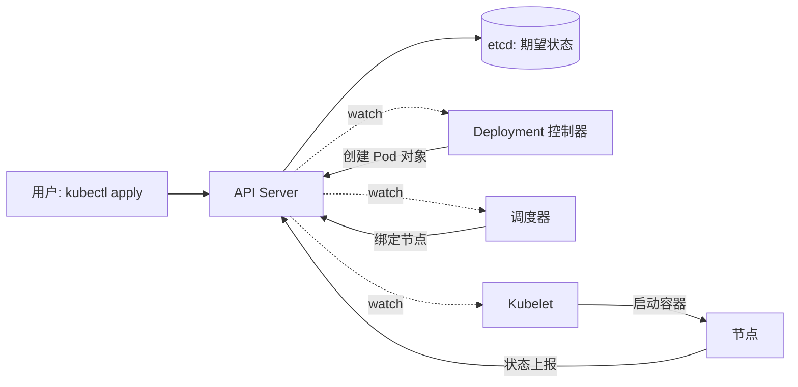

# Kubernetes 核心机制与企业级落地

> K8s 的学习材料汗牛充栋，但多数停在"怎么用 kubectl"。这篇想讲清楚两件事：**它的核心机制为什么是这样设计的**（理解了机制，API 对象的语义自然贯通），以及**企业级落地时课本之外要解决的问题清单**。

## 一个心智模型：K8s 是一个声明式控制系统

所有对 K8s 的理解，都可以浓缩成一句话：

> **你声明期望状态（Desired State），控制器持续地把现实状态（Actual State）收敛到期望状态。**

这不是实现细节，而是整个系统的设计哲学。它带来三个推论：

1. **不要命令式操作**。`kubectl delete pod` 之后 Pod 会被重建——因为 Deployment 声明的副本数没变。改状态要改声明，不要直接动对象。
2. **所有组件都在做 watch + reconcile**。理解了这一点，就能理解 etcd 为什么是唯一的真相源、为什么 API Server 是唯一入口、为什么组件间从不直接互相调用。
3. **故障处理是"自动收敛"而不是"人工恢复"**。节点挂了，上面的 Pod 会被重新调度——前提是控制器知道它挂了（这也是节点心跳与驱逐机制存在的原因）。



## 核心机制拆解

### 控制器模式：可扩展性的来源

一个控制器 = 一个控制循环：

```
for {
    actual := 观察现实状态
    desired := 读取期望状态
    diff := 计算差异
    执行动作消除差异
    等待下一次事件
}
```

Deployment、StatefulSet、DaemonSet、Job……全是这个模式的变体，差别只在"期望状态的定义"和"收敛动作"。这也是 CRD + Operator 能成立的根本原因：**你可以定义自己的资源类型，然后写一个控制器让它按你的业务逻辑收敛**。云原生生态的半壁江山（数据库、消息队列、AI 训练平台）都建在这个扩展点上。

### 调度器：约束满足问题

调度分两步：**过滤（哪些节点可行）→ 打分（哪个节点最优）**。常见约束：

- 资源请求（requests）与节点可分配量
- 亲和/反亲和：副本打散到不同节点/可用区
- 污点与容忍：专用节点池（如 GPU 节点）的隔离

实践要点：**requests 是调度依据，limits 是运行时上限**。两者设置不当，要么资源浪费（requests 虚高），要么被驱逐（节点内存压力时按 QoS 等级杀）。生产集群的第一课往往是治理超卖与 requests 的真实率。

### 网络模型：每个 Pod 一个 IP

K8s 网络模型的要求是：**任意两个 Pod 可以不经 NAT 直接通信**。具体实现交给 CNI 插件（Flannel 的 Overlay、Calico 的 BGP 路由、云厂商的 VPC 原生集成……）。

企业落地时真正要做的选择只有一个：**Pod IP 是否要进入公司网络体系**。用 Overlay，Pod 网络自成一体，与传统网络隔离清晰；用 VPC 原生（如云上托管集群的 Terway 类方案），Pod 直接获得 VPC IP，与安全组、负载均衡天然打通，但受限于 VPC 的 IP 规划。

## 企业级落地清单

课本不会讲，但每个企业都会遇到：

### 1. 集群规划

- **单集群规模上限**：社区建议 5000 节点/15 万 Pod 以内，实际上千节点后 etcd 与 API Server 就需要精细调优
- **多集群是常态**：按环境（生产/测试）、按地域、按业务域拆分；用联邦/多集群管理面解决配置分发
- **托管还是自建**：绝大多数企业应该选云厂商托管版（ACK 类），把控制面的高可用与升级交给平台——自建集群的运维成本被严重低估是行业共识

### 2. 多租户与隔离

- 命名空间只是逻辑边界，**不是安全边界**
- 资源配额（ResourceQuota）+ 限制范围（LimitRange）管住资源
- 网络策略（NetworkPolicy）默认全通——不写策略的集群等于没有隔离
- 强隔离场景：节点池隔离、gVisor/Kata 安全容器、甚至独立集群

### 3. 存储

- 有状态服务上 K8s 的前提：**存储后端要能被 CSI 驱动管理且支持快速重挂载**
- 云盘类块存储：单挂载、重调度慢（需从旧节点卸载），适合数据库但不适合频繁漂移的负载
- 共享文件存储：多 Pod 共读，适合 AI 训练数据集、内容处理管线

### 4. 发布与流量

- 标准路径：Service（集群内）→ Ingress/ALB Ingress（外部入口）→ 灰度（按权重/按特征）
- 金丝雀发布的最小闭环：两个版本 Deployment + 流量切分 + 指标观察 + 自动回滚条件
- 发布系统的本质不是 K8s 功能，而是**把"观察-决策-回滚"流程固化**

### 5. 可观测与安全基线

- 三件套缺一不可：指标（Prometheus/云监控）、日志（结构化采集）、链路（OpenTelemetry）
- 安全基线：镜像漏洞扫描准入、特权容器白名单、Secret 加密存储、最小权限 RBAC
- 升级策略：跟随平台托管版本的节奏，**永远不要落后支持周期**——安全补丁没有商量余地

## 常见坑

| 坑 | 现象 | 根因与对策 |
| --- | --- | --- |
| 不设置 resources | 节点互相干扰、雪崩 | 强制 requests/limits 准入 |
| 探针配错 | 反复重启、发布超时 | 存活探针别测业务逻辑，就绪探针才是流量开关 |
| PDB 缺失 | 节点维护时服务全停 | 给关键负载配 PodDisruptionBudget |
| 镜像拉取风暴 | 发布时仓库被打挂 | 镜像预热 + 节点缓存 + 分批发布 |
| etcd 磁盘慢 | 全集群抖动 | 托管版可豁免；自建必须用高性能盘并监控延迟 |

## 实践观点

- **K8s 解决的是"平台问题"，不是"应用问题"**。应用不改架构直接塞进容器，只是换了个地方部署，弹性、韧性红利一分拿不到。
- **从托管开始，向深度演进**。先用云厂商托管集群把发布、监控、扩容跑顺，再逐步引入 Operator、服务网格等深水区能力。顺序反了，团队会被平台本身的复杂度淹没。
- **衡量落地成功与否的指标不是"上了 K8s"，而是**：发布频率、变更失败率、故障恢复时间（MTTR）——这三个数变好了，云原生才真的发生了。

## 参考资料

<Refs>

- [Kubernetes 官方文档（中文）](https://kubernetes.io/zh-cn/docs/home/)
- [CNCF 全景图](https://landscape.cncf.io/)
- 站内相关：[微服务治理](/cloud/native/microservice) · [可观测体系](/cloud/native/observability) · [云计算基座](/cloud/foundation/)

</Refs>