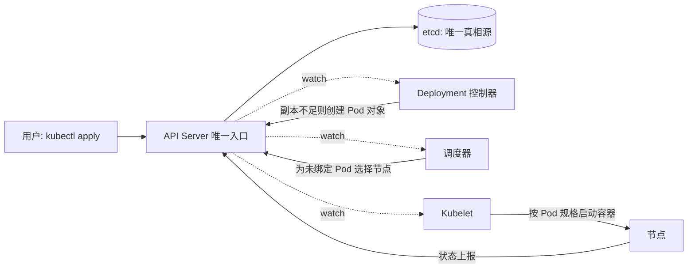
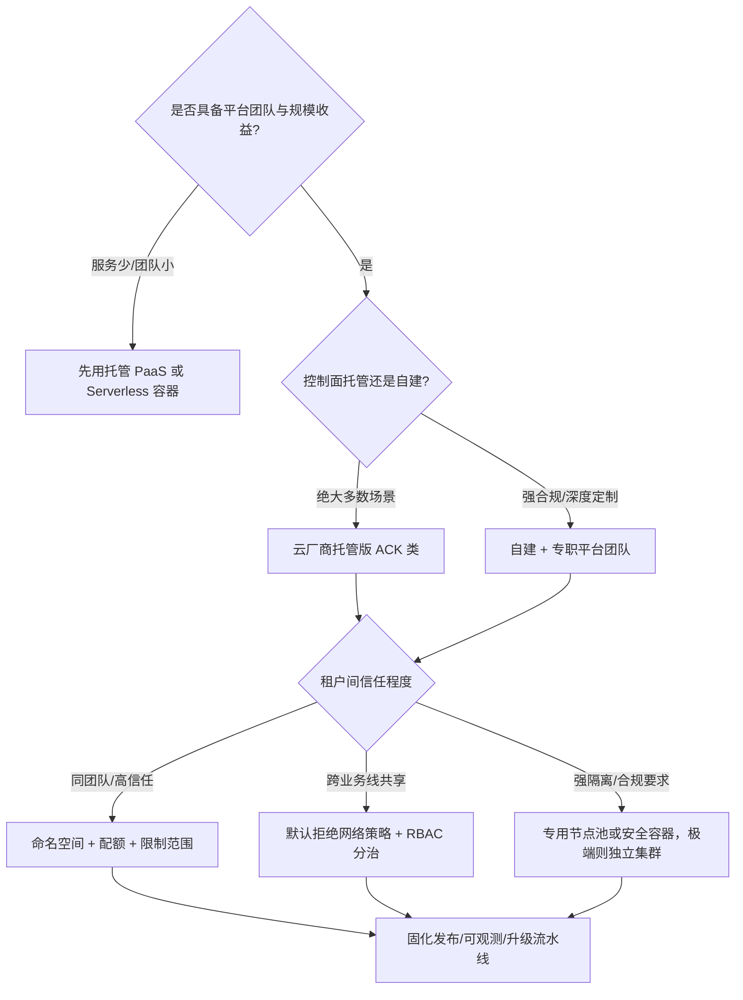

# Kubernetes 核心机制与企业级落地

> K8s 的学习材料汗牛充栋，但多数停在"怎么用 kubectl"。这篇想讲清楚两件事：**它的核心机制为什么是这样设计的**（理解了机制，API 对象的语义自然贯通），以及**企业级落地时课本之外必须解决的问题**——多租户、升级节奏、弹性、安全基线、可观测。文中所有特性状态均按 2026-09 的 kubernetes.io 官方文档与博客核实，不凭记忆。

## 是什么：一个声明式控制系统

所有对 K8s 的理解，都可以浓缩成一句话：

> **你声明期望状态（Desired State），控制器持续地把现实状态（Actual State）收敛到期望状态。**

这不是实现细节，而是整个系统的设计哲学。它带来三个推论：

1. **不要命令式操作**。`kubectl delete pod` 之后 Pod 会被重建——因为 Deployment 声明的副本数没变。改状态要改声明，不要直接动对象。
2. **所有组件都在做 watch + reconcile**。理解了这一点，就能理解 etcd 为什么是唯一的真相源、为什么 API Server 是唯一入口、为什么组件之间从不直接互相调用。
3. **故障处理是"自动收敛"而不是"人工恢复"**。节点挂了，上面的 Pod 会被重新调度——前提是控制器知道它挂了（这正是节点心跳与驱逐机制存在的原因）。




*图源：Kubernetes 官方文档 Components 页（[kubernetes.io/docs/concepts/overview/components](https://kubernetes.io/docs/concepts/overview/components/)，访问日期 2026-09-04）*

上图是官方组件架构图，值得记住的只有两条主线：**控制面**（kube-apiserver、etcd、kube-scheduler、kube-controller-manager、cloud-controller-manager）负责"决策"，**节点**（kubelet、kube-proxy、容器运行时）负责"执行"，两者之间唯一的通路是 API Server。组件之间没有一条直连调用——这正是声明式架构的物理呈现。

## 为什么重要：期望状态是运维模型的根本转变

"声明式"三个字听起来像语法偏好，实际上是运维模型的换代。命令式运维把**操作步骤**编码在人的头脑与 runbook 里：扩容先登录哪台机器、改哪个配置、重启哪个服务，全靠工程师记忆与纪律。声明式运维把**状态契约**编码进系统：期望状态是机器可读的、可 diff 的、可回滚的，收敛动作由控制器无限重试。

| 维度 | 命令式运维 | 声明式收敛 |
| --- | --- | --- |
| 故障恢复 | 人按 runbook 执行，恢复时间取决于响应速度 | 控制器自动补齐差异，多数故障无人介入 |
| 变更审计 | 靠操作记录，易缺失 | 期望状态即变更单，天然可进 Git |
| 重试安全 | 脚本重跑可能产生副作用 | 收敛操作幂等，重试无风险 |
| 知识沉淀 | 在老员工头脑里 | 在 YAML、Operator 与平台代码里 |

第四行是我认为最重要的一行：**期望状态可入库，才谈得上 GitOps；运维知识代码化，团队扩张才不被个人经验卡住**。这也是 K8s 真正的护城河——不是容器本身，而是这套以 API 为中心的收敛体系。

边界同样要说清：K8s 收敛的是**平台层状态**（进程在不在、副本够不够、流量通不通），应用数据的一致性、外部依赖的可用性不在它的收敛范围内。**K8s 解决"平台问题"，不解决"应用问题"**——应用不改架构直接塞进容器，只是换了个地方部署，弹性与韧性红利一分拿不到。

## 核心机制拆解

### 控制器模式：可扩展性的来源

一个控制器 = 一个控制循环：

```
for {
    actual := 观察现实状态
    desired := 读取期望状态
    diff := 计算差异
    执行动作消除差异
    等待下一次事件
}
```

Deployment、StatefulSet、DaemonSet、Job……全是这个模式的变体，差别只在"期望状态的定义"和"收敛动作"。这也是 CRD + Operator 能成立的根本原因：**你可以定义自己的资源类型，然后写一个控制器让它按你的业务逻辑收敛**。云原生生态的半壁江山——数据库、消息队列、AI 训练平台——都建在这个扩展点上。

### 调度与资源请求：约束满足问题

调度分两步：**过滤（哪些节点可行）→ 打分（哪个节点最优）**。常见约束：

- 资源请求（requests）与节点可分配量
- 亲和/反亲和：副本打散到不同节点、不同可用区
- 污点与容忍（taints/tolerations）：专用节点池（如 GPU 节点）的隔离

实践要点：**requests 是调度依据，limits 是运行时上限**。两者设置不当，要么资源浪费（requests 虚高、节点卖不满），要么节点超卖后按 QoS 等级驱逐——Guaranteed（requests 等于 limits）最后死，BestEffort（完全不设）最先死。生产集群的第一课往往是治理 requests 的真实率：我见过的集群，第一年的资源利用率问题九成出在"拍脑袋的 requests"上。

### 网络模型：每个 Pod 一个 IP

K8s 网络模型的要求只有一条：**任意两个 Pod 可以不经 NAT 直接通信**。具体实现交给 CNI 插件。集群里实际有三张互相独立的地址平面：节点网段、Pod 网段、Service 网段。


*图源：Kubernetes 官方文档 Cluster Networking 页（[kubernetes.io/docs/concepts/cluster-administration/networking](https://kubernetes.io/docs/concepts/cluster-administration/networking/)，访问日期 2026-09-04）*

要理解的网络组件有两层：

- **Pod 互通层（CNI）**：决定 Pod IP 怎么分配、跨节点流量怎么封装或路由；
- **Service 层（kube-proxy 或等价实现）**：把 Service 的虚拟 IP 转换成后端 Pod 集合，做负载均衡。

kube-proxy 的实现模式与 CNI 的选型，是企业落地时真正的技术决策点：

| 方案 | 机制 | 优势 | 代价与边界 |
| --- | --- | --- | --- |
| kube-proxy/iptables | 内核规则逐条匹配 | 默认自带、无额外依赖 | 规则数随 Service 线性增长，数千 Service 后更新延迟明显 |
| kube-proxy/IPVS | 内核哈希表 | 大规模 Service 下性能与更新速度显著更好 | 多一层内核模块依赖，排障工具链不同 |
| eBPF（Cilium 类） | 内核态程序直接处理 | 绕过 iptables，性能与可观测性俱佳 | 对内核版本有要求，团队需要新技能栈 |
| Overlay CNI（Flannel VXLAN 类） | 隧道封装 | 对底层网络零要求，部署最省心 | 封装开销与 MTU 损耗，Pod 网段对传统网络不可见 |
| BGP 路由（Calico） | Pod 网段路由宣告 | 无封装损耗，性能接近原生 | 需要网络设备支持，运维门槛高 |
| VPC 原生（Terway 类） | Pod 直接拿 VPC IP | 与安全组、负载均衡天然打通 | 受 VPC IP 规划约束，换云即换方案 |

我的判断：**企业落地时真正要做的选择只有一个——Pod IP 是否进入公司网络体系**。用 Overlay，Pod 网络自成一体，与传统网络隔离清晰，适合多数场景；用 VPC 原生，Pod 直接获得 VPC IP，东西向安全策略可以复用既有体系，但深度绑定云平台。两者没有绝对优劣，取决于你的网络团队愿意把边界画在哪里。

### Service 与入口流量

Service 提供集群内的稳定虚拟入口（ClusterIP），NodePort 与 LoadBalancer 依次向外延伸；配合 headless Service 可以直连 Pod IP，StatefulSet 类负载常用。外部入口的传统路径是 Ingress：


*图源：Kubernetes 官方文档 Ingress 页（[kubernetes.io/docs/concepts/services-networking/ingress](https://kubernetes.io/docs/concepts/services-networking/ingress/)，访问日期 2026-09-04）*

Ingress 的问题在于表达能力弱（大量能力靠注解扩展，各家实现不兼容）且只管南北向。2023 年 Gateway API v1.0 发布，此后逐步成为官方推荐的替代方案；到 2026 年它的标准通道能力已经补齐（详见下文"2026 年的特性版图"），新项目入口层我会默认选 Gateway API，Ingress 只作为存量兼容。

### 存储：PV、PVC 与 CSI

存储抽象分三层：**PV**（一块真实存储）、**PVC**（用户对存储的申请）、**StorageClass**（动态供给的模板）。对接具体存储后端靠 CSI（容器存储接口）驱动——这相当于存储界的 CNI，云盘、文件存储、分布式存储各带自己的驱动接入。

| 存储类型 | 典型形态 | 适合 | 不适合 |
| --- | --- | --- | --- |
| 块存储（云盘） | 单节点读写 | 数据库、需要独占卷的有状态服务 | 多 Pod 共享、频繁漂移的负载（重调度要先卸载再挂载，慢） |
| 共享文件存储 | 多 Pod 共读共写 | AI 训练数据集、内容处理管线 | 高 IOPS 低延迟的数据库主库 |
| 本地盘/临时存储 | 节点生命周期绑定 | 缓存、可重建的中间数据 | 任何不可再生的数据 |

我的边界判断：**有状态服务上 K8s 的前提，是存储后端能被 CSI 驱动管理且支持快速重挂载**；数据的持久性永远靠存储后端与备份策略保证，不靠 K8s。把"Pod 重建"误当成"数据丢失"，或者反过来以为 K8s 会替你保数据，是同一类认知错误。

## 企业级落地：课本之外的五件事

这一节把"每个企业都会遇到但没人教"的问题展开成决策。先看整体流程：



### 多租户与命名空间隔离

先破除一个误解：**命名空间只是逻辑边界，不是安全边界**。同集群内不同命名空间的 Pod，默认网络全通、共享内核，一个逃逸漏洞可以穿透所有命名空间。所以隔离手段要按"租户间信任程度"分层选择：

- **同一团队内部**：命名空间 + ResourceQuota + LimitRange 即可，管住资源超用就够；
- **跨业务线共享集群**：在此之上必须加默认拒绝的 NetworkPolicy 与按命名空间分治的 RBAC，否则等于没有隔离；
- **互不信任或强合规**：上专用节点池、安全容器（gVisor/Kata 类，用额外一层隔离换性能损耗），极端情况直接独立集群。

我的经验值：**多数企业的合理终态是"按环境 + 按业务域拆少数几个大集群 + 命名空间内软隔离"**。集群数量失控（一个部门一个集群）会让版本管理、网络打通、可观测的成本指数上升；单集群塞下全公司则让爆炸半径失去控制。社区建议的单集群上限是 5000 节点/15 万 Pod 量级，实际上千节点后 etcd 与 API Server 就需要精细调优——规模不是免费的。

### 升级策略与版本节奏

K8s 约每四个月一个小版本，社区同时维护最近三个小版本（2026-09 时点为 1.35、1.36、1.37）。由此推出三条纪律：

1. **永远不要落后支持周期**。掉出支持窗口的版本不再有安全补丁，这一条没有商量余地。
2. **升级走固定路径**：测试环境 → 预发 → 生产灰度节点池 → 全量滚动。托管集群的控制面升级由平台负责，节点升级自己按池滚动。
3. **利用版本偏差策略争取时间**：官方允许 kubelet 落后 API Server 最多两个小版本，所以控制面可以先升、节点池分批慢慢升，不必一次全停。

配套动作：升级前读官方 release notes 里的弃用与移除清单（API 移除是升级事故的头号来源），用 API 兼容性检查工具扫一遍存量清单。**把升级当成季度性例行公事而不是年度大工程**——拖得越久，版本跨度越大，升级越痛。

### 节点池与弹性伸缩

节点不是同质的，按负载特征切节点池是标准做法：通用池、内存优化池、GPU 池、抢占式（竞价）实例池。切分带来的直接收益是成本与干扰隔离：批处理放抢占池省钱，在线服务放通用池保稳定，GPU 池用污点防止普通负载误入。

弹性伸缩有三层，各司其职：

| 层 | 机制 | 解决什么 | 边界 |
| --- | --- | --- | --- |
| Pod 层 | HPA | 按指标增减副本 | 应用须无状态或可水平拆分 |
| Pod 层（新） | 原地垂直伸缩（1.35 GA） | 不重建 Pod 改资源 | 见下文 2026 特性节 |
| 节点层 | Cluster Autoscaler / Karpenter 类 | 按待调度 Pod 增减节点 | 扩容有分钟级延迟，突发流量需预留余量 |

抢占式节点池要配合 PDB（PodDisruptionBudget）与应用的优雅下线，把"节点随时可能被回收"变成可预期的扰动而不是事故。

### 网络策略与安全基线

NetworkPolicy 的默认行为是**全通**——不写策略的集群等于没有网络隔离。落地顺序我建议反过来走：先对东西向流量做默认拒绝（至少在生产命名空间），再按服务依赖逐个放行白名单。一开始就追求策略全覆盖会烂尾，先覆盖核心链路、随服务变更滚动维护才现实。

安全基线是一张不变的清单，缺哪一项都会在审计时还债：

- 镜像准入：来源仓库白名单 + 漏洞扫描卡点；
- 特权容器：默认禁止，例外走审批；Pod 安全用 Pod Security Admission（PSA）按命名空间分级强制执行；
- 权限：RBAC 最小权限，禁止共享集群管理员凭据；
- 机密：Secret 静态加密，优先接外部密钥管理；
- 审计：API 审计日志必须开启并留存。

### 可观测接入

可观测不是上线后补的功课。K8s 提供了现成的接入点：节点与 Pod 用量走 metrics.k8s.io API（该 API 在 v1.37 结束近九年 Beta 转为稳定版），对象状态走 kube-state-metrics，容器级指标走运行时自带的 cAdvisor——三者加上业务指标，构成指标面；日志用结构化输出 + 节点级采集；链路接 OpenTelemetry。

我的判断与站内[可观测体系](/cloud/native/observability)一文一致：**可观测要先于大规模扩容建立**。集群从 10 个节点长到 100 个节点的过程中，没有指标支撑的容量规划就是赌博；而"告警多到没人看"比"没有告警"更常见，告警治理的核心是按服务负责人路由，不是堆规则。

## 2026 年的特性版图

以下状态全部按 2026-09 的官方文档与博客核实。当前稳定版为 v1.37（2026-08-26 发布，代号 Garhwal，67 项增强）。选型基线建议不低于 1.35——这是"跑 AI 与有状态负载"三大短板补齐的分界线。

| 特性 | 官方状态（2026-09 核实） | 落地含义 |
| --- | --- | --- |
| DRA 动态资源分配 | 核心自 v1.34 稳定（v1.35 锁定），v1.37 多项子特性转稳定 | GPU 调度从 device plugin 迁向 DRA |
| Gateway API | v1.5（2026-04）多项特性转稳定通道；v1.6（2026-06 发布）TCPRoute/UDPRoute 转标准通道 | 可正式替代 Ingress |
| Sidecar 容器 | v1.33 起稳定 | 边车生命周期问题终结 |
| Pod 原地垂直伸缩 | v1.35 起稳定 | 改资源不再重建 Pod |
| KubeVirt | v1.9.0（2026-07-30 发布） | VM 存量与 K8s 增量统一管控 |

**DRA（动态资源分配）**是 AI 基础设施语境下最值得跟进的一项。它把设备分配从"每容器报个数"升级为"声明式申领"：驱动以 ResourceSlice 上报设备，管理员以 DeviceClass 定义设备类别，工作负载以 ResourceClaim 申领，调度器用 CEL 表达式按属性精细匹配——语义上就是"存储 PVC 模式"在设备域的复刻。官方文档明确它相对 device plugin 的优势：设备共享、按负载配置设备、表达式过滤。v1.37 又补齐了几块关键拼图：DRA 驱动可直接承接传统扩展资源请求（如 `example.com/gpu: 3`，无需 device plugin）、设备污点与容忍、标准化 NUMA 属性。**落地含义：新的 GPU 集群规划应直接按 DRA 设计；存量 device plugin 不必恐慌性迁移，但扩容时点就是切换时点。**边界也要注意：官方文档写明调度器目前不支持对 DRA 资源的抢占，高优任务等不到设备时只能排队。

**Gateway API** 的演进路径：v1.0（2023-10）核心 GA，v1.5（2026-04，博客《Moving features to Stable》）继续把特性移入稳定通道，v1.6（2026-06-30 发布）让 TCPRoute/UDPRoute 毕业进标准通道（v1 版本），并新增实验性的 XBackend 资源（面向 Service 的通用装饰器）。**落地含义：L4 到 L7 的南北向入口有了统一标准，Ingress 注解时代可以正式翻篇；东西向与推理流量入口（Inference Extension 方向）也在同一条路线上。**

**Sidecar 容器**自 v1.33 稳定（机制是"可重启的 init 容器"）：边车在主容器之前启动、之后退出，生命周期排序由平台保证。落地含义：服务网格代理、日志代理这类经典边车的启动竞态与停机顺序问题成为历史，存量 sidecar 模式可以在版本升级时顺手切换。

**Pod 原地垂直伸缩**自 v1.35 稳定：修改 Pod 资源规格不再触发重建，对内存敏感型与有状态服务是实打实的体验改善——扩内存不重启，意味着不用为一次调参付出连接重建的代价。v1.37 又新增两个相关 alpha（调度器抢占支持、内存型 emptyDir 伸缩），方向明确。边界：变更仍需节点有余量，否则要么等待要么重调度，它不是无限弹性。

**KubeVirt v1.9.0** 于 2026-07-30 发布，全部 Beta 特性门默认开启，与 K8s 1.36 对齐。定位始终是"把虚机作为 K8s 的一种负载管理"。**落地含义：VMware 替代与"VM 存量 + 容器增量"统一纳管有了成熟答案；边界：它不是容器化，虚机仍背负完整客户机操作系统，别拿它当轻量方案。**

另外两项顺带一提：v1.36 起 Pod 级用户命名空间（User Namespaces）转稳定，容器逃逸的默认防线显著加厚；v1.37 中 HPA 缩容到零转 Beta（基于对象/外部指标），队列型与 GPU 批处理负载的成本模型会因此改变。完整的 1.33–1.37 编年见本站[云原生导读](/cloud/native/)。

## 常见坑

| 坑 | 现象 | 根因与对策 |
| --- | --- | --- |
| 不设置 resources | 节点上负载互相干扰、内存压力时连环驱逐 | 准入层强制 requests/limits，QoS 等级纳入评审 |
| 探针配错 | 反复重启、发布超时 | 存活探针别测业务逻辑，就绪探针才是流量开关 |
| PDB 缺失 | 节点维护/升级时服务全停 | 给关键负载配 PodDisruptionBudget |
| 镜像拉取风暴 | 发布时镜像仓库被打挂 | 镜像预热 + 节点缓存 + 分批发布 |
| etcd 磁盘慢 | 全集群抖动、API 延迟尖刺 | 托管版可豁免；自建必须用高性能盘并监控延迟 |
| 以为命名空间是安全边界 | 跨租户流量畅通、越权访问 | NetworkPolicy 默认拒绝 + RBAC 分治，强隔离上节点池/安全容器 |
| 一个巨集群塞下所有环境 | 测试压测打挂生产控制面，升级爆炸半径无限大 | 按环境/地域/业务域拆集群，至少生产独立 |
| kubectl 直接改线上对象 | 变更无审计、与 Git 声明不一致被控制器"莫名"回滚 | 一切变更走 GitOps 流水线，临时操作也要补声明 |

## 实践观点

- **K8s 解决的是"平台问题"，不是"应用问题"**。应用不改架构直接塞进容器，只是换了个地方部署，弹性、韧性红利一分拿不到。
- **从托管开始，向深度演进**。先用云厂商托管集群把发布、监控、扩容跑顺，再逐步引入 Operator、服务网格等深水区能力。顺序反了，团队会被平台本身的复杂度淹没。
- **衡量落地成功与否的指标不是"上了 K8s"，而是**：发布频率、变更失败率、故障恢复时间（MTTR）——这三个数变好了，云原生才真的发生了。

## 参考资料

<Refs>

- [Kubernetes v1.37: Garhwal（官方发布博客）](https://kubernetes.io/blog/2026/08/26/kubernetes-v1-37-release/)（访问日期 2026-09-04）
- [Kubernetes v1.37: DRA Updates（官方博客）](https://kubernetes.io/blog/2026/09/03/kubernetes-v1-37-dra-updates/)（访问日期 2026-09-04）
- [Kubernetes v1.34: Of Wind & Will（官方博客，DRA 核心 GA）](https://kubernetes.io/blog/2025/08/27/kubernetes-v1-34-release/)（访问日期 2026-09-04）
- [Gateway API v1.5: Moving features to Stable（官方博客）](https://kubernetes.io/blog/2026/04/21/gateway-api-v1-5/)（访问日期 2026-09-04）
- [Gateway API v1.6: TCPRoute and UDPRoute Graduate to Standard（官方博客）](https://kubernetes.io/blog/2026/08/03/gateway-api-v1-6-release/)（访问日期 2026-09-04）
- [Dynamic Resource Allocation（官方概念文档）](https://kubernetes.io/docs/concepts/scheduling-eviction/dynamic-resource-allocation/)（访问日期 2026-09-04）
- [Feature Gates（官方参考文档，特性阶段核实依据）](https://kubernetes.io/docs/reference/command-line-tools-reference/feature-gates/)（访问日期 2026-09-04）
- [Sidecar Containers（官方概念文档）](https://kubernetes.io/docs/concepts/workloads/pods/sidecar-containers/)（访问日期 2026-09-04）
- [Resizing Container Resources（官方任务文档，原地垂直伸缩）](https://kubernetes.io/docs/tasks/configure-pod-container/resize-container-resources/)（访问日期 2026-09-04）
- [Kubernetes Components（官方概念文档）](https://kubernetes.io/docs/concepts/overview/components/)（访问日期 2026-09-04）
- [Cluster Networking（官方概念文档）](https://kubernetes.io/docs/concepts/cluster-administration/networking/)（访问日期 2026-09-04）
- [KubeVirt v1.9.0 发布公告](https://kubevirt.io/2026/changelog-v1.9.0.html)（访问日期 2026-09-04）
- [CNCF 全景图](https://landscape.cncf.io/)（访问日期 2026-09-04）
- 图片来源：components-of-kubernetes.svg 取自 [Components 页](https://kubernetes.io/docs/concepts/overview/components/)；kubernetes-cluster-network.svg 取自 [Cluster Networking 页](https://kubernetes.io/docs/concepts/cluster-administration/networking/)；ingress.svg 取自 [Ingress 页](https://kubernetes.io/docs/concepts/services-networking/ingress/)（均访问于 2026-09-04）
- 站内相关：[微服务治理](/cloud/native/microservice) · [可观测体系](/cloud/native/observability) · [云原生导读](/cloud/native/) · [云计算基座](/cloud/foundation/)

</Refs>
