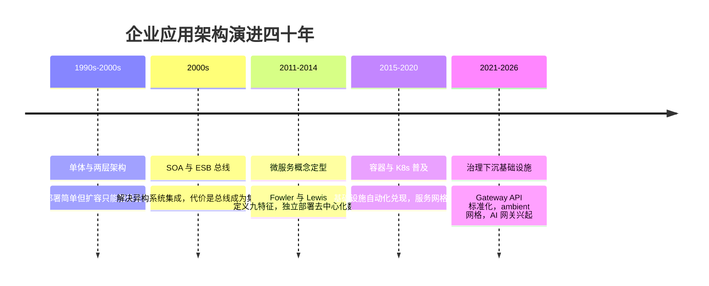
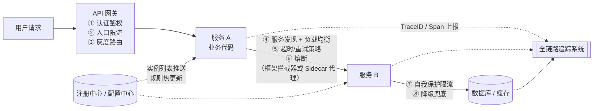
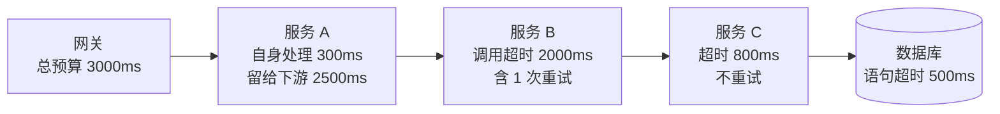
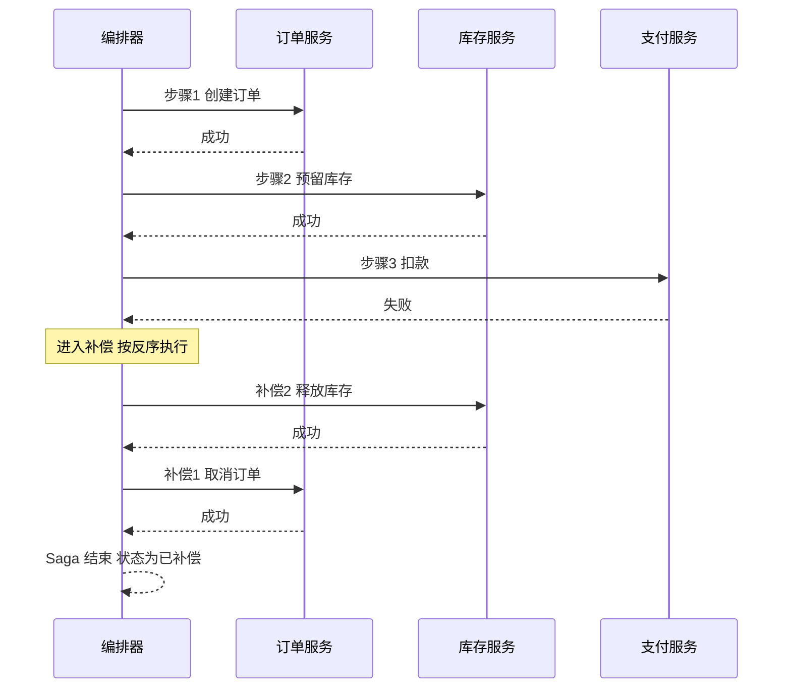
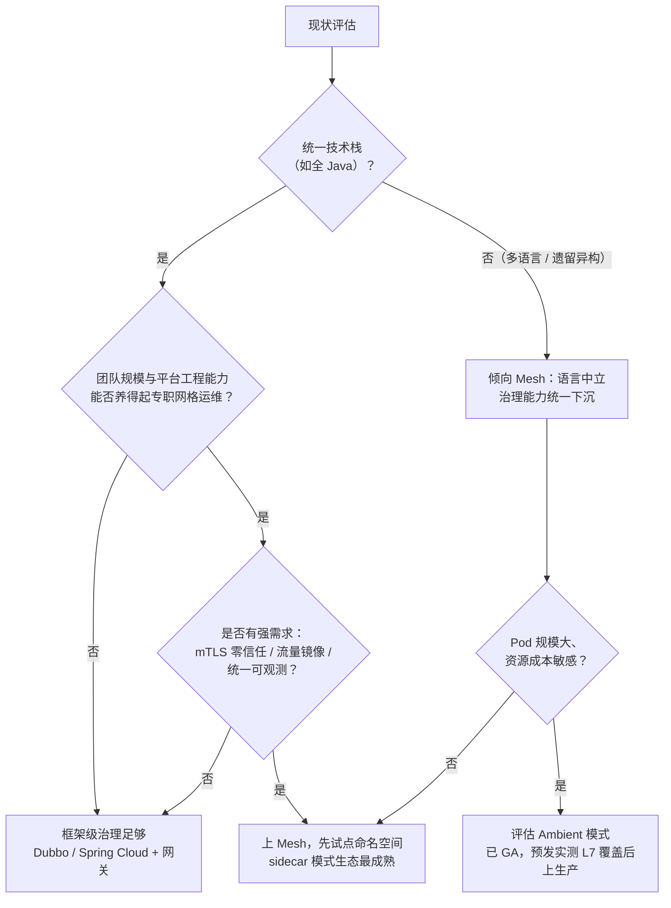
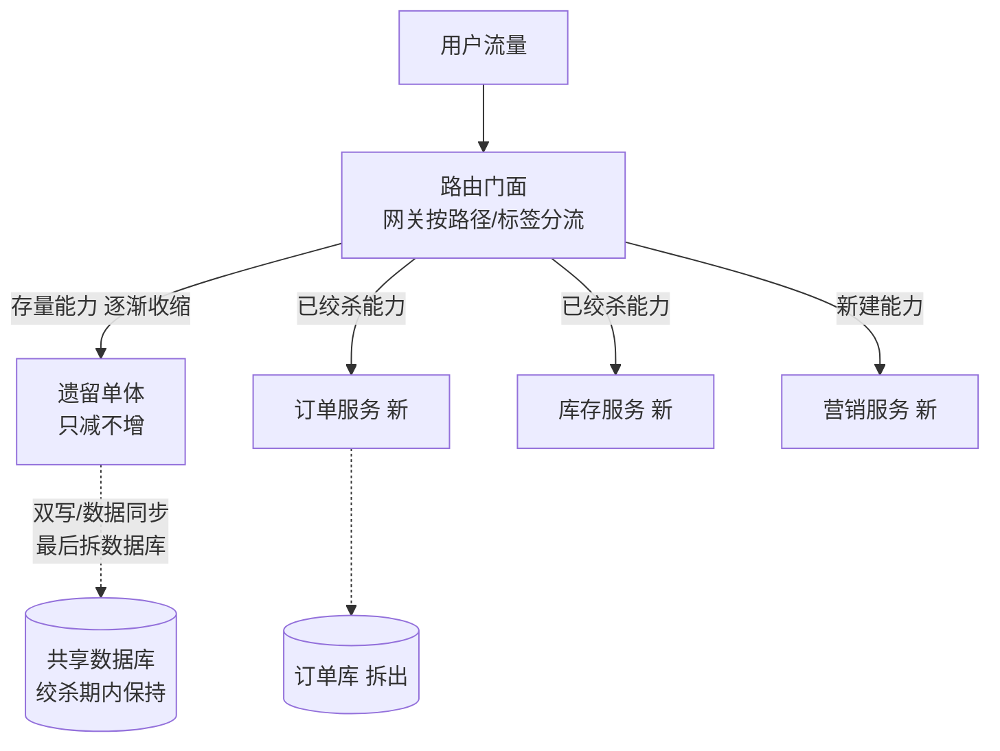

# 微服务治理

> 这篇写给两类人：正在把单体拆成微服务、发现"拆完之后管不住"的团队；以及被"要不要上服务网格、拆到什么粒度算对"困扰、需要一条有边界的决策线的架构师。全文按一条主线展开——**拆分的每一次演进都解决了一个旧问题、同时欠下一笔新账，治理就是把这笔账管住的机制**：先讲单体→SOA→微服务的演进逻辑与"分布式八宗罪"，再讲拆分方法论（DDD 限界上下文、康威定律与团队拓扑），然后逐个拆开的机制——注册发现的 AP/CP 选择、配置推送与轮询、弹性五件套的超时预算、同步调用与异步消息（Outbox/Saga）、Service Mesh 的 sidecar 与 ambient 两条路线、流量入口从 Ingress 到 Gateway API 的标准化，最后给国内生态谱系（Spring Cloud Alibaba/Dubbo 3/Higress，截至 2026-09 的现状）、存量系统绞杀者改造路径和一张常见翻车姿势清单。读完你应能回答：一次请求沿途经过哪些治理环节、每个环节该用框架还是平台能力去接、什么规模才值得上网格、以及拆错了怎么退回来。

## 从单体到微服务：演进史三幕

先把时间轴拉直。微服务不是从天上掉下来的最佳实践，而是**每一代为了解决上一代的具体痛点而付出的新代价**，理解这条因果链，比背下九个特征重要得多。

### 第一幕：单体——简单性红利与它的耗尽

单体（一个进程承载全部业务逻辑）在早期几乎是正确答案：本地函数调用没有网络问题，一个事务包住所有写操作，部署就是发一个包，排障就是看一个进程的日志。它的红利来自**简单性**。

红利耗尽的信号是规模触顶，我见过的典型症状按出现顺序大致是：

1. **代码库膨胀**：几十万到上百万行，新人三个月才敢提交核心模块；一次编译十分钟起步。
2. **发布互相排队**：营销模块要上线，被支付模块的冻结期卡住；发布窗口成为稀缺资源。
3. **扩容只能整体复制**：只有 5% 的代码是热点，却要整体复制 N 份。
4. **技术栈锁死**：升级一个基础依赖要全量回归，没人敢动。
5. **故障爆炸半径 = 整个进程**：一个模块内存泄漏，全站陪葬。

注意：这些症状的根源是**组织规模增长快于代码模块化能力**，不是单体本身的原罪。团队二十人以内的业务，单体依然是我默认推荐的形态——Martin Fowler 的 [MonolithFirst](https://martinfowler.com/bliki/MonolithFirst.html) 立场至今没变：先做单体，边界清楚了再拆。

### 第二幕：SOA 与 ESB——集成问题解决了一半

SOA（面向服务架构）在 2000 年代要解决的是大企业里"上百个异构系统互相集成"的问题：ERP、CRM、自研系统各说各话，点对点集成是 N×N 根线的蜘蛛网。SOA 的答案是**企业服务总线（ESB）**：所有系统接到总线上，总线负责协议转换、消息路由、编排，点对点变成 N×1。

它确实解决了集成问题，但引入了两个新成本：**总线变成了全企业流量与逻辑的集中点**——路由规则、转换逻辑、甚至业务编排都堆进总线，总线团队成为交付瓶颈；**标准过重**——WS-* 全家桶（WSDL/SOAP/WS-Security 等）的复杂度，让"改一个字段"变成跨团队工程。微服务后来对 SOA 的扬弃正在于此：**把智能从总线搬回服务端点（smart endpoints, dumb pipes），用轻量协议替代重型标准，用去中心化治理替代集中式管控**。

### 第三幕：微服务——九个特征与一笔"分布式税"

Martin Fowler 和 James Lewis 在 2014 年的定义文里把微服务概括为九个特征：按业务能力组件化、去中心化治理、去中心化数据、基础设施自动化、**为失败而设计**等（[原文](https://martinfowler.com/articles/microservices.html)）。我常把这段学术表述翻译给业务方听：微服务不是"把代码切成小块"，而是**把进程内的函数调用换成网络调用**——而网络，是不可靠的。

*图源：Wikimedia Commons（[文件页](https://commons.wikimedia.org/wiki/File:Microservices_app_example_v0.4.png)）*

注意这张图里的双向箭头——每个箭头都是一次可能失败的网络调用。Fowler 原文里那张著名的手绘草图，画的也是同一件事：一个应用内部被拆成一个个通过轻量协议通信的小服务，每个服务围绕业务能力构建、可独立部署：

*图源：Martin Fowler《Microservices》一文插图 sketch（[原文](https://martinfowler.com/articles/microservices.html)）*

一旦跨过进程边界，你就获得了独立部署、按模块扩缩容、技术栈自由选择的好处；同时欠下一笔"分布式税"：网络延迟、数据一致性、故障定位、多实例运维。**微服务治理，就是把这笔税管好、把这份风险保住的整套机制**：服务发现、配置管理、限流熔断降级、负载均衡、全链路追踪，再加一个统一入口 API 网关。

### 分布式八宗罪：这笔税的税目清单

这笔税具体有哪些税目？最经典的清单是 Peter Deutsch 等在 Sun 公司时代总结的**分布式计算谬误**（Fallacies of Distributed Computing）——工程师在分布式系统里最容易默认成立、实际全都不成立的八条假设（[Wikipedia 条目](https://en.wikipedia.org/wiki/Fallacies_of_distributed_computing)）：

| # | 谬误 | 现实 | 治理对策对应的机制 |
| --- | --- | --- | --- |
| 1 | 网络是可靠的 | 丢包、抖动、分区随时发生 | 重试 + 退避、熔断、对账 |
| 2 | 延迟是零 | 本地调用纳秒级，同机房 RPC 毫秒级，跨地域几十毫秒起步 | 超时预算、链路压缩、就近路由 |
| 3 | 带宽是无限的 | 大 payload 跨服务传输既慢又贵 | 接口瘦身、分页、缓存 |
| 4 | 网络是安全的 | 内网流量同样可被嗅探伪造 | mTLS、零信任、鉴权下沉 |
| 5 | 拓扑不会变化 | 实例上下线、扩缩容、发布每时每刻在发生 | 注册发现、健康检查、优雅停机 |
| 6 | 只有一个管理员 | 链路横跨多个团队的多套系统 | 全链路追踪、SLO 分层定责 |
| 7 | 传输成本为零 | 序列化/反序列化、连接管理都是 CPU 和延迟 | 协议选型（gRPC/Triple 类二进制协议） |
| 8 | 网络是同构的 | 多语言、多框架、多版本共存 | 语言中立的治理层（Mesh/网关） |

更早一步，Waldo 等人在 1994 年的《A Note on Distributed Computing》里就论证过：**本地对象和分布式对象的差异不是量变而是质变**——延迟、部分失败（partial failure）和并发语义的改变，让"把远程调用伪装成本地调用"的透明性路线注定要在故障时刻露馅（[Springer 页](https://link.springer.com/chapter/10.1007/3-540-61769-8_5)）。三十多年过去，这条论断依然是所有治理设计的哲学地基：**不要假装网络不存在，而是显式地为不可靠性设计**。

### 分布式单体：两头坏处全占

演进失败的最常见形态，是一个叫**分布式单体**（Distributed Monolith）的反模式：代码拆成了 N 个服务，但——

- **部署耦合**：服务 A 上线必须带上服务 B 和 C，发布又变回了排队；
- **数据耦合**：多个服务直连同一个数据库，或者互相 join 别人的表；
- **同步链耦合**：一次请求串行走完所有服务，任何一环挂全局挂；
- **版本耦合**：共享 jar 包一改，全体服务被迫同步升级。

结果是：**分布式的全部成本（网络、一致性、运维）都付了，单体的全部收益（简单、原子、好排障）也丢了**。判断自己是不是分布式单体有个简单测试：随机挑两个服务，问"能否独立发布、独立扩容、一方宕机另一方是否可降级存活"——三个问题有一个答"不能"，拆分就还没完成。microservices.io 的微服务模式页把 Distributed Monolith 列为该模式的正式"后果"之一（[Pattern 页](https://microservices.io/patterns/microservices.html)），它不是意外，是拆分不彻底的必然产物。

## 为什么拆、怎么拆：粒度是方法论问题

我在方案评审里反对过度拆分的理由从来只有一句话：**一次函数调用变成一次 RPC，延迟涨三个数量级（纳秒→毫秒），故障模式从"要么对要么崩"变成"半死不活"**。没有治理体系的微服务，比单体更脆弱——单体一个 Bug 影响一个进程，无治理的微服务一个慢接口能拖垮整条调用链。

所以"要不要拆"和"拆到哪"不是技术口味问题，是方法论问题。我依赖三把尺子：康威定律（组织尺）、DDD 限界上下文（业务尺）、Scale Cube（瓶颈尺）。

### 康威定律：系统结构复刻组织结构

康威定律（Conway's Law）：设计系统的组织，其产出的系统结构会复刻该组织的沟通结构。Mel Conway 1968 年提出这条定律时还是观察，五十年后它成了拆分决策的第一原则——**服务边界 ≈ 团队边界，一个服务两个团队改，等于没拆；两个服务一个团队改，大概率是拆多了**。

*图源：Martin Fowler《Microservices》一文插图 conways-law（[原文](https://martinfowler.com/articles/microservices.html)）*

由此还派生出**逆康威操作**（Inverse Conway Maneuver）：想要什么样的系统架构，就先组建什么样的团队结构——想让订单和库存解耦，先让两个团队解耦。Team Topologies（团队拓扑）方法论把这件事工程化了（[核心概念](https://teamtopologies.com/key-concepts)）：

- **流对齐团队（Stream-aligned Team）**：对齐一条业务价值流，端到端拥有一个或几个服务——这是微服务属主团队的标准形态；
- **认知负荷（Cognitive Load）**：一个团队能端到端掌握的服务数量有上限，超出就该合并服务或拆分团队——**这是"拆分粒度"最可操作的量化锚点**：粒度不看代码行数，看一个团队能否独立理解、独立发布、独立值班；
- **平台团队（Platform Team）**：把注册中心、网关、追踪、CI/CD 做成自助式内部平台，让流对齐团队不必人人精通基础设施——没有平台团队托底就上微服务，治理成本会摊到每个业务团队头上，这正是多数中小团队拆完后悔的原因。

### DDD 限界上下文：业务语义的切分线

康威定律管"谁来改"，DDD（领域驱动设计，Eric Evans 2004 年提出）管"按什么改"。**限界上下文（Bounded Context）**的定义：一个明确的语义边界，边界内每个术语（统一语言）只有一个确定含义（[Fowler 的 BoundedContext 词条](https://martinfowler.com/bliki/BoundedContext.html)）。

为什么它是拆分的第一候选线？因为微服务最常见的边界错误是**语义渗漏**：订单服务里的"商品"和库存服务里的"商品"字段不一致、状态机不一致，两边代码各自演化，最终谁也说不清哪个是真的。限界上下文机制上保证的正是"一个上下文一套模型"——**按它切分，服务内部高内聚（同一语义域的逻辑在一起），服务之间低耦合（跨域交互只通过显式契约）**。

DDD 战略设计给拆分的操作流程：

1. **划分子域**：把业务领域切成核心域（竞争力所在，如电商的交易撮合）、支撑域（必要但非差异化，如库存管理）、通用域（人人都一样，如认证、通知）；
2. **每个子域圈定限界上下文**：明确上下文内统一语言的词表；
3. **画上下文映射图**：标注上下文之间的集成关系（防腐层 ACL、客户-供应商、共享内核等）——映射图上的每条关系线，未来就是服务间的接口契约；
4. **限界上下文 → 微服务候选**：注意是"候选"而非"必须"，还要过康威定律校验（有没有一个团队能整体拥有它）。

| 子域类型 | 特征 | 拆分建议 | 工程含义 |
| --- | --- | --- | --- |
| 核心域 | 业务竞争力来源，逻辑复杂多变 | 优先拆成独立服务，配最强团队 | 独立演进、独立扩容的价值最大 |
| 支撑域 | 业务必需但非差异化 | 可拆可合，跟着核心域的边界走 | 过度精细化收益低 |
| 通用域 | 行业通用能力（认证/消息/审计） | 优先买或用开源，其次自建 | 别把治理预算花在轮子上 |

### Scale Cube：先确认瓶颈是不是"功能维度"

*图源：Wikimedia Commons（[文件页](https://commons.wikimedia.org/wiki/File:Scale_Cube.png)）*

Scale Cube（《The Art of Scalability》提出的扩展立方体）这个模型我喜欢用来校准预期：**微服务只是 Y 轴（按功能拆）**。如果系统的真实瓶颈是热点数据（Z 轴问题，该做分库分表）或纯粹是算力与可用性（X 轴问题，该做无状态化 + 水平复制），拆微服务是开错药——付出全部拆分成本，瓶颈纹丝不动。多数场景我的判断顺序是：先 X（无状态化 + 多实例），再 Z（数据分片），最后才考虑 Y（按功能拆服务）。

### 拆错的代价与合并回退

拆错的代价当天就会发生（网络、一致性、排障成本立刻兑现），收益却要规模或团队增长到某个阈值后才兑现——多数中小规模系统到不了那个阈值，这也是 Fowler 把微服务定位为"值得认真考虑、但需要配套强工程能力"的原因。

**经验法则：宁可先粗后细。**粗了再拆是工程问题，细到合不动是组织问题。合并回退（把两个服务并回一个）在工程上远比再次拆分容易——前提是守住两条纪律：

- **接口即合同**：服务间只通过显式 API 交互，不共库、不共表、不共配置。守住这条，合并时只是把网络调用改回函数调用；
- **每个服务独立数据库**：一旦两个服务共享数据库，它们的数据模型就锁死了，合并与再拆分的自由度都归零。这也是下一节"拆了数据才算拆完"的合格线。

反过来，**该合的信号**也很明确：一个需求频繁要同时改三五个服务（切面切在了业务关节上）；两个服务的发布永远捆绑在一起；两个服务由同一个小组维护且调用链只有一条。出现两条以上，认真评估合并——合并不可耻，为拆而拆才可怕。

## 架构与原理：治理组件插在请求链路的哪些位置

先看一次典型请求的全链路，标出每个治理能力的插入点——**这张图也解释了为什么"治理"是一个体系而不是一个组件**：

读图要点，也是我判断一个团队治理成熟度的检查单：

1. **①–③ 在南北向**：API 网关管"外部流量怎么进来"——认证、全局限流、按权重/特征的灰度路由。**网关不是微服务间调用的治理点**，内部东西向调用绕过网关直连，这是最常见的定位误解。
2. **④–⑥ 在调用发起侧**：这一层"看不见的手"，要么在业务框架里（Dubbo/Spring Cloud 的拦截器链），要么下沉到 Sidecar 代理（Istio 类）。治理能力放哪，决定了改造成本和语言边界，后文展开。
3. **⑦–⑧ 在被调服务侧**：**限流保护自己，熔断保护自己不被下游拖死，降级给调用方留体面**——三件事各管一头，别混成一个词。
4. **④⑥ 依赖注册中心，但注册中心推送有延迟**：实例下线到各消费方感知之间有一个"不一致窗口"，这个窗口就是很多"重启后短暂报错"的根源，靠健康检查（存活探针 + 框架心跳）和主动摘除机制压缩。
5. **追踪贯穿全程**：TraceID 必须在①到⑧的每一跳透传（HTTP header / RPC attachment），任何一跳丢了上下文，链路就断了。

### 注册与发现：AP 还是 CP，是这道题的第一问

注册中心（Nacos/Consul/Eureka/ZooKeeper 类）本质是一张"服务名 → 实例列表"的动态字典，难点全在**这张字典在集群故障时宁可给旧数据还是宁可拒绝服务**——即 CAP 选择：

| 维度 | Eureka | Consul | Nacos | ZooKeeper | K8s Service |
| --- | --- | --- | --- | --- | --- |
| CAP 取向 | AP | CP（Raft） | **AP/CP 双模**：临时实例走 AP（Distro 协议），持久实例走 CP（JRaft） | CP（ZAB） | AP 倾向（EndpointSlice 异步收敛） |
| 健康检查 | 客户端心跳 | TCP/HTTP/脚本 + 多机制 | 心跳 + 服务端主动探测（gRPC 长连接） | 会话心跳（临时节点） | kubelet 探针 |
| 分区时行为 | 自我保护模式：宁可信旧列表，不摘除实例 | leader 不可用则该分区无法写 | AP 模式下各节点独立可写可读 | 少数派分区整体不可写 | 各节点按本地缓存转发 |
| 额外能力 | 仅注册 | KV、多数据中心、Connect | 配置中心合一、命名空间隔离 | 通用协调器 | 与调度器天然一体 |
| 生态现状（2026-09） | 维护模式，Netflix 已不新增特性 | HashiCorp 生态 | 国内 Java 生态事实标准，3.x 加入 AI 注册（MCP/A2A） | 逐步退出注册中心场景 | 容器化默认选择 |

**工程含义是这张表的核心**：注册发现场景下，多数时候**可用性优先（AP）是更合理的选择**——注册中心网络分区时，你希望消费方拿着"可能略旧但大概率正确"的实例列表继续调用（配合客户端缓存 + 失败重试到其他实例），而不是因为拿不到"最新一致"的列表而拒绝服务。Eureka 的自我保护模式、Nacos 的 AP 默认值都是这个判断的产物。CP 适合的是"宁可停也不能错"的场景（分布式锁、选主），而不是服务发现。

Nacos 3.x 的官方架构图值得看一眼——它展示了国内事实标准注册中心的全景：控制台与引擎分离部署、gRPC 长连接推送、以及 3.0 之后新增的 AI Registry（MCP/A2A 注册）层：

*图源：Nacos 官方文档 Overview 页（[nacos.io](https://nacos.io/docs/latest/overview/)）*

我的底线是：**注册中心本身多副本 + 客户端本地缓存兜底**，注册中心整体抖动时不能影响存量调用——消费方应能用最后一次拿到的实例列表继续工作，等新实例上线后再收敛。另一个容易被忽略的参数是**健康检查的判定速度**：摘除阈值太快会误杀（一次 GC 停顿就被踢出列表，引发无谓的流量迁移），太慢则故障实例迟迟不被摘除——多数场景经验值是"连续 2–3 次探测失败才摘除、恢复探测 1–2 次成功才回归"，再配合上文优雅上下线的主动注销兜底。跨环境隔离（namespace/集群维度）是第三个必查项：注册中心串了，测试流量打进生产，这类事故我遇到的情况是多半发生在"共用一套注册中心省成本"的团队。

### 配置中心：推送 vs 轮询，时效性与连接成本的取舍

配置中心的价值是"配置与代码分离 + 热更新 + 变更审计"。机制上分两个流派：

- **轮询/长轮询**（Spring Cloud Config + Bus、Apollo 长轮询）：客户端定期问"有没有变"。Apollo 的长轮询是折中——客户端发起一个挂起 60 秒的 HTTP 请求，配置一变服务端立即返回，时效接近推送而无需维护长连接；
- **长连接推送**（Nacos 2.x/3.x gRPC、Consul watch）：服务端主动推，毫秒级生效，代价是服务端要维护全量客户端连接（连接数 = 实例数，容量规划时别漏了这一项）。

坑在**改配置比发版还危险**——发版有流水线卡点（构建、测试、审批），配置一键全量生效。生产配置必须配灰度（按实例/按环境分批推）和回滚，以及变更留痕。凡是"没审计就查不到谁改的"，都是配置事故。另一条纪律：**配置变更也要走与发版同级的评审**——把限流阈值从 1000 改成 100，和上线一个 Bug 的破坏力没有本质区别。

### 负载均衡：策略与位置

负载均衡有两个正交问题。**位置**：服务端负载均衡（流量先到一个 L4/L7 转发器，如 K8s Service、网关）连接级分发，对长连接场景会偏斜到固定实例；客户端负载均衡（Dubbo/Spring Cloud LoadBalancer 把实例列表缓存在消费方本地，逐请求选实例）能做到接口级、请求级的精细策略，但列表新鲜度和调用延迟天然矛盾——拉取周期内实例上下线感知滞后，这正是 Sidecar 方案想接管的领域。**策略**：

| 策略 | 机制 | 适用场景 | 坑 |
| --- | --- | --- | --- |
| 轮询 / 加权轮询 | 依次分发，权重按容量配比 | 实例同构、请求耗时均匀 | 请求耗时方差大时队列堆积不均 |
| 随机 / 加权随机 | 按权重随机选 | 通用默认，无状态开销最低 | 短期不均匀（大数定律兜底） |
| 最少活跃数 | 选当前在途请求最少的实例 | 请求耗时差异大（如混合了慢查询） | 依赖准确的活跃数统计 |
| 最短响应时间 / P99 | 综合响应时间与活跃数打分 | 对尾延迟敏感的在线链路 | 统计窗口太短会抖动 |
| 一致性哈希 | 同参数（如用户 ID）稳定落同一实例 | 需要会话/缓存亲和 | 实例变更引发部分键迁移，配虚拟节点缓解 |
| P2C（两选一） | 随机取两个实例，选负载低的 | 大规模集群，兼顾随机与均衡 | 负载信号选取要准 |

同一能力只在一层生效：**K8s Service（L4 连接级）和框架客户端负载均衡（L7 请求级）叠加使用时，先想清楚流量到底由谁分配**，否则排查"为什么流量偏斜"会两层互相看不懂。

### 优雅上下线：把"不一致窗口"控制在发布节奏内

注册发现的推送延迟、客户端列表缓存的陈旧窗口，最终都会在**发布**这个最高频的动作上暴露——"每次发版都有几秒报错"几乎是所有未做优雅上下线的微服务系统的共同症状。机制上要把下线做成有序的四步，上线做成有序的两步：

**下线（先摘流量，再退进程）**：

1. 主动注销：向注册中心发起下线（或置为不健康状态），触发推送让消费方更新列表；
2. 等待窗口：停留一个"推送收敛期"（经验值 5–30 秒，取决于注册中心推送延迟与消费方刷新周期），让在途请求完成、让还持着旧列表的调用方把重试打到别的实例；
3. 拒绝新请求：HTTP 侧开始返回 503（K8s 里 readiness 探针转失败，EndpointSlice 摘除），处理完存量请求；
4. 退出进程：K8s 里对应 `preStop` 钩子 + `terminationGracePeriodSeconds` 的配合——preStop 里做注销与 sleep，宽限期必须大于"摘流量 + 处理存量"的总时长，否则 SIGKILL 会把一切秩序清零。

**上线（先预热，再放量）**：

1. 注册前先自检：应用就绪（连接池预热、缓存预加载、JIT 尚未编译的冷 JVM 不算就绪）再注册/readiness 转通过；
2. 渐进放量：新实例先承接小比例流量（框架侧的预热权重 ramp-up，或发布平台配合金丝雀），几分钟内线性升到全量——Java 应用冷启动期的尾延迟可能是热态的十倍以上，直接打满等于自我制造故障。

这套动作做齐之后，发布期的错误率曲线应该是平的。检查一个系统是否做到位，最快的办法是**在预发环境跑一次滚动发布，同时压测观察错误率**——有毛刺，就顺着上面六步找缺的那一步。

### 弹性五件套：超时、重试、熔断、舱壁、限流

治理里最"保命"的一组机制，每件解决一类具体的失败模式：

**超时**：一切弹性的起点——没有超时，故障表现为"挂起"，比"报错"恶劣得多（占住线程与连接，传染上游）。核心纪律是**超时预算层层递减**：上游的超时必须大于下游超时 + 重试开销之和，否则上游超时先触发，下游的重试全部白做还制造额外负载。

预算自上而下递减，且每一跳明确"是否允许重试"——重试只在上游预算还有富余、且接口幂等时开启。这套数字是示意，我的经验边界是：**预算分配要在容量评估期定下来写进配置，而不是事故现场拍脑袋**。

**重试**：必须配指数退避 + 抖动（jitter），且只对幂等接口开。Google SRE 实践反复强调重试风暴（retry storm）的危险：下游变慢→上游超时重试→流量放大 2–3 倍→下游更慢，正反馈循环里系统被自己的重试压死。防御手段是**重试预算**（如重试流量不得超过正常流量的 10%，Envoy/网格类普遍内置此语义）与上游熔断联动。

**熔断**：下游持续失败时快速失败，给下游恢复窗口，防止调用方线程被拖死。状态机是经典三态：

*图源：Microsoft Azure 架构中心 Circuit Breaker 模式页（[链接](https://learn.microsoft.com/en-us/azure/architecture/patterns/circuit-breaker)）*

触发条件现代实现（Resilience4j/Sentinel）普遍支持两类：**错误率**（滑动窗口内失败比例超阈值）与**慢调用比例**（响应时间超阈值的调用占比）——后者是防"挂起型故障"的关键，只按错误率触发对慢而不死的下游无感。恢复靠半开试探：放行少量请求探测，成功则闭合，失败则重新熔断。

**舱壁（Bulkhead）**：故障隔离——按下游划分独立资源池（线程池隔离或信号量隔离），任何一个下游故障只耗尽自己池内的资源，不拖垮对其他下游的调用能力。线程池隔离强度高但上下文切换开销大，信号量隔离轻量但不能做超时中断；多数场景我倾向信号量 + 严格超时的组合。

**限流**：保护自己不被超额流量打死。入口 QPS 限流 + 下游超时熔断（失败率/慢调用比例触发，半开试探恢复）能覆盖八成故障场景。两个纪律：重试必须配退避和总超时预算，否则重试风暴比故障本身更致命；**降级兜底（默认值、缓存旧数据、功能开关）要在设计期写**，事故现场没有时间现编。

**混沌工程简述**：五件套配完之后，怎么知道它们真的会按预期工作？混沌工程（Chaos Engineering）的答案是主动注入故障验证——Netflix Chaos Monkey 随机杀生产实例是鼻祖，现在更常见的姿势是先从预发环境开始：杀 Pod、注入网络延迟/丢包、打满 CPU，验证熔断是否触发、降级是否生效、告警是否响。混沌工程原则宣言（[principlesofchaos.org](https://principlesofchaos.org/?lang=en)）把它总结为"在生产环境做受控实验，建立对系统承受动荡能力的信心"。我的经验边界：混沌工程是治理体系的**验收手段**而非替代手段——五件套没配齐之前注入故障，得到的不是信心，是事故。

### 全链路追踪：没有它，排障等于盲飞

Trace/Span 数据模型来自 Google 的 Dapper 论文（2010），它同时立下了追踪系统的设计标杆：**低开销、对应用透明、靠采样换规模**。没有 Trace 的微服务排障，等于盲飞——"用户说慢"和"哪个服务的哪一跳慢"之间隔着十个猜。采样率的工程账在[可观测性体系](/cloud/native/observability)一篇里展开，这里只强调一条与治理相关的：**TraceID 必须跨协议透传**——HTTP header、RPC attachment、消息队列的 header 三处任何一处断了，链路就断了；异步消息场景（下文）尤其容易丢。

### 同步还是异步：服务间通信的两种世界观

拆分之后，服务间怎么说话是比"说什么"更早的架构决策。**同步调用**（RPC/HTTP，调用方等结果）语义直观、便于强一致，但把可用性和延迟沿调用链串联相乘：链上每跳可用性 99.9%，五跳串联只剩约 99.5%，延迟同理累加。**异步消息**（事件/队列，发了就走）用最终一致性换解耦：削峰填谷、生产消费互不感知，代价是流程变成隐式的——"接下来发生什么"散落在各服务的订阅关系里，排障需要事件链追踪能力兜底。

我的默认判断：**读链路和需要即时反馈的写链路走同步；状态变更的通知、跨域数据同步、可容忍秒级延迟的流程走异步**。同步调用链长度设上限（多数场景我建议不超过 3–4 跳），更深的链改异步消息解耦。

#### 协议决策：REST vs gRPC vs GraphQL vs Dubbo Triple

| 协议 | 传输与编码 | 优势 | 代价 | 怎么选 |
| --- | --- | --- | --- | --- |
| REST（HTTP/JSON） | HTTP/1.1 或 2，文本 JSON | 生态最广、调试零门槛（curl 即用）、网关/浏览器天然友好 | 性能最低（文本序列化 + 每请求头开销）、契约靠文档纪律（OpenAPI 可缓解） | 对外 API、低频内部调用、跨团队协作的默认起点 |
| gRPC | HTTP/2 + Protobuf | 二进制高性能、双向流、强契约（proto 文件）、跨语言代码生成 | proto 管理是新的工程负担、浏览器直连需 gRPC-Web 转换、防火墙/网关对 HTTP/2 支持要验证 | 内部高频东西向调用、多语言团队、流式场景 |
| GraphQL | HTTP，查询语言 | 前端按需取字段、一个端点聚合多资源、schema 即文档 | 服务端要防深查询打穿（复杂度限制）、N+1 问题、缓存与限流语义比 REST 复杂 | BFF 层/多端聚合场景收益大，纯服务间调用不推荐 |
| Dubbo Triple | HTTP/2，兼容 gRPC，支持 HTTP/JSON | gRPC 互通 + curl 可调 + Java 生态治理集成（路由/限流参数级） | 跨语言生态以 Java 为重心 | Java 为主的国内团队东西向调用首选之一 |
| 消息（Kafka/RocketMQ 类） | 各自协议 | 解耦、削峰、可重放 | 最终一致、顺序与幂等要自己管 | 事件通知、数据同步、异步流程 |

判断顺序：对外一律 REST（兼容性最大化）；对内看团队栈——全 Java 且重治理选 Dubbo Triple，多语言选 gRPC，都不满足就 REST 起步（先跑通再优化）；BFF/多端场景补 GraphQL。**别在协议选型上过度投资**：协议是四种里最容易换的一层，边界划错了才是难换的。

#### 事件驱动与 Outbox：消息发出去了，事务回滚了怎么办

事件驱动架构（EDA）里最经典的一致性难题：**业务写库和发消息是两个资源，没有原子性**——先写库后发消息，发送失败则下游丢事件；先发消息后写库，事务回滚则下游收到幽灵事件。

**事务性发件箱（Transactional Outbox）**是标准解法：业务数据和待发布事件**写在同一个本地事务里**（事件落到 outbox 表），事务提交后由一个独立的中继进程（轮询 outbox 表）或 CDC 组件（如 Debezium 订阅 binlog）把事件投递到消息中间件。投递语义是至少一次（at-least-once），**消费方必须幂等**——这是把"跨资源原子性"问题降级为"重复消费"问题的关键交换。

*图源：microservices.io Transactional Outbox 模式页（[链接](https://microservices.io/patterns/data/transactional-outbox.html)）*

#### Saga：没有回滚，只有补偿

跨服务的长事务（下单 = 创建订单 + 扣库存 + 扣款）不能用两阶段提交（2PC）——锁资源跨网络、协调者单点、阻塞语义在部分失败下无解。Saga 的思路：**把长事务拆成一串本地事务，每个本地事务配对一个补偿事务；某步失败，就按反序执行已完成步骤的补偿**。Saga 没有回滚，只有补偿——补偿是业务语义上的撤销（释放库存、退款），不是数据库语义的 undo。

两种实现形态（[microservices.io Saga 模式页](https://microservices.io/patterns/data/saga.html)）：

**协同式（Choreography）**：没有中心协调者，每个服务完成本地事务后发布事件，下一个服务订阅事件继续——像接力赛。

*图源：microservices.io Saga 模式页协同式示例图（[链接](https://microservices.io/patterns/data/saga.html)）*

**编排式（Orchestration）**：一个中心协调器（orchestrator）显式指挥每个参与者执行/补偿——像交响乐团。

*图源：microservices.io Saga 模式页编排式示例图（[链接](https://microservices.io/patterns/data/saga.html)）*

编排式的失败路径用时序图看最清楚：

| 维度 | 协同式 | 编排式 | 工程含义 |
| --- | --- | --- | --- |
| 流程可见性 | 隐式，散落在各服务订阅关系里 | 显式，编排器里一份流程图 | 步骤超过 3–4 步，隐式流程的排障成本陡增 |
| 耦合 | 服务间事件耦合，无中心依赖 | 各服务耦合到编排器 | 编排器要做成无状态可水平扩展，否则它自己成了单点 |
| 循环依赖风险 | 事件链容易长成环 | 编排器统一裁决，无环 | 协同式要定期审查事件依赖图 |
| 变更成本 | 加一步 = 改两个服务的订阅 | 加一步 = 改编排器一处 | 流程频繁变化时编排式明显占优 |
| 典型实现 | RocketMQ/Kafka 事件 + 业务代码 | Seata Saga、Temporal、Camunda 类工作流引擎 | 国内 Java 生态 Seata Saga 模式最常见 |

我的判断：**两步以内的简单流程协同式够用；三步以上、有补偿语义、需要审计的流程一律编排式**——多一个组件换一张随时能看懂的流程图，值得。另外 Saga 对参与者的三个纪律要求别漏：**幂等**（编排器重试时步骤可能重复执行）、**空补偿**（收到补偿指令时原步骤根本没执行过，要能正确返回）、**防悬挂**（补偿先于原步骤到达，原步骤要拒绝执行）——这三条是 Seata 文档里明确列出的 Saga 设计约束。

把"跨服务 join"当架构坏味，把"跨服务一把提交"当不存在：网络两侧没有真 ACID，默认接受最终一致，用对账兜底。

### 治理能力放在哪一层：Dubbo / Spring Cloud / Service Mesh

| 路线 | 治理能力在哪 | 优势 | 代价 |
| --- | --- | --- | --- |
| Apache Dubbo | 框架拦截器（Java SDK 内） | RPC 性能强、接口级治理精细（超时/重试/路由/参数路由文档齐全） | 语言绑定重；升级治理=升级 SDK=业务发版 |
| Spring Cloud | 框架 starter（HTTP/REST 为主） | 生态广、上手快，配置/发现/熔断/网关成套 | 治理语义在应用进程内，跨语言弱；组件迭代快、选型要防弃用坑（Ribbon/Hystrix/Zuul 一代组件已全部退役，选型时认准维护状态） |
| Service Mesh（Istio 类） | 独立代理进程，代码零侵入 | 语言中立、治理能力随平台统一升级 | 复杂度与延迟成本转移给平台团队；每应用多一个要运维的进程 |

### Service Mesh：sidecar 与 ambient 两条路线

Istio sidecar 模式的原理，官方架构图一句话说清：**数据面是一圈 Envoy 代理（每个 Pod 一个），所有进出流量被 iptables 规则劫持经过它；控制面 istiod 负责服务发现、配置下发（xDS 协议）和证书签发轮换**。Envoy 原生提供动态服务发现、负载均衡、TLS 终结、熔断、健康检查、按百分比流量切分的灰度、故障注入和指标采集——等于把 Spring Cloud/Dubbo 的治理能力搬进了一个 C++ 写的代理进程，好处正是图里标的那句：加治理能力不用改代码、不用重新架构。

*图源：Istio 官方文档（[架构页](https://istio.io/latest/docs/ops/deployment/architecture/)）*

但 sidecar 模式有两个一线绕不开的成本：**每个请求多两跳代理**（出去一跳、进来一跳，延迟在亚毫秒到毫秒量级，单跳不心疼，十跳链路就可观）；**每个 Pod 多一个常驻进程**（内存十到百 MB 量级，千级 Pod 集群里这就是真金白银，且排障时多一个"到底是业务挂了还是代理挂了"的分叉）。此外还有**升级联动**：sidecar 注入的 Pod，网格升级后要滚动重启全部业务 Pod 才能换上新代理——大规模集群里这是一次全量发布级别的运维动作。

Istio 官方给出的新答案就是 **Ambient 无侧车模式**：节点级 L4 代理 ztunnel（DaemonSet，每个节点一个，管 mTLS 和 L4 路由）+ 按需部署的 L7 代理 waypoint（管路由、重试、策略等 L7 能力）。官方文档把它的设计目标明确写成**渐进采纳**——从"没有网格"到"安全 L4 overlay（mTLS/遥测）"再到"按需 L7 策略"，逐命名空间演进，且业务 Pod 无需重启即可加入或退出网格。

*图源：Istio 官方博客《Introducing Ambient Mesh》（[链接](https://istio.io/latest/blog/2022/introducing-ambient-mesh/)）*

时效核实（截至 2026-09）：ambient 模式已于 **Istio 1.24（2024 年 11 月）GA**（[官方博客](https://istio.io/latest/blog/2024/ambient-reaches-ga/)）；Istio 2025–2026 路线图的明确重点之一就是**补齐 ambient 与 sidecar 的功能对等并提供官方迁移路径**（[Roadmap](https://istio.io/latest/blog/2025/roadmap/)）；商业发行版已跟进——Red Hat OpenShift Service Mesh 3.x 以 ambient 为默认形态。我的看法：方向是对的（把每 Pod 代理的固定成本换成每节点代理，L7 成本变成按需付费），但 L7 能力的精细度（waypoint 上的治理策略、故障注入等）与 sidecar 的对等仍在推进中，生产采用前务必在预发环境按你们的流量模型实测，重点验证 waypoint 的策略覆盖是否满足你的治理清单。

#### Mesh 的成本收益账：什么规模才值得上

| 账目 | sidecar 模式 | ambient 模式 | 框架级（Dubbo/SC） |
| --- | --- | --- | --- |
| 延迟 | 每跳 +2 次代理转发（亚毫秒~毫秒级/跳） | L4 段 ztunnel 每节点一跳；仅启用 waypoint 的服务付 L7 成本 | 进程内拦截器，最低 |
| 资源 | 每 Pod 一个代理（十~百 MB 内存 × Pod 数） | 每节点一个 ztunnel + 按需 waypoint | 零额外进程 |
| 语言中立 | 完全中立 | 完全中立 | Java 强、跨语言弱 |
| 升级耦合 | 业务 Pod 需滚动重启换代理 | 加退网格不重启业务 | 升级 SDK = 业务发版 |
| 治理精细度 | 最成熟（重试/超时/熔断/镜像/故障注入全套） | L4 能力全量，L7 能力追赶中 | 接口/参数级最细（框架内） |
| 运维门槛 | 需要读懂 istioctl、Envoy 日志与指标 | 同左，组件更少 | 门槛在应用团队内部，无平台依赖 |

写下来的判断是：**中小规模（几十到一两百个服务、栈统一）用框架级方案 + API 网关完全够**；Mesh 解决的是"多语言 + 强治理 + 大团队 + 平台化组织"四件事同时成立的问题——缺任何一件，你引入的不是能力，是运维负担。上 Mesh 后最大的隐性成本不在延迟，在于**故障排查链路多了一层基础设施**，团队要先建立"能看懂 istioctl、Envoy access log 和 Prometheus 指标"的能力，再谈全量。mTLS 零信任是最硬的单点理由：强合规场景（金融/政务类客户）里，"所有东西向流量自动加密 + 工作负载身份"这一条就足以立项，其余能力都算搭售。

### 流量入口演进：从 Ingress 到 Gateway API

K8s 的南北向入口经历了明显的标准化过程。**Ingress** 是 2017 年前后的答案，暴露的表达能力很快不够用：路由规则贫瘠（只有 host + path），高级能力全靠**厂商私有 annotation** 表达（限流、重写、金丝雀各家语法不同），且 Ingress 资源不区分"基础设施属主"和"应用属主"两个角色——网关团队和业务团队被迫改同一个对象。

**Gateway API**（K8s SIG-Network 官方标准化项目）用三个角色分离的对象模型解决这些问题：GatewayClass（实现商定义）、Gateway（平台团队定义监听器与证书）、HTTPRoute（应用团队定义路由规则），并原生支持权重分流、Header 匹配、请求镜像等 Ingress 时代要靠 annotation 的能力。时间线：v1.0 GA 于 2023 年 10 月（[K8s 官方博客](https://kubernetes.io/blog/2023/10/31/gateway-api-ga/)）；v1.3（2025 年 4 月）加入按百分比请求镜像、HTTPRoute 重试与重试预算、CORS 过滤器（[官方博客](https://kubernetes.io/blog/2025/06/02/gateway-api-v1-3/)）；v1.4（2025 年 10 月）把 BackendTLSPolicy（网关到后端的 TLS）送入标准通道；v1.5（2026 年 2 月）继续把实验特性转稳，截至 2026-09 最新版本线为 v1.6.x（[项目主页](https://gateway-api.sigs.k8s.io/)）。

我的判断：**新建集群的入口层直接按 Gateway API 规划**，存量 Ingress 不必恐慌迁移（Ingress 资源会长期维护），但凡涉及金丝雀、镜像流量、多团队分管入口的诉求，Gateway API 的表达力是降维打击。实现层选择上，Envoy Gateway、Istio、Higress、各大云厂商网关（阿里云 ASM/云原生网关类）都已支持——入口网关与网格数据面正在合流为同一套 Envoy 技术栈，这对"网关和 mesh 各养一套代理"的历史包袱是个好消息。发布策略（灰度/金丝雀/蓝绿）在 Gateway API 语义下的实现机制：

- **金丝雀**：同一 HTTPRoute 挂两个 backendRef，按 weight 切流（95/5 → 逐步 50/50 → 100），配合指标观察自动推进；
- **按特征灰度（标签路由）**：Header/Cookie 匹配路由到灰度版本（如带 `x-canary: true` 的内部流量先进新版本），框架侧对应 Dubbo 标签路由/Nacos 元数据路由，网格侧对应 VirtualService/HTTPRoute 的 match 规则；
- **蓝绿**：两套完整环境，入口一次性切换——回滚最快但资源成本双倍，适合发布窗口明确、变更风险高的核心系统。

入口网关自身也分化出了几种形态，选型时先对号入座：

| 网关形态 | 典型职责 | 典型实现 | 一句话判断 |
| --- | --- | --- | --- |
| 流量网关 | 全局 TLS 终结、全局限流、防 DDoS、静态路由 | Nginx/云负载均衡类 | 每集群一个，管"进不进得来" |
| 微服务网关 | 服务发现对接、按服务路由、鉴权、灰度分流 | Spring Cloud Gateway、Higress、Envoy Gateway | 管"进来之后去哪"，与注册中心深度集成 |
| 安全网关 | WAF、认证授权（OIDC/JWT）、内容安全 | 云 WAF、APISIX 插件类 | 合规驱动，能托管就托管 |
| AI 网关 | LLM 多供应商代理、Token 级限流计量、MCP 托管 | Higress AI、各云 AI 网关 | 2025 年起的新增形态，有大模型流量才需要 |

传统分层部署里流量网关、微服务网关、安全网关是三层串联，每层多一跳延迟、多一套运维；Higress 类"三合一"路线和云原生托管网关的兴起，本质就是在收敛这三层。多数场景我的建议：**中小规模合并为一层（云原生网关/Higress 类），大规模或有强合规再按层拆开**。

### 微服务与 K8s 的关系：框架下沉与平台上浮的合流

一句话定位：**K8s Service/Gateway API 解决"网络可达"（L4 转发 + 入口路由），治理框架解决"治理语义"（熔断、降级、参数路由、权重灰度）**。两条路线在中间相遇：

- **下沉派**：Mesh/云厂商把治理能力从 SDK 搬到基础设施（Istio、K8s Gateway API）；
- **上浮派**：K8s 暴露足够多的网络原语（Service、EndpointSlice、Gateway API），让框架和平台各管各层。

我给的实践顺序是：先让应用以无状态、可多实例的方式跑上 K8s（K8s 管调度与弹性），再视治理需求叠加框架或网格——两者混用时记住一件事：**同一个能力只在一层生效**（比如负载均衡，要么信 K8s Service，要么信客户端负载均衡，不要两层叠加后再互相看不懂流量为什么偏斜）。站内 [Kubernetes 核心机制](/cloud/native/kubernetes) 的网络与发布部分，和这篇是同一枚硬币的两面。

## 国内生态谱系（SA 视角）

国内落地微服务，绕不开一套与国际社区同源但演进节奏不同的生态。截至 2026-09 的现状盘点：

### Spring Cloud Alibaba：国内 Java 生态的默认组合

Spring Cloud Alibaba（SCA）把阿里开源的治理组件打包成 Spring Cloud 官方实现，事实上的国内 Java 微服务默认组合（[官网](https://sca.aliyun.com/docs/2025.x/overview/version-explain/)）。当前版本线：2025.0.0.0（2025-10 发布，配套 Spring Boot 3.5 LTS）、2025.1.0.0（2026-02 发布，配套 Spring Boot 4.0，并**移除了 bootstrap 配置加载方式，强制走 spring.config.import**）。三个核心组件的机制要点：

- **Nacos**（注册 + 配置二合一）：注册侧临时实例走 AP（Distro 协议，心跳 + gRPC 长连接推送）、持久实例走 CP（JRaft 一致性协议）；配置侧 gRPC 长连接服务端推送，毫秒级生效。3.x 是当前主线：3.0 起默认开启鉴权（零信任方向）、控制台与引擎分离部署、最低 JDK 17；3.1 加入 A2A 注册中心、3.2 补齐 Skill/Prompt Registry——**注册中心正在从"微服务基础设施"扩展为"AI 应用基础设施"**（MCP/A2A/Agent 注册发现），这是 2025–26 年国内生态最值得注意的走向（[Nacos 3.0 发布博客](https://nacos.io/blog/nacos-gvr7dx_awbbpb_gg16sv97bgirkixe/)、[发布历史](https://nacos.io/en/download/release-history/)，截至 2026-09 最新 GA 为 3.2.4）。
- **Sentinel**（流量治理）：机制上是请求入口的责任链（Slot Chain），把流量控制（QPS/并发/热点参数/集群限流）、熔断降级（慢调用比例/异常比例/异常数三种策略）、系统自适应保护（按 load/CPU/入口 QPS 整体自保）做在一处，规则可动态下发（对接 Nacos）（[官方文档](https://sentinelguard.io/zh-cn/docs/introduction.html)）。与 Resilience4j 的分工差异：Sentinel 更"平台化"（控制台 + 规则中心 + 集群流控），Resilience4j 更"库化"（函数式装饰器，轻量）。
- **Seata**（分布式事务）：四种模式各有机制——**AT**（默认，代理数据源自动生成反向 SQL 补偿，无侵入但依赖全局锁，适合中低并发）、**TCC**（Try/Confirm/Cancel 三段接口，业务侵入换性能与灵活性，资金类场景常用）、**Saga**（长事务状态机编排，见上文）、**XA**（依赖数据库 XA 协议的强一致，性能最弱）。Seata 已进入 Apache 孵化器，官网迁移至 [seata.apache.org](https://seata.apache.org/zh-cn/)。我的判断：先问"能不能不用分布式事务"（重新划边界/最终一致/对账），不能再用 AT，资金链路用 TCC + 幂等/空补偿/防悬挂三件套，长流程用 Saga。

### Dubbo 3：Triple 协议与云原生转身

Dubbo 从阿里内部框架到 Apache 顶级项目，3.x 完成了两件事（[官方文档](https://dubbo.apache.org/zh/overview/)）：

- **Triple 协议（Triple X）**：基于 HTTP/2 的 RPC 协议，**与 gRPC 原生互通**（可以直接调 gRPC 服务、被 gRPC 客户端调），同时支持 application/json——意味着 curl/浏览器可以直接调试 RPC 服务；3.3 之后 Triple 进一步统一南北向与东西向流量（微服务可以被网关直接以 HTTP/JSON 暴露），并支持后端流式调用。截至 2026-09，最新版本线为 3.3.x（3.3.6，支持 JDK 21 虚拟线程/Loom）（[下载页](https://dubbo.apache.org/en/download/)、[Triple 协议文档](https://dubbo.apache.org/zh-cn/overview/reference/protocols/triple/)）。
- **云原生适配**：注册中心从 ZooKeeper 转向 Nacos/K8s Service 双栈、应用级服务发现（替代接口级，注册数据量下降一个量级）、Proxyless Mesh（xDS 直连 Istio 控制面，不走 sidecar）——Dubbo 的路线本质是"框架治理保留、基础设施对接标准化"。

### 网关形态：Higress 与云原生 API 网关

Higress 是阿里开源、基于 Istio + Envoy 内核的云原生网关，把**流量网关（Nginx 的角色）、微服务网关（Spring Cloud Gateway 的角色）、安全网关三合一**，消除多层网关串联的延迟与运维成本；2025 年后重心转向 AI 网关（LLM 多供应商代理、MCP Server 托管、Token 级限流计量），2026 年 3 月进入 CNCF Sandbox（[CNCF 官方博客](https://www.cncf.io/blog/2026/03/25/higress-joins-cncf-delivering-an-enterprise-grade-ai-gateway-and-a-seamless-path-from-nginx-ingress/)、[官方文档](https://higress.ai/docs/latest/overview/what-is-higress/)），当前版本线 2.2.x。同类可选：Apache APISIX、Kong、Envoy Gateway，以及各云厂商的托管 API 网关/云原生网关产品。选型维度就三条：**是否支持 Gateway API 标准、与注册中心（Nacos/K8s Service）的对接深度、插件生态（Wasm/Lua）是否满足定制需求**。

### 腾讯与华为系简述

- **腾讯 Polaris（北极星）**：腾讯开源的服务治理平台，覆盖注册发现、动态路由、限流熔断、可观测，机制特色是多语言 SDK + 服务端治理规则集中管控，适合非 Java 栈占比高的团队（[官网](https://polarismesh.cn/)）；云上对应腾讯云服务治理（TSE）。
- **华为 ServiceComb**：Apache 顶级项目，Java Chassis（框架模式）+ Service Center（注册配置中心）组合，华为云 CSE/微服务引擎的内核来源之一（[官网](https://servicecomb.apache.org/)）。
- 云厂商托管形态：阿里 MSE（托管 Nacos/Sentinel/云原生网关）、腾讯 TSE、华为 CSE——**托管版的核心价值是把注册中心/网关的高可用运维外包**（多可用区、容量规划、版本升级），治理规则与开源版语义一致。中小团队没有专职中间件运维时，我的默认建议是托管版起步，成本可控后再评估自建。

## 实践与选型

### 治理组件能力矩阵

| 治理能力 | Dubbo / Spring Cloud（框架侧） | Istio（网格侧） | K8s 原生 | 我的建议 |
| --- | --- | --- | --- | --- |
| 注册与发现 | Nacos/Consul/ZK（独立注册中心） | K8s Service 自动纳管（同集群免注册） | CoreDNS + EndpointSlice | 单集群优先用 K8s Service，跨集群/异构才付注册中心的钱 |
| 配置中心 | Nacos/Apollo | ConfigMap + 网格配置 API | ConfigMap/Secret（无热更语义） | 业务配置走配置中心 + 灰度推送，别塞环境变量 |
| 负载均衡 | 客户端 L7（接口/参数级） | Sidecar/Waypoint L7 | L4 连接级 | 长连接偏斜敏感的场景用 L7 侧 |
| 熔断限流降级 | Sentinel/Resilience4j | Envoy 异常点驱逐 + 速率限制（策略语义较粗） | 无（需 CRD/网关补） | 细粒度业务限流仍在应用层，平台层管基础设施级 |
| 全链路追踪 | SDK 埋点（Micrometer/OTel） | Sidecar 自动生成 Span | 需自己接 | 统一 OpenTelemetry 规范，别绑定单一厂商探针 |
| mTLS/零信任 | 框架改造或不做 | istiod 自动证书轮换 | 需 cert-manager 等 | 强合规场景是 Mesh 最硬的采纳理由 |
| 灰度发布 | 框架路由（需自己配套） | 按权重/按 Header 切流，开箱即用 | Gateway API 权重与 Header 路由 | 发布平台统一编排，流量切分能力交给一层 |

### 上网格的时机：一张决策图

### 粒度与拆分纪律

- 拆分以"业务能力域"（限界上下文）为单位，以团队（认知负荷）为校验：服务列表拉出来，如果映射不到团队，说明为拆而拆。
- 接口即合同：变更向后兼容是纪律（加字段可以、删字段/改语义要走版本）；调用方和被调方共库、共配置、共发布，都是分布式单体的前兆。
- 同步调用链长度设上限（多数场景我建议不超过 3–4 跳），更深的链改异步消息解耦。
- 共享库只放"无业务语义的东西"（工具类、日志规范、追踪埋点），业务模型一律走 API 契约——共享业务 jar 是版本地狱的入口：一方升级全体被迫回归，等于用编译期耦合换掉了拆分的意义。

### 存量单体改造：绞杀者模式

存量系统不要"大爆炸式重写"——停机重写两年、上线即过时，是我见过失败率最高的路径。绞杀者模式（Strangler Fig，得名于热带雨林中缠绕宿主树生长、最终替代宿主的绞杀榕）是 Fowler 给出的标准答案（[原文](https://martinfowler.com/bliki/StranglerFigApplication.html)）：**在老系统前面架一个路由门面（今天的实现就是网关/流量层），新功能一律建为新服务，老功能按域逐个替换为服务并在门面处改路由，直到老系统被"绞杀"到可以下线**。

执行要点（按我参与过的典型迁移节奏）：

1. **先立门面**：网关接管全部入口流量，路由规则成为"新旧世界的唯一开关"——这一步不动任何业务代码，风险最低；
2. **从边缘域开绞**：先迁通用域/支撑域（通知、报表类），拿它们练发布流水线、追踪、配置中心的整套工程能力，再动核心域；
3. **双跑验证**：新旧实现并行期用流量镜像（Gateway API 请求镜像/Istio mirror）把生产流量复制给新服务，只比对结果不生效——比测试环境的用例覆盖可信一个量级；
4. **数据库拆分最后做**：服务可以先拆、库暂时共享（过渡态），数据拆分是整个迁移中风险最高的一步，用"扩展-收缩"（expand-contract）节奏：新库先双写、再切读、最后停老库写入；期间共享库是过渡态而非终态——终态必须回到 database-per-service，否则就是分布式单体；
5. **老系统下线要有仪式**：绞杀完成的标志不是"新服务上线"，而是"老代码删除、老库归档"——不删等于同时维护两套，成本不降反升。

*图源：Wikimedia Commons（[文件页](https://commons.wikimedia.org/wiki/File:Microservice_Databases.png)）*

## 常见坑

| 坑 | 现象 | 根因与对策 |
| --- | --- | --- |
| 拆分过细（纳米服务） | 一次请求串 20 个服务，延迟累加、链路图密成蛛网、排障要开十个控制台 | 按代码量/技术层拆而不是按业务域拆。对策：以限界上下文为候选边界、以团队认知负荷为粒度上限；出现"一个需求改五个服务"就评估合并。记住：合并比再拆容易，先粗后细 |
| 分布式事务幻觉 | 跨服务"一把提交"，锁等待、超时、雪崩 | 网络两侧没有真 ACID。默认接受最终一致：本地事务 + Outbox/Saga/TCC（Dubbo 生态可用 Seata）；用对账兜底。把"跨服务 join"当架构坏味 |
| 级联失败 / 重试风暴 | 一个下游变慢，全链路超时雪崩，流量越重试越大 | 没配超时预算和熔断。总超时自上而下递减（网关 3s → 服务 A 2.5s → 服务 B 2s），重试只用于幂等接口且配退避与重试预算；熔断按慢调用比例触发，半开试探恢复 |
| 网关限流缺失被打穿 | 大促/热点事件流量翻十倍，入口无差别放行，最弱的下游先崩，然后连环崩 | 只做了"功能限流"没做"容量限流"。对策：入口按容量评估配全局与分接口阈值，配合排队/快速失败策略；限流阈值要随压测结果迭代，且变更走审计 |
| 追踪缺失或采样率失当 | "用户说慢"但说不出哪一跳慢；或 100% 采样存储爆炸还拖慢服务 | Dapper 给出的量级是默认 1/16 幂采样。实践组合：常态低采样 + 错误/慢请求强制采样（尾采样）+ 按接口调级别；TraceID 跨 HTTP/RPC/消息三种协议都要透传。细节见[可观测性体系](/cloud/native/observability) |
| 客户端负载均衡缓存陈旧 | 服务重启/发布后短暂大量报错 | 实例列表缓存在消费方，下线感知有窗口。压缩窗口：主动注销（优雅停机先摘流量再退进程）+ 健康检查 + 调用失败快速重试到其他实例 |
| 共享库版本地狱 | 公共 jar 升级，几十个服务被迫同步回归，一方不升就出兼容事故 | 把业务模型放进了共享库。对策：共享库收敛到无业务语义的工具层；业务契约走 API + 向后兼容纪律（加字段可以，删字段/改语义走版本） |
| 分布式单体 | 拆了 N 个服务，部署仍要一起发，故障仍互相传染 | 拆了服务没拆数据与依赖。每个服务独立数据库是底线（见上图），跨库读取走接口或数据同步，不是直连别人的表 |
| 服务间共用数据库 | "微服务"架构，单库锁竞争反而更难排障 | 边界切错的最强信号。先把共享表按属主拆开，再谈别的 |
| 配置中心变更事故 | 改一个限流阈值/开关，全量实例秒级生效，错误配置瞬间放大为全站故障 | 把配置变更当成了"比发版轻"的操作。对策：配置灰度推送（分批）、变更审计与一键回滚、核心配置变更走与发版同级评审 |

## 站内相关

- [Kubernetes 核心机制与企业级落地](/cloud/native/kubernetes)——网络可达与发布弹性的一半拼图
- [可观测性体系](/cloud/native/observability)——Trace/Metrics/Logs 三件套的落地细节
- [云原生导读](/cloud/native/)——本域全景

## 参考资料

<Refs>

访问日期均为 2026-09-05。

**原始论文与经典书籍**

- [Microservices（James Lewis & Martin Fowler, 2014-03-25）](https://martinfowler.com/articles/microservices.html)——微服务九特征、trade-offs、康威定律与"为失败而设计"的出处
- [Martin Fowler: Microservices Guide](https://martinfowler.com/microservices/)——定义综述页
- [A Note on Distributed Computing（Waldo et al., 1994）](https://link.springer.com/chapter/10.1007/3-540-61769-8_5)——本地与分布式对象质变（延迟/部分失败/并发）的经典论证
- [Fallacies of Distributed Computing（Wikipedia）](https://en.wikipedia.org/wiki/Fallacies_of_distributed_computing)——Peter Deutsch 分布式计算八谬误清单
- [Conway's Law（Wikipedia）](https://en.wikipedia.org/wiki/Conway%27s_law)——康威定律与逆康威操作
- [Dapper: A Large-Scale Distributed Systems Tracing Infrastructure（Google, 2010）](https://research.google/pubs/pub36356/)——Trace/Span 模型、低开销透明埋点与幂次采样（默认 1/16）的原始出处；[论文 PDF](https://research.google.com/archive/papers/dapper-2010-1.pdf)
- Eric Evans《领域驱动设计：软件核心复杂性应对之道》（2004）——限界上下文与战略设计原始出处
- Sam Newman《Monolith to Microservices》（O'Reilly, 2019）——绞杀者模式与数据库拆分节奏的系统论述
- 《The Art of Scalability》——Scale Cube（X/Y/Z 三轴扩展）模型出处

**Fowler 站点词条**

- [MonolithFirst](https://martinfowler.com/bliki/MonolithFirst.html)——先单体后拆分的立场
- [BoundedContext](https://martinfowler.com/bliki/BoundedContext.html)——限界上下文词条
- [StranglerFigApplication](https://martinfowler.com/bliki/StranglerFigApplication.html)——绞杀者模式原始出处

**模式与官方文档**

- [microservices.io：Microservices Pattern](https://microservices.io/patterns/microservices.html)——分布式单体作为模式后果的正式表述
- [microservices.io：Saga Pattern](https://microservices.io/patterns/data/saga.html)——协同式/编排式 Saga 与补偿事务机制
- [microservices.io：Transactional Outbox Pattern](https://microservices.io/patterns/data/transactional-outbox.html)——本地事务 + 事件表 + 中继发布的机制图
- [Istio 官方文档：Architecture（Sidecar 模式）](https://istio.io/latest/docs/ops/deployment/architecture/)——数据面 Envoy / 控制面 istiod 的职责划分与 Envoy 能力清单
- [Istio 官方博客：Introducing Ambient Mesh（2022）](https://istio.io/latest/blog/2022/introducing-ambient-mesh/)——ztunnel + waypoint 分层架构与渐进采纳设计
- [Istio 官方博客：Ambient Mode Reaches GA（2024-11）](https://istio.io/latest/blog/2024/ambient-reaches-ga/)——ambient 模式在 Istio 1.24 GA
- [Istio 官方博客：Roadmap for 2025-2026](https://istio.io/latest/blog/2025/roadmap/)——sidecar 与 ambient 功能对等及迁移路径规划
- [Istio 官方文档：Ambient Mode Overview](https://istio.io/latest/docs/ambient/overview/)——L4/L7 分层与部署单元说明
- [Kubernetes 官方博客：Gateway API v1.0 GA（2023-10）](https://kubernetes.io/blog/2023/10/31/gateway-api-ga/)
- [Kubernetes 官方博客：Gateway API v1.3.0（2025-06）](https://kubernetes.io/blog/2025/06/02/gateway-api-v1-3/)——请求镜像、HTTPRoute 重试与重试预算
- [Gateway API 项目主页](https://gateway-api.sigs.k8s.io/)——角色分离对象模型与版本时间线
- [Apache Dubbo 官方文档（中文概览）](https://dubbo.apache.org/zh/overview/)——应用级服务发现、注册中心集成、治理集成
- [Apache Dubbo Triple 协议文档](https://dubbo.apache.org/zh-cn/overview/reference/protocols/triple/)——基于 HTTP/2、与 gRPC 互通、支持 HTTP/JSON
- [Apache Dubbo 下载页](https://dubbo.apache.org/en/download/)——3.3.x 最新版本线（截至 2026-09）
- [Spring Cloud 官方项目页](https://spring.io/projects/spring-cloud)——配置管理、服务发现、路由、负载均衡、熔断能力清单
- [Spring Cloud Alibaba 版本发布说明](https://sca.aliyun.com/docs/2025.x/overview/version-explain/)——2025.x 版本线与 Spring Boot 配套关系
- [Nacos 官方文档：概览](https://nacos.io/docs/latest/overview/)——3.x 架构（控制台/引擎分离、gRPC 推送、AI Registry）
- [Nacos 官方博客：Nacos 3.0 正式发布](https://nacos.io/blog/nacos-gvr7dx_awbbpb_gg16sv97bgirkixe/)——MCP Registry、安全零信任与默认鉴权
- [Nacos 发布历史](https://nacos.io/en/download/release-history/)——版本时间线（截至 2026-09 最新 GA 3.2.4）
- [Sentinel 官方文档](https://sentinelguard.io/zh-cn/docs/introduction.html)——流量控制、熔断降级、系统自适应保护机制
- [Apache Seata（孵化器）官网](https://seata.apache.org/zh-cn/)——AT/TCC/Saga/XA 四种事务模式
- [Higress 官方文档：Higress 是什么](https://higress.ai/docs/latest/overview/what-is-higress/)——三合一云原生网关与 AI 网关能力
- [CNCF 官方博客：Higress Joins CNCF（2026-03）](https://www.cncf.io/blog/2026/03/25/higress-joins-cncf-delivering-an-enterprise-grade-ai-gateway-and-a-seamless-path-from-nginx-ingress/)——CNCF Sandbox 收录
- [腾讯 Polaris（北极星）官网](https://polarismesh.cn/)——多语言服务治理平台
- [Apache ServiceComb 官网](https://servicecomb.apache.org/)——Java Chassis + Service Center 组合
- [Team Topologies 核心概念](https://teamtopologies.com/key-concepts)——流对齐团队、认知负荷与平台团队
- [Azure 架构中心：Circuit Breaker 模式](https://learn.microsoft.com/en-us/azure/architecture/patterns/circuit-breaker)——熔断三状态机与触发条件
- [Azure 架构中心：Bulkhead 模式](https://learn.microsoft.com/en-us/azure/architecture/patterns/bulkhead)——舱壁隔离机制
- [Principles of Chaos Engineering](https://principlesofchaos.org/?lang=en)——混沌工程原则宣言
- [gRPC 官方文档：核心概念](https://grpc.io/docs/what-is-grpc/core-concepts/)——HTTP/2 + Protobuf 与流式语义
- [GraphQL 官方文档](https://graphql.org/learn/)——查询语言与 schema 契约
- [Envoy Proxy 官方文档](https://www.envoyproxy.io/docs/envoy/latest/intro/intro)——网格数据面的底层代理
- [CNCF Landscape](https://landscape.cncf.io/)——云原生生态组件目录（含 OpenTelemetry 追踪规范与各家实现）

**图片来源**

- 微服务应用示意图：Wikimedia Commons，[File:Microservices app example v0.4.png](https://commons.wikimedia.org/wiki/File:Microservices_app_example_v0.4.png)（CC BY-SA 4.0）→ `microservices-app-example.png`
- 微服务架构草图：Martin Fowler《Microservices》原文插图 → `fowler-microservices-sketch.png`
- 康威定律示意图：Martin Fowler《Microservices》原文插图 → `fowler-conways-law.png`
- Scale Cube 拆分维度图：Wikimedia Commons，[File:Scale Cube.png](https://commons.wikimedia.org/wiki/File:Scale_Cube.png)（CC BY-SA 4.0）→ `scale-cube.png`
- Nacos 3.0 架构图：Nacos 官方文档概览页 → `nacos-architecture.svg`
- 熔断器状态机图：Azure 架构中心 Circuit Breaker 模式页 → `circuit-breaker-states.png`
- Transactional Outbox 模式图：microservices.io 模式页 → `transactional-outbox.png`
- 协同式 Saga 图：microservices.io Saga 模式页 → `saga-choreography.png`
- 编排式 Saga 图：microservices.io Saga 模式页 → `saga-orchestration.png`
- Istio Sidecar 架构图：Istio 官方文档 Architecture 页 → `istio-sidecar-arch.svg`
- Istio Ambient 架构图：Istio 官方博客《Introducing Ambient Mesh》 → `istio-ambient-waypoint.png`
- Database-per-service 示意图：Wikimedia Commons，[File:Microservice Databases.png](https://commons.wikimedia.org/wiki/File:Microservice_Databases.png)（CC BY-SA 4.0）→ `microservice-databases.png`

站内相关：[Kubernetes 核心机制](/cloud/native/kubernetes) · [可观测性体系](/cloud/native/observability) · [云原生导读](/cloud/native/)

</Refs>
