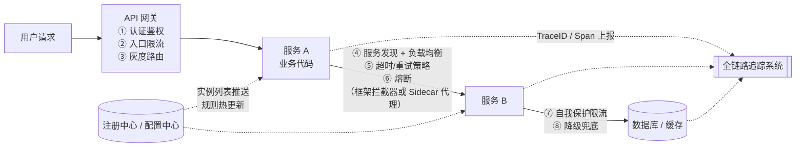
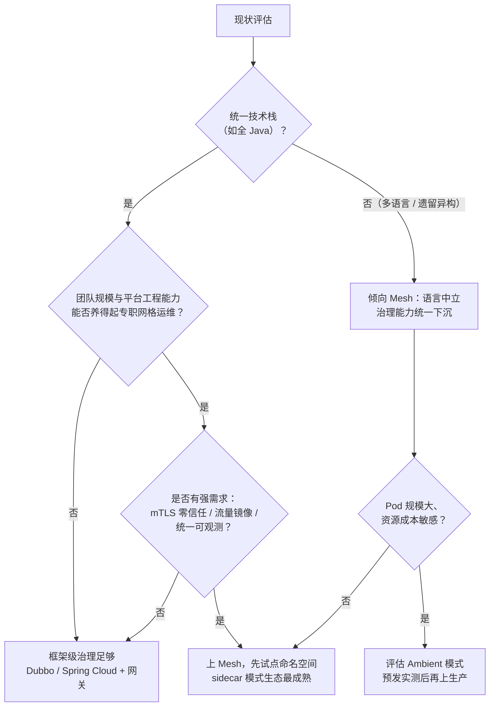

# 微服务治理

> 这篇写给两类人：正在把单体拆成微服务、发现"拆完之后管不住"的团队；以及被"要不要上服务网格"困扰、需要一条有边界的决策线的架构师。读完你应能回答三个问题：一次请求在链路沿途会经过哪些治理环节、每个环节该用框架还是平台能力去接、以及最常见的翻车姿势长什么样。

## 是什么：治理是微服务的"税"，也是它的"保险"

Martin Fowler 和 James Lewis 在 2014 年的定义文里把微服务概括为九个特征：按业务能力组件化、去中心化治理、去中心化数据、基础设施自动化、**为失败而设计**等（[原文](https://martinfowler.com/articles/microservices.html)）。我常把这段学术表述翻译给业务方听：微服务不是"把代码切成小块"，而是**把进程内的函数调用换成网络调用**——而网络，是不可靠的。

一旦跨过进程边界，你就获得了独立部署、按模块扩缩容、技术栈自由选择的好处；同时欠下一笔"分布式税"：网络延迟、数据一致性、故障定位、多实例运维。**微服务治理，就是把这笔税管好、把这份风险保住的整套机制**：服务发现、配置管理、限流熔断降级、负载均衡、全链路追踪，再加一个统一入口 API 网关。

*图源：Wikimedia Commons（[文件页](https://commons.wikimedia.org/wiki/File:Microservices_app_example_v0.4.png)）*

注意这张图里的双向箭头——每个箭头都是一次可能失败的网络调用。治理体系的设计目标，就是让这些箭头**看得见（追踪）、控得住（限流熔断）、改得动（配置与发布）**。

## 为什么重要：拆分的成本是真实的

我在方案评审里反对过度拆分的理由从来只有一句话：**一次函数调用变成一次 RPC，延迟涨三个数量级，故障模式从"要么对要么崩"变成"半死不活"**。没有治理体系的微服务，比单体更脆弱——单体一个 Bug 影响一个进程，无治理的微服务一个慢接口能拖垮整条调用链。

拆分的粒度怎么判断，我的经验边界是：

- **组织维度（康威定律）**：服务边界 ≈ 团队边界。一个服务两个团队改，等于没拆。
- **业务维度**：按高内聚的业务能力域切。"一个需求要同时改五个服务"是最灵敏的反向信号——出现这个信号，说明切面切在了业务关节上，应该合。
- **经验法则：宁可先粗后细**。粗了再拆是工程问题，细到合不动是组织问题。拆分成本（网络、一致性、排障）当天就会发生，收益却要规模或团队增长到某个阈值后才兑现——多数中小规模系统到不了那个阈值，这也是 Fowler 把微服务定位为"企业应用值得认真考虑、但需要配套强工程能力"风格的原因。

*图源：Wikimedia Commons（[文件页](https://commons.wikimedia.org/wiki/File:Scale_Cube.png)）*

Scale Cube 这个模型我喜欢用来校准预期：**微服务只是 Y 轴（按功能拆）**。如果系统的真实瓶颈是热点数据（Z 轴问题）或纯粹是算力（X 轴问题），拆微服务是开错药。

## 架构与原理：治理组件插在请求链路的哪些位置

先看一次典型请求的全链路，标出每个治理能力的插入点——**这张图也解释了为什么"治理"是一个体系而不是一个组件**：

读图要点，也是我判断一个团队治理成熟度的检查单：

1. **①–③ 在南北向**：API 网关管"外部流量怎么进来"——认证、全局限流、按权重/特征的灰度路由。**网关不是微服务间调用的治理点**，内部东西向调用绕过网关直连，这是最常见的定位误解。
2. **④–⑥ 在调用发起侧**：这一层"看不见的手"，要么在业务框架里（Dubbo/Spring Cloud 的拦截器链），要么下沉到 Sidecar 代理（Istio 类）。治理能力放哪，决定了改造成本和语言边界，下一节展开。
3. **⑦–⑧ 在被调服务侧**：**限流保护自己，熔断保护自己不被下游拖死，降级给调用方留体面**——三件事各管一头，别混成一个词。
4. **④⑥ 依赖注册中心，但注册中心推送有延迟**：实例下线到各消费方感知之间有一个"不一致窗口"，这个窗口就是很多"重启后短暂报错"的根源，靠健康检查（存活探针 + 框架心跳）和主动摘除机制压缩。
5. **追踪贯穿全程**：TraceID 必须在①到⑧的每一跳透传（HTTP header / RPC attachment），任何一跳丢了上下文，链路就断了。

### 治理五件套逐一说

**注册与发现**（Nacos/Consul/Eureka 类）：核心不是"有注册中心"，而是三件事——健康检查的判定速度（太快误杀、太慢摘除不及时）、推送的一致性（AP 模型允许短时不一致，要理解你的框架选了什么）、以及跨环境隔离（注册中心串了，测试流量打进生产）。我的底线是：注册中心本身多副本 + 客户端本地缓存兜底，注册中心抖动时不能影响存量调用。

**配置中心**（Nacos/Apollo/Spring Cloud Config 类）：价值是"配置与代码分离 + 热更新 + 变更审计"。坑在**改配置比发版还危险**——发版有流水线卡点，配置一键全量生效。生产配置必须配灰度（按实例/按环境分批推）和回滚，以及变更留痕。凡是"没审计就查不到谁改的"，都是配置事故。

**限流熔断降级**：Sentinel/Resilience4j 是 Java 生态的常见组合。经验上，入口 QPS 限流 + 下游超时熔断（失败率/慢调用比例触发，半开试探恢复）能覆盖八成故障场景。两个纪律：重试必须配退避和总超时预算，否则重试风暴比故障本身更致命；降级兜底（默认值、缓存旧数据、功能开关）要在设计期写，事故现场没有时间现编。

**负载均衡**：K8s Service 是 L4、连接级——长连接场景下流量会偏斜到固定实例；框架侧（Dubbo 负载均衡策略、Spring Cloud LoadBalancer）是客户端负载均衡，实例列表缓存在消费方本地。**新鲜度和调用延迟天然矛盾**，列表拉取周期内实例上下线感知会滞后，这正是 Sidecar 方案想接管的领域。

**全链路追踪**：Trace/Span 数据模型来自 Google 的 Dapper 论文（2010），它同时立下了追踪系统的设计标杆：**低开销、对应用透明、靠采样换规模**。没有 Trace 的微服务排障，等于盲飞——"用户说慢"和"哪个服务的哪一跳慢"之间隔着十个猜。

### Dubbo / Spring Cloud / Service Mesh：治理放在哪一层

| 路线 | 治理能力在哪 | 优势 | 代价 |
| --- | --- | --- | --- |
| Apache Dubbo | 框架拦截器（Java SDK 内） | RPC 性能强、接口级治理精细（超时/重试/路由/参数路由文档齐全） | 语言绑定重；升级治理=升级 SDK=业务发版 |
| Spring Cloud | 框架 starter（HTTP/REST 为主） | 生态广、上手快，配置/发现/熔断/网关成套 | 治理语义在应用进程内，跨语言弱；组件迭代快、选型要防弃用坑 |
| Service Mesh（Istio 类） | 独立代理进程，代码零侵入 | 语言中立、治理能力随平台统一升级 | 复杂度与延迟成本转移给平台团队；每应用多一个要运维的进程 |

Istio sidecar 模式的原理，官方架构图一句话说清：**数据面是一圈 Envoy 代理（每个 Pod 一个），所有进出流量被劫持经过它；控制面 istiod 负责发现、配置下发和证书**。Envoy 原生提供动态服务发现、负载均衡、TLS 终结、熔断、健康检查、按百分比流量切分的灰度、故障注入和指标采集——等于把 Spring Cloud/Dubbo 的治理能力搬进了一个 C++ 写的代理进程，好处正是图里标的那句：加治理能力不用改代码、不用重新架构。

*图源：Istio 官方文档（[架构页](https://istio.io/latest/docs/ops/deployment/architecture/)）*

但 sidecar 模式有两个一线绕不开的成本：**每个请求多两跳代理**（出去一跳、进来一跳，延迟在亚毫秒到毫秒量级，单跳不心疼，十跳链路就可观）；**每个 Pod 多一个常驻进程**（内存十到百 MB 量级，千级 Pod 集群里这就是真金白银，且排障时多一个"到底是业务挂了还是代理挂了"的分叉）。

Istio 官方给出的新答案就是 **Ambient 无侧车模式**：节点级 L4 代理 ztunnel（每个节点一个，管 mTLS 和 L4 路由）+ 命名空间级按需部署的 L7 代理 waypoint。官方文档把它的设计目标明确写成**渐进采纳**——从"没有网格"到"安全 L4 overlay"再到"按需 L7 策略"，逐命名空间演进。我的看法：方向是对的（把每 Pod 代理的固定成本换成每节点代理），但 L7 能力的精细度和生态成熟度仍在快速演化，生产采用前务必在预发环境按你们的流量模型实测。

### 微服务与 K8s 的关系：框架下沉与平台上浮的合流

一句话定位：**K8s Service/Ingress 解决"网络可达"（L4 转发 + 入口路由），治理框架解决"治理语义"（熔断、降级、参数路由、权重灰度）**。两条路线在中间相遇：

- **下沉派**：Mesh/云厂商把治理能力从 SDK 搬到基础设施（Istio、K8s Gateway API）；
- **上浮派**：K8s 暴露足够多的网络原语（Service、EndpointSlice、Gateway API），让框架和平台各管各层。

我给的实践顺序是：先让应用以无状态、可多实例的方式跑上 K8s（K8s 管调度与弹性），再视治理需求叠加框架或网格——两者混用时记住一件事：**同一个能力只在一层生效**（比如负载均衡，要么信 K8s Service，要么信客户端负载均衡，不要两层叠加后再互相看不懂流量为什么偏斜）。站内 [Kubernetes 核心机制](/cloud/native/kubernetes) 的网络与发布部分，和这篇是同一枚硬币的两面。

## 实践与选型

### 治理组件能力矩阵

| 治理能力 | Dubbo / Spring Cloud（框架侧） | Istio（网格侧） | K8s 原生 | 我的建议 |
| --- | --- | --- | --- | --- |
| 注册与发现 | Nacos/Consul/ZK（独立注册中心） | K8s Service 自动纳管（同集群免注册） | CoreDNS + EndpointSlice | 单集群优先用 K8s Service，跨集群/异构才付注册中心的钱 |
| 配置中心 | Nacos/Apollo | ConfigMap + 网格配置 API | ConfigMap/Secret（无热更语义） | 业务配置走配置中心 + 灰度推送，别塞环境变量 |
| 负载均衡 | 客户端 L7（接口/参数级） | Sidecar/Waypoint L7 | L4 连接级 | 长连接偏斜敏感的场景用 L7 侧 |
| 熔断限流降级 | Sentinel/Resilience4j | Envoy 异常点驱逐 + 速率限制（策略语义较粗） | 无（需 CRD/网关补） | 细粒度业务限流仍在应用层，平台层管基础设施级 |
| 全链路追踪 | SDK 埋点（Micrometer/OTel） | Sidecar 自动生成 Span | 需自己接 | 统一 OpenTelemetry 规范，别绑定单一厂商探针 |
| mTLS/零信任 | 框架改造或不做 | istiod 自动证书轮换 | 需 cert-manager 等 | 强合规场景是 Mesh 最硬的采纳理由 |
| 灰度发布 | 框架路由（需自己配套） | 按权重/按 Header 切流，开箱即用 | Ingress/Gateway API 基础权重 | 发布平台统一编排，流量切分能力交给一层 |

### 上网格的时机：一张决策图

写下来的判断是：**中小规模（几十到一两百个服务、栈统一）用框架级方案 + API 网关完全够**；Mesh 解决的是"多语言 + 强治理 + 大团队 + 平台化组织"四件事同时成立的问题——缺任何一件，你引入的不是能力，是运维负担。上 Mesh 后最大的隐性成本不在延迟，在于**故障排查链路多了一层基础设施**，团队要先建立"能看懂 istioctl、Envoy access log 和 Prometheus 指标"的能力，再谈全量。

### 粒度与拆分纪律

- 拆分以"业务能力域"为单位，以团队为校验：服务列表拉出来，如果映射不到团队，说明为拆而拆。
- 接口即合同：变更向后兼容是纪律（加字段可以、删字段/改语义要走版本）；调用方和被调方共库、共配置、共发布，都是分布式单体的前兆。
- 同步调用链长度设上限（多数场景我建议不超过 3–4 跳），更深的链改异步消息解耦。

## 常见坑

| 坑 | 现象 | 根因与对策 |
| --- | --- | --- |
| 分布式事务幻觉 | 跨服务"一把提交"，锁等待、超时、雪崩 | 网络两侧没有真 ACID。默认接受最终一致：本地事务 + 消息表/Saga/TCC（Dubbo 生态可用 Seata）；用对账兜底。把"跨服务 join"当架构坏味 |
| 级联失败 / 重试风暴 | 一个下游变慢，全链路超时雪崩，流量越重试越大 | 没配超时预算和熔断。总超时自上而下递减（网关 3s → 服务 A 2.5s → 服务 B 2s），重试只用于幂等接口且配退避；熔断按慢调用比例触发，半开试探恢复 |
| 追踪采样率失当 | 0% 等于裸奔；100% 存储爆炸还拖慢服务 | Dapper 给出的量级是默认 1/16 幂采样。实践组合：常态低采样 + 错误/慢请求强制采样（尾采样）+ 按接口调级别。采样率是存储成本和可诊断性的定价，别乱抄默认值 |
| 客户端负载均衡缓存陈旧 | 服务重启/发布后短暂大量报错 | 实例列表缓存在消费方，下线感知有窗口。压缩窗口：主动注销（优雅停机先摘流量再退进程）+ 健康检查 + 调用失败快速重试到其他实例 |
| 分布式单体 | 拆了 N 个服务，部署仍要一起发，故障仍互相传染 | 拆了服务没拆数据与依赖。每个服务独立数据库是底线（下图），跨库读取走接口或数据同步，不是直连别人的表 |
| 服务间共用数据库 | "微服务"架构，单库锁竞争反而更难排障 | 边界切错的最强信号。先把共享表按属主拆开，再谈别的 |

*图源：Wikimedia Commons（[文件页](https://commons.wikimedia.org/wiki/File:Microservice_Databases.png)）*

## 站内相关

- [Kubernetes 核心机制与企业级落地](/cloud/native/kubernetes)——网络可达与发布弹性的一半拼图
- [可观测性体系](/cloud/native/observability)——Trace/Metrics/Logs 三件套的落地细节
- [云原生导读](/cloud/native/)——本域全景

## 参考资料

访问日期均为 2026-09-02。

**文字来源**

- [Microservices（James Lewis & Martin Fowler, 2014-03-25）](https://martinfowler.com/articles/microservices.html)——微服务九特征、trade-offs 与"为失败而设计"的出处
- [Martin Fowler: Microservices Guide](https://martinfowler.com/microservices/)——定义综述页
- [Dapper: A Large-Scale Distributed Systems Tracing Infrastructure（Benjamin H. et al., Google, 2010）](https://research.google/pubs/pub36356/)——Trace/Span 模型、低开销透明埋点与幂次采样（默认 1/16）的原始出处；[论文 PDF](https://research.google.com/archive/papers/dapper-2010-1.pdf)
- [Istio 官方文档：Architecture（Sidecar 模式）](https://istio.io/latest/docs/ops/deployment/architecture/)——数据面 Envoy / 控制面 istiod 的职责划分与 Envoy 能力清单
- [Istio 官方文档：Ambient Mode Overview](https://istio.io/latest/docs/ambient/overview/)——节点级 ztunnel（L4）+ 命名空间级 waypoint（L7）与渐进采纳设计
- [Apache Dubbo 官方文档（中文概览）](https://dubbo.apache.org/zh/overview/)——Triple 协议、注册中心集成（Nacos/ZK/K8s）、Sentinel 限流降级、Seata 分布式事务、链路追踪集成
- [Spring Cloud 官方项目页](https://spring.io/projects/spring-cloud)——配置管理、服务发现、路由、负载均衡、熔断等能力清单
- [Envoy Proxy 官方文档](https://www.envoyproxy.io/docs/envoy/latest/intro/intro)——网格数据面的底层代理
- [CNCF Landscape](https://landscape.cncf.io/)——云原生生态组件目录（含 OpenTelemetry 追踪规范与各家实现）

**图片来源**

- 微服务应用示意图：Wikimedia Commons，[File:Microservices app example v0.4.png](https://commons.wikimedia.org/wiki/File:Microservices_app_example_v0.4.png)（CC BY-SA 4.0）
- Scale Cube 拆分维度图：Wikimedia Commons，[File:Scale Cube.png](https://commons.wikimedia.org/wiki/File:Scale_Cube.png)（CC BY-SA 4.0）
- Istio Sidecar 架构图：Istio 官方文档，[Architecture 页 arch.svg](https://istio.io/latest/docs/ops/deployment/architecture/)
- Database-per-service 示意图：Wikimedia Commons，[File:Microservice Databases.png](https://commons.wikimedia.org/wiki/File:Microservice_Databases.png)（CC BY-SA 4.0）
