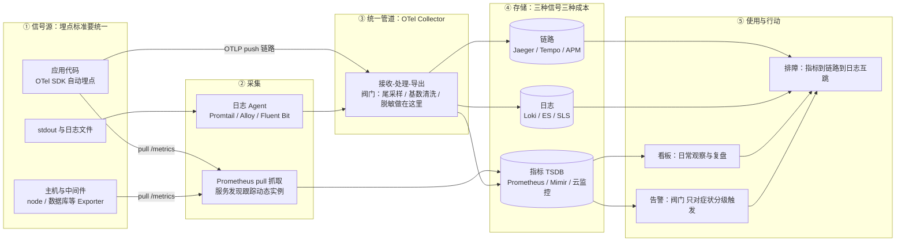
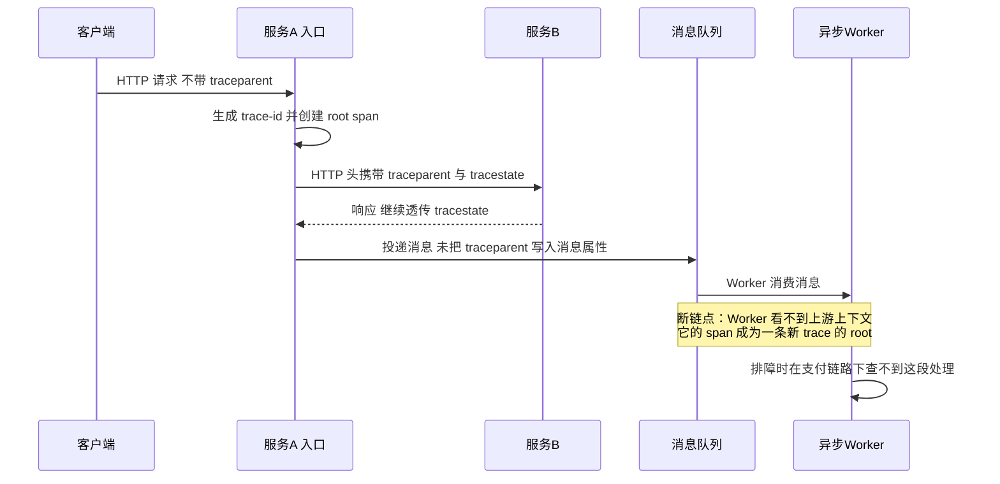
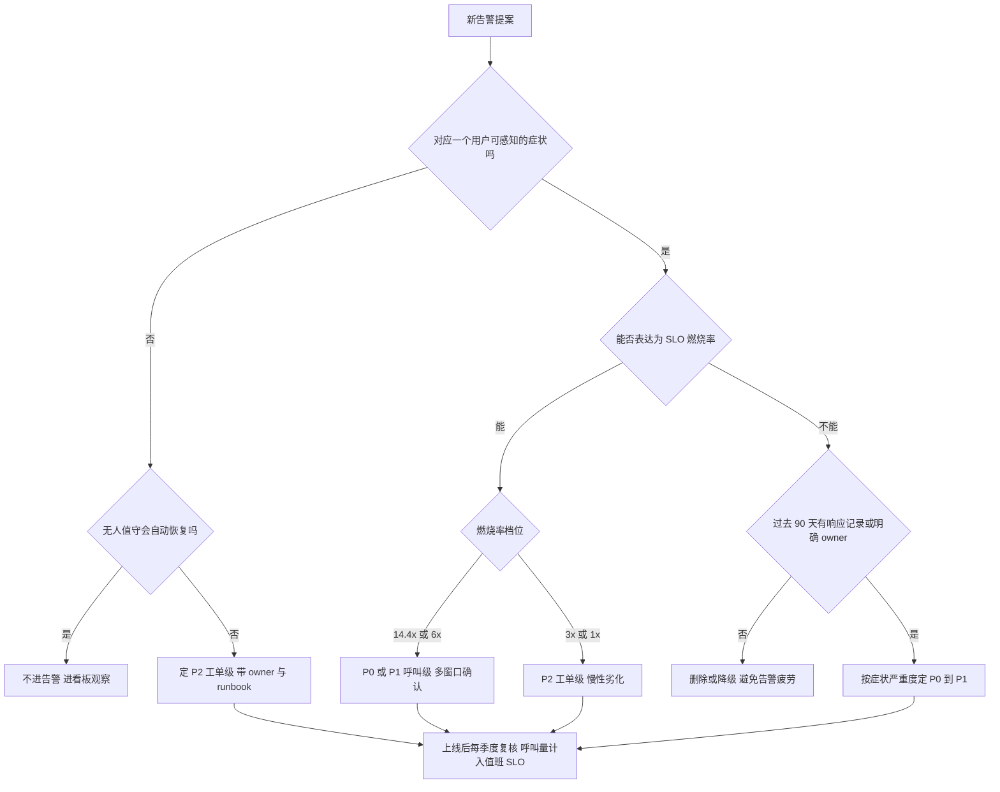
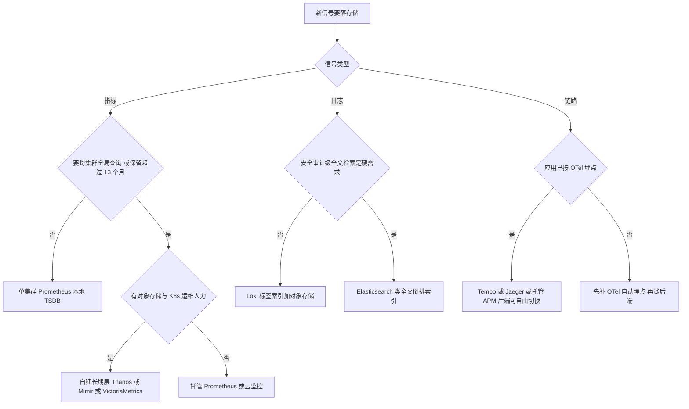

# 可观测体系

> 这篇写给已经在跑微服务和 K8s 负载、但排障方式还停留在"SSH 进容器 grep 日志"的同学，也写给要给别人做可观测方案评审的架构师。全文按一条主线展开：**三支柱各自的机制级原理（指标时序模型与基数、日志采集管线与索引成本、链路的上下文传播与采样）→ OpenTelemetry 为什么在 2025–26 成为事实标准并长出第四信号（Collector 管线、OTLP、eBPF 零侵入、持续剖析）→ Prometheus/Grafana 生态的存储与查询机制 → 方法论（SLI/SLO、燃烧率、RED/USE）→ 成本工程与告警治理**。读完你应该能回答：指标、日志、链路各自解什么问题、怎么通过统一标签与 TraceID 咬合；从采集到告警的全链路该在哪几层设阀门；为什么告警总是越配越多、越多越没人看；以及这套体系的钱（采集、存储、索引、查询、保留期）花在哪儿最值。

## 是什么：可观测不是"多装几个监控"

"可观测性（Observability）"这个词来自控制理论。Wikipedia 的定义是一句非常刻薄的话：**可观测性衡量的是一个系统的内部状态，能在多大程度上只靠外部输出被推断出来**（由 Rudolf Kálmán 在 1960 年代提出）。搬到软件工程语境里，它的意思是：不预先改代码、不发新版本，你也能回答关于系统内部**任何**你想问的问题。

和"监控"的区别，我的判断标准只有一条：

- **监控**回答你**已经知道**的问题——预置的大盘绿不绿、阈值红不红；
- **可观测**回答你**没预料到**的问题——"为什么只有这个国家用户的支付回调在变慢"这种上线前根本想不到的问题。

监控是状态，可观测是能力。能力建在三根支柱上（这是行业里 metrics/logs/traces"三支柱"说法的来源）：

| 支柱 | 回答的问题 | 数据形态 | 典型工具 |
| --- | --- | --- | --- |
| 指标 Metrics | 系统现在怎么样？（趋势 / 告警） | 时间序列：数值 + 标签维度，聚合友好 | Prometheus / 云监控（CloudMonitor、CloudWatch 类） |
| 日志 Logs | 刚才具体发生了什么？（细节取证） | 半结构化日志行，检索友好 | SLS / ELK / Loki |
| 链路 Tracing | 慢/错在哪一环？（跨服务定位） | TraceID 组织的 Span 树 | OpenTelemetry / Jaeger 类 |

三根支柱各看一角，**必须通过统一标签（服务名、实例、版本）加 TraceID 打通，否则就是三个孤岛**。打通后的标准排障动线是一条链：指标告警（确认"用户受伤了"）→ 看板下钻（受伤范围多大、哪个服务）→ 链路定位（哪一跳慢/错）→ 日志取证（这跳里具体哪条请求、什么异常）。反过来说，任何一环需要"人肉切系统、口头对齐服务名"，都说明体系没打通。

消费端的日常形态，就是一块块把症状和因果摊开的大盘：


*图源：Wikimedia Commons（[Grafana screenshot (2018)](https://commons.wikimedia.org/wiki/File:Grafana_screenshot_(2018).png)）*

2024 年之后行业里还有一个"第四支柱之争"：持续剖析（Continuous Profiling）要不要升格为与三支柱并列的信号。我的判断是**方向上会、节奏上慢**——OpenTelemetry 的 profiles 信号到 2026 年 3 月才进入 public alpha，距离"默认开启"还有距离，但 eBPF 让"零侵入拿到 CPU/内存火焰图"这件事第一次变得便宜，后文单独展开。

## 为什么重要：系统形态变了，排障方式必须跟着变

**实例不再固定。**K8s 上的 Pod 生命周期短到分钟级，IP 用完即弃，副本数随流量伸缩。"每台机器配个静态监控"在动态环境里根本追不上实例的变化速度——这就是 Prometheus 把**服务发现（Service Discovery）**做成一等公民的原因：抓取目标跟着 Kubernetes API、Consul、DNS 自动更新，而不是写死在配置文件里。

**调用链变长了。**单体时代一次请求只有一段逻辑；微服务化之后一次前端请求穿越十几个服务、三次数据库、两次消息队列。此时"平均耗时"彻底失去意义——少数慢请求会被海量快请求平均掉，只有 p95/p99 分位数和链路追踪能回答"慢在哪一环"。

**该看什么，Google SRE 给过一份极简答案。**SRE Book 第 6 章提出**四大黄金信号（Four Golden Signals）**："如果你的用户侧系统只能测四个指标，就测这四个"：

| 黄金信号 | 看什么 | 一线的坑 |
| --- | --- | --- |
| 延迟 Latency | 请求耗时 | 必须把**成功请求的延迟和失败请求的延迟分开**统计——失败往往返回得很快，会拉低平均值掩盖问题 |
| 流量 Traffic | 系统承受的需求（RPS、并发会话、带宽） | 选对你的服务有意义的需求单位，别照抄别人的 QPS |
| 错误 Errors | 失败率 | 除了显式失败（5xx），警惕**静默失败**：返回 200 但内容错了 |
| 饱和度 Saturation | 系统有多"满" | 盯剩余余量最小的那种资源；**延迟通常是饱和的前兆指标**，等饱和告警出来往往已经晚了 |

**这是一笔实打实的钱。**我自己的经验是（视日志量和采样率不同，量级差异很大）：很多公司云上最贵的"非业务"开销就是遥测数据本身。指标基数、日志保留期、链路采样率是三个预算阀门——这三处没做设计就上线可观测体系，等于开车不踩刹车。后面各节会分别展开。

**最后，它是稳定性运营的数据地基。**SLI/SLO/错误预算这套玩法（从"监控指标"到"服务承诺"的跃迁）——发布要不要刹车、这个月还剩多少故障容忍度——全都建立在可观测数据之上。数据不可信，承诺就是空话。2025–26 年它又多了一层身份：**Agent 的上下文**。LLM 排障助手、AIOps 根因分析吃的全是这三类信号，可观测数据的质量（结构化程度、命名一致性、互跳完整度）直接决定了 AI 排障的上限，这一点在 AIOps 一节展开。

## 架构与原理：从采集到行动的一条线

先看全链路。我把**决策阀门**标在图上——标注"阀门"处就是体系成败的所在：



### 指标：时序模型、四种类型与拉取模型

Prometheus 的数据模型是**时间序列 = 指标名 + 一组标签**。标签让指标成为多维数据库（按服务、版本、可用区任意切片），也让它危险——**每个标签值的组合就是一条独立时间序列**。基数（cardinality，即时间序列的总条数）的账很好算：一条带 k 个标签的指标，序列数约等于各标签取值数的乘积。举例：`http_requests_total` 带 endpoint（200 个取值）× status_code（5 个）× pod（300 个）就是 30 万条序列；按 15 秒抓取间隔，每条序列每天 5760 个样本，30 万序列就是每天约 17 亿个样本点——**这就是为什么基数是指标侧成本的核心**，也是 Prometheus 内存（head block 全量在内存）最先爆的地方。基数爆炸的伏笔埋在这里，治理见常见坑。

四种指标类型（Metric Types），选型一句话版：

| 类型 | 行为 | 典型用法 | 注意 |
| --- | --- | --- | --- |
| Counter 计数器 | 只增不减（进程重启归零） | 请求数、错误数、字节数 | 查询必配 `rate()` / `increase()`，不要直接看原始值 |
| Gauge 仪表 | 可增可减 | 内存占用、队列深度、在线人数 | 无状态窗口概念，适合瞬时值 |
| Histogram 直方图 | 按预设桶分布计数 + 总和 + 总数 | 请求延迟、响应大小 | **服务端计算分位数**（`histogram_quantile()`），可跨实例聚合，分布式场景首选；桶边界要提前设计 |
| Summary 摘要 | 客户端算好分位数再上报 | 单机精确分位 | **跨实例、跨标签不可聚合**，微服务场景慎用 |

拉取模型（Pull）是 Prometheus 和大多数监控系统的根本分歧点。Prometheus 定期到目标的 HTTP 端点（`/metrics`）抓取数据，好处很实际：**目标死活一目了然**（抓取失败即 `up{job}=0`，天然探测服务存活）；限流和采样频率由服务端集中控制，应用不用关心推给谁；与服务发现机制天然咬合。短生命周期任务（批处理、定时 Job）来不及被抓到，才用 Pushgateway 中转。经验值：多数业务的 `scrape_interval` 15~30 秒足够，只有对秒级抖动敏感的场景才值得降到 1~5 秒（代价是序列数翻几倍）；非核心指标拉到 60 秒，Grafana 官方博客给过节省成本最高约 75% 的量级（以他们的采样密度为前提）。


*图源：Prometheus 官方文档（[Overview](https://prometheus.io/docs/introduction/overview/)）*

### 指标存储内部：head block、WAL 与块压缩

理解 Prometheus 为什么"内存吃基数、磁盘吃保留期"，要看它的本地 TSDB 结构（官方 storage 文档）：

- **head block（内存）**：最近约 2 小时的活跃样本放在内存里（所有活跃序列的最近值与倒排索引都在内存），这是查询最新数据快、但基数一大内存就爆的根因；
- **WAL（write-ahead log）**：内存数据靠预写日志防崩溃，WAL 以 **128MB 分段**存于 `wal/` 目录，至少保留 3 个分段，高流量实例会保留更多以覆盖约 2 小时原始数据——WAL 存的是未压缩原始样本，比压缩后的块大得多；
- **持久化块（block）**：head 满 2 小时后落盘为一个不可变块，目录里是 `chunks/`（压缩后的样本）、`index/`（序列与标签的倒排索引）、`tombstones/`（删除标记）、`meta.json`；
- **压缩（compaction）**：后台把多个 2 小时块纵向合并成更大的块（官方 backfill 文档同样以"每块 2 小时、之后由服务器自行合并"描述），合并带来更好的压缩率与更少的索引碎片；
- **保留与降采样**：`--storage.tsdb.retention.time` 控制保留期；原生 Prometheus 不做长期降采样，这件事交给 Thanos/Mimir/VictoriaMetrics 这类长期存储层（见后文对比表）。

这个结构解释了三个一线现象：重启后回放 WAL 需要时间（大 WAL 意味着分钟级恢复）；删除高基数序列不会立刻释放内存（要等块压缩与过期）；单实例磁盘 IO 抖动多半发生在 compaction 窗口。

### PromQL 机制与常见误用

PromQL 的查询模型是"瞬时向量 / 区间向量 + 函数 + 聚合"：instant query 在一个时间点上对每条序列取值，range query 在时间窗内按步长重复取值；`rate()` 只在区间向量上有意义（它用首尾差除以时间，自动处理 Counter 重置）。一线最常见的误用，我按"错在哪、怎么改"列一张表：

| 误用 | 现象 | 正确姿势 |
| --- | --- | --- |
| 对 Counter 直接看原始值或做 `sum()` 后比较 | 曲线随重启归零、随副本数变化，告警误报 | 一律 `rate()` / `increase()` 后再聚合 |
| `avg(rate(x[5m]))` 先 rate 再跨序列平均 | 高流量实例与低流量实例被等权平均，掩盖热点 | 用 `sum(rate(...)) / sum(rate(...))` 做加权，或按实例分组看 |
| 对 Gauge 用 `rate()` | 语义错误，得到的是"变化速度"不是"值" | Gauge 直接取值，或用 `deriv()` 明确表达趋势 |
| `histogram_quantile` 用在桶太粗的 Histogram 上 | p99 长期停在某个桶边界，看起来"很稳定" | 桶边界按 SLO 阈值设计（如 100/250/500/1000ms 各设界），或上 native histograms |
| 聚合时漏写 `by` / `without` | 结果按全标签展开，查询本身制造基数 | 聚合显式声明保留维度；看板查询固定维度集 |
| 用 `irate` 做大时间窗看板 | 只取最后两个样本点，曲线毛刺剧烈 | 看板用 `rate`（窗口 ≥ 4 倍 scrape_interval），`irate` 只留给秒级排障 |

### 日志：采集管线、结构化、以及"要不要全文索引"

日志的链路是四段：**产生（应用写 stdout/文件，结构化字段在源头定）→ 采集（Agent tail 文件、解析、补标签、限速与脱敏）→ 传输（批量压缩、失败落盘缓冲）→ 存储与检索**。Agent 层（Promtail / Alloy / Fluent Bit 类）是第一个成本阀门：在这里丢弃 debug 级、截断超长字段、把手机号等敏感字段做掩码，比存进去再治理便宜一个量级。

**结构化日志（JSON）+ 统一采集是排障效率的分水岭**——这是提纲里我标得最重的一句话，至今认为没有之一。自由文本日志的解析靠运气，结构化字段的查询靠 SQL 直觉。字段集要和指标标签对齐：至少 service、instance、level、trace_id，否则后面互跳全断。

存储选型上有个关键分叉，就是"要不要给每行日志建全文索引"。Grafana Loki 的设计哲学直接写了在文档里：**不索引日志内容，只索引每条日志流的标签集合**——思路完全照搬 Prometheus，日志正文压缩成块（chunk）扔进对象存储（S3/OSS 类），查询时先按标签缩小范围、再暴力 grep。代价是全文检索体验弱；好处是同样的日志量，成本比全文倒排索引的 Elasticsearch 低一个量级（我的经验值：3~10 倍，取决于索引字段数和保留期，量级化估计）。我的判断：**排障九成的动作是"限定服务、限定时间窗、看这几十行"**，Loki 式的标签过滤完全够用；只有安全审计、业务分析这类真正需要任意关键词海捞的场景，才值得付 Elasticsearch 的索引钱。


*图源：Grafana Loki 官方文档（[Architecture](https://grafana.com/docs/loki/latest/get-started/architecture/)）*

Loki 的写入单元是 chunk：同一标签集合（同一条"流"）的日志行在 ingester 内存里压缩累积成一个 chunk，达到大小或时间上限后刷到对象存储，索引（标签 → chunk 列表）同样落在对象存储上的小型索引结构里。官方对成本的表述很直白：小索引 + 高压缩 chunk + 只用对象存储，是它比"索引每一行"的系统便宜的原因。理解 chunk 的内部格式（按流分组、按时间排序、压缩存储）有助于理解 LogQL 查询为什么"标签过滤快、全文 grep 慢"：


*图源：Grafana Loki 官方文档（[Architecture — chunks](https://grafana.com/docs/loki/latest/get-started/architecture/)）*

日志与 Trace 的关联（TraceID 贯穿）是基本要求：从链路的异常 Span 一键跳到那条请求的原始日志，是排障动作里最值钱的体验。实现上就是 Grafana 的 derived fields：在日志数据源里配置"trace_id 字段 → 跳转 Tempo/Jaeger 的链接"，反向在 trace 的 span 属性里带日志查询条件。

### 链路：Span 树、上下文传播与采样策略

链路追踪的学术与工程源头是 Google 的 Dapper 论文（2010）：一次请求被表示为一棵 **Span 树**，每个 Span 记录一次调用的起止时间、标签和父子关系，TraceID 全程唯一、SpanID 标识节点、ParentSpanID 连边。今天 OpenTelemetry 的数据模型就是 Dapper 模型的标准化版本。在 Jaeger 的界面上，这棵树以瀑布图呈现——缩进是父子关系，横条长度是耗时，一眼能看出"慢在哪一跳、是不是并行被串行化了"：


*图源：Jaeger 官方文档（[Frontend UI](https://www.jaegertracing.io/docs/2.10/frontend-ui/)）*

这里的技术命门不是采集而是**上下文传播（Context Propagation）**：每一次跨进程调用（HTTP、RPC、消息队列、甚至异步线程）都要把 TraceID 塞进载体带过去，漏一跳链路就断一截——**断链的排查成本远高于一开始用自动埋点**，这是 OTel 自动插桩（auto-instrumentation）最大的存在价值。

传播的载体在 2025–26 年已经有了跨厂商标准：**W3C Trace Context**。它定义了两个 HTTP 头：`traceparent` 用固定长度格式描述"当前请求在 trace 图里的位置"（版本号为 `00`，其后是 32 位十六进制的 trace-id、16 位十六进制的 parent-id、2 位十六进制的 flags，其中 flags 的最低位表示 sampled），`tracestate` 则携带厂商自定义的键值对供各 APM 透传私有信息。标准的关键约束是"哪怕只依赖私有字段，也必须正确转发 traceparent"——这正是网关、sidecar、消息中间件这些"非业务节点"不破坏链路的依据。传播机制用一张时序图看清楚，注意异步环节是最常见的断点：



采样（Sampling）是链路的成本命门，提纲原话是"全量存不起，全丢找不到"，展开成两种基本策略加一个组合：

| 策略 | 决策时机 | 优点 | 缺点 |
| --- | --- | --- | --- |
| 头部采样 Head-based | 请求进入服务时、Span 创建前 | 便宜、无额外管道成本 | **决策时不知道结局**——错误请求、慢请求可能恰好在被丢弃的那部分里；放大倍数的聚合统计也有偏差风险 |
| 尾部采样 Tail-based | Trace 完整到达 Collector 后 | **可以全量保留"所有错误、所有超阈值慢请求、白名单接口"**，只丢无聊的成功请求 | 所有 Span 必须先全量导出，网络与 Collector 缓冲成本上升；大规模环境下缓冲本身很贵 |
| 混合 | 低价值高流量走头部比例采样，关键入口走尾部 | 平衡 | 配置复杂度上升 |

OTel 的采样语义里还有两个容易忽略的细节：一是 **parent-based sampler**——子 span 默认跟随父 span 的 sampled 决定，避免一条 trace 被截成两半；二是采样决定会写进 `traceparent` 的 flags 位，下游与后端据此一致地留或丢。尾部采样的实现位置就是 Collector 的 `tail_sampling` processor：按 policy 组合（latency 阈值、status_code 错误、属性匹配、概率兜底）决定整条 trace 的去留。

一线建议：错误率告警永远靠指标（Counter + rate），链路只负责定位——这样尾部采样的保留策略就可以激进地偏向异常。头部采样率我见过的典型区间是 0.1%~10%，但脱离流量谈比例没有意义，以"链路后端月账单 + 错误请求可查率"两个数倒推。

链路后端的架构选型上，Jaeger 与 Tempo 代表两种哲学：Jaeger 是传统 APM 式组件（collector 接收、存储后端可选 Cassandra/Elasticsearch、query 服务出图），Tempo 则把"trace 也对象存储化"。看 Tempo 的官方架构图能理解它为什么便宜：


*图源：Grafana Tempo 官方文档（[Architecture](https://grafana.com/docs/tempo/latest/operations/architecture/)）*

Tempo 的设计要点（官方文档）：span 的属性与资源被排序进 **Apache Parquet 列式 schema** 后写入对象存储；微服务模式下用一条 Kafka 兼容队列做写前日志（WAL），队列 ack 即持久，因此写路径可以 replication factor = 1，不靠副本换可靠；读路径按列只读查询需要的属性列。写路径的一生——从 distributor 接收、ingester/live store 缓冲、block builder 落块、到 backend worker 做压缩合并——就是"trace 成本 ≈ 对象存储成本"这个等式的来源：


*图源：Grafana Tempo 官方文档（[Architecture — lifecycle of a write](https://grafana.com/docs/tempo/latest/operations/architecture/)）*


*图源：Jaeger 官方文档（[Architecture](https://www.jaegertracing.io/docs/2.10/architecture/)）*

### 第四支柱之争：持续剖析（Profiling）与 eBPF 零侵入

2024 年起，"三支柱够不够"的讨论有了实质进展：持续剖析（continuous profiling，以固定频率对全进程栈采样、长期留存火焰图，回答"CPU/内存/锁时间花在了哪段代码"）被推为第四信号。推动力来自两侧：Pyroscope、Parca 这类开源持续剖析项目把火焰图做成了可查询的时序数据；eBPF 让采集不再需要改代码或装 SDK。

到 2026 年 9 月，这个方向的标准状态是：**OpenTelemetry 的 profiles 信号处于 public alpha**（2026 年 3 月 26 日官宣，Profiling SIG 由 Google、Datadog、Elastic 等共同推进），数据格式兼容 pprof，并提供 conformance checker 校验导出是否符合规范；Elastic 把自家 eBPF profiling agent 捐赠给了 OTel，作为 **Collector 的 receiver** 发布在官方 collector distribution 里，在 Linux 上对主流语言运行时做低开销、零插桩的整系统剖析。我的判断：profiles 在 2026 年还属于"值得试点、不宜当承诺"的阶段（alpha 意味着格式仍可能变），但 eBPF 零侵入这条路已经越过了概念期——同一思路在指标与链路侧的对应物是 Grafana Beyla，它已捐赠给 CNCF OTel 项目、更名为 OpenTelemetry eBPF Instrumentation（OBI），不改一行业务代码就能产出 HTTP/gRPC 的 RED 指标与 span。eBPF 的边界也要说清：它看得到系统调用与网络层，看不到业务语义（订单号、租户 ID 这类仍要靠 SDK 埋点），所以是**补充而不是替代** OTel SDK。

### OpenTelemetry：合并背景、Collector 管线与 OTLP

OpenTelemetry（OTel）是 CNCF 项目，提供**一套 API/SDK/Collector 同时覆盖 traces、metrics、logs（以及 alpha 的 profiles）四信号**，用统一协议 OTLP 上报，后端无关。它的身世解释了为什么它能赢：OpenTracing（2016，规范派）与 OpenCensus（2018，Google/Microsoft 主导的库派）在 2019 年合并为 OTel，两套社区与厂商背书合流；2026 年 5 月 OTel 从 CNCF 毕业（graduated），与 Kubernetes、Prometheus 同级——CNCF 官方博客在 2026 年 8 月的复盘标题就是"OpenTelemetry has graduated… now what?"。


*图源：OpenTelemetry 官方文档（[Collector](https://opentelemetry.io/docs/collector/)）*

Collector 的角色是上图的第③层：**receiver → processor → exporter** 的管线，厂商中立的遥测管道。三段各自的工程含义：

- **receiver**：把各种输入翻译成 OTel 内部模型——OTLP（gRPC 4317 / HTTP 4318）、Prometheus 抓取、文件日志、主机指标，2026 年起还包括 eBPF profiling receiver；
- **processor**：管线里唯一"做手术"的地方——批处理（batch，攒批降网络开销）、属性处理（脱敏、删字段）、过滤、**尾采样（tail_sampling）**、基数清洗（丢弃高基数指标或重写标签）；
- **exporter**：OTLP 发往下一个 Collector 或后端，带重试与队列（发送失败时本地缓冲，是管道韧性的关键配置）。

部署形态两个典型：**agent 模式**（每个节点/Pod 一个，收本机日志与主机指标、给本地 SDK 做兜底接收）与 **gateway 模式**（每集群/每region 一组无状态实例，集中做尾采样、脱敏、路由）。我的经验是尾采样与脱敏必须放 gateway 层——agent 层看不到整条 trace，做不了"按结局丢弃"的决策。一段最小可用的 gateway 配置长这样：

```yaml
receivers:
  otlp:
    protocols:
      grpc: { endpoint: 0.0.0.0:4317 }
      http: { endpoint: 0.0.0.0:4318 }
processors:
  batch: {}
  attributes:
    actions:
      - key: customer.phone      # 脱敏：敏感字段直接删除
        action: DELETE
  tail_sampling:
    policies:
      - { name: keep-errors,  type: status_code, status_code: { status_codes: [ERROR] } }
      - { name: keep-slow,    type: latency,    latency:    { threshold_ms: 800 } }
      - { name: drop-rest,    type: probabilistic, probabilistic: { sampling_percentage: 5 } }
exporters:
  otlp/traces: { endpoint: tempo.internal:4317 }
service:
  pipelines:
    traces:
      receivers: [otlp]
      processors: [attributes, batch, tail_sampling]
      exporters: [otlp/traces]
```

**API/SDK 分离**是 OTel 另一个被低估的设计：应用代码只依赖 API（打 span、记 metric 的接口），具体怎么采样、怎么导出由 SDK 与运行时配置决定；语义约定（semantic conventions）统一了 `http.request.method`、`service.name` 这类命名。效果是"埋点一次、后端自由切换"：主流 APM 厂商与各家云监控全部支持 OTLP 接入，换后端不需要重新埋点。我的判断：新服务一律以 OTel 为埋点标准几乎没有反例；唯一可辩护的例外是团队被单一云的托管 APM 深度锁定且三五年内无迁移打算——即便如此，OTel 的语义约定统一命名，迟早也用得上。

**OTLP** 是这套体系的血管：protobuf 定义的 traces/metrics/logs/profiles 四类消息，走 gRPC 或 HTTP，天然批量、带压缩与重试语义。它取代了过去每家 APM 私有 agent 协议的位置，也是"托管与自建可以混用"的技术前提——同一条 OTLP 流可以同时 fan-out 到自建 Tempo 与云托管 APM。

截至 2026-09，四个信号的规范状态值得记在选型备忘录里（状态以 OTel 官方 status 页与 profiles alpha 公告为准）：

| 信号 | 规范状态（2026-09） | 工程含义 |
| --- | --- | --- |
| Traces | Stable | 数据模型与传播语义可作长期承诺 |
| Metrics | Stable | 含 native histograms 等仍在演进的数据类型，个别特性单独看状态 |
| Logs | Stable | 结构化日志模型与事件语义稳定 |
| Profiles | Alpha（2026-03 进入 public alpha） | 可试点、可换后端，但格式与 SDK 仍可能 breaking change |

应用侧接入的最小形态（Python 为例，trace 先行）：代码里只出现 API 语义（span 名字、属性），导出地址与采样率全部交给环境变量与 SDK 初始化，后端切换时业务代码零改动：

```python
# 依赖：opentelemetry-distro + opentelemetry-exporter-otlp
# 启动：opentelemetry-instrument python app.py   （自动插桩 HTTP/DB/MQ）
from opentelemetry import trace

tracer = trace.get_tracer("pay-callback")          # 名字与服务注册名一致

with tracer.start_as_current_span("charge") as span:
    span.set_attribute("pay.channel", "card")      # 有界取值，进属性
    span.set_attribute("pay.order_id", order_id)   # 无界值：只进 span 事件/日志
    result = charge(order)                          # 自动插桩覆盖下游 HTTP/SQL
    span.set_attribute("pay.result", result.code)
```

## 排障动线演练：从一条 P0 告警到根因

把前面的机制串成一次完整排障（场景取自典型电商形态，细节已泛化）。凌晨 2:14，值班收到 P0：支付回调服务的错误预算以 14.4 倍燃烧率消耗，5 分钟短窗口同时超限——多窗口条件满足，不是毛刺。

**第一步，确认症状与范围（指标）。**告警表达式本身就是 SLI：

```promql
# 长窗口：1h 燃烧率 > 14.4，且短窗口 5m 同时超限才 page
sum(rate(http_requests_total{job="pay-callback",code=~"5.."}[1h]))
  / sum(rate(http_requests_total{job="pay-callback"}[1h])) > (1 - 0.999) * 14.4
```

看板下钻用同口径按维度切片：`... by (code)` 确认是 502 而非 500（指向依赖而非自身逻辑），`... by (upstream)` 确认集中在某一个下游服务——范围从"支付挂了"收敛到"支付→风控这一跳挂了"。

**第二步，定位到哪一跳、哪种慢（链路）。**在 Tempo 用 TraceQL 拉异常样本：

```text
{ span.service.name = "pay-callback" && status = error } | select(span.name, duration)
```

抽十条 trace 看瀑布图，模式一致：`pay-callback → risk-engine` 的 client span 在 800ms 超时点被截断，而 `risk-engine` 自己的 server span 只花了 40ms——**耗时不在风控的计算里，在两者之间的连接建立/排队里**。这个判断只有 span 树能给：单看任何一侧的日志都会得出相反结论。

**第三步，取证（日志）。**从异常 span 拿 trace_id，一键跳 Loki（derived fields 配置好的收益在这里兑现）：

```text
{service="risk-engine"} | json | trace_id="4bf92f3577b34da6a3ce929d0e0e4736" | line_format "{{.msg}} {{.err}}"
```

日志显示大量 `connection pool exhausted, waiting for idle conn`——风控服务连接池上限在当晚一次扩容后没有跟着副本数调整，新副本把旧副本的池子挤爆。

**第四步，止血与回流。**回滚扩容配置（止血优先于定位的兑现：回滚后 6 分钟燃烧率回落到 1x 以下）；复盘回流三件事：连接池饱和度补一个 Gauge 与 P2 告警（USE 的 Saturation 补齐）、扩容 runbook 增加"连接池参数随副本数联动"检查项、把"client span 超时但 server span 快"这个模式写进排障手册（它指向网络/连接层而非业务层）。

整条动线里每一步的跳转都靠事先打好的地基：告警口径 = SLI = 看板口径 = 日志与链路的 service 标签。任何一个名字不一致，这次排障就要多花一小时在人肉对齐上。

## 方法论与告警工程

### 该看什么：黄金信号、RED 与 USE

黄金信号说了"用户侧看四个"，但日常指标集怎么系统性设计？两套互补的尺子：

| 方法 | 来源 | 视角 | 内容 |
| --- | --- | --- | --- |
| **RED** | Tom Wilkie（约 2015，面向微服务） | **服务**：调用方视角 | Rate 请求率、Errors 错误率、Duration 时延分布 |
| **USE** | Brendan Gregg（LISA'12，面向性能） | **资源**：基础设施视角 | Utilization 利用率、Saturation 饱和度、Errors 错误数 |

分工很清晰：**RED 管门面**（每个服务/接口三件套，适合做 SLO 与用户告警），**USE 管地基**（CPU、内存、磁盘 IO、连接池、线程池——每个资源查三样）。RED 缺的那一角（饱和度）恰好由 USE 的 Saturation 补上，这也是黄金信号第四项的实现方式。多数场景两者一起用：告警看 RED，容量和性能排查看 USE。

### SLI/SLO 与错误预算：把监控翻译成承诺

SLI 是"对一个服务质量的量化测量"（如"成功请求占比""p99 延迟小于 500ms 的请求占比"），SLO 是对 SLI 的目标值（如 30 天窗口内 99.9%），**错误预算 = 1 − SLO**，是团队"还可以犯多少错"的额度。这套机制的真正价值不在数字，而在把三类争论变成查表：发布要不要继续（预算烧完了就冻结非紧急发布）、故障要不要升级（预算消耗速度）、投入要不要做可靠性专项（预算长期花不完说明 SLO 定松了）。

燃烧率（burn rate）是把错误预算变成告警的桥梁："按当前错误速度，多久烧完全部预算"的倍数。SRE Workbook 的多窗口多燃烧率方案是行业事实标准：

| 燃烧率 | 长窗口 | 短窗口 | 动作 | 预算含义（以 99.9% / 30 天为例） |
| --- | --- | --- | --- | --- |
| 14.4x | 1h | 5m | 呼叫（page） | 1 小时烧掉约 2% 的月预算 |
| 6x | 6h | 30m | 呼叫（page） | 6 小时烧掉约 10% |
| 3x | 1d | 6h | 工单（ticket） | 一天烧掉约 10% |
| 1x | 3d | 1.5d | 工单（ticket） | 慢性劣化，排期处理 |

**这组数字以 99.9% 的 30 天 SLO 为前提，换了你的 SLO 数值必须重算**；短窗口与长窗口同时超限才触发，是杀掉毛刺误报的关键（单窗口方案要么漏报要么吵死）。SLI/SLO 的落地顺序我建议：先给 3~5 个核心用户旅程定 SLI（用 RED 的 Rate/Errors/Duration 直接导出），定 SLO，跑一个月观察真实分布，再决定燃烧率档位——**没有 SLI 数据就定 SLO，和拍脑袋没有区别**。

### 告警：分级、症状化、以及呼叫量治理

提纲里那句话我想原样保留并加粗：**告警疲劳是体系失败的第一信号**。一个天天刷屏的告警系统，等于没有告警系统——值班人会训练出"先睡、明早再看"的条件反射，然后错过真正的那一次。

我的分级基线（写进值班制度，不是写进告警工具的备注里）：

| 级别 | 通道 | 触发标准 | 响应预期 |
| --- | --- | --- | --- |
| P0 | 电话/值班呼叫 | 用户可感知的严重伤害（核心链路不可用、错误率超 SLO 快速燃烧） | 立即响应，数分钟无确认自动升级 |
| P1 | IM 群强提醒 | 有伤害但未致命，或高优先级服务的慢性劣化 | 当班处理，小时级 |
| P2 | 工单/日报 | 无用户伤害的技术信号（磁盘 80%、证书临期、单实例重启） | 排期处理 |

三条铁律，来自 SRE Book 与 SRE Workbook 的告警章节，也是我用过最不后悔的三条实践约束：

1. **只对症状告警，不对原因告警。**深夜叫人起床的理由只能是"用户受伤了"（错误率、延迟、可用性），原因类信号（磁盘满、Pod 重启数）降级为工单和看板——它们对定位有用，对叫醒无用（SRE Book 称之为 black-box 症状导向监控；Google Cloud 甚至专门写过一篇"Why Focus on Symptoms, Not Causes"）。
2. **用 SLO 燃烧率（burn rate）替代裸阈值，配合多窗口。**"错误率 > 0.1% 就告警"会淹没你；"按当前速度，1 小时烧掉 30 天错误预算的 2%（燃烧率 14.4 倍，同时 5 分钟短窗口也超）才呼叫"才是可执行的。
3. **呼叫量本身当作 SLO 管理。**SRE Workbook 的值班章节明确：当值班接收到的呼叫量超过约定阈值，应转为给技术负责人发工单——而不是让值班人硬扛。每条告警上线前先回答四问：用户侧有伤害吗？无人值守会自动恢复吗？有 owner 和 runbook 吗？过去 90 天响过吗？四问过不了，删掉或降级。

告警的"路由层"由 Alertmanager 承担，三个机制对应三种噪音：

- **分组（group_by）**：把同因的多条告警合成一个通知（如按 alertname + 集群分组），避免一个节点挂掉发来 40 条；
- **抑制（inhibit_rules）**：高严重度告警存在时，抑制被它解释的低严重度告警（如"实例 down"抑制该实例上的所有指标告警）；
- **静默（silence）**：带时间窗与匹配条件的主动屏蔽，配合变更窗口使用；加上 receiver 路由（按标签分发到不同通道/值班组），构成"告警风暴时仍然只响该响的那一声"。

一段对应上述三机制的最小配置（语义与 Grafana 统一告警/云告警中心同源）：

```yaml
route:
  receiver: default-im
  group_by: [alertname, cluster]        # 同因合并：一个节点挂掉只发一条
  group_wait: 30s
  group_interval: 5m
  repeat_interval: 4h
  routes:
    - matchers: [severity="page"]
      receiver: oncall-phone            # P0/P1 走呼叫
      repeat_interval: 1h
inhibit_rules:
  - source_matchers: [alertname="InstanceDown"]
    target_matchers: [alertname!="InstanceDown"]
    equal: [instance]                   # 实例挂了就不再刷该实例的指标告警
receivers:
  - name: oncall-phone
    webhook_configs: [ { url: "https://oncall.internal/api/v1/alert" } ]
  - name: default-im
    webhook_configs: [ { url: "https://im.internal/hooks/obs-p1" } ]
```

一条告警该不该存在、该定什么级别，我用下面这张决策图做上线前评审：



## 实践与选型

### 三信号对比速查表

| 维度 | 指标 Metrics | 日志 Logs | 链路 Traces |
| --- | --- | --- | --- |
| 回答的问题 | 现在怎么样（趋势/告警） | 刚才发生了什么（取证） | 慢/错在哪一环（定位） |
| 数据形态 | 时间序列（数值+标签） | 结构化日志行 | Span 树（TraceID） |
| 典型查询 | PromQL 聚合、rate、分位 | 标签过滤 + 关键词/字段检索 | 按服务、耗时、错误属性筛 Trace |
| 数据量级与成本 | 小（聚合后），**成本阀门 = 标签基数** | **最大**，阀门 = 保留期与是否全文索引 | 中，阀门 = 采样率 |
| 全量保留？ | 是（但基数要治理） | 否（分级存储/冷热分层） | **否，必须采样** |
| 与其他信号的咬合点 | 标签命名 = 服务注册名 | 字段带 trace_id 与 service | Span attributes 与日志字段语义对齐 |
| 典型误用 | 把日志查询当指标做告警 | 用日志数错误率（丢一条就漏一次） | 全量采集把账单打爆 |

### 存储后端决策：一张决策树

后端选型我习惯先问信号类型与两个约束（是否需要全文检索、是否需要跨集群长保留），再谈产品名：



### Prometheus 长期存储格局（截至 2026-09）

原生 Prometheus 是单实例、本地盘、短保留的设计；跨集群、长保留、全局查询这三件事由长期存储层解决。2026 年的格局（按我方案评审时的对比口径）：

| 方案 | 架构要点 | 写入路径 | 全局查询 | 降采样/ downsampling | 多租户 | 我的适用判断 |
| --- | --- | --- | --- | --- | --- | --- |
| Thanos | _sidecar 模式_：每个 Prometheus 挂 sidecar 把 2h 块上传对象存储；全局 query 组件 fan-out | Prometheus 本地存 + sidecar 上传 | Store Gateway 读对象存储 | 支持（5m/1h 多级） | 弱（靠部署隔离） | 已有 Prometheus 集群、想最小改动加长保留与全局视图 |
| Grafana Mimir | 写读分离的微服务架构；3.0 起首推 **ingest storage**（Kafka 作中心管道解耦读写），classic 模式用有状态 ingester + 本地 WAL | Prometheus remote write（Snappy 压缩 protobuf，带租户头） | Querier + Store Gateway | 支持（compactor 做） | 原生多租户 | 大规模、多团队共用一套指标平台，接受微服务运维复杂度 |
| VictoriaMetrics | 集群版 vminsert/vmselect/vmstorage 三组件；自有存储格式与压缩，内存效率高 | insert 节点分发，storage 节点落盘 | select 节点聚合 | 支持 downsampling 与 retention filters | 支持（头/标签两种多租户） | 追求单机效率与运维简单，指标量大的自建场景 |
| Cortex | Mimir 的前身（Grafana  fork 自 Cortex），社区版仍在但新项目少见 | 同 Mimir 早期 | 同 Mimir 早期 | 支持 | 原生 | 存量系统维护；新选型一般直接看 Mimir |
| 云托管 Prometheus/云监控 | 厂商全托管，按采样量/存储量计费 | remote write 或 Agent | 厂商控制台/API | 视厂商 | 账号级 | 不想养存储团队时的默认答案 |

配套组件图看 VictoriaMetrics 集群版最直观（三组件职责分离、vmselect 侧做去重与降采样）：


*图源：VictoriaMetrics 官方文档（[Cluster version — Architecture overview](https://docs.victoriametrics.com/cluster-victoriametrics/)）*

选型的经验法则（我方案评审的默认立场）：**先问"13 个月保留与全局查询是不是真需求"**——合规与年度对比是少数硬理由；不是的话，单集群 Prometheus + 对象存储备份就够了，别为架构而架构。真需要时，Thanos 适合"存量 Prometheus 不动"，Mimir 适合"平台化多租户"，VictoriaMetrics 适合"指标量特别大、运维人手少"，托管适合"没人想值存储的班"。

### 指标基数治理

基数是指标侧唯一会"悄悄吃掉预算"的变量。治理动作按性价比排序：

1. **命名与标签评审前置**：上线评审里加一条"新指标的标签取值是否有界"，无界值（user_id、request_id、原始 URL、错误全文）一律进日志不进指标；
2. **定期审计**：`count({__name__=~".+"})` 看总序列数，`topk(20, count by (__name__)({__name__=~".+"}))` 找大头，`count by (label_x) (...)` 看单标签基数；把序列数写进容量看板，突增即告警；
3. **管道侧清洗**：在 Collector 或 `metric_relabel_configs` 丢弃/重写高基数标签（注意：事后删标签可能让不同序列合并成一条，属于有损操作，只对"本来就不该存在"的标签做）；
4. **用 recording rules 固化常用聚合**：把看板与告警依赖的聚合预计算成低基数新序列，查询不再扫原始高基数序列；
5. **native histograms 替代细桶 classic histogram**：桶数自适应，避免"为精度加桶"造成的基数线性增长（2024 年后主流后端已陆续支持）。

### Grafana 生态：统一看板、统一告警与 IRM

Grafana 在 2025–26 年的角色已经从"画图的"变成"统一消费层"：一个 Grafana 实例同时挂 Prometheus/Mimir（指标）、Loki（日志）、Tempo（链路）、Pyroscope（剖析）数据源，面板之间用变量与 data link 互跳；**统一告警（unified alerting）**把告警规则从各数据源收拢到一处定义、一处路由，与 Alertmanager 语义对齐（分组/抑制/静默/路由都还在，只是配置入口统一）。对排障体验影响最大的两个细节：derived fields（日志行里的 trace_id 变成一键跳链路的链接）与 trace 面板里反查日志/指标的内嵌查询——"三个孤岛"变"一条动线"靠的就是这些缝。

值班与事件侧，开源世界的形态是 Grafana IRM 一族（OnCall 排班与升级、Incident 事件时间线、以及基于 ML 的告警聚类 Asserts 类能力）；云厂商侧则是云告警中心 + 事件管理服务的组合。工具只解决"通知到人"，**分级、升级路径、复盘回流必须由值班制度兜底**——这条我在任何方案里都不让步。

### 云厂商托管形态与自建决策

云上的可观测产品谱系（通用名 + 典型产品，机制以官方公开文档为准）：

| 形态 | 机制 | 典型产品 | 计费敏感点 |
| --- | --- | --- | --- |
| 云监控（基础设施指标） | 云产品自带指标采集 + 阈值告警，免接入 | 云监控 CloudMonitor、CloudWatch 类 | 一般含在产品价格内，自定义指标与高频 API 另计 |
| 托管 Prometheus | 兼容 PromQL 与 remote write/Agent 接入，托管 TSDB 与长期存储 | 托管 Prometheus 服务（ARMS Prometheus、Amazon Managed Prometheus 类） | 按采样量/存储量/查询量 |
| 托管日志服务 | 采集 Agent + 全文索引 + SQL 检索 + 投递 | 日志服务（SLS 类）、CloudWatch Logs 类 | 写入量 + 索引量 + 存储 + 扫描量 |
| 托管 APM/链路 | 探针或 OTLP 接入，调用链分析、依赖拓扑、profiling | ARMS、X-Ray、Cloud Trace 类 | 按 span 量/采样保留量 |
| 全栈可观测平台 | 上述四者统一数据模型与界面，含 AIOps 能力 | Datadog、Dynatrace、Grafana Cloud 类 | 按主机/自定义指标/日志摄入综合计费 |

开源自建 vs 托管的决策表（保留提纲观点并加厚）：

| 信号 | 开源自建典型栈 | 云托管典型 | 选型判断点 |
| --- | --- | --- | --- |
| 指标 | Prometheus + Grafana；长期存储 Thanos / Mimir / VictoriaMetrics | 云监控 / 托管 Prometheus（CloudWatch、ARMS Prometheus 类） | 单集群短保留自建很顺；**多集群、跨全局、13 个月以上保留**才值得上 Thanos/Mimir 或直接托管 |
| 日志 | Loki + Grafana（标签够用）；ELK（全文刚需） | 日志服务（SLS 类） | 自建 ES 的集群运维与索引成本要算人力账；托管日志服务通常是三件套里最省心的 |
| 链路 | Jaeger / Tempo（Tempo 存对象存储，成本低，与 Loki 同风格） | 托管 APM（ARMS、X-Ray 类） | 托管 APM 的自动埋点覆盖与调用链分析体验好，但注意专有 Agent 锁定；**用 OTel 埋点则两边都不怕** |
| 剖析 | Pyroscope / Parca / OTel eBPF profiler（alpha） | 托管 continuous profiling（部分厂商） | 2026 年仍属试点期，先拿 1~2 个核心服务验证价值 |
| 告警值班 | Alertmanager（分组/去重/静默/路由）+ 自建值班表 | 云告警中心 + 值班平台 | 工具只是路由，**告警分级与升级路径必须由值班制度兜底**，否则工具再强也无人认领 |

混用的成熟形态（提纲观点，我认为至今正确）：**核心指标托管化，业务指标自建**。云托管的好处不只是免运维——K8s、RDS、网关这些云产品的**现成大盘和开箱告警**是自建永远补不齐的集成深度；而业务指标（下单率、支付成功率、AI 推理 token 消耗）的语义只有你自己懂，放 Prometheus 里用 PromQL 自由生长更顺。链路和日志同理：接入层、云产品走托管观测，应用侧统一 OTel 埋点。

一个可复制的 K8s 监控大盘最小集（我新集群的标准起步配置）：

- **资源层（USE）**：集群/节点 CPU、内存、磁盘 IO、连接数（node_exporter + kube-state-metrics）；
- **控制面**：API Server、etcd、调度器的延迟与错误率——托管集群也要看，这是平台方的 SLA 边界所在；
- **服务层（RED）**：按工作负载维度的请求率/错误率/p99，入口从 Ingress/Gateway 指标统一导出；
- **Pod 生命周期事件**：OOMKill、CrashLoop、驱逐——放 P2 工单级，别放 P1。

OTel 落地路线（四步，按此顺序几乎不会返工）：① 统一服务命名与语义约定 → ② SDK/自动埋点接入（trace 先行，metrics 跟日志随后）→ ③ 上 Collector 统一管道（脱敏、路由、尾采样）→ ④ 后端按成本与体验逐步替换。第①步省掉的命名对齐工作，会在第④步以十倍的迁移成本还回来。

## AIOps 与 LLM 加持：2025–26 的真实成熟度

这一节我尽量把"演示效果"和"生产可用"分开说，按能力给成熟度判断（我的口径：成熟 = 可以写进运维流程并考核；半成熟 = 试点有价值、结论需人审；早期 = 只看演示）：

| 能力 | 机制 | 成熟度（我的判断） | 一线形态 |
| --- | --- | --- | --- |
| 告警降噪与事件聚合 | 相似性/拓扑聚类把同源告警合成一个事件 | 成熟 | Alertmanager 分组 + 平台侧 ML 聚类（Asserts、云厂商事件中心类） |
| 日志聚类与模板提取 | Drain 类算法把日志行归并成模板，异常模板突增即信号 | 成熟 | 日志平台的 pattern 分析；用于"没见过的错误模式"发现 |
| 异常检测（指标） | 季节性分解/预测带替代静态阈值 | 半成熟 | 慢变指标（容量、成本）好用；毛刺多的业务指标误报多 |
| LLM 辅助查询生成 | 自然语言 → PromQL/LogQL/TraceQL | 半成熟偏可用 | Grafana Assistant 类产品与各家 AI 助手；**生成后必须可校验**（给人看查询而非只看结论） |
| LLM 根因定位 | Agent 循环：读告警 → 拉指标/链路/日志 → 假设 → 验证 → 出报告 | 半成熟 | 微软等团队的 LLM Agent RCA 研究（如 arXiv:2403.04123 的 on-call agent 工作）证明可行，但生产里当"建议"而非"结论" |
| 观测数据作为 Agent 上下文 | 把指标/日志/链路暴露为工具（MCP/函数调用），Agent 在排障会话里按需取数 | 早期但方向明确 | 与智能体工程同源：上下文质量（命名一致、互跳完整）决定上限，见 [Agent 全景](/ai/agent/) |

三个敢下的判断：

1. **LLM 排障的上限不在模型，在数据接地。**同一个模型，接"三信号打通、命名统一、带 runbook"的体系和接"三个孤岛、服务名三套叫法"的体系，效果差一个代际。可观测体系的互跳质量第一次直接变成了 AI 能力的上限。
2. **"自然语言查指标"已经可以进日常，"自动根因结论"还不行。**前者错了人能立刻看出来（查询是可见的），后者错了人会信——在值班场景里，可信度比聪明重要。我的落地顺序是：先上查询生成与 trace/日志摘要（省时间、风险低），再试点 RCA 建议（必须附证据链），最后才谈自动处置。
3. **告警降噪是真金白银，根因定位是长期赌注。**降噪与聚类不依赖 LLM 也能做且收益确定；LLM RCA 的论文效果（包括 on-call 场景的 agent 化研究）到生产之间有"证据链可信、权限边界、误处置代价"三道坎，2026 年我看到的多数落地仍停在第一道。

## 成本工程（SA 视角）：账单结构与省账杠杆

可观测数据的账单可以拆成五项相乘：**采集量 ×（1 + 索引放大）× 存储单价 × 保留期 + 查询扫描量 × 查询单价 + 管道算力**。三信号的成本结构完全不同，所以阀门也不同：

| 信号 | 账单主项 | 量级经验（量级化，视业务差异大） | 首要阀门 |
| --- | --- | --- | --- |
| 指标 | 活跃序列数 × 采样频率 × 保留期 | 序列数随标签组合乘积增长；单集群从几十万到数千万序列都见过 | 标签基数 |
| 日志 | 写入字节 × 索引放大 × 保留期 | 全文倒排索引通常把存储放大到原始的 1.5~2 倍量级；日志量通常与被观测系统的请求量同数量级增长 | 保留期 + 是否全文索引 + 日志级别 |
| 链路 | span 数 × 保留期 | 全量 span 常是日志字节量的 1/3~1/2 量级，但单价更高 | 采样率（尾采样优先） |
| 剖析 | 采样频率 × 进程数 × 保留期 | eBPF 整系统剖析的开销通常个位数百分比 CPU，但数据量随进程数线性 | 采样频率与保留期 |

省账杠杆按"收益/风险"排序（我给别人做成本评审时的顺序）：

1. **日志分级保留**：热 7~15 天可查、温 30~90 天对象存储、冷归档按需解冻；错误与审计日志单独长保留；
2. **尾采样替代全量链路**：保留 100% 错误 + 100% 超阈值慢 + 5% 随机成功，通常能把链路账单砍到 1/5~1/10 而不损失排障能力；
3. **非核心指标降频**：60s 抓取 + recording rules 固化聚合，Grafana 官方博客给过最高约 75% 的量级；
4. **索引字段白名单**（ES 类）：只给会查的字段建索引，其余 `index: false`；
5. **长期层降采样**：Thanos/Mimir/VM 的 downsampling 让一年前的查询只扫 5m/1h 精度数据；
6. **Agent 侧丢弃**：debug 日志、健康检查访问日志（或采样保留）在采集端就不进管道。

一条总经验：**可观测数据量默认与被观测系统同数量级增长**——业务翻倍而阀门不动，账单就翻倍。所以预算评审要和容量评审同一个节奏做，每年至少一次"保留期与采样率复审"。

### 一笔量级示例账（ illustrative，非任何真实账单）

用一个中型集群的典型参数把上面的公式走一遍，目的是建立量级直觉（参数全部是公开常见量级，换成你的真实数字方法不变）：300 个 Pod、平均每 Pod 暴露 800 条序列（含 kubelet/cadvisor/应用指标）、15s 抓取；日志平均每 Pod 20MB/天；入口 800 RPS、平均每请求 6 个 span。

| 信号 | 全量口径的日增量 | 上了阀门之后 | 阀门 |
| --- | --- | --- | --- |
| 指标 | 24 万序列 × 5760 样本/天 ≈ 13.8 亿样本/天（压缩后约 GB 级/天） | 非核心降频 60s + recording rules，样本量降约一半以上 | 基数评审 + 降频 |
| 日志 | 约 6GB/天 原始；ES 全文索引放大 1.5~2 倍即 9~12GB/天 入库 | Loki 标签索引 + 压缩，入库约 0.6~1.2GB/天；或 ES 只索引白名单字段 | 索引策略 + 保留期分级 |
| 链路 | 800 RPS × 6 span × 86400 ≈ 4.1 亿 span/天（每 span 约 0.5~1KB，即 200~400GB/天） | 尾采样留全部错误+慢+5% 成功，通常降到 10~20GB/天 | 尾采样 |
| 剖析 | 300 Pod 全量 eBPF 剖析，个位数百分比 CPU 开销，数据量随 Pod 线性 | 先只开核心 20 个 Pod 试点 | 试点范围 |

这张表里最刺眼的是链路那一行：**全量链路一天的量可以和日志一个月相当**——这就是"链路必须采样"不是成本偏好而是物理约束的原因。第二个结论是索引策略对日志账单的影响（数倍）大于保留期（线性），所以日志成本评审先谈索引、再谈保留期。

## 常见坑

| 坑 | 现象 | 根因与对策 |
| --- | --- | --- |
| **标签基数爆炸** | Prometheus 内存暴涨反复 OOM、查询变慢、账单跳升；严重时整个监控失能 | 把 user_id、request_id、原始 URL、错误全文这类**无界值**写进了标签——每个唯一组合就是一条新时间序列。对策：只给"会用来过滤/聚合的维度"建标签；`count({__name__=~".+"})` 定期审计序列数与 topk 标签基数；在 Collector 管道或 `metric_relabel_configs` 里丢弃（注意：事后丢标签可能让序列意外合并，属于有损操作）；动态 ID 挪进日志，别进指标 |
| **全量 Trace 采集** | 链路后端存储与网络成本翻倍、Collector 成瓶颈，最终被迫一把关停——等于没有链路 | 链路天生是采样数据。头部比例采样 + 尾部"全留错误与超阈值慢请求"（见上文采样表）；错误率告警靠指标不靠链路 |
| **100% 头部采样的错觉** | "我们链路是全量的"——实际上是全量地贵，且错误请求并未被特别保留 | 头部采样在请求开始时就决定去留，与结局无关；要"错误必留"只能尾采样或指标兜底 |
| **日志当指标用** | 用日志计数做错误率告警：日志有延迟/丢弃就漏报，ES 账单还高；或者反过来把每行日志塞进指标 | 错误率、时延这类聚合语义应该做成指标（Counter/Histogram）出告警，日志只承担取证细节；两者各司其职，查询模式完全不同 |
| **告警风暴无抑制** | 一次网络抖动触发数百条告警，真 P0 淹没其中；值班直接静音整个通道 | 缺分组/抑制/静默三层设计：同因合并（group_by）、高层抑制低层（inhibit_rules）、变更窗口静默；再加"按症状不按原因"从源头减量 |
| **告警无人认领** | 群里几千条"告警"没人处理；真 P0 淹没在噪音里；值班形同抽奖 | 每条告警上线必须带 owner + 级别 + runbook；90 天未响应的自动审查删除/降级；呼叫量当 SLO 治理（见告警三铁律第 3 条） |
| 链路断链 | 跨服务 Trace 只有一半，网关后、消息队列后凭空消失 | 异步任务、消息中间件、自研代理漏了 context propagation（W3C traceparent 未写入消息属性/线程上下文）；用自动埋点库并**把"全链路能查到一条 Trace"写进上线验收** |
| 三信号互跳缺失 | 每套系统单独好用，排障靠人肉切页面 | 服务命名不统一、日志里没 trace_id——打通的工程量最小、回报最大，优先补 |
| PromQL 误用出假数据 | 看板"看起来正常"但口径错（先平均后求速率、对 Gauge 用 rate） | 见 PromQL 误用表；关键看板查询进代码评审，与业务代码同等待遇 |
| 日志全量进全文索引且无生命周期 | ES 集群磁盘与账单线性上涨，查询却只用最近三天 | 索引字段白名单 + ILM 冷热分层 + 分级保留；先问"这段日志 30 天后还有谁查" |
| 监控自己挂没人知道 | 出事故当天，恰好 Prometheus 也在重启 | "谁来监控监控系统"：抓取失败心跳、Agent 掉线、管道积压要各自有独立通道的告警；定期演练验证 |

## 从可观测到稳定性运营

可观测体系不是排障工具集，是稳定性运营的仪表盘。故障响应的四段节奏：

**发现 → 止血 → 定位 → 复盘。**两个我反复验证过的判断：

- **止血永远优先于定位。**能回滚就别排查——发布相关的故障，回滚 + 事后分析的组合几乎总优于在线排查；可观测体系对"止血"的贡献是快速回答"回滚后症状消失了吗"。
- **复盘的产出要回流体系**：每一次故障要么新增/修正一个指标或告警，要么删掉一条误导人的规则，要么补一段自动埋点——复盘不改监控，同样的故障还会来。

**演练与混沌工程**：可观测体系本身是"最没人测试的基础设施"——真出事时才发现告警路由是错的、日志三天前就没采了。所以注入故障（杀实例、打满线程池、拉高依赖延迟）要定期做，且**每次演练的第一验证对象不是业务韧性，而是告警链路端到端**：故障注入后几分钟内，正确的 P0 是否在正确的通道响起、值班是否在预期的 MTTR 内响应。没演练过的监控是"薛定谔的监控"（这也是提纲里"验证监控告警链路本身"的展开）。

配套的告警治理清单（周期性执行）：分级正确性抽查 → 去重与静默窗口 → owner 有效性（人还在不在、runbook 还能不能跑）→ 90 天未响应的告警与大盘归档 → 呼叫量与响应时长回顾。

## 实践观点

- **先统一埋点标准和命名，再谈选工具。**OTel + 服务注册名对齐是全链路的地基；地基不统一，metrics/logs/traces 配得再豪华也是三个孤岛。
- **成本是设计属性，不是运维问题。**基数、保留期、采样率三个阀门在建体系那天就要定，之后只做预算内的调整——"先存下来再说"的每一步，半年后都会变成必须删数据的账。
- **每条告警都要花得起一个"为什么"。**说不清"用户受了什么伤害、值班该做什么"的告警，就是在透支值班人的注意力——告警疲劳是体系失败的第一信号。
- **大盘与看板是手段，互跳与 runbook 才是目的。**衡量标准从来不是"配了多少监控"，而是 MTTR 和凌晨被错误叫醒的次数有没有下降。
- **把可观测数据当成 AI 时代的基础语料来治理。**2026 年之后，命名一致、互跳完整、带 runbook 的遥测数据同时是 LLM 排障助手的上下文；治理欠账会同时在人和 AI 两条线上收利息。
- **对"第四支柱"保持试点心态。**持续剖析与 eBPF 零侵入的价值真实（不改代码就能拿到火焰图与 RED 指标），但 profiles 信号 2026 年仍在 alpha，先拿核心服务验证，再谈全量。

## 参考资料

<Refs>

**原始论文与标准**

- [Dapper, a Large-Scale Distributed Systems Tracing Infrastructure（Google Research）](https://research.google/pubs/pub36356/) — Span 树/TraceID 数据模型的源头论文（访问日期 2026-09-05）
- [W3C Trace Context 规范](https://www.w3.org/TR/trace-context/) — traceparent/tracestate 头部格式与传播约束（访问日期 2026-09-05）
- [Exploring LLM-based Agents for Root Cause Analysis（arXiv:2403.04123）](https://arxiv.org/abs/2403.04123) — LLM Agent 做 on-call 根因分析的代表性工作（访问日期 2026-09-05）
- Wikipedia — [Observability](https://en.wikipedia.org/wiki/Observability)（可观测性与控制理论的定义，Kálmán）（访问日期 2026-09-05）

**方法论书籍与博客**

- Google SRE Book — [Chapter 6: Monitoring Distributed Systems](https://sre.google/sre-book/monitoring-distributed-systems/)（四大黄金信号、黑盒/白盒监控）（访问日期 2026-09-05）
- Google SRE Workbook — [Alerting on SLOs](https://sre.google/workbook/alerting-on-slos/)（多窗口燃烧率告警）、[Implementing SLOs](https://sre.google/workbook/implementing-slos/)（SLI/SLO 落地）、[What it Means Being On-Call](https://sre.google/workbook/on-call/)（呼叫量治理）（访问日期 2026-09-05）
- Brendan Gregg — [The USE Method](https://www.brendangregg.com/usemethod.html)（资源视角三件套）（访问日期 2026-09-05）
- Grafana 博客 — [The RED Method: How to Instrument Your Services](https://grafana.com/blog/the-red-method-how-to-instrument-your-services/)、[How to manage high cardinality metrics in Prometheus and Kubernetes](https://grafana.com/blog/how-to-manage-high-cardinality-metrics-in-prometheus-and-kubernetes/)（访问日期 2026-09-05）

**官方文档**

- Prometheus — [Overview](https://prometheus.io/docs/introduction/overview/)、[Metric Types](https://prometheus.io/docs/concepts/metric_types/)、[Storage（TSDB/WAL/块结构）](https://prometheus.io/docs/prometheus/latest/storage/)、[Histograms 最佳实践](https://prometheus.io/docs/practices/histograms/)、[PromQL basics](https://prometheus.io/docs/prometheus/latest/querying/basics/)、[Alertmanager](https://prometheus.io/docs/alerting/latest/alertmanager/)（分组/抑制/静默）（访问日期 2026-09-05）
- OpenTelemetry — [What is OpenTelemetry](https://opentelemetry.io/docs/what-is-opentelemetry/)、[Collector](https://opentelemetry.io/docs/collector/)、[Sampling](https://opentelemetry.io/docs/concepts/sampling/)、[Context Propagation](https://opentelemetry.io/docs/concepts/context-propagation/)、[OTLP 规范](https://opentelemetry.io/docs/specs/otel/protocol/)、博客 [Tail Sampling with OpenTelemetry](https://opentelemetry.io/blog/2022/tail-sampling/)（访问日期 2026-09-05）
- OpenTelemetry Profiles — [Profiles 信号概念](https://opentelemetry.io/docs/concepts/signals/profiles/) 与博客 [OpenTelemetry Profiles Enters Public Alpha（2026-03-26）](https://opentelemetry.io/blog/2026/profiles-alpha/)（eBPF profiling agent 作为 Collector receiver、pprof 兼容、conformance checker）（访问日期 2026-09-05）
- CNCF 博客 — [OpenTelemetry has graduated… now what?（2026-08-31）](https://www.cncf.io/blog/2026/08/31/opentelemetry-has-graduated-now-what-2/)（OTel 于 2026 年 5 月毕业）与 [How to turn slow queries into actionable reliability metrics with OpenTelemetry（2026-08-21）](https://www.cncf.io/blog/2026/08/21/how-to-turn-slow-queries-into-actionable-reliability-metrics-with-opentelemetry/)（访问日期 2026-09-05）
- Grafana Labs 文档 — [Loki Overview](https://grafana.com/docs/loki/latest/get-started/overview/)、[Loki Architecture](https://grafana.com/docs/loki/latest/get-started/architecture/)、[Tempo Architecture](https://grafana.com/docs/tempo/latest/operations/architecture/)、[Mimir Architecture](https://grafana.com/docs/mimir/latest/get-started/about-grafana-mimir-architecture/)（3.0 ingest storage 与 classic 两种形态）、[Grafana Alerting](https://grafana.com/docs/grafana/latest/alerting/)、[Grafana OnCall](https://grafana.com/docs/oncall/latest/)、[Grafana Assistant](https://grafana.com/docs/grafana-cloud/machine-learning/assistant/)（访问日期 2026-09-05）
- Jaeger 文档 — [Architecture](https://www.jaegertracing.io/docs/2.10/architecture/)、[Frontend UI](https://www.jaegertracing.io/docs/2.10/frontend-ui/)（访问日期 2026-09-05）
- Thanos — [Design](https://thanos.io/tip/thanos/design.md/)（sidecar/store gateway/compactor 全局查询架构）（访问日期 2026-09-05）
- VictoriaMetrics — [Cluster version: Architecture overview](https://docs.victoriametrics.com/cluster-victoriametrics/)（vminsert/vmselect/vmstorage、去重与降采样）（访问日期 2026-09-05）
- eBPF 零侵入 — [Grafana Beyla（已捐赠为 OTel eBPF Instrumentation / OBI）](https://github.com/grafana/beyla)、[open-telemetry/opentelemetry-ebpf-profiler](https://github.com/open-telemetry/opentelemetry-ebpf-profiler)、[Parca](https://github.com/parca-dev/parca)、[Grafana Pyroscope 文档](https://grafana.com/docs/pyroscope/latest/)（访问日期 2026-09-05）
- 日志聚类 — [logpai/Drain3](https://github.com/logpai/drain3)（日志模板提取/聚类的开源实现）（访问日期 2026-09-05）
- 云厂商托管形态（公开文档）— [AWS CloudWatch 概览](https://docs.aws.amazon.com/AmazonCloudWatch/latest/monitoring/WhatIsCloudWatch.html)、[阿里云 ARMS 产品文档](https://help.aliyun.com/zh/arms/)（访问日期 2026-09-05）

**图片来源**

- `grafana-dashboard-2018.png` → [Wikimedia Commons: Grafana screenshot (2018)](https://commons.wikimedia.org/wiki/File:Grafana_screenshot_(2018).png)
- `prometheus-architecture.svg` → [Prometheus 官方文档 Overview](https://prometheus.io/docs/introduction/overview/)
- `otel-collector.svg` → [OpenTelemetry 官方文档 Collector](https://opentelemetry.io/docs/collector/)
- `jaeger-trace-view.png` → [Jaeger 官方文档 Frontend UI](https://www.jaegertracing.io/docs/2.10/frontend-ui/)
- `jaeger-architecture.png` → [Jaeger 官方文档 Architecture](https://www.jaegertracing.io/docs/2.10/architecture/)
- `loki-architecture.svg`、`loki-chunk-format.png` → [Grafana Loki 官方文档 Architecture](https://grafana.com/docs/loki/latest/get-started/architecture/)
- `tempo-architecture.png`、`tempo-write-lifecycle.png` → [Grafana Tempo 官方文档 Architecture](https://grafana.com/docs/tempo/latest/operations/architecture/)
- `victoriametrics-cluster.webp` → [VictoriaMetrics 官方文档 Cluster version](https://docs.victoriametrics.com/cluster-victoriametrics/)

（以上图片与链接均于 2026-09-05 校验可访问）

站内相关：[Kubernetes 核心机制与企业级落地](/cloud/native/kubernetes) · [微服务治理](/cloud/native/microservice) · [智能体全景](/ai/agent/) · [云原生导读](/cloud/native/)

</Refs>
