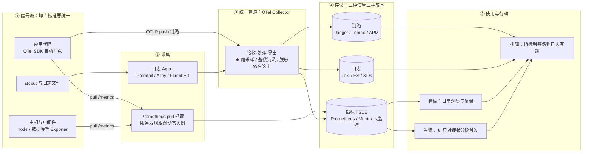

# 可观测体系

> 这篇写给已经在跑微服务和 K8s 负载、但排障方式还停留在"SSH 进容器 grep 日志"的同学。读完你应该能回答四个问题：**指标、日志、链路各自解什么问题、怎么通过统一标签咬合**；**从采集到告警的全链路该在哪几层设阀门**；**为什么告警总是越配越多、越多越没人看**；以及**这套体系的钱（存储与人力）花在哪儿最值**。

## 是什么：可观测不是"多装几个监控"

"可观测性（Observability）"这个词来自控制理论。Wikipedia 的定义是一句非常刻薄的话：**可观测性衡量的是一个系统的内部状态，能在多大程度上只靠外部输出被推断出来**（由 Rudolf Kálmán 在 1960 年代提出）。搬到软件工程语境里，它的意思是：不预先改代码、不发新版本，你也能回答关于系统内部**任何**你想问的问题。

和"监控"的区别，我的判断标准只有一条：

- **监控**回答你**已经知道**的问题——预置的大盘绿不绿、阈值红不红；
- **可观测**回答你**没预料到**的问题——"为什么只有这个国家用户的支付回调在变慢"这种上线前根本想不到的问题。

监控是状态，可观测是能力。能力建在三根支柱上（这是行业里 metrics/logs/traces"三支柱"说法的来源）：

| 支柱 | 回答的问题 | 数据形态 | 典型工具 |
| --- | --- | --- | --- |
| 指标 Metrics | 系统现在怎么样？（趋势 / 告警） | 时间序列：数值 + 标签维度，聚合友好 | Prometheus / 云监控（CloudMonitor、CloudWatch 类） |
| 日志 Logs | 刚才具体发生了什么？（细节取证） | 半结构化日志行，检索友好 | SLS / ELK / Loki |
| 链路 Tracing | 慢/错在哪一环？（跨服务定位） | TraceID 组织的 Span 树 | OpenTelemetry / Jaeger 类 |

三根支柱各看一角，**必须通过统一标签（服务名、实例、版本）加 TraceID 打通，否则就是三个孤岛**。打通后的标准排障动线是一条链：指标告警（确认"用户受伤了"）→ 看板下钻（受伤范围多大、哪个服务）→ 链路定位（哪一跳慢/错）→ 日志取证（这跳里具体哪条请求、什么异常）。反过来说，任何一环需要"人肉切系统、口头对齐服务名"，都说明体系没打通。

消费端的日常形态，就是一块块把症状和因果摊开的大盘：

*图源：Wikimedia Commons（[Grafana screenshot (2018)](https://commons.wikimedia.org/wiki/File:Grafana_screenshot_(2018).png)）*

## 为什么重要：系统形态变了，排障方式必须跟着变

**实例不再固定。**K8s 上的 Pod 生命周期短到分钟级，IP 用完即弃，副本数随流量伸缩。"每台机器配个静态监控"在动态环境里根本追不上实例的变化速度——这就是 Prometheus 把**服务发现（Service Discovery）**做成一等公民的原因：抓取目标跟着 Kubernetes API、Consul、DNS 自动更新，而不是写死在配置文件里。

**调用链变长了。**单体时代一次请求只有一段逻辑；微服务化之后一次前端请求穿越十几个服务、三次数据库、两次消息队列。此时"平均耗时"彻底失去意义——少数慢请求会被海量快请求平均掉，只有 p95/p99 分位数和链路追踪能回答"慢在哪一环"。

**该看什么，Google SRE 给过一份极简答案。**SRE Book 第 6 章提出**四大黄金信号（Four Golden Signals）**："如果你的用户侧系统只能测四个指标，就测这四个"：

| 黄金信号 | 看什么 | 一线的坑 |
| --- | --- | --- |
| 延迟 Latency | 请求耗时 | 必须把**成功请求的延迟和失败请求的延迟分开**统计——失败往往返回得很快，会拉低平均值掩盖问题 |
| 流量 Traffic | 系统承受的需求（RPS、并发会话、带宽） | 选对你的服务有意义的需求单位，别照抄别人的 QPS |
| 错误 Errors | 失败率 | 除了显式失败（5xx），警惕**静默失败**：返回 200 但内容错了 |
| 饱和度 Saturation | 系统有多"满" | 盯剩余余量最小的那种资源；**延迟通常是饱和的前兆指标**，等饱和告警出来往往已经晚了 |

**这是一笔实打实的钱。**我自己的经验是（视日志量和采样率不同，量级差异很大）：很多公司云上最贵的"非业务"开销就是遥测数据本身。指标基数、日志保留期、链路采样率是三个预算阀门——这三处没做设计就上线可观测体系，等于开车不踩刹车。后面各节会分别展开。

**最后，它是稳定性运营的数据地基。**SLI/SLO/错误预算这套玩法（从"监控指标"到"服务承诺"的跃迁）——发布要不要刹车、这个月还剩多少故障容忍度——全都建立在可观测数据之上。数据不可信，承诺就是空话。

## 架构与原理：从采集到行动的一条线

先看全链路。我把**决策点**标在图上——★ 号处就是体系成败的阀门所在：

### 指标：数据模型、四种类型与拉取模型

Prometheus 的数据模型是**时间序列 = 指标名 + 一组标签**。标签让指标成为多维数据库（按服务、版本、可用区任意切片），也让它危险——**每个标签值的组合就是一条独立时间序列**（基数爆炸的伏笔埋在这里，见常见坑）。

四种指标类型（Metric Types），选型一句话版：

| 类型 | 行为 | 典型用法 | 注意 |
| --- | --- | --- | --- |
| Counter 计数器 | 只增不减（进程重启归零） | 请求数、错误数、字节数 | 查询必配 `rate()` / `increase()`，不要直接看原始值 |
| Gauge 仪表 | 可增可减 | 内存占用、队列深度、在线人数 | 无状态窗口概念，适合瞬时值 |
| Histogram 直方图 | 按预设桶分布计数 + 总和 + 总数 | 请求延迟、响应大小 | **服务端计算分位数**（`histogram_quantile()`），可跨实例聚合，分布式场景首选；桶边界要提前设计 |
| Summary 摘要 | 客户端算好分位数再上报 | 单机精确分位 | **跨实例、跨标签不可聚合**，微服务场景慎用 |

拉取模型（Pull）是 Prometheus 和大多数监控系统的根本分歧点。Prometheus 定期到目标的 HTTP 端点（`/metrics`）抓取数据，好处很实际：**目标死活一目了然**（抓取失败即 `up{job}=0`，天然探测服务存活）；限流和采样频率由服务端集中控制，应用不用关心推给谁；与服务发现机制天然咬合。短生命周期任务（批处理、定时 Job）来不及被抓到，才用 Pushgateway 中转。经验值：多数业务的 `scrape_interval` 15~30 秒足够，只有对秒级抖动敏感的场景才值得降到 1~5 秒（代价是序列数翻几倍）；非核心指标拉到 60 秒，Grafana 官方博客给过节省成本最高约 75% 的量级（以他们的采样密度为前提）。

*图源：Prometheus 官方文档（[Overview](https://prometheus.io/docs/introduction/overview/)）*

### 日志：结构化、统一采集，以及"要不要全文索引"

**结构化日志（JSON）+ 统一采集是排障效率的分水岭**——这是提纲里我标得最重的一句话，至今认为没有之一。自由文本日志的解析靠运气，结构化字段的查询靠 SQL 直觉。字段集要和指标标签对齐：至少 service、instance、level、trace_id，否则后面互跳全断。

存储选型上有个关键分叉，就是"要不要给每行日志建全文索引"。Grafana Loki 的设计哲学直接写了在文档里：**不索引日志内容，只索引每条日志流的标签集合**——思路完全照搬 Prometheus，日志正文压缩成块扔进对象存储（S3/OSS 类），查询时先按标签缩小范围、再暴力 grep。代价是全文检索体验弱；好处是同样的日志量，成本比全文倒排索引的 Elasticsearch 低一个量级（我的经验值：3~10 倍，取决于索引字段数和保留期，量级化估计）。我的判断：**排障九成的动作是"限定服务、限定时间窗、看这几十行"**，Loki 式的标签过滤完全够用；只有安全审计、业务分析这类真正需要任意关键词海捞的场景，才值得付 Elasticsearch 的索引钱。

日志与 Trace 的关联（TraceID 贯穿）是基本要求：从链路的异常 Span 一键跳到那条请求的原始日志，是排障动作里最值钱的体验。

### 链路：TraceID、上下文传播与采样策略

一条 Trace 是由 Span 组成的树：每个 Span 记录一次调用的起止时间、标签和父子关系，TraceID 全程唯一。这里的技术命门不是采集而是**上下文传播（Context Propagation）**：每一次跨进程调用（HTTP、RPC、消息队列、甚至异步线程）都要把 TraceID 塞进载体带过去，漏一跳链路就断一截——**断链的排查成本远高于一开始用自动埋点**，这是 OTel 自动插桩（auto-instrumentation）最大的存在价值。

采样（Sampling）是链路的成本命门，提纲原话是"全量存不起，全丢找不到"，展开成两种基本策略加一个组合：

| 策略 | 决策时机 | 优点 | 缺点 |
| --- | --- | --- | --- |
| 头部采样 Head-based | 请求进入服务时、Span 创建前 | 便宜、无额外管道成本 | **决策时不知道结局**——错误请求、慢请求可能恰好在被丢弃的那部分里；放大倍数的聚合统计也有偏差风险 |
| 尾部采样 Tail-based | Trace 完整到达 Collector 后 | **可以全量保留"所有错误、所有超阈值慢请求、白名单接口"**，只丢无聊的成功请求 | 所有 Span 必须先全量导出，网络与 Collector 缓冲成本上升；大规模环境下缓冲本身很贵 |
| 混合 | 低价值高流量走头部比例采样，关键入口走尾部 | 平衡 | 配置复杂度上升 |

一线建议：错误率告警永远靠指标（Counter + rate），链路只负责定位——这样尾部采样的保留策略就可以激进地偏向异常。头部采样率我见过的典型区间是 0.1%~10%，但脱离流量谈比例没有意义，以"链路后端月账单 + 错误请求可查率"两个数倒推。

### OpenTelemetry：为什么它成了事实标准

OpenTelemetry（OTel）是 CNCF 项目，提供**一套 API/SDK/Collector 同时覆盖 traces、metrics、logs 三信号**，用统一协议 OTLP 上报，后端无关。Collector 的角色是上图的第③层：接收（receivers）→ 处理（processors：批处理、过滤、脱敏、尾部采样）→ 导出（exporters），厂商中立的遥测管道。

*图源：OpenTelemetry 官方文档（[Collector](https://opentelemetry.io/docs/collector/)）*

"成为标准"不是宣传话术，是过去几年的市场事实：主流 APM 厂商与各家云监控全部支持 OTLP 接入；CNCF 在 2025 年的官方博客标题就叫"OpenTelemetry 如何统一了跨云的可观测性"。埋点生态从"装哪家 APM 就用哪家的 Agent、换后端重新埋"转向"**一次埋点、后端自由切换**"。我的判断：新服务一律以 OTel 为埋点标准几乎没有反例；唯一可辩护的例外是团队被单一云的托管 APM 深度锁定且三五年内无迁移打算——即便如此，OTel 的语义约定（semantic conventions）统一命名，迟早也用得上。

## 方法论与告警工程

### 该看什么：黄金信号、RED 与 USE

黄金信号说了"用户侧看四个"，但日常指标集怎么系统性设计？两套互补的尺子：

| 方法 | 来源 | 视角 | 内容 |
| --- | --- | --- | --- |
| **RED** | Tom Wilkie（约 2015，面向微服务） | **服务**：调用方视角 | Rate 请求率、Errors 错误率、Duration 时延分布 |
| **USE** | Brendan Gregg（LISA'12，面向性能） | **资源**：基础设施视角 | Utilization 利用率、Saturation 饱和度、Errors 错误数 |

分工很清晰：**RED 管门面**（每个服务/接口三件套，适合做 SLO 与用户告警），**USE 管地基**（CPU、内存、磁盘 IO、连接池、线程池——每个资源查三样）。RED 缺的那一角（饱和度）恰好由 USE 的 Saturation 补上，这也是黄金信号第四项的实现方式。多数场景两者一起用：告警看 RED，容量和性能排查看 USE。

### 告警：分级、症状化、以及燃烧率

提纲里那句话我想原样保留并加粗：**告警疲劳是体系失败的第一信号**。一个天天刷屏的告警系统，等于没有告警系统——值班人会训练出"先睡、明早再看"的条件反射，然后错过真正的那一次。

我的分级基线（写进值班制度，不是写进告警工具的备注里）：

| 级别 | 通道 | 触发标准 | 响应预期 |
| --- | --- | --- | --- |
| P0 | 电话/值班呼叫 | 用户可感知的严重伤害（核心链路不可用、错误率超 SLO 快速燃烧） | 立即响应，数分钟无确认自动升级 |
| P1 | IM 群强提醒 | 有伤害但未致命，或高优先级服务的慢性劣化 | 当班处理，小时级 |
| P2 | 工单/日报 | 无用户伤害的技术信号（磁盘 80%、证书临期、单实例重启） | 排期处理 |

三条铁律，来自 SRE Book 与 SRE Workbook 的告警章节，也是我用过最不后悔的三条实践约束：

1. **只对症状告警，不对原因告警。**深夜叫人起床的理由只能是"用户受伤了"（错误率、延迟、可用性），原因类信号（磁盘满、Pod 重启数）降级为工单和看板——它们对定位有用，对叫醒无用（SRE Book 称之为 black-box 症状导向监控；Google Cloud 甚至专门写过一篇"Why Focus on Symptoms, Not Causes"）。
2. **用 SLO 燃烧率（burn rate）替代裸阈值，配合多窗口。**"错误率 > 0.1% 就告警"会淹没你；"按当前速度，1 小时烧掉 30 天错误预算的 2%（燃烧率 14.4 倍，同时 5 分钟短窗口也超）才呼叫"才是可执行的。SRE Workbook 给出的经典档位——14.4x/1h 与 6x/6h 呼叫、3x/1d 与 1x/3d 工单——**以 99.9% 的 30 天 SLO 为前提，换了你的 SLO 数值必须重算**；短窗口与长窗口同时超限才触发，是杀掉毛刺误报的关键。
3. **呼叫量本身当作 SLO 管理。**SRE Workbook 的值班章节明确：当值班接收到的呼叫量超过约定阈值，应转为给技术负责人发工单——而不是让值班人硬扛。每条告警上线前先回答四问：用户侧有伤害吗？无人值守会自动恢复吗？有 owner 和 runbook 吗？过去 90 天响过吗？四问过不了，删掉或降级。

SLI/SLO 的跃迁（从"监控指标"到"服务承诺"）落地顺序我建议：先给 3~5 个核心用户旅程定 SLI（用 RED 的 Rate/Errors/Duration 直接导出），定 SLO，跑一个月观察，再决定燃烧率档位——**没有 SLI 数据就定 SLO，和拍脑袋没有区别**。

## 实践与选型

### 三信号对比速查表

| 维度 | 指标 Metrics | 日志 Logs | 链路 Traces |
| --- | --- | --- | --- |
| 回答的问题 | 现在怎么样（趋势/告警） | 刚才发生了什么（取证） | 慢/错在哪一环（定位） |
| 数据形态 | 时间序列（数值+标签） | 结构化日志行 | Span 树（TraceID） |
| 典型查询 | PromQL 聚合、rate、分位 | 标签过滤 + 关键词/字段检索 | 按服务、耗时、错误属性筛 Trace |
| 数据量级与成本 | 小（聚合后），**成本阀门 = 标签基数** | **最大**，阀门 = 保留期与是否全文索引 | 中，阀门 = 采样率 |
| 全量保留？ | 是（但基数要治理） | 否（分级存储/冷热分层） | **否，必须采样** |
| 与其他信号的咬合点 | 标签命名 = 服务注册名 | 字段带 trace_id 与 service | Span attributes 与日志字段语义对齐 |
| 典型误用 | 把日志查询当指标做告警 | 用日志数错误率（丢一条就漏一次） | 全量采集把账单打爆 |

### 开源栈 vs 云托管

| 信号 | 开源自建典型栈 | 云托管典型 | 选型判断点 |
| --- | --- | --- | --- |
| 指标 | Prometheus + Grafana；长期存储 Thanos / Mimir / VictoriaMetrics | 云监控 / 托管 Prometheus（CloudWatch、ARMS Prometheus 类） | 单集群短保留自建很顺；**多集群、跨全局、13 个月以上保留**才值得上 Thanos/Mimir 或直接托管 |
| 日志 | Loki + Grafana（标签够用）；ELK（全文刚需） | 日志服务（SLS 类） | 自建 ES 的集群运维与索引成本要算人力账；托管日志服务通常是三件套里最省心的 |
| 链路 | Jaeger / Tempo（Tempo 存对象存储，成本低，与 Loki 同风格） | 托管 APM（ARMS、X-Ray 类） | 托管 APM 的自动埋点覆盖与调用链分析体验好，但注意专有 Agent 锁定；**用 OTel 埋点则两边都不怕** |
| 告警值班 | Alertmanager（分组/去重/静默/路由）+ 自建值班表 | 云告警中心 + 值班平台 | 工具只是路由，**告警分级与升级路径必须由值班制度兜底**，否则工具再强也无人认领 |

混用的成熟形态（提纲观点，我认为至今正确）：**核心指标托管化，业务指标自建**。云托管的好处不只是免运维——K8s、RDS、网关这些云产品的**现成大盘和开箱告警**是自建永远补不齐的集成深度；而业务指标（下单率、支付成功率、AI 推理 token 消耗）的语义只有你自己懂，放 Prometheus 里用 PromQL 自由生长更顺。链路和日志同理：接入层、云产品走托管观测，应用侧统一 OTel 埋点。

一个可复制的 K8s 监控大盘最小集（我新集群的标准起步配置）：

- **资源层（USE）**：集群/节点 CPU、内存、磁盘 IO、连接数（node_exporter + kube-state-metrics）；
- **控制面**：API Server、etcd、调度器的延迟与错误率——托管集群也要看，这是平台方的 SLA 边界所在；
- **服务层（RED）**：按工作负载维度的请求率/错误率/p99，入口从 Ingress/Gateway 指标统一导出；
- **Pod 生命周期事件**：OOMKill、CrashLoop、驱逐——放 P2 工单级，别放 P1。

OTel 落地路线（四步，按此顺序几乎不会返工）：① 统一服务命名与语义约定 → ② SDK/自动埋点接入（trace 先行，metrics 跟日志随后）→ ③ 上 Collector 统一管道（脱敏、路由、尾采样）→ ④ 后端按成本与体验逐步替换。第①步省掉的命名对齐工作，会在第④步以十倍的迁移成本还回来。

## 常见坑

| 坑 | 现象 | 根因与对策 |
| --- | --- | --- |
| **标签基数爆炸** | Prometheus 内存暴涨反复 OOM、查询变慢、账单跳升；严重时整个监控失能 | 把 user_id、request_id、原始 URL、错误全文这类**无界值**写进了标签——每个唯一组合就是一条新时间序列。对策：只给"会用来过滤/聚合的维度"建标签；`count({__name__=~".+"})` 定期审计序列数与 topk 标签基数；在 Collector 管道或 `metric_relabel_configs` 里丢弃（注意：事后丢标签可能让序列意外合并，属于有损操作）；动态 ID 挪进日志，别进指标 |
| **全量 Trace 采集** | 链路后端存储与网络成本翻倍、Collector 成瓶颈，最终被迫一把关停——等于没有链路 | 链路天生是采样数据。头部比例采样 + 尾部"全留错误与超阈值慢请求"（见上文采样表）；错误率告警靠指标不靠链路 |
| **日志当指标用** | 用日志计数做错误率告警：日志有延迟/丢弃就漏报，ES 账单还高；或者反过来把每行日志塞进指标 | 错误率、时延这类聚合语义应该做成指标（Counter/Histogram）出告警，日志只承担取证细节；两者各司其职，查询模式完全不同 |
| **告警无人认领** | 群里几千条"告警"没人处理；真 P0 淹没在噪音里；值班形同抽奖 | 每条告警上线必须带 owner + 级别 + runbook；90 天未响应的自动审查删除/降级；呼叫量当 SLO 治理（见告警三铁律第 3 条） |
| 链路断链 | 跨服务 Trace 只有一半，网关后、消息队列后凭空消失 | 异步任务、消息中间件、自研代理漏了 context propagation；用自动埋点库并**把"全链路能查到一条 Trace"写进上线验收** |
| 三信号互跳缺失 | 每套系统单独好用，排障靠人肉切页面 | 服务命名不统一、日志里没 trace_id——打通的工程量最小、回报最大，优先补 |
| 监控自己挂没人知道 | 出事故当天，恰好 Prometheus 也在重启 | "谁来监控监控系统"：抓取失败心跳、Agent 掉线、管道积压要各自有独立通道的告警；定期演练验证 |

## 从可观测到稳定性运营

可观测体系不是排障工具集，是稳定性运营的仪表盘。故障响应的四段节奏：

**发现 → 止血 → 定位 → 复盘。**两个我反复验证过的判断：

- **止血永远优先于定位。**能回滚就别排查——发布相关的故障，回滚 + 事后分析的组合几乎总优于在线排查；可观测体系对"止血"的贡献是快速回答"回滚后症状消失了吗"。
- **复盘的产出要回流体系**：每一次故障要么新增/修正一个指标或告警，要么删掉一条误导人的规则，要么补一段自动埋点——复盘不改监控，同样的故障还会来。

**演练与混沌工程**：可观测体系本身是"最没人测试的基础设施"——真出事时才发现告警路由是错的、日志三天前就没采了。所以注入故障（杀实例、打满线程池、拉高依赖延迟）要定期做，且**每次演练的第一验证对象不是业务韧性，而是告警链路端到端**：故障注入后几分钟内，正确的 P0 是否在正确的通道响起、值班是否在预期的 MTTR 内响应。没演练过的监控是"薛定谔的监控"（这也是提纲里"验证监控告警链路本身"的展开）。

配套的告警治理清单（周期性执行）：分级正确性抽查 → 去重与静默窗口 → owner 有效性（人还在不在、runbook 还能不能跑）→ 90 天未响应的告警与大盘归档 → 呼叫量与响应时长回顾。

## 实践观点

- **先统一埋点标准和命名，再谈选工具。**OTel + 服务注册名对齐是全链路的地基；地基不统一，metrics/logs/traces 配得再豪华也是三个孤岛。
- **成本是设计属性，不是运维问题。**基数、保留期、采样率三个阀门在建体系那天就要定，之后只做预算内的调整——"先存下来再说"的每一步，半年后都会变成必须删数据的账。
- **每条告警都要花得起一个"为什么"。**说不清"用户受了什么伤害、值班该做什么"的告警，就是在透支值班人的注意力——告警疲劳是体系失败的第一信号。
- **大盘与看板是手段，互跳与 runbook 才是目的。**衡量标准从来不是"配了多少监控"，而是 MTTR 和凌晨被错误叫醒的次数有没有下降。

## 参考资料

（以下均于 2026-09-02 访问）

- Wikipedia — [Observability](https://en.wikipedia.org/wiki/Observability)（可观测性与控制理论的定义）
- Google SRE Book — [Chapter 6: Monitoring Distributed Systems](https://sre.google/sre-book/monitoring-distributed-systems/)（四大黄金信号、黑盒/白盒监控）
- Google SRE Workbook — [Alerting on SLOs](https://sre.google/workbook/alerting-on-slos/)（多窗口燃烧率告警）与 [What it Means Being On-Call](https://sre.google/workbook/on-call/)（呼叫量治理）
- Prometheus 官方文档 — [Overview](https://prometheus.io/docs/introduction/overview/)（架构与拉取模型）、[Metric Types](https://prometheus.io/docs/concepts/metric_types/)、[Configuration](https://prometheus.io/docs/prometheus/latest/configuration/configuration/)（服务发现与 scrape 配置）
- OpenTelemetry 官方文档 — [What is OpenTelemetry](https://opentelemetry.io/docs/what-is-opentelemetry/)、[Collector](https://opentelemetry.io/docs/collector/)、[Sampling](https://opentelemetry.io/docs/concepts/sampling/)、博客 [Tail Sampling with OpenTelemetry](https://opentelemetry.io/blog/2022/tail-sampling/)
- Grafana — 博客 [The RED Method: How to Instrument Your Services](https://grafana.com/blog/the-red-method-how-to-instrument-your-services/)、[How to manage high cardinality metrics in Prometheus and Kubernetes](https://grafana.com/blog/how-to-manage-high-cardinality-metrics-in-prometheus-and-kubernetes/)；文档 [Loki Overview](https://grafana.com/docs/loki/latest/get-started/overview/)（标签索引、不索引正文）
- Brendan Gregg — [The USE Method](https://www.brendangregg.com/usemethod.html)
- CNCF Blog — [From chaos to clarity: how OpenTelemetry unified observability across clouds](https://www.cncf.io/blog/2025-11-27/from-chaos-to-clarity-how-opentelemetry-unified-observability-across-clouds/)

**图片来源**

- [Wikimedia Commons: Grafana screenshot (2018)](https://commons.wikimedia.org/wiki/File:Grafana_screenshot_(2018).png)（访问 2026-09-02）
- [Prometheus 官方文档: Overview（architecture.svg）](https://prometheus.io/docs/introduction/overview/)（访问 2026-09-02）
- [OpenTelemetry 官方文档: Collector（otel-collector.svg）](https://opentelemetry.io/docs/collector/)（访问 2026-09-02）

## 站内相关

- [Kubernetes 核心机制与企业级落地](/cloud/native/kubernetes)——可观测是 K8s 落地清单的第一公民
- [微服务治理](/cloud/native/microservice)——链路追踪与三信号打通是微服务复杂度的直接答案
- [云原生导读](/cloud/native/)
