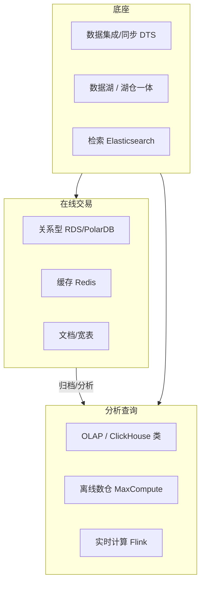

# 03 · 数据库 · 大数据

> 数据层是系统架构里"最难替换"的一层。计算可以重买，网络可以重拉，数据库选错一次要还很多年。这一域的核心是选型框架：业务特征 → 数据模型 → 一致性要求 → 成本与运维复杂度。

## 这个域回答什么问题

- 关系型、KV、文档、列存、时序、图数据库的边界与选型依据？
- 什么时候用云数据库（RDS/PolarDB），什么时候自建？
- 离线数仓、实时计算、数据湖如何组合成一套数据平台？

## 知识框架

## 文章列表

| 文章 | 状态 | 说明 |
| --- | --- | --- |
| [数据库选型](/data/database) | 🚧 提纲 | 选型框架、读写分离、分库分表与云原生数据库 |
| [大数据体系](/data/bigdata) | 🚧 提纲 | 离线/实时/湖仓一体的典型架构与取舍 |

## 一句话入门

数据库选型的本质是**为数据访问模式选最优的数据结构 + 一致性级别 + 运维形态**——先问访问模式，再谈产品。
