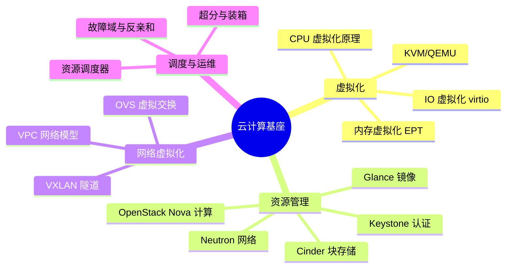

# 01 · 云计算基座

> 理解云从哪里来。在公有云产品（ECS、VPC、SLB……）成为"水电煤"之前，先有一代工程师在 OpenStack 与虚拟化层之上手工搭建"私有云"。理解基座，才能理解今天所有云产品底层的设计取舍。

## 这个域回答什么问题

- 一台物理机如何变成可以弹性供给的"计算资源池"？
- 虚拟机的网络、存储、镜像在云内部如何流转？
- 公有云 IaaS 产品与 OpenStack 这类开源基座的异同与演进关系？

## 知识框架

## 文章列表

| 文章 | 状态 | 说明 |
| --- | --- | --- |
| [OpenStack 架构与十年演进](/foundation/openstack) | ✅ 已发布 | 种子文：组件全景、数据流与基座的兴衰思考 |
| [虚拟化与 KVM](/foundation/virtualization) | 🚧 提纲 | KVM/QEMU、virtio、性能开销 |
| [SDN / NFV](/foundation/sdn-nfv) | 🚧 提纲 | 控制面/数据面分离、云网络实现 |

## 一句话入门

云计算的本质是**把硬件抽象成资源池，再用 API 把资源变成服务**。基座层决定了上层所有云产品的能力边界与成本结构。
