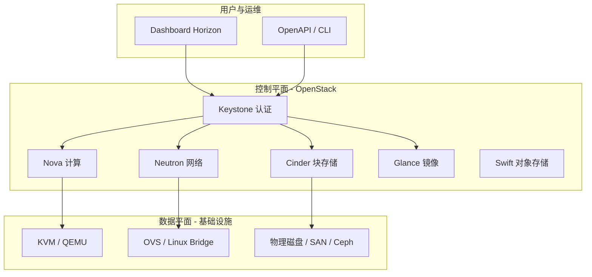
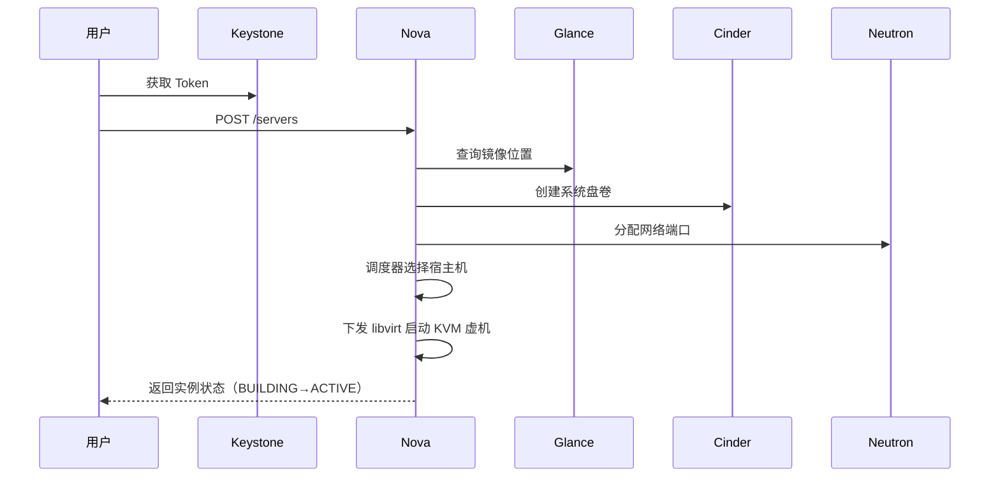

# OpenStack 架构与十年演进

> 在公有云成为"水电煤"之前，OpenStack 是一代工程师搭建私有云的事实标准。理解它，不只是理解一个开源项目，而是理解"云"这个抽象是如何被一层层构建出来的——今天公有云产品里的很多设计，都能在 OpenStack 里找到原型或反面教材。

## OpenStack 是什么

一句话：**OpenStack 是一组用 Python 编写的控制平面服务，把机房里的计算、存储、网络硬件抽象成可以通过 API 供给的资源池**。

它不是操作系统，不是 Hypervisor，也不是虚拟化软件。KVM 负责真正运行虚拟机，OpenStack 负责回答："这台物理机上还能不能再塞一台 4C8G 的虚拟机？塞在哪台最合适？网络怎么通？镜像从哪来？"

理解了这一点，就理解了它在技术栈中的位置：

::: tip 关键认知
OpenStack 的每个组件本质上都是一个"带状态机的 API 服务 + 消息队列驱动的异步执行器"。创建一台虚拟机的请求，会在 Nova、Neutron、Cinder、Glance 之间通过消息总线接力——这也是它所有复杂性与故障模式的根源。
:::

## 核心组件全景

| 组件 | 职责 | 一句话理解 |
| --- | --- | --- |
| **Keystone** | 认证与授权 | 所有服务的入口守卫，管 token 和 endpoint |
| **Nova** | 计算资源编排 | 虚拟机生命周期管理，但不含虚拟化本身 |
| **Glance** | 镜像服务 | 系统镜像的仓库与分发 |
| **Cinder** | 块存储 | 把存储后端抽象成"云盘"，挂给虚拟机 |
| **Neutron** | 网络即服务 | 虚拟网络、子网、路由、安全组、浮动 IP |
| **Swift** | 对象存储 | 海量非结构化数据，架构上是独立的分布式系统 |
| **Heat** | 编排 | 用模板声明式地拉起整套资源（IaC 的先声） |

一个典型的"创建虚拟机"调用链，能看清组件间如何协作：

## 两个值得深究的设计

### 调度器：资源编排的核心难题

Nova Scheduler 要回答"新虚拟机放哪台宿主机"。流程是**过滤（Filter）+ 加权（Weigher）**：

- 过滤器：剩余资源够不够、反亲和约束、可用区约束、镜像本地缓存……
- 加权器：在候选集里打分——打散更均匀，还是装箱更紧凑？

这里藏着云计算最经典的取舍：**装箱（bin-packing）提高利用率但放大故障半径，打散（spread）提高可用性但降低密度**。公有云的调度系统至今仍在解同一道题，只是规模大了三个数量级、解法从静态权重进化到了预测与机器学习。

### Neutron 的 ML2 插件体系

Neutron 把网络拆成**核心模型（网络/子网/端口）**和**机制驱动（Mechanism Driver）**：上层统一 API，下层由插件决定真实实现（OVS、Linux Bridge、硬件 SDN……）。

这个"模型与实现分离"的设计非常超前——今天公有云的 VPC 产品，本质上是同一思想的工业化版本：控制面统一定义网络模型，数据面由自研转发引擎（甚至智能网卡）实现。

## 十年兴衰：基座为什么会"退场"

我入行的头几年，OpenStack 就是"云"的代名词。但回头看，私有云基座的退潮几乎是必然的：

### 成本账算不过来

- **运维成本**：一支能维护 OpenStack 的团队，人力成本远超中小企业的整个 IT 预算。升级一次大版本，往往需要数月的兼容性验证。
- **资源利用率**：小规模集群里，管理组件自身就要吃掉相当比例的资源；规模效应出不来，单位成本永远打不过公有云。
- **迭代速度**：公有云以周为单位发布新产品；私有云的 OpenStack 集群，三年不动是常态。

### 真正的转折：云原生

容器与 Kubernetes 改变了应用与基础设施的关系。应用不再关心"我在哪台虚拟机上"，只关心"有没有 API 可以调"。**基础设施的消费方式从"管资源"变成了"用服务"**——而这恰恰需要巨大的规模来摊薄服务化的成本，公有云的护城河因此越挖越深。

### 留给行业的东西

OpenStack 没有消失，而是完成了历史使命后的"退隐"：

1. 它培养了中国第一代云计算工程师——今天公有云厂商的核心团队里，有大量 OpenStack 出身的工程师；
2. 它的 API 语义（实例、卷、网络、镜像）成了行业通用语言；
3. 它的教训同样宝贵：控制面的复杂度管理、大规模状态机的工程化、升级兼容性——这些坑，后来的云厂商都绕着走或填得更平。

## 实践观点

- **什么时候还会遇到 OpenStack**：电信云（NFV 场景）、部分政企私有云、科研机构。接手这类环境的同学，重点看 Neutron 的网络实现和 Cinder 的后端对接，这两处是故障高发区。
- **学它的正确姿势**：不要学部署（部署细节已成历史），要学抽象——"如何把硬件变成 API"这个问题，OpenStack 给出的答案依然是最完整的公开教材。
- **与今天公有云的对照**：ECS ≈ Nova + 更强的调度；云盘 ≈ Cinder 的工业化；VPC ≈ Neutron 模型的规模化实现。对照着看，能同时理解两边的设计取舍。

## 参考资料

- [OpenStack 官方架构文档](https://docs.openstack.org/)
- [OpenStack 项目历史与治理结构](https://www.openstack.org/)
- 站内相关：[虚拟化与 KVM](/foundation/virtualization) · [SDN / NFV](/foundation/sdn-nfv) · [上云迁移方法论](/methodology/cloud-migration)
