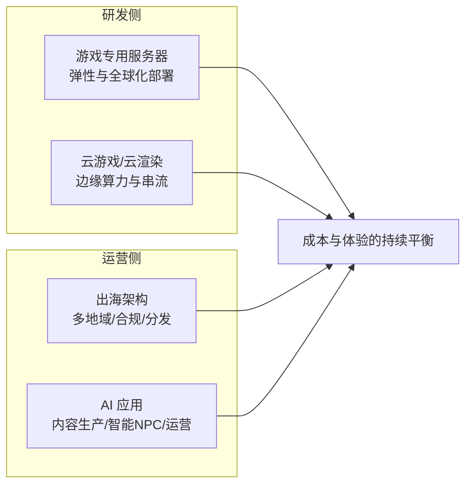

# 行业场景：游戏行业

> 技术知识在行业场景里落地才产生价值。这是"行业场景"系列的第一篇，选择游戏行业开篇——它是云计算与大模型应用中需求最密集、技术栈最完整的行业之一：既有对延迟与并发的极限要求，又是最早一批规模化使用 GPU 与生成式 AI 的领域。

## 游戏行业的四个云命题

### 1. 游戏专用服务器（Game Server）

- 会话制游戏（对战/房间制）的服务器生命周期与玩家会话强绑定，需要**按会话弹性供给与快速调度**
- Agones 是 K8s 上的游戏服务器编排事实标准：把"服务器分配-会话保持-优雅回收"变成声明式能力
- 引擎侧（UE5 等）对算力性价比敏感：ARM 实例（Graviton 类）在 Dedicated Server 场景已有成熟实践

### 2. 云游戏与云渲染

- 技术本质：**渲染在云端，交互在端侧**，串流链路对延迟与丢包的预算极紧
- 关键组件：边缘节点布局、音视频编码（低延迟档位）、实例复用与调度
- 与元宇宙时代的云渲染同源——参见 [编年史 · 元宇宙时代](/chronicle/metaverse)

### 3. 出海架构

- 全球同服/分区运营的取舍、多地域数据合规、CDN 与加速网络的分发效率
- 成本核算是出海方案的核心战场：多云比价、流量模型测算、预留与弹性的组合

### 4. 游戏行业的大模型应用

- 内容生产：美术资产、语音、剧情文本的生成与审核管线
- 智能 NPC 与陪伴：对话模型的延迟与成本约束最严（实时交互场景）
- 运营与评测：玩家行为分析、内容安全、AI 功能的灰测评估体系

## 精选资源

> 更新于 2026-09-02，全部链接已验证可达（知乎链接对爬虫返回 403，浏览器打开正常）。

- [Agones — Game server orchestration on Kubernetes](https://agones.dev/) — K8s 游戏专用服务器编排的事实标准（持续更新 · 开源项目）
- [使用 Graviton 4 构建 UE5 Dedicated Server 获得极致性价比](https://aws.amazon.com/cn/blogs/china/using-graviton-4-to-build-ue5-dedicated-server-for-the-ultimate-cost-effectiveness/) — ARM 实例在游戏服务器场景的成本实践（2024 · 官方文档）
- [带你了解云游戏实现关键技术](https://zhuanlan.zhihu.com/p/635921020) — 云游戏串流与渲染链路的技术入门（2024 · 工程博客）
- [案例分享：使用 Agones 在 TKE 上部署游戏专用服务器](https://cloud.tencent.com/developer/article/2495758) — Agones 的国内云落地实践（2025 · 工程博客）
- [游戏陀螺](https://www.youxituoluo.com/) — 游戏产业动态与创业案例跟踪（持续更新 · 行业媒体）
- [怎么做行业研究？基本框架、所需能力和常用工具](https://zhuanlan.zhihu.com/p/69800472) — 行研方法论经典（2018 · 工程博客）

## 计划扩充

- [ ] 游戏专用服务器的弹性调度设计（Agones 深度 + 队列模型）
- [ ] 出海架构的成本测算框架（方法复用 [GPU 选型与推理成本测算](/ai/infra/inference/gpu-sizing) 的测算链）
- [ ] 游戏行业大模型应用的质量-延迟-成本三角
- [ ] 跨境电商等其他行业场景（书签行研库待整理）
