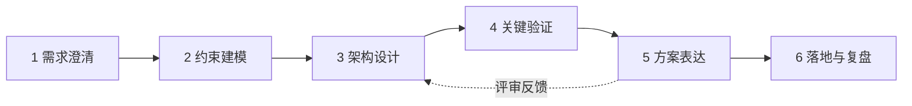

# 解决方案架构设计方法论

> 十年里我评审过数百份方案，也亲自写过其中相当一部分。好坏方案的差距很少在"技术选得对不对"，而在"有没有一套靠谱的推导过程"。这篇把我自己的工作方法显式化：从需求到架构，每一步的输入、产出与判据是什么。

## 方法论总览



## 第一步：需求澄清——把"想要"翻译成"需要"

客户说的永远是方案，不是需求。"我们需要一个大数据平台"背后可能是"老板要看实时经营看板"。澄清工具：

- **业务目标问句**：这个系统支撑什么业务动作？成功了怎么衡量？
- **场景穷举**：正常场景、峰值场景、故障场景、演进场景各问一遍
- **量化五件套**：用户规模、并发模型、数据量与增速、时延要求、可用性目标——**写不出数字的需求不算需求**

产出物：**一页纸需求基线**（业务目标 + 量化指标 + 明确排除项）。排除项和包含项同样重要——它划定了方案的边界，也保护了交付。

## 第二步：约束建模——方案的"不可违抗项"

架构设计是在约束里求解，约束不清则方案必翻车：

| 约束类型 | 典型问题 |
| --- | --- |
| 预算 | 三年 TCO 上限？建设/运营成本比例？ |
| 合规 | 等保级别、数据出域、行业监管 |
| 组织 | 团队技术栈、运维能力、决策链 |
| 存量 | 遗留系统集成、既有合同与供应商 |
| 时间 | 死线（监管检查、大促、发布会） |

经验：**组织约束是最容易被低估的**。一套技术上 90 分的方案，如果团队没有能力运维，实际得分是 0。

## 第三步：架构设计——分层推进，权衡显式化

### 设计顺序

```
数据架构先行 → 应用架构跟随 → 技术架构支撑 → 部署架构落地
```

数据是系统里最难迁移的部分，所以先回答：数据在哪、怎么流、谁能访问。之后再谈应用拆分、产品选型与部署形态。**反过来做（先选产品再套业务）是新手最常见的错误**。

### 权衡显式化

每个关键决策必须写清楚三件事：**选了什么、放弃了什么、为什么**。例如：

> 选 PolarDB 而非自建 MySQL 集群——放弃版本自主控制权，换取分钟级读扩展与托管运维；团队无专职 DBA，该交换成立。

没有"放弃项"的决策说明不是决策，是产品清单。

### 六大质量属性的检查清单

每个方案必须逐一表态（不是每个都做到极致，而是每个都有明确结论）：

1. **可用性**：目标几个 9？单点在哪？（见 [高可用与容灾设计](/methodology/ha-dr)）
2. **性能**：峰值容量与水位红线（建议峰值水位 ≤ 60%）
3. **安全**：身份、网络、数据、审计四层是否闭环
4. **成本**：三年 TCO 测算，含增长弹性（参考 [GPU 成本测算](/ai/infra/inference/gpu-sizing) 的方法论）
5. **可运维性**：发布、监控、排障、回滚路径是否完整
6. **演进性**：两年后的业务量进来，哪里先崩？现在为它留什么缝？

## 第四步：关键验证——方案里最贵的假设先验证

每个方案都藏着几个"如果它不成立，方案就推翻"的假设：

- 性能假设 → **压测 / POC**
- 集成假设 → **打通验证**（接口、协议、权限）
- 成本假设 → **小规模实测账单**
- 效果假设（AI 项目）→ **业务评测集验证**

原则：**验证顺序按"推翻成本"排序**，最可能推翻全局的假设最先验证。POC 不是演示，是带着判据的实验——实验前就要写好"什么结果算通过"。

## 第五步：方案表达——让决策者能决策

同一份设计要面向三类听众：

| 听众 | 关心 | 表达形式 |
| --- | --- | --- |
| 决策层 | 成本、风险、收益 | 一页纸：目标/投入/风险/里程碑 |
| 技术负责人 | 架构合理性、演进路径 | 逻辑架构图 + 关键决策记录 |
| 实施团队 | 落地步骤、接口契约 | 部署架构 + 任务分解 |

架构图中必须包含**数据流向与故障域边界**——只画方框连线的图传递不了决策信息。

## 第六步：落地与复盘

- 里程碑切分原则：每个里程碑有**独立可验收的交付物**，拒绝"最后一次性联调"
- 上线后的方案复盘只问一个问题：**当初的假设，哪些被证伪了？** 证伪记录是方法论进化的唯一来源

## 反模式清单

| 反模式 | 特征 | 代价 |
| --- | --- | --- |
| 简历驱动设计 | 选型理由是新潮而非适配 | 团队接手即失控 |
| 一步到位主义 | 拒绝分期，追求终极架构 | 永远在建设中 |
| 唯可用性论 | 所有系统都按 5 个 9 设计 | 预算爆炸，核心系统反而欠投入 |
| 产品拼盘方案 | 只有产品列表没有数据流 | 集成风险全部留给交付期 |
| 口头需求开工 | 需求基线没签字就动工 | 变更失控 |

## 小结

架构设计方法论的本质是把**判断变成流程**：需求量化、约束显式、权衡留痕、假设先验、分层表达。天赋决定方案的想象力，流程决定方案的下限——而对职业架构师来说，下限比想象力更值钱。

## 参考资料

<Refs>

- 《架构整洁之道》《数据密集型应用系统设计》（DERTA/DDIA）
- [AWS/阿里云官方架构框架（Well-Architected Framework）](https://www.aliyun.com/)
- 站内相关：[上云迁移方法论](/methodology/cloud-migration) · [高可用与容灾设计](/methodology/ha-dr)

</Refs>