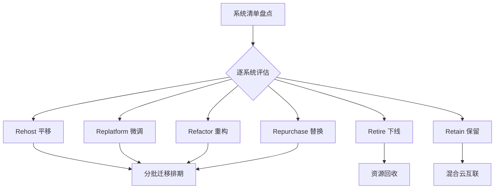

# 上云迁移方法论（6R 策略）

> 上云迁移是"在飞行中换引擎"：业务不能停，数据不能丢，回滚必须可靠。这篇沉淀十年迁移项目里验证过的方法框架：用 6R 给每个系统定策略，用三阶段控制执行风险，用"可逆性"原则安排顺序。

## 迁移的第一性原理

所有迁移方法论都建立在三个前提上：

1. **迁移是状态机的推进，不是一次性事件**——每个阶段都要有明确的进入/退出判据
2. **可逆性是第一优先级**——任何一步出了问题必须能退回去，退不回去的步骤要最后做
3. **数据先行，应用随后，流量殿后**——数据迁移的验证周期最长，必须最早开始

## 6R 策略：给每个系统定策略

迁移不是对"整个 IT 系统"做一件事，而是对**每一个系统**单独做决策：

| 策略 | 含义 | 适用 | 风险/成本 |
| --- | --- | --- | --- |
| **Rehost** | 原样搬迁（虚拟机镜像级迁移） | 快速见效、遗留系统、低改造价值 | 低 / 低，但享受不到云红利 |
| **Replatform** | 小改后上云（换托管数据库、换对象存储） | 多数业务系统的合理选择 | 中 / 中 |
| **Refactor** | 云原生重构（容器化、微服务化） | 核心系统 + 有重构团队与窗口期 | 高 / 高，收益也高 |
| **Repurchase** | 换成 SaaS 或新产品 | 自建性价比差的支撑系统（邮件、OA、监控） | 低 / 中 |
| **Retire** | 直接下线 | 无人使用/功能重复的系统 | 迁移项目的隐藏收益来源 |
| **Retain** | 暂不迁移 | 强合规、强依赖、改造窗口未到 | 需要混合云方案兜底 |

实践经验：

- **盘点阶段的价值被普遍低估**。做完资产清单，通常 20–30% 的系统可以直接 Retire——这是迁移项目最容易拿到的成本收益
- **Rehost 不是终点而是起点**：先平移上云止血，稳定后再择机 Replatform/Refactor，"两步走"比一步到位成功率高得多
- **别为迁移而重构**。Refactor 应该由业务演进驱动，迁移窗口内做重构是双重风险叠加

## 三阶段执行框架

### 阶段一：规划（占总周期 30%）

- 资产盘点：应用、依赖关系、数据量、合规属性
- 依赖分析是重中之重：**画出系统间调用与数据依赖图，迁移批次按依赖拓扑切分**——被依赖多的底座系统先迁，叶子系统后迁
- 目标架构与网络规划（VPC、混合云互联）先行设计（见 [云网络提纲](/csn/network)）
- 制定回滚预案：每个批次明确"什么条件触发回滚、回滚到哪一步、谁下令"

### 阶段二：迁移与验证（占 50%）

- **数据迁移三段式**：全量同步 → 增量追平 → 一致性校验。工具化（DTS 类）是标配，校验工具必须独立于同步工具
- **应用切换两种模式**：
  - 停机窗口切换：简单可靠，适合能停机的系统
  - 双跑灰度切换：新旧并行、流量按比例迁移，适合不能停的核心系统
- 每个批次的验证清单：功能回归、性能基线对比、数据核对、监控告警接入确认

### 阶段三：优化（占 20%，常被省略）

- 上云后第一个月账单复盘：规格右尺寸化（rightsizing），多数系统首月可降配 20%+
- 把"云上冗余"转化为"云上弹性"：把为迁移预留的双份资源释放成弹性策略
- 运维体系切换：监控、备份、应急预案全部演练一遍，**上云不等于安全，上云后的容灾演练才算闭环**（见 [高可用与容灾](/methodology/ha-dr)）

## 批次排期的原则

1. **先易后难建立信心**：第一批选非核心、可停机、依赖少的系统
2. **数据密集系统提前启动**：TB 级数据的同步与校验周期以周计
3. **核心系统单独成批**：不与其他批次共享窗口与人力
4. **每批之间留缓冲**：用于消化前一批暴露的共性问题

## 常见坑

| 坑 | 后果 | 对策 |
| --- | --- | --- |
| 忽略公网出口差异 | 迁移后第三方调用失败 | 依赖清单逐个核对出口与白名单 |
| 数据库字符集/时区不一致 | 隐蔽的数据错误 | 迁移前做环境基线比对 |
| 增量同步延迟被低估 | 切换窗口超时 | 切换前压测增量追平速度 |
| 只演练切换不演练回滚 | 出事时不敢退 | 回滚与切换同等级演练 |
| 迁移完就解散项目组 | 优化阶段无人负责 | 优化目标写进项目验收标准 |

## 小结

迁移方法论的全部精髓：**逐系统定策略（6R）、按依赖定批次、用可逆性定顺序、拿验证结果定进退**。技术工具决定迁移的效率，流程纪律决定迁移的安全。

## 参考资料

- 各云厂商官方迁移中心与最佳实践文档
- 站内相关：[解决方案架构设计方法论](/methodology/architecture-design) · [云网络](/csn/network) · [高可用与容灾设计](/methodology/ha-dr)
