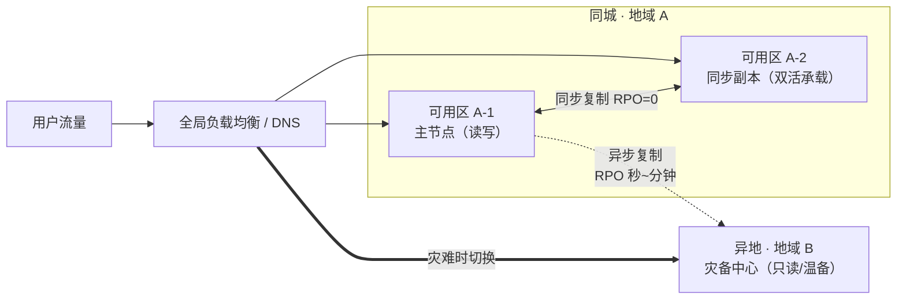
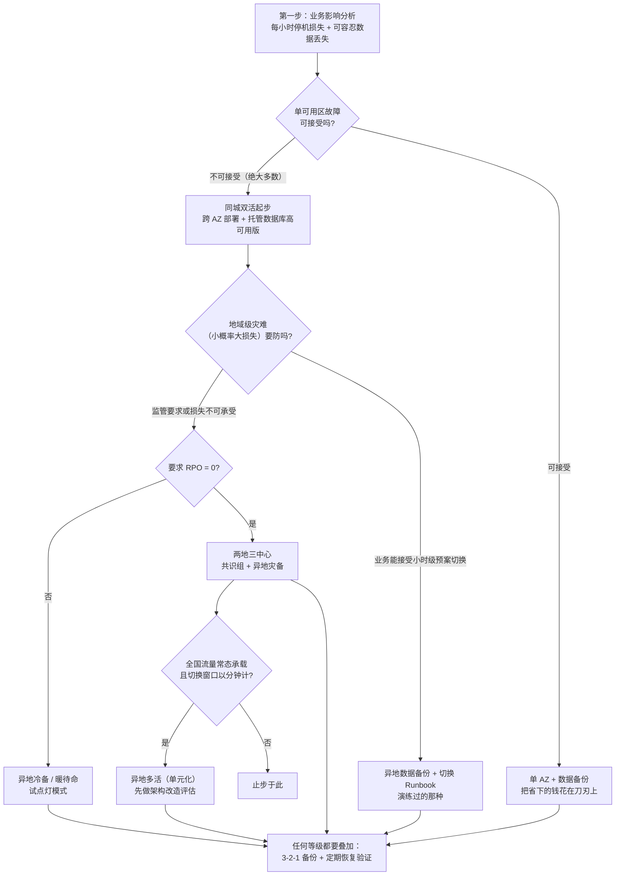

# 高可用与容灾设计

> 这篇写给两类人：正在给系统写 SLA 承诺的架构师，以及被"要不要上异地多活"这个问题困扰的技术负责人。读完你应该能回答三个问题：**我的业务到底需要几个 9**、**从备份到多活的每一级容灾各自值多少钱**、**为什么"演练"比"方案"更能决定你能不能活着度过一次故障**。

## 是什么：先把四个词分清

一线沟通里最容易犯的错，是把"高可用"和"容灾"当同义词。它们的故障尺度差着一到两个数量级：

- **高可用（HA）**：应对**组件级**故障——一台机器、一个可用区、一次网络抖动。手段是冗余 + 自动切换，用户最好无感知。
- **容灾（DR）**：应对**地域级**灾难——整个机房断电、火灾、光缆被挖断、云厂商区域级故障。手段是跨地域的数据副本和切换预案，通常需要有意识的切换动作。
- **业务连续性（BCP）**：比容灾更大的一圈，包含流程、人员、合规——机房恢复了但审批链断了，业务照样不连续。
- **备份**：只是容灾的地基。备份解决"数据还在不在"，容灾解决"业务多久能回来"。

衡量这套能力的两个硬指标（术语来自维基百科的 IT 容灾条目）：

| 指标 | 一句话定义 | 追问的问题 |
| --- | --- | --- |
| **RPO**（Recovery Point Objective） | 故障时**可容忍的最大数据丢失量**（按时间计） | 最近一次一致的数据状态离故障点有多远？ |
| **RTO**（Recovery Time Objective） | 故障后**业务必须恢复的时间上限** | 从灾难发生到用户重新能用，最长允许多久？ |

RPO=0 意味着零数据丢失，通常要求同步复制；RTO→0 意味着用户无感切换，要求全自动化。两者是**独立的维度**——我见过 RTO 设计得很好看但 RPO 没人管的方案：切换半小时完成，代价是丢半小时订单，业务方事后才发现这不能接受。

### 可用性的数学：每多一个 9，成本非线性上升

把"几个 9"翻译成可感知的停机时间（一年按 365 天计）：

| 等级 | 可用性 | 年停机 | 直觉对照 |
| --- | --- | --- | --- |
| 3 个 9 | 99.9% | ≈ 8.8 小时 | 一次工作日上限 |
| 4 个 9 | 99.99% | ≈ 52.6 分钟 | 一顿午饭 |
| 5 个 9 | 99.999% | ≈ 5.3 分钟 | 一次电梯故障 |
| 6 个 9 | 99.9999% | ≈ 31.5 秒 | 人工介入都来不及 |

两个工程含义：

1. **串联系统的可用性是各环节的乘积**。入口网关 99.99% × 应用 99.95% × 数据库 99.95% ≈ 99.89%——链路越长，单个环节反而要定得越高。做容量评审时我会要求把依赖树画出来做这个乘法，多数团队算完会沉默。
2. **5 个 9 以上的世界不允许人存在**。31 秒的年停机预算意味着任何需要"值班同学起床看一眼"的恢复路径都不成立，只剩自动故障转移一条路，而同步复制、全冗余的成本随 9 的数量级式上升。

Google SRE 实践给了一个更好用的管理工具：先定义**SLI**（从用户视角测量的服务指标，如成功率、延迟），定 **SLO**（SLI ≤ 目标值），剩下的 **1 − SLO 就是错误预算**——一个季度允许"烂"的额度。错误预算的意义在于把可靠性变成**可交易的资源**：预算还多，就把额度花在迭代速度上；预算烧完，冻结功能上线全力还债。这比"我们要不惜一切代价保稳定"的口号可执行得多。

*图源：Wikimedia Commons（[来源页](https://commons.wikimedia.org/wiki/File:Racks_Amravati_Data_Center.jpg)）*

## 为什么重要：故障成本与责任归属

我的经验是：**容灾预算永远争不过业务需求，除非你把它换算成钱**。所以立项前先和业务方一起回答三个问题：

- 这个系统每小时不可用，损失多少收入 / 商誉 / 合规风险？
- 丢 10 分钟数据，和丢 10 小时数据，后果有区别吗？（很多业务的答案是"没区别"，那 RPO 目标立刻可以放松一级）
- 出了事故，谁签字宣布切换？切换错了谁负责？（这是流程问题，但决定 RTO 上限）

责任视角还有一层：对外承诺的 SLA 是**法律文本**。云厂商对单实例、跨可用区集群、跨地域的 SLA 承诺档次分明（例如单可用区实例的组合 SLA 天然低于多可用区托管集群），把业务承诺直接抄成架构目标、不做依赖分析，是甲方架构师最容易签下的空头支票。

多数场景下我的判断：**先让"故障不丢人"（自动恢复、有演练），再谈"数字好看"**。一个常年演练、真出事 20 分钟恢复的 99.9% 系统，比一个从没切过、标称 99.99% 的系统可靠得多——后者的 PPT 在故障复盘会上保护不了任何人。

## 架构与原理：容灾等级体系与拓扑

按防护半径从小到大，主流云上的容灾形态可以排成一个等级阶梯。AWS 的容灾白皮书给出了经典的四级光谱（备份还原 → 试点灯 → 暖待命 → 多站点多活），阿里云体系则习惯按"同城双活 / 异地灾备 / 两地三中心 / 异地多活"表述。两者说的是同一件事：**你在为哪种规模的灾难买保险**。

*图源：Wikimedia Commons（[来源页](https://commons.wikimedia.org/wiki/File:Optical_fiber_cable-07ASD.jpg)）*

### 第一级：数据备份（Backup & Restore）

成本最低，所有等级的地基：数据定期备份到对象存储，跨区域复制一份。灾难发生时从零恢复：重建环境、拉取备份、回灌数据。RPO 取决于备份频率（小时/天级），RTO 以小时甚至天计。

AWS 对这一级的定位很直白：恢复动作最重、成本最低。我的补充是：**这一级最容易被"备份任务全绿"的假象麻痹**——没人恢复过的备份只是传闻（详见常见坑）。

### 第二级：试点灯与暖待命（Pilot Light / Warm Standby）

在异地保留**数据的活副本**（数据库跨域复制、存储跨域同步），计算资源按最小规格保留（试点灯）或保留一套缩小但完整可运行的栈（暖待命）。AWS 白皮书对两者边界有一句精准的定义：*试点灯在灾难发生后必须"先做额外动作"才能处理请求；暖待命则随时可以承接流量，只是容量缩小*。

对应到国内语境就是"异地冷备/温备"：RPO 分钟级（取决于复制滞后），RTO 小时级（试点灯要扩容拉起）到十分钟级（暖待命只需扩容量 + 切流量）。

### 第三级：同城双活（多可用区，跨 AZ 同步）

这是多数业务真正应该投入的一层。可用区（AZ）是同地域内**独立故障域**：不同楼宇、独立电力和网络，彼此之间低延迟（亚毫秒到两毫秒级）。同城双活的要点：

- **应用层**：每个可用区部署等量副本，前端负载均衡（ALB/NLB 类）跨区挂载，单区故障秒级摘除。
- **数据层**：用同城多副本的托管服务——RDS/PolarDB 高可用版的主备跨 AZ、OSS 同城冗余存储（ZRS 类）。数据库主备之间走同步或准同步复制，RPO=0、RTO 在几十秒的自动切换量级。
- **验证依赖树**：见常见坑里的"伪多可用区"。

*图源：Wikimedia Commons（[来源页](https://commons.wikimedia.org/wiki/File:Wikimedia_racks_ULSFO_2013_06_20_06_servers.jpg)）*

同城双活防的是"可用区级"故障，防不了地域级灾难——地震、洪灾、城市级电力事件会把两个可用区一起带走。这就是异地等级存在的理由。

### 第四级：两地三中心

金融行业监管实践把"同城双中心 + 异地灾备中心"的组合固化成了标准形态：**同城两中心双活承载流量、异地一中心承接灾难场景**，即所谓"生产双活 + 异地灾备"。

数据库层可以做到 RPO=0：以 PolarDB-X 的"两地三中心 5 副本"为例，同城两中心放 4 副本、异地 1 副本组成共识组，写入需多数派确认才提交；中心地域整体故障时业务快速切流到异地备集群恢复（阿里云公开文档）。多数派机制的精妙之处在于：同城丢一个中心还剩异地副本 + 仲裁可保数据，同城两中心全丢则接受业务中断但不丢已确认的写入——**用共识换 RPO，用异步换跨城带宽**。

代价：异地带宽是持续成本，且灾备中心平时不承载流量，是"养着不用"的资产——这正是监管场景愿意付、普通业务要掂量的部分。

### 第五级：异地多活（单元化）

多个地域同时承载生产流量，任一地域故障时把该地域的用户切到其他地域。RPO 秒级、RTO 分钟级，成本最高。物理约束前面说了：1000 公里 ≈ 5ms 单向，跨城**同步**复制会直接吃掉写延迟预算，所以异地多活几乎必然要求**单元化**改造：

- 按用户 ID（或店铺、订单维度）分片，一个"单元"闭合地服务一批用户的全部读写，跨单元不做事务；
- 入口按用户归属路由到对应单元；
- 切流 = 修改用户与单元的归属映射，数据层用 DTS/CDC 类工具做单元间持续同步与冲突处理。

阿里云 AHAS 的多活容灾术语里，"切流""单元封闭""数据同步链路"就是这套模型的工程化。**我的判断：单元化是对应用架构的伤筋动骨改造**——有状态服务、跨单元事务、全局计数、库存扣减全要重新设计。没有真正的全国性业务体量 + 强监管或强品牌要求，性价比存疑。头部电商、支付场景之外，多数业务的多活需求用"同城双活 + 异地数据备份 + 可执行的切换预案"就能覆盖。

## 实践与选型

### 容灾模式对比表

| 模式 | 典型形态 | RPO | RTO | 相对成本 | 适用场景 |
| --- | --- | --- | --- | --- | --- |
| 数据备份 | 跨区域备份 + 恢复预案 | 小时~天级 | 小时~天级 | 1x | 内部系统、非关键业务的地域兜底 |
| 试点灯 | 异地活数据副本 + 最小计算 | 分钟级 | 小时级 | 1.5~2x | 可容忍数小时中断的业务 |
| 暖待命 | 异地缩容但完整的栈 | 分钟级 | 十分钟级 | 2~3x | 重要但不允许长时间中断 |
| 同城双活 | 多可用区 + 跨 AZ 同步副本 | 0（同城） | 秒~分钟（可用区级） | 1.3~1.5x | **几乎所有联网业务的默认起点** |
| 两地三中心 | 同城双活 + 异地灾备 | 0（共识组） | 小时级（地域级） | 2.5~4x | 金融、政务等监管强制场景 |
| 异地多活 | 单元化多地域承载 | 秒级 | 分钟级（地域级） | 5x 起 | 全国性超大流量 + 强监管/强品牌 |

（成本倍数为相对"单地域最小部署"的经验量级，按典型云上公开定价粗算，具体项目请以实际报价为准。）

### 决策流：从业务倒推，不从技术正推

几条我从踩坑里换来的经验法则：

- **"多可用区起步"是我的默认答案**。跨 AZ 的增量成本（多一套计算 + 跨 AZ 流量费）在绝大多数架构里远小于它的期望收益，而且它是后面所有等级的地基——没有同城冗余的团队谈异地多活，等于地基没打盖三楼。
- **可用性目标由业务损失倒推，不由技术能力正推**（提纲里的这句话我至今认为值回整个方案评审的时间）。
- **备份永远叠加**：不管你做到了哪级容灾，3-2-1 规则都成立——3 份副本、2 种介质、1 份异地；勒索软件时代的业界扩展是 3-2-**1-1-0**：再加 1 份不可变/隔离副本（被攻破的管理员也删不掉），以及**0 个未经恢复验证的错误**。

### 演练：容灾方案里唯一不骗人的环节

"备份不演练 = 没有备份；切换不演练 = 不敢切换"。演练我按三个层次组织：

1. **桌面推演**：把 Runbook 拿出来对着会议桌走一遍，验证"谁决策、谁操作、通知谁"。成本最低，能抓到一半的流程洞。
2. **数据恢复验证**：真拉一份备份/副本，在隔离环境恢复到可用并校验数据（阿里云卓越架构文档给出的同城双活演练就是这个思路：模拟实例、机房或地域级故障，检验逃逸能力与 RPO/RTO 达标性）。云厂商有现成工具——AWS Backup 的 restore testing 可以在隔离账号里定时自动恢复并出报告，把"备份可恢复"变成合规证据而不是一年一次的仪式。
3. **真实切换（含回切！）**：低峰期把生产流量切到灾备侧跑一段，再切回来。回切往往比切换更容易翻车（数据在灾备侧产生了增量、配置漂移），预案里没有回切章节的演练等于只排了一半的雷。

把故障注入常态化就是**混沌工程**：Netflix 在 2008 年被一次云存储故障打到三天无法服务后，从 Chaos Monkey 随机杀实例起步，把"验证韧性假设"做成了日常——AWS FIS（故障注入服务）、Gremlin、Chaos Mesh 都是这个思路的产品化。我的边界提醒：混沌实验要有**终止条件**（预设的熔断指标）、从预发环境开始，并且实验假设要写下来——"我以为数据库主备切换时长连接会 30 秒内重连"就是一条合格的假设，验证它比随机杀机器有价值得多。

## 常见坑

| 坑 | 现象 | 根因与对策 |
| --- | --- | --- |
| **DNS 切换 TTL 失效** | 切了记录，一半用户还在访问灾区 | 很多运营商/客户端不遵守 TTL（存在最长缓存数小时的记录）。对策：TTL 提前降到 60 秒只是必要条件，同时准备 HTTP 301/网关层重路由等**不依赖 DNS 的兜底**；重大切换提前 48h 降 TTL |
| **备而不调** | 灾备环境平时没人碰，真切换时发现版本落后、权限不通、容量不够 | 灾备侧配置与生产**同源管理**（IaC），且纳入第 3 层真实切换演练；AWS 把暖待命定义为"随时可承载缩小流量"，达不到这个标准的都叫冷备的幻觉 |
| **跨区延迟当同城用** | 异地"双活"数据库写延迟 +10ms，高峰直接雪崩 | 记住物理账：1000km ≈ 5ms 单向、同步复制吃 RTT。异地做异步 + 单元化，同步只留给同城 |
| **备份不可恢复** | 备份任务全绿，恢复时报格式不支持/介质损坏/缺依赖清单 | 3-2-1-1-0 的"+0"：自动化恢复验证（restore testing）常态化；备份保留清单里写全**恢复所需的环境信息**，不只是数据 |
| **伪多可用区** | 应用双 AZ 部署，但 Redis/消息队列/某个自建中间件单 AZ | 容灾等级由依赖树里**最弱的一环**决定（串联乘积）。上线前对依赖清单逐项问：你这个是跨 AZ 的吗？挂了会自动切换吗？切的时候丢数据吗？ |
| **SLA 数字与架构脱节** | 对外承诺 99.99%，架构按 99.9% 设计 | 用错误预算把承诺翻译成季度停机额度，再核对每次故障消耗；预算烧完触发变更冻结，让数字有牙齿 |

## 实践观点

- **多数业务的合理终局：同城双活 + 异地数据备份 + 演练过的切换预案**，而不是异地多活。多活是头部业务的军备，不是普适最佳实践。
- **容灾是买保险，不是做投资**：平时看不到收益、指标上不动容，所以每一级都要用业务损失倒推来辩护，否则预算一定会被砍。
- **韧性是验证出来的属性，不是设计出来的属性**。架构图上的双活只是假设，演练通过的才是能力。

## 参考资料

<Refs>

- AWS《Disaster recovery options in the cloud》白皮书（四级容灾策略对比）：https://docs.aws.amazon.com/whitepapers/latest/disaster-recovery-workloads-on-aws/disaster-recovery-options-in-the-cloud.html （访问日期 2026-09-02）
- AWS Architecture Blog：DR on AWS Part III — Pilot Light and Warm Standby：https://aws.amazon.com/blogs/architecture/disaster-recovery-dr-architecture-on-aws-part-iii-pilot-light-and-warm-standby/ （访问日期 2026-09-02）
- AWS Architecture Blog：DR on AWS Part IV — Multi-Site Active-Active：https://aws.amazon.com/blogs/architecture/disaster-recovery-dr-architecture-on-aws-part-iv-multi-site-active-active/ （访问日期 2026-09-02）
- 阿里云开发者社区《同城容灾 vs 两地三中心，RPO、RTO 一篇讲透》：https://developer.aliyun.com/article/1735482 （访问日期 2026-09-02）
- 阿里云文档《PolarDB-X 两地三中心 RPO=0 高可用容灾架构原理》：https://help.aliyun.com/zh/polardb/polardb-for-xscale/three-centers-in-two-places （访问日期 2026-09-02）
- 阿里云文档《AHAS 多活容灾核心概念与术语》：https://help.aliyun.com/zh/ahas/product-overview/terms （访问日期 2026-09-02）
- 阿里云卓越架构《应用系统同城双活演练方案》：https://help.aliyun.com/zh/document_detail/2929421.html （访问日期 2026-09-02）
- Google SRE Book《Service Level Objectives》（SLI/SLO/错误预算）：https://sre.google/sre-book/service-level-objectives/ （访问日期 2026-09-02）
- Google SRE Workbook《Error Budget Policy》：https://sre.google/workbook/error-budget-policy/ （访问日期 2026-09-02）
- 维基百科 High availability（可用性等级数学与几个 9）：https://en.wikipedia.org/wiki/High_availability （访问日期 2026-09-02）
- 维基百科 IT disaster recovery（RPO/RTO/MTTR 定义）：https://en.wikipedia.org/wiki/IT_disaster_recovery （访问日期 2026-09-02）
- Veeam《3-2-1 备份规则详解》：https://www.veeam.com/blog/cn/321-backup-rule.html （访问日期 2026-09-02）
- Google Cloud Blog《Using chaos engineering to test DR plans》：https://cloud.google.com/blog/products/devops-sre/using-chaos-engineering-to-test-dr-plans （访问日期 2026-09-02）
- AWS Fault Injection Service 产品页：https://aws.amazon.com/fis/ （访问日期 2026-09-02）
- AWS Storage Blog《Validate recovery readiness with AWS Backup restore testing》：https://aws.amazon.com/blogs/storage/validate-recovery-readiness-with-aws-backup-restore-testing/ （访问日期 2026-09-02）
- AWS 官方博客《混沌工程在 Netflix 的演进》：https://aws.amazon.com/cn/blogs/china/the-evolution-of-chaos-engineering-at-netflix/ （访问日期 2026-09-02）
- 图片来源：Wikimedia Commons——[Racks Amravati Data Center](https://commons.wikimedia.org/wiki/File:Racks_Amravati_Data_Center.jpg)、[Optical fiber cable-07ASD](https://commons.wikimedia.org/wiki/File:Optical_fiber_cable-07ASD.jpg)、[Wikimedia racks ULSFO](https://commons.wikimedia.org/wiki/File:Wikimedia_racks_ULSFO_2013_06_20_06_servers.jpg)（访问日期 2026-09-02）

站内相关：[方法论导读](/methodology/) · [架构设计方法论](/methodology/architecture-design) · [上云迁移](/methodology/cloud-migration) · [可观测体系](/cloud/native/observability) · [微服务治理](/cloud/native/microservice) · [云网络](/cloud/infra/network) · [云存储](/cloud/infra/storage)

</Refs>