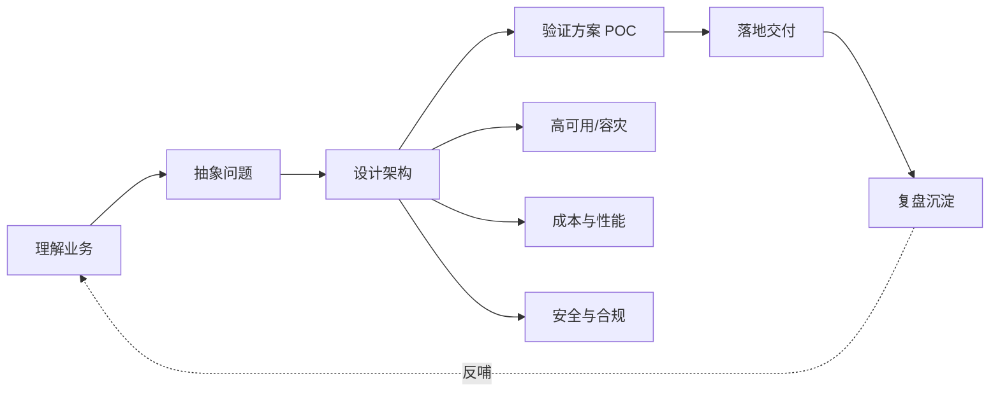

# 解决方案方法论

> 技术决定方案的下限，方法论决定方案的上限。这一域是个人知识库的差异化所在：不写"某产品怎么用"，而写"面对一个业务问题，如何设计一个站得住脚的方案"。

## 这个域回答什么问题

- 从需求到架构，一套可复用的方案设计流程长什么样？
- 上云迁移怎么做风险最小？6R 策略如何落到单个系统？
- 高可用与容灾的分级设计（同城双活/异地多活）如何取舍？

## SA 能力地图

## 文章列表

| 文章 | 状态 | 说明 |
| --- | --- | --- |
| [解决方案架构设计方法论](/methodology/architecture-design) | ✅ 已发布 | 种子文：从需求到架构的完整方法 |
| [上云迁移方法论（6R）](/methodology/cloud-migration) | ✅ 已发布 | 种子文：迁移策略与执行框架 |
| [高可用与容灾设计](/methodology/ha-dr) | 🚧 提纲 | SLA 分级、多活、容灾演练 |

## 一句话入门

好的架构不是"技术最先进"，而是**在约束条件下，对业务目标的最高性价比兑现**。方法论的作用，是让这个判断过程可复现、可传承。
