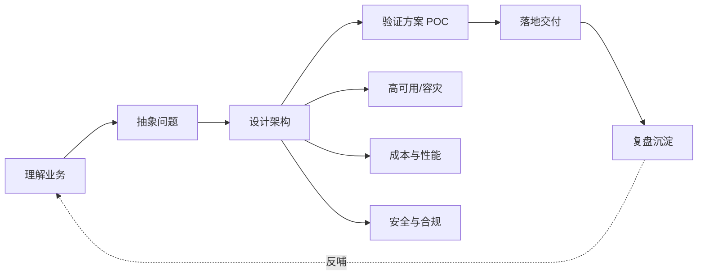

# 解决方案方法论

> 技术决定方案的下限，方法论决定方案的上限。这一域是个人知识库的差异化所在：不写"某产品怎么用"，而写"面对一个业务问题，如何设计一个站得住脚的方案"。

## 这个域回答什么问题

- 从需求到架构，一套可复用的方案设计流程长什么样？
- 上云迁移怎么做风险最小？6R 策略如何落到单个系统？
- 高可用与容灾的分级设计（同城双活/异地多活）如何取舍？

## SA 能力地图

## 文章列表

| 文章 | 状态 | 说明 |
| --- | --- | --- |
| [解决方案架构设计方法论](/methodology/architecture-design) | ✅ 已发布 | 种子文：从需求到架构的完整方法 |
| [上云迁移方法论（6R）](/methodology/cloud-migration) | ✅ 已发布 | 种子文：迁移策略与执行框架 |
| [高可用与容灾设计](/methodology/ha-dr) | 🚧 提纲 | SLA 分级、多活、容灾演练 |

## 精选资源

> 筛选标准：官方与一手来源优先，近两年内容优先，经典明确标注。更新于 2026-09-01。

### 架构方法论

- [AWS Well-Architected Framework](https://docs.aws.amazon.com/wellarchitected/latest/framework/welcome.html) — 业界事实标准的架构评审框架，六大支柱与权衡清单（2024 · 官方文档）
- [云上架构设计评估优化最佳实践（阿里云卓越架构）](https://help.aliyun.com/zh/document_detail/2362204.html) — 官方中文架构方法论，学习-度量-优化闭环（2025 · 官方文档）
- [FinOps Framework](https://www.finops.org/framework/) — FinOps 基金会官方框架，三阶段六域能力全景（2024 · 官方文档）

### 上云迁移

- [Migration strategies — AWS large migration guide](https://docs.aws.amazon.com/prescriptive-guidance/latest/large-migration-guide/migration-strategies.html) — 官方 7R 迁移策略决策指南（2023 · 官方文档）
- [跨境电商系统上云迁移实战：踩坑复盘](https://developer.aliyun.com/article/1743010) — 数据同步与成本失控等一线细节（2026 · 工程博客）

### 高可用与混沌工程

- [Principles of Chaos Engineering](https://principlesofchaos.org/) — 混沌工程经典宣言，确立学科核心原则（2019 · 工程博客）
- [ChaosBlade — 阿里巴巴开源混沌工程工具](https://github.com/chaosblade-io/chaosblade) — 国产混沌工程利器，中文文档全，活跃维护（持续更新 · 开源项目）
- [单元化架构在字节跳动的落地实践](https://developer.volcengine.com/articles/7430708342642704422) — 单元化多活一手实践：流量与数据切分（2024 · 工程博客）

### 成本治理

- [小红书 FinOps 实践：云成本优化与资源效率提升之道](https://www.infoq.cn/article/zdgtwkzipr1e6vtoi45r) — 大厂云成本优化一手实践，组织与技术双视角（2025 · 工程博客）

## 一句话入门

好的架构不是"技术最先进"，而是**在约束条件下，对业务目标的最高性价比兑现**。方法论的作用，是让这个判断过程可复现、可传承。
