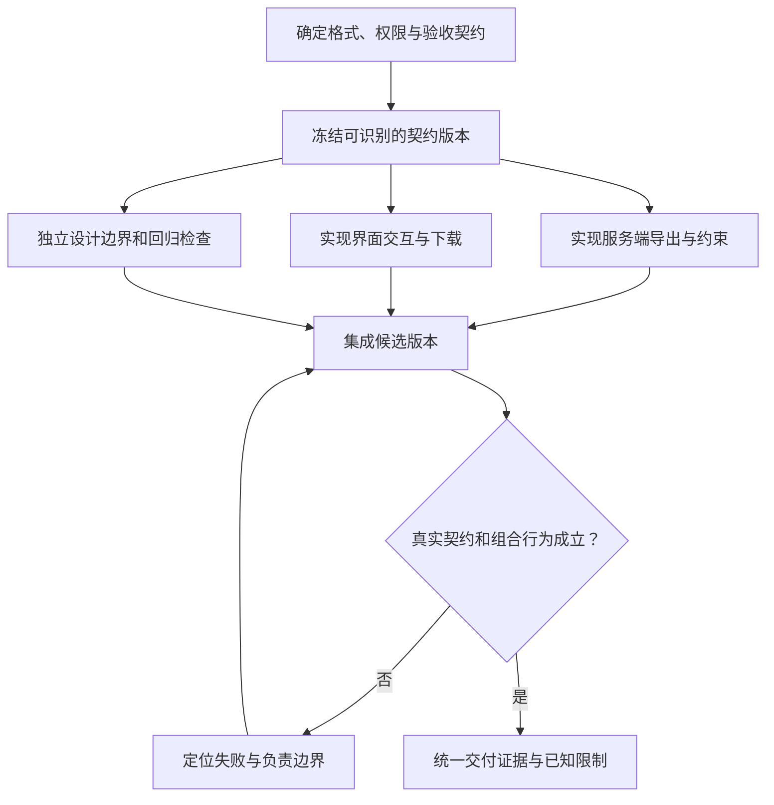

# 任务拆分、变更预算与 Agent 协作

> 面向组织跨模块变更、编排研发 Agent 或审查自动化协作成果的读者。需要理解接口、Git 与测试；读完能按依赖拆分工作，设置可检查的变更预算，隔离执行状态，并在集成时重新验证组合行为。

## 拆分单位是可验收的变化

**任务拆分**是将目标分成有输入、责任边界和完成条件的工作单元。文件目录可以辅助划分，但不天然对应业务边界。前端、接口和数据库可能共同实现一个状态转换；分别“完成自己的文件”不能证明这个转换成立。

**Agent 协作**是多个执行者围绕任务分工、交换证据并组合结果。执行者可以是模型驱动助手，也可以与人工角色混合。多 Agent 增加了可同时处理的上下文和动作，也增加协调、资源竞争和集成成本。

Anthropic 的工程文章区分了预定义的独立并行任务与由协调者动态分配工作的模式。[编排模式](https://www.anthropic.com/engineering/building-effective-agents) 这些模式提供设计参考，不意味着增加执行者就必然提升质量或速度。实际拆分应从依赖和验收出发。

## 先画依赖，再决定并行

**依赖图**用节点表示任务，用有向边表示前置条件。若两个工作都依赖尚未确定的接口，它们可以同时调研，却不宜各自把不同契约写进实现。若修改同一文件或操作同一数据，也要考虑写入冲突和副作用。

以下是配置导出功能的教学设计，未启动 Agent 或执行修改。目标是在现有管理工具中增加标准格式导出，保留已有权限判断，只使用合成数据。

契约至少确定字段、编码、权限对象、空结果和错误行为。之后界面与服务实现可以在各自边界内推进；检查设计依据同一需求，但其判定依据不由实现结果决定。集成失败可能需要回到契约修订，此时应让依赖任务使用新版本，不能让它们各自补丁式猜测。

| 工作关系 | 可并行的部分 | 应串行或协调的部分 |
| --- | --- | --- |
| 不同模块使用稳定接口 | 模块实现和局部检查 | 最终契约与端到端验证 |
| 接口尚未确定 | 现状调查、方案比较 | 契约决定及依赖实现 |
| 同一文件需要多种修改 | 独立提出候选方案 | 指定一个写入责任者整合 |
| 共享模式或数据库迁移 | 分析消费者和风险 | 迁移次序、兼容窗口与统一执行 |
| 多视角审查同一差异 | 安全、业务、可维护性分析 | 统一核对发现，避免重复或冲突修复 |

并行前要确认“独立”涵盖输出和资源。两项代码互不重叠，却使用同一测试账号修改同一记录，仍可能相互干扰。可并行调研也不等于可并行执行外部写入。

## 任务契约让交接可检查

每个子任务应得到足够的信息契约，说明目标、输入、允许写入范围、禁止变化、完成证据与依赖。不要只给“负责后端”，让执行者自行决定数据结构、库选择和权限方式。

| 契约项 | 导出服务子任务示例 | 审查作用 |
| --- | --- | --- |
| 基线与依赖 | 仓库基线、当前差异、已确认格式契约版本 | 避免在旧实现或旧规则上继续 |
| 输出目标 | 从授权对象生成符合格式的文件 | 聚焦业务结果 |
| 写入责任 | 指定处理模块与相应局部测试 | 防止覆盖其他执行者工作 |
| 兼容限制 | 保留已有接口；不改变全局授权机制 | 暴露不必要的系统扩展 |
| 共享资源 | 隔离样例存储和执行标识 | 区分本任务的结果 |
| 完成证据 | 差异、实际检查结果、未验证项 | 支持后续集成判断 |
| 停止条件 | 发现必须迁移或契约矛盾时报告 | 防止悄然扩大任务 |

任务契约可以是简短记录，不需要复杂框架。重要的是不同执行者能对相同词语作相同解释。“保留兼容”应指明调用者与字段，而不是笼统表达愿望。

## 变更预算约束影响面与投入

**变更预算**是对一次任务允许改变的范围、风险与投入作出的约定。它不是通用行业标准，也不应只理解为代码行数。少量权限代码可能有广泛影响，大量格式调整则可能没有运行变化。

预算可以包括允许修改的模块、是否允许增加依赖、是否允许迁移或不兼容接口、外部动作范围，以及时间、费用与尝试次数。不同维度的上限需要单独判断；不能因剩余时间较多，就自行新增没有授权的目标。

| 发现的新需求 | 在原预算内可以做什么 | 需要重新决策的情况 |
| --- | --- | --- |
| 调用关系比预期复杂 | 扩展只读调查，记录关联 | 写入新的共享模块或改变责任边界 |
| 原测试失败 | 定位与任务相关性，补充证据 | 删除断言或改变原有业务规则 |
| 需要新依赖 | 说明已有能力缺口与候选影响 | 增加依赖超出任务约定 |
| 需要数据库结构变化 | 分析迁移、兼容与恢复方案 | 执行迁移或修改生产数据 |
| 多次尝试无进展 | 总结已排除假设和未解原因 | 超过预算继续随机改动 |

预算被触及时，执行者应返回具体原因、最小扩展方案和影响。可以缩小功能、调整拆分或增加预算；不应隐藏扩大范围，也不必因发现一个疑问就放弃所有无关工作。

## 工作树隔离不等于完整执行隔离

Git worktree 允许同一仓库关联多个工作树，支持不同检出状态。[Git 官方说明](https://git-scm.com/docs/git-worktree) 它可以减少多个执行者直接覆盖同一工作目录的机会，但不是权限沙箱。工作树仍属于共同仓库体系，外部数据库、网络身份、宿主进程和费用账户可能仍然共享。

因此隔离需要按资源设计：文件采用各自工作区或明确写入责任；测试使用独立数据与账号；端口、缓存和构建输出避免冲突；凭据按任务最小化；外部写入保持唯一责任者和可追踪标识。仅换一个分支，不能隔离运行数据。

共享目录也可以协作，但应采取明确的文件所有权和顺序。协调者看到文件出现，不应立刻编辑还在被另一执行者修改的内容；读取途中变化的文件所得结论，也需要在稳定版本上复核。

## 集成分成内容汇入与行为核查

第一步检查交付的基线、差异和边界，决定如何汇入。第二步在统一候选版本验证接口、状态与回归。这两个步骤都需要：文本合并成功只说明 Git 完成了合并过程，不能证明语义正确。[Git 合并机制](https://git-scm.com/docs/git-merge)

例如服务端将字段改名，界面却仍读取旧字段；两者修改不同文件，Git 可能没有冲突。又如各模块单独使用正确身份测试，组合时页面错误沿用管理员令牌，局部通过也不能代表用户路径正确。

交接记录至少说明：依赖的契约与基线，修改的对象，新增依赖或副作用，实际检查与环境，失败与未覆盖项。集成者再次检查共享接口和最终差异，并记录组合版本的验证结果。各子任务通过的报告可以保留，但不能自动合成“全系统通过”。

### 协作状态应区分工作与等待

任务状态可以表示为待开始、执行中、等待依赖、等待决定、完成候选、已集成、已验收。这里是建议的管理状态，不是工具统一实现。等待依赖的执行者可以做独立调查，不能以猜测替代前置决定。完成候选仍需要集成与验收，避免把“交了文件”当成最终完成。

发现跨边界缺陷时，先定位原因和责任，再指派修复。多个执行者同时“帮忙修同一个问题”会增加覆盖与重复劳动。审查发现也应保留证据，避免协调者只收到“有问题”却找不到对象和条件。

## 判断协作是否值得

并行收益受关键路径制约。总时间不仅取决于最长子任务，还包含准备、协调、集成和返工；任务之间存在依赖时，不能简单用总工作量除以执行者数量。评估应比较同类完整交付的时间与质量，计入所有模型调用和人工介入。

| 失败模式 | 可观察信号 | 调整方向 |
| --- | --- | --- |
| 为并行而切碎工作 | 子任务频繁等接口、重复读同一背景 | 合并强依赖任务，先稳定契约 |
| 所有执行者修改共享文件 | 差异被覆盖或难以归属 | 指定写入责任，使用受控汇入 |
| 把多个意见当独立证明 | 结论一致但引用同一错误假设 | 增加环境验证与独立判定依据 |
| 协调者丢失整体目标 | 局部成果很多，首要路径未完成 | 围绕验收和关键路径管理状态 |
| 隐藏协调成本 | 只报告生成时间 | 计入审查、等待、返工与资源成本 |

对于范围小、接口不稳定或高度耦合的任务，单一执行者可能更易保持一致。对于边界明确的独立调查、模块实现或审查，多执行者可以带来收益；采用前应有可测量的目标和足够的集成能力。

## 参考资料

<Refs>

- [Anthropic：Building effective agents](https://www.anthropic.com/engineering/building-effective-agents)（访问日期 2026-10-03）——独立并行与动态编排的工程模式。
- [Git：git-worktree](https://git-scm.com/docs/git-worktree)（访问日期 2026-10-03）——多个工作树及其仓库关系。
- [Git：git-merge](https://git-scm.com/docs/git-merge)（访问日期 2026-10-03）——合并与冲突处理机制。
- 站内相关：[上下文与记忆](/software/ai-assisted/context-constraints) · [生成代码验证](/software/ai-assisted/generated-code-verification) · [执行防护](/software/ai-assisted/sandbox-permissions) · [成本评测](/software/ai-assisted/evaluation-cost) · [分支与冲突](/software/collaboration/branches-merges-conflicts) · [代码审查证据](/software/collaboration/code-review-evidence) · [估算与风险](/software/requirements/estimation-risk-economics) · [Agent 框架](/ai/agent/frameworks)

</Refs>
