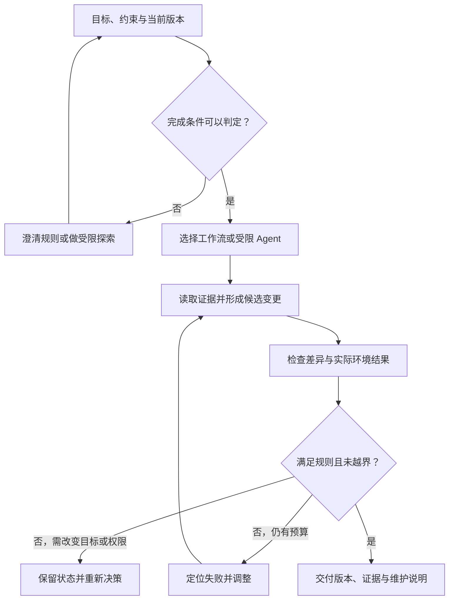

# Vibe Coding 与 AI 辅助研发全景

> 面向需要把 AI 纳入真实研发流程的开发者、项目负责人和技术管理者。读者应了解需求、仓库和测试的基本作用；读完能区分协作模式，按风险配置自主执行与验证，并判断一次 AI 辅助变更是否形成了可维护的交付。

## 从生成代码到交付软件

**AI 辅助研发**指在需求分析、设计、实现、检查和维护中使用模型及工具。它改变的是工作如何完成，交付对象仍是有运行环境、业务约束与维护责任的软件。产品自身是否调用模型，是另一件事：用 AI 编写一个普通命令行工具属于辅助研发；编写一个检索问答服务则同时涉及 [AI 应用开发](/software/specialized/ai-applications)。两者可以重叠，成本与风险应分别核算。

Vibe Coding 是一种非标准化的口语标签，不同讨论对其范围理解不同。本文用它描述“主要通过自然语言反馈和运行感受推动实现，对内部实现的持续理解较少”的方式。这是本文的操作性定义，不是认证等级。它可以帮助快速探索交互和可行性，但从原型转为长期系统时，需要补齐规则、版本、验证和交接。

模型依据输入生成候选内容；工具让这些内容影响文件、进程和外部系统。流畅解释、合理代码和成功工具调用，分别说明表达、候选实现和某个动作的状态，不能直接推出业务完成。例如配置导出工具时，文件成功写出，仍可能遗漏字段、采用错误编码或包含无权导出的数据。

GitHub 的责任使用说明提示，编程 Agent 可能生成错误或不安全代码，审查也可能漏报或误报。[官方责任边界](https://docs.github.com/en/copilot/responsible-use/agents) 该说明针对具体产品；各工具实际可用的命令、权限和保护机制，需要逐项确认。

## 自主程度与证据强度分别设计

**自主程度**是助手在不逐步征询的情况下能选择并执行多少动作；**证据强度**是交付结论得到多少可复核材料支持。高自主程度可以配合严格检查，低自主程度也可能产生未经验证的代码。按这两个维度设计流程，比把所有工具排成单一的能力等级更有用。

| 协作模式 | 主要控制方式 | 合适条件 | 必须补齐的判断 |
| --- | --- | --- | --- |
| 解释与候选建议 | 人选择方案并执行 | 学习代码、定位入口、比较实现 | 建议是否基于当前版本和真实约束 |
| 局部辅助编辑 | 限定文件或函数，逐段检查 | 目标明确、关联较少的修复 | 差异是否符合目标，邻近行为是否受影响 |
| 自然语言原型迭代 | 根据界面与试运行反馈调整 | 可丢弃实验、合成数据、快速探索 | 哪些行为是假实现，转交付需要补什么 |
| 受限 Agent 执行 | 在约定目录、工具和预算内连续工作 | 可判定完成、有验证环境的任务 | 执行边界、状态变化和验收证据 |
| 多 Agent 协作 | 分工、隔离、集成与统一验收 | 子任务可分、接口明确且协调收益可测 | 依赖和共享资源是否受控，组合结果是否成立 |

这些模式可以在同一项目切换。讨论不明确的业务规则时，应先澄清；规则确定后可以委托局部实现；验证暴露跨模块问题时，再扩展读取与修改范围。选择依据是当前任务，而不是默认让助手使用所有能力。

## 工作流与 Agent 的执行机制

**工作流**是预先安排的步骤与分支；**Agent**在这里指能依据目标和工具反馈动态选择后续动作的执行系统。Anthropic 的工程文章采用类似区分，并提醒复杂机制应以结果收益为依据。[工作流与 Agent](https://www.anthropic.com/engineering/building-effective-agents) 这是工程分类方法，工具界面上的名称未必严格对应。

固定任务适合清楚的流程：读取规范、生成候选、运行指定检查、汇总差异。未知缺陷可能需要动态搜索、形成假设和调整路径。动态选择增加适应性，也增加无效尝试与范围漂移的机会，因此必须有反馈和停止条件。

反馈要来自环境：检查实际文件和退出状态，读取应用响应或持久数据，确认资源是否存在。助手说“已完成”只是待核对的结论。无法确定外部写入是否成功时，应记录结果未知，查询状态后再决定重试，避免重复副作用。

## 生命周期中的四种交付物

研发协作可以围绕四种材料组织。这是本文提出的工程组织方式，不是某个工具的自动保证。

| 交付物 | 主要内容 | 缺失时的后果 |
| --- | --- | --- |
| 决策依据 | 目标、排除项、规则、兼容要求、待定问题 | 实现把模型猜测固化成业务规则 |
| 候选变更 | 对应基线的差异、新增依赖、接口与数据影响 | 审查者难以识别扩大范围和隐含变化 |
| 验证证据 | 当前版本、环境、步骤、输出、失败与未覆盖项 | 旧结果或计划被误当作当前版本已通过 |
| 接管材料 | 运行配置、版本来源、观察与恢复办法、维护责任 | 工具退出后系统无法持续运转 |

同一材料可以逐步完善，不必先写完整大文档。关键是规则有出处，修改可追踪，结果可复核，后续工作有接手入口。需求变化要更新决定和验收，而不是只在会话里补一句话，让下一个执行者继续使用旧条件。

### 一个导出功能的分阶段例子

以下是教学设计，未在真实项目中执行。某管理工具需要导出选中的配置项，只使用合成数据。第一阶段可以生成界面和固定样例，验证筛选操作是否清楚；交付时明确文件仍由假数据产生。

第二阶段接入实际存储，先固定字段、编码、空值和排序规则，明确使用者可导出的对象范围。AI 根据这些规则修改接口和页面，返回差异及依赖变化。第三阶段检查边界：无权限对象被拒绝；空结果符合约定；特殊字符正确转义；大批量输出符合已设定的资源限制。测试条件来自需求和格式契约，不能只从候选实现反推。

如果为了让下载成功，助手绕过了权限或一次加载所有数据，则运行表现改善而交付条件退化。审查应追踪实现变化的理由和结果，而不只是比较前后截图。后续部署与运行维护继续使用[发布与回滚](/software/delivery/release-rollback)和[系统接管](/software/maintenance/system-takeover)的工程流程。

## 效率应在完整任务上衡量

生成速度不等于交付速度。总耗时包含澄清、准备上下文、生成、执行检查、人工审查、返工和交接。AI 减少其中某部分，也可能增加另一部分。熟悉代码的人可能发现建议偏离惯例；陌生任务则可能受益于检索和解释，必须通过代表性任务验证。

METR 对早期 2025 年工具的随机研究包含 16 名熟悉相应成熟开源仓库的开发者、246 个任务；在该研究条件下，允许使用 AI 的完成时间平均增加 19%。[研究论文](https://metr.org/Early_2025_AI_Experienced_OS_Devs_Study-paper.pdf) 这个结果受样本、任务和当时工具约束，不能外推为所有开发者或当前工具的固定效果。它提示应测量实际交付时间，同时保留质量判断。

团队可以按任务类型比较完成率、人工介入、返工和审查时间。实验计划、成本口径与多次运行见[评测、成本与迭代](/software/ai-assisted/evaluation-cost)。不宜以生成行数、提交数量或模型自评作为采用依据。

## 将责任落实到角色和阶段

执行者负责在范围内实现并提供真实记录；需求负责人确认业务规则；审查者检查实现与风险；交付负责人确认部署条件和维护安排。一个人可以承担多个角色，但应明确每个判断依据。第二个模型可以帮助找问题，不能仅凭身份不同就成为独立验收。

| 信号 | 应采取的动作 | 继续工作的条件 |
| --- | --- | --- |
| 关键业务规则没有出处 | 标记待定，补证据或澄清 | 有明确规则及受影响的验收项 |
| 修复不断扩大文件与依赖范围 | 回看目标，拆分必要变化 | 影响可解释且预算已重新确认 |
| 通过检查依赖于删除断言 | 审查测试变化与需求依据 | 检查仍能拒绝原有错误行为 |
| 外部动作结果未知 | 查询实际状态并保留关联标识 | 能确认完成、失败或安全重试 |
| 无法解释剩余风险与运行方法 | 补交接材料与必要审查 | 接手者能复现并维护候选版本 |

更有效的 AI 辅助研发流程，应让错误更早暴露、范围更易控制、结果更易接管。模型选择和自动化程度可以变化，目标、证据与责任之间的关系仍应清楚。

## 参考资料

<Refs>

- [GitHub Docs：Application card — GitHub Copilot Agents](https://docs.github.com/en/copilot/responsible-use/agents)（访问日期 2026-10-03）——生成与审查能力的责任边界。
- [Anthropic：Building effective agents](https://www.anthropic.com/engineering/building-effective-agents)（访问日期 2026-10-03）——工作流、Agent 与机制复杂度。
- [METR：Measuring the Impact of Early-2025 AI on Experienced Open-Source Developer Productivity](https://metr.org/Early_2025_AI_Experienced_OS_Devs_Study-paper.pdf)（访问日期 2026-10-03）——特定任务与工具条件下的随机研究，非当前产品排名。
- 站内相关：[AI 编程与责任](/software/guide/ai-coding-responsibility) · [上下文与约束](/software/ai-assisted/context-constraints) · [任务与协作](/software/ai-assisted/agent-collaboration) · [代码验证](/software/ai-assisted/generated-code-verification) · [执行防护](/software/ai-assisted/sandbox-permissions) · [评测与成本](/software/ai-assisted/evaluation-cost) · [大语言模型](/ai/models/llm) · [Agent 框架](/ai/agent/frameworks) · [AI 应用开发](/software/specialized/ai-applications)

</Refs>
