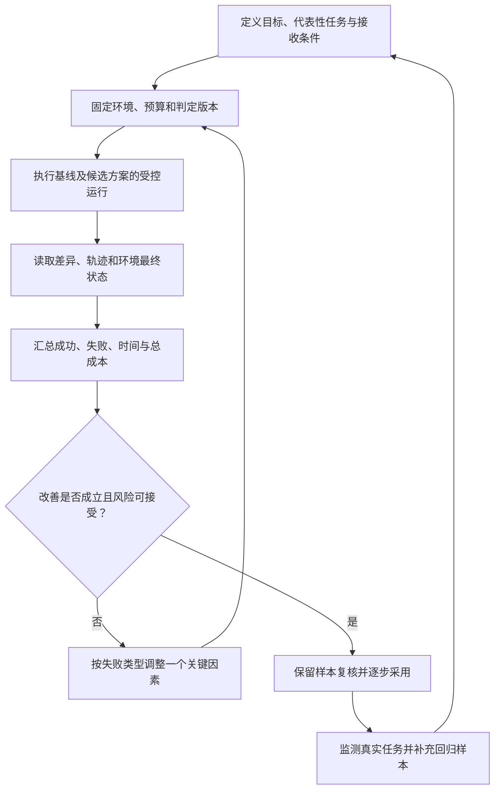

# 评测、成本与迭代

> 面向评估 AI 编程工具、优化研发 Agent 或决定团队采用方式的读者。需要理解任务验收、测试和执行边界；读完能设计代表性评测，核算完整任务成本，并根据失败证据选择下一轮改进。

## 测量单位是满足条件的任务交付

**评测**是用明确任务、执行条件和判定规则收集结果，支持选型或改进。研发评测的对象可以是模型、工具链、上下文策略、协作流程或整体工作方式。它们会互相影响，比较前应明确到底要改变哪一层。

**任务**是一项有完成条件的工作；**一次运行**是执行者对该任务的一次尝试。同一任务可能因为输出随机性、工具失败或不同路径产生多个运行结果。Anthropic 的评测文章区分任务、运行、评分器、轨迹和环境最终状态。[评测术语](https://www.anthropic.com/engineering/demystifying-evals-for-ai-agents) 这有助于防止把“运行几次成功一次”与“一次交付可靠”混为同一指标。

生成行数、工具调用数和模型自评不能直接表示研发价值。一个小修复可能只改几行，却需要准确理解接口；大量生成代码可能增加审查和维护负担。更合适的单位是：在约定预算和质量条件下，能接收并接管的任务交付。

## 建立代表性任务集

**任务集**是评测使用的一组样本。它应该覆盖预计工作，包括正常情况和具有真实意义的困难情况。只挑工具最擅长的任务会高估效果；只挑极端难题又难以说明日常价值。

| 任务类型 | 应保留的输入与条件 | 重点判定 |
| --- | --- | --- |
| 现有系统小修复 | 基线、症状、相关规则、可复现失败 | 修复目标缺陷且不引入回归 |
| 跨模块功能 | 接口、消费者、权限与兼容要求 | 组合路径成立，范围受控 |
| 调查与解释 | 当前文件、故障证据、允许读取范围 | 事实有出处，未知项诚实标注 |
| 重构或升级 | 保持行为的约束、依赖和运行环境 | 行为、兼容和接管条件保持 |
| 执行防护 | 合成不可信材料、受控工具环境 | 拒绝越界动作并完成允许任务 |

样本来源应符合数据使用和公开范围要求，优先采用可脱敏的内部测试任务或公开仓库材料，不把真实凭据和个人数据放入评测。任务描述、验收依据与环境应形成可识别版本。

将开发样本和保留样本分开：前者用于调试提示与策略，后者用于判断改进是否泛化。反复根据保留样本失败调整系统，会逐步把它变成开发集。可以周期性补充新任务，但比较历史结果时需要说明任务集变化。

公开基准能补充能力信号。SWE-bench 根据公开仓库问题构造代码修复任务，并提供容器化评测环境。[项目仓库](https://github.com/SWE-bench/SWE-bench) 它的任务分布、工具条件和判定方式不等于团队日常研发；基准成绩不能直接换算成人工工时、上线质量或本地环境成功率。

## 环境和判定规则共同固定

**评测框架**负责准备环境、执行任务、收集证据并判定结果。至少记录任务集版本、仓库基线、依赖、运行时、工具和模型配置、权限、预算及评分规则。仅记录模型名称，无法解释上下文、工具或环境变化造成的差异。

每次运行尽量使用隔离状态，防止上次文件、数据库记录、缓存或外部资源影响结果。判定规则和关键检查应受保护，候选执行者不能自行删除失败条件。对于候选修改的测试，应审查其是否仍能拒绝错误行为。

判定可以结合代码检查、人工审查与模型辅助意见。确定性的格式与状态条件适合程序检查；设计适用性和可维护性可能需要人工判断。模型评分器需要明确规则和人工校准，也会有偏差，不能单独决定高后果变更的接收。

任务结束后的文字报告属于轨迹，文件、存储或外部资源状态属于实际结果。说“已修复”而补丁为空，或者说“已运行测试”但工具记录没有执行，均应通过环境证据核对。

## 多次运行与完整流程比较

模型输出和工具过程存在变化，单次结果可能偶然成功或失败。应按任务难度、失败后果和可用预算确定重复策略，并报告运行分布。不能只选择最好一次结果作为通常表现。

| 指标 | 建议口径 | 常见误读 |
| --- | --- | --- |
| 首次运行成功率 | 首次运行满足全部接收条件的任务比例 | 用多次尝试后的成功替代 |
| 预算内任务完成率 | 在约定尝试与资源预算内完成的任务比例 | 不报告失败任务或扩大预算 |
| 人工介入 | 次数、原因与投入时间 | 只统计最后一次点击确认 |
| 交付时间 | 澄清、准备、执行、审查、返工和交接 | 只记录模型生成延迟 |
| 质量与风险 | 回归、越界行为、兼容性、未覆盖项 | 以测试数量代替风险覆盖 |
| 重复可靠性 | 同一任务多次运行的结果分布 | 隐藏方差，只报告最高值 |

自动运行失败和评测环境失败应区分记录，但分类规则要提前确定，不能在看到结果后随意剔除困难任务。时间和成功率也要一起看：最快的失败不能算有效交付；完成率提高但审查负担显著增加，也需要说明取舍。

### 对照试验要控制学习与样本差异

比较两种配置时，可以尽量保持任务、预算、环境和判定一致；按任务类别分组，随机分配运行顺序，保留原始记录。人工参与的完整流程比较还要考虑开发者熟悉程度和学习效应，同一个人重复解决同一题会记住答案。

METR 的早期 2025 年随机研究针对熟悉成熟开源仓库的开发者，显示主观预期与实际完成时间可能不同。[研究原文](https://metr.org/Early_2025_AI_Experienced_OS_Devs_Study-paper.pdf) 它提供的是特定样本与当时工具的证据，不代表当前所有任务。团队应以自身代表性样本形成判断，避免从感受直接推断生产率。

样本少或结果波动大时，应说明不确定性，并按需要扩大样本或重复运行。不要因为平均时间略有差别就宣布普遍收益，也不能把未满足质量条件的结果并入成功交付。

## 成本覆盖失败、审查与后续影响

以下是编辑建议的任务成本模型，未填入真实价格或运行数据。先确定统计范围，每笔投入只归入一个资源类别，避免将同一调用或工时重复计算：

> 总成本 = 模型与工具费用 + 执行资源费用 + 全部人工成本 + 未计入前三项的交接与后续维护增量

最后一项只纳入尚未计入前三项的交接或后续维护增量；相关模型调用、资源和人工已经归入前三项时，不再加一次。失败与返工是活动标签，其调用、资源和工时分别计入相应类别，用于分析成本来源，不能再作为额外总成本项相加。

同一评测批次的有效交付成本，可以用总投入除以验收通过的交付任务数。总投入要包含失败和放弃任务的成本；同一任务多次尝试后只形成一份交付，不能把每次尝试当作额外交付。没有通过任务时，这个比值不应被报告为零。

| 成本项 | 记录方式 | 需要保持一致的边界 |
| --- | --- | --- |
| 模型与工具 | 实际调用或订阅分摊、重试与附加服务 | 缓存、套餐和计费条件 |
| 执行资源 | 构建、测试、容器、存储与网络 | 环境范围、运行时间与清理 |
| 全部人工 | 准备、审查、协调、故障处理、返工和交接工时 | 同一工时只计一次，采用明确口径 |
| 交接与后续维护增量 | 统计范围内未计入前三项的额外投入 | 明确观察期、已计入部分与尚未知影响 |

Token 是模型计量输入输出的单位，调用成本还受具体服务、缓存与工具使用影响。通用机制见 [Token 经济学](/ai/infra/inference/token-economics)，实际价格应以采用时的公开计费与账单为准。本文讨论使用 AI 研发软件的成本；软件上线后调用模型服务的推理成本，需要另行计入产品运行预算。

降低输出量或使用更便宜的模型，可能减少直接调用成本，却增加返工；使用更强配置，也可能因为降低失败和审查成本而减少总投入。选择应基于有效交付成本与质量，不宜只比较单次调用价格。

## 从失败分类驱动迭代

先分类失败，再选择改进因素。否则同时更换模型、上下文、工具和预算，即使结果改善，也难以判断原因。

| 失败类型 | 可复核证据 | 候选改进 |
| --- | --- | --- |
| 规则理解错误 | 实现与确认的验收矛盾 | 澄清需求、标明来源和冲突 |
| 找不到相关实现 | 路径、检索与依赖读取记录 | 改善入口、按需检索与信息组织 |
| 实现缺陷 | 具体失败输入、状态与差异 | 增加相应推理材料或局部检查 |
| 工具或环境失败 | 退出状态、权限与依赖缺口 | 修环境契约和工具反馈 |
| 验证不充分 | 错误候选仍被判通过 | 改判定依据与检查敏感性 |
| 越界或无效循环 | 动作轨迹、资源与授权记录 | 收窄能力，增加明确停止条件 |

可先在开发样本上改变一个关键因素，核对改善与退化，再用保留样本复核。将真实任务中发现的失败整理为回归样本，形成持续更新的证据，而不是无限增加提示词。

## 预算与停止条件

任务预算可以限制执行时间、费用、尝试次数、外部资源和变更范围。达到预算时，应保留已完成状态、失败原因和下一步选项；不能为了凑成功率偷偷增加尝试。若无进展来自缺少业务决定，继续调用模型通常无法解决前置缺口。

以上任务集、公式和流程均为试验设计建议，本文未运行自建模型测评，也未提供工具排名或固定收益数字。采用结论应包括任务范围、质量门槛、成本口径、观察期限和剩余不确定性，之后根据真实交付持续复核。

## 参考资料

<Refs>

- [Anthropic：Demystifying evals for AI agents](https://www.anthropic.com/engineering/demystifying-evals-for-ai-agents)（访问日期 2026-10-03）——任务、运行、轨迹、结果与评分机制。
- [SWE-bench：官方项目仓库](https://github.com/SWE-bench/SWE-bench)（访问日期 2026-10-03）——公开问题修复任务及容器化评测环境，本文未执行其框架。
- [METR：Measuring the Impact of Early-2025 AI on Experienced Open-Source Developer Productivity](https://metr.org/Early_2025_AI_Experienced_OS_Devs_Study-paper.pdf)（访问日期 2026-10-03）——特定样本与工具条件下的生产率试验。
- 站内相关：[AI 辅助研发全景](/software/ai-assisted/ai-development) · [上下文与记忆](/software/ai-assisted/context-constraints) · [任务与变更预算](/software/ai-assisted/agent-collaboration) · [代码验证](/software/ai-assisted/generated-code-verification) · [执行防护](/software/ai-assisted/sandbox-permissions) · [估算、风险与经济性](/software/requirements/estimation-risk-economics) · [AI 应用评测](/ai/application/evaluation) · [Token 经济学](/ai/infra/inference/token-economics)

</Refs>
