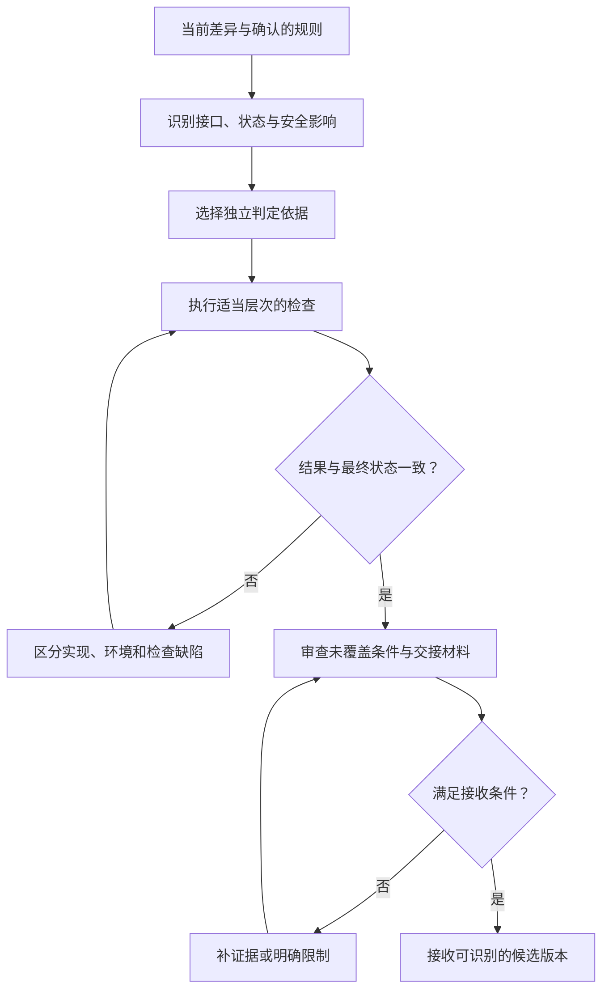

# AI 生成代码的验证与验收

> 面向审查 AI 代码、设计自动化检查或决定是否接收变更的开发者和验收者。需要了解接口与测试；读完能选择独立的判定依据，组合不同层次的证据，并识别检查通过仍不足以交付的情况。

## 验证的对象是当前候选版本

**验证**在本文指检查实现是否满足明确的规格与约束；**验收**指依据业务目标、质量条件和剩余风险决定是否接收交付。工具可以执行大量验证，验收仍需要明确的责任主体和判断条件。

AI 生成代码与人工代码都需要验证，AI 的特殊风险在于：同一执行者可能提出规则、写实现、生成测试、解释结果。如果这些环节共享一个错误假设，内部一致并不能证明满足需求。GitHub 的公开责任说明也提醒，生成和审查可能出错。[责任使用说明](https://docs.github.com/en/copilot/responsible-use/agents)

验证对象应包括候选代码、依赖、配置和相关数据状态。测试在某提交上通过，之后修改接口或配置，就需要判断哪些证据失效。结果记录不能只写“全部通过”，应能识别检查的版本和实际条件。

## 判定依据要独立于候选实现

**判定依据**是决定结果正确与否的规则或机制，也称测试预言机。它可以来自已确认业务规则、接口契约、标准格式、可信参考实现或不变量。独立意味着依据不能仅由待验证代码自己的行为产生，不要求每项检查都由不同的人或模型编写。

例如配置导出要求按标准字段顺序生成文件。若测试先调用导出函数，再把输出保存为“正确快照”，只能固定当前行为；当前字段顺序错了，也可能得到绿色结果。应从已确认格式建立期望，或者由独立解析器检查契约。

| 判定依据 | 能支持的结论 | 需要审查的边界 |
| --- | --- | --- |
| 已确认的验收条件 | 指定用户路径满足业务规则 | 条件是否遗漏异常和质量要求 |
| 标准或接口契约 | 格式、状态、兼容行为符合约定 | 适用版本和可选项是否一致 |
| 不变量 | 多种输入或动作后保持约束 | 约束是否足够描述目标 |
| 参考实现 | 在规定范围内行为一致 | 参考是否正确、是否共享缺陷 |
| 快照或黄金文件 | 输出与已审查样例一致 | 样例来源、变更审查与覆盖范围 |
| 模型审查意见 | 提供可进一步核查的问题线索 | 误报、漏报、共享假设与证据缺口 |

需求本身存在矛盾时，应先解决判定规则，不能让测试框架替团队决定业务。合法的需求调整可以修改测试，但应有独立的决定依据，并保留变更原因。

## 按风险组合证据

不同检查回答不同问题，不存在一项检查证明所有性质。类型检查不证明运行时外部输入合法；单元测试不证明真实存储语义；端到端演示不证明所有边界。验证计划应沿改动影响分配证据。



| 改动影响 | 优先证据 | 单独使用时的不足 |
| --- | --- | --- |
| 局部纯逻辑 | 边界用例、性质检查、审查 | 不涉及真实集成和状态 |
| 接口格式与错误行为 | 契约、消费者兼容检查 | 不证明授权与持久化 |
| 数据约束与迁移 | 真实存储集成、旧数据与并发检查 | 不证明界面与运行环境 |
| 用户操作路径 | 浏览器或客户端端到端检查 | 覆盖样本有限，可能绕过内部边界 |
| 权限与外部副作用 | 越权尝试、对象范围、状态与审计 | 需受控环境，避免产生真实影响 |
| 性能与恢复 | 代表性负载、故障与恢复实验 | 结论受工作负载和环境约束 |

低影响的可逆变化应选择与风险相称的检查；没有必要为每个文案改动创建大型测试套件。身份、资金、数据一致性等后果较大的路径，则需要相应专业审查和更强证据。

## 用不变量和状态序列补充样例

**不变量**是在约定状态和操作范围内必须一直成立的约束。**性质测试**检查一类输入满足某个性质；**状态化测试**生成或组织动作序列，检查状态转换和约束。Hypothesis 的状态化测试支持在每步后检查不变量。[官方机制](https://hypothesis.readthedocs.io/en/latest/stateful.html) 它扩大探索范围，但不自动提供正确的业务规则。

配置导入导出可以考虑一个性质：对允许的配置 `x`，在已定义的规范化规则下，解析导出的文件应得到等价数据。规范化可能约定字段排序和默认值；如果格式不保留注释，就不能同时要求注释完全一致。未经定义的“等价”会让测试随实现漂移。

以下是教学伪代码，未执行，不对应特定框架：

```text
对每组有效合成配置 x：
    y = 独立解析器解析(候选导出器导出(x))
    检查 y 与按契约规范化的 x 等价
对每组无效配置：
    检查明确拒绝，且原存储未发生不允许的变化
对一组导入、更新、导出、撤销操作序列：
    每步检查对象权限、唯一性和版本约束
```

往返一致仍可能遗漏双方共同采用错误格式的问题，因此应补独立格式样例和外部消费者检查。不变量也应包括允许的状态转换，不能只检查最后结果。例如失败导入后最终数据恢复了，但中间曾对外暴露无权限内容，最终相等仍不足以说明安全。

并发检查需要真正形成竞争条件。顺序执行两个请求无法证明并发处理有效；故障实验要明确注入点、观测与停止条件。数据库机制详见[事务、并发与索引](/software/data/transactions-indexes)，这里关注检查能否揭示相关风险。

## 让检查有能力拒绝错误版本

绿色结果需要结合检查敏感性判断。可以先确认修复前的版本能复现目标缺陷，再确认候选版本拒绝同样的错误。也可以在隔离副本中有意引入小缺陷，检查测试是否发现它。这种有意改变候选代码以观察检查能力的方法称为**变异测试**。

例如临时移除对象权限判断，越权检查应失败；改乱字段顺序，格式检查应失败。上述均为测试设计建议，本文没有执行变异。变异体还可能与原程序等价，或被无关错误拒绝，需要检查失败原因；单一分数不能证明测试完整。

测试与生产实现的变化应一起审查，尤其关注删除断言、扩大允许值、跳过失败分支和改写样例。为了规避误判，稳定验收条件和关键检查可以保存在受保护的流程中；执行者可提交修改建议，是否接收由负责者判断。保护检查并不意味着永远禁止修改，而是防止候选实现自行降低门槛。

## 核对环境结果，避免只相信文字

浏览器断言可以等待可观察状态。Playwright 的部分异步断言会在规定超时内重试，普通断言并不自动具有同样行为。[断言文档](https://playwright.dev/docs/test-assertions) 等待条件应对应真实完成状态，固定休眠或无限等待容易掩盖延迟与失败。

界面显示“保存成功”时，应确认存储及后续读取；工具输出“导出完成”时，应检查文件内容、权限对象和完整性；命令退出成功时，应核对测试是否实际被发现并执行。检查空集合、错误环境或旧缓存，都可能得到误导性的成功信号。

授权验证应直接请求服务端受控接口，而不只观察按钮。OWASP 建议在每个请求上执行授权检查。[授权原则](https://cheatsheetseries.owasp.org/cheatsheets/Authorization_Cheat_Sheet.html) 合成普通身份访问管理员功能、访问他人对象和更换对象标识等，可形成具体的拒绝证据；它们仍不代表完整安全审计。

### 建立当前版本的证据记录

一份最小记录应包含目标规则、候选基线和差异、工具或运行时版本、隔离数据、执行步骤、实际输出、失败与未执行项。不能在后续修复后继续沿用旧版本全部通过的结论。

| 状态 | 正确报告方式 | 后续判断 |
| --- | --- | --- |
| 已执行且通过 | 给出版本、条件和实际结果位置 | 仅支持覆盖范围内的结论 |
| 已执行但失败 | 保留失败条件、原因判断和复现材料 | 修复或说明与任务的关系 |
| 环境阻止执行 | 说明依赖、权限或工具缺口 | 交付方案，等待必要条件 |
| 尚未执行 | 标为待验证或教学步骤 | 不能算作通过证据 |
| 外部动作状态不明 | 保留标识并查询实际状态 | 确认后再决定重试或恢复 |

## 验收连接业务与维护

验收要同时查看功能规则、必要质量条件、差异范围、已知风险及接管能力。技术检查通过却没有配置说明和运行入口，交付仍可能无法被接手；性能检查未覆盖真实负载，应保留限制并安排后续验证。

常见失败包括只测正常路径、用候选输出生成所有期望、为了通过而放宽规则、把多个模型一致意见当作证明、将本地演示等同上线条件。应分别回到独立依据、检查敏感性、环境事实和实际交付边界。受理的是有明确证据与限制的版本，不能把“AI 保证没问题”当作验收材料。

## 参考资料

<Refs>

- [GitHub Docs：Application card — GitHub Copilot Agents](https://docs.github.com/en/copilot/responsible-use/agents)（访问日期 2026-10-03）——生成与审查的限制。
- [Hypothesis：Stateful tests](https://hypothesis.readthedocs.io/en/latest/stateful.html)（访问日期 2026-10-03）——状态动作、前置条件和每步不变量检查。
- [Playwright：Assertions](https://playwright.dev/docs/test-assertions)（访问日期 2026-10-03）——重试断言与超时边界。
- [OWASP：Authorization Cheat Sheet](https://cheatsheetseries.owasp.org/cheatsheets/Authorization_Cheat_Sheet.html)（访问日期 2026-10-03）——服务端授权检查原则。
- 站内相关：[验证与验收导读](/software/guide/verification-acceptance) · [质量策略](/software/quality/quality-strategy) · [测试层次](/software/quality/test-levels) · [用例与状态](/software/quality/test-cases) · [验收与回归](/software/quality/acceptance-regression) · [事务与并发](/software/data/transactions-indexes) · [评测与成本](/software/ai-assisted/evaluation-cost)

</Refs>
