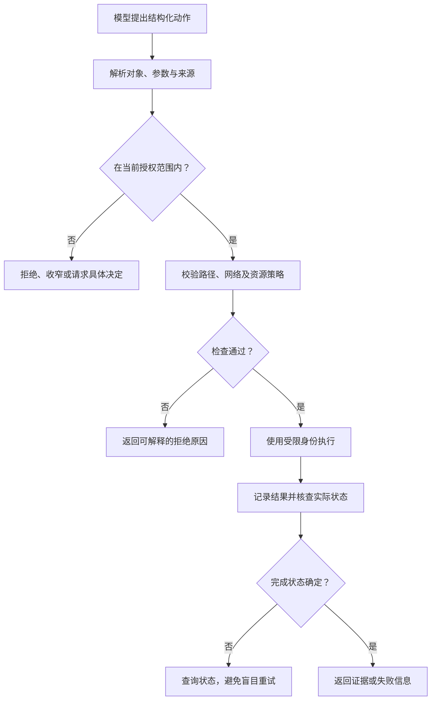

# 沙箱、权限与执行防护

> 面向允许研发 Agent 读取文件、执行命令和调用外部服务的开发者与平台维护者。需要理解进程、身份和网络；读完能按动作后果设计执行边界，识别常见绕过路径，并管理授权、审计和恢复。

## 防护对象是工具产生的实际后果

**沙箱**是对程序可访问资源与可执行动作施加限制的环境。**权限**决定某个身份对特定对象能做什么；**授权**是在任务和政策中允许特定动作。模型可以提出动作，但实际执行应由工具和环境依据已有授权判断。

研发 Agent 常接触代码、依赖说明、问题描述和日志，其中可能包含不可信输入。提示注入可能诱导它外发资料、修改规则或执行无关操作。OWASP 区分直接和间接提示注入。[风险说明](https://genai.owasp.org/llmrisk/llm01-prompt-injection/) 执行防护的目标是，即便模型错误解释材料，后果仍受到边界限制。

同时需要覆盖普通工程失误：路径写错、脚本删除范围过大、安装钩子运行代码、循环调用消耗费用，以及超时后重复外部写入。防护不能只识别“恶意提示词”，还应控制动作对象和状态。

## 把能力拆成可检查的动作

笼统的“允许终端”可能包含读取凭据、联网、写入任意位置和启动后台进程。应先列明任务需要的能力，再以最小权限提供。只读操作也可能泄露秘密或触发高成本查询，风险要结合数据与资源判断。

| 能力 | 主要风险 | 可落实的边界 |
| --- | --- | --- |
| 文件读取 | 密钥、个人数据或无关材料进入上下文 | 受控读取范围，敏感目录隔离 |
| 文件写入 | 覆盖其他工作、改变执行规则 | 限定目录和对象，保护关键控制文件 |
| 进程执行 | 脚本副作用、子进程、资源耗尽 | 受控身份、环境、执行时间与资源上限 |
| 网络读取 | 内网访问、重定向、资料外发 | 目的地与协议策略，网络层限制 |
| 外部写入 | 发布、发送、删除或付费行为 | 明确对象和参数，受限凭据与动作授权 |
| 权限管理 | 扩大执行者自身能力 | 独立的管理身份和具体变更审查 |

在预授权范围内的可逆编辑，可以连续执行并交付差异；后果较大的动作应符合已约定政策，必要时在具体结果可查看后取得决定。授权可以覆盖一组明确动作，不必对每次普通文件修改重复询问；超出范围时则应说明所需扩展和影响。

## 隔离要覆盖文件、进程、网络与身份

文件工作区隔离可以减少误覆盖，但共享目录以外还存在进程、设备、网络和凭据。Python 虚拟环境隔离包依赖，Git 分支或 worktree 隔离部分开发状态，这些都不能单独限制系统权限。

容器可以利用命名空间和资源控制等机制提供隔离。Docker 官方说明也提醒，挂载、能力配置与内核漏洞可能使隔离不完整。[容器安全边界](https://docs.docker.com/engine/security/) 将宿主敏感目录、控制接口或广泛权限交给容器，会改变实际边界；不能仅凭“在容器里运行”认定安全。

| 隔离层 | 应检查什么 | 不能据此推出什么 |
| --- | --- | --- |
| 文件视图与写入 | 可见目录、挂载、只读标记、写入目标 | 未挂载的秘密不会通过其他渠道进入 |
| 进程与系统能力 | 身份、子进程、设备、管理接口 | 隔离机制不存在漏洞 |
| 网络 | 出站、入站、内网、DNS 与代理规则 | 域名检查足以约束所有连接 |
| 凭据 | 作用域、有效期、是否进入模型输入 | 有受限凭据就不存在数据泄露 |
| 资源 | CPU、内存、磁盘、时间、并发与费用 | 超时必然终止所有外部工作 |

高后果或未知代码需要更强的隔离方式与专业评估。容器、虚拟机和工具代理的选择取决于威胁、宿主和运维能力；本文不给出跨环境通用的安全等级排名。通用架构复用 [Agent 安全与可靠执行](/ai/agent/security)。

## 工具端校验动作，而非相信自然语言

**执行代理**在这里指接收结构化动作、检查策略并调用实际工具的组件。它应验证对象、参数、身份和资源，记录结果，不能只检查模型是否说“已获得批准”。



读取的网页或日志可以影响问题分析，但不能修改执行策略。策略存储、权限扩大和批准记录应与普通任务文件区分管理，否则执行者可能通过改写控制文件给自己增加能力。

### 命令执行：参数结构也需要校验

拼接字符串交给 shell 会引入额外解析规则。Python 的子进程文档指出，其库不隐式调用 shell；显式采用 `shell=True` 时，调用方需要处理转义和 shell 注入风险。[安全说明](https://docs.python.org/3/library/subprocess.html#security-considerations) Windows 批处理等情况有平台差异，不能将单一平台经验当作保证。

在支持的场景，固定可执行程序并使用结构化参数，可以减少 shell 解析风险。但参数列表仍可能包含危险选项、任意目标或调用解释器的能力，因此还需验证参数语义和实际作用域。简单禁止几个命令名称，无法限制等价脚本、子进程或网络库。

以下为教学策略描述，未执行，也不是可直接部署的安全实现：

```text
允许动作：运行当前项目中已核实的指定检查。
对象限制：固定工作区；写入仅限批准的临时输出。
参数限制：由执行端构造约定参数，不接受任意命令字符串。
身份与环境：受限身份；不继承无关凭据。
资源限制：执行时间、输出大小和子进程生命周期受控。
结果：保留退出状态、必要输出及检查对象。
```

指定检查脚本本身也可能被修改，或运行依赖钩子。应核实它的来源和变化，不能因为名称是“test”就默认只读无副作用。依赖来源与制品信任见[供应链安全](/software/security/supply-chain)。

### 路径与网络：检查最终作用对象

路径字符串位于允许前缀下，不一定代表最终对象在边界内。相对路径、符号链接以及校验后对象变化，都可能影响实际解析。执行层要根据最终对象落实边界，必要时采用系统级限制；仅靠字符串匹配或先检查后无限制打开，不能形成充分防护。

网络也存在类似问题。域名、解析地址和重定向目标可能不同。OWASP 的 SSRF 防护资料讨论了允许列表、网络层限制以及重定向和 DNS 相关绕过。[SSRF 防护](https://cheatsheetseries.owasp.org/cheatsheets/Server_Side_Request_Forgery_Prevention_Cheat_Sheet.html) **SSRF**指服务被诱导向攻击者指定的地址发起请求。研发工具的网络代理同样需要考虑内网和敏感目标，不能只验证初始 URL。

具体策略应说明协议、目的地、重定向处理和外发数据类别，并由网络执行端落实。对互联网资料的读取权限，不能自动授权上传工作区文件。

## 凭据与批准都应有范围和生命周期

凭据优先通过受控执行组件使用，减少把原始值放进提示词、命令输出和任务摘要。短期或受限凭据仍要明确对象范围、失效时间与撤销方式。OWASP 的密钥管理资料讨论了访问控制、轮换和撤销。[密钥生命周期](https://cheatsheetseries.owasp.org/cheatsheets/Secrets_Management_Cheat_Sheet.html)

批准记录应对应动作、目标、参数与适用状态。例如批准发布某个候选版本，不代表批准随后自动生成的另一个版本；批准写入测试资源，不代表允许访问生产资源。长期授权可以保留，但仍需检查是否覆盖当前对象和后果。

若对象、版本或影响发生实质变化，应重新判断已有授权的适用性。请求决定前应先形成具体差异、执行计划和恢复条件，让负责者能够评估实际结果。禁止让模型凭空补出“用户已批准”，也不要将一次审批扩展成无限期的所有权限。

## 超时、审计与恢复

工具超时可能只表示调用方停止等待，远端任务仍在运行。对于有副作用的动作，记录关联标识，查询实际状态后再决定重试。需要重复执行时，采用服务支持的幂等或去重机制；没有机制就应保留未知状态并人工判断，不能把重发当作恢复。

审计记录应帮助回答：谁以何种授权、对哪个对象、使用哪些非敏感参数执行了什么，得到什么结果。日志还需要保护访问和保留期限。OWASP 日志资料建议避免直接记录访问令牌、密码等敏感值。[日志原则](https://cheatsheetseries.owasp.org/cheatsheets/Logging_Cheat_Sheet.html) “便于排查”不能成为完整保存密钥与个人数据的理由。

发现越界或凭据暴露时，应暂停受影响执行、撤销相关能力、检查实际状态并保留必要证据。代码可回退不代表外部数据和已发送信息可恢复；恢复计划应分别处理文件、数据、身份与外部副作用。删除日志也不能替代凭据撤销。

## 检查防护是否真的有效

在受控环境中，可以验证允许动作能完成、越界文件写入被拒绝、不允许的网络目标无法访问、受限身份不能扩大权限、超时后无遗留资源。上述是验证建议，本文未进行攻击或隔离测试。检查必须使用合成数据和明确目标，并说明机制与配置版本。

常见失效包括把提示词当作唯一防护、把工作树当作权限沙箱、允许任意 shell 但只过滤少数名称、挂载敏感目录、让批准不绑定对象、在失败时自动扩大权限。有效防护应能在模型提出错误动作时给出可解释的拒绝，并保留继续完成授权任务的路径。

## 参考资料

<Refs>

- [Docker：Docker Engine security](https://docs.docker.com/engine/security/)（访问日期 2026-10-03）——命名空间、能力、挂载与隔离边界。
- [Python：subprocess — Security Considerations](https://docs.python.org/3/library/subprocess.html#security-considerations)（访问日期 2026-10-03）——shell 调用与平台差异。
- [OWASP LLM01:2025：Prompt Injection](https://genai.owasp.org/llmrisk/llm01-prompt-injection/)（访问日期 2026-10-03）——不可信输入与执行风险。
- [OWASP：Server Side Request Forgery Prevention Cheat Sheet](https://cheatsheetseries.owasp.org/cheatsheets/Server_Side_Request_Forgery_Prevention_Cheat_Sheet.html)（访问日期 2026-10-03）——网络目标校验和纵深防护。
- [OWASP：Secrets Management Cheat Sheet](https://cheatsheetseries.owasp.org/cheatsheets/Secrets_Management_Cheat_Sheet.html)（访问日期 2026-10-03）——凭据访问、轮换与撤销。
- [OWASP：Logging Cheat Sheet](https://cheatsheetseries.owasp.org/cheatsheets/Logging_Cheat_Sheet.html)（访问日期 2026-10-03）——审计内容与敏感信息保护。
- 站内相关：[Agent 安全与可靠执行](/ai/agent/security) · [上下文与约束](/software/ai-assisted/context-constraints) · [配置与密钥导读](/software/guide/configuration-secrets-data) · [文件与权限](/software/foundations/files-paths-permissions) · [最小权限与审计](/software/security/secrets-permissions) · [供应链安全](/software/security/supply-chain) · [消息与幂等](/software/backend/messages-jobs-idempotency)

</Refs>
