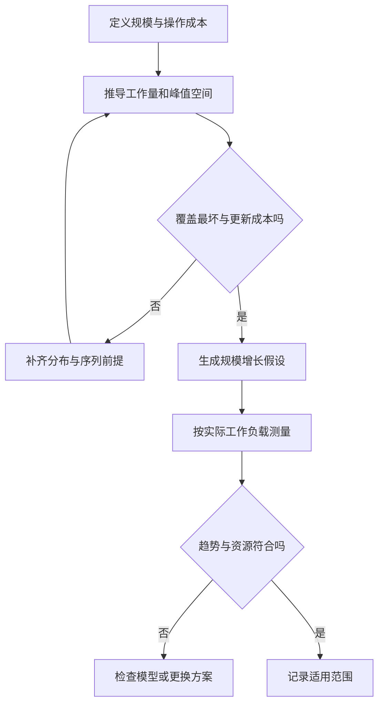

# 时间与空间复杂度

> 面向会读循环和函数、需要判断数据增长后程序表现的读者。读完能定义输入规模、推导主要操作次数，区分最坏、平均、期望与摊还成本，并将复杂度结论转化为可验证的性能假设。

## 复杂度回答数据增长时工作如何增长

**时间复杂度**描述算法所需工作量与输入规模的关系，**空间复杂度**描述所需存储量与规模的关系。这里的工作量通常是比较、读取、写入或算术操作次数，而不是秒数。相同算法在不同硬件、语言和数据表示下可能耗时不同；复杂度提供增长趋势，不提供无条件的响应时间承诺。

先定义“规模”。一份名单可以有 `n` 条记录，同时有总文本长度 `L`；一次批处理有 `q` 次查询；图有 `V` 个顶点和 `E` 条边。只说 O(n) 而不解释 n，可能把每条记录的扫描、网络请求或字符串比较藏起来。

分析还需要**计算模型**，即哪些基础操作按常数成本计。常见简化是假设机器字宽的数值运算、数组索引和单项搬移成本有界。任意精度整数的乘法、长字符串比较和从远端读取一个对象都不能自动套用这一假设。MIT 课程明确将 Word-RAM 模型与实际语言表示分开，这是解释复杂度结论的必要前提。[MIT 算法导论讲义](https://ocw.mit.edu/courses/6-006-introduction-to-algorithms-spring-2020/resources/mit6_006s20_lec1/)

## O、Ω 与 Θ 是界限，不是不同运行情形

对于非负成本函数 `T(n)`，**大 O**（Big-O）表示渐近上界：存在正常数 `c` 和起点 `n₀`，当 `n ≥ n₀` 时，`T(n) ≤ c·f(n)`，便可写 `T(n) = O(f(n))`。**Ω**表示相应下界；**Θ**表示上下界同阶。

若 `T(n)=3n²+5n+7`，其紧确增长阶是 Θ(n²)，也可以写 O(n³)，但后者没有充分表达已知信息。大 O 不是“最坏情况”的同义词：可以对最坏成本、平均成本或期望成本分别给出大 O 上界。阅读性能说明时，两类信息都要齐全。

| 常见增长阶 | 数据量增大意味着什么 | 典型机制及限定 |
| --- | --- | --- |
| O(1) | 操作次数不随所定义的规模增长 | 固定宽度数组的索引读取 |
| O(log n) | 每轮按固定比例缩小候选 | 支持随机定位的有序数组二分 |
| O(n) | 通常扫描输入或输出一次 | 无序名单的完整过滤 |
| O(n log n) | 多个线性工作层叠加 | 常见归并排序的比较与搬移 |
| O(n²) | 可能处理所有成对关系 | 对所有记录两两检查 |
| O(2ⁿ) | 候选随 n 指数增长 | 无剪枝地枚举 n 项的全部子集 |

常数项仍决定小规模下的实际表现。使用索引有分配和构建成本，在数据少、只查询一次时，线性扫描可能更合适；这不反驳渐近分析，只说明选择必须覆盖完整工作负载。

## 用三种机制推导，而非数循环层数

### 扫描、两两比较与单调指针

对 `n` 项逐项检查，每项花常数工作，合计 Θ(n)。如果第 `i` 项要与之前 `i` 项比较，总次数是：

```text
0 + 1 + 2 + … + (n - 1) = n(n - 1) / 2
```

因此是 Θ(n²)，不是因为看见了“两层循环”，而是计算了各轮的工作。相反，两个循环嵌套时，如果内层指针只前进、不回退，整个执行过程中最多前进 n 次，总成本仍可能是 Θ(n)。遇到提前退出，还要分别描述最坏输入和命中较早的输入。

这一区分能帮助检查库调用：循环内部的 `contains`、切片或复制也有自身成本。若每轮都复制不断增长的列表，总搬移量同样可能是二次增长，表面只有一个循环。

### 二分与分治

二分每轮将候选数量大致减半。做 `k` 轮后剩余量约为 `n/2ᵏ`，减到常数量级需要 `k=Θ(log n)`。该结论要求每轮比较和定位中点成本有界；若中点要从链表头重新遍历，操作次数会发生变化。

归并排序将数据分成两半，各自排序后线性合并。递推式为 `T(n)=2T(n/2)+Θ(n)`：同一层的片段长度总和为 n，约有 log n 层，所以总成本 Θ(n log n)。这是对常见归并流程的分析，不代表所有名为 `sort` 的库函数都采用这个流程。[MIT 排序讲义](https://ocw.mit.edu/courses/6-006-introduction-to-algorithms-spring-2020/resources/mit6_006s20_lec3/)

### 动态数组的总成本

考虑一个容量满后翻倍的示意动态数组，从空数组连续追加 n 项。普通追加共做 n 次写入；扩容搬移量形成 `1+2+4+…` 的几何级数，最后一项小于 n，总搬移量小于 2n。因此总工作 O(n)，每次追加的**摊还成本**为 O(1)。

这不是“随机输入通常很快”，而是对整段操作序列的总成本保证；单次扩容仍可能做 Θ(n) 工作。这里的翻倍用于推导，具体标准库未必使用该增长倍数。若收缩和扩张阈值挨得太近，反复增删还可能触发频繁搬移，需将整段序列一起分析。[MIT 动态数组与摊还讲义](https://ocw.mit.edu/courses/6-006-introduction-to-algorithms-spring-2020/resources/mit6_006s20_lec2/)

## 最坏、平均、期望与摊还分别约束什么

| 分析方式 | 描述对象 | 使用时要问什么 |
| --- | --- | --- |
| 最坏情况 | 同等规模所有合法输入中的最大成本 | 合法输入是否含高度重复、坏顺序或恶意构造 |
| 平均情况 | 指定输入分布下的平均成本 | 分布是否公开，实际数据是否接近 |
| 期望成本 | 对已定义随机性取期望 | 随机性来自算法还是输入，攻击者能否影响 |
| 摊还成本 | 一段操作序列的总成本分摊 | 序列和初始状态是什么，单次延迟是否重要 |

哈希查找的期望 O(1) 需要分布或随机哈希等前提，也要控制负载和处理碰撞；动态扩容还会引入摊还因素。因此“期望摊还 O(1)”中两个限定都有意义。它不等于最坏固定延迟，也不意味着读取任意长度键不收费，见[数据结构选择](/software/algorithms/data-structures)。

针对互异键的标准随机化快速排序，可以在对算法随机选择取期望的条件下获得期望 O(n log n)，但普通快速排序仍有二次最坏情况。大量重复键还需核对分区规则，随机选枢轴本身不保证处理重复键高效。[Princeton 快速排序课程](https://algs4.cs.princeton.edu/23quicksort/) 需要明确延迟上界的系统，应核查库是否通过混合算法等机制限制坏情况，而非只引用算法名字。

## 下界也有适用模型

在仅通过比较判断顺序、元素互异的排序模型中，n 项存在 n! 种排列。若每次比较只有两个分支，深度 k 的决策树最多区分 2ᵏ 种结果；为了区分全部排列，必须有 `2ᵏ ≥ n!`。于是最坏需要 Ω(log(n!))，即 Ω(n log n) 次比较。

这不意味着所有排序都无法做到线性。计数排序利用有限整数键域，典型工作为 O(n+u)、空间与键域大小 u 有关；基数排序还要计算位数和每轮成本。它们使用的操作与比较模型不同，也有数值范围、表示和空间前提。[MIT 线性排序讲义](https://ocw.mit.edu/courses/6-006-introduction-to-algorithms-spring-2020/resources/mit6_006s20_lec5/)

另一种下界来自输出：要求返回 k 条结果，仅把它们写出就需要与 k 成比例的工作。范围查找的定位可能是 O(log n)，但返回结果的总成本通常还含 O(k)。要求枚举所有组合时，输出本身就可能指数增长，不能期待靠更聪明的容器消掉这些工作。

## 空间要按峰值和对象生命周期计算

空间分析先说明是否包含输入和输出。**辅助空间**只算算法额外工作区；**总空间**还包含输入、输出及其他同时存活对象。某算法辅助空间 O(1)，并不表示一个包含大量数据的进程只占常数内存。

递归调用保存栈帧。递归深度为 d 时，若每帧大小有界，栈空间为 O(d)；每帧又复制子数组时，还要计算这些副本是否同时存活。常见归并排序实现的辅助缓冲可为 O(n)，但“原地排序”一词也不保证没有递归栈或库内部临时区。

流式处理可减少同时持有的输入，却仍可能需要去重集合、输出缓冲和排队数据。哈希索引把重复扫描改成快速定位，可能增加 O(n) 存储；内存不足后出现换页或无法分配，实际耗时会越过简单模型的边界。内存回收机制见[操作系统、进程线程与内存](/software/foundations/operating-systems-processes-memory)。

## 将分析变成工程决策

假设数据稳定，一次排序后进行 q 次二分，符号总成本约为 `n log n + q log n`；每次直接扫描则约为 `qn`。比较应包含排序、索引存储及后续更新。数据持续变化时还要加维护成本；如果只做按键相等查询，候选方案又可能是哈希索引。这里没有测出一个通用的“超过多少条就换算法”阈值。



| 当前判断 | 更合适的下一步 | 不应推出的结论 |
| --- | --- | --- |
| 热点做所有两两比较 | 检查能否排序、索引或减少候选 | 改用某语言就能解决增长阶 |
| 大 O 相同，耗时不同 | 检查常数、布局、分配和 I/O | 复杂度分析没有价值 |
| 追加平均很快，偶发卡顿 | 检查扩容和单次延迟要求 | 摊还 O(1) 已保证实时性 |
| 样本趋势接近线性 | 扩大规模并覆盖坏输入 | 已证明任意输入都是 O(n) |
| 索引减少查询时间 | 测总流程和峰值内存 | 预处理、更新和空间免费 |

规模翻倍时，线性、二次或 n log n 模型给出的工作比率不同，可作为实验假设；运行时缓存、并行和固定开销会干扰观测，有限样本也不能证明渐近界。具体实验设计见[正确性、测量与算法优化](/software/algorithms/correctness-optimization)。

## 参考资料

<Refs>

- [MIT 6.006：Lecture 1 — Introduction](https://ocw.mit.edu/courses/6-006-introduction-to-algorithms-spring-2020/resources/mit6_006s20_lec1/)——规模、渐近记号与 Word-RAM；已阅读原始 PDF（访问日期 2026-10-03）
- [MIT 6.006：Lecture 2 — Data Structures](https://ocw.mit.edu/courses/6-006-introduction-to-algorithms-spring-2020/resources/mit6_006s20_lec2/)——动态数组的整段成本与摊还边界；已阅读原始 PDF（访问日期 2026-10-03）
- [MIT 6.006：Lecture 3 — Sorting](https://ocw.mit.edu/courses/6-006-introduction-to-algorithms-spring-2020/resources/mit6_006s20_lec3/)——递推与归并排序分析；已阅读原始 PDF（访问日期 2026-10-03）
- [MIT 6.006：Lecture 5 — Linear Sorting](https://ocw.mit.edu/courses/6-006-introduction-to-algorithms-spring-2020/resources/mit6_006s20_lec5/)——比较排序下界、整数键域与线性排序前提；已阅读原始 PDF（访问日期 2026-10-03）
- [Princeton Algorithms：Quicksort](https://algs4.cs.princeton.edu/23quicksort/)——随机化与二次最坏情况（访问日期 2026-10-03）
- 站内相关：[工程数学与度量基础](/software/foundations/engineering-math-measurement) · [看懂软件项目全景](/software/guide/software-project-overview) · [常用数据结构的工程选择](/software/algorithms/data-structures) · [搜索、排序与字符串处理](/software/algorithms/search-sort-strings) · [正确性、测量与算法优化](/software/algorithms/correctness-optimization)

</Refs>
