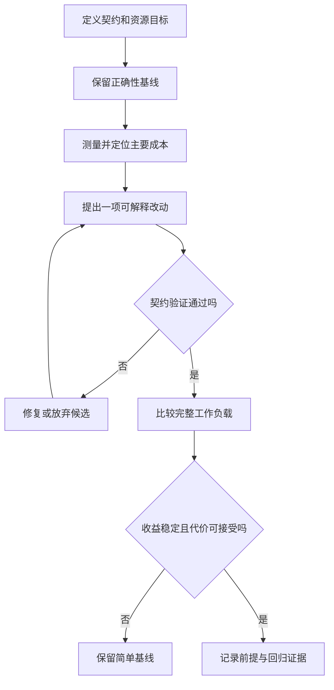

# 正确性、测量与算法优化

> 面向准备修改算法、评审 AI 生成实现或解释性能结果的开发者。读完能把正确性契约、不变量、测试和测量串成一条证据链，判断优化是否保持行为，以及局部加速能否改善实际工作负载。

## 优化先要有可比较的目标

**算法正确性**是实现对规定输入给出符合契约的输出，并满足规定的副作用和结束行为。**优化**是在保留这些要求的前提下，减少时间、空间或其他资源消耗。跳过校验、漏掉重复项、少返回结果都可能更快，但只有契约明确允许这些变化时，才是合法方案。

先写清输入范围、预期输出、异常、顺序、是否修改输入和资源限制。例如“从记录中去重”仍不完整：依据哪个键，保留首次还是末次记录，是否保持顺序，缺失键怎么处理？近似算法还要规定误差或失败概率；浮点计算要规定数值容差，不能以“看起来差不多”替代验收。

性能目标也要绑定任务：一次离线导出总耗时、服务请求尾延迟、批量处理吞吐或峰值内存是不同指标。优化某个循环与优化完整请求不是同一个实验。需求约束见[验收标准](/software/requirements/acceptance-criteria)，增长趋势见[时间与空间复杂度](/software/algorithms/complexity)。

## 从不变量解释为什么会得到正确结果

**前置条件**描述算法运行前必须满足的要求，**后置条件**描述结束后必须满足的结果。**循环不变量**是每轮开始仍成立的关系。证明通常包括初始化、保持、退出后的结果，再补上终止性：例如找到一个非负整数度量，每轮至少减少一，因此循环不能无限持续。仅有下界的实数严格递减并不足以证明终止。前三部分只说明“如果结束就正确”，加上终止才形成完整论证。[Cornell 循环不变量课程](https://www.cs.cornell.edu/courses/cs2112/2019fa/lectures/loopinv/)

以下去重过程是未执行的伪代码示意。假设输入为有限、不变的记录序列，每条记录有有效且稳定的键，键的哈希与相等规则一致，单线程运行；目标是保留每个键首次出现的记录，并保持其输入次序。

```text
seen = 空集合
out = 空序列
for record in input:
    k = key(record)
    if k 不在 seen:
        out 追加 record
        seen 加入 k
return out
```

处理完前 i 项后，不变量为：`seen` 恰好包含这些项的键；`out` 恰好包含这些键各自的首次记录，次序与输入一致。开始时前缀为空，关系成立。若下一项的键已见过，跳过不会改变首次记录；若没见过，追加它并加入键，使关系对新的前缀继续成立。遍历有限序列后，前缀就是全部输入，因此得到后置条件。

剩余未处理项每轮减少一，提供终止依据。实际代码还要处理内存不足、键提取失败或输入被修改等运行条件；论证不能把这些问题自动消除。若改成并发执行，“查集合、追加、加键”也不再天然是一个原子步骤，需重新建立同步与顺序契约。

这类说明并非要求每段业务都写形式化证明。本文的工程建议是对容易出错的边界、排序和状态更新记录关键不变量，让评审能指出究竟哪一步依赖何种前提。只写“应该不会重复”无法支持这种检查。

## 测试查反例，不能代替完整契约

**测试预言**是判断结果是否正确的依据。它可以是明确结果、输出性质或较简单的参考实现。若把待测算法原样复制成参考实现，二者可能共享同一个缺陷。

| 方法 | 可以提供的证据 | 实际边界 |
| --- | --- | --- |
| 具体示例 | 某些输入和状态符合预期 | 少量正常样本不代表所有输入 |
| 边界与分类测试 | 空值、重复、极值和错误分支被覆盖 | 分类可能仍漏掉重要维度 |
| 性质测试 | 自动生成输入检验普遍性质 | 生成范围和性质本身必须正确 |
| 差分测试 | 与独立、较简单的实现对照 | 参考实现不是无条件真理 |
| 不变量与证明 | 在明确模型和前提下推出性质 | 要确认代码与模型一致 |

**性质测试**描述一类输入应满足的关系，再由工具生成样本。Hypothesis 的官方教程展示了生成列表并与排序结果对照的做法，也通过 NaN 说明输入域会改变“正确排序”的定义。工具不会替作者决定业务如何处理 NaN 或缺失键。[Hypothesis 官方教程](https://hypothesis.readthedocs.io/en/latest/tutorial/introduction.html)

对去重示例，有价值的性质包括：输出中键唯一；输出键集合与输入一致；每项确为对应键的首次记录；首次记录次序保持。再去重一次不改变结果，是**变形关系**的一种，即输入或过程经过某种变化后，输出应遵循指定关系。

只检查“再做一次不变”仍不充分：一个总返回空序列的错误实现也满足它。排序同样要同时验证有序和记录及重复次数不变。图的拓扑结果要验证所有节点恰好出现一次，且每条边保持先后，而不是与一种可能顺序逐字比较。

输入策略应包含空集、单项、全相同、全不同、相邻与远距离重复、长键和规模突增。对非法输入另验异常契约，不能为了测试通过随意从合法域中排除难例。保存发现的反例作为回归样本，但不要把工具运行过一次描述为全空间证明。

## 基准的工作必须与真实任务相同

**基准测试**在指定条件下测量实现成本；**性能分析**用于定位成本花在哪里。两者结合才能区分“某行看起来复杂”与“它确实是当前瓶颈”。微基准可以隔离一个操作，完整场景测量则包含调用链和资源竞争。

对去重候选方案，可以比较“逐项扫描已有结果”和“使用哈希集合”。实验计划应同时改变记录数 n、键总长度 L 和重复分布，测总处理时间与峰值内存。理论上前者可能有二次比较，后者在哈希条件成立时减少比较，却会保存索引。这里没有实际执行或测得加速倍数。

| 工作负载维度 | 为什么影响结论 | 记录方式 |
| --- | --- | --- |
| 规模与键长度 | 改变比较、哈希、分配与缓存行为 | n、总长度、长度分布 |
| 重复与命中分布 | 决定提前返回和索引规模 | 全不同、集中重复、命中位置 |
| 数据生命周期 | 决定预处理能否摊分 | 一次任务或重复查询，更新频率 |
| 冷态与热态 | 影响装载、JIT 和缓存 | 分别报告首次与稳定运行 |
| 并发与资源限制 | 改变竞争、等待和内存压力 | 线程／请求数、配额及失败 |

必须计入所声称任务的完整工作。若比较“建立索引再查询”与扫描，不能把前者的索引构建隐藏在计时之外，却声称整个任务更快；只测复用索引的查询阶段也可以，但结论应写明复用条件。

基准输入每轮要符合预期状态。原地排序会改变数组，第二轮可能已经有序；生成器只创建而未消费，可能根本没有完成工作；异步请求只发出而未等待，会测到派发时间。验证结果、等待实际完成，才能知道测的是正确且完整的任务。

## 时钟、预热与统计要回答具体问题

**墙钟时间**描述现实经过的时长，包含等待；**CPU 时间**描述处理器为进程或线程实际工作的时间；内存分配量与峰值存活内存也不是同一指标。选择指标前应先确定目标，不能用 CPU 降低证明用户等待缩短。

Python `timeit` 默认采用 `perf_counter`，把准备步骤排除在主计时外，并在计时期间默认暂时关闭垃圾回收。官方说明指出这可改善微测量的可比性，也可能遗漏实际任务的重要成本。它对最小值的建议针对隔离小代码片段的干扰判断，不能直接用来报告服务尾延迟。[Python timeit](https://docs.python.org/3/library/timeit.html)

编译、JIT、缓存、频率变化和后台工作都可能影响结果。预热若用于研究稳定状态，应注明被排除的首次成本；若研究启动，就应保留它。多次独立运行、交错比较候选方案并保存原始记录，有助于识别环境漂移。不要把一次最快值或四舍五入后的小差异当成稳定收益。

优化编译器可能删除未使用结果或折叠已知计算，导致微基准没有执行预想工作。Google Benchmark 提供相关辅助接口，但其文档也说明 `DoNotOptimize` 不阻止表达式内部的全部优化。使用工具时仍须检查输入是否在运行时产生、输出是否被正确消费，以及是否测了无意的固定常量。[Google Benchmark 指南](https://google.github.io/benchmark/user_guide.html)

报告至少应保留版本、构建配置、机器和资源条件、输入生成规则、计时边界、样本数量及离散情况。服务延迟分位数描述请求分布，需要足够样本并包含失败和超时；离线批次的多次总耗时是另一种统计对象。性能测试的负载模型见[性能、负载与可靠性测试](/software/quality/performance-reliability-tests)。

## 局部收益受整体占比约束

设原任务总成本归一为 1，待优化部分占比 p，满足 `0 ≤ p ≤ 1`；改进后这部分的速度变成原来的 s 倍，`s ≥ 1`，其他成本不变。新总成本是 `(1-p)+p/s`，整体加速比为：

```text
S = 1 / ((1 - p) + p / s)
```

当 `p < 1` 且 s 趋于无限大时，收益上限为 `1/(1-p)`。这是 Amdahl 思路在局部优化上的理想化表达：如果排序只占总请求的一小部分，即使排序很快，网络或数据库等待仍会限制整体改进。官方并行计算资料以固定规模任务说明了这一占比边界。[NVIDIA Amdahl 说明](https://docs.nvidia.com/cuda/cuda-c-best-practices-guide/index.html#strong-scaling-and-amdahls-law)

公式假设工作负载和其他部分不变，没有新增同步、数据传输或缓存维护成本。真实优化可能移动瓶颈，也可能因内存增加改变其他成本，因此要重新测完整任务，不能把局部测得的 s 直接作为用户可见收益。

## 每轮只改变一个可解释的因素



| 发现 | 优先候选改进 | 新增代价与验收 |
| --- | --- | --- |
| 重复计算相同派生值 | 预计算或缓存 | 缓存键、失效、内存及结果一致性 |
| 重复扫描找键 | 哈希或有序索引 | 构建、更新、碰撞及生命周期 |
| 为前 k 项做全量排序 | 选择或堆 | 相同分值次序与结果完整性 |
| 大量复制和临时对象 | 复用缓冲或流式处理 | 输入别名、对象生命周期、错误恢复 |
| CPU 有独立批次任务 | 有界并行 | 竞争、顺序、取消与额外开销 |

可接受结果不必总是“更复杂的方案”。当收益落在噪声范围、只对无关输入有效，或需要难以维护的缓存协议时，保留简单基线是有证据的选择。近似、并行和缓存都必须在契约中获得允许，并在新的失败模式下验收。

局部算法证明也不能代替整个系统验证。报名容量和重复写入涉及共同状态、事务和权限，即使内存去重函数正确，服务仍可能在并发下接受两次报名。跨边界问题见[事务、并发与索引的应用选择](/software/data/transactions-indexes)与[AI 生成代码的验证与验收](/software/ai-assisted/generated-code-verification)。

## 参考资料

<Refs>

- [Cornell CS 2112：Loop invariants](https://www.cs.cornell.edu/courses/cs2112/2019fa/lectures/loopinv/)——初始化、保持、后置条件与终止证明（访问日期 2026-10-03）
- [Hypothesis：Introduction to Hypothesis](https://hypothesis.readthedocs.io/en/latest/tutorial/introduction.html)——生成输入、差分检查与输入域的影响（访问日期 2026-10-03）
- [Python：timeit](https://docs.python.org/3/library/timeit.html)——计时器、准备步骤、垃圾回收与重复计时边界（访问日期 2026-10-03）
- [Google Benchmark：User Guide](https://google.github.io/benchmark/user_guide.html)——预热、重复、结果报告与编译优化影响（访问日期 2026-10-03）
- [NVIDIA CUDA Best Practices：Strong Scaling and Amdahl's Law](https://docs.nvidia.com/cuda/cuda-c-best-practices-guide/index.html#strong-scaling-and-amdahls-law)——固定任务的整体收益边界；本文局部优化公式为同一占比机制的符号推导（访问日期 2026-10-03）
- 站内相关：[验证与验收成果](/software/guide/verification-acceptance) · [时间与空间复杂度](/software/algorithms/complexity) · [搜索、排序与字符串处理](/software/algorithms/search-sort-strings) · [树、图与依赖关系](/software/algorithms/trees-graphs) · [测试用例、边界、状态与数据](/software/quality/test-cases) · [性能、负载与可靠性测试](/software/quality/performance-reliability-tests)

</Refs>
