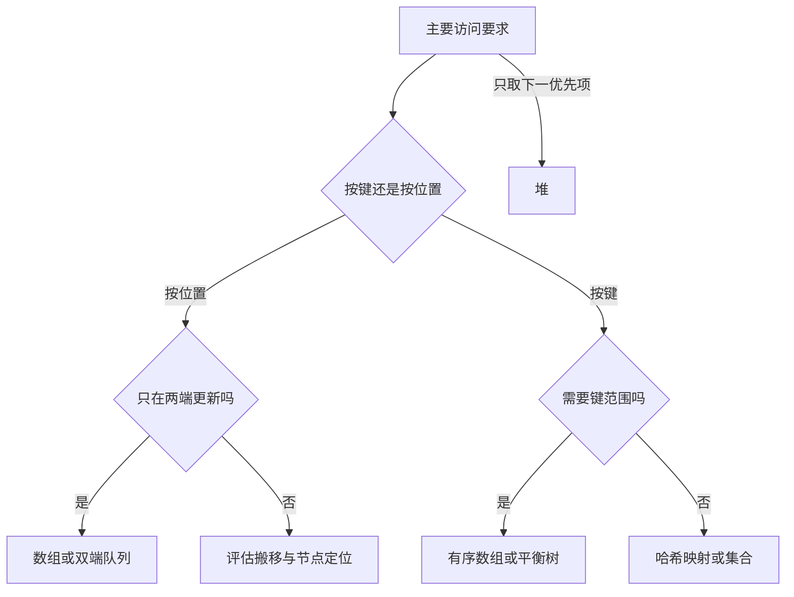

# 常用数据结构的工程选择

> 面向能够读懂变量、循环和函数的开发者，以及需要评估性能方案的读者。读完能按操作、顺序、规模和生命周期选择数据结构，解释查找与更新的代价，并识别“用了集合就不会重复”“用了队列就不会丢任务”等错误推断。

## 先描述需要什么操作

**数据结构**是数据的组织表示及其配套操作，例如数组中的位置读取、映射中的按键查找。**抽象数据类型**描述对外承诺的操作与语义；它不必指定内部布局。同样叫“队列”，既可以由数组环形缓冲区实现，也可以由链式节点实现，两者的内存和扩容行为可能不同。[MIT 数据结构讲义](https://ocw.mit.edu/courses/6-006-introduction-to-algorithms-spring-2020/resources/mit6_006s20_lec2/)

选型前应写出工作负载：数据有多少，是否持续增长，常做按位置读取、按键查找、遍历还是删除；顺序是输入顺序、键值顺序还是优先级；是否允许近似结果、丢弃旧数据或暂停处理。操作比例会改变选择，不能只拿一个查找复杂度比较整个方案。

例如，一份导出名单需要按报名时间展示，又需要按报名标识定位取消项。这是两个访问要求。一个数组方便有序遍历，却不自动提供快速按标识查找；一个哈希映射方便定位，却不自动提供业务要求的排序。可以组合结构，但要同时承担一致性成本。

## 顺序结构：连续槽位与节点连接

### 数组与动态数组

数组把元素放在可按索引计算位置的槽位中。固定宽度槽位允许直接定位第 `i` 项，通常不必先读取前 `i` 项。槽位可能存数值，也可能存对象的引用；“数组连续”不意味着所有被引用的对象也连续。

在保持序列顺序的前提下，向中间插入或删除需要移动后续元素，代价随移动数量增长。**动态数组**通过预留容量避免每次追加都分配新区域，空间满时再扩容并搬移。一次扩容可能做线性工作，连续追加的总成本则可以摊分；这叫摊还分析，不是每次追加都具有固定延迟，详见[时间与空间复杂度](/software/algorithms/complexity)。

连续布局通常有利于顺序访问和缓存利用，但具体收益受元素表示、运行时和硬件影响。删除大量对象后，容器容量是否收缩、内存何时归还，也要查具体实现，不能从“元素数量变小”推断进程占用立即降低。

### 链表与双端队列

链表在节点之间保存连接。已取得目标节点及所需邻接节点时，插入或删除可以通过少量连接修改完成；如果只有“第几项”或“某个值”，先找到节点仍可能需要线性遍历。额外连接、节点分配和间接访问也有代价，因此“频繁删除就必选链表”缺少位置获取这一前提。

**栈**按后进先出取数据，适合回退历史和显式遍历；**队列**按先进先出取数据，适合等待处理的任务；**双端队列**允许两端插入和移除。它们描述访问语义，不等同于持久化或线程同步机制。

Python 官方文档明确区分了 `deque` 的两端操作与 `list` 的头部移除：后者会移动后续内容。文档还说明，设置 `maxlen` 的双端队列满后追加会从另一端丢弃旧项。这适合保留最近记录，却不能直接作为“任务绝不丢失”的待办队列。[Python collections](https://docs.python.org/3/library/collections.html#collections.deque)

## 按键查找：相等规则比名称更重要

**映射**把键对应到值，**集合**只关心某个键是否存在。哈希实现先用**哈希函数**把键映射到有限的桶或槽，再用相等判断确认命中。不同键落到同一位置叫**碰撞**，碰撞必须被正确处理，不能把“哈希值相同”当成“业务对象相同”。

常见处理方式包括在桶中存多项、按探测规则寻找其他槽位。查找的平均或期望成本取决于键分布、碰撞处理和**负载因子**，即元素数量与桶或槽数量的比例。负载增长后可能需要重新分配并重排。MIT 哈希讲义分别说明了碰撞、均匀分布假设和扩容摊还，不能将其压缩成无条件的“所有操作都是 O(1)”。[MIT 哈希讲义](https://ocw.mit.edu/courses/6-006-introduction-to-algorithms-spring-2020/resources/mit6_006s20_lec4/)

工程上至少核对三件事：键如何判断相等，键的哈希是否与相等规则一致，键在存入后是否会改变。用含可变字段的对象当键，再修改这些字段，可能使查找规则失效；Java 的 `Map` 契约明确提示了这一边界。[Java Map](https://docs.oracle.com/en/java/javase/21/docs/api/java.base/java/util/Map.html) 复合业务键应使用明确的元组或规范编码；简单拼接可能把 `("ab", "c")` 与 `("a", "bc")` 都变成同一个字符串。

具体库的保证不同。例如 Java `HashMap` 的文档把基本操作的常数时间表现限定在哈希分布适当的条件下，不保证遍历顺序，也不提供默认同步。不要把这个结论套到所有语言的映射实现，或认为单次 `get` 和 `put` 的接口存在，就能让“先查再插”成为原子操作。[Java HashMap](https://docs.oracle.com/en/java/javase/21/docs/api/java.base/java/util/HashMap.html)

## 有序索引和堆解决不同问题

如果频繁问“键值位于这个范围的记录有哪些”，需要有序结构。已排序数组支持二分定位边界，但持续插入可能需要搬移；平衡搜索树维护键顺序并限制高度，用更复杂的节点管理换取动态更新能力。树的平衡依据和遍历机制见[树、图与依赖关系](/software/algorithms/trees-graphs)。

**堆**适合反复取得当前最小或最大项。以最小二叉堆为例，不变量是每个父节点不大于其子节点，因此根是最小项；兄弟节点和不同子树之间不要求全局有序。追加时向上调整，移除根后向下调整，沿树高度恢复不变量。不能把堆底层数组直接当排序后的结果。[Python heapq](https://docs.python.org/3/library/heapq.html)

优先级相同时还需要明确次序，例如加入单调序号作为次级键。任务优先级变化不能只改记录中的数字，否则可能破坏堆条件；应使用支持更新的接口，或标记旧项失效后加入新项，并控制失效项积累。普通堆也不擅长按任意标识删除，必要时增加位置索引。

## 用完整工作负载作选择

以下代价描述常见内存实现，假设单项比较、哈希和移动成本有界；长字符串、大对象及外部 I/O 要另算。表中的“典型”不是任意库的正式保证。

| 主要要求 | 候选结构 | 核心取舍 | 应验证的边界 |
| --- | --- | --- | --- |
| 按位置读取、顺序遍历、尾部追加 | 动态数组 | 位置读取典型 O(1)，追加摊还 O(1)；中间搬移 O(n) | 扩容时的延迟和峰值内存 |
| 已有节点位置，频繁局部插入删除 | 链表 | 连接修改便宜，找节点可能 O(n) | 节点分配、引用有效性、遍历成本 |
| 按业务键定位和去重 | 哈希映射或集合 | 条件成立时查找期望 O(1)，额外索引空间 | 碰撞、键长度、相等规则和扩容 |
| 两端进出，保持处理顺序 | 双端队列或环形缓冲区 | 两端操作高效，按中间位置访问不一定高效 | 满容量时拒绝、等待还是丢弃 |
| 动态键范围查询 | 平衡搜索树 | 常见基本操作 O(log n)，维护有序结构 | 比较器一致性、节点开销 |
| 重复选下一项或保留少量候选 | 堆 | 根读取 O(1)，调整 O(log n)，无需全量排序 | 同优先级、取消和优先级更新 |

图中分支是候选缩小过程，不能替代测量。本文的工程建议是先使用可读、成熟的标准库结构，以代表性数据检查总体耗时和内存；只有已证明的访问瓶颈才值得增加自定义结构。

## 多个索引与系统边界

名单同时保存于数组和映射时，应规定一个权威记录来源，以及其他视图的更新规则。一次取消只删映射、不删数组，会让展示和查找结果矛盾；复制容器也未必复制其中对象，修改一处仍可能影响另一处。可以集中维护操作、保存稳定标识，或让派生视图在需要时重建。

进程内集合可以加速重复检查，但多实例各有自己的集合，重启也会丢失内存状态。活动报名的“同一人同一活动只报名一次”和“人数不超过容量”需要覆盖共同写入边界，而非仅选择一个数据结构。持久化约束见[数据模型、关系与约束](/software/data/data-models)，并发控制见[异步、并发同步与取消](/software/programming/async-concurrency)。

验收应围绕不变量：索引中的标识都能对应权威记录；删除后各视图遵循定义；队列不会悄悄改变丢弃策略；取出的堆项遵循完整优先级。性能方案还要覆盖空集、重复键、大量删除、容量突增、坏键分布和取消任务，不能只测均匀随机输入下的一次查询。

## 参考资料

<Refs>

- [MIT 6.006：Lecture 2 — Data Structures](https://ocw.mit.edu/courses/6-006-introduction-to-algorithms-spring-2020/resources/mit6_006s20_lec2/)——接口、数组、链表及动态数组；已阅读原始 PDF（访问日期 2026-10-03）
- [MIT 6.006：Lecture 4 — Hashing](https://ocw.mit.edu/courses/6-006-introduction-to-algorithms-spring-2020/resources/mit6_006s20_lec4/)——碰撞、哈希分布与期望成本；已阅读原始 PDF（访问日期 2026-10-03）
- [Python：collections — deque](https://docs.python.org/3/library/collections.html#collections.deque)——两端操作、头部搬移及有界队列行为（访问日期 2026-10-03）
- [Python：heapq](https://docs.python.org/3/library/heapq.html)——堆不变量与优先队列的相同优先级、更新和删除问题（访问日期 2026-10-03）
- [Java SE 21：HashMap](https://docs.oracle.com/en/java/javase/21/docs/api/java.base/java/util/HashMap.html)——性能前提、顺序及同步边界（访问日期 2026-10-03）
- [Java SE 21：Map](https://docs.oracle.com/en/java/javase/21/docs/api/java.base/java/util/Map.html)——可变键与相等规则的契约（访问日期 2026-10-03）
- 站内相关：[看懂软件项目全景](/software/guide/software-project-overview) · [变量、类型与控制流](/software/programming/types-control-flow) · [时间与空间复杂度](/software/algorithms/complexity) · [搜索、排序与字符串处理](/software/algorithms/search-sort-strings) · [正确性、测量与算法优化](/software/algorithms/correctness-optimization)

</Refs>
