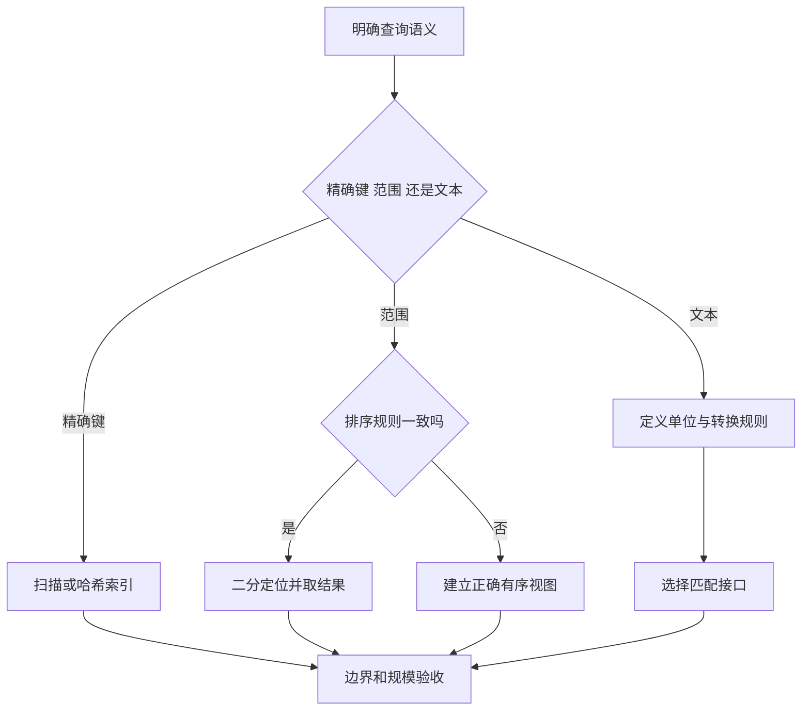

# 搜索、排序与字符串处理

> 面向会读数组、函数和循环的开发者。读完能检查二分搜索的前提，写清排序的相等与次序规则，并把文本的字节、码点和用户可见字符分开，避免“算法很快但找错、排错或截错”的问题。

## 搜索之前先定义匹配

**搜索**是从候选中定位满足条件的项。按标识相等、按时间范围、文本包含某个词，都是搜索，但它们需要不同的匹配规则。字符串大小写、空格、Unicode 表示和缺失值如何处理，属于需求契约，而不是随意套一个算法后再解释结果。

线性扫描从头逐项检查，最坏需要与候选数 n 成比例的比较。它适合少量数据、只查询一次或任意条件过滤。把数据排序或构建索引有成本，且需要维护；只有重复查询、范围定位或大规模数据等收益覆盖这些成本时，预处理才有意义，见[时间与空间复杂度](/software/algorithms/complexity)。

按键相等查询可以考虑哈希索引；范围查询可以考虑有序索引。若真正的数据在数据库里，先传回全部数据再用内存算法筛选，还增加网络和内存工作。查询与索引选择见[SQL 查询与执行计划](/software/data/sql-query-plans)。

## 二分靠单调条件排除一半候选

**二分搜索**不是“任意数组都能折半找”。它要求候选按与查询一致的规则有序，或要判断的条件在区间中单调变化；还要能够有效定位中点。排序按时间、查询却按名称，无法由一次比较排除半边。

一种实用目标是找到第一个不小于 x 的位置，称为**下界位置**。下面是针对非递减数值数组的伪代码，未执行；假设没有 NaN，数组在搜索期间不变，数值比较构成一致次序。区间 `[lo, hi)` 包含 lo、不包含 hi。

```text
lo = 0
hi = n
while lo < hi:
    mid = lo + floor((hi - lo) / 2)
    if a[mid] < x:
        lo = mid + 1
    else:
        hi = mid
return lo
```

循环保持三个**不变量**，即每轮开始仍成立的条件：`0 ≤ lo ≤ hi ≤ n`；lo 左侧所有项都小于 x；hi 及其右侧所有项都不小于 x。初始两侧为空，条件成立。中点小于 x 时，非递减性证明直到中点都可排除；否则下界不会位于 mid 右侧，将 hi 收至 mid，保留该边界。每轮区间长度严格减少，最终 lo 等于 hi，便是所求边界。

返回 n 表示没有不小于 x 的项；返回其他位置也不保证该项等于 x。查精确匹配还要检查位置未越界且相等规则满足。对于重复值，下界找到第一项；相应的上界定位第一个大于 x 的位置，两者夹出的区间是重复值范围。[Python bisect 契约](https://docs.python.org/3/library/bisect.html)

在随机访问和有界比较成本下，搜索做 O(log n) 工作，但把新项插入数组仍可能搬移 O(n) 项。搜索期间并发修改、排序后修改关键字段、从旧快照拿位置再访问新数组，都会破坏推理前提。应使用稳定快照、受控更新或支持相应一致性的索引。

## 排序要同时定义顺序、相等和修改行为

**排序**根据比较规则重排记录。**稳定排序**在比较键相等时保留输入中的相对次序；它不保证这些记录在不同数据快照中永远以相同顺序出现。如果输入本来无稳定顺序，需要明确次级键，例如时间相同再按唯一标识排序，才能得到可复查的顺序。

排序应满足两个独立条件：输出符合次序，且输出是输入记录的重排，包含相同记录及重复次数。只检查相邻项有序，会漏掉“算法把所有值换成同一值”或丢失记录的错误。稳定性有要求时，还要给输入记录附带身份，检查相同主键的原顺序。

### 比较器是算法契约的一部分

三值比较器用负数、零、正数表示先于、等价、后于。它需要一致性：同一对输入的判断保持一致；自身比较等价；交换输入方向要相容；先于关系和等价关系满足传递性。比较期间不要改变记录或根据随机数、不断变化的时钟作判断。

例如“a 比 b 大返回 1，否则返回 0”没有表达反方向，会破坏排序依据；`a < b`、`b < c`，却又 `c < a`，也不存在可满足的整体顺序。ECMAScript 规范明确规定一致比较器及稳定排序条件，未满足契约时不能依赖一个引擎碰巧给出的结果。[ECMAScript 排序规范](https://tc39.es/ecma262/multipage/indexed-collections.html#sec-array.prototype.sort)

缺失值、NaN、不同类型和无穷值应有明确规则，而不是等库处理。整数语言中用 `a-b` 作为比较结果还可能溢出，应优先使用标准比较接口；浮点近似相等也不能直接变成“差值小于容差就等价”，因为这种关系一般不传递。

### 核对具体语言库

JavaScript `Array.prototype.sort()` 会修改原数组；不提供比较器时，普通数组的默认排序按转换后的字符串的 UTF-16 码元次序。因此数字列表不能靠默认规则表达数值顺序。该接口不承诺所有引擎具有同一时间、空间复杂度。[MDN Array.sort](https://developer.mozilla.org/en-US/docs/Web/JavaScript/Reference/Global_Objects/Array/sort)

Python `list.sort()` 修改列表，`sorted()` 返回新列表；其排序保证稳定，`key` 函数会为每个输入记录提取一次比较键。昂贵的日期解析、规范化和派生评分可先生成键，再排序，但要将生成键的时间与额外空间计入总流程。[Python 排序文档](https://docs.python.org/3/howto/sorting.html)

本文的工程建议是先选符合契约的标准库排序，而非自行实现某个名算法。全量有序、只求最大项和只求前 k 项是不同任务；少量优先候选可使用堆。数据超出内存时需要分批排序和归并等外部处理，不能把全量装入内存当成默认前提。

## 文本的四种单位不能互换

| 单位 | 表达什么 | 适合的判断 |
| --- | --- | --- |
| 字节 | 某种编码的存储或传输大小 | 文件大小、请求大小、存储上限 |
| 码元 | 编码表示的基本单位，例如 UTF-16 的 16 位单元 | 语言索引和底层接口的偏移 |
| Unicode 码点 | Unicode 编号对应的元素 | 某些字符类别和逐码点处理 |
| 扩展字素簇 | 对用户感知字符的标准化近似分段 | 文本选择、显示截断和字符计数 |

一个码点可能用多个字节；UTF-16 中某些码点占两个码元；带组合重音的可见字符又可能含多个码点。JavaScript 字符串长度和下标按 UTF-16 码元处理，按码点迭代也不会自动得到字素簇。[MDN String](https://developer.mozilla.org/en-US/docs/Web/JavaScript/Reference/Global_Objects/String)

例如拉丁字母与组合重音可能显示为一个字符。按下标截取会拆开其表示，按码点数限制也不一定符合用户预期。Unicode UAX #29 给出扩展字素簇分段规则，但它是用户感知的近似；字素簇数还不约束字节大小。表单可以同时约束显示单位和编码后大小，两者目的不同。[Unicode 文本分段](https://unicode.org/reports/tr29/)

**规范化**将指定等价规则下的不同码点序列转换为规范表示。NFC 处理规范等价，并尽可能组合；NFKC 还折叠兼容差异，可能改变对应用有意义的格式或语义区别。Unicode 标准明确提示不能盲目把兼容规范化套到任意文本。[Unicode 规范化](https://unicode.org/reports/tr15/)

搜索索引、查询输入和去重键应采用相同、明确的转换规则，同时保留需要展示或审计的原文本。规范化不自动解决大小写、语言排序、视觉相似或身份安全；不能为了“更容易匹配”擅自修改密码、协议标识和业务唯一键。面向人阅读的排序还需声明语言或地区规则，编码次序并不等于自然语言次序。

## 子串搜索为什么可能反复做同样的工作

朴素子串搜索在每个候选起点比较长度为 m 的模式。文本长 n，重复前缀很多且在末尾才失配时，最坏工作可达 O(nm)。若文本是连续许多 `a`，模式是多个 `a` 后接 `b`，相邻起点会重复比较几乎同一段前缀。

KMP（Knuth–Morris–Pratt）算法预处理模式的前缀与后缀关系。失配后，已匹配片段中仍可能有效的最长前缀成为新状态，文本位置不用回退。关键不变量是当前状态记录了已读文本后缀与模式前缀的匹配长度；回退只保留有依据的候选，不跳过可能匹配。

用失败链接或前缀表实现时，模式预处理为 O(m)，扫描为 O(n)，额外空间 O(m)，假设单个处理单位的比较有界；不应把某个依赖字母表大小的自动机实现的空间也写成同样界限。Princeton 课程提供了不同 KMP 实现及其规模说明。[Princeton 子串搜索](https://algs4.cs.princeton.edu/53substring/)

这些机制帮助理解最坏输入，并不要求应用重新实现搜索库。库可能采用混合策略；需要核对其实际契约和性能。无论算法如何，若需求是规范等价、忽略大小写或按词搜索，仍要先定义语义，精确子串匹配不会替业务作决定。

## 按目标选择，再按边界验收



| 场景 | 可选方法 | 必须验收的条件 |
| --- | --- | --- |
| 一次任意条件过滤 | 线性扫描 | 空集、未命中、条件组合和输出完整性 |
| 稳定数据重复查键范围 | 有序视图加二分 | 规则一致、重复边界、首尾和未命中 |
| 名单排序或分页 | 标准库排序及明确次级键 | 缺失值、重复主键、快照变化、修改原数据 |
| 输入文本去重 | 约定的规范键 | 等价规则、原文保留及兼容差异 |
| 显示截断和计数 | 字素簇分段，另控字节大小 | 组合序列、补充码点和超长输入 |
| 长文本精确匹配 | 成熟搜索库 | 高重复前缀、边界匹配、空模式契约 |

验收中的“空模式返回什么”“未命中返回哪个值”应从所用接口文档得到，不能在不同语言间凭经验迁移。正确性和工作负载测量方法见[正确性、测量与算法优化](/software/algorithms/correctness-optimization)。

## 参考资料

<Refs>

- [Python：bisect](https://docs.python.org/3/library/bisect.html)——左右边界分区、查找与插入成本及并发修改边界（访问日期 2026-10-03）
- [Python：Sorting Techniques](https://docs.python.org/3/howto/sorting.html)——稳定性、键提取和原地／新列表语义（访问日期 2026-10-03）
- [ECMAScript：Array.prototype.sort 与 SortIndexedProperties](https://tc39.es/ecma262/multipage/indexed-collections.html#sec-array.prototype.sort)——一致比较器与排序契约（访问日期 2026-10-03）
- [MDN：Array.prototype.sort](https://developer.mozilla.org/en-US/docs/Web/JavaScript/Reference/Global_Objects/Array/sort) · [String](https://developer.mozilla.org/en-US/docs/Web/JavaScript/Reference/Global_Objects/String)——默认规则、实现成本边界与字符串单位（访问日期 2026-10-03）
- [Unicode UAX #15：Normalization Forms](https://unicode.org/reports/tr15/) · [UAX #29：Text Segmentation](https://unicode.org/reports/tr29/)——规范化的语义边界与字素簇分段（访问日期 2026-10-03）
- [Princeton Algorithms：Substring Search](https://algs4.cs.princeton.edu/53substring/) · [KMPplus 原始教学实现](https://algs4.cs.princeton.edu/53substring/KMPplus.java.html)——失败链接与时间、空间范围（访问日期 2026-10-03）
- 站内相关：[把想法变成需求和验收](/software/guide/requirements-and-acceptance) · [常用数据结构的工程选择](/software/algorithms/data-structures) · [时间与空间复杂度](/software/algorithms/complexity) · [正确性、测量与算法优化](/software/algorithms/correctness-optimization) · [交互、可访问性与国际化](/software/frontend/accessibility-internationalization)

</Refs>
