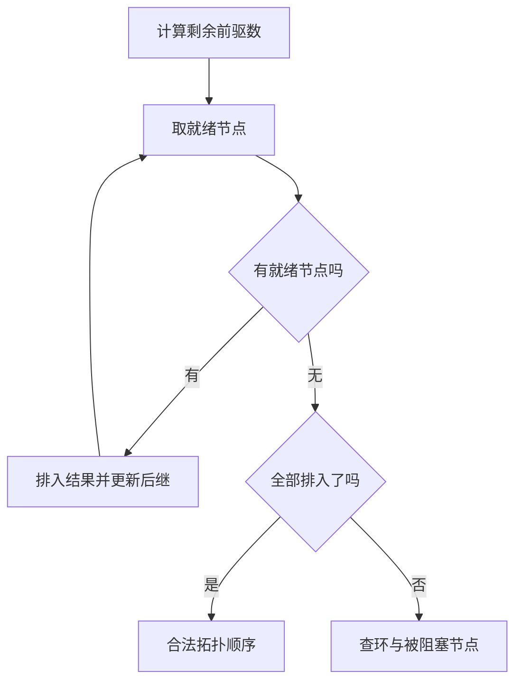

# 树、图与依赖关系

> 面向理解数组、映射和循环，准备处理目录层级、任务依赖或连接关系的读者。读完能判断数据应是树还是图，选择遍历和排序方法，并检查环、不可达节点、深度与边方向带来的错误。

## 关系模型决定哪些问题可以回答

**图**由顶点和边构成：顶点表示对象，边表示关系。边可以有方向，也可以带权重，例如距离或成本。本文用 V 表示顶点数量、E 表示边数量；权重的意义和单位应由业务明确，不能把不同含义的数字直接相加。

**树**在无向图意义下是连通且无环的图。给树指定根后，可把边解释为父子方向：除根外，每个节点有唯一父节点，也有唯一从根到它的路径。若由多棵树组成，就是森林；有共享子节点或多个前驱的层级，通常应按一般图处理。

树不等于所有嵌套数据。一个目录条目有唯一父目录，适合层级树模型；加入符号链接后的遍历关系可能共享节点或成环。软件包可被多个包依赖，依赖图不能为了画得整齐就强制每个包只有一个父节点。**有向无环图**（DAG）允许共享和多个前驱，但不含有向环，它是安排前置依赖的常用模型。

| 问题 | 必须明确的关系 | 合适的模型 |
| --- | --- | --- |
| 分类的父级和子级是谁 | 每个非根节点是否只有一个父级 | 根树或森林 |
| 一个对象依赖哪些对象 | 边表示“依赖谁”还是“先于谁” | 有向图，排执行顺序时需检查 DAG |
| 哪些对象能从当前对象到达 | 关系方向，是否允许环 | 一般有向或无向图 |
| 按键查找并取范围 | 键的比较规则与重复策略 | 搜索树或其他有序索引 |
| 找最低成本路线 | 权重单位及负权边 | 带权图与符合前提的路径算法 |

模型还应规定节点身份。显示名相同的两个节点不能自动合并；重复边、缺失节点和自环如何处理也要在输入契约中说明。图论定义清楚后，才有可靠的算法输入。

## 图如何存，影响遍历成本

**邻接表**为每个节点保存邻居集合或列表，空间通常为 O(V+E)，枚举某节点邻居的工作与该节点的边数相关。无向边通常在两个端点各保存一次；分析和更新时要统一计数规则。

**邻接矩阵**为每对节点保存连接或权重，空间为 O(V²)，按一对索引检查边很直接，但枚举邻居需要检查一行。它适合较密集或本来就需要成对运算的关系；对于稀疏依赖图，矩阵常会保存大量“没有边”的位置。

O(V+E) 的遍历结论依赖这些表示和有界访问成本。如果每次取邻居都要访问远程接口，或为了判断“已访问”而线性扫描列表，实际总工作就会改变。关系来自外部服务时，应同时预算请求数、限流、快照一致性和结果缓存。[MIT BFS 讲义](https://ocw.mit.edu/courses/6-006-introduction-to-algorithms-spring-2020/resources/mit6_006s20_lec9/)

## 搜索树依靠键顺序，平衡树再控制高度

**二叉搜索树**中每个节点最多两个子节点，并保持键顺序，例如左子树键小于当前键，右子树键大于当前键。允许重复键时必须另定存储策略。查找根据比较结果进入一侧，路径长度取决于树高 h，因此成本是 O(h)，不能仅凭“二叉”就断言 O(log V)。

按已排序数据依次插入未平衡的搜索树，可能形成一条长链，高度线性增长。**平衡树**在更新时维护额外条件，使高度受控。AVL 树要求每个节点左右子树高度之差至多为一；发生局部失衡时通过旋转重接节点，保持中序遍历的键顺序，再更新高度等信息。

为何这一条件有用？令 `M(h)` 是高度 h 的 AVL 树至少需要的节点数。最稀疏情况下两棵子树高度为 `h-1` 和 `h-2`，所以 `M(h)=1+M(h-1)+M(h-2)`。它至少每两个高度层翻倍，节点数随高度指数增长，反过来高度为 O(log V)。于是常见查找、插入和删除可以控制在对数工作内。[MIT AVL 讲义](https://ocw.mit.edu/courses/6-006-introduction-to-algorithms-spring-2020/resources/mit6_006s20_lec7/)

这是 AVL 的机制说明，不表示所有树都按同一规则平衡。红黑树等有不同约束，数据库中的树索引还涉及页、缓存和持久化，相关内容由[数据库](/cloud/data/database)承担。应用通常应选成熟容器，重点检查比较规则、范围查询及更新成本，而不是重新实现旋转。

## BFS、DFS 与最短路径各自保证什么

**广度优先搜索**（BFS）用队列按距离层次扩展节点，适合可达性和无权图的最少边数路径。在入队时标记已发现，避免同一节点被多个前驱反复加入。它的关键不变量是：先扩展的节点距离不会大于后扩展节点；第一次发现某节点时，已建立最少边数的距离。

**深度优先搜索**（DFS）沿一条关系深入，再回退探索其他分支，适合子树处理、完成顺序和环分析。递归是一种实现方式，也可以用显式栈；深层链条可能超过运行时的递归限制，不能用“样本层数很少”推断输入永远安全。

有向图的 DFS 可区分“未访问”“当前路径中”“已完成”。指向当前路径中节点的边证明存在有向环；指向已完成节点可能只是共享依赖，不能判成环。无向图的环检查还需排除返回父节点的那条边。[MIT DFS 讲义](https://ocw.mit.edu/courses/6-006-introduction-to-algorithms-spring-2020/resources/mit6_006s20_lec10/)

在邻接表和适当的已访问集合下，完整 BFS、DFS 通常做 O(V+E) 工作；仅从一个起点出发只覆盖可达部分，不能据此确认整张图没有环。检验全图需要对未访问节点继续发起遍历，并包含孤立节点。BFS 的待处理队列受当前前沿宽度影响，DFS 的栈受路径深度影响，两者最坏都可能保存 O(V) 项，已访问记录也需额外空间。

BFS 的最短是“边数最少”，不是“成本最低”。Dijkstra 算法用优先队列反复确定当前距离最小的节点，正确性要求边权非负；负权边可能使已确定距离后来变小，破坏其推理。一般负权图要选择相应算法，并处理可达负环导致最短值不存在的情况。[MIT Dijkstra 讲义](https://ocw.mit.edu/courses/6-006-introduction-to-algorithms-spring-2020/resources/mit6_006s20_lec13/)

## 拓扑排序把前置关系变成合法顺序

**拓扑排序**为有向图生成一个线性顺序，使每条边的起点在终点之前。本文约定边 `u → v` 表示“u 必须先完成，v 才能进行”。若输入存的是“v 依赖 u”，转为邻接结构时必须保持同一含义。

Kahn 方法先计算每个节点的**入度**，即指向它的边数。把入度为零的节点加入就绪集合；取出一个节点后，将其后继的剩余入度减一，新变为零者进入就绪集合。对静态、正确表示的图，该过程的核心不变量是：就绪节点已没有尚未排入结果的前驱。

若所有节点都排入结果，得到合法拓扑顺序。若就绪集合为空但仍有未排入节点，则剩余图每个节点都有未处理前驱；沿前驱反复追溯，在有限节点中必然重复，从而证明有环。注意未排入的节点可能位于环下游，不能把全部残留节点都说成环成员。在邻接表和常数成本队列操作下，每个节点入队一次、每条边更新一次，整体工作为 O(V+E)。

例如四项任务：A 检查配置，B 生成页面，C 验证契约，D 打包；关系是 A 先于 B、C，B、C 先于 D。`A,B,C,D` 和 `A,C,B,D` 都合法。如果再要求 D 先于 A，就形成环，换一种排序算法也不能满足全部先后约束。这是示意关系，未执行任务或调度程序。

Python `graphlib.TopologicalSorter` 的输入把节点映射到它的前驱，和“节点映射后继”的邻接表写法相反。其 `get_ready()` 返回就绪项，`done()` 标记已完成后才释放后继；原始实现维护剩余前驱数来完成这个过程。这个区分很重要：真实并行调度不能把“已派发”当成“成功完成”。[Python graphlib](https://docs.python.org/3/library/graphlib.html) · [CPython graphlib 实现](https://github.com/python/cpython/blob/3.14/Lib/graphlib.py)

拓扑顺序只解决依赖合法性，不解决资源容量、任务耗时、失败重试和权限。多个就绪任务能否同时执行，要由资源与并发策略判断；若希望输出稳定，可在就绪项间增加明确排序规则，但这也改变选择成本。

## 从合法图到可靠工程还有哪些边界

| 失败模式 | 为什么会发生 | 更合适的处理 |
| --- | --- | --- |
| 从一个根遍历后遗漏任务 | 图有多个分量或孤立节点 | 输入显式包含全体节点，遍历覆盖全图 |
| 共享依赖被误判为环 | 只维护“见过”而未区分当前路径 | 使用 DFS 状态或拓扑残留分析 |
| 执行顺序完全颠倒 | “依赖”与“先于”的边向混用 | 用两节点示例核对输入与输出 |
| 图很小却无法拓扑排序 | 先后约束本身冲突 | 给出环路径，修改约束或划分阶段 |
| 移动分类后出现自我祖先 | 只改父级，未检查目标的后代关系 | 校验移动后的结构并约束共同写入 |
| 深层输入使程序退出 | 递归栈有限，或漏掉已访问状态 | 显式栈、访问集合与输入资源边界 |
| 拓扑顺序正确但任务失败 | 调度把派发当完成，或依赖结果不可用 | 保存执行状态，成功后释放后继 |

环并不总是坏数据。状态机、网络连接和模块关系可能合理成环；“是否允许”由业务定义。只有必须满足严格前置顺序时，有向环才代表该模型下不可执行。不能随意删一条边让算法通过，而不解释失去的约束。

层级修改和依赖更新还受并发影响：两次修改各自检查时都无环，交错提交后仍可能共同形成环。因此验证和写入需处于适当的一致性边界。权限继承也不能仅靠“节点可达”决定，图关系与授权规则应分别建模，见[身份认证、会话与权限](/software/backend/authentication-authorization)。

完整验收应检查图约束和结果性质：节点没有丢失；每条依赖在输出中保持先后；报告的环路径确实闭合；最短路径每一步存在且权重定义一致。枚举所有路径可能产生大量甚至指数级输出，不能用单次遍历的 O(V+E) 解释其成本。

## 参考资料

<Refs>

- [MIT 6.006：Lecture 7 — Binary Trees II: AVL](https://ocw.mit.edu/courses/6-006-introduction-to-algorithms-spring-2020/resources/mit6_006s20_lec7/)——高度约束、旋转与最少节点递推；已阅读原始 PDF（访问日期 2026-10-03）
- [MIT 6.006：Lecture 9 — Breadth-First Search](https://ocw.mit.edu/courses/6-006-introduction-to-algorithms-spring-2020/resources/mit6_006s20_lec9/)——图表示、无权最短路径与遍历复杂度；已阅读原始 PDF（访问日期 2026-10-03）
- [MIT 6.006：Lecture 10 — Depth-First Search](https://ocw.mit.edu/courses/6-006-introduction-to-algorithms-spring-2020/resources/mit6_006s20_lec10/)——DFS、全图覆盖、拓扑排序和环；已阅读原始 PDF（访问日期 2026-10-03）
- [MIT 6.006：Lecture 13 — Dijkstra's Algorithm](https://ocw.mit.edu/courses/6-006-introduction-to-algorithms-spring-2020/resources/mit6_006s20_lec13/)——非负边权的正确性前提；已阅读原始 PDF（访问日期 2026-10-03）
- [Python：graphlib](https://docs.python.org/3/library/graphlib.html)——前驱输入、就绪与完成接口、环异常（访问日期 2026-10-03）
- [CPython 3.14：Lib/graphlib.py](https://github.com/python/cpython/blob/3.14/Lib/graphlib.py)——剩余前驱数、就绪节点和完成后释放后继的实现（访问日期 2026-10-03）
- 站内相关：[语言、框架、运行时与依赖](/software/guide/languages-frameworks-dependencies) · [常用数据结构的工程选择](/software/algorithms/data-structures) · [时间与空间复杂度](/software/algorithms/complexity) · [正确性、测量与算法优化](/software/algorithms/correctness-optimization) · [依赖、清单与锁文件](/software/toolchain/dependencies-lockfiles) · [异步、并发同步与取消](/software/programming/async-concurrency)

</Refs>
