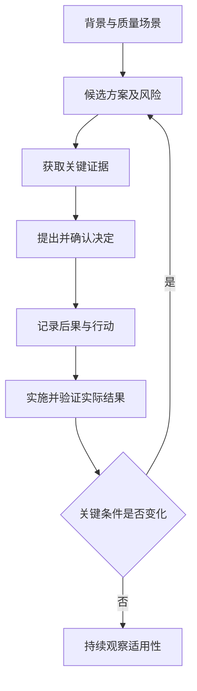

# 架构决策与验证

> 本文面向比较技术方案、主持架构评审或接管历史决定的人员。读完能把质量目标写成可分析场景，记录选择及其代价，并区分论证、原型和真实系统验证。

## 决策从约束与结果开始

**架构决策**是对重要结构、依赖、接口、数据责任或构建运行方式的选择。其重要性来自影响范围、长期约束和改变代价，不取决于使用了多大的产品名称。

虚构的文件转换系统要处理少量即时请求和较长的批量任务。有人建议全部同步执行，有人建议增加队列。直接比较“队列是否先进”不会得到可复核答案；应先说明用户需要何种等待体验、文件大小和任务量如何变化、失败如何恢复、谁负责运行。

约束可以分为必须满足与可权衡部分。文件内容不能丢失属于关键条件，界面何时显示进度可以有多个可接受方案。事实、假设和偏好需要分开：现有任务耗时记录是事实，预计增长是预测，团队熟悉某工具是能力条件。

候选方案应包括维持现状或做较小改善。需要缓解超时，可能通过拆分批次、调整接口或隔离工作线程完成，并不一定立即引入新平台。遗漏较小方案，会使决策看起来只有“全面重写”和“继续忍受”两种极端。

## 用质量场景替代形容词

**质量属性场景**将性能、可靠性、安全或可修改性落实到具体条件和可观察结果。SEI 的 ATAM 强调场景中的刺激、环境与响应，并用它们发现架构风险和权衡。[ATAM 报告](https://www.sei.cmu.edu/library/atam-method-for-architecture-evaluation/)

实际记录可以说明发生者、触发事件、受影响对象、环境、响应和度量。例如“批量任务运行时，用户提交一个小文件；系统接受请求并可查询进展；完成时间应满足经业务确认的目标”。这里没有填入任意秒数，因为本文没有项目测量与约定。

| 目标 | 场景需要补充的条件 | 可用证据 |
| --- | --- | --- |
| 响应及时 | 输入规模、并发、测量边界 | 代表性负载的延迟分布 |
| 不丢任务 | 接受语义、故障窗口、恢复期限 | 重启与失败注入后的状态核对 |
| 可替换转换器 | 稳定契约、支持格式、失败语义 | 替换试验与契约验证 |
| 限制访问 | 身份、对象范围、操作 | 授权分析与负向用例 |
| 可支持运行 | 观察、告警、恢复与责任 | 演练记录及接管确认 |

场景同时需要说明边界。实验只覆盖一个文件格式，不能扩展为所有格式；一台测试机器的结果不能直接代表生产集群；模拟数据库故障也不等于真实网络分区。边界越清楚，证据越便于使用。

## 权衡需要显性化

**敏感点**（sensitivity point）是影响某项质量响应的关键架构参数或关系。**权衡点**（tradeoff point）会影响多项质量。ATAM 用这些概念帮助团队定位需要进一步分析的决定。[ATAM 原始报告](https://www.sei.cmu.edu/documents/629/2000_005_001_13706.pdf)

增加任务并发可能改善吞吐，也可能争用 CPU、内存和数据库连接，影响即时请求。增加缓存可能减少延迟，也会带来过期数据与失效管理。把收益和代价同时记录，才能决定应如何限制和观察。

评分表可以辅助讨论，但每个分值应有定义和依据。未知不能默认给中间分，必须满足的条件也不能被其他高分抵消。权重变化如果会改变排序，应记录这种敏感性，说明决定依赖哪个假设。

NASA 决策分析建议明确评价标准、替代方案及不确定性，并考虑获得更多信息是否值得。该原则适合安排有限探索，不代表每项小改动都需要正式多轮评审。[决策分析](https://www.nasa.gov/reference/6-0-crosscutting-technical-management/)

## 让验证工作回答决定问题

**概念验证**（proof of concept）可以检查技术是否可行，**原型**（prototype）可以探索交互或结构。二者的质量和运行准备可能不适合直接交付；应先声明需要证明什么、省略什么、何时结束以及如何利用结果。

文件转换示例可以安排一次有限实验：用代表性小文件和大批次，比较同步与任务队列路径的响应、资源占用及恢复状态。实验前明确输入、环境、版本、测量口径和接受条件；实验后记录实际结果和异常，不能用预期结果填表。

本文没有执行该实验，因此不能宣称队列一定更快或某方案满足目标。队列通常改变任务接受与完成的时间关系，可能改善请求等待，也可能增加排队延迟。分析应覆盖用户能否理解进度与失败，而不只记录接口返回时间。

验证还可以包括设计走查、契约检查、依赖分析和迁移演练。每种方法应对应疑问：设计走查发现缺少恢复状态，故障注入检查实际恢复，运行观察确认真实负载。不能把一种方法的结论扩展为全部质量验证。

## ADR 保存决定理由

**架构决策记录**（Architecture Decision Record，ADR）以短记录保存背景、决定、状态和后果。Nygard 的原始文章强调一条重要决定一份记录，保留被替代决定并指向新记录。[Documenting Architecture Decisions](https://cognitect.com/blog/2011/11/15/documenting-architecture-decisions)

一个虚构 ADR 可以写为：因长任务占用请求资源，决定将批量转换移到持久任务路径；即时小文件暂保留同步；引入任务状态查询、幂等提交和积压观察；运行方承担队列支持；实际容量目标仍待实验确认。这样的记录承认未知，也说明新增责任。

候选方案、证据链接、决定权限和重新评估条件可以补入记录，但不必把每个 ADR 变成冗长模板。应让未来读者能理解当时约束，尤其是未选择方案的主要原因和被接受的代价。

**接受**状态不等于**已实施**，**已实施**也不等于**已验证**。可以分别记录实施变更、验证结果和遗留事项。若决定后来被替代，旧记录仍说明历史原因，不能静默改写成好像一直采用新方案。

## 评审关注未解决风险

评审者可以询问：规则是否一致，最危险的失败是什么，证据是否足够，谁负责新增运行对象，迁移中状态如何处理，如何恢复或退出。不同专业人员可以负责不同维度，但需有人确认连接处与整体场景。

无法回答的关键问题应进入有责任和期限的行动，而不是以“后续优化”带过。是否继续推进，取决于损失、可恢复性和组织授权；有时允许受控试用，有时需要先补证。没有充分理由就要求所有未知归零，也会阻碍有价值的学习。

架构验证应持续到实施和运行。依赖关系变了、负载增长了、外部接口弃用了、团队支持能力减少了，都可能使原决定失效。重新评估不表示原决定错误，应根据当时事实与当前事实分别判断。

## 决策记录的失败边界

常见失败包括：先选产品再补理由、只列收益、用工具宣传代替证据、把原型运行成功当作生产就绪、所有指标都没有测量口径，以及决定接受后无人验证落地。

另一个失败是记录过多：变量名或局部实现都写成 ADR，会让重要决定难以查找。优先保存影响结构、契约、质量、数据和长期支持的选择，局部细节放在代码与评审中。架构描述连接方式见 [建模与架构描述](/software/architecture/architecture-modeling)。

可复核的决定应说明在何种条件下选择了什么、依据是什么、承担了哪些代价，以及什么变化会促使重新判断。记录本身不保证正确，但能让纠正和演进有明确起点。

## 实例：验证结果怎样改变决定

如果实验发现排队路径能快速接受请求，却使小文件长期等待大任务，不能只引用接口返回时间宣布目标达到。可以调整任务分类、资源配额或保留即时路径，再验证新的场景；每次调整需要说明是否引入额外运行责任。

若实际任务量远低于假设，队列支持成本可能超过收益，也可以维持同步并设置明确资源边界。ADR 应记录证据、决定和重新评估触发条件，而不是把原候选方案包装成不可改变的结论。失败的实验也有价值，它能排除假设并缩小后续探索范围。

## 参考资料

<Refs>

- [Nygard：Documenting Architecture Decisions](https://cognitect.com/blog/2011/11/15/documenting-architecture-decisions)、[SEI：ATAM 报告](https://www.sei.cmu.edu/library/atam-method-for-architecture-evaluation/)、[NASA：Decision Analysis](https://www.nasa.gov/reference/6-0-crosscutting-technical-management/)；访问日期：2026-10-03。
- [软件项目全景](/software/guide/software-project-overview)：理解决定所处的生命周期。
- [估算、风险、成本与自建采购](/software/requirements/estimation-risk-economics)：比较投入及未知。
- [性能与可靠性测试](/software/quality/performance-reliability-tests)、[阅读与接管既有系统](/software/maintenance/system-takeover)：获取验证证据并理解历史理由。

</Refs>
