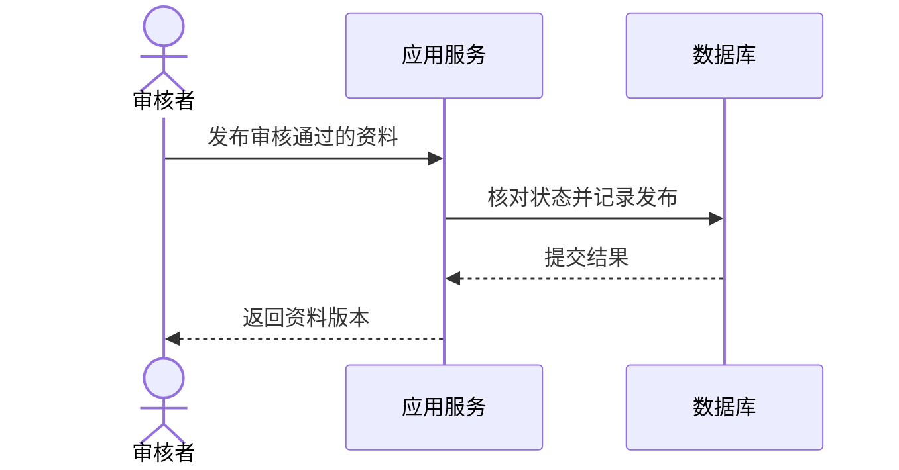

# 建模与架构描述

> 本文面向需要表达、评审或理解系统结构的工程与协作人员。读完能按问题选择架构视图，把静态结构与运行行为连接起来，并说明模型的范围和验证状态。

## 模型服务于一个具体问题

**模型**（model）保留与当前问题有关的对象和关系，省略其他细节。**架构描述**说明系统的重要结构、交互、约束和决定。图形、文字、表格和决定记录都可以参与描述；画图工具本身不会使描述正确。

虚构的资料审核系统有编辑者、审核界面、应用服务、数据库和文件存储。业务人员想知道谁能发布，开发者想知道规则在哪里，运维人员想知道组件部署在哪里。用同一张包含全部类和机器的大图回答所有问题，容易让关键关系淹没。

**视图**（view）是针对关注点展示的模型。**视点**（viewpoint）可理解为构建和解释某类视图的规则，包括面向谁、回答什么以及使用什么表示。普通项目可以采用清楚的约定，不一定需要完整建模语言。

arc42 建议从业务驱动、质量目标和相关参与者开始说明架构。本文据此先确定读者问题，再选择视图深度。[arc42：引言与目标](https://docs.arc42.org/section-1/)

## 静态结构可以逐级放大

C4 模型以系统上下文、容器、组件和代码表达不同尺度的结构，并明确不必使用所有层级，只选择有价值的视图。[C4 图类型](https://c4model.com/diagrams)

| 尺度 | 资料审核系统中展示的内容 | 主要问题 |
| --- | --- | --- |
| 系统上下文 | 编辑者、审核系统和外部身份服务 | 系统边界与外部责任是什么？ |
| 容器 | 浏览器应用、服务端、数据库、文件存储 | 哪些运行边界通过什么方式交互？ |
| 组件 | 审核规则、文件处理、发布协调 | 重要责任如何分配？ |
| 代码 | 特定类型、函数或数据结构 | 某个关键实现如何组织？ |

C4 的**容器**（container）表示应用或数据存储等运行边界，不专指 Docker 容器，也不等同于服务器。一个应用可在多台机器运行，多个应用也可能部署在同一主机。[C4 容器定义](https://c4model.com/abstractions/container)

视图层级应保持一致。在容器图里混入“管理员权限判断函数”，会把运行边界和内部细节放在同一尺度；在上下文图中画出每个数据表，则会分散对外部责任的注意。需要细节时，用稳定标识指向下一层。

线也需要语义。“审核服务—数据库”无法说明读写范围、协议或数据性质。可以标注“保存审核状态”“读取文件元数据”，并在文字中说明事务和权限约束。结构图通常不能表示时间顺序，箭头先后位置不应被当作执行顺序。

## 运行视图解释一次实际交互

静态图展示存在什么，**运行视图**展示某个场景下它们如何协作。arc42 建议选择重要用例、外部接口、运行操作和异常场景，不要求穷举所有交互。[arc42 运行视图](https://docs.arc42.org/section-6/)

这是虚构的主流程，省略了身份核对、文件内容和通知。图后必须解释这些省略，而不能据此声称系统已经安全。若发布还需要复制文件，数据库提交与复制之间的失败窗口应另画或用表格说明。

运行图宜明确同步调用、异步消息和持久化动作。收到消息不等于业务处理完成，返回接受请求也不等于任务已经成功。涉及重试时，应说明是否同一个请求标识、状态是否允许重复转换。重要异常可以独立画图，避免成功与所有失败挤在一张图里。

状态模型适合回答合法转换，时序模型适合回答交互次序，数据模型适合回答对象关系和约束。选择表达方式时看需要解决的问题，不必把同一信息重复画成多种图。

## 部署与信任边界需要独立说明

**部署视图**将应用及数据存储映射到运行节点、环境和连接。审核系统的服务实例有几个、位于哪里、如何连接数据库、文件由谁备份，都属于部署问题。逻辑上一个服务可以有多个实例，不能根据结构图里的一个方框推断只有一台机器。

**信任边界**说明数据从何种权限范围进入另一范围。浏览器发出的请求应作为外部输入；内部服务之间也可能有不同身份和访问权限。网络在同一私有环境，不代表请求天然可信。具体威胁分析见 [威胁建模](/software/security/threat-modeling)。

配置、机密和环境差异可能影响行为，宜在部署说明中引用权威配置定义和获取方式，避免把敏感值写进图。容量、备份、故障域等云端机制可参照 [可靠性与容灾](/cloud/architecture/reliability-dr)，无需在每份软件结构说明中重复全部基础知识。

## 图形、文字和表格互相补足

图适合展示关系，文字适合解释理由和限制，表格适合列接口、责任和状态。架构描述应把三者连接起来。例如图中“发布协调”对应一段职责说明、一个接口契约和一条架构决定；关键标识保持一致。

每份视图可以注明用途、适用版本、范围、主要省略和维护者。“目标设计”“当前实现”“迁移中状态”尤其要区分。把目标图直接称为当前架构，会使接管者误判故障路径和依赖。

| 描述对象 | 可核对的依据 | 常见遗漏 |
| --- | --- | --- |
| 源码依赖 | 导入关系、构建配置 | 动态加载、反射及生成代码 |
| 运行调用 | 请求记录、追踪及接口实现 | 未覆盖的失败路径和定时任务 |
| 数据访问 | 模型、迁移和实际访问权限 | 运维脚本、报表及隐式共享写入 |
| 部署拓扑 | 环境声明和实际运行清单 | 人工变更、遗留资源及漂移 |
| 决策理由 | ADR、需求和评审记录 | 已失效假设与未关闭风险 |

这些依据有不同局限。运行追踪只显示被观察到的路径，源码图可能显示未使用代码。两者矛盾时需要调查，不能任选一个当作全貌。模型应能帮助发现这种差异，而不是掩盖它。

## 让模型参与评审与变化

评审可以使用一个具体问题：文件复制失败后发布状态是什么？审核服务不可用时哪些功能仍可用？变更权限模型会影响哪些接口？如果描述无法回答，就针对问题补充视图或文字，而不是先扩大所有图。

质量目标要形成场景。例如“审核结果提交成功后，用户重新读取应看到对应版本”涉及数据读取路径；“通知失败不阻止发布”涉及副作用隔离。仅写“高性能、易扩展”无法指导架构判断，具体分析见 [架构决策与验证](/software/architecture/architecture-decisions)。

迁移期间应记录暂时存在的旧新路径、路由条件和移除计划。两个实现同时存在不意味着二者均被所有请求使用。清楚表示过渡状态，有助于确定验证范围和恢复方式。

## 建模的边界

模型不能证明实现符合设计，也不能自动证明安全、容量或恢复能力。需要相应检查、实验和运行证据。本文图示为解释性模型，没有来自真实系统的测量结果。

常见失败包括：所有线没有含义、图中混合多个尺度、只画成功路径、没有版本、自动生成巨大图后无人阅读。也应避免形式过重：一个小型工具可以先维护上下文、运行边界和关键决定；随着实际问题出现再增加细节。

有用的描述应让读者能找到边界、提出可验证问题、理解关键决定，并在系统改变后知道需要更新哪里。图的数量和精美程度都不能代替这些结果。

## 实例：从异常问题补充模型

如果资料已显示发布，但文件暂时无法读取，先查看运行场景是否遗漏文件存储步骤。补充模型时，标明数据库提交、复制文件和返回之间的先后关系，再记录失败后状态由谁修复。无需为此重新绘制所有模块内部类。

若当前实现与目标流程不同，分别标明两份状态及迁移计划。后续评审可以用同一异常问题核对代码、任务和日志：哪个记录证明复制成功，哪个状态允许重试，用户查询会得到什么。模型由具体问题推动，才能成为分析工具，而不只是结构展示。

## 参考资料

<Refs>

- [C4：Diagrams](https://c4model.com/diagrams)、[Container](https://c4model.com/abstractions/container)、[arc42：Introduction and Goals](https://docs.arc42.org/section-1/)、[Runtime View](https://docs.arc42.org/section-6/)；访问日期：2026-10-03。
- [一次请求如何经过系统](/software/guide/request-through-system)：建立运行路径概念。
- [模块边界、依赖与接口](/software/architecture/modules-interfaces)：解释结构中的责任。
- [文档、沟通与责任分工](/software/requirements/documentation-responsibility)：维护视图和权威记录。

</Refs>
