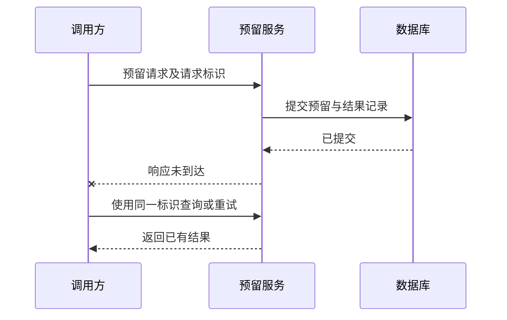

# 分布式一致性与部分失败

> 本文面向设计跨进程调用、复制数据或恢复异常操作的开发者。读完能解释超时后的未知结果，按业务规则选择一致性要求，并设计有边界的重试与恢复。

## 一部分成功，一部分无法确认

**部分失败**（partial failure）指系统中的部分组件或交互失败，而其他部分仍在工作。它比“整个程序停止”更难处理，因为调用方无法直接知道远端发生了什么。

虚构的库存预留服务接收请求，已经提交预留记录，但返回包丢失。客户端看到超时后重新发送，如果服务把它当作新申请，就会重复预留。相反，客户端将超时显示为“未预留”，也可能让使用者继续申请，造成重复业务操作。

**超时**（timeout）表示在规定等待时间内没有拿到结果，不等于远端没有执行。连接失败、处理失败、响应丢失和调用方取消，具有不同状态。取消本地等待也不自动取消已经开始的远端动作。

图示是一种目标设计，不是实际测试结果。要实现它，请求标识、业务写入和结果记录需要有明确原子边界，查询路径也必须能解释处理中、成功和失败状态。

## 一致性需要说清观察承诺

**一致性模型**（consistency model）说明并发操作和复制数据对观察者提供什么关系。它不是单个“强或弱”的开关，也不同于数据库事务中所有约束的总称。

**线性一致性**（linearizability）要求操作看起来在调用与响应之间某一点瞬间发生，并尊重真实时间先后。写入成功后才开始的读取应观察到该写入或更晚的值。**最终一致性**（eventual consistency）通常表示在没有新更新且传播等条件满足后，副本最终收敛；它不自然承诺固定时间内收敛，也不自动解决更新冲突。

业务往往需要更具体的保证：用户在同一会话看到自己的写入、读取结果不倒退、相关更新保持因果关系。应说明哪些路径需要哪种保证。库存写入不能超卖和报表允许延迟，是不同要求，不必用同一读写策略处理。

| 业务判断 | 应确认的要求 | 可以考虑的设计方向 |
| --- | --- | --- |
| 可否创建新的库存预留 | 必须维护容量不变量 | 统一写入边界、事务或协调 |
| 用户提交后查看结果 | 读到自己的操作 | 返回结果、会话路由或版本等待 |
| 统计昨日预留趋势 | 可接受延迟及完整性口径 | 异步投影并标注更新时间 |
| 多地点修改同一对象 | 冲突如何识别与解决 | 版本检查、单写者或领域合并规则 |

复制提供多份数据，不自动提供业务正确性。两个地点都认为库存充足并独立扣减，之后把数字合并，可能已经违反“不超量”的规则。若要在断连时继续接受操作，需要预先分配额度等领域方案，并分析其限制。

## CAP 的准确适用范围

CAP 讨论在可能发生通信分区的模型下，某类一致性与可用性保证不能同时满足。Gilbert 与 Lynch 的论文使用原子读写语义，并指出实际系统还有更弱一致性及其他取舍。[Perspectives on the CAP Theorem](https://groups.csail.mit.edu/tds/papers/Gilbert/Brewer2.pdf)

**网络分区**（network partition）使部分节点不能相互通信。需要协调的操作此时可能等待或拒绝，以保持一致性；也可能继续返回某种结果，同时放松原有一致性承诺。CAP 的可用性是形式模型中的请求完成性质，不等于产品 SLA 的百分比；返回一个错误也不能随意当作已满足所有语义。

因此“系统永远从三个字母中选两个”容易误导。分区是否发生、操作是否需要协调、允许何种结果都影响选择。没有分区时，延迟、吞吐和一致性的权衡仍然存在，不能只靠 CAP 决定数据库或服务架构。

## 重试可以改善瞬时失败，也会放大负载

**重试**（retry）再次执行请求，适合部分瞬时错误；权限不足、无效输入或确定的业务拒绝通常不会因重复而改善。AWS 的可靠性指导强调限制次数、退避和抖动，并避免多层叠加重试及非幂等副作用。[限制重试调用](https://docs.aws.amazon.com/wellarchitected/latest/framework/rel_mitigate_interaction_failure_limit_retries.html)

**退避**（backoff）逐步延长等待，**抖动**（jitter）分散客户端同时重试的时间。它们缓和集中压力，但不能修复永久故障。需要明确总截止时间、次数或重试预算，以及何时转为失败、降级或人工处理。

重试应考虑整条调用链。如果上层重试、SDK 重试和下游再重试，实际请求次数会成倍增加。连接池耗尽时重复请求可能进一步拖垮服务。应明确由哪层承担重试责任，并保留观察信息，检查库的实际默认行为。

超时也不能任意设置得很短：过短会把正常慢请求误判为失败，过长会占用资源并拖慢恢复。根据实际延迟分布、业务等待容忍度和资源约束设置，并区分连接、请求处理与总流程期限；没有数据时先收集依据，不能套用统一秒数。

## 幂等需要明确范围和有效期

**幂等**（idempotency）在这里指重复执行同一逻辑操作不会增加额外业务效果。它不一定意味着完全不执行代码，也不要求内部日志逐字相同。AWS 的幂等 API 文章讨论用调用者与请求标识识别重复、保存等价结果并处理参数变化。[幂等 API 思路](https://aws.amazon.com/builders-library/making-retries-safe-with-idempotent-APIs/)

设计请求标识时，要说明由谁生成、何种范围唯一、保存多久，以及相同标识不同参数如何处理。每次重试都换一个标识，服务将无法知道它们是同一意图；只按请求内容去重，又可能把两次合法相同操作合并。

去重记录与业务写入之间也有失败窗口。先记“已处理”再修改库存，崩溃后可能永远遗漏业务效果；先修改后记录，崩溃后可能重复效果。需要事务、受控状态机或能够核对的恢复设计。锁定一个进程内变量不能覆盖多实例与重启。

记录过期后再次收到旧请求，可能被当成新操作。有效期应与客户端最大重试时间、消息延迟和业务历史相关。不能无期限保存所有敏感请求内容，应保留足够识别与恢复的信息并控制访问。

## 恢复需要状态与对账

未知结果可以通过业务状态查询、后台核对或恢复任务澄清。需要稳定关联标识，使一次请求、预留记录、消息和日志能够连接。仅有“调用失败”日志，通常不足以判断库存是否已经变化。

系统还应区分可自动恢复与需人工介入的事项。重试耗尽、参数不一致、旧版本无法解析数据等情况，应进入明确待处理状态，有责任人和可审计动作。恢复操作本身也要幂等，避免人工重复处理产生新的错误。

常见失败是将超时视为确定失败、无限重试、跨副本读写忽略语义，以及用最终一致性掩盖未定义的不变量。架构描述应明确各路径的承诺、失败状态和恢复条件。数据库事务机制见 [数据库](/cloud/data/database)，跨步骤补偿见下一篇。

## 实例：重试与查询的结果组合

预留请求超时后，客户端可以用同一标识查询。若查询返回成功，就展示已有结果；返回处理中，就继续受限等待；返回确定拒绝，就解释拒绝原因。查询也超时时，结果仍然未知，不应生成一个新的预留标识立即再做一次。

服务端需要说明查询是否读取权威结果、哪些状态是终态，以及处理中记录在崩溃后如何恢复。若查询访问延迟副本，“查不到”可能只是尚未传播，不能直接证明原请求没有执行。可以采用权威读取、版本条件或其他受控设计，并验证其适用范围。

这类恢复路径还应保留用户意图：用户明确取消与客户端自动重试不同。若取消到达时预留已经提交，必须执行领域允许的释放操作；不能把取消本地等待解释为库存已经恢复。终态、取消和去重需要由同一组规则连接。

恢复界面应允许显示未知结果，给使用者明确的查询与后续处理入口。

## 参考资料

<Refs>

- [Gilbert 与 Lynch：Perspectives on the CAP Theorem](https://groups.csail.mit.edu/tds/papers/Gilbert/Brewer2.pdf)、[AWS：Control and limit retry calls](https://docs.aws.amazon.com/wellarchitected/latest/framework/rel_mitigate_interaction_failure_limit_retries.html)、[Making retries safe with idempotent APIs](https://aws.amazon.com/builders-library/making-retries-safe-with-idempotent-APIs/)；访问日期：2026-10-03。
- [诊断与修复](/software/guide/diagnosis-repair)：区分现象与执行结果。
- [消息、任务与幂等](/software/backend/messages-jobs-idempotency)、[事件、工作流与补偿](/software/architecture/events-workflows)：将失败处理落实到业务流程。

</Refs>
