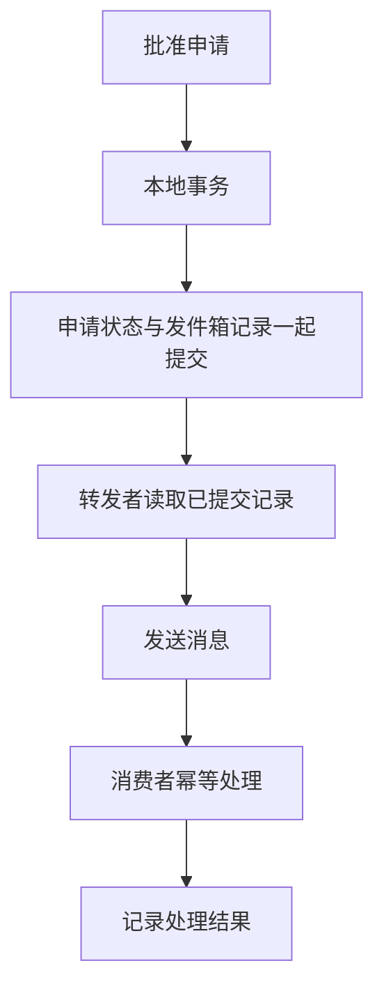

# 事件、工作流与补偿

> 本文面向设计异步处理和跨模块流程的开发者。读完能区分命令与事件，解释状态提交和消息发送之间的失败窗口，并为工作流安排重试、补偿与人工恢复。

## 消息的名字应表达语义

**命令**（command）表达希望执行的操作，例如“预留设备”。接收者可以因规则不满足而拒绝。**事件**（event）表达已经发生的事实，例如“设备已预留”。事件消费者不应改变该事实的过去含义，而可以基于它产生后续行为。

**消息**（message）是传输载体，可以承载命令、事件或其他信息。采用消息队列不等于采用事件驱动；把“请发送通知”放入队列仍是任务命令。清楚命名有助于确定谁决定业务结果、谁只是响应事实。

虚构的设备借用流程需要申请批准、设备预留和领取通知。通知失败应记录并重试，不能自动把已经批准的申请视为未批准。若预留失败，则可能需要取消批准或回到待处理状态。哪些步骤必须成功，哪些是可延后副作用，由业务规则确定。

事件至少应提供稳定事件标识、类型、版本、发生对象及必要事实。发生时间和处理时间不同，不能直接用消费者收到的时间推断业务顺序。事件内容应足够处理，但不应复制不必要的个人或敏感信息。

## 状态提交与消息发送是两次写入

先更新数据库再发消息，进程可能在两者之间崩溃；先发消息再更新，消费者可能观察到最终没有提交的事实。这是**双写问题**（dual write problem）。把两行代码相邻放置或加普通异常捕获，不能使两个独立系统自然形成原子操作。

**事务发件箱**（transactional outbox）在同一本地事务中提交业务状态和待发送记录，随后由转发者发送。它让“业务已提交但没有任何待发送记录”的窗口得到控制；转发环节仍可能重复发送，需要消费者处理重复。[AWS 事务发件箱](https://docs.aws.amazon.com/prescriptive-guidance/latest/cloud-design-patterns/transactional-outbox.html)

转发者发送成功却未记录进度，重启后可能再次发送。同一消息在消费者完成业务写入后、确认前发生故障，也可能再次投递。队列的去重或确认能力需要阅读具体语义，不能直接扩展为所有外部效果“恰好一次”。

消费者可以在本地事务中同时记录事件标识和业务变化；跨外部通知供应方时，还需要对方幂等标识或可查询结果。不同边界要分别分析。发件箱也需要清理、积压观察、顺序控制和异常记录，不能只建立一张表就认为可靠性完成。

## 工作流保存跨步骤状态

**工作流**（workflow）描述活动顺序、条件、状态和责任。短流程可以在普通应用代码中协调；长流程包含等待、人工审批和多次失败时，通常需要持久化当前步骤、关联标识和已发生结果。

| 流程状态 | 下一步 | 失败后的处理 |
| --- | --- | --- |
| 待批准 | 校验并批准 | 业务拒绝，保留理由 |
| 已批准待预留 | 请求预留设备 | 可重试瞬时错误，确定失败进入补偿 |
| 已预留待通知 | 请求发送通知 | 重试或人工联系，不重复预留 |
| 取消处理中 | 释放未领取预留 | 核对状态，处理中可恢复 |
| 需人工处理 | 指定核对任务 | 有权人员按记录决定并留痕 |

表格仅为虚构示例。真实流程要说明批准与预留是否可以短暂不一致，用户看到什么，如何查询进展，以及超出期限如何处理。一个“处理中”状态若没有期限和恢复动作，容易积累无法关闭的记录。

流程还要处理并发：取消请求与预留成功同时到达时，应该按哪个状态转换？工作流标识可以关联操作，版本检查或串行处理等机制可以帮助控制，但必须证明它们覆盖全部写入入口。

## 编排与协同的责任不同

**编排**（orchestration）由协调者明确下一步、等待结果并决定失败动作。**协同**（choreography）由参与者响应事件并产生后续事件，流程分散在各参与者中。AWS 的 Saga 模式文档讨论两者及其复杂度、幂等、隔离和观察问题。[编排](https://docs.aws.amazon.com/prescriptive-guidance/latest/cloud-design-patterns/saga-orchestration.html)、[协同](https://docs.aws.amazon.com/prescriptive-guidance/latest/cloud-design-patterns/saga-choreography.html)

| 维度 | 编排 | 协同 |
| --- | --- | --- |
| 流程表达 | 协调者中较集中 | 分散于事件订阅关系 |
| 变更影响 | 修改步骤和参与者契约 | 检查事件关系及隐含依赖 |
| 故障恢复 | 需恢复协调状态与任务 | 每个参与者维护恢复能力 |
| 可观察性 | 容易集中关联，仍需跨边界证据 | 需要统一关联与整体进展查询 |
| 适用压力 | 步骤、超时和补偿较复杂 | 少量独立响应、关系较清楚 |

协调者不必是单实例单点，事件协同也不意味着没有依赖。参与者越多，循环订阅、顺序假设和跨模块变更越难理解。选择应根据流程复杂度和维护责任，而非认为某种形式天然更先进。

## 补偿改变现在，不能抹去过去

**Saga** 将跨边界业务过程组织为一系列本地事务，失败时可以执行相应补偿。**补偿**（compensation）是按业务规则抵消或调整已发生效果的新操作，不等于数据库事务回滚。

预留设备后未领取，可以释放预留；领取已经发生，取消申请不能让设备物理回到库房；通知已经发出，可以再发更正说明，无法保证收件人忘记旧通知。补偿必须面对当前状态，而不是机械执行反向 SQL。

补偿也可能失败，需要幂等、重试、顺序和人工接管。多个流程同时修改同一对象时，补偿不应覆盖其他流程的合法变化。Saga 通常不提供单个本地事务那样的整体隔离，应分析中间状态和竞争风险。

有些业务不允许事后补偿，就不适合直接采用这种方式。可以重新设计预留、确认和提交阶段，把不可逆动作放在条件满足后执行；也可能需要保留共同事务边界。不能仅因系统拆成服务，就宣称必须接受所有中间不一致。

## 事件驱动不等于事件溯源

**事件溯源**（event sourcing）将事件序列作为状态的重要权威记录，通过处理事件重建状态。普通事件通知可以只用于传播变化，其数据库仍是权威状态。两者在存储、版本演进和恢复要求上不同。

重放事件也有风险。用于重建投影的处理不应再次发送真实通知或执行外部写入；旧事件的解释方式需要稳定或有迁移策略。删除或改写历史事件涉及审计与数据生命周期，不能只考虑程序是否还能运行。

## 可恢复流程的完成条件

设计应覆盖消息积压、重复、乱序、无法解析、消费者长期失败和协调者重启。死信或异常队列只是存放位置，需要说明谁判断、如何修复、是否可以重放以及如何避免再次失败。超时和重试基础见 [分布式一致性与部分失败](/software/architecture/distributed-failure)。

验证可以围绕失败窗口展开：本地提交后转发前停止、发送后记录前停止、消费者提交后确认前停止。检查业务效果、状态与恢复是否符合预期。本文未实施故障注入；这些是需要由具体项目验证的场景。

整体完成应由持久化状态和结果证明，不能仅靠“没有报错”或“消息已发出”。记录关联标识、当前步骤、最后错误和下一步责任，才能让自动恢复与人工处理连接起来。

## 实例：补偿失败后的人工接管

取消借用时发现释放预留接口不可用，流程应保留取消处理中及原预留标识，按策略重试并观察。重试耗尽后可以进入需人工处理，而不能直接显示已取消完成。人工核对需要看到当前设备状态、最后动作和已有结果，避免盲目重复释放。

如果设备已领取，释放预留并不等于归还，应改走经确认的归还或异常处理流程。人工动作也要记录权限、理由和结果，随后更新工作流状态。补偿设计只有把自动失败和人工接管接起来，才能避免无限停留在无人负责的中间状态。

## 参考资料

<Refs>

- [AWS：Transactional outbox](https://docs.aws.amazon.com/prescriptive-guidance/latest/cloud-design-patterns/transactional-outbox.html)、[Saga orchestration](https://docs.aws.amazon.com/prescriptive-guidance/latest/cloud-design-patterns/saga-orchestration.html)、[Saga choreography](https://docs.aws.amazon.com/prescriptive-guidance/latest/cloud-design-patterns/saga-choreography.html)；访问日期：2026-10-03。
- [一次请求如何经过系统](/software/guide/request-through-system)：区分同步返回与后续处理。
- [业务状态机](/software/backend/business-state-machines)、[消息、任务与幂等](/software/backend/messages-jobs-idempotency)：实现状态与重复处理约束。
- [恢复与对账](/software/operations/recovery-reconciliation)：处理未知结果和异常记录。

</Refs>
