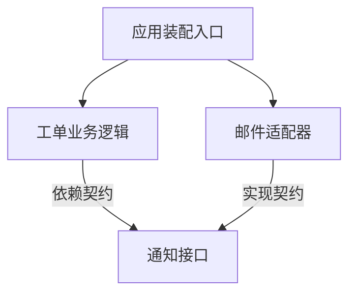

# 模块边界、依赖与接口

> 本文面向组织代码、设计接口或排查跨模块影响的开发者。读完能区分目录与模块边界，识别静态依赖和运行调用，并以契约和不变量确定数据修改责任。

## 模块让局部变化可以被理解

**模块**（module）是围绕一组责任、状态和接口组织的代码单元。它可以由文件、包、类或组件实现。目录是组织方式，模块边界则由允许访问什么、必须保持什么条件来体现。把文件分进几个文件夹，如果仍能互相修改内部数据，实际边界可能很弱。

虚构的工单系统包含受理、排班和通知。受理负责工单合法状态，排班负责时段与人员安排，通知负责发送结果。若通知模块为了方便直接把工单改成“已完成”，它绕过了完成条件，也把通知失败和业务状态联系在一起。应由工单状态的维护边界执行合法转换。

**信息隐藏**（information hiding）让调用方依赖公开契约，而不依赖内部数据结构或算法。**封装**（encapsulation）通过语言和工程约束保护内部状态与操作。Microsoft 的架构原则强调明确接口、隔离内部实现和显式依赖。[架构原则](https://learn.microsoft.com/en-us/dotnet/architecture/modern-web-apps-azure/architectural-principles)

封装不是把所有字段改成私有就完成了。接口若返回可随意修改的内部对象，或公开任意 SQL 写入入口，调用方仍能绕过规则。边界需要覆盖读写方式、对象生命周期及允许的状态变化。

## 从变化理由决定责任

**内聚**（cohesion）描述模块内部内容是否围绕相关责任组织；**耦合**（coupling）描述模块之间相互依赖的程度与方式。它们是分析方向，不是有一个全局最优数值的目标。

工单规则和工单状态验证经常一起变化，可以在同一领域边界内维护；短信供应方变化不应迫使工单规则修改，适合通过通知接口隔离。若两个模块每次都要同步变更、总在同一事务中维护同一不变量，应重新检查边界是否切错。

不能只按技术动作拆分。“读取模块”“写入模块”“工具模块”可能让一个业务变更遍历许多位置。也不能把所有相关操作塞入巨大的“业务模块”。可以观察真实变更：哪些文件经常一起修改，原因是什么，哪些依赖只是偶然便利，哪些规则必须一起保证。

## 依赖方向不等于运行方向

**静态依赖**指源代码或构建层面的引用，例如导入某个包、继承某个类型。**运行依赖**指实际执行时需要某个对象、进程、存储或外部服务。程序可以在运行时调用通知实现，而在源码层面只依赖自己定义的通知接口。

图展示源码依赖，不是发送邮件的时序。运行时装配入口将邮件适配器交给业务逻辑，调用仍会从业务逻辑进入适配器。图中方向需要标注，否则读者可能误以为邮件适配器主动调用业务。

**依赖反转**（dependency inversion）使高层规则依赖抽象契约，具体实现也依赖该契约。**依赖注入**（dependency injection）是提供协作对象的装配方式之一。使用容器或注入框架并不自动证明边界合理；一个接口如果暴露特定供应方全部类型，仍会泄漏实现细节。

循环依赖可能导致初始化、构建和变更相互牵连。解决时先找共享责任：提取稳定契约、重新分配职责，或承认两部分应属于同一模块。单纯把导入移到函数内部，可能只绕过加载问题，没有解决概念上的循环。

## 接口是一组行为承诺

**接口契约**（interface contract）包括操作名称、输入输出、前置条件、后置条件、失败结果与相关约束。参数类型只能覆盖其中一部分。`complete(ticketId)` 返回布尔值，不能说明重复完成、缺少验收记录和权限不足分别如何处理。

| 契约维度 | 工单示例中要说明的事项 |
| --- | --- |
| 身份与范围 | 谁能完成哪些工单，授权在哪个边界检查 |
| 前置状态 | 只允许处理中转为完成，是否要求验收记录 |
| 成功结果 | 状态和完成时间是否原子记录 |
| 重复调用 | 相同请求是否返回同一结果，是否重复发通知 |
| 失败结果 | 不存在、无权限、状态冲突和基础设施失败如何区分 |
| 时间与资源 | 截止时间、取消语义和资源释放方式 |
| 兼容承诺 | 哪些字段、错误及行为属于稳定契约 |

内部模块也需要契约，只是可以通过类型、测试和代码约定表达。跨进程接口还会增加网络超时、重试和版本协作问题，见 [HTTP API 契约](/software/backend/http-api-contracts) 与 [分布式一致性与部分失败](/software/architecture/distributed-failure)。

错误处理要保留调用方需要的判断。全部失败统一返回 `false`，会让调用方无法决定应修改输入、重新授权、重试还是报告未知结果。另一方面，直接把数据库异常堆栈公开给使用方，又会耦合实现和暴露不必要细节。宜保留稳定的领域错误及受控诊断关联。

## 数据拥有者维护不变量

**数据所有权**指哪个边界有权解释和修改某组业务状态，并承担其不变量。它不必意味着独立数据库。模块化单体可以共享数据库实例，同时规定只有对应模块写入其表，并通过接口提供其他模块需要的信息。

受理模块负责“已完成工单必须有完成记录”；排班模块可以请求完成，但不应直接更新状态列。需要跨模块原子变化时，应明确协调边界。若总要跨边界共同修改才能成立，拆分可能没有带来独立性。

读访问也会形成耦合。报表直接依赖内部表字段时，重命名可能影响多个消费者。可以采用稳定查询接口、只读视图或约定的事件投影，但这些方式也有维护和一致性成本。应按数据新鲜度、查询规模和变化频率选择，不能为所有场景统一加一层包装。

## 验证边界是否真实

静态规则可约束导入方向，契约用例可验证实现替换，集成检查可验证装配与持久化。不同检查回答不同问题：依赖图无环不代表运行没有同步循环，模拟对象通过不代表真实邮件供应方兼容。

可以做一次小型变化分析：替换通知渠道需要修改哪些位置？新增工单状态会影响哪些调用方？如果预计只影响一个适配器，实际却遍历整个业务层，应检查是否泄漏了供应方格式。检查结果应对应实际代码，而不能仅靠架构图宣称已经低耦合。

边界还要覆盖入口。页面、后台任务和批量导入都可能修改工单；如果只有页面路径执行验证，后台脚本仍能破坏规则。设计应让关键规则位于共同的写入边界，并利用数据约束防止绕过后的明显错误，具体事务机制见 [事务与索引](/software/data/transactions-indexes)。

## 何时不要增加抽象

接口有创建、理解和维护成本。稳定且局部的简单操作可以直接使用；不存在真实变化压力时，为每个类建立一个同名接口容易增加跳转，而没有隔离任何有价值的不确定性。

过于通用的接口也会损害表达：`execute(type, payload)` 看似统一，实际把规则藏在字符串和运行期判断里。宜先选择最小、能表达当前责任的契约，并在真实需要出现时演进。模块边界的价值是让有效变化更局部、错误更容易归因和验证，而不是增加目录或接口数量。

## 实例：把一次全局修改变成局部变化

新增一种通知渠道时，可以先列出当前代码哪些位置知道供应方名称、状态码和数据格式。理想变化边界是增加适配实现与装配选择，业务规则仍依赖稳定的通知结果。若供应方异步确认而旧契约承诺立即成功，就需要重新讨论契约，不能用适配器隐藏差异。

验证可以包含同一业务场景在两个实现下的结果，以及错误、重复调用和资源释放。模拟实现帮助验证规则，真实集成用于核对供应方语义，两者范围不同。完成后检查旧供应方类型是否仍泄漏到业务层，才能判断隔离目标是否实际达到。

## 参考资料

<Refs>

- [Microsoft：Architectural principles](https://learn.microsoft.com/en-us/dotnet/architecture/modern-web-apps-azure/architectural-principles)；访问日期：2026-10-03。
- [一次请求如何经过系统](/software/guide/request-through-system)：区分源码结构与运行路径。
- [设计原则、模式与重构](/software/architecture/principles-patterns)：按变化压力运用抽象。
- [单体、模块化单体与服务](/software/architecture/monolith-services)：从模块边界走向部署边界。

</Refs>
