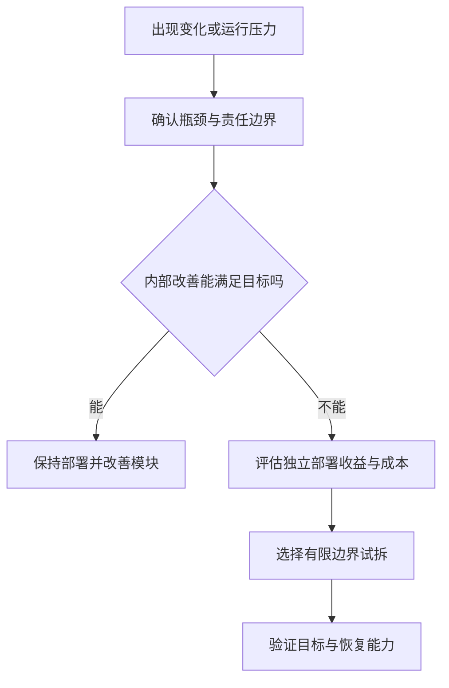

# 单体、模块化单体与服务

> 本文面向选择系统组织方式或规划拆分的开发与架构人员。读完能区分模块边界和部署边界，识别服务拆分的前提与成本，并设计有退出条件的渐进迁移。

## 三种组织方式改变不同边界

**单体应用**（monolith）通常以一个主要部署单元承载多个业务能力。它可以拥有多个内部模块，也可以部署多个相同实例。单体不意味着只有一个文件、一个进程实例或无法扩展。

**模块化单体**（modular monolith）在共同部署单位内建立明确模块责任、访问约束和契约。模块可以共享进程与数据库实例，但应限制跨模块直接修改内部状态。边界如果仅靠目录名称，没有检查和维护约定，容易逐渐被绕过。

**服务化架构**把部分能力放入独立运行和部署边界，通过进程间通信协作。微服务进一步强调适当的业务边界、独立演进与责任组织，云端通信和治理机制见 [微服务](/cloud/native/microservice)。本文重点判断为何拆分及软件侧的影响。

虚构的设备维修系统包含工单、排班、资料和报表。初期团队规模小，规则变化频繁，统一部署可以减少接口协作成本。后来报表任务资源消耗显著、更新节奏独立，才出现拆出任务执行边界的具体理由。这个例子是决策说明，没有实际性能数据。

## 模块化不由部署数量决定

一个系统即使有十个服务，也可能相互同步调用、共享写入表结构并同时发布。**分布式单体**是对这种强耦合现象的常用描述：增加了网络和运行成本，变化却仍无法独立进行。

反过来，一个部署单元可以让工单和资料模块独立组织源码、维护契约并由不同人员负责。发布需要协调，但日常代码变化不一定相互牵连。拆分部署之前，应先确认模块是否具有可解释的数据和规则边界。

| 维度 | 普通单体 | 模块化单体 | 独立服务 |
| --- | --- | --- | --- |
| 部署 | 通常共同发布 | 通常共同发布 | 可分别发布，需兼容窗口 |
| 调用 | 多为进程内 | 通过受控模块接口 | 网络、消息或其他进程间通信 |
| 数据 | 容易共享读写 | 明确写入所有权 | 服务维护私有数据与对外契约 |
| 故障 | 可能共用资源并相互影响 | 可限制部分内部影响 | 进程隔离更强，仍有依赖传播 |
| 一致性 | 可用本地事务 | 可协调本地事务 | 跨边界需要额外设计 |
| 运维 | 对象较少 | 对象较少 | 身份、发布、观察和恢复对象增多 |

表格不是优劣评分。独立服务是否能独立发布、故障是否隔离，要由真实依赖和资源关系证明；单体是否简单，要看内部结构。相同数据库实例下采用不同私有模式，与多个服务共享并任意改同一表，也不是同一种关系。

## 数据边界往往比代码边界更难

Microsoft 的微服务数据指导强调服务管理自己的数据，其他服务通过契约访问，以避免共享结构产生隐式耦合。[微服务数据考虑](https://learn.microsoft.com/en-us/azure/architecture/microservices/design/data-considerations)

维修工单与排班如果共同依赖“一个人员在同一时段只能安排一个任务”，拆分后仍需确定谁维护该不变量。各自写一半状态，然后期待同步消息最终一致，并不能自动保证禁止重叠。可以由排班边界统一决定可用性，工单记录安排结果，也可以保留共同事务边界；选择取决于业务允许的中间状态。

跨服务报表也需要设计。每次查询同步调用所有服务，会增加延迟与可用性依赖；复制数据形成查询投影，则引入延迟、重复和重建成本。需要实时正确的决策读和允许延迟的统计读可以采用不同路径，不必强行统一。

拆分时要盘点直接 SQL、定时脚本、导出任务和运维操作。只把 HTTP 入口移到新服务，旧程序仍直接写表，会使“数据已独立”成为不准确描述。数据边界详见 [模块边界、依赖与接口](/software/architecture/modules-interfaces)。

## 按可验证压力选择

Fowler 的 Monolith First 提出先建立单体、理解边界再拆分的经验观点，也明确承认其证据主要来自有限经验，不能作为所有项目的硬性规律。[Monolith First](https://martinfowler.com/bliki/MonolithFirst.html)

可考虑服务拆分的压力包括：独立扩缩资源、独立发布节奏、明确的团队责任、不同的运行约束或安全隔离要求。它们都需要说明当前损失和拆分后如何改善。请求量大本身不是充分理由；优化查询、缓存、异步任务或整体扩容可能更直接。

领域未知较多、团队缺少分布式运行能力、跨模块强事务很多时，模块化单体常是可评估方案。已有稳定领域边界、多个团队承担长期独立支持时，服务可能带来更大价值。不能用某个团队人数阈值或代码行数代替分析。

## 服务增加哪些必要能力

网络调用会发生超时与未知结果，需要重试、幂等和状态查询；独立版本会并存，需要接口兼容；进程隔离需要身份、连接和权限；多个实例和消息路径需要可关联观察。部署恢复还要考虑数据状态和外部副作用。

服务拆分增加故障隔离机会，但若每次请求都必须依赖全部服务，任一服务故障仍可能影响整条路径。资源隔离也需要限制线程、连接池、队列和并发，否则共享下游仍会受到拖累。具体部分失败机制见 [分布式一致性与部分失败](/software/architecture/distributed-failure)。

组织责任也有成本。每个服务应有人维护契约、值守、升级和恢复；“由平台统一处理”不能替代业务模块自己的正确性责任。服务数量增加后，接口沟通和故障协调可能超过原先内部沟通成本。

## 渐进拆分需要明确过渡状态

可以先选择稳定、依赖少且收益明确的边界。报表任务可能通过只读输入和结果输出隔离；核心工单状态若依赖多个强不变量，通常需要更谨慎的计划。先明确请求如何进入新旧路径、数据谁写、失败如何恢复，再实施迁移。

过渡期间可以使用路由或适配层，但要记录移除条件。双写尤其危险：旧系统成功、新系统失败，两个状态就会分化；重复重试又可能引入多次副作用。需要可靠记录、校验、修复和切换方案，不能靠“同时调用两个接口”宣称迁移安全。

对只读能力，可以比较新旧结果，说明差异口径、样本范围和允许偏差；对写入能力，影子执行不能产生真实副作用。验证应围绕拆分目标：资源竞争是否下降、发布等待是否缩短、错误是否能恢复。本文没有执行这些实验。

## 迁移完成与适用边界

完成条件应包括：旧入口不再写相关数据，调用方通过确定契约使用新边界，运行观察和支持已就绪，遗留适配与资源有清理安排。保留旧系统作为恢复路径时，应确认它还能读取当前数据，不能只留一份旧代码。

常见失败是按数据表逐个拆服务、共享写入没有改变、同步调用链越来越长、每次发布仍必须一起升级，以及迁移期间双重责任无人负责。发现这些信号时，可以调整边界、合并过细服务或回到共同部署，架构演进不必单向增加服务数量。

架构选择应对应当下可解释的压力和团队能力。明确模块与数据责任，保留验证与恢复证据，才能判断独立部署是否带来了值得维持的收益。

## 实例：拆出报表任务的接受条件

报表占用资源时，可以先比较整体扩容、进程内限流和独立任务进程。若选择独立边界，明确输入由谁提供、允许多旧的数据、任务失败是否影响工单，以及谁维护结果存储。报表消费者直接写工单表的问题，不会因报表进程搬到另一台机器而消失。

试拆的接受条件应对应原压力，例如关键工单路径不再受长报表竞争，报表能独立恢复且契约清楚。实际结果不足时，可以调整隔离方式或保留共同部署。本文未执行比较实验，因此这些条件是验证设计，不能作为已经获得收益的声明。

## 参考资料

<Refs>

- [Fowler：Monolith First](https://martinfowler.com/bliki/MonolithFirst.html)、[Microsoft：Data considerations for microservices](https://learn.microsoft.com/en-us/azure/architecture/microservices/design/data-considerations)；访问日期：2026-10-03。
- [从本地到生产](/software/guide/local-to-production)：理解部署所增加的责任。
- [云原生微服务](/cloud/native/microservice)：服务通信与治理机制。
- [架构决策与验证](/software/architecture/architecture-decisions)、[重构、技术债与架构演进](/software/maintenance/refactoring-debt)：记录和复核演进选择。

</Refs>
