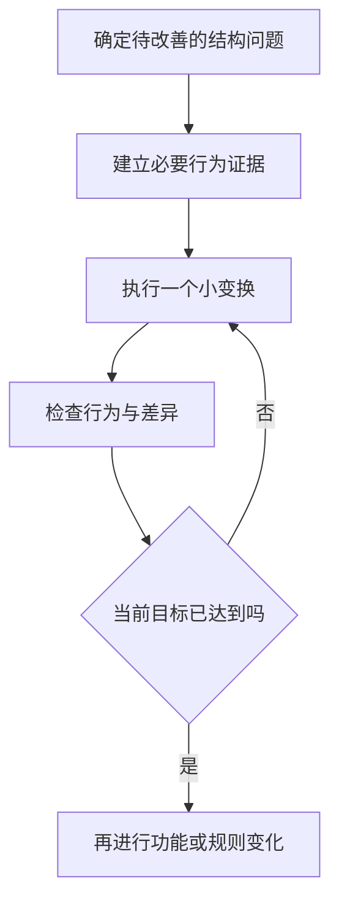

# 设计原则、模式与重构

> 本文面向改善代码结构、评审设计或判断抽象是否必要的开发者。读完能把原则连接到具体变化压力，识别模式的代价，并通过小步重构区分结构调整与行为改变。

## 从修改困难认识设计

虚构的资源导出工具将查询、筛选、CSV 格式化和文件上传写在一个函数里。增加 JSON 导出要修改同一段逻辑，替换上传位置也要修改它；测试筛选规则还必须连接外部存储。这些现象指出了变化相互牵连的位置。

**设计原则**是帮助分析责任、依赖和契约的指导。**设计模式**（design pattern）描述反复出现的问题及一种可复用的解决结构。原则不是自动评分规则，模式也不是看到相似类名就应采用的模板。判断应以当前问题、预期变化和代价为基础。

可以先把筛选规则写成可单独验证的函数，把格式化和上传设为明确协作对象。是否进一步建立策略层或插件系统，取决于格式与扩展需求是否真实存在。一个短期单格式工具可能不需要这些层次。

## 常见原则如何约束变化

**单一职责原则**（Single Responsibility Principle，SRP）关注同一单元承担的变化责任。它不是“一个函数只能有一行”或“一个类只能有一个方法”。筛选规则与上传供应方有不同变化理由，分离后可以分别演进；强行把一个完整的规则分散到许多微小类，反而会破坏理解。

**开闭原则**（Open–Closed Principle，OCP）鼓励在明确的变化点通过扩展增加能力，减少修改稳定逻辑。它不要求旧代码永远不变。导出格式经常增加时，可以通过格式化契约接入新实现；格式只有一种且暂无扩展需求时，提前做通用注册系统可能不划算。

**依赖反转原则**（Dependency Inversion Principle，DIP）让高层规则依赖抽象而非具体细节。导出规则可以依赖一个结果写入契约，文件系统或对象存储实现该契约。装配与运行调用的区别见 [模块边界、依赖与接口](/software/architecture/modules-interfaces)。上述原则的常见解释可参照 [Microsoft 架构原则](https://learn.microsoft.com/en-us/dotnet/architecture/modern-web-apps-azure/architectural-principles)。

**接口隔离原则**（Interface Segregation Principle，ISP）关注调用方是否被迫依赖不需要的能力。只需要写入导出结果的模块，不应必须实现删除用户、修改权限和列出全部存储的巨大接口。拆分应围绕使用者需求，而不必为每个方法单独建立接口。

**里氏替换原则**（Liskov Substitution Principle，LSP）关注行为兼容。子类型应保持使用方基于上层契约能够依赖的性质。Liskov 与 Wing 的论文从规格和可观察行为讨论子类型，而非只看语法继承。[行为子类型论文](https://www.cs.cmu.edu/~wing/publications/LiskovWing94.pdf)

例如写入契约承诺成功返回时结果可读取，新实现却只把任务放入队列。即使方法签名相同，也改变了成功含义，不能直接当作等价替换。应修改契约为异步状态，或提供符合原承诺的适配方式。

## 重复与抽象不是同一个问题

**避免重复**（Don't Repeat Yourself，DRY）重点是同一知识或规则存在多个权威副本。两个函数碰巧都乘以相同数字，不一定应合并：一个计算保存期限，一个计算显示比例，变化理由不同。反之，同一权限规则分散在页面、任务和 API 中，即使代码形式不同，也可能产生知识重复。

抽象应捕捉稳定的共同含义。把所有操作包装成 `handle(kind, data)`，可能让类型、前置条件和失败语义退化为运行期约定。宁可先保留少量可解释的重复，也不要用没有明确概念的通用框架绑定独立变化。

## 模式带来结构，也带来代价

| 具体问题 | 可考虑的结构 | 需要支付的代价 |
| --- | --- | --- |
| 多种格式共享选择规则 | 策略，独立格式化契约 | 选择和装配逻辑，契约验证 |
| 外部接口与内部模型不同 | 适配器 | 映射规则及错误转换维护 |
| 创建对象需要复杂条件 | 工厂或明确构建函数 | 创建逻辑与调用关系的理解 |
| 状态决定合法操作 | 状态机，必要时状态对象 | 状态转换和组合边界维护 |
| 多个接收方响应同一变化 | 观察者或事件机制 | 顺序、失败和生命周期问题 |

表格提供候选方向，不规定某个问题只能使用一个模式。简单条件分支可以足够清晰；策略对象在选择逻辑与契约稳定时才有价值。引入异步事件会把失败转移到另一条执行路径，不能只把“解耦”列为收益，事件可靠性见 [事件、工作流与补偿](/software/architecture/events-workflows)。

评审模式时，可以要求一个具体变化示例：新增格式在哪里发生，谁知道新类型，旧测试是否仍然有效？如果答案仍是修改所有调用方，模式名称没有解决目标问题。还应检查新增层次是否使日常排查更困难。

## 重构保持约定行为

**重构**（refactoring）通过小的结构变换改善可理解性和修改成本，同时保持可观察行为。Fowler 的定义明确区分重构与一般重组；修复规则错误或新增功能是行为变化，应单独说明。[重构定义](https://refactoring.com/)

资源导出示例可以先提取纯筛选函数，确认原有输入仍得到相同选择；再提取格式化，核对转义、列顺序和空值；最后隔离上传，确认失败语义没有变化。每步能够解释和定位，通常比一次完全重写更容易审查。

这里的“行为”需要明确观察范围。对导出工具，文件内容、排序、错误码和资源释放都可能是契约；日志内部格式是否算稳定，需要项目约定。不能先把原本被依赖的行为宣布成“内部细节”，再声称重构没有影响。

## 证据不足时先建立保护

没有测试的旧代码仍可以改善，但风险更高。先覆盖受影响路径，记录当前行为；不理解的行为可以先保留，再通过领域确认决定是否修复。测试只能覆盖选定条件，不是行为等价的完整证明，必要时还应对照接口和数据输出。

自动重构工具可以帮助重命名和移动结构，但反射、配置字符串、动态导入和外部调用方可能不在工具视野中。操作后应查看实际差异和受影响路径。编译通过证明一部分关系仍成立，不能覆盖所有运行行为。

性能、并发和资源管理尤其需要谨慎。把循环换为集合操作可能改变求值时机或内存规模；把局部对象共享起来可能引入并发问题。是否属于可接受的内部变化，要由契约和质量要求决定，而不是由代码更短决定。

## 控制设计投入

设计投入应与系统寿命、变化频率和损失相匹配。可用的判断信号包括：一次变化需要同时改很多无关模块、测试必须依赖外部系统、不同入口执行不同规则、扩展点经常被绕过。这些现象提供改善理由。

不能从模式数量推断设计质量，也不能承诺重构必然降低所有成本。Fowler 的设计耐力文章将长期设计收益明确称为假说，不能把示意曲线当作测量数据。[Design Stamina Hypothesis](https://martinfowler.com/bliki/DesignStaminaHypothesis.html)

如果系统接近停用、某段代码长期稳定且不影响风险，大规模抽象可能没有足够收益。优先改善当前变化路径，保留清楚契约和验证，使后续设计可以根据事实继续调整。

## 实例：策略扩展仍要保持行为契约

CSV 与 JSON 格式化器可以共享一个导出选择流程，但它们不必共享全部实现。CSV 需要转义与列顺序，JSON 需要值类型和结构约定。若为了消除相似代码，先把两者转为同一组字符串，可能丢失 JSON 的数字和空值语义。

策略契约可以表达输入的领域数据及输出结果，而具体格式规则分别维护。共享规则包括选择范围和权限，独立规则包括转义和格式。新增格式时先确定使用方如何读取，再写相应验证；不应因为已经存在一个策略接口就认为任何新实现都可直接替换。

这也说明原则需要结合语义：相似循环不一定代表相同知识，接口统一不一定代表行为等价。评审时用一个具体输入和消费方式检查结果，往往比数抽象层数更容易发现错误。

## 参考资料

<Refs>

- [Microsoft：Architectural principles](https://learn.microsoft.com/en-us/dotnet/architecture/modern-web-apps-azure/architectural-principles)、[Liskov 与 Wing：A Behavioral Notion of Subtyping](https://www.cs.cmu.edu/~wing/publications/LiskovWing94.pdf)、[Fowler：Refactoring](https://refactoring.com/)、[Design Stamina Hypothesis](https://martinfowler.com/bliki/DesignStaminaHypothesis.html)；访问日期：2026-10-03。
- [语言、框架与依赖](/software/guide/languages-frameworks-dependencies)：区分业务设计和工具选择。
- [代码审查与变更证据](/software/collaboration/code-review-evidence)：评审变化后的行为证据。
- [重构、技术债与架构演进](/software/maintenance/refactoring-debt)：安排持续改善的范围与成本。

</Refs>
