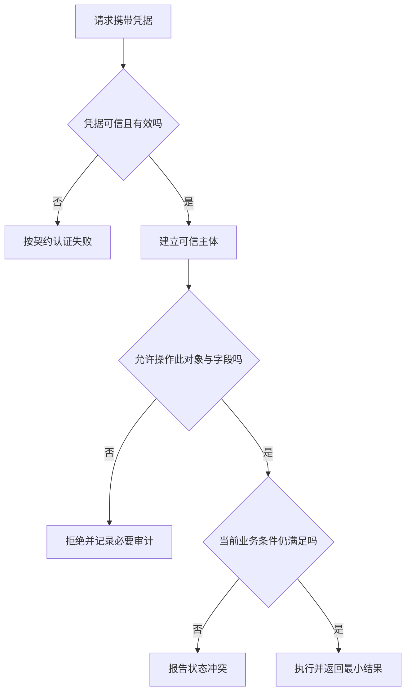

# 身份认证、会话与权限

> 面向实现登录、保护接口和验收权限边界的开发者。读完能区分认证、会话和授权，理解 Cookie、令牌、OAuth 与 OpenID Connect 的职责，并用直接接口请求检查对象、字段与动作是否真正受保护。

## 身份与权利是两个问题

**身份认证**（Authentication）确认调用者是谁或持有何种可信凭据；**授权**（Authorization）判断该主体能否对某对象执行某动作；**会话**（Session）保存多次交互之间的身份关联。用户成功登录，不代表可以访问任意对象。角色名称只是输入，实际授权必须结合资源范围和当前条件。

服务端首先验证凭据，形成可信主体，再依据策略判断动作。客户端提交的 `userId`、`isAdmin` 或隐藏字段不能直接成为可信身份。页面路由守卫和按钮隐藏改善体验，敏感接口、后台任务与导出入口仍需独立执行可信授权。

权限可以按角色组织，也可以结合资源关系与属性。**RBAC**按角色授予权限，**ABAC**结合主体、资源和环境属性判断；二者可组合。选择依据是能否准确表达规则并持续审计，不是机制名字越复杂越安全。[OWASP 授权指导](https://cheatsheetseries.owasp.org/cheatsheets/Authorization_Cheat_Sheet.html)

## Cookie 与令牌各自承担什么

**Cookie**是浏览器按规则保存并随请求发送的信息，可以承载不透明会话标识，也可以承载其他数据。**令牌**是表示身份或访问能力的凭据形式，并不规定必须放在 Cookie 还是请求头。把“Cookie 登录”和“JWT 登录”当成完全对立的分类，会混淆传输与内容。

服务器会话通常让浏览器保存随机、不含业务秘密的标识，服务端保存对应状态。它便于撤销与更新，但需要会话存储、期限和可用性管理。登录、权限提升等重要边界应更新会话标识，退出要使相应会话失效，而不只是删除页面展示信息。[OWASP 会话管理](https://cheatsheetseries.owasp.org/cheatsheets/Session_Management_Cheat_Sheet.html)

**JWT**（JSON Web Token）是表达声明的格式，签名验证说明内容按相应密码学契约未被改动；普通签名 JWT 的载荷并未因此加密。验证还要约束算法、签发者、受众、期限和令牌类型，并取得可信密钥。解码成功不等于验证成功，访问令牌与 ID Token 不能任意互换。[RFC 8725](https://www.rfc-editor.org/rfc/rfc8725.html)

| 方案 | 适合考虑的条件 | 核心维护责任 |
| --- | --- | --- |
| 不透明服务器会话 | 同源 Web、需要及时撤销 | 会话存储、轮换、过期与退出 |
| 自包含访问令牌 | 服务需验证授权声明 | 密钥、受众、期限和撤销边界 |
| 统一身份提供方 | 多应用或复杂认证需求 | 重定向、安全配置与本地授权 |
| 服务到服务凭据 | 机器调用，无交互登录 | 最小权限、轮换和主体区分 |

自包含令牌减少某些查询，却可能把权限变更延迟到过期或额外撤销机制生效。不能为了减少存储就假定“无状态”没有状态责任：密钥、会话撤销、刷新令牌和账号停用仍要管理。

## OAuth 与登录协议的边界

**OAuth 2.0**是授权框架，使客户端取得访问受保护资源的能力；**OpenID Connect**（OIDC）在其上增加身份层，定义 ID Token 等认证信息。普通 OAuth 访问令牌不是通用登录身份格式，必须按提供方与资源服务器契约使用。[OIDC Core](https://openid.net/specs/openid-connect-core-1_0.html)

授权码流程通过重定向取得一次性代码，再在令牌端点交换。**PKCE**（Proof Key for Code Exchange）把这次交换绑定到发起者掌握的证明，降低代码被截获或注入的风险。RFC 9700 要求公共客户端使用 PKCE，并为其他类型给出相关建议；前端不能安全保管客户端秘密，写进脚本就会公开。[OAuth 安全 BCP](https://www.rfc-editor.org/rfc/rfc9700.html)

实现还要限制重定向 URI、绑定发起交易与回调、验证签发者和受众，并按 OIDC 规则使用 nonce 等参数。多身份提供方的配置不能仅由不可信输入任意决定。推荐使用符合协议、持续维护的库与提供方能力，仍需审查实际参数和部署配置。

身份有效、权限满足和状态允许是三次不同判断。权限应在实际执行入口落实；角色在 UI 中显示正确，不能证明图中第二个判断已执行。

## 浏览器会话要处理两类攻击面

**跨站请求伪造**（CSRF）利用浏览器可能自动携带凭据的行为，诱使用户向目标服务发送非自愿请求。可根据架构采用 CSRF token、来源检查与合适的 SameSite 设置等措施。SameSite 是纵深防护的一部分，不能不分析请求路径就替代全部设计；GET 也不应执行写入。[OWASP CSRF 指导](https://cheatsheetseries.owasp.org/cheatsheets/Cross-Site_Request_Forgery_Prevention_Cheat_Sheet.html)

**跨站脚本**（XSS）让攻击代码在页面上下文执行。`HttpOnly` 可阻止脚本直接读取相应 Cookie，不能阻止恶意脚本利用用户会话发起操作。存入 `localStorage` 的凭据可被同源脚本访问。两类存储方案都需要输出安全、内容边界和最小权限，不能仅靠改存储位置就宣称解决所有风险。

Cookie 的 `Secure`、`HttpOnly`、`SameSite`、域与路径需要按部署方式配置；多个子域共享过宽范围会扩大影响。CORS 涉及跨源共享与某些请求的预检，简单请求可能已经发送而响应不可读。对规定必须携带自定义头的 API，严格限制可信来源并核对预检，可以成为特定 CSRF 防护方案的一部分；它仍不能代替服务端授权，也不能未经分析就当成完整防护。退出、过期与刷新还应覆盖多标签页及并发请求。

## 对象、动作与字段的权限检查

以虚构团队资料库为例，普通成员可以读公开资料，编辑者只能修改被分配范围，审核者可以发布，导出可能另有权限。检查不能只验证“是编辑者”，还要验证“能编辑这个对象”。列表查询本身就应限制范围，不能先返回所有对象再在浏览器过滤。

字段也有独立边界：能读标题不意味着能读私人备注，能改内容不意味着能改所有者。批量接口要对每项对象检查并规定整体原子性或部分失败契约。直接对象引用错误常表现为改一个 ID 就能读别人数据，应以负向样本验证，而不是只测正常账号。

| 验证路径 | 应检查的事实 | 可记录证据 |
| --- | --- | --- |
| 未认证直接调用 | 无凭据不能执行敏感动作 | 响应与权威状态 |
| 换成其他对象 ID | 对象范围仍受限 | 输入标识、主体与拒绝结果 |
| 修改受保护字段 | 不因 JSON 出现字段就允许 | 字段白名单与保存结果 |
| 撤销权限后再调用 | 变更按约定及时生效 | 令牌期限、撤销与时间范围 |
| 使用导出或后台入口 | 同样落实策略 | 入口和输出可见性 |

审计记录应能解释主体、动作、目标与结果，但避免记录密码、完整令牌和不必要私密内容。认证失败、权限拒绝与系统异常应分类，否则无法区分攻击、配置错误和正常业务冲突。

## 失败模式与适用范围

常见失败包括把 JWT 解码当验证、将 ID Token 当任意 API 访问令牌、只检查角色不检查对象、退出只清浏览器状态、刷新令牌无限延长和敏感日志泄露。诊断时应沿凭据验证、主体建立、策略评估和实际保存逐段取证。

本文是应用工程机制与验收框架，不覆盖所有行业身份合规要求或特定提供方配置。采用现成身份服务可以减少协议实现风险，但不能将本地业务授权交给一个“已登录”标志。密码、秘密和整体应用防护的进一步边界见安全专题。

## 策略更新需要明确生效时间

角色和对象关系变化时，应用、会话与缓存都可能保留旧授权信息。应规定敏感动作是否每次读取当前策略，以及普通展示允许怎样滞后。令牌中的旧声明若继续有效到期，必须把这个窗口作为架构契约说明，而不是报告“撤权立即生效”。

权限测试可以采用主体、资源、动作和条件的矩阵：对象拥有者、同组成员、其他成员与未认证请求分别尝试读取、修改、发布和导出。还要验证允许动作不会被过度拒绝。只证明所有请求都被阻断不等于权限正确，授权需要在保护边界内让合法任务完成。

身份提供方停用或不可用时，要明确已有会话、新登录和敏感操作各自的行为。允许已有会话继续多久，是业务与安全策略；不能在依赖失败时自动跳过认证，也不能无区别清除所有合法草稿。拒绝与恢复流程应能被用户理解和维护人员复核。

服务账号与用户账号应可区分，避免机器持有长期高权限凭据却以某个人名义记录所有动作。凭据轮换和停用要检查实际调用方，确保恢复服务时不会重新启用已经撤销的权限。

## 参考资料

<Refs>

- [RFC 9700：OAuth 2.0 Security BCP](https://www.rfc-editor.org/rfc/rfc9700.html) · [OpenID Connect Core 1.0](https://openid.net/specs/openid-connect-core-1_0.html) · [RFC 8725：JWT Best Current Practices](https://www.rfc-editor.org/rfc/rfc8725.html)（访问日期 2026-10-03）
- [OWASP：Session Management](https://cheatsheetseries.owasp.org/cheatsheets/Session_Management_Cheat_Sheet.html) · [Authorization](https://cheatsheetseries.owasp.org/cheatsheets/Authorization_Cheat_Sheet.html) · [CSRF Prevention](https://cheatsheetseries.owasp.org/cheatsheets/Cross-Site_Request_Forgery_Prevention_Cheat_Sheet.html)（访问日期 2026-10-03）
- 站内相关：[HTTP 与契约](/software/backend/http-api-contracts) · [业务状态机](/software/backend/business-state-machines) · [浏览器 API](/software/frontend/javascript-browser-apis)

</Refs>
