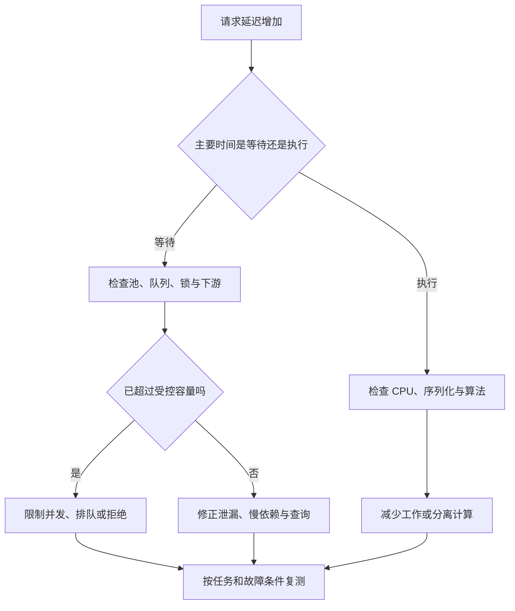

# 后端框架、性能与资源管理

> 面向选择服务端技术和诊断性能问题的开发者。读完能按执行模型、依赖和资源约束比较框架，解释连接池、队列与超时的作用，并用实际任务设计容量验证，而不是依据空接口跑分决定业务架构。

## 框架只是资源路径的一部分

**后端框架**提供路由、请求解析、中间件、依赖组织和错误处理等结构。**运行时**负责语言执行与并发机制，数据库驱动、服务器容器和外部客户端又各有资源模型。一个请求最终耗时，是这些部分共同作用的结果，框架名称无法单独解释性能。

**吞吐量**是单位时间完成的工作数量，**延迟**是一次工作经历的时间，**并发量**是同时在途的工作数量。提高并发可能提升吞吐，也可能只是增加排队与内存。CPU 利用率低不代表服务空闲，它可能在等数据库连接、锁或下游响应。

选择前先写工作负载：读写比例、输入和输出大小、依赖数量、延迟目标、峰值、故障时行为与维护团队能力。不能把简单文本响应与包含事务和外部调用的业务请求按同一排名比较。本文不提供任何测得的框架基准或通用池大小。

## 阻塞与非阻塞改变等待成本

**阻塞调用**在等待结果时占用当前执行线程；**非阻塞调用**允许执行资源在等待期间处理其他工作。异步语法、非阻塞 I/O 与 CPU 并行是不同维度，`async` 不会自动使任意同步库非阻塞。

Node.js 的回调在事件循环上执行，部分文件、密码学等工作使用 libuv 工作池。长同步回调会延迟其他请求，工作池任务拥塞也会影响共享池的操作。应用自己的 CPU 循环不会因为写在 Promise 里就自动进入工作池。[Node.js 执行模型](https://nodejs.org/learn/asynchronous-work/dont-block-the-event-loop)

FastAPI 文档区分 `async def` 路径函数与普通 `def` 的执行方式，后者由框架在外部线程池中运行；自己直接调用的普通工具函数则不会自动被框架调度。因此在异步处理器中调用阻塞客户端，仍需按库与运行边界处理。[FastAPI 并发](https://fastapi.tiangolo.com/async/)

Spring WebFlux 文档解释其少量事件循环线程与非阻塞假设，并提醒阻塞持久化或网络依赖不适合直接放入该模型。现有 Spring MVC 系统若运行良好，不必为了标签切换；非阻塞的主要收益是等待密集时资源使用更可预测，不是承诺单次计算一定更快。[WebFlux 概览](https://docs.spring.io/spring-framework/reference/web/webflux/new-framework.html)

| 执行选择 | 可优先考虑的负载 | 需要验证的代价 |
| --- | --- | --- |
| 阻塞处理与受控线程 | 现有阻塞库丰富、流程直接 | 线程、栈、池等待与并发上限 |
| 事件循环与异步 I/O | 等待多、依赖有非阻塞接口 | 长回调、驱动、取消与诊断 |
| 专用计算工作单元 | CPU 密集且可分离的工作 | 调度、数据传递与排队 |
| 后台任务 | 无需同步完成的长工作 | 状态查询、持久化和恢复 |

## 连接池为什么不是越大越好

**连接池**复用有限连接，减少频繁建立的成本，也限制访问下游的并发。池大小取决于数据库处理能力、实例数与请求工作量。每个服务副本配置相同大池，扩容后总连接数会成倍增加，可能先耗尽数据库而不是提升能力。

池等待时间、实际查询时间与事务持有时间应分别观察。请求慢可能因为连接未取得，并不是 SQL 本身慢。长事务、未释放连接和慢外部调用都可能延长持有时间。增加池大小前，应解释为什么更多并行工作不会加重数据库锁和 I/O 竞争。

**无界队列**把超过容量的工作一直留在内存，看似减少即时拒绝，却会让等待越积越长。限制排队数量、等待期限与请求大小，使故障结果更可解释。依据稳定范围的到达率与平均在途时间可以估计平均在途量，但这不替代峰值、分布和过载实测。

## 背压、缓存与内存的取舍

大量输出时，**流式处理**边生产边传递数据，可以避免一次保留全部结果，但需要背压、断开与错误管理。Node.js 流文档说明写入返回值与 `drain` 等机制；忽略下游速度会继续缓冲，失去流式节省内存的目的。[流接口](https://nodejs.org/api/stream.html)

缓存减少重复工作，也占用内存并引入失效规则。无上限缓存与高基数键可以长期保留大量对象；提高命中率不能证明数据新鲜或权限正确。不要缓存完整用户请求对象，缓存应保存明确数据并有容量和寿命边界。

内存诊断应区分持续保留与短时峰值。大对象解析、一次性导出和压缩可能产生峰值，监听器、订阅与缓存泄漏可能产生阶梯式增长。垃圾回收能释放不可达对象，不能修正程序仍引用无用对象的设计。性能轨迹、堆分析与任务次数要对应同一版本和输入。

## 框架选择还包括错误与维护

路由和 Schema 支持、认证集成、ORM、任务库、可观测能力和部署方式都影响长期成本。能力越多，默认行为与升级影响也越多。轻量框架可以让边界透明，但团队需要自己组织缺失部分；完整框架减少拼接，也需要理解约定和扩展点。

Express 官方错误处理文档说明同步、异步与传递错误的处理路径，并区分响应已开始时的处理。选择框架后必须核对对应版本的异步异常传播，不能假定抛出的 Promise 错误会被所有版本以同样方式接住。[Express 错误处理](https://expressjs.com/en/guide/error-handling/)

| 决策维度 | 问题 | 可检查证据 |
| --- | --- | --- |
| 依赖兼容 | 驱动和第三方库是否匹配执行模型 | 实际调用路径与阻塞点 |
| 维护能力 | 团队能否调试与升级 | 文档、支持周期和升级说明 |
| 资源边界 | 是否可设置限额、取消与关闭 | 请求和工作池配置 |
| 错误契约 | 异常怎样映射并清理 | 失败路径与回归样本 |
| 部署适配 | 长连接、临时盘和进程模型是否支持 | 目标环境约束与产物 |

## 按真实任务设计性能验证

以虚构资料查询与导出为例，准备不同结果大小、冷热缓存、正常和慢依赖，逐步增加负载。记录成功与失败请求、延迟分布、池等待、CPU、内存、数据库锁和队列年龄。仅报告成功请求吞吐会把拒绝或丢弃隐藏掉；测试客户端也可能成为瓶颈。

应采用受控到达或明确的并发模型，说明发压方式与持续时间。系统过载后，客户端发请求变慢可能掩盖原有到达压力，因此口径必须固定。测量还要包括预热、稳定阶段、过载与恢复，避免只取最有利时间段。

故障时要确认超时是否停止无用工作、连接是否归还、过载是否有界、恢复是否需要人工重启。本文未执行压测，任何容量或提升结论都要由具体版本、配置与工作负载取得。框架选型完成应保留判断理由与重选触发条件，而不是留下一个脱离业务的性能榜单。

## 容量变化需要检查全部共享资源

服务副本增加后，连接池、线程池、定时任务和外部限额都会改变总量。多个实例各自正常，不代表组合仍在数据库和提供方允许范围。扩容方案应记录每实例和总体预算，并检查任务是否因每个实例都调度而重复。

优化还可能把瓶颈转移到网络、日志或存储。增加批处理降低调用次数，却提高单批内存和失败影响；降低日志量节省资源，却可能失去关键阶段证据。选择应同时检查延迟、失败、资源与可诊断性，而不是只最大化吞吐。

对缓存、池和队列的所有限额，应说明超出后是等待、拒绝还是降级。明确结果有利于上层安排重试；默默截断输出或丢弃工作则改变业务契约，不能以“保护系统”为由隐藏。

框架升级后默认解析、错误传播和资源配置可能变化，应把关键行为纳入升级验证。版本升级的证据应包含实际依赖树和目标环境，而不是只修改清单数字。选择轻量或完整框架，都需要保留接管人员能找到的配置和诊断入口。

压缩与序列化也消耗计算资源。启用压缩后应观察 CPU 与输出量变化，小响应未必获益；大型对象还可能产生额外内存副本。是否采用由实际传输与执行证据决定，不能直接用开关名称推断收益。

## 参考资料

<Refs>

- [Node.js：Don't Block the Event Loop](https://nodejs.org/learn/asynchronous-work/dont-block-the-event-loop) · [Stream](https://nodejs.org/api/stream.html)（访问日期 2026-10-03）
- [FastAPI：Concurrency and Async/Await](https://fastapi.tiangolo.com/async/)（访问日期 2026-10-03）
- [Spring Framework：WebFlux Overview](https://docs.spring.io/spring-framework/reference/web/webflux/new-framework.html) · [Express：Error Handling](https://expressjs.com/en/guide/error-handling/)（访问日期 2026-10-03）
- 站内相关：[服务生命周期](/software/backend/service-lifecycle) · [SQL 与计划](/software/data/sql-query-plans) · [缓存边界](/software/data/cache-search-storage) · [前端性能](/software/frontend/frontend-performance)

</Refs>
