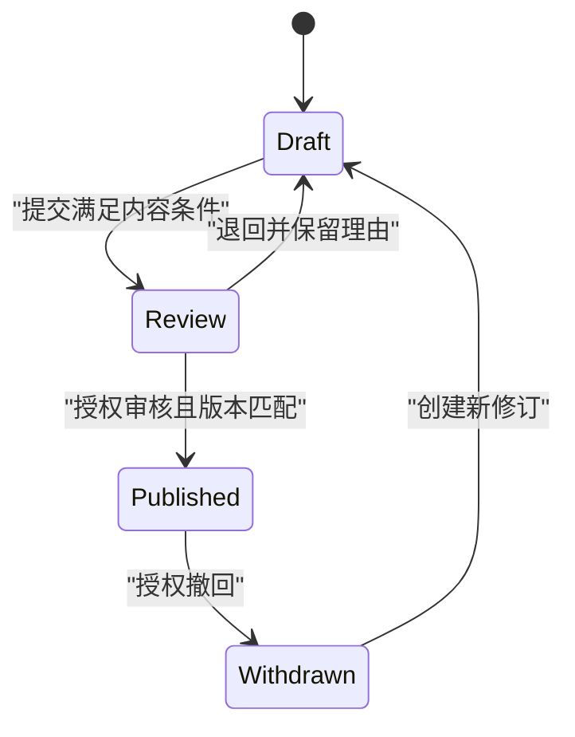

# 业务逻辑、规则与状态机

> 面向实现业务流程与审查规则完整性的开发者。读完能把需求整理成不变量、状态和允许的转换，确定规则应在哪个可信边界执行，并设计重复、并发、超时与补偿时仍可解释的行为。

## 业务规则不是页面分支的总和

**业务逻辑**描述系统在给定事实、权限和状态下应该采取什么动作。**不变量**是始终必须成立的约束，例如同一事项最多存在一个生效批准、已归档记录不能继续编辑。**状态机**（State Machine）用状态、事件、条件与转换描述行为，帮助检查允许和禁止的路径。

页面可以禁用“批准”按钮，服务端仍要验证当前状态与操作者权限。另一个客户端、旧页面或直接请求都可能绕过显示限制。数据库约束能够守住部分不变量，跨对象和流程规则仍需要明确实现。规则的权威位置应只有可审查的归属，展示层可以重复提示，却不能成为唯一防线。

状态机不要求引入专门引擎。简单流程可用明确枚举和转换函数；涉及并行状态、层级状态与复杂协调时，才评估状态图或工作流工具。W3C SCXML 提供状态、转换、事件和条件的标准表达，但它不是应用选择数据库事务或授权机制的替代品。[SCXML](https://www.w3.org/TR/scxml/)

## 先用业务语言定义状态

以虚构资料发布审批为例，草稿、待审、已发布和已撤回表达资源生命周期；“HTTP 请求处理中”表达调用过程，不应混入同一个字段。审核人正在浏览资料，也不是资料的新状态，除非业务确实需要占用和超时租约。

| 当前状态 | 命令 | 必需条件 | 成功结果 |
| --- | --- | --- | --- |
| 草稿 | 提交审核 | 必需内容完整、具有提交权 | 待审并记录提交版本 |
| 待审 | 批准 | 具有审核权、版本未变 | 已发布并记录决定 |
| 待审 | 退回 | 审核权、理由符合契约 | 草稿并保留审核历史 |
| 已发布 | 撤回 | 具有撤回权、规则允许 | 已撤回并记录原因 |
| 已撤回 | 再发布 | 明确再审批策略 | 不能默认直接回已发布 |

这些是教学规则，不代表任何真实组织流程。表格要同时覆盖拒绝情况：已发布对象再次批准，是返回现有结果、拒绝还是产生新版本，应由契约明确；不能靠代码偶然表现决定。

**命令**是请求做某事，可能被拒绝；**事件**记录已经发生的事实。`ApproveDocument` 与 `DocumentApproved` 不是同一种消息。将命令直接写成“已批准”事件，会绕过判断，也使下游无法知道事实究竟是否已成立。



图上没有直接从撤回到发布的箭头，因为示例要求新修订再审核。缺少箭头表达禁止路径，不能让任意管理员直接修改字段绕过它。确有应急通道时，也应作为明确动作，有权限、理由和审计记录。

## 转换需要判断、保存和并发保护

一个可靠转换通常先取得权威对象，验证主体权限、当前状态与业务条件，再在受保护边界中保存新状态及相关记录。**守卫条件**（Guard）决定转换是否允许，**转换动作**更新状态或产生相应事实。条件检查与保存若分开而不协调，就留下并发窗口。

两个审核请求都读到“待审”，随后分别批准和退回，最后状态可能由偶然写入顺序决定。**乐观并发控制**通过版本条件更新并检查受影响行数；**悲观锁**通过锁定相关数据协调冲突。它们并非产品质量排名，选择由冲突频率、事务长度和不变量范围决定。[PostgreSQL 显式锁](https://www.postgresql.org/docs/18/explicit-locking.html)

下列伪代码未执行，表达的是一次条件更新思路；真实实现还需事务、约束和错误分类。

```text
取得可信主体与当前资料
验证批准权限和内容规则
UPDATE document
  SET state = published, version = version + 1
  WHERE id = target AND state = review AND version = expected
若受影响行数不是 1：返回冲突并重新读取
同一事务记录审核决定与待发布事件
提交成功后报告结果
```

如果审核历史写入失败却状态已更新，资料可能发布了而没有决定依据。因此需要原子保存相关权威事实。对跨数据库和外部服务的动作，单库事务不足以覆盖，必须另外定义消息、补偿与对账。

## 规则应怎样组织与复用

可以把纯判断从 HTTP、数据库和通知细节中分离：输入明确事实，输出允许与否及稳定理由。这样便于验证边界，也避免每个入口复制一份略有差异的规则。但纯函数读到的事实可能过时，执行时仍要用事务或版本条件确保判断基础未失效。

查询侧可以返回“当前可用动作”供界面展示，它是体验信息；用户真正执行时服务端仍重新判断。权限可能已撤销，资料版本可能已变化，查询结果不能成为永久能力凭证。对于影响历史结果的规则变化，需要记录规则版本或足够的事实，才能解释此前为何允许。

**时间条件**也是状态规则的一部分。例如审核期限以哪一方时钟为准、临界点是否包含、暂停如何处理，都应定义。定时任务触发延迟时，不代表过期事项应继续允许。业务应依据权威时间与规则判断，而不是仅靠“定时任务把状态改掉了没有”。

## 副作用、补偿与未知结果

**副作用**是改变外部状态的行为，例如发送邮件、推送文件或调用外部系统。数据库提交与副作用不能随意用执行顺序拼成原子动作：先发邮件再提交，可能邮件已发但事务失败；先提交再发邮件，可能状态已变但通知丢失。可使用事务发件箱保存待发送事实，再由可靠工作流程处理。

**补偿**是用新的业务动作修正已完成动作的影响，不等同于撤销数据库指令。资料发布后若已有外部订阅者取得内容，撤回无法让所有读取都未发生。补偿需要明确可逆部分、不可逆部分和人工处理路径，不能只写“失败就回滚”。

未知结果需要独立表示。外部接口超时可能已执行，不能立即恢复旧状态并重复调用。可以保存待确认操作，使用外部查询或对账判定结果；没有可靠确认时，应保留异常状态与处理责任。对有截止时间的流程，还要规定迟到成功如何处理。

| 机制 | 适用条件 | 代价与边界 |
| --- | --- | --- |
| 条件更新与版本检查 | 同一对象、冲突可重试 | 冲突时需重新判断全部规则 |
| 显式锁与短事务 | 需要协调共享数据 | 锁等待、死锁与事务寿命 |
| 状态机表或转换函数 | 路径清晰、需审查拒绝情况 | 仍需可信持久化与权限 |
| 工作流引擎 | 长流程、恢复与人工节点多 | 版本、运行历史和平台依赖 |
| 补偿与对账 | 跨边界副作用不可原子完成 | 只能按业务定义修正结果 |

## 如何验证规则完整性

从每个状态列出允许和禁止命令，再设计重复调用、并发冲突、权限撤销、版本变化和临界时间。断言应检查最终权威状态与相关记录，不应只看响应。对纯判断可使用表驱动样本；对并发机制要制造交错顺序，才能证明没有检查后写入窗口。

常见故障包括非法跳转、同一决定产生两份历史、事务外通知丢失和批量操作绕过单条规则。修复时要追查所有入口，包括后台任务、导入和管理员工具。一次页面修复无法覆盖其他写入路径，数据库约束和明确领域入口可以缩小风险范围。

本文不要求建立真实审批应用，也未运行案例。状态机是表达工具，业务边界应从需求和验收取得；若规则不清楚，画更多状态不能消除矛盾，应该先把不变量和失败含义说清。

## 批量动作要说明失败范围

一次命令涉及多个对象时，应规定全部原子成功还是逐项结果。逐项批准可以减少一个错误阻断整批的影响，但客户端必须取得每项的完成、拒绝或未知状态；只返回“处理完成”会隐藏未执行对象。全批事务则要评估锁与持续时间，不能让请求规模无限增长。

流程定义变化还要考虑在途对象。新增审核阶段后，旧待审事项应按旧规则完成、迁入新阶段还是等待人工判断，需要迁移策略。不能直接更改枚举，让历史记录进入代码没有处理的状态，再把它当成普通异常。

规则审查可以从异常状态逆向进行：如果最终出现两个生效决定，哪些入口能写出它们，哪些约束本应拒绝。逆向追查有助于找到任务、导入和应急工具中的绕过路径，比只沿正常页面点击更全面。

## 参考资料

<Refs>

- [W3C：SCXML](https://www.w3.org/TR/scxml/)（访问日期 2026-10-03；用于状态、事件、条件与转换概念）
- [PostgreSQL 18：Explicit Locking](https://www.postgresql.org/docs/18/explicit-locking.html) · [Transaction Isolation](https://www.postgresql.org/docs/18/transaction-iso.html)（访问日期 2026-10-03）
- 站内相关：[事务与并发](/software/data/transactions-indexes) · [消息与幂等](/software/backend/messages-jobs-idempotency) · [认证与授权](/software/backend/authentication-authorization) · [验收标准](/software/requirements/acceptance-criteria)

</Refs>
