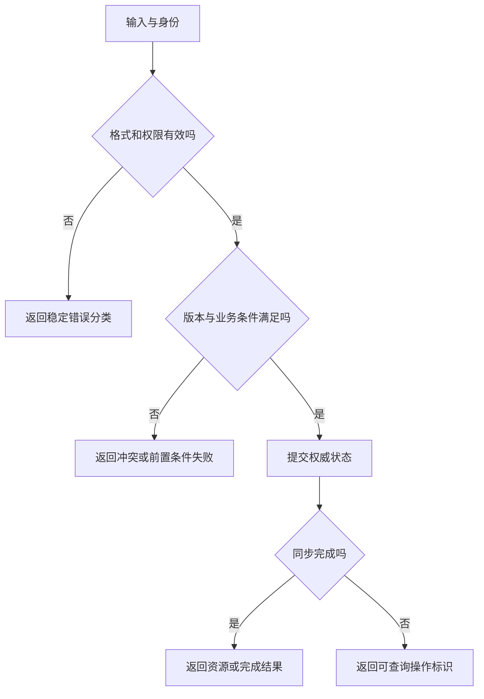

# HTTP、API 与接口契约

> 面向设计、调用和验收接口的开发者。读完能把传输语义、数据结构和业务承诺写成可检查的契约，正确使用方法、状态、缓存与错误，并识别类型文件没有覆盖的兼容与重试边界。

## 接口契约比一个 URL 更完整

**HTTP**（Hypertext Transfer Protocol）定义请求、响应及其语义。**API**是供程序使用的能力接口，既可以基于 HTTP，也可以通过进程内调用或其他协议。**接口契约**包括输入、输出、前置条件、错误、身份权限、副作用与兼容规则。字段名称相同，不代表双方对字段含义达成一致。

例如 `count` 是当前页数量、总数量还是有效数量，`time` 是 UTC 时间点还是当地日期，`status` 是操作阶段还是资源状态，都应写清。前端和后端共享类型能减少拼写差异，但运行时传来的数据仍需在可信边界校验，类型系统不会自动证明外部数据真实。

接口首先服务于明确任务。批量更新、导出和查询的结果语义不同，不应为了统一格式隐藏关键差异。本文讨论 HTTP 契约；业务规则与数据不变量分别由[状态机](/software/backend/business-state-machines)和[数据模型](/software/data/data-models)承担。

## 方法表达调用者可以依赖的语义

**安全方法**是按定义不请求改变服务端资源状态的方法，GET 和 HEAD 属于这一类；服务端仍可记录日志。**幂等方法**是相同请求重复执行时，对服务端预期效果相同，不要求每次响应内容和状态码完全一样。GET、PUT、DELETE 等具有相应语义，POST 并不天然幂等。[RFC 9110 方法语义](https://www.rfc-editor.org/rfc/rfc9110.html#section-9)

GET 不应触发删除或修改，链接预取、缓存和重试都可能调用它。PUT 通常针对目标资源的替换语义，局部修改可以另定义 PATCH 契约；不能把所有更新都包装成 POST 而不说明重试规则，也不能看到 PUT 就假定任意外部副作用天然去重。

| 目标 | 方法候选 | 契约要点 |
| --- | --- | --- |
| 读取对象或列表 | GET | 筛选、可见性、缓存和分页 |
| 创建由服务端分配标识的对象 | POST | 新资源位置、重复提交与未知结果 |
| 按已知标识替换资源 | PUT | 是否允许创建、完整替换范围 |
| 删除目标资源 | DELETE | 重复删除含义、软删和保留规则 |
| 启动长任务 | POST 并按约定返回 202 | 操作 ID、查询、失败和过期 |

URI 组织可以体现资源，但使用名词路径不自动构成完整 REST 架构。对命令型业务，清楚表达动作与状态条件，比强行把所有动作解释成增删改查更可维护。

## 状态码与业务错误要互相支持

2xx 表示对应成功语义，201 可用于已创建，202 表示已接受但处理未完成，204 没有响应正文。4xx 通常描述请求方相关问题，5xx 描述服务器未能履约。具体选择应结合标准含义与接口约定，不要统一返回 200 再要求每个客户端猜测隐藏失败。

401 需要结合认证挑战语义使用，403 表示拒绝执行；404 既可能是不存在，也可以在特定策略中隐藏对象存在性。409 可表示与当前状态冲突，412 对应前置条件失败。客户端处理应依赖稳定错误分类，不能把用户可读文字当成程序判断代码。

**Problem Details**是 RFC 9457 定义的 HTTP API 错误表达方式，使用 `type`、`title`、`status` 等成员，并允许扩展。它不是必须使用的唯一格式，但提供了可复用基础；采用后仍须明确类型 URI、字段错误结构和不泄露内部信息的边界。[RFC 9457](https://www.rfc-editor.org/rfc/rfc9457.html)

## 将一次写入画成完整契约



例如虚构文档更新接口可以要求 `If-Match` 对应此前读取的 ETag，防止旧编辑无声覆盖新版本。**ETag**是资源表示的验证标识，不应随意当成全局业务版本；强弱验证及适用方法要按 HTTP 规则和实现核对。服务端原子检查前置条件并更新，客户端自行比较两个字符串不足以防并发。

下面的报文是协议设计示意，未实际调用，标签值不代表测得或生成的真实资源。

```http
PUT /documents/42 HTTP/1.1
Content-Type: application/json
If-Match: "version-7"

{"title":"虚构资料标题","content":"示例正文"}
```

契约要规定对象不存在、标签不匹配、输入无效、保存成功与响应丢失时的处理。所有这些条件都影响客户端行为，不能只提供一份成功 JSON。

## 缓存、分页与重复请求

**HTTP 缓存**复用已保存的响应，是否可复用取决于新鲜度、验证、请求与响应规则。`no-cache` 允许存储但要求适当验证后使用，`no-store` 要求避免存储相应内容，二者含义不同。`private` 与 `public` 影响共享缓存范围，不能用来替代权限判断。[RFC 9111](https://www.rfc-editor.org/rfc/rfc9111.html)

响应因请求头变化时要考虑 `Vary`，个性化响应要明确共享与私有边界。改造缓存之前应记录旧新鲜度要求：对象编辑后必须读到当前状态的路径，与可短暂过时的公共目录有不同承诺。缓存命中率高也不能证明返回的是正确主体的数据。

分页必须有稳定顺序。偏移分页实现简单，但数据变化与深分页可能造成重复、遗漏与高成本；游标分页要定义排序键、并列项、方向、有效期和筛选绑定。游标应被当成服务端验证的输入，不应让客户端任意改写底层查询。是否保证跨页快照一致也应独立说明。

写入超时可能是未执行、已执行或仍在执行。对非天然幂等的命令，可定义应用幂等键，规定主体范围、载荷一致性、并发请求、结果保留与过期后的行为。本文不把某个草案头名称当成通用已部署标准；具体设计见[消息与幂等](/software/backend/messages-jobs-idempotency)。

## 结构文档如何变成验证证据

**OpenAPI**是描述 HTTP API 的规范，可表达路径、参数、请求体、响应与安全方案。本文核验 3.1.1 版本，不能默认其他版本的 Schema 语义完全一致。生成客户端与文档能够减少同步成本，但文档中写了权限，不代表处理器实际执行权限。[OpenAPI 3.1.1](https://spec.openapis.org/oas/v3.1.1.html)

设计时为必需字段、空值、缺失、长度、数值范围、枚举和日期语义分别规定规则。新增枚举成员可能让旧客户端的穷尽判断失败，新增响应字段也可能被严格解析器拒绝。“只是新增”并不一定向后兼容。应保留消费者范围和版本演进策略。

| 验证层 | 适合检查 | 不能独立保证 |
| --- | --- | --- |
| Schema 校验 | 数据结构、必需项和范围 | 数据来源、权限与状态规则 |
| 契约测试 | 消费者与提供者对格式的预期 | 所有业务分支和运行环境 |
| 集成验证 | 真实调用与依赖行为 | 高负载和全部故障条件 |
| 业务验收 | 任务和不变量 | 未覆盖路径的通用正确性 |

对虚构文档接口，可测试直接未认证请求、对象越权、旧版本更新、空正文、错误媒体类型和重复提交，并读取权威状态。本文未执行这些测试；验收记录应注明实际版本与结果，避免把规范例子记成通过证据。

## 常见误区与边界

CORS 控制浏览器跨源共享及某些请求的预检，简单请求可能先被服务器处理而响应不可读；它不能代替接口授权。严格来源限制与必须的自定义头可在特定 API 中参与 CSRF 防护，仍要核对整个请求路径。共享类型不替代运行时校验，请求返回 200 不证明业务结果合理，重试也不代表首次操作没有完成。发生问题时先读方法、状态、头和实际正文，再进入业务与存储边界。

## 兼容演进要面向真实消费者

接口变更前要列出浏览器版本、后台任务、第三方调用和生成客户端等消费者。服务端可以同时支持旧新字段并给出迁移期，但应定义冲突时采用哪一项，避免调用者同时传两项而结果由解析顺序决定。删除字段与改变单位应作为语义变化审查，不能只比较 JSON 形状。

文档中的示例应覆盖边界值，注明哪些是可选、哪些可以为空，以及未知枚举如何处理。消费者缓存或脱机工作可能在新版本发布后仍发送旧载荷，期限与错误反馈应明确。发布时保留实际输入、返回与权威结果的对应证据，才能证明兼容承诺覆盖现存调用者。

错误分类还要规定可公开信息。对象不存在与无权访问是否采用相同表现，应由产品安全边界决定；诊断关联 ID 可以帮助维护人员定位，但不能让普通调用者取得内部堆栈、数据库语句或秘密。反馈应足以修正合法输入，同时保持必要隔离。

生成文档要与实际路由对应，保留契约版本并检查发布产物。代码更新了某个字段而文档仍描述旧语义，会使消费者按错误规则实现。契约变更应作为交付的一部分被审查。

## 参考资料

<Refs>

- [RFC 9110：HTTP Semantics](https://www.rfc-editor.org/rfc/rfc9110.html) · [RFC 9111：HTTP Caching](https://www.rfc-editor.org/rfc/rfc9111.html)（访问日期 2026-10-03）
- [RFC 9457：Problem Details for HTTP APIs](https://www.rfc-editor.org/rfc/rfc9457.html)（访问日期 2026-10-03）
- [OpenAPI Specification 3.1.1](https://spec.openapis.org/oas/v3.1.1.html) · [WHATWG：Fetch](https://fetch.spec.whatwg.org/)（访问日期 2026-10-03）
- 站内相关：[服务生命周期](/software/backend/service-lifecycle) · [认证与权限](/software/backend/authentication-authorization) · [组件与表单](/software/frontend/components-state-routing)

</Refs>
