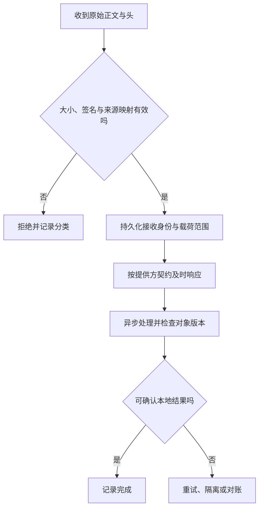

# 第三方集成与 Webhook

> 面向接入外部 API 和事件回调的开发者。读完能建立可信输入与本地业务之间的适配边界，处理验签、重复、乱序、限流和未知结果，并用对账恢复网络交互没有覆盖的缺口。

## 外部系统是独立的故障与版本边界

**第三方集成**是应用使用独立系统的能力或事实。外部 API 有自己的身份、权限、限额、版本和可用性，不能因为正常请求总能成功就当作本地函数。**Webhook**是提供方通过 HTTP 向已登记端点推送事件的机制，它降低持续轮询需求，但不能默认保证不丢、只到一次或按顺序到达。

**适配层**将外部字段、错误和身份映射为内部明确模型。业务模块应依赖“文档同步结果”之类的本地契约，而不直接散落解析提供方载荷。这样更换提供方或处理版本变化时，可以控制影响范围；适配层也不能隐瞒信息，将所有异常都改成“失败”会失去恢复依据。

外部系统返回的信息是来源事实，不一定是本地权限。一个合法签名事件表示它来自持有相应秘密或密钥的一方，不代表事件中的对象应该属于当前账号。仍须验证订阅、外部账号、对象映射和允许事件类型。

## 先写一份接入契约

至少明确使用哪些端点、凭据范围、请求超时、重试与幂等、Webhook 事件类型、版本固定方式、处理状态、对账和退出。对提供方的限制，应链接实际文档并标明核验范围；其他平台的行为不能套用。

| 维度 | 必须回答的问题 | 可审计产物 |
| --- | --- | --- |
| 身份与账号 | 凭据代表谁，允许哪些资源 | 权限范围与账号映射 |
| 请求结果 | 哪些错误可重试，超时是否未知 | 错误分类与操作记录 |
| 事件送达 | 重复、顺序和重投规则是什么 | 接收表、去重与恢复流程 |
| 版本 | 输入结构何时改变 | 固定版本与兼容样本 |
| 退出 | 怎样停订阅与回收秘密 | 停用与数据保留约定 |

回调 URL 不应携带秘密，外部凭据不能进浏览器包、日志或仓库。服务需要安全保存和轮换凭据，权限取满足任务的最小范围。轮换时要考虑在途事件仍使用旧秘密，按照提供方支持的机制规划过渡。

## 验签必须发生在正确输入上

**HMAC**是使用共享秘密计算消息认证码的机制。GitHub Webhook 使用 `X-Hub-Signature-256` 携带基于秘密与载荷的 HMAC-SHA256。官方要求按未被改写的载荷验签，并建议常量时间比较，避免普通比较的时序问题。[GitHub 验签](https://docs.github.com/en/webhooks/using-webhooks/validating-webhook-deliveries)

先解析 JSON 再重新序列化，会改变空白、属性顺序或编码，不能保证字节等于签名输入。框架和代理应保留正确原始正文，并约束长度。签名头缺失、格式错误、未知密钥或算法不匹配，都应按契约拒绝；不能因为解码成功就跳过验签。

有些提供方把时间戳也纳入签名，可校验允许时间窗口以限制重放；具体输入、编码和窗口必须按该提供方协议执行。GitHub 的交付 ID 与 Stripe 的事件 ID 不同，不应把某一家头名称变成通用规范。验签不能取代业务去重，攻击重放与合法重投都可能包含有效签名。

持久化再确认可以缩小“已回应却没有保存工作”的窗口。响应时间与状态仍必须满足提供方契约：例如 GitHub 官方要求在收到后 10 秒内给出 2xx，并建议异步处理。这个数值只适用于其文档约定，不是全部 Webhook 的共同限制。[GitHub 最佳实践](https://docs.github.com/en/webhooks/using-webhooks/best-practices-for-using-webhooks)

## 重复与乱序需要不同机制

**去重**识别已经处理的事件，通常以提供方、账号与事件 ID 建立唯一边界。**顺序控制**判断事件是否比本地已应用事实更新；仅去重不能防止旧事件晚到，把新状态覆盖成旧状态。不能用“收到的时间较晚”证明事实更新。

Stripe 文档明确不保证事件生成顺序对应送达顺序，并提示以事件 ID 识别重复，必要时通过 API 取得对象。本文只使用这些送达机制作为公开例子，不扩展为支付案例。[Stripe Webhook](https://docs.stripe.com/webhooks) 对其他提供方，应查版本号、序号与重新查询能力，不能任意用秒级时间戳推断严格顺序。

对于虚构文档同步，事件若有可信单调版本，可只应用更新版本；若只含“对象已变更”通知，可以重新查询外部对象并按本地规则更新。查询可能受权限、删除和最终一致性影响，应明确无法取得对象时如何保留待处理状态。

接收记录与业务结果最好原子协调，防止写入“已处理”后实际更新失败。跨系统动作仍需要幂等和未知结果处理。事件重放也应复用原身份，重放一个事件不应把它当成新业务动作。

## 主动请求、限流与隔离

主动调用外部 API 时应设置连接与请求预算，并限制并发。遇到提供方限流，可依据明确响应和 `Retry-After` 等契约安排重试，不能每个调用层都独立重试，造成数量放大。重试总期限与业务窗口也要一致。

**熔断**是在依赖持续失败时暂时限制调用并探测恢复的机制；**隔离**是把依赖的资源消耗限制在独立范围。它们改善故障传播，不证明任务已经成功。被限制的工作需要排队、降级或明确失败，不能悄悄丢弃。

向外发送写入超时后，要先判断提供方是否支持幂等键或结果查询。若不能确认，保存外部操作身份和未知状态，进入对账或人工处理。无依据地换新 ID 重试会产生重复外部效果。外部调用最好不在持有数据库锁的长事务中等待，避免网络波动拖住内部资源。

## 对账填补事件链路的缺口

**对账**是在约定时间和范围内比较本地与外部权威事实，发现缺失和不一致并修正。它不是把所有历史重新下载一遍，而是依据水位、版本、时间窗口或业务身份建立可追踪批次。需要处理分页、删除标记、重复读取和中途中断。

GitHub 文档建议服务恢复后重投漏掉的 Webhook，并说明重投保留原 `X-GitHub-Delivery`。因此去重与重投要能协调：已完成事件复用结果，未完成事件可继续处理，不能把“收到过”直接等同于“已经完成”。

对账动作也要经过业务规则，不能绕过权限与状态机直接改库。保持差异清单、修正依据和最终结果，才能解释恢复后的状态。数据保留应只包括必要内容；完整外部载荷长期保存可能包含不需要的敏感字段。

## 验证与常见故障

本文没有运行接入。可用提供方公开样本或虚构样本设计原始字节改变、错误秘密、重复 ID、乱序版本、处理崩溃、重投和限流场景。验证最终本地状态与接收记录，既检查安全拒绝，也检查合法失败能恢复。

| 失败模式 | 原因 | 修正证据 |
| --- | --- | --- |
| 验签间歇失败 | 正文被解析、代理或编码改写 | 比较验签输入与实际原始字节 |
| 已回应却丢事件 | 确认先于可靠接收 | 持久化与故障注入记录 |
| 新状态倒退 | 只去重、不处理顺序 | 版本判断或重新查询策略 |
| 重投没有恢复 | 将接收当成完成 | 区分 received、processing、done |
| 外部故障耗尽本地池 | 无并发和预算约束 | 隔离、排队与池等待观测 |

集成完成的证据应包括版本、权限范围和恢复路径，而不是只有一条成功回调。接口变化、账号变更或事件类型扩展后，应重新核对映射与边界。

## 适配层需要保留外部语义

内部模型可以简化提供方结构，但不能抹掉必要状态。例如“已接受”“已完成”和“等待外部确认”不应映射成同一个成功。外部错误中有可稳定分类的代码时，应保留映射依据，同时将用户提示与诊断信息分开，避免把内部错误正文直接公开。

停用集成也需要关闭订阅、停止领取、处理在途事件和回收凭据。迟到回调应被识别为已停用范围，而不是重新创建账号或资料。停用后保留哪些操作映射和审计记录，应与数据保留要求一致，才能支持后续对账。

集成观测应按提供方和操作类别聚合，保留响应、接收和处理阶段的差异。回调接收延迟正常而业务积压很老，说明处理链可能失效；只有端点可用率无法揭示这种故障。

## 参考资料

<Refs>

- [GitHub：Validating Webhook Deliveries](https://docs.github.com/en/webhooks/using-webhooks/validating-webhook-deliveries) · [Best Practices](https://docs.github.com/en/webhooks/using-webhooks/best-practices-for-using-webhooks)（访问日期 2026-10-03）
- [Stripe：Webhooks](https://docs.stripe.com/webhooks) · [Idempotent Requests](https://docs.stripe.com/api/idempotent_requests)（访问日期 2026-10-03；提供方示例，不泛化送达规则）
- [RFC 9110：HTTP Semantics](https://www.rfc-editor.org/rfc/rfc9110.html)（访问日期 2026-10-03）
- 站内相关：[消息与幂等](/software/backend/messages-jobs-idempotency) · [服务生命周期](/software/backend/service-lifecycle) · [数据质量与恢复](/software/data/data-quality-recovery)

</Refs>
