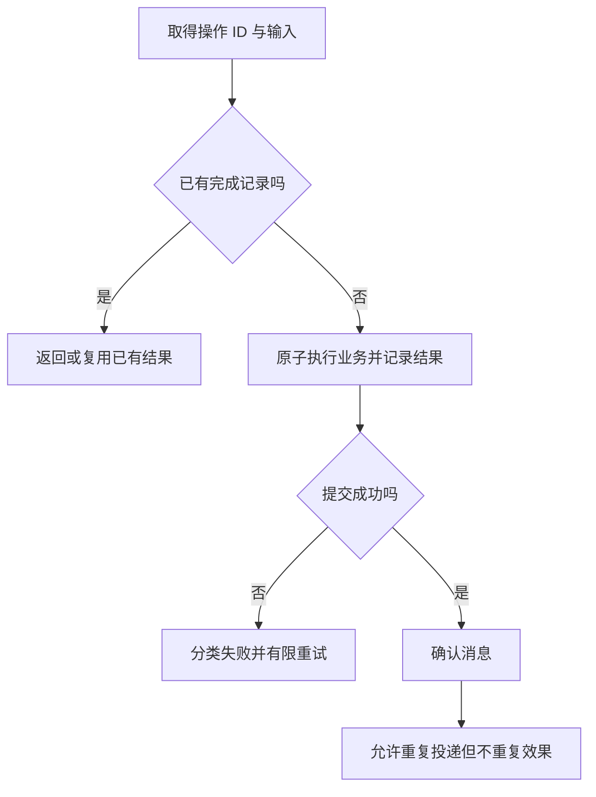

# 消息、任务、调度与幂等

> 面向设计后台处理、定时工作和重试接口的开发者。读完能分清消息送达与业务完成，定义任务身份、幂等边界和重试策略，并在重复、崩溃与调度延迟时保留可恢复的权威状态。

## 从同步调用转向持久工作

**消息**是系统之间传递的数据及其语义，可以表达命令或事件；**任务**是一项需要执行并跟踪结果的工作；**调度**规定何时尝试启动任务。三者可以组合：调度器定期产生清理任务，工作队列传递命令，消费者执行后更新结果。队列不是业务完成记录，调度成功也不等于工作完成。

同步请求适合能在合理预算内得到结果的动作。长导出、批处理和非关键通知可以转为后台工作，但需要操作 ID、状态查询、失败反馈和保留期限。返回 202 只是接受语义，调用者需要知道怎样取得最终结果。把工作放进进程内定时器而不持久化，进程退出后可能完全丢失。

**幂等**（Idempotency）在应用中通常指同一逻辑操作重复处理，产生的预期业务效果与执行一次相同。它不要求只执行一遍代码，也不要求日志和响应完全一样。首先要确定“同一操作”是什么：同一条消息、同一批次还是同一对象的某次动作。

## 确认机制保护哪一段链路

RabbitMQ 的**生产者确认**（Publisher Confirms）覆盖发布者与消息节点之间的交互；**消费者确认**（Consumer Acknowledgements）覆盖消息节点与消费者之间的处理确认。官方明确二者相互独立，发布成功并不能说明消费者完成业务。[RabbitMQ 确认文档](https://www.rabbitmq.com/docs/confirms)

消费者在提交业务之前确认，崩溃后消息可能已被删除；提交之后确认，崩溃窗口可能导致同一消息再次投递。因此可靠处理通常接受重复可能性，并把去重与业务持久化协调起来。**至少一次**意味着可能重复，**至多一次**可能丢失；宣称“恰好一次”必须明确系统范围和外部副作用，不能只引用队列选项。

图中“检查有没有记录”若只是查询后再写，两个消费者仍可同时执行。必须通过唯一约束、条件更新或其他可信协调守住边界。对外部副作用，单数据库原子性不能自动跨越网络。

## 幂等键怎样设计才有意义

**幂等键**是调用方或系统为一次逻辑操作分配的稳定标识。重试应复用同一键，新动作则使用新键。键的范围还要包含主体、业务动作或资源边界，防止不同用户意外碰撞或复用结果。不能简单以请求 JSON 哈希表示操作：相同输入也可能是用户有意再次执行。

服务端需要记录规范化输入摘要、执行状态、结果与时间。相同键和不同载荷应按契约拒绝；并发中的相同操作可以等待、返回处理中或返回明确冲突。保留期到达后结果被清除，重复请求可能重新执行，因此过期与客户端重试窗口必须协调。

Stripe 官方的幂等请求文档展示了一个具体提供方如何保存结果和比较参数；其保留及错误行为不能泛化为所有 API。[提供方幂等约定](https://docs.stripe.com/api/idempotent_requests) 自建接口应独立写清范围，而不是复制一个头名称就宣称保证完整。

| 标识 | 表达什么 | 不能混用的情况 |
| --- | --- | --- |
| 操作 ID | 用户发起的一次逻辑动作 | 不能每次网络重试都重建 |
| 消息 ID | 一项消息身份 | 不一定等于底层业务动作身份 |
| 对象版本 | 某次对象状态 | 不负责所有任务重复去重 |
| 调度批次 ID | 一次计划时刻对应工作 | 不应由实际启动秒数临时决定 |
| 追踪 ID | 关联诊断链路 | 不能默认用作持久业务去重 |

## 事务发件箱连接数据与消息

直接“提交数据库，再发送消息”有丢消息窗口；“先发消息，再提交数据库”会产生不存在事实的通知。**事务发件箱**（Transactional Outbox）是在同一事务保存业务变化与待发布记录，再由另一流程转发。这样提交后至少存在可恢复的发送意图。

Debezium 的 Outbox Event Router 展示从发件箱记录组织事件的机制，事件 ID 与聚合键支持下游处理和路由；它是一个实现选择，不要求所有项目都引入 CDC 平台。[Debezium 发件箱](https://debezium.io/documentation/reference/stable/transformations/outbox-event-router.html) 小系统也可用受控轮询转发，但要管理领取、重试、积压与清理。

转发之后确认前仍可能崩溃，所以发件箱不能消除所有重复。消费者应以业务操作或事件身份去重，并把接收记录与业务结果放在受保护边界。不同对象通常可以并行，同一对象的顺序则需要明确分区、版本或状态判断，不能默认多消费者保持生成顺序。

## 调度不是精准时钟

**Cron**表达周期规则，实际调度受控制器、故障与时间配置影响。Kubernetes 文档说明 CronJob 的启动是近似的，某些情况下可能创建两个 Job 或没有创建 Job，因此任务应幂等。[CronJob](https://kubernetes.io/docs/concepts/workloads/controllers/cron-jobs/) 这一具体机制提醒应用：关键业务不能依赖“每分钟绝对只执行一次”。

重复任务应按计划周期或业务窗口识别批次，规定错过是否补跑、是否允许重叠和最长执行期限。时区与夏令时会改变当地计划含义；“每日当地九点”与“每二十四小时”不是相同要求。调度器触发后，任务自身仍需验证窗口和当前状态。

**租约**是限定时间的工作拥有权，消费者故障后可重新领取。租约过期不保证旧消费者已经停止，必要时要用版本或 fencing token，即让受保护资源拒绝过时拥有者的标识。只是持有一个分布式锁，无法自动防止暂停后恢复的旧进程继续写入。

## 重试、死信与资源约束

**重试**应依据错误分类。临时网络问题可以有限重试，无效输入、永久权限拒绝或确定业务冲突通常不应盲目重试。**指数退避**逐步拉大间隔，**抖动**增加随机分散，降低同一时刻集中请求；具体上限由业务期限、依赖限制与处理成本决定。

**死信**是多次失败或无法处理的消息进入隔离位置，便于诊断与后续处置。它不是自动修复。需要保留错误分类、原始身份、尝试次数和最后时间；重新投入前确认修正原因，并继续复用原业务身份，避免重放制造重复副作用。

队列深度、最老任务年龄、处理延迟和失败率比“消费者进程活着”更能说明工作是否完成。限制并发、领取批次和内存，防止外部依赖变慢后无限积压。进程关闭时应停止领取新工作，对已领取工作有限等待，并按契约恢复或放回。

## 用故障窗口检验设计

对虚构资料索引更新任务，可在数据库提交前、提交后确认前、发件箱转发后和租约过期后分别注入故障。断言最终索引版本正确、同一操作只有一份生效结果，并能解释未完成任务。以下是未执行的验证计划。

| 场景 | 目标证据 | 常见失败 |
| --- | --- | --- |
| 同一消息重复投递 | 结果复用且无重复效果 | 只用内存 Set 去重 |
| 两个消费者同时取得任务 | 唯一或版本边界生效 | 查询再写没有原子保护 |
| 外部调用超时 | 保留未知并可对账 | 立即用新 ID 重发 |
| 调度漏跑后恢复 | 按约定补跑或报告缺失 | 仅看最近一次进程成功 |
| 死信重放 | 继续识别原操作 | 把重放当新业务动作 |

只有把工作身份、权威状态与故障窗口连起来，重试才是可靠机制。队列产品、任务库和调度平台的选择应服务于这些契约，而不是用工具名替代业务完成语义。

## 任务状态是恢复协议的一部分

任务可区分待处理、处理中、已完成、可重试失败与需人工处理，必要时还要有未知结果。状态转换必须有版本和拥有者条件，防止过期消费者把已经完成任务改回失败。进度仅用于表达处理过程，不等同于已提交多少业务效果。

取消任务也应有契约：尚未开始的工作可以停止领取，处理中只能取消支持中断的部分，已经完成的外部效果需要新业务动作修正。用户看到“取消成功”时，应明确取消的是后续执行还是整项业务影响。队列删除一条消息不能替代这些判断。

任务重试还要避免过期工作争用资源。到达业务期限之后，应依据契约取消、标记过期或转人工判断，不能无限循环占据队列。过期也不等于外部操作未发生，未知结果仍需保留原身份进行确认。

## 参考资料

<Refs>

- [RabbitMQ：Consumer Acknowledgements and Publisher Confirms](https://www.rabbitmq.com/docs/confirms)（访问日期 2026-10-03）
- [Kubernetes：CronJob](https://kubernetes.io/docs/concepts/workloads/controllers/cron-jobs/)（访问日期 2026-10-03）
- [Debezium：Outbox Event Router](https://debezium.io/documentation/reference/stable/transformations/outbox-event-router.html) · [Stripe：Idempotent Requests](https://docs.stripe.com/api/idempotent_requests)（访问日期 2026-10-03）
- 站内相关：[业务状态机](/software/backend/business-state-machines) · [第三方集成](/software/backend/integrations-webhooks) · [事务选择](/software/data/transactions-indexes)

</Refs>
