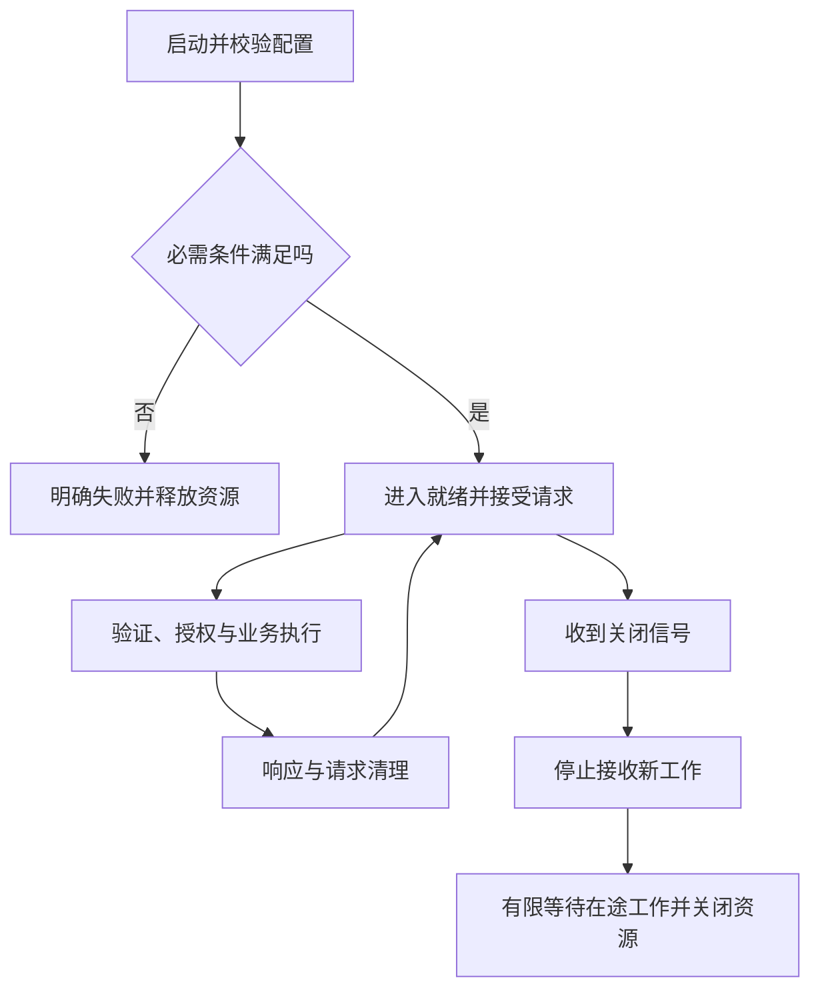

# 服务与请求生命周期

> 面向开发、接管和验收服务端程序的读者。读完能从启动到关闭解释服务如何处理请求，识别请求上下文、超时、取消和资源释放的责任，并区分返回响应、完成业务与客户端收到结果。

## 服务是持续管理资源的运行单元

**服务**是向调用者提供明确能力的运行单元，通常由进程、配置、依赖和接口组成。**请求生命周期**是一次调用从进入、验证、执行、响应到清理的过程；**服务生命周期**还包括启动、就绪、运行与关闭。一个进程已经启动，不代表它具备提供业务的条件。

Web 框架可以隐藏连接和路由细节，但不能消除资源责任。进程需要创建数据库池、装载配置、接受连接、维护限额并释放资源。请求可能在等待、解析或业务执行中失败；这些失败必须能落到明确定义的响应和状态，不能只有成功分支。

服务并不一定要拆成多个微服务。一个进程中的模块也能有清晰职责，拆成网络服务则引入独立发布、通信失败与一致性成本。此处讨论每个服务自身的执行与资源边界；服务间架构见[微服务治理](/cloud/native/microservice)。

## 启动时先建立就绪条件

初始化通常包括解析配置、校验必需项、创建客户端与连接池、注册路由和开始监听。必需秘密缺失时，继续运行到第一条请求才报错会增加诊断成本；可选依赖失效则可以按产品契约降级。关键是把必需与可选关系写明。

**存活**表示进程还在可接受的运行状态，**就绪**表示可以接受相应业务流量。探针若只返回固定成功，会漏掉初始化失败；若每次都深度检查所有外部依赖，又可能把短暂依赖波动扩大成频繁摘除。判断标准应与实际服务能力和故障处理一致。

启动阶段的连接失败通常可以有限重试，但需要总期限与清晰日志。无限循环等待依赖，会让部署既不像失败也无法使用。实例开始接受请求前，应能说明当前配置、版本和依赖是否满足必需条件，日志只记录状态，不输出秘密。

## 请求上下文穿过哪些边界

入口首先约束方法、路径、头、正文类型与大小，然后解码并做结构校验。**中间件**是位于请求处理链中的公共行为，例如关联 ID、认证、日志与限流；顺序会影响结果。Webhook 原始正文验签需要在可能改写正文的解析步骤之前完成，认证后的授权则需要知道可信主体和目标对象。

**请求上下文**是本次调用的关联信息，包括操作 ID、身份、截止时间和诊断信息。它应在调用链中明确传递，避免把当前用户放进进程全局变量。异步并发会使全局“当前请求”指向另一条调用，带来串日志甚至串权限。

业务处理器调用领域规则和数据访问，不宜自行重复解析 HTTP。数据库约束错误、权限失败和未知异常，需要在边界上映射为一致契约。错误处理中必须防止二次发送响应；响应已经开始流出时，不能保证再改为一份完整 JSON 错误，可能需要中断连接并记录原因。[Node.js HTTP](https://nodejs.org/api/http.html)

## 时间预算与取消为什么要贯穿调用

**超时**是在指定时间内没有得到约定结果，**截止时间**是本次操作允许工作的最终时刻。连接超时、请求头超时、正文读取超时、下游调用超时和业务总期限不是同一项设置。仅给 HTTP 连接配超时，不能保证数据库查询自动停止。

假设入口允许的总时间为 T，下游不能各自都等待 T 而无视已花费时间。合理做法是传递剩余预算，为响应和清理留出空间，避免内部串行调用累计超过外部调用者等待范围。具体数值应由任务目标、依赖分布和实测决定，本文不提供通用“最佳秒数”。

取消信号表示调用者不再需要结果或预算耗尽。支持取消的工作可以停止，已经提交的数据不能仅靠取消信号回滚。客户端断开后，服务端可能仍完成写入；取消到达之前已触发的外部动作也可能无法撤销。必须把取消能力与[业务幂等和查询结果](/software/backend/messages-jobs-idempotency)结合。

**背压**（Backpressure）是下游处理变慢时限制上游继续生产的机制。Node.js 流接口通过写入返回值和相关事件等机制协调数据速度；忽略这些信号会把全部输出积压到内存。[Stream 文档](https://nodejs.org/api/stream.html) 大文件导出应考虑流式读取、写入和断开清理，而不是默认一次读取全部数据。

## 请求成功有哪些不同证据

| 阶段 | 可证明什么 | 不能自动证明什么 |
| --- | --- | --- |
| 通过参数校验 | 输入满足结构要求 | 有权限、业务状态允许 |
| 数据库提交成功 | 本次事务按数据库契约完成 | 客户端收到响应、外部通知成功 |
| 响应写入接口完成 | 服务端完成相应写入步骤 | 用户设备已完整读取并采用 |
| 返回 202 | 按接口约定接受处理 | 后台业务已经完成 |
| 客户端重新查询成功 | 该读取路径可见目标状态 | 所有派生副本已同步 |

HTTP 请求响应是两端交换信息的协议，业务完成含义由接口契约定义。[RFC 9110](https://www.rfc-editor.org/rfc/rfc9110.html) 对重要写入应让操作可查询，并给出稳定关联信息。返回前断网造成“提交成功但调用者未知”，是正常需要设计的故障窗口，不能只当偶然异常。

## 并发与关闭中的资源纪律

运行时线程或事件循环负责调度，不保证任意业务计算都适合放在请求处理路径。Node.js 官方说明长回调会妨碍其他请求获得执行机会；异步函数中的大循环仍是同步工作。重计算可以转到专用工作单元，但排队长度、并发上限和取消能力仍需管理。[避免阻塞事件循环](https://nodejs.org/learn/asynchronous-work/dont-block-the-event-loop)

每项资源应该有拥有者与释放位置。数据库连接获取后，在成功、失败与取消路径都要归还；事务不能在请求已经结束后长期悬挂。响应流、文件句柄、定时器与订阅也需要清理。资源泄漏的表现常是运行一段时间后才变慢，单次请求测试容易遗漏。

**优雅关闭**是在停止接收新工作后，给在途工作有限完成机会，再关闭资源。它不保证永远等待所有工作；必须设总期限并记录未完成操作。长连接、队列消费者与普通请求的退出规则可以不同，后台任务需要明确重投或恢复机制。关闭过程不能先销毁数据库池，再让仍在执行的请求继续用它。

## 可审计的故障演练

以虚构报告导出服务为例，可设计断开下载、数据库变慢、正文超大、池耗尽和关闭期间新请求等场景。记录入口时间、排队、依赖执行、输出阶段和资源状态，判断每条失败是否释放资源。本文没有运行服务，以下为验证计划。

| 场景 | 应观察的结果 | 失败线索 |
| --- | --- | --- |
| 客户端中途断开 | 可取消部分停止并释放资源 | 导出持续增长、连接不归还 |
| 下游超过预算 | 返回明确错误或可查询状态 | 请求卡住且无人知道在哪等待 |
| 高并发超过容量 | 有限排队或拒绝 | 无界队列导致内存上涨 |
| 关闭期间在途写入 | 按期限完成或留下恢复证据 | 日志称退出成功但状态未知 |
| 未知异常 | 统一响应、关联诊断、不泄密 | 返回堆栈或重复发送响应 |

验收记录需要保留版本、配置和注入条件。生命周期管理与部署探针相连，但不由某种部署平台自动完成；请求规则、资源限额与恢复语义仍属于应用责任。

## 健康日志应反映阶段

请求日志可以记录接收、验证、依赖等待、提交和响应的关键阶段，保留稳定关联 ID。不要每个阶段都记录完整正文；阶段时间和错误分类通常更有诊断价值。记录响应状态时还要说明是服务端选择的状态，不能直接推断客户端已经采用结果。

启动、关闭与请求日志的字段应能关联到同一应用版本。关闭期间若仍有任务在执行，记录其操作身份与最终处置，帮助下一实例恢复。只留下“服务启动成功”“服务关闭成功”两句话，无法解释中间未完成写入和资源等待。

资源创建失败也需要清理已经创建的部分。例如连接池成功而监听失败，应关闭连接池并报告启动阶段；只在正常退出分支释放，会使失败重启保留资源或连接。初始化与关闭最好能按相反依赖顺序解释。

## 参考资料

<Refs>

- [Node.js：HTTP](https://nodejs.org/api/http.html) · [Stream](https://nodejs.org/api/stream.html)（访问日期 2026-10-03；关注生命周期机制，默认参数须按部署版本核对）
- [Node.js：Don't Block the Event Loop](https://nodejs.org/learn/asynchronous-work/dont-block-the-event-loop)（访问日期 2026-10-03）
- [RFC 9110：HTTP Semantics](https://www.rfc-editor.org/rfc/rfc9110.html)（访问日期 2026-10-03）
- 站内相关：[API 契约](/software/backend/http-api-contracts) · [后端资源管理](/software/backend/backend-frameworks-performance) · [事务选择](/software/data/transactions-indexes)

</Refs>
