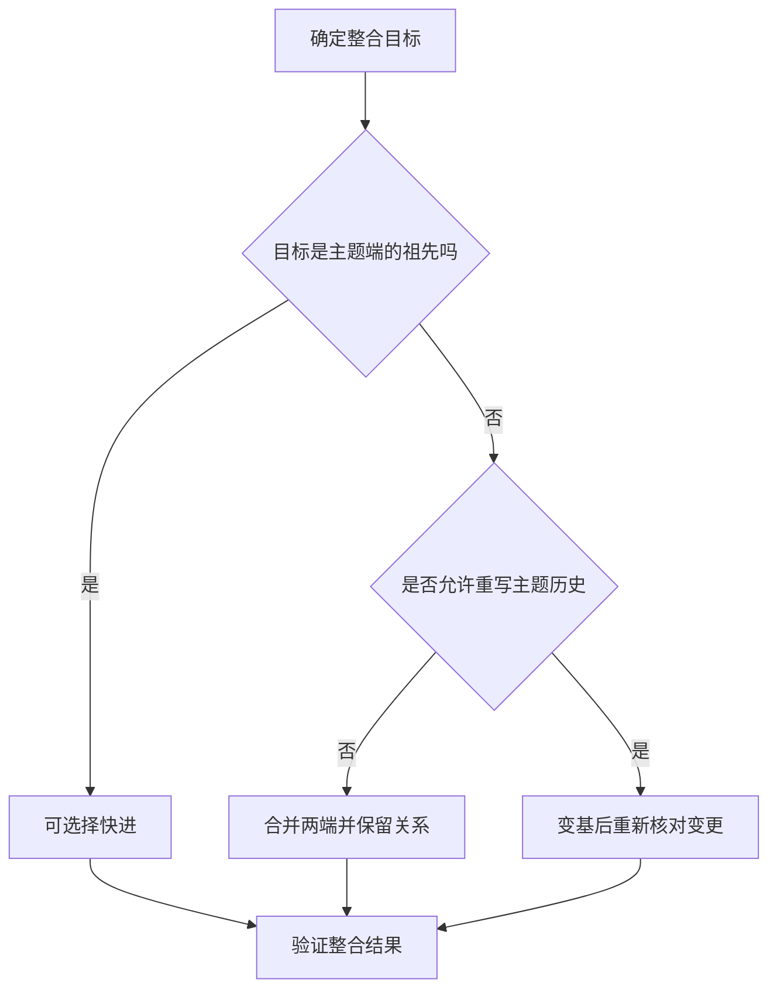

# 分支、合并与冲突策略

> 本文面向需要设计协作方式或处理分支整合的开发者。读完能选择合并与变基，辨认文字冲突和语义冲突，并按发布约束安排分支寿命与修复传播。

## 分支隔离的是变更历史

**分支**（branch）是可移动的提交引用。两个人从同一提交出发，可以独立产生新提交，再将历史整合到共同目标。它隔离开发中的源码变化，但不会自动隔离共享数据库、外部测试账号或部署环境。切换分支后出现异常，有时是旧数据库结构和新代码不匹配，不能只检查源码。

分支名称常表达用途，例如功能、修复或版本维护；名称不会自动实施审批、测试或发布权限。**分支策略**是关于变更从哪里出发、何时整合、谁验证、如何发布和传播修复的协作约定。平台的保护规则是实施这些约定的一部分，具体协作入口见 [Pull Request 工作流](/software/collaboration/pull-request-workflow)。

一个虚构的设备借用系统同时修改“借用期限”和“超期提示”。短时间内完成的小变更，适合在主题分支上形成可审查结果并尽早整合。若两个分支长期独立修改借用规则，整合难度会随假设差异增加；问题不只来自同一行的修改，还来自状态含义和接口契约的分化。

## 合并与变基如何改变历史

**快进**（fast-forward）发生在目标提交是待整合提交的祖先时：目标引用可以直接前移。历史已经包含目标原有工作，无需新建一个合并提交。若两端已经分叉，普通合并会参考两端及共同祖先，生成整合结果，通常留下多个父提交。[Pro Git：基本分支与合并](https://git-scm.com/book/en/v2/Git-Branching-Basic-Branching-and-Merging)

**变基**（rebase）把一条历史中的提交变化重新应用到新的基准上。新基准、父关系等变化通常导致新提交标识。它便于整理本地工作，也会改变他人已经引用的历史。因此，默认应把尚未共享的主题工作作为整理对象；改写共享历史必须有明确约定并协调所有依赖者。[Pro Git：变基](https://git-scm.com/book/en/v2/Git-Branching-Rebasing)

图中“允许”取决于协作约定和历史使用情况。追求直线图形不是充分理由。变基可能逐个提交遇到冲突；合并通常处理端点整合。两者都需要理解规则，最终文件相同也不意味着历史解释相同。

**压缩合并**（squash merge）通常把分支最终变化收成目标上的一个提交，适合保留一次完整变更的结果。它不保留主题分支全部提交的父关系。如果一个长寿分支持续对同一目标做压缩合并，后续比较和整合可能难以解释，通常应为新工作建立新的主题分支，或采用明确的持续整合方式。

## 冲突是需要判断的地方

**文字冲突**是 Git 无法自动确定文件结果的情况。相同行的不同修改只是常见形式；删除与修改、重命名及路径变化也可能需要处理。冲突标记展示两侧内容，合并基点有助于判断各自改变了什么。解决不是选择“看起来更新”的一侧，而是形成满足双方有效意图的新结果。

**语义冲突**是文件可以自动合并，行为却不一致。借用模块把期限从“天数”改为“到期时间”，报表模块仍把该字段作为整数天数处理；修改发生在不同文件，Git 可能顺利合并，运行时才暴露错误。另一类情况是两端分别增加约束，组合后使合法操作全部被拒绝。

处理冲突的可复核顺序是：确认正在进行合并还是变基，记录两端与基点；阅读双方变更目的；判断最终数据与规则应是什么；编辑结果并标记已解决；验证相关组合路径。`git add` 表示把结果放入暂存区并标记冲突已处理，不能证明结果正确。

| 冲突对象 | 判断依据 | 合适的验证 |
| --- | --- | --- |
| 业务条件 | 已确认的领域规则和边界 | 覆盖两端意图及组合后的边界用例 |
| 接口与调用方 | 参数、返回值、失败契约 | 契约检查与相关集成路径 |
| 数据迁移 | 迁移顺序及已有数据状态 | 代表性数据上的升级和兼容检查 |
| 依赖锁文件 | 依赖声明及工具生成规则 | 重新解析并核对依赖变化，复核构建 |
| 生成代码 | 权威输入与生成器版本 | 从确定输入重新生成并检查差异 |

锁文件不能一律选一侧，也不能一律删除后重建：后者可能引入与冲突无关的新版本。先合并声明，再使用项目约定的工具和版本生成，检查最终变化范围。数据库迁移编号没有冲突，也可能争用同一列或要求相反的顺序，需单独验证。

## 按发布约束选择分支寿命

短寿主题分支降低积累差异的时间，前提是团队能持续验证、及时评审并处理未完成行为。功能开关可以把“代码整合”与“对用户开放”分开，但会引入组合状态，需要明确默认值、清理时间和测试范围。

发布维护分支适合已经对外支持、仍需修复的版本。它会增加修复传播和兼容验证成本。分支越多，不等于隔离越可靠：漏掉某个受支持版本的修复，是典型风险。每条维护线都应有负责人、支持期限、允许变化类型和关闭条件。

| 情境 | 可考虑的安排 | 必须具备的条件 |
| --- | --- | --- |
| 单一在线版本，持续交付 | 主线加短寿主题分支 | 快速检查、评审及发布恢复能力 |
| 同时支持多个发行版本 | 主线加明确维护分支 | 修复传播记录和版本兼容验证 |
| 高风险大改动 | 分阶段整合，必要时暂用实验分支 | 阶段边界、整合计划和到期决策 |
| 外部贡献周期较长 | 贡献分支与维护者整合流程 | 基准更新办法和审查责任 |

团队规模不是唯一判断条件。多个小团队共享一个强耦合数据模型，仍可能需要集中整合；单个团队支持多个长期版本，也可能需要维护分支。先确认可发布单位和支持义务，再确定分支布局。

## 修复传播与失败边界

紧急修复从实际受影响版本出发，便于判断补丁在该版本上的效果；随后应记录哪些其他版本也受影响，并传播到主线和仍支持的维护线。可以合并，也可以选择性应用补丁，但选择性应用会形成不同提交，不能仅凭提交标识不同就判断修复缺失。追踪议题、补丁意图和验证结果更可靠。

冲突处理中，`ours` 与 `theirs` 的含义依赖当前操作；变基时其直觉可能与普通合并不同。批量接受“我方”容易抹掉有效变化。应先确认操作状态和文档语义，无法判断时中止操作、保留已有工作，再澄清规则。中止流程也不能代替开始前保存未提交修改。

常见策略失败包括：长期分支没有整合负责人；紧急修复只落在发布分支；合并后沿用整合前的测试结果；为了历史整齐而强制改写共享提交。策略的成效应通过整合等待时间、返工原因和修复遗漏来观察。记录这些现象，才能判断分支约定是否匹配当前协作方式。

## 实例：两个没有文字冲突的规则变化

期限分支新增“设备维护前必须归还”，提示分支新增“延期后重新计算到期日”。自动合并可能成功，但延期计算如果没有考虑维护时间，就会让提示承诺一个规则禁止的日期。审查应把两端条件组合成决策表，再验证维护前、维护时刻和维护后的延期请求。

若其中一条规则尚未确认，不应在解决冲突时偷偷决定优先级。可以先澄清业务规则，再调整计算与提示，使它们使用相同结果。整合说明应记录为何采用新组合，验证应针对整合后的提交，而不是引用两个分支各自通过的旧结果。

这类问题通常难以通过增加冲突工具解决。更早交流契约变化、缩短分支寿命并审查关联路径，可以减少发现时间；但即使分支很短，独立修改的语义也仍需组合判断。

## 参考资料

<Refs>

- [Pro Git：基本分支与合并](https://git-scm.com/book/en/v2/Git-Branching-Basic-Branching-and-Merging)、[变基](https://git-scm.com/book/en/v2/Git-Branching-Rebasing)、[Git restore 的 ours/theirs 说明](https://git-scm.com/docs/git-restore)；访问日期：2026-10-03。
- [分支、审查与合并](/software/guide/branches-review-merge)：协作入门。
- [提交、差异、历史与撤销](/software/collaboration/commits-history-undo)：比较基准和恢复边界。
- [标签、版本与配置基线](/software/collaboration/tags-versions-baselines)：确定维护线对应的发布对象。

</Refs>
